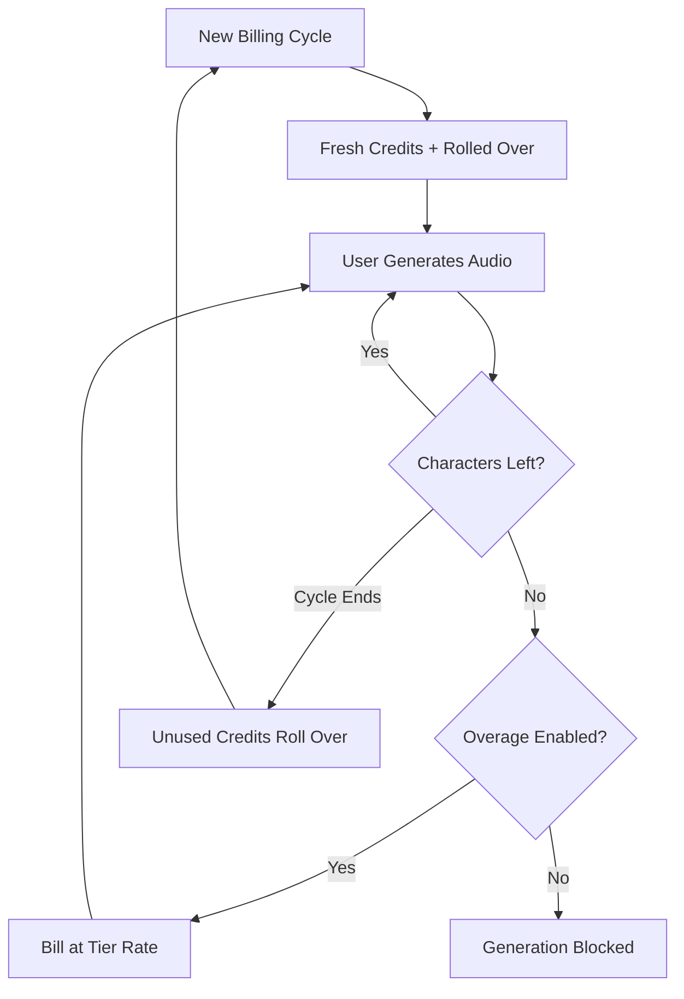

رسّخت ElevenLabs مكانتها المهيمنة في مجال الصوت بالذكاء الاصطناعي من خلال جعل الفوترة لديها مرنة بقدر مرونة توليف الكلام. ويرتكز نموذجها على وحدة قيمة واحدة: الحرف. سواء كنت تنشئ تحويل النص إلى كلام، أو تستنسخ صوتًا، أو تدبلج فيديو، فإنك تستهلك من مجموعة موحّدة من أرصدة الأحرف.

## كيف تُجري ElevenLabs الفوترة

يستخدم هيكل تسعير ElevenLabs حصصًا شهرية ثابتة مرتبطة بمستويات الاشتراك. ومع انتقال المستخدمين إلى مستويات أعلى، يحصلون على عدد أكبر من الأحرف وإمكانية الوصول إلى ميزات أكثر تقدمًا، مثل استنساخ الصوت الاحترافي أو الحقوق التجارية.

| الخطة | السعر | الأحرف/الشهر | معدل الاستخدام الإضافي |
| :--- | :--- | :--- | :--- |
| مجانية | \$0 | 10,000 | غير متاح |
| Starter | \$5/شهر | 30,000 | ~\$0.30/1K حرف |
| Creator | \$22/شهر | 100,000 | ~\$0.24/1K حرف |
| Pro | \$99/شهر | 500,000 | ~\$0.15/1K حرف |
| Scale | \$330/شهر | 2,000,000 | ~\$0.10/1K حرف |

1. **التسعير القائم على الأحرف**: الأحرف هي العملة الموحدة عبر المنصة. وتُخصم أحرف تحويل النص إلى كلام، والدبلجة، واستنساخ الصوت من الرصيد نفسه، ما يبسّط تتبع الاستخدام.
2. **آليات الترحيل**: تُرحّل الأحرف غير المستخدمة إلى دورة الفوترة التالية بدلًا من انتهائها. وتطبّق ElevenLabs حدًا أقصى لمنع التراكم غير المحدود، ما يضمن احتفاظ المستخدمين بقيمة اشتراكهم.
3. **الاستخدام الإضافي المتدرج**: تتم معالجة الاستخدام الإضافي وفقًا لمستوى الاشتراك. تكون هذه الميزة معطّلة افتراضيًا في الخطط الأقل لأغراض السلامة، بينما تسمح المستويات الأعلى برسوم اختيارية للحفاظ على استمرارية الخدمة.

## ما الذي يميز هذا النموذج

تجعل عدة خيارات استراتيجية نموذج فوترة ElevenLabs فعالًا بشكل خاص في الاحتفاظ بالمستخدمين وتشجيعهم على الترقية.

- **ترحيل الأحرف**: تقلل أرصدة الترحيل من القلق المرتبط بعبارة "استخدمها أو اخسرها"، عبر ترحيل الاستثمار غير المستخدم إلى الفترة التالية. ويحافظ ذلك على قيمة الاشتراك حتى خلال فترات انخفاض النشاط.
- **تسعير الاستخدام الإضافي المتدرج**: تنخفض معدلات الاستخدام الإضافي مع زيادة حجم الخطط، ما يخلق حافزًا قويًا للترقية. وغالبًا ما يجد المستخدمون المستويات الأعلى أكثر جاذبية بفضل انخفاض تكلفة الاستخدام الإضافي.
- **الاستهلاك الموحد**: تزيل مجموعة أحرف واحدة لجميع الخدمات العبء الذهني الناتج عن إدارة حصص منفصلة. ولا يحتاج المستخدمون إلا إلى تتبع رقم واحد لفهم سعتهم المتبقية.
- **الاستخدام الإضافي الاختياري**: يمكن للمستخدمين المحترفين تفعيل الاستخدام الإضافي لضمان الاستمرارية، بينما يستفيد المستخدمون العاديون من أمان الحد الأقصى الصارم.



## أنشئ هذا باستخدام Dodo Payments

يمكنك تكرار هذا النموذج المتقدم باستخدام الفوترة القائمة على الأرصدة وقياس الاستخدام في Dodo Payments.

<Steps>
<Step title="Create a Custom Unit Credit Entitlement">
أولًا، عرّف وحدة "Characters" التي ستعمل كعملة لمنصتك.

1. انتقل إلى **Entitlements** في لوحة معلومات Dodo.
2. أنشئ **Credit Entitlement** جديدًا.
3. اضبط **Credit Type** على **Custom Unit**.
4. سمِّ الوحدة "Characters".
5. اضبط **Precision** على 0، لأن الأحرف تكون دائمًا بوحدات كاملة.
6. اضبط **Credit Expiry** على 30 يومًا لمطابقة دورة الفوترة الشهرية.
7. فعّل **Rollover** باستخدام الإعدادات التالية:
    - **Max Rollover Percentage**: ‏100% (يسمح بترحيل جميع الأحرف غير المستخدمة).
    - **Rollover Timeframe**: شهر واحد.
    - **Max Rollover Count**: ‏1 (يمكن ترحيل الأرصدة مرة واحدة، ثم تنتهي صلاحيتها).
</Step>

<Step title="Create Tiered Subscription Products">
أنشئ خمسة منتجات اشتراك. ستربط الاستحقاق نفسه "Characters" بكل منتج، ولكن مع إعدادات مختلفة لكل مستوى.

| المنتج | السعر | الأرصدة/الدورة | الاستخدام الإضافي مفعّل | سعر الاستخدام الإضافي (لكل 1K حرف) |
| :--- | :--- | :--- | :--- | :--- |
| مجانية | \$0/شهريًا | 10,000 | لا | - |
| Starter | \$5/شهريًا | 30,000 | نعم (اختياري) | \$0.30 |
| Creator | \$22/شهريًا | 100,000 | نعم | \$0.24 |
| Pro | \$99/شهريًا | 500,000 | نعم | \$0.15 |
| Scale | \$330/شهريًا | 2,000,000 | نعم | \$0.10 |

عند إرفاق استحقاق الرصيد بكل منتج، ألغِ تحديد **Import Default Credit Settings**. يتيح لك ذلك تعيين **Price Per Unit** المحدد للاستخدام الإضافي في ذلك المستوى. اضبط **Overage Behavior** على **Bill overage at billing**، ثم اضبط **Low Balance Threshold** على 10% من حصة المستوى.
</Step>

<Step title="Create a Usage Meter">
يربط مقياس الاستخدام نشاط تطبيقك بنظام الأرصدة.

1. أنشئ مقياسًا جديدًا باسم `tts.characters`.
2. اضبط **Aggregation** على **Sum**. سيؤدي ذلك إلى جمع خاصية `characters` من كل حدث ترسله.
3. اربط هذا المقياس باستحقاق أرصدة "Characters".
4. اضبط **Meter units per credit** على 1. يضمن ذلك أن كل حرف يُستخدم في تطبيقك يساوي رصيدًا واحدًا يُخصم من الرصيد المتاح.
</Step>

<Step title="Send Usage Events">
ادمج تتبع الاستخدام في كود تطبيقك. في كل مرة ينشئ فيها مستخدم صوتًا، أرسل حدثًا إلى Dodo.

```typescript
import DodoPayments from 'dodopayments';

async function trackGeneration(
  customerId: string,
  text: string, 
  service: 'tts' | 'dubbing' | 'cloning'
) {
  const characterCount = text.length;

  const client = new DodoPayments({
    bearerToken: process.env.DODO_PAYMENTS_API_KEY,
  });

  await client.usageEvents.ingest({
    events: [{
      event_id: `gen_${Date.now()}_${Math.random().toString(36).slice(2)}`,
      customer_id: customerId,
      event_name: 'tts.characters',
      timestamp: new Date().toISOString(),
      metadata: {
        characters: characterCount,
        service: service,
        voice_id: 'voice_abc123'
      }
    }]
  });
}
```

</Step>

<Step title="Handle Low Balance and Overage">
استخدم webhooks لإبقاء المستخدمين على اطلاع باستخدامهم للأحرف.

```typescript
import DodoPayments from 'dodopayments';
import express from 'express';

const app = express();
app.use(express.raw({ type: 'application/json' }));

const client = new DodoPayments({
  bearerToken: process.env.DODO_PAYMENTS_API_KEY,
  webhookKey: process.env.DODO_PAYMENTS_WEBHOOK_KEY,
});

app.post('/webhooks/dodo', async (req, res) => {
  try {
    const event = client.webhooks.unwrap(req.body.toString(), {
      headers: {
        'webhook-id': req.headers['webhook-id'] as string,
        'webhook-signature': req.headers['webhook-signature'] as string,
        'webhook-timestamp': req.headers['webhook-timestamp'] as string,
      },
    });

    switch (event.type) {
      case 'credit.balance_low':
        await notifyUser(event.data.customer_id, 
          'You are running low on characters. Consider upgrading your plan for more characters and lower overage rates.'
        );
        break;
      case 'credit.deducted':
        await logUsage(event.data);
        break;
      case 'credit.overage_charged':
        await notifyUser(event.data.customer_id,
          'You have exceeded your character quota. Overage charges will appear on your next invoice.'
        );
        break;
    }

    res.json({ received: true });
  } catch (error) {
    res.status(401).json({ error: 'Invalid signature' });
  }
});
```

</Step>

<Step title="Create Checkout">
عندما يصبح المستخدم مستعدًا للاشتراك، أنشئ جلسة checkout للمستوى المختار.

```typescript
const session = await client.checkoutSessions.create({
  product_cart: [
    { product_id: 'prod_elevenlabs_pro', quantity: 1 }
  ],
  customer: { email: 'creator@example.com' },
  return_url: 'https://yourapp.com/dashboard'
});
```

</Step>
</Steps>

## تسريع التنفيذ باستخدام مخطط Stream Ingestion

لتتبع مخرجات الصوت إلى جانب الفوترة القائمة على الأحرف، يوفّر [Stream Ingestion Blueprint](/developer-resources/ingestion-blueprints/stream) طريقة مبسطة لقياس استهلاك النطاق الترددي.

```bash
npm install @dodopayments/ingestion-blueprints
```

```typescript
import { Ingestion, trackStreamBytes } from '@dodopayments/ingestion-blueprints';

const ingestion = new Ingestion({
  apiKey: process.env.DODO_PAYMENTS_API_KEY,
  environment: 'live_mode',
  eventName: 'tts.audio_bytes',
});

// After generating audio, track the output size
const audioBuffer = await generateSpeech(text, voiceId);

await trackStreamBytes(ingestion, {
  customerId: customerId,
  bytes: audioBuffer.byteLength,
  metadata: {
    voice_id: voiceId,
    service: 'tts',
    format: 'mp3',
  },
});
```

استخدم Stream Blueprint لتتبع النطاق الترددي للصوت إلى جانب نظام الأرصدة القائم على الأحرف. يمنحك ذلك رؤية واضحة للتكاليف الفعلية للبنية التحتية لكل عملية إنشاء.

<Tip>
يدعم Stream Blueprint أيضًا التجميع للسيناريوهات ذات الحجم الكبير. راجع [وثائق المخطط الكاملة](/developer-resources/ingestion-blueprints/stream) للاطلاع على أنماط الاستخدام المتقدمة.
</Tip>

## حافز الترقية: تسعير الاستخدام الإضافي المتدرج

يتمثل الجزء الأكثر تميزًا في نموذج ElevenLabs في طريقة استخدامه لمعدلات الاستخدام الإضافي لدفع المستخدمين إلى الترقية. فمن خلال جعل تكلفة كل حرف أقل في المستويات الأعلى، يغيّر النموذج النقاش من "ما المقدار الذي أحتاج إليه؟" إلى "كم يمكنني أن أوفّر؟".

| المستوى | الأحرف المضمنة | الاستخدام الإضافي (لكل 1K) | التكلفة الفعلية عند 500K حرف |
| :--- | :--- | :--- | :--- |
| Creator | 100,000 | \$0.24 | \$22 + (400 * \$0.24) = \$118 |
| Pro | 500,000 | \$0.15 | \$99 (من دون استخدام إضافي) |

يدفع المستخدم الذي يستهلك بانتظام 500,000 حرف ضمن خطة Creator مبلغ \$118 شهريًا، شاملًا الاشتراك والاستخدام الإضافي. تؤدي الترقية إلى خطة Pro إلى تغطية الاستخدام نفسه مقابل \$99، ما يوفّر \$19 شهريًا. ويعني انخفاض معدل الاستخدام الإضافي في المستويات الأعلى أنه مع نمو الاستخدام، تصبح الترقية القرار المالي الواضح.

باستخدام Dodo Payments، يمكنك تنفيذ ذلك عبر إلغاء تحديد مربع **Import Default Credit Settings** عند إرفاق الأرصدة بمنتجات الاشتراك. ويمنحك ذلك تحكمًا كاملًا في **Price Per Unit** لكل مستوى محدد، ما يتيح لك مكافأة العملاء الأعلى إنفاقًا بأفضل الأسعار.

## ميزات Dodo الأساسية المستخدمة

<CardGroup cols={2}>
  <Card title="Credit-Based Billing" icon="coins" href="/features/credit-based-billing">
    إدارة حصص الأحرف وعمليات الترحيل وانتهاء الصلاحية.
  </Card>
  <Card title="Subscriptions" icon="calendar" href="/features/subscription">
    إعداد المستويات المتكررة التي توفّر مخصصات شهرية من الأحرف.
  </Card>
  <Card title="Usage-Based Billing" icon="chart-line" href="/features/usage-based-billing/introduction">
    تتبع استهلاك الأحرف في الوقت الفعلي عبر خدماتك.
  </Card>
  <Card title="Event Ingestion" icon="bolt" href="/features/usage-based-billing/event-ingestion">
    إرسال بيانات الاستخدام كبيرة الحجم إلى Dodo بأقل زمن استجابة.
  </Card>
  <Card title="Webhooks" icon="webhook" href="/developer-resources/webhooks/intents/credit">
    الاستجابة للأرصدة المنخفضة وأحداث الاستخدام الإضافي في الوقت الفعلي.
  </Card>
  <Card title="Stream Ingestion Blueprint" icon="tower-broadcast" href="/developer-resources/ingestion-blueprints/stream">
    تتبع النطاق الترددي لبث الصوت للفوترة القائمة على الاستخدام.
  </Card>
</CardGroup>
