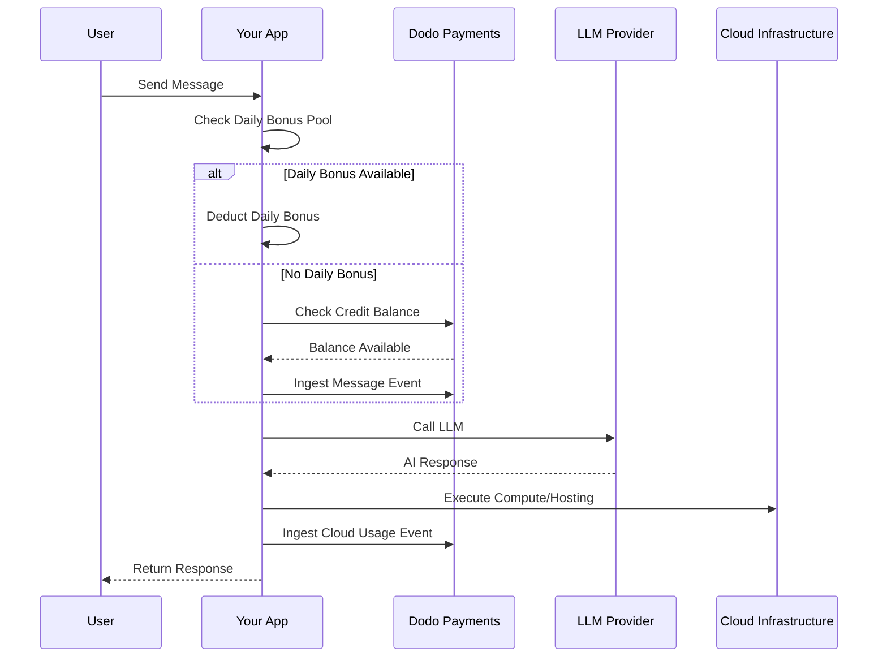

محبوب (lovable.dev) هو منشئ تطبيقات ويب بالذكاء الاصطناعي يستخدم نموذج اشتراك قائم على الائتمان. على عكس الأنظمة المعتمدة على الرموز، يبسط محبوب تجربة المستخدم بتكلفة ائتمان واحد لكل رسالة. يجمع هذا النموذج بين رصيد شهري من الائتمان وقطرات مكافآت يومية لتشجيع المشاركة المستمرة مع السماح بالاستخدام المتزايد.

## نموذج الفوترة لمحبوك

تم بناء تسعير محبوب حول أرصدة الرسائل والفوترة المحسوبة بشكل منفصل للبنية التحتية السحابية.

| الخطة | السعر | أرصدة شهرية | مكافأة يومية | الميزات الرئيسية |
| :--- | :--- | :--- | :--- | :--- |
| مجانية | $0/شهر | 0 | 5/يوم (حتى 30/شهر) | مشاريع عامة فقط |
| احترافية | $25/شهر | 100 | 5/يوم (حتى 150/شهر) | شحن فوري، سحابة + ذكاء اصطناعي معتمد على الاستخدام، نطاقات مخصصة |
| عمل | $50/شهر | 100 | 5/يوم | SSO، مساحة عمل الفريق، قوالب تصميم، مركز الأمان |
| مؤسساتي | مخصص | مخصص | مخصص | SCIM، دعم مخصص، سجلات تدقيق |

- **اشتراك قائم على الائتمان**: 1 ائتمان = 1 رسالة/طلب إلى الذكاء الاصطناعي.
- **الأرصدة مشتركة بين عدد لا محدود من المستخدمين**: حوض فريق غير مقيد بعدد المقاعد.
- **الأرصدة تعيد تعيين نفسها كل دورة فوترة**: تتجدد الأرصدة الشهرية عند التجديد.
- **شحن ائتماني عند الطلب**: يمكن للمستخدمين شراء مزيد من الأرصدة إذا نفدت.
- **فوترة سحابة + ذكاء اصطناعي بمعايير استخدام منفصلة**: فوترة محسوبة للاستضافة والحساب.
- **تنتهي مكافآت الائتمان اليومية كل يوم**: تنقيط يومي قابله للاستخدام أو الفقدان بمقدار 5 أرصدة.

## ما يجعله فريدًا

- **بساطة تعتمد على الرسائل**: 1 ائتمان = 1 رسالة بغض النظر عن التعقيد. لا يوجد حساب للرموز أو ترجيح للنموذج.
- **تنقيط يومي + حوض شهري هجين**: 5 أرصدة مكافآت يومية تخلق حافزًا للمشاركة اليومية، بينما 100 ائتمان شهري تسمح بالاستخدام المتزايد.
- **حوض مشترك لفريق بالكامل**: أرصدة مشتركة بين عدد غير محدود من المستخدمين بسعر فريق ثابت، وليس لكل مقعد.
- **فوترة بطبقتين**: أرصدة لتفاعلات الذكاء الاصطناعي + فوترة محسوبة بشكل منفصل للبنية التحتية السحابية.

## بناء هذا باستخدام دفعات دودو

يمكنك تكرار النموذج الهجين لمحبوب باستخدام امتيازات الائتمان ومقاييس استخدام دودو.

<!-- LOCKED_PATTERN_bd2642ca094c2e4ce733f0386172be2d -->
  <!-- LOCKED_PATTERN_dd070c9680000200de3c3571d19a15d1 -->
    حدد نظام ائتمان الرسائل في لوحة معلومات دفعات دودو. يتعامل هذا الامتياز مع حوض الائتمان الشهري.

    - **نوع الائتمان**: وحدة مخصصة
    - **اسم الوحدة**: "الرسائل"
    - **الدقة**: 0
    - **انتهاء الائتمان**: 30 يومًا
    - **تجاوز**: معطل (حد أقصى عندما تصل الأرصدة إلى 0)
  <!-- LOCKED_PATTERN_640d0b31f6faa54914d25c81f5dbf413 -->

  <!-- LOCKED_PATTERN_b1b3498707c309e974a0ab6c6668e44e -->
    أنشئ خططك وارفق امتياز الائتمان. بالنسبة للخطة المجانية، ستتعامل مع المكافأة اليومية عبر منطق التطبيق.

    - **مجانية**: $0/شهر، 0 أرصدة (تُدار المكافأة اليومية بمنطق التطبيق)
    - **احترافية**: $25/شهر، 100 ائتمانات/دورة، ارفق امتياز الائتمان
    - **عمل**: $50/شهر، 100 ائتمانات/دورة، ارفق امتياز الائتمان

    ```typescript
    import DodoPayments from 'dodopayments';

    const client = new DodoPayments({
      bearerToken: process.env.DODO_PAYMENTS_API_KEY,
    });

    const session = await client.checkoutSessions.create({
      product_cart: [
        { product_id: 'prod_lovable_pro', quantity: 1 }
      ],
      customer: { email: 'user@example.com' },
      return_url: 'https://lovable.dev/dashboard'
    });
    ```

  <!-- LOCKED_PATTERN_640d0b31f6faa54914d25c81f5dbf413 -->

  <!-- LOCKED_PATTERN_4c270fc7f7287dc6bdc09740c695017d -->
    تتم فوترة محبوب بشكل منفصل للبنية التحتية السحابية. أنشئ مقياسًا لتتبع هذه التكاليف.

    - **اسم المقياس**: `cloud.compute_seconds`
    - **التجميع**: مجموع على الخاصية `compute_seconds`

    ارفق هذا المقياس بمنتجات اشتراكك مع تسعير لكل وحدة. عند إدخال الاستخدام، تقوم دودو بحساب التكلفة بناءً على أسعارك.

    ```typescript
    await client.usageEvents.ingest({
      events: [{
        event_id: `compute_${Date.now()}`,
        customer_id: 'cust_123',
        event_name: 'cloud.compute_seconds',
        timestamp: new Date().toISOString(),
        metadata: {
          compute_seconds: 3600,
          project_id: 'proj_abc'
        }
      }]
    });
    ```

  <!-- LOCKED_PATTERN_640d0b31f6faa54914d25c81f5dbf413 -->

  <!-- LOCKED_PATTERN_b118e24b6a352ca1b8d1a18d3370cf17 -->
    تتم إدارة تنقيط المكافأة اليومية على مستوى التطبيق. يمكنك استخدام مهمة cron لتقديم هذه الأرصدة أو تتبعها بشكل منفصل في قاعدة البيانات الخاصة بك.

    لتتبع استخدام هذه الأرصدة المكافأة في دودو دون استنزاف رصيد الامتياز الرئيسي على الفور، يمكنك استخدام اسم حدث منفصل أو التعامل مع المنطق في تطبيقك للتحقق من الحوض المكافأة أولاً.

    ```typescript
    // Example cron job logic (pseudo-code)
    // Every day at midnight UTC:
    // 1. Reset 'daily_bonus_used' to 0 for all users in your DB
    
    // When a user sends a message:
    async function handleMessage(userId: string) {
      const user = await db.users.findUnique({ where: { id: userId } });
      
      if (user.daily_bonus_used < 5) {
        // Use daily bonus
        await db.users.update({
          where: { id: userId },
          data: { daily_bonus_used: { increment: 1 } }
        });
        // Track for analytics but don't deduct from Dodo credits yet
        await client.usageEvents.ingest({
          events: [{
            event_id: `msg_bonus_${Date.now()}`,
            customer_id: userId,
            event_name: 'ai.message.bonus',
            timestamp: new Date().toISOString(),
            metadata: { type: 'daily_bonus' }
          }]
        });
      } else {
        // Deduct from Dodo credit entitlement
        await client.usageEvents.ingest({
          events: [{
            event_id: `msg_${Date.now()}`,
            customer_id: userId,
            event_name: 'ai.message',
            timestamp: new Date().toISOString(),
            metadata: { type: 'subscription_credit' }
          }]
        });
      }
    }
    ```

  <!-- LOCKED_PATTERN_640d0b31f6faa54914d25c81f5dbf413 -->

  <!-- LOCKED_PATTERN_9762017a7c4081b3fc3363f1b61f405d -->
    تتبع كل رسالة ذكاء اصطناعي كحدث استخدام. رابط الحدث `ai.message` إلى امتياز ائتمان "الرسائل" في لوحة معلومات دودو.

    ```typescript
    await client.usageEvents.ingest({
      events: [{
        event_id: `msg_${Date.now()}`,
        customer_id: 'cust_123',
        event_name: 'ai.message',
        timestamp: new Date().toISOString(),
        metadata: {
          content_length: 450,
          project_id: 'proj_abc',
          feature_type: 'editor'
        }
      }]
    });
    ```

  <!-- LOCKED_PATTERN_640d0b31f6faa54914d25c81f5dbf413 -->

  <!-- LOCKED_PATTERN_49db09a5dc640084a95d52e15138fe3f -->
    إعلام المستخدمين عندما يكونون قريبين من نفاد الأرصدة حتى يتمكنوا من الشحن أو الترقية.

    ```typescript
    import DodoPayments from 'dodopayments';
    import express from 'express';

    const app = express();
    app.use(express.raw({ type: 'application/json' }));

    const client = new DodoPayments({
      bearerToken: process.env.DODO_PAYMENTS_API_KEY,
      webhookKey: process.env.DODO_PAYMENTS_WEBHOOK_KEY,
    });

    app.post('/webhooks/dodo', async (req, res) => {
      try {
        const event = client.webhooks.unwrap(req.body.toString(), {
          headers: {
            'webhook-id': req.headers['webhook-id'] as string,
            'webhook-signature': req.headers['webhook-signature'] as string,
            'webhook-timestamp': req.headers['webhook-timestamp'] as string,
          },
        });

        if (event.type === 'credit.balance_low') {
          const { customer_id, available_balance } = event.data;
          await notifyUser(customer_id, `Your balance is low: ${available_balance} messages left.`);
        }

        res.json({ received: true });
      } catch (error) {
        res.status(401).json({ error: 'Invalid signature' });
      }
    });
    ```

  <!-- LOCKED_PATTERN_640d0b31f6faa54914d25c81f5dbf413 -->
<!-- LOCKED_PATTERN_a01a451f7aba1a80f0af7148df811dfc -->

## تسريع باستخدام مخطط التجميع LLM

يبسط [مخطط التجميع LLM](/developer-resources/ingestion-blueprints/llm) التتبع من خلال تغليف عميل الذكاء الاصطناعي الخاص بك.

```typescript
import { createLLMTracker } from '@dodopayments/ingestion-blueprints';
import OpenAI from 'openai';

const tracker = createLLMTracker({
  apiKey: process.env.DODO_PAYMENTS_API_KEY,
  environment: 'live_mode',
  eventName: 'ai.message',
});

const trackedClient = tracker.wrap({
  client: new OpenAI(),
  customerId: 'cust_123',
});

// Automatically tracks the message and deducts 1 credit (if configured)
await trackedClient.chat.completions.create({
  model: 'gpt-4o',
  messages: [{ role: 'user', content: 'Build a landing page' }],
});
```

<!-- LOCKED_PATTERN_317ec56569e36d0c9e56c2648890a76e -->
  تحقق من [الوثائق الكاملة للمخطط](/developer-resources/ingestion-blueprints/llm) لمزيد من التفاصيل حول التتبع التلقائي.
<!-- LOCKED_PATTERN_4dec52ce04aa8849a8a60508baae30ae -->

## نظرة عامة على الهندسة المعمارية



## الميزات الرئيسية لدودو المستخدمة

استكشف الميزات التي تجعل هذا التنفيذ ممكنًا.

<!-- LOCKED_PATTERN_bd3b9ce11ef978f59c6eb5461169b62d -->
  <!-- LOCKED_PATTERN_1fb3364b136ee143f48c5e6f5f7bc535 -->
    إدارة أرصدة الرسائل وحوض الفريق المشترك.
  <!-- LOCKED_PATTERN_4ceaf3811b39bde3b7bfedbcf0487a0b -->
  <!-- LOCKED_PATTERN_7f5430f44234893cf6c76ed92ed8ddfd -->
    إعداد خطط متكررة للمستويات الاحترافية والعملية.
  <!-- LOCKED_PATTERN_4ceaf3811b39bde3b7bfedbcf0487a0b -->
  <!-- LOCKED_PATTERN_0825ed549ca1f8af77ce010ed225fc9f -->
    قياس استخدام البنية التحتية السحابية بشكل منفصل عن أرصدة الذكاء الاصطناعي.
  <!-- LOCKED_PATTERN_4ceaf3811b39bde3b7bfedbcf0487a0b -->
  <!-- LOCKED_PATTERN_b7b3528907d851be7730f4add0ef446a -->
    إرسال رسائل وحسابات كبيرة الحجم إلى دودو.
  <!-- LOCKED_PATTERN_4ceaf3811b39bde3b7bfedbcf0487a0b -->
  <!-- LOCKED_PATTERN_329d767a9fe572b2081e60b9860022e5 -->
    أتمتة الإخطارات للرصيد المنخفض للأرصدة.
  <!-- LOCKED_PATTERN_4ceaf3811b39bde3b7bfedbcf0487a0b -->
  <!-- LOCKED_PATTERN_d3de9c73b785a308bcd26c8c813c1b06 -->
    تبسيط تتبع استخدام الذكاء الاصطناعي باستخدام التكاملات المسبقة الإنشاء.
  <!-- LOCKED_PATTERN_4ceaf3811b39bde3b7bfedbcf0487a0b -->
<!-- LOCKED_PATTERN_639ec37665c9a30d7ddbd3a284a688a5 -->
