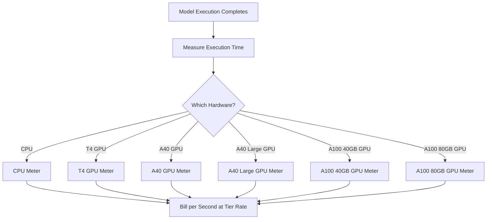

Replicate هي منصة لتشغيل نماذج تعلّم الآلة مفتوحة المصدر في السحابة. ويُعد نموذج الفوترة لديها أحد أوضح الأمثلة على التسعير القائم على الاستخدام في مجال الذكاء الاصطناعي. لا توجد رسوم اشتراك شهرية ولا سعر ثابت لكل عملية تشغيل للنموذج. وبدلاً من ذلك، تتم الفوترة مقابل مقدار وقت الحوسبة المستهلك فعلياً، وصولاً إلى الثانية، مع اختلاف الأسعار حسب الأجهزة الأساسية.

يناسب هذا النهج أحمال عمل الذكاء الاصطناعي جيداً، لأن أوقات التنفيذ غير متوقعة. فقد يشغّل مستخدم واحد نموذجاً خفيفاً لبضع ثوانٍ، أو نموذجاً توليدياً ضخماً لعدة دقائق. ومن خلال ربط التكلفة بموارد الحوسبة بدلاً من النموذج نفسه، تحافظ Replicate على شفافية التسعير وقابليته للتوسع.

## كيف تُجري Replicate الفوترة

ينفصل تسعير Replicate عن النموذج المحدد الذي يتم تشغيله. سواء كنت تنشئ صورة باستخدام SDXL أو تشغّل Llama 3، تحدد الفوترة فئة الأجهزة ومدة التنفيذ. يتيح لهم ذلك استضافة آلاف النماذج مفتوحة المصدر من دون الحاجة إلى خطة تسعير منفصلة لكل نموذج.

| الأجهزة | السعر لكل ثانية | السعر لكل ساعة |
| :--- | :--- | :--- |
| NVIDIA CPU | \$0.000100 | \$0.36 |
| NVIDIA T4 GPU | \$0.000225 | \$0.81 |
| NVIDIA A40 GPU | \$0.000575 | \$2.07 |
| NVIDIA A40 (Large) GPU | \$0.000725 | \$2.61 |
| NVIDIA A100 (40GB) GPU | \$0.001150 | \$4.14 |
| NVIDIA A100 (80GB) GPU | \$0.001400 | \$5.04 |



1. **الأسعار الخاصة بالأجهزة**: تختلف التكلفة لكل ثانية استناداً إلى موارد الحوسبة المطلوبة. ولكل فئة من الأجهزة نقطة سعر مختلفة.
2. **نموذج قائم بالكامل على الاستخدام**: لا توجد رسوم شهرية أو رسوم تجاوز أو حدود. تتم محاسبة المستخدمين على وقت الحوسبة الفعلي (مثل: "12.4 ثانية على A100") بدلاً من المحاسبة لكل عملية توليد.
3. **دقة الفوترة بالثانية**: تفرض موفرو السحابة التقليديون رسوماً بالساعة أو بالدقيقة، ما يؤدي إلى هدر في المهام قصيرة المدة. وتزيل الفوترة بالثانية هذا الهدر في التجارب الصغيرة وأحمال العمل الإنتاجية الكبيرة على حد سواء.

<Info>
تخضع عمليات البدء البارد للفوترة أيضاً. غالباً ما يستغرق الطلب الأول إلى نموذج ما بين 10 و30 ثانية لتحميل النموذج إلى الذاكرة. وتُحتسب تكلفة وقت التحميل بالسعر نفسه المطبق على وقت التنفيذ.
</Info>
## ما الذي يجعله فريداً

* **القياس حسب الأجهزة:** تكون تكلفة النموذج نفسه أعلى على الأجهزة الأفضل. ويختار المستخدمون بين السرعة والتكلفة. يناسب T4 GPU المهام غير الحساسة للوقت، بينما يتعامل A100 مع التطبيقات الفورية.
* **الدقة بالثانية:** تُحسب الفوترة بالثانية، لذلك لا يدفع المستخدمون رسوماً زائدة أبداً مقابل المهام القصيرة.
* **عدم وجود اشتراك:** لا يوجد أي التزام للبدء. ويتوسع النموذج بلا حدود مع الاستخدام، ما يجعله مثالياً للشركات الناشئة والمطورين الذين يجرّبون نماذج مختلفة.
* **محايد تجاه النموذج:** يظل منطق الفوترة نفسه بغض النظر عن نوع المهمة (إنشاء الصور أو معالجة النصوص أو تحويل الصوت إلى نص أو توليف الفيديو). ويتيح ذلك للمنصة دعم منظومة واسعة من النماذج من دون جداول تسعير معقدة.

## أنشئ هذا باستخدام Dodo Payments

يمكنك تكرار نموذج الفوترة هذا باستخدام ميزات الفوترة القائمة على الاستخدام في Dodo Payments. ويتمثل العامل الأساسي في استخدام عدة مقاييس لتتبع فئات الأجهزة المختلفة وربطها بمنتج واحد.

<Steps>
  <Step title="Create Usage Meters (One Per Hardware Class)">
    أنشئ مقاييس منفصلة لكل فئة من الأجهزة. لكل نوع من الأجهزة تكلفة مختلفة لكل ثانية، لذا يتيح القياس المستقل لـ Dodo تسعير كل فئة بشكل مختلف وتوفير فوترة مفصلة.

    | اسم المقياس | اسم الحدث | التجميع | الخاصية |
    | :--- | :--- | :--- | :--- |
    | CPU Compute | `compute.cpu` | Sum | `execution_seconds` |
    | GPU T4 Compute | `compute.gpu_t4` | Sum | `execution_seconds` |
    | GPU A40 Compute | `compute.gpu_a40` | Sum | `execution_seconds` |
    | GPU A40 Large Compute | `compute.gpu_a40_large` | Sum | `execution_seconds` |
    | GPU A100 40GB Compute | `compute.gpu_a100_40` | Sum | `execution_seconds` |
    | GPU A100 80GB Compute | `compute.gpu_a100_80` | Sum | `execution_seconds` |

    يحسب تجميع `Sum` على الخاصية `execution_seconds` إجمالي وقت الحوسبة لكل فئة من الأجهزة خلال فترة الفوترة.
  </Step>

  <Step title="Create a Usage-Based Product">
    أنشئ منتجاً جديداً في لوحة معلومات Dodo Payments:

    * **نوع التسعير:** Usage Based Billing
    * **السعر الأساسي:** \$0/شهرياً (من دون رسوم اشتراك)
    * **وتيرة الفوترة:** شهرياً

    أرفق جميع المقاييس مع أسعارها لكل وحدة:

    | المقياس | السعر لكل وحدة (لكل ثانية) |
    | :--- | :--- |
    | compute.cpu | \$0.000100 |
    | compute.gpu_t4 | \$0.000225 |
    | compute.gpu_a40 | \$0.000575 |
    | compute.gpu_a40_large | \$0.000725 |
    | compute.gpu_a100_40 | \$0.001150 |
    | compute.gpu_a100_80 | \$0.001400 |

    عيّن **الحد المجاني** إلى 0 لجميع المقاييس. تُحتسب تكلفة كل ثانية من التنفيذ.
  </Step>

  <Step title="Send Usage Events">
    أرسل أحداث الاستخدام إلى Dodo عند اكتمال تنفيذ النموذج. أدرج `event_id` فريداً لكل تنبؤ لضمان idempotency.

    ```typescript
    import DodoPayments from 'dodopayments';

    type HardwareTier = 'cpu' | 'gpu_t4' | 'gpu_a40' | 'gpu_a40_large' | 'gpu_a100_40' | 'gpu_a100_80';

    const client = new DodoPayments({
      bearerToken: process.env.DODO_PAYMENTS_API_KEY,
    });

    async function trackModelExecution(
      customerId: string,
      modelId: string,
      hardware: HardwareTier,
      executionSeconds: number,
      predictionId: string
    ) {
      const eventName = `compute.${hardware}`;

      await client.usageEvents.ingest({
        events: [{
          event_id: `pred_${predictionId}`,
          customer_id: customerId,
          event_name: eventName,
          timestamp: new Date().toISOString(),
          metadata: {
            execution_seconds: executionSeconds,
            model_id: modelId,
            hardware: hardware
          }
        }]
      });
    }

    // Example: SDXL image generation on A100
    await trackModelExecution(
      'cus_abc123',
      'stability-ai/sdxl',
      'gpu_a100_80',
      8.3,  // 8.3 seconds of A100 time
      'pred_xyz789'
    );
    ```

  </Step>

  <Step title="Measure Execution Time Precisely">
    أَحِط تنفيذ النموذج بقياس دقيق للوقت باستخدام `performance.now()`. قرّب القيمة إلى أقرب عُشر من الثانية لأغراض الفوترة.

    ```typescript
    async function runModelWithMetering(
      customerId: string,
      modelId: string,
      hardware: HardwareTier,
      input: Record<string, unknown>
    ) {
      const predictionId = `pred_${Date.now()}`;
      const startTime = performance.now();

      try {
        const result = await executeModel(modelId, input, hardware);
        const executionSeconds = (performance.now() - startTime) / 1000;
        const billedSeconds = Math.round(executionSeconds * 10) / 10;

        await trackModelExecution(
          customerId,
          modelId,
          hardware,
          billedSeconds,
          predictionId
        );

        return result;
      } catch (error) {
        // Still bill for compute time even on failure
        const executionSeconds = (performance.now() - startTime) / 1000;
        if (executionSeconds > 1) {
          await trackModelExecution(
            customerId,
            modelId,
            hardware,
            Math.round(executionSeconds * 10) / 10,
            predictionId
          );
        }
        throw error;
      }
    }
    ```

  </Step>

  <Step title="Create Checkout">
    عند تسجيل مستخدم، أنشئ جلسة checkout للمنتج القائم على الاستخدام. يتولى Dodo الفوترة المتكررة وإصدار الفواتير تلقائياً.

    ```typescript
    const session = await client.checkoutSessions.create({
      product_cart: [
        { product_id: 'pdt_compute_payg', quantity: 1 }
      ],
      customer: { email: 'ml-engineer@company.com' },
      return_url: 'https://yourplatform.com/dashboard'
    });
    ```

  </Step>
</Steps>

## سرّع العمل باستخدام مخطط Time Range Ingestion Blueprint

يبسّط [Time Range Ingestion Blueprint](/developer-resources/ingestion-blueprints/time-range) تتبع الحوسبة بالثانية. أنشئ مثيلاً واحداً من ingestion لكل فئة من الأجهزة، واستخدم `trackTimeRange` لإرسال الأحداث بطريقة أكثر تنظيماً.

```bash
npm install @dodopayments/ingestion-blueprints
```

```typescript
import { Ingestion, trackTimeRange } from '@dodopayments/ingestion-blueprints';

// Create one ingestion instance per hardware tier
function createHardwareIngestion(hardware: string) {
  return new Ingestion({
    apiKey: process.env.DODO_PAYMENTS_API_KEY,
    environment: 'live_mode',
    eventName: `compute.${hardware}`,
  });
}

const ingestions: Record<string, Ingestion> = {
  cpu: createHardwareIngestion('cpu'),
  gpu_t4: createHardwareIngestion('gpu_t4'),
  gpu_a40: createHardwareIngestion('gpu_a40'),
  gpu_a40_large: createHardwareIngestion('gpu_a40_large'),
  gpu_a100_40: createHardwareIngestion('gpu_a100_40'),
  gpu_a100_80: createHardwareIngestion('gpu_a100_80'),
};

// Track execution after a model run completes
const startTime = performance.now();
const result = await executeModel(modelId, input, hardware);
const durationMs = performance.now() - startTime;

await trackTimeRange(ingestions[hardware], {
  customerId: customerId,
  durationMs: durationMs,
  metadata: {
    model_id: modelId,
    hardware: hardware,
  },
});
```

يتولى المخطط تنسيق المدة وإنشاء الأحداث. وبالاقتران مع مثيلات ingestion الخاصة بكل جهاز، يتوافق هذا النمط بوضوح مع القياس متعدد المستويات في Replicate.

<Tip>
بالنسبة إلى المهام طويلة التشغيل، ادمج Time Range Blueprint مع تتبع heartbeat القائم على الفواصل الزمنية. راجع [الوثائق الكاملة للمخطط](/developer-resources/ingestion-blueprints/time-range) للاطلاع على الأنماط المتقدمة.
</Tip>

## تقدير التكلفة للمستخدمين

بما أن الفوترة القائمة على الاستخدام قد تكون غير متوقعة، وفّر للمستخدمين تقديرات للتكلفة قبل تشغيل النموذج. يقلل ذلك من الفواتير المفاجئة ويبني الثقة.

### أمثلة على حساب التكلفة

| النموذج | الأجهزة | متوسط الوقت | التكلفة لكل تشغيل |
| :--- | :--- | :--- | :--- |
| SDXL (صورة) | A100 80GB | ~8 ثوانٍ | ~\$0.0112 |
| Llama 3 (نص) | A100 40GB | ~3 ثوانٍ | ~\$0.0035 |
| Whisper (صوت) | GPU T4 | ~15 ثانية | ~\$0.0034 |

### إنشاء حاسبة للتكلفة

```typescript
function estimateCost(hardware: HardwareTier, estimatedSeconds: number): number {
  const rates: Record<HardwareTier, number> = {
    'cpu': 0.000100,
    'gpu_t4': 0.000225,
    'gpu_a40': 0.000575,
    'gpu_a40_large': 0.000725,
    'gpu_a100_40': 0.001150,
    'gpu_a100_80': 0.001400
  };

  return Number((rates[hardware] * estimatedSeconds).toFixed(4));
}

// Show the user before running: "This will cost approximately $0.0098"
const estimate = estimateCost('gpu_a100_80', 8.5);
```

## المؤسسات: السعة المحجوزة

بالنسبة إلى عملاء المؤسسات الذين يحتاجون إلى توافر مضمون ومن دون عمليات بدء بارد، تقدم Replicate "Private Instances" بسعر ثابت لكل ساعة.

باستخدام Dodo Payments، صمّم هذا كمنتج اشتراك:

* **نوع المنتج:** Subscription
* **السعر:** سعر شهري ثابت (مثل: "Reserved A100 Instance - \$500/month")
* **دورة الفوترة:** شهرياً

لا يزال بإمكانك إرسال أحداث الاستخدام لأغراض المراقبة والتحليلات، لكن الاشتراك يغطي التكلفة. ومع نمو حجم استخدام العميل، غالباً ما يصبح الانتقال من الدفع حسب الاستخدام إلى السعة المحجوزة أكثر فعالية من حيث التكلفة.

## متقدم: قياس heartbeat

بالنسبة إلى المهام التي تستغرق عدة دقائق أو ساعات، يُعد إرسال حدث واحد في النهاية أمراً محفوفاً بالمخاطر. فإذا تعطلت العملية، ستفقد بيانات الاستخدام. ويتمثل النهج الأفضل في إرسال أحداث الاستخدام كل 30 إلى 60 ثانية أثناء التنفيذ.

```typescript
async function runLongTaskWithHeartbeat(
  customerId: string,
  modelId: string,
  hardware: HardwareTier
) {
  const predictionId = `pred_${Date.now()}`;
  let totalSeconds = 0;

  const heartbeatInterval = setInterval(async () => {
    try {
      await trackModelExecution(
        customerId,
        modelId,
        hardware,
        30,
        `${predictionId}_${totalSeconds}`
      );
      totalSeconds += 30;
    } catch (error) {
      console.error('Heartbeat tracking failed:', error, { predictionId, totalSeconds });
    }
  }, 30000);

  try {
    await executeLongTask();
  } finally {
    clearInterval(heartbeatInterval);
  }
}
```

## ميزات Dodo الأساسية المستخدمة

<CardGroup cols={2}>
  <Card title="Usage-Based Billing" icon="chart-line" href="/features/usage-based-billing/introduction">
    أنشئ منتجات تُصدر فواتير بناءً على الاستهلاك.
  </Card>
  <Card title="Meters" icon="gauge" href="/features/usage-based-billing/meters">
    حدّد المقاييس التي تريد تتبعها وإصدار الفواتير بناءً عليها.
  </Card>
  <Card title="Event Ingestion" icon="bolt" href="/features/usage-based-billing/event-ingestion">
    أرسل بيانات الاستخدام إلى Dodo في الوقت الفعلي.
  </Card>
  <Card title="Subscriptions" icon="calendar" href="/features/subscription">
    أدر الفوترة المتكررة للسعة المحجوزة وخطط المؤسسات.
  </Card>
  <Card title="Time Range Blueprint" icon="clock" href="/developer-resources/ingestion-blueprints/time-range">
    تتبع الحوسبة بالثانية باستخدام مساعدات المدة.
  </Card>
</CardGroup>
