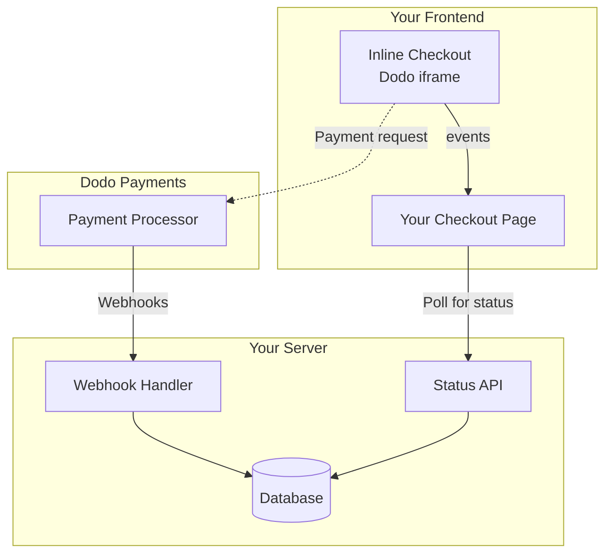

## Overview

Inline checkout lets you create fully integrated checkout experiences that blend seamlessly with your website or application. Unlike the [overlay checkout](/developer-resources/overlay-checkout), which opens as a modal on top of your page, inline checkout embeds the payment form directly into your page layout.

Using inline checkout, you can:

- Create checkout experiences that are fully integrated with your app or website
- Let Dodo Payments securely capture customer and payment information in an optimized checkout frame
- Display items, totals, and other information from Dodo Payments on your page
- Use SDK methods and events to build advanced checkout experiences

<Frame>
    
</Frame>

## How It Works

Inline checkout works by embedding a secure Dodo Payments frame into your website or app.

The checkout frame handles collecting customer information and capturing payment details. Your page displays the items list, totals, and options for changing what's on the checkout. The SDK lets your page and the checkout frame interact with each other.

Dodo Payments automatically creates a subscription when a checkout completes, ready for you to provision.

<Note>
The inline checkout frame securely handles all sensitive payment information, ensuring PCI compliance without additional certification on your end.
</Note>

## What Makes a Good Inline Checkout?

It's important that customers know who they're buying from, what they're buying, and how much they're paying.

To build an inline checkout that's compliant and optimized for conversion, your implementation must include:

<Frame caption="Example inline checkout layout showing required elements">
    
</Frame>

1. **Recurring information**: If recurring, how often it recurs and the total to pay on renewal. If a trial, how long the trial lasts.
2. **Item descriptions**: A description of what's being purchased.
3. **Transaction totals**: Transaction totals, including subtotal, total tax, and grand total. Be sure to include the currency too.
4. **Dodo Payments footer**: The full inline checkout frame, including the checkout footer that has information about Dodo Payments, our terms of sale, and our privacy policy.
5. **Refund policy**: A link to your refund policy, if it differs from the Dodo Payments standard refund policy.

<Warning>
Always display the complete inline checkout frame, including the footer. Removing or hiding legal information violates compliance requirements.
</Warning>

## Customer Journey

The checkout flow is determined by your checkout session configuration. Depending on how you configure the checkout session, customers will experience a checkout that may present all information on a single page or across multiple steps.

<Steps>
<Step title="Customer opens checkout">

يمكنك فتح الدفع المضمن عن طريق تمرير العناصر أو معاملة موجودة. استخدم SDK لعرض وتحديث المعلومات على الصفحة، وطرق SDK لتحديث العناصر بناءً على تفاعل العملاء.
    

</Step>

<Step title="Customer enters their details">

Inline checkout first asks customers to enter their email address, select their country, and (where required) enter their ZIP or postal code. This step gathers all necessary information to determine taxes and available payment options.

You can prefill customer details and present saved addresses to streamline the experience.

</Step>

<Step title="Customer selects payment method">

After entering their details, customers are presented with available payment methods and the payment form. Options may include credit or debit card, PayPal, Apple Pay, Google Pay, and other local payment methods based on their location.

Display saved payment methods if available to speed up checkout.


</Step>

<Step title="Checkout completed">

Dodo Payments routes every payment to the best acquirer for that sale to get the best possible chance of success. Customers enter a success workflow that you can build.


</Step>

<Step title="Dodo Payments creates subscription">

Dodo Payments automatically creates a subscription for the customer, ready for you to provision. The payment method the customer used is held on file for renewals or subscription changes.


</Step>
</Steps>

## Quick Start

Get started with the Dodo Payments Inline Checkout in just a few lines of code:

```typescript
import { DodoPayments } from "dodopayments-checkout";

// Initialize the SDK for inline mode
DodoPayments.Initialize({
  mode: "test",
  displayType: "inline",
  onEvent: (event) => {
    console.log("Checkout event:", event);
  },
});

// Open checkout in a specific container
DodoPayments.Checkout.open({
  checkoutUrl: "https://test.dodopayments.com/session/cks_123",
  elementId: "dodo-inline-checkout" // ID of the container element
});
```

<Tip>
Ensure you have a container element with the corresponding `id` on your page: `<div id="dodo-inline-checkout"></div>`.
</Tip>

## Step-by-Step Integration Guide

<Steps>
<Step title="Install the SDK">

Install the Dodo Payments Checkout SDK:

<CodeGroup>

```bash npm
npm install dodopayments-checkout
```

```bash yarn
yarn add dodopayments-checkout
```

```bash pnpm
pnpm add dodopayments-checkout
```

</CodeGroup>

</Step>

<Step title="Initialize the SDK for Inline Display">

Initialize the SDK and specify `displayType: 'inline'`. You should also listen for the `checkout.breakdown` event to update your UI with real-time tax and total calculations.

```typescript
import { DodoPayments } from "dodopayments-checkout";

DodoPayments.Initialize({
  mode: "test",
  displayType: "inline",
  onEvent: (event) => {
    if (event.event_type === "checkout.breakdown") {
      const breakdown = event.data?.message;
      // Update your UI with breakdown.subTotal, breakdown.tax, breakdown.total, etc.
    }
  },
});
```

</Step>

<Step title="Create a Container Element">

Add an element to your HTML where the checkout frame will be injected:

```html
<div id="dodo-inline-checkout"></div>
```

</Step>

<Step title="Open the Checkout">

Call `DodoPayments.Checkout.open()` with the `checkoutUrl` and the `elementId` of your container:

```typescript
DodoPayments.Checkout.open({
  checkoutUrl: "https://test.dodopayments.com/session/cks_123",
  elementId: "dodo-inline-checkout"
});
```

</Step>

<Step title="Test Your Integration">

1. Start your development server:

```bash
npm run dev
```

2. Test the checkout flow:
   - Enter your email and address details in the inline frame.
   - Verify that your custom order summary updates in real-time.
   - Test the payment flow using test credentials.
   - Confirm redirects work correctly.

<Check>
You should see `checkout.breakdown` events logged in your browser console if you added a console log in the `onEvent` callback.
</Check>

</Step>

<Step title="Go Live">

When you're ready for production:

1. Change the mode to `'live'`:

```typescript
DodoPayments.Initialize({
  mode: "live",
  displayType: "inline",
  onEvent: (event) => {
    // Handle events
  }
});
```

2. Update your checkout URLs to use live checkout sessions from your backend.
3. Test the complete flow in production.

</Step>
</Steps>

## Complete React Example

This example demonstrates how to implement a custom order summary alongside the inline checkout, keeping them in sync using the `checkout.breakdown` event.

```tsx
"use client";

import { useEffect, useState } from 'react';
import { DodoPayments, CheckoutBreakdownData } from 'dodopayments-checkout';

export default function CheckoutPage() {
  const [breakdown, setBreakdown] = useState<Partial<CheckoutBreakdownData>>({});

  useEffect(() => {
    // 1. Initialize the SDK
    DodoPayments.Initialize({
      mode: 'test',
      displayType: 'inline',
      onEvent: (event) => {
        // 2. Listen for the 'checkout.breakdown' event
        if (event.event_type === "checkout.breakdown") {
          const message = event.data?.message as CheckoutBreakdownData;
          if (message) setBreakdown(message);
        }
      }
    });

    // 3. Open the checkout in the specified container
    DodoPayments.Checkout.open({
      checkoutUrl: 'https://test.dodopayments.com/session/cks_123',
      elementId: 'dodo-inline-checkout'
    });

    return () => DodoPayments.Checkout.close();
  }, []);

  const format = (amt: number | null | undefined, curr: string | null | undefined) => 
    amt != null && curr ? `${curr} ${(amt/100).toFixed(2)}` : '0.00';

  const currency = breakdown.currency ?? breakdown.finalTotalCurrency ?? '';

  return (
    <div className="flex flex-col md:flex-row min-h-screen">
      {/* Left Side - Checkout Form */}
      <div className="w-full md:w-1/2 flex items-center">
        <div id="dodo-inline-checkout" className='w-full' />
      </div>

      {/* Right Side - Custom Order Summary */}
      <div className="w-full md:w-1/2 p-8 bg-gray-50">
        <h2 className="text-2xl font-bold mb-4">Order Summary</h2>
        <div className="space-y-2">
          {breakdown.subTotal && (
            <div className="flex justify-between">
              <span>Subtotal</span>
              <span>{format(breakdown.subTotal, currency)}</span>
            </div>
          )}
          {breakdown.discount && (
            <div className="flex justify-between">
              <span>Discount</span>
              <span>{format(breakdown.discount, currency)}</span>
            </div>
          )}
          {breakdown.tax != null && (
            <div className="flex justify-between">
              <span>Tax</span>
              <span>{format(breakdown.tax, currency)}</span>
            </div>
          )}
          <hr />
          {(breakdown.finalTotal ?? breakdown.total) && (
            <div className="flex justify-between font-bold text-xl">
              <span>Total</span>
              <span>{format(breakdown.finalTotal ?? breakdown.total, breakdown.finalTotalCurrency ?? currency)}</span>
            </div>
          )}
        </div>
      </div>
    </div>
  );
}

```

## API Reference

### Configuration

#### Initialize Options

```typescript
interface InitializeOptions {
  mode: "test" | "live";
  displayType: "inline"; // Required for inline checkout
  onEvent: (event: CheckoutEvent) => void;
}
```

| Option | Type | Required | Description |
|--------|------|----------|-------------|
| `mode` | `"test" \| "live"` | Yes | Environment mode. |
| `displayType` | `"inline" \| "overlay"` | Yes | Must be set to `"inline"` to embed the checkout. |
| `onEvent` | `function` | Yes | Callback function for handling checkout events. |

#### Checkout Options

```typescript
export type FontSize = "xs" | "sm" | "md" | "lg" | "xl" | "2xl";
export type FontWeight = "normal" | "medium" | "bold" | "extraBold";

interface CheckoutOptions {
  checkoutUrl: string;
  elementId: string; // Required for inline checkout
  options?: {
    showTimer?: boolean;
    showSecurityBadge?: boolean;
    payButtonText?: string;
    fontSize?: FontSize;
    fontWeight?: FontWeight;
  };
}
```

| الخيار | النوع | مطلوب | الوصف |
|--------|------|----------|-------------|
| `checkoutUrl` | `string` | نعم | عنوان جلسة الدفع. |
| `elementId` | `string` | نعم | `id` لعنصر DOM حيث يجب عرض الدفع. |
| `options.showTimer` | `boolean` | لا | إظهار أو إخفاء مؤقت الدفع. الإعداد الافتراضي `true`. عند التعطيل، ستتلقى حدث `checkout.link_expired` عند انتهاء صلاحية الجلسة. |
| `options.showSecurityBadge` | `boolean` | لا | إظهار أو إخفاء شارة الأمان. الإعداد الافتراضي `true`. |
| `options.payButtonText` | `string` | لا | نص مخصص لعرضه على زر الدفع. |
| `options.fontSize` | `FontSize` | لا | حجم الخط العالمي للدفع. |
| `options.fontWeight` | `FontWeight` | لا | وزن الخط العالمي للدفع. |

### Methods

#### Open Checkout

Opens the checkout frame in the specified container.

```typescript
DodoPayments.Checkout.open({
  checkoutUrl: "https://test.dodopayments.com/session/cks_123",
  elementId: "dodo-inline-checkout"
});
```

You can also pass additional options to customize the checkout behavior:

```typescript
DodoPayments.Checkout.open({
  checkoutUrl: "https://test.dodopayments.com/session/cks_123",
  elementId: "dodo-inline-checkout",
  options: {
    showTimer: false,
    showSecurityBadge: false,
    payButtonText: "Pay Now",
  },
});
```

#### إغلاق الدفع

يزيل البرنامج الإطار الدفع وينظف مستمعي الأحداث برمجيًا.

```typescript
DodoPayments.Checkout.close();
```

#### تحقق من الحالة

يعيد ما إذا كان إطار الدفع محقون حاليًا.

```typescript
const isOpen = DodoPayments.Checkout.isOpen();
// Returns: boolean
```

### الأحداث

يوفر SDK أحداثًا في الوقت الفعلي من خلال `onEvent`. يعتبر `checkout.breakdown` مفيدًا بشكل خاص لمزامنة واجهة المستخدم الخاصة بك.

| نوع الحدث | الوصف |
|------------|-------------|
| `checkout.opened` | تم تحميل إطار الدفع. |
| `checkout.form_ready` | النموذج جاهز لاستقبال إدخال المستخدم. مفيد لإخفاء حالات التحميل وعرض واجهة المستخدم للدفع. |
| `checkout.breakdown` | يتم إطلاقه عند تحديث الأسعار أو الضرائب أو الخصومات. |
| `checkout.customer_details_submitted` | تم تقديم تفاصيل العميل. |
| `checkout.pay_button_clicked` | يتم إطلاقه عندما ينقر العميل على زر الدفع. مفيد للتحليلات وتتبع قنوات التحويل. |
| `checkout.redirect` | سينفذ الدفع إعادة توجيه (مثل الصفحة البنكية). |
| `checkout.error` | حدث خطأ أثناء الدفع. |
| `checkout.link_expired` | يتم إطلاقه عند انتهاء صلاحية جلسة الدفع. ستتلقاها فقط عندما تكون `showTimer` مضبوطة على `false`. |

#### بيانات تفصيل الدفع

يوفر حدث `checkout.breakdown` البيانات التالية:

```typescript
interface CheckoutBreakdownData {
  subTotal?: number;          // Amount in cents
  discount?: number;         // Amount in cents
  tax?: number;              // Amount in cents
  total?: number;            // Amount in cents
  currency?: string;         // e.g., "USD"
  finalTotal?: number;       // Final amount including adjustments
  finalTotalCurrency?: string; // Currency for the final total
}
```

#### فهم حدث التفصيل

يعتبر حدث `checkout.breakdown` الطريقة الرئيسية للحفاظ على مزامنة واجهة تطبيقك مع حالة الدفع Dodo Payments.

**متى يتم إطلاقه:**
- **عند التهيئة**: فور تحميل إطار الدفع وجاهزيته.
- **عند تغيير العنوان**: كلما اختار العميل دولة أو دخل رمز بريدي يؤدي إلى إعادة حساب الضرائب.

**تفاصيل الحقول:**

| الحقل | الوصف |
|-------|-------------|
| `subTotal` | مجموع جميع عناصر السطر في الجلسة قبل تطبيق أي خصومات أو ضرائب. |
| `discount` | القيمة الإجمالية لجميع الخصومات المطبقة. |
| `tax` | مبلغ الضريبة المحسوبة. في وضع `inline`، يتم تحديث هذا ديناميكيًا مع تفاعل المستخدم مع حقول العنوان. |
| `total` | النتيجة الرياضية لـ `subTotal - discount + tax` بعملة الجلسة الأساسية. |
| `currency` | رمز العملة ISO (مثل `"USD"`) لقيم المجموع الفرعي القياسية والخصم والضرائب. |
| `finalTotal` | المبلغ الفعلي الذي يتم تحميله على العميل. قد يشمل ذلك تعديلات إضافية على صرف العملات الأجنبية أو رسوم طرق الدفع المحلية التي ليست جزءًا من تحليل الأسعار الأساسي. |
| `finalTotalCurrency` | العملة التي يدفع بها العميل فعليًا. يمكن أن تختلف عن `currency` إذا كان تكافؤ القوة الشرائية أو التحويل بالعملة المحلية نشطًا. |

**نصائح دمج رئيسية:**

1.  **تنسيق العملة**: يتم دائمًا إرجاع الأسعار على أنها أعداد صحيحة في أصغر وحدة عملة (مثل السنتات للدولار الأمريكي، الين للين الياباني). لعرضها، قسّم على 100 (أو القوة المناسبة للعدد 10) أو استخدم مكتبة تنسيق مثل `Intl.NumberFormat`.
2.  **التعامل مع الحالات الأولية**: عند تحميل الدفع لأول مرة، قد يكون `tax` و`discount` `0` أو `null` حتى يقدم المستخدم معلومات الفوترة أو يطبق رمزًا. يجب على واجهة المستخدم التعامل مع هذه الحالات بأريحية (مثل عرض شرطة `—` أو إخفاء الصف).
3.  **"الإجمالي النهائي" مقابل "الإجمالي"**: في حين أن `total` يوفر حساب السعر القياسي، `finalTotal` هو مصدر الحقيقة للمعاملة. إذا كانت `finalTotal` موجودة، فإنها تعكس تمامًا ما سيتم تحميله على بطاقة العميل، بما في ذلك أي تعديلات ديناميكية.
4.  **التغذية الراجعة في الوقت الفعلي**: استخدم حقل `tax` لإظهار أن ضرائب المستخدمين يتم حسابها في الوقت الفعلي. يوفر هذا شعورًا "مباشرًا" لصفحة الدفع الخاصة بك ويقلل الاحتكاك أثناء خطوة إدخال العنوان.

## خيارات التنفيذ

### تثبيت مدير الحزم

قم بالتثبيت عبر npm أو yarn أو pnpm كما هو موضح في [دليل التكامل خطوة بخطوة](#step-by-step-integration-guide).

### تنفيذ CDN

للتكامل السريع بدون خطوة البناء، يمكنك استخدام CDN الخاص بنا:

```html
<!DOCTYPE html>
<html lang="en">
<head>
    <meta charset="UTF-8">
    <meta name="viewport" content="width=device-width, initial-scale=1.0">
    <title>Dodo Payments Inline Checkout</title>
    
    <!-- Load DodoPayments -->
    <script src="https://cdn.jsdelivr.net/npm/dodopayments-checkout@latest/dist/index.js"></script>
    <script>
        // Initialize the SDK
        DodoPaymentsCheckout.DodoPayments.Initialize({
            mode: "test",
            displayType: "inline",
            onEvent: (event) => {
                console.log('Checkout event:', event);
            }
        });
    </script>
</head>
<body>
    <div id="dodo-inline-checkout"></div>

    <script>
        // Open the checkout
        DodoPaymentsCheckout.DodoPayments.Checkout.open({
            checkoutUrl: "https://test.dodopayments.com/session/cks_123",
            elementId: "dodo-inline-checkout"
        });
    </script>
</body>
</html>
```

## تحديث طريقة الدفع

يدعم الدفع المضمن **تحديث طرق الدفع** للاشتراكات. عندما يحتاج العميل إلى تحديث طريقة الدفع الخاصة به — سواء لاشتراك نشط أو لإعادة تفعيل اشتراك معلق — يمكنك عرض تدفق التحديث مباشرة ضمن تخطيط صفحتك.

### كيف يعمل

1. استدعاء [API تحديث طريقة الدفع](/features/subscription#update-payment-method-for-active-subscription) للحصول على `payment_link`:

```typescript
const response = await client.subscriptions.updatePaymentMethod('sub_123', {
  type: 'new',
  return_url: 'https://example.com/return'
});
```

2. قم بتمرير `payment_link` ك `checkoutUrl` لفتح الدفع المضمن:

```typescript
DodoPayments.Checkout.open({
  checkoutUrl: response.payment_link,
  elementId: "dodo-inline-checkout"
});
```

يعرض الإطار المضمن فقط نموذج تجميع طريقة الدفع. يمكن للعملاء إدخال تفاصيل بطاقة جديدة أو اختيار طريقة دفع مخزنة دون مغادرة صفحتك.

### للاشتراكات المعلقة

عند تحديث طريقة الدفع لاشتراك في حالة `on_hold`، فإنه ينشئ Dodo Payments تلقائيًا شحنة لأي مستحقات متبقية. راقب الإشعارات `payment.succeeded` و`subscription.active` لتأكيد إعادة التفعيل.

```typescript
const response = await client.subscriptions.updatePaymentMethod('sub_123', {
  type: 'new',
  return_url: 'https://example.com/return'
});

if (response.payment_id) {
  // Charge created for remaining dues
  // Open inline checkout for payment collection
  DodoPayments.Checkout.open({
    checkoutUrl: response.payment_link,
    elementId: "dodo-inline-checkout"
  });
}
```

<Tip>
يمكنك أيضًا استخدام طريقة دفع محفوظة موجودة بدلاً من جمع تفاصيل جديدة عن طريق تمرير `type: 'existing'` مع `payment_method_id` إلى واجهة برمجة تطبيقات تحديث طريقة الدفع.
</Tip>

## التعامل مع الأخطاء

يوفر SDK معلومات خطأ مفصلة من خلال نظام الأحداث. قم دائمًا بتطبيق معالجة الأخطاء الصحيحة في رد استدعاء `onEvent`:

```typescript
DodoPayments.Initialize({
  mode: "test",
  displayType: "inline",
  onEvent: (event: CheckoutEvent) => {
    if (event.event_type === "checkout.error") {
      console.error("Checkout error:", event.data?.message);
      // Handle error appropriately
    }
  }
});
```

<Warning>
تعامل دائمًا مع حدث `checkout.error` لتقديم تجربة مستخدم جيدة عند حدوث مشاكل.
</Warning>

## أفضل الممارسات

1. **التصميم التكيفي**: تأكد من أن عنصر الحاوية الخاص بك لديه عرض وارتفاع كافيين. سيتوسع الإطار المضمن عادة لملء حاويته.
2. **التزامن**: استخدم حدث `checkout.breakdown` للحفاظ على ملخص الطلب أو جداول التسعير الخاصة بك متزامنة مع ما يراه المستخدم في إطار الدفع.
3. **حالات التمويه**: اعرض مؤشر التحميل في الحاوية الخاصة بك حتى يتم إطلاق حدث `checkout.opened`.
4. **التنظيف**: استدعوى `DodoPayments.Checkout.close()` عندما يتم إلغاء تثبيت المكون الخاص بك لتنظيف الإطار والمستمعين الأحداث.

<Info>
بالنسبة لتطبيقات الوضع الداكن، يوصى باستخدام `#0d0d0d` كلون الخلفية لتحقيق تكامل بصري مثالي مع إطار الدفع المضمن.
</Info>

## التحقق من حالة الدفع

<Warning>
لا تعتمد فقط على أحداث الدفع المضمنة لتحديد نجاح الدفع أو فشله. قم دائمًا بتطبيق التحقق من الخادم باستخدام الإشعارات أو الاستطلاع.
</Warning>

### لماذا التحقق من الخادم ضروري

بينما توفر أحداث الدفع المضمنة تغذية راجعة في الوقت الفعلي، يجب ألا تكون مصدر الحقيقة الوحيد لحالة الدفع. يمكن أن تتسبب مشاكل الشبكة أو تعطل المستعرض أو إغلاق المستخدم للصفحة في عدم تلقي الأحداث. لضمان تحقق موثوق من الدفع:

1. **يجب أن يستمع الخادم الخاص بك إلى أحداث webhook** - يرسل Dodo Payments إشعارات لتغييرات حالة الدفع
2. **تطبيق آلية الاستطلاع** - يجب ان يقوم الواجهة الأمامية الخاصة بك باستطلاع الخادم للحصول على تحديثات الحالة
3. **جمع بين النهجين** - استخدم الإشعارات كمصدر رئيسي والاستطلاع كبديل

### الهندسة المعمارية الموصى بها



### خطوات التنفيذ

**1. استمع لأحداث الدفع** - عند النقر على المستخدم على زر الدفع، ابدأ في التحضير للتحقق من الحالة:

```typescript
onEvent: (event) => {
  if (event.event_type === 'checkout.pay_button_clicked') {
    // Start polling your server for confirmed status
    startPolling();
  }
}
```

**2. استطلاع بالخادم** - أنشئ نقطة نهاية تتحقق من قاعدة البيانات الخاصة بك لحالة الدفع (يتم تحديثها بواسطة الإشعارات):

```typescript
// Poll every 2 seconds until status is confirmed
const interval = setInterval(async () => {
  const { status } = await fetch(`/api/payments/${paymentId}/status`).then(r => r.json());
  if (status === 'succeeded' || status === 'failed') {
    clearInterval(interval);
    handlePaymentResult(status);
  }
}, 2000);
```

**3. عالج الإشعارات من جهة الخادم** - قم بتحديث قاعدة البيانات الخاصة بك عندما يرسل Dodo الأحداث `payment.succeeded` أو `payment.failed`. راجع [وثائق الإشعارات](/developer-resources/webhooks) للحصول على التفاصيل.

## استكشاف الأخطاء وإصلاحها

<AccordionGroup>
<Accordion title="Checkout frame is not appearing">
- تحقق من أن `elementId` يطابق `id` ل `div` الذي ينتمي بالفعل إلى DOM.
- تأكد من أن `displayType: 'inline'` مرر إلى `Initialize`.
- تحقق من أن `checkoutUrl` صالح.
</Accordion>

<Accordion title="Taxes are not updating in my UI">
- تأكد من أنك تستمع لحدث `checkout.breakdown`.
- يتم حساب الضرائب فقط بعد أن يدخل المستخدم بلدًا ورمزًا بريديًا صالحًا في إطار الدفع.
</Accordion>
</AccordionGroup>

## تمكين المحافظ الرقمية

لمزيد من المعلومات التفصيلية حول إعداد Apple Pay وGoogle Pay والمحافظ الرقمية الأخرى، راجع صفحة <a href="/features/payment-methods/digital-wallets">المحافظ الرقمية</a>.

### الإعداد السريع ل Apple Pay

<Steps>
<Step title="Download domain association file">
قم بتنزيل [ملف اقتران نطاق Apple Pay](http://checkout.dodopayments.com/.well-known/apple-developer-merchantid-domain-association).
</Step>

<Step title="Request activation">
أرسل بريد إلكتروني إلى **support@dodopayments.com** مع عنوان URL لنطاق الإنتاج الخاص بك واطلب تفعيل Apple Pay.
</Step>

<Step title="Test after confirmation">
بمجرد التأكيد، تحقق من ظهور Apple Pay في الدفع واجرب التدفق الكامل.
</Step>
</Steps>

<Warning>
يتطلب Apple Pay التحقق من النطاق قبل أن يظهر في الإنتاج. اتصل بالدعم قبل التشغيل إذا كنت تخطط لتقديم Apple Pay.
</Warning>

## دعم المتصفح

يدعم SDK الدفع Dodo المتصفحات التالية:

- Chrome (الأحدث)
- Firefox (الأحدث)
- Safari (الأحدث)
- Edge (الأحدث)
- IE11+

## الدفع المضمن مقابل الدفع عبر الطبقة

اختر نوع الدفع المناسب لحالتك:

| الميزة | الدفع المضمن | الدفع عبر الطبقة |
|---------|-----------------|------------------|
| عمق التكامل | مدمج بالكامل في الصفحة | نافذة علوية على الصفحة |
| تحكم التخطيط | تحكم كامل | محدود |
| العلامة التجارية | متكامل بسلاسة | منفصل عن الصفحة |
| جهد التنفيذ | أعلى | أقل |
| الأفضل لـ | صفحات الدفع المخصصة، تدفقات التحويل العالية | التكامل السريع، الصفحات القائمة |

<Tip>
استخدم **الدفع المضمن** عندما تريد السيطرة الكاملة على تجربة الدفع وعلامة تجارية سلسة. استخدم **الدفع عبر الطبقة** للتكامل الأسرع مع تغييرات محدودة على صفحاتك الحالية.
</Tip>

## موارد ذات صلة

<CardGroup cols={2}>
<Card title="Overlay Checkout" icon="layer-group" href="/developer-resources/overlay-checkout">
    استخدم الدفع عبر الطبقة للتكامل السريع المستند إلى النوافذ العلوية.
</Card>

<Card title="Checkout Sessions API" icon="code" href="/api-reference/checkout-sessions/create">
    قم بإنشاء جلسات دفع لتفعيل تجارب الدفع الخاصة بك.
</Card>

<Card title="Webhooks" icon="webhook" href="/developer-resources/webhooks">
    تعامل مع أحداث الدفع من جهة الخادم باستخدام الإشعارات.
</Card>

<Card title="Integration Guide" icon="book" href="/developer-resources/integration-guide">
    دليل كامل لتكامل دفع Dodo.
</Card>
</CardGroup>

لمزيد من المساعدة، قم بزيارة مجتمع [Discord الخاص بنا](https://discord.gg/bYqAp4ayYh) أو اتصل بفريق دعم المطورين الخاص بنا.
