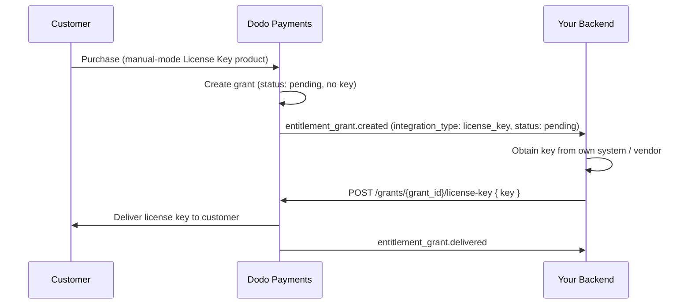

يشرح هذا الدليل كيفية إنشاء نظام **للتنفيذ اليدوي لمفاتيح الترخيص** من البداية إلى النهاية. بدلًا من Dodo Payments إنشاء مفتاح تلقائيًا عند الدفع، تنشئ كل عملية شراء منحة `pending` وتنتظر منك *أنت* توفير قيمة المفتاح من نظامك الخاص، أو من مورّد خارجي، أو من مجموعة محدودة من الرموز.

بنهاية هذا الدليل سيكون لديك:

- منتج يتضمن استحقاق License Key مضبوطًا على تنفيذ `manual`.
- مستمع webhook يكتشف متى ينتظر أحد العملاء مفتاحًا.
- استدعاء تنفيذ يسلّم المفتاح ويُخطر العميل تلقائيًا.

<CardGroup cols={2}>
<Card title="License Keys overview" icon="key" href="/features/license-keys">
دورة حياة مفتاح الترخيص الكاملة وإعداد `fulfillment_mode`.
</Card>
<Card title="Fulfill License Key Grant API" icon="code" href="/api-reference/entitlements/fulfill-license-key">
مرجع API لنقطة النهاية التي تستدعيها لتسليم مفتاح.
</Card>
</CardGroup>

## آلية العمل



يغيّر التنفيذ اليدوي خطوة **الإصدار** فقط. أما التفعيل والتحقق وإلغاء التفعيل وانتهاء الصلاحية والإبطال، فتعمل تمامًا مثل المفتاح المُنشأ تلقائيًا بعد تسليمه.

## المتطلبات الأساسية

لمتابعة هذا الدليل ستحتاج إلى:

- حساب تاجر Dodo Payments.
- مفتاح API الخاص بك (`DODO_PAYMENTS_API_KEY`) ومفتاح سر webhook من لوحة المعلومات. راجع [دليل إنشاء مفتاح API](/api-reference/introduction#api-key-generation).
- نقطة نهاية خلفية يمكنها استقبال webhooks.

<Info>
استخدم `https://test.dodopayments.com` وبيانات اعتماد وضع الاختبار أثناء الإنشاء. انتقل إلى `https://live.dodopayments.com` واستخدم المفاتيح الحية عند الانتقال إلى بيئة الإنتاج.
</Info>

## الخطوة 1 — إنشاء استحقاق License Key في الوضع اليدوي

**الاستحقاق** هو تعريف قابل لإعادة الاستخدام لما تقدمه. أنشئ استحقاق License Key واضبط `fulfillment_mode` الخاص به على `manual`.

<Tabs>
<Tab title="Dashboard">
<Steps>
<Step title="Open Entitlements">
انتقل إلى **Entitlements** في لوحة المعلومات وانقر على **+** لإنشاء استحقاق جديد.
</Step>
<Step title="Choose License Key">
اختر **License Key** باعتباره التكامل، وأدخِل له **Name**. يعرض النموذج الحقول التالية:

- **Fulfillment Mode** — يكون `Automatic` افتراضيًا. هذا هو الإعداد الذي يفعّل التنفيذ اليدوي؛ وستغيّره في الخطوة التالية.
- **License Length** — المدة التي يظل فيها كل مفتاح مُصدر صالحًا، أو **No expiration**.
- **Activations Limit** — الحد الأقصى لعمليات التفعيل لكل مفتاح، أو **Unlimited**.
- **Activation Message** — رسالة اختيارية موجهة إلى العميل تظهر عند تفعيل المفتاح.

<Frame>

</Frame>
</Step>
<Step title="Set Fulfillment Mode to Manual">
افتح القائمة المنسدلة **Fulfillment Mode** وغيّرها من **Automatic** إلى **Manual**. هذا هو الإعداد الذي يقود هذا الدليل بالكامل — فبدونه تُنشأ المفاتيح وتُرسل عبر البريد الإلكتروني تلقائيًا، ولا تُنشأ منحة معلّقة. عند اختيار **Manual**، تنشئ كل عملية شراء منحة `pending` لتقوم بتنفيذها. انقر على **Create Entitlement** للحفظ.
</Step>
</Steps>
</Tab>

<Tab title="API">
أنشئ الاستحقاق مع ضبط `integration_config.fulfillment_mode` على `manual`.

<CodeGroup>

```typescript Node.js theme={null}
import DodoPayments from 'dodopayments';

const client = new DodoPayments({
  bearerToken: process.env.DODO_PAYMENTS_API_KEY,
  environment: 'test_mode', // defaults to 'live_mode'
});

const entitlement = await client.entitlements.create({
  name: 'Pro License (Manual)',
  integration_type: 'license_key',
  integration_config: {
    fulfillment_mode: 'manual',
    activations_limit: 5,
    duration_count: 1,
    duration_interval: 'Year',
  },
});

console.log(entitlement.id); // ent_...
```

```python Python theme={null}
import os
from dodopayments import DodoPayments

client = DodoPayments(
    bearer_token=os.environ.get("DODO_PAYMENTS_API_KEY"),
    environment="test_mode",  # defaults to "live_mode"
)

entitlement = client.entitlements.create(
    name="Pro License (Manual)",
    integration_type="license_key",
    integration_config={
        "fulfillment_mode": "manual",
        "activations_limit": 5,
        "duration_count": 1,
        "duration_interval": "Year",
    },
)

print(entitlement.id)
```

```bash cURL theme={null}
curl -X POST https://test.dodopayments.com/entitlements \
  -H "Authorization: Bearer $DODO_PAYMENTS_API_KEY" \
  -H "Content-Type: application/json" \
  -d '{
    "name": "Pro License (Manual)",
    "integration_type": "license_key",
    "integration_config": {
      "fulfillment_mode": "manual",
      "activations_limit": 5,
      "duration_count": 1,
      "duration_interval": "Year"
    }
  }'
```

</CodeGroup>
</Tab>
</Tabs>

<Note>
يكون `fulfillment_mode` مضبوطًا على `auto` افتراضيًا. يؤدي حذف هذا الإعداد، أو ترك استحقاق موجود دون تغيير، إلى استمرار السلوك التلقائي. وحدها الاستحقاقات المضبوطة صراحةً على `manual` تنشئ منحًا معلّقة.
</Note>

## الخطوة 2 — إرفاق الاستحقاق بمنتج

افتح المنتج الذي تريد بيعه، ووسّع **Advanced Settings → Entitlements & Credits**، ثم اختر **استحقاق License Key الذي ضبطته على Manual** في الخطوة 1. يمكن لمنتج واحد تسليم مفتاح الترخيص هذا إلى جانب استحقاقات أخرى ضمن عملية الشراء نفسها.

<Frame caption="Selecting the License Key entitlement in the product entitlements panel.">

</Frame>

<Note>
وضع التنفيذ خاصية من خصائص **الاستحقاق** وليس المنتج. وبما أنك ضبطته على **Manual** في الخطوة 1، فإن كل منتج يُرفق به هذا الاستحقاق ينشئ منحًا لمفاتيح الترخيص `pending` عند الشراء — ولا حاجة إلى إعداد أي شيء إضافي هنا.
</Note>

<Tip>
إذا لم يكن لديك منتج بعد، فأنشئ واحدًا أولًا (لمرة واحدة أو باشتراك). راجع [دليل تكامل الدفعات لمرة واحدة](/developer-resources/integration-guide) لبيع المنتج من خلال صفحة الدفع.
</Tip>

## الخطوة 3 — اكتشاف المنح المعلّقة

عندما يشتري العميل المنتج، ينشئ Dodo Payments منحة بالحالة `pending` **من دون إرفاق مفتاح**، ويرسل webhook من النوع `entitlement_grant.created`. وهذه إشارة إلى أن عميلًا ينتظر مفتاحًا.

### الاستماع إلى webhook

أنشئ نقطة نهاية webhook (Developer → Webhooks في لوحة المعلومات) واتخذ إجراءً بشأن منح مفاتيح الترخيص المعلّقة. يتبع التنفيذ مواصفة [Standard Webhooks](https://standardwebhooks.com/).

```typescript theme={null}
import { Webhook } from 'standardwebhooks';

const webhook = new Webhook(process.env.DODO_WEBHOOK_KEY!);

export async function POST(request: Request) {
  const rawBody = await request.text();
  const headers = {
    'webhook-id': request.headers.get('webhook-id') || '',
    'webhook-signature': request.headers.get('webhook-signature') || '',
    'webhook-timestamp': request.headers.get('webhook-timestamp') || '',
  };

  await webhook.verify(rawBody, headers);
  const event = JSON.parse(rawBody);

  // A customer bought a manual-mode license key and is waiting for it.
  if (
    event.type === 'entitlement_grant.created' &&
    event.data.integration_type === 'license_key' &&
    event.data.status === 'pending'
  ) {
    await queueLicenseKeyFulfillment({
      grantId: event.data.id,
      customerId: event.data.customer_id,
    });
  }

  return new Response('ok');
}
```

تتضمن حمولة المنحة `integration_type: "license_key"`، لذا يمكنك التعرّف على منحة License Key من دون عملية بحث إضافية. راجع [مرجع webhook الخاص بمنحة الاستحقاق](/developer-resources/webhooks/intents/entitlement-grant) للاطلاع على الحمولة الكاملة.

### أو الاستطلاع باستخدام List Grants API

إذا كنت تفضّل عدم الاعتماد على webhooks، فاعرض منح استحقاق License Key وفلترها حسب `status`. كل منحة ضمن استحقاق License Key هي بالفعل منحة لمفتاح ترخيص، لذلك لا حاجة إلى فلتر `integration_type`:

<CodeGroup>

```typescript Node.js theme={null}
const pending = await client.entitlements.grants.list('ent_license_key_id', {
  status: 'Pending',
});

for (const grant of pending.items) {
  console.log(`Grant ${grant.id} for customer ${grant.customer_id} needs a key`);
}
```

```bash cURL theme={null}
curl -G https://test.dodopayments.com/entitlements/ent_license_key_id/grants \
  -H "Authorization: Bearer $DODO_PAYMENTS_API_KEY" \
  --data-urlencode "status=Pending"
```

</CodeGroup>

## الخطوة 4 — تسليم المفتاح

احصل على قيمة المفتاح من نظامك الخاص، ثم أرسلها باستخدام نقطة النهاية [Fulfill License Key Grant](/api-reference/entitlements/fulfill-license-key). يتطلب ذلك مفتاح API السري الخاص بك (بصلاحية Editor)؛ وليس هذا المفتاح إحدى نقاط نهاية الترخيص العامة.

<CodeGroup>

```typescript Node.js theme={null}
async function fulfill(grantId: string, key: string) {
  const res = await fetch(
    `https://test.dodopayments.com/grants/${grantId}/license-key`,
    {
      method: 'POST',
      headers: {
        'Content-Type': 'application/json',
        Authorization: `Bearer ${process.env.DODO_PAYMENTS_API_KEY}`,
      },
      body: JSON.stringify({
        key,
        // Optional — fall back to the entitlement config when omitted
        activations_limit: 5,
        expires_at: '2027-05-01T00:00:00Z',
      }),
    },
  );

  if (!res.ok) {
    // See the status code table below for handling
    throw new Error(`Fulfillment failed: ${res.status}`);
  }

  return res.json(); // updated grant, now status: "delivered"
}
```

```bash cURL theme={null}
curl -X POST https://test.dodopayments.com/grants/grant_8VbC6JDZ/license-key \
  -H "Authorization: Bearer $DODO_PAYMENTS_API_KEY" \
  -H "Content-Type: application/json" \
  -d '{
    "key": "PRO-AAAA-BBBB-CCCC-DDDD",
    "activations_limit": 5,
    "expires_at": "2027-05-01T00:00:00Z"
  }'
```

</CodeGroup>

### حقول الطلب

<ParamField body="key" type="string" required>
سلسلة مفتاح الترخيص التي سيتم تسليمها إلى العميل. تُزال المسافات البيضاء؛ وتُرفض القيمة الفارغة أو التي تتكون من مسافات بيضاء فقط.
</ParamField>

<ParamField body="activations_limit" type="integer">
حد التفعيل لكل مفتاح. يعود إلى إعدادات الاستحقاق عند حذفه من الطلب.
</ParamField>

<ParamField body="expires_at" type="string">
انتهاء صلاحية كل مفتاح (ISO 8601). يعود إلى مدة إعدادات الاستحقاق عند حذفه من الطلب. وبالنسبة إلى المنح المُصدرة عبر الاشتراك، تظل الصلاحية مرتبطة بالاشتراك في جميع الحالات.
</ParamField>

عند النجاح، تنتقل المنحة إلى `delivered`، ويُرسل المفتاح إلى العميل تلقائيًا (وهو البريد الإلكتروني نفسه الذي كان سيتلقاه في التنفيذ التلقائي)، ويتم إطلاق `entitlement_grant.delivered`.

يتلقى العميل رسالة بريد إلكتروني تتضمن مفتاح الترخيص والمنتج وحد التفعيل وانتهاء الصلاحية وتعليمات التفعيل الخاصة بك:

<Frame caption="The license key email the customer receives once you fulfill the grant.">

</Frame>

<Check>
لا تحتاج إلى إرسال المفتاح عبر البريد الإلكتروني بنفسك — إذ يحدث التسليم تلقائيًا عند تنفيذ المنحة.
</Check>

## الخطوة 5 — معالجة الأخطاء وإعادة المحاولات

تتحقق نقطة النهاية من المنحة قبل تسليم أي شيء. عالج الاستجابات التالية:

| الحالة | المعنى | الإجراء المطلوب |
|---|---|---|
| `200` | تم تسليم المفتاح، وأصبحت المنحة الآن `delivered`. | اكتمل. |
| `400` | ليست منحة لمفتاح ترخيص، أو أن المفتاح فارغ/يتكون من مسافات بيضاء. | أصلح الطلب؛ ولا تُعد المحاولة كما هو. |
| `404` | لا توجد منحة بهذا المعرّف لنشاطك التجاري. | تحقّق من `grant_id`. |
| `409` | المنحة لا تنتظر التنفيذ (تم تسليمها بالفعل أو لديها مفتاح بالفعل)، **أو** أن قيمة المفتاح موجودة مسبقًا. | إذا تم التسليم بالفعل، فاعتبر العملية ناجحة. وإذا كان المفتاح مكررًا، فأرسل مفتاحًا مختلفًا. |
| `422` | فشل التحقق من نص الطلب (مثل `activations_limit < 1`). | صحّح الحقل وأعد المحاولة. |

<Warning>
يمكن إعادة محاولة التنفيذ بأمان عند حدوث أخطاء مؤقتة (مثل انتهاء المهلة و`5xx`). لا يمكن تنفيذ كل منحة إلا مرة واحدة، لذا فإن إعادة المحاولة بعد استدعاء ناجح لم يتم تأكيده تُرجع `409` بدلًا من إصدار مفتاح ثانٍ أو إرسال رسالة بريد إلكتروني مكررة. استخدم `id` الخاص بالمنحة باعتباره مفتاح idempotency.
</Warning>

## التحقق من التدفق

1. اشترِ المنتج في وضع الاختبار (راجع [أدلة صفحة الدفع](/developer-resources/integration-guide)).
2. تأكد من أن webhook الخاص بك استقبل `entitlement_grant.created` مع `status: "pending"` و`integration_type: "license_key"`، أو من ظهور المنحة في استجابة List Grants باستخدام تلك الفلاتر.
3. استدعِ نقطة نهاية التنفيذ باستخدام مفتاح اختباري.
4. تأكد من أن الاستجابة تعرض `status: "delivered"` مع `license_key` مُعبّأ، وأن العميل يتلقى رسالة بريد المفتاح، وأن `entitlement_grant.delivered` يتم إطلاقه.

<Check>
بعد التسليم، يمكن للعميل [تفعيل المفتاح والتحقق منه](/features/license-keys#activation-validation-deactivation) باستخدام نقاط نهاية الترخيص العامة، تمامًا مثل المفتاح المُنشأ تلقائيًا.
</Check>

## مرجع API ذي صلة

<CardGroup cols={2}>
<Card title="Create Entitlement" icon="plus" href="/api-reference/entitlements/create-entitlement">
أنشئ استحقاق License Key باستخدام `fulfillment_mode: manual`.
</Card>
<Card title="List Grants" icon="users" href="/api-reference/entitlements/list-grants">
فلتر حسب `integration_type` و`status` للعثور على المنح المعلّقة.
</Card>
<Card title="Fulfill License Key Grant" icon="code" href="/api-reference/entitlements/fulfill-license-key">
سلّم قيمة المفتاح وانقل المنحة إلى حالة التسليم.
</Card>
<Card title="Entitlement Grant Webhooks" icon="webhook" href="/developer-resources/webhooks/intents/entitlement-grant">
أحداث `entitlement_grant.*` التي تشير إلى المنح المعلّقة والمُسلّمة.
</Card>
</CardGroup>
