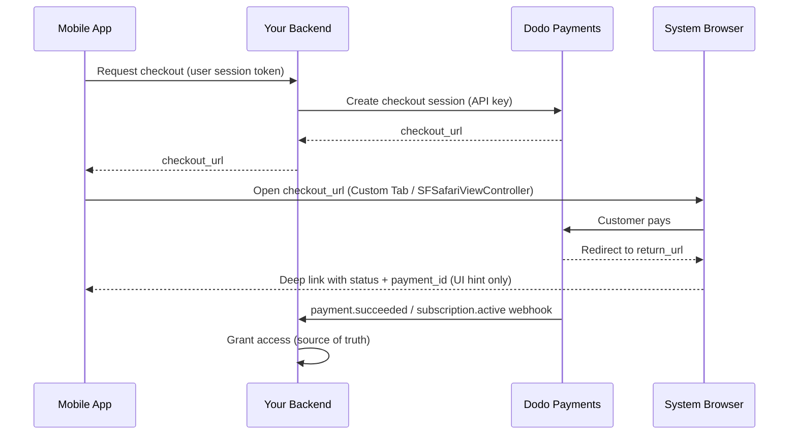

<CardGroup cols={4}>
<Card title="Quick Start" icon="rocket" href="#integration-workflow">
  شغّل تكامل الدفع عبر الأجهزة المحمولة في 4 خطوات بسيطة
</Card>

<Card title="Platform Examples" icon="code" href="#choose-your-sdk">
  أمثلة برمجية مكتملة لنظم Android وiOS وReact Native وFlutter
</Card>

<Card title="Checkout Customization" icon="sliders" href="#checkout-page-customization">
  اضبط السمات والملء المسبق و14 معلَمة خاصة بالأجهزة المحمولة
</Card>

<Card title="Mobile Recipes" icon="flask" href="#mobile-optimized-recipes">
  إعدادات دفع جاهزة للنسخ واللصق لـ5 سيناريوهات شائعة على الأجهزة المحمولة
</Card>
</CardGroup>

<Info>
يوفّر Dodo Payments حزمة SDK رسمية لصفحة الدفع لأنظمة **Android وiOS وReact Native وFlutter**. تغلّف كل حزمة النمط الموثّق أدناه (فتح عنوان URL لصفحة الدفع والتقاط الاستجابة وتحليل النتيجة) خلف استدعاء `start(...)` واحد ومكتوب النوع، مع توفير استرداد الجلسات المتروكة مضمّنًا. استخدم WebView يدويًا فقط إذا لم تناسبك أيٌّ من هذه الحزم.
</Info>

## المتطلبات الأساسية

قبل دمج Dodo Payments في تطبيقك المحمول، تأكد من توفر ما يلي:

- **حساب Dodo Payments**: حساب تاجر نشط مع إمكانية الوصول إلى API
- **بيانات اعتماد API**: مفتاح API ومفتاح سرّي لـ webhook من لوحة التحكم
- **مشروع تطبيق محمول**: تطبيق Android أو iOS أو React Native أو Flutter
- **خادم خلفي**: لمعالجة إنشاء جلسات الدفع بأمان

## سير عمل التكامل

يتبع التكامل عبر الأجهزة المحمولة عملية آمنة من 4 خطوات، يتولى فيها خادمك الخلفي استدعاءات API ويدير تطبيقك المحمول تجربة المستخدم.



<Info>
إن عنوان URL للرابط العميق `status` ليس سوى **إشارة إلى واجهة المستخدم** لما ينبغي عرضه للمستخدم. امنح إمكانية الوصول دائمًا من خلال `payment.succeeded` / `subscription.active` **webhook** على خادمك الخلفي، وليس من نتيجة الجهاز المحمول وحدها.
</Info>

<Steps>
<Step title="Backend: Create Checkout Session">
<Card title="Checkout Session API Docs" icon="book" href="/developer-resources/checkout-session">
تعرّف على كيفية إنشاء جلسة دفع في خادمك الخلفي باستخدام Node.js وPython وغيرهما. راجع الأمثلة الكاملة ومراجع المعلَمات في توثيق <strong>Checkout Sessions API</strong> المخصّص.
</Card>
<Note>
**الأمان**: يجب إنشاء جلسات الدفع على خادمك الخلفي، وليس داخل التطبيق المحمول. يحمي ذلك مفاتيح API ويضمن إجراء التحقق المناسب.
</Note>

</Step>

<Step title="Mobile: Get Checkout URL">

يستدعي تطبيقك المحمول خادمك الخلفي للحصول على عنوان URL لصفحة الدفع. صادِق على هذا الطلب باستخدام رمز جلسة المستخدم الذي سجّل دخوله.

<Tabs>
<Tab title="iOS (Swift)">

```swift
func getCheckoutURL(productId: String, customerEmail: String, customerName: String) async throws -> String {
    let url = URL(string: "https://your-backend.com/api/create-checkout-session")!
    var request = URLRequest(url: url)
    request.httpMethod = "POST"
    request.setValue("application/json", forHTTPHeaderField: "Content-Type")
    request.setValue("Bearer \(userSessionToken)", forHTTPHeaderField: "Authorization")
    
    let requestData: [String: Any] = [
        "productId": productId,
        "customerEmail": customerEmail,
        "customerName": customerName
    ]
    request.httpBody = try JSONSerialization.data(withJSONObject: requestData)
    
    let (data, _) = try await URLSession.shared.data(for: request)
    let response = try JSONDecoder().decode(CheckoutResponse.self, from: data)
    return response.checkout_url
}
```

</Tab>
<Tab title="Android (Kotlin)">

```kotlin
suspend fun getCheckoutURL(productId: String, customerEmail: String, customerName: String): String {
    val client = OkHttpClient()
    val requestBody = JSONObject().apply {
        put("productId", productId)
        put("customerEmail", customerEmail)
        put("customerName", customerName)
    }.toString().toRequestBody("application/json".toMediaType())
    
    val request = Request.Builder()
        .url("https://your-backend.com/api/create-checkout-session")
        .header("Authorization", "Bearer $userSessionToken")
        .post(requestBody)
        .build()
    
    val response = client.newCall(request).execute()
    val responseBody = response.body?.string()
    val jsonResponse = JSONObject(responseBody ?: "")
    return jsonResponse.getString("checkout_url")
}
```

</Tab>
<Tab title="React Native (JavaScript)">

```javascript
const getCheckoutURL = async (productId, customerEmail, customerName) => {
  try {
    const response = await fetch('https://your-backend.com/api/create-checkout-session', {
      method: 'POST',
      headers: {
        'Content-Type': 'application/json',
        'Authorization': `Bearer ${userSessionToken}`,
      },
      body: JSON.stringify({
        productId,
        customerEmail,
        customerName
      })
    });
    
    const data = await response.json();
    return data.checkout_url;
  } catch (error) {
    console.error('Failed to get checkout URL:', error);
    throw error;
  }
};
```

</Tab>
<Tab title="Flutter (Dart)">

```dart
import 'dart:convert';
import 'package:http/http.dart' as http;

Future<String> getCheckoutUrl({
  required String productId,
  required String customerEmail,
  required String customerName,
}) async {
  final response = await http.post(
    Uri.parse('https://your-backend.com/api/create-checkout-session'),
    headers: {
      'Content-Type': 'application/json',
      'Authorization': 'Bearer $userSessionToken',
    },
    body: jsonEncode({
      'productId': productId,
      'customerEmail': customerEmail,
      'customerName': customerName,
    }),
  );

  if (response.statusCode != 200) {
    throw Exception('Failed to get checkout URL: ${response.statusCode}');
  }
  return jsonDecode(response.body)['checkout_url'] as String;
}
```

</Tab>
</Tabs>
<Note>
**الأمان**: تتواصل التطبيقات المحمولة مع خادمك الخلفي فقط، ولا تتواصل مباشرةً مع Dodo Payments API.
</Note>
</Step>

<Step title="Mobile: Open Checkout in Browser">
افتح عنوان URL لصفحة الدفع في متصفح آمن داخل التطبيق لمعالجة الدفع.
أو تجاوز الإعداد اليدوي بالكامل باستخدام حزمة SDK الرسمية لمنصتك.
<Card title="Pick your mobile SDK" icon="box" href="#choose-your-sdk">
  خطوات التثبيت وإرشادات الإعداد لأنظمة Android وiOS وReact Native وFlutter.
</Card>

</Step>

<Step title="Backend: Handle Payment Completion">
عالج اكتمال الدفع عبر webhooks وعناوين URL لإعادة التوجيه لتأكيد حالة الدفع.
</Step>
</Steps>

## اختر حزمة SDK

توفّر كل حزمة SDK للأجهزة المحمولة العقد نفسه: إذ يفتح استدعاء `start(...)` واحد صفحة الدفع المستضافة من Dodo في سطح المتصفح الأصلي للمنصة، ويعيد `CheckoutResult` مكتوب النوع، تكون قيمة `status` فيه `succeeded` أو `failed` أو `cancelled` أو `pending` أو `expired`. لا تحتوي أيٌّ منها على مفتاح API أو تستدعي Dodo Payments API، وتدعم الحزم الأربع استرداد الجلسات المتروكة.

<CardGroup cols={2}>
<Card title="Android" icon="android" href="/developer-resources/sdks/android">
  يفتح `com.dodopayments.api:checkout-android` علامة تبويب Chrome مخصّصة. يتطلب `minSdk` 23.
</Card>
<Card title="iOS" icon="apple" href="/developer-resources/sdks/ios">
  يفتح `dodopayments-mobile-sdk-ios`‏ `SFSafariViewController`. يتطلب iOS 16 أو أحدث.
</Card>
<Card title="React Native" icon="react" href="/developer-resources/sdks/react-native">
  `@dodopayments/react-native-checkout`، وهي Turbo Module فوق النواتين الأصليتين. تتطلب React Native 0.76 أو أحدث.
</Card>
<Card title="Flutter" icon="layer-group" href="/developer-resources/sdks/flutter">
  `dodopayments_checkout`، وهي قناة Pigeon فوق النواتين الأصليتين. تتطلب Flutter 3.44 أو أحدث.
</Card>
</CardGroup>

<Warning>
إن `status` الذي تستلمه هو إشارة إلى واجهة المستخدم، وليس دليلًا على الدفع. أكّد كل عملية دفع من خادمك الخلفي عبر webhook‏ `payment.succeeded` / `subscription.active`، أو باسترداد الدفع باستخدام مفتاحك السرّي.
</Warning>

### تسجيل مخطط عنوان URL لاستدعاء الإرجاع

تعيد حزم SDK الأربع التحكم إلى تطبيقك من خلال مخطط عنوان URL مخصّص تختاره، مثل `myapp://checkout/return`. سجّله مرة واحدة لكل منصة:

<Tabs>
<Tab title="Android">

```kotlin android/app/build.gradle
android {
    defaultConfig {
        manifestPlaceholders["dodoCallbackScheme"] = "myapp"
    }
}
```

يعلن manifest الخاص بحزمة SDK عن نشاط إعادة التوجيه مسبقًا، لذلك لا يلزم إضافة XML إلى manifest.
</Tab>
<Tab title="iOS">

```xml Info.plist
<key>CFBundleURLTypes</key>
<array>
  <dict>
    <key>CFBundleURLName</key>
    <string>myapp</string>
    <key>CFBundleURLSchemes</key>
    <array>
      <string>myapp</string>
    </array>
  </dict>
</array>
```

في iOS، يجب أيضًا تمرير عناوين URL الواردة إلى حزمة SDK، لأن `SFSafariViewController` لا يستطيع التقاط عنوان URL لإعادة التوجيه الخاص به. راجع صفحة [iOS](/developer-resources/sdks/ios) أو [React Native](/developer-resources/sdks/react-native) لمعرفة المعالج الدقيق.
</Tab>
<Tab title="Expo">
توفّر `@dodopayments/react-native-checkout` مكوّنًا إضافيًا للإعداد يسجّل المخطط للمنصتين في `prebuild`. مرّر له خيار `scheme`:

```json app.json
{
  "expo": {
    "scheme": "myapp",
    "plugins": [
      [
        "@dodopayments/react-native-checkout",
        { "scheme": "myappcheckout" }
      ]
    ]
  }
}
```

يجب أن يطابق `scheme` قيمة `returnUrl`، وأن يختلف عن `expo.scheme` الذي يسجّله Expo مسبقًا في `MainActivity`. راجع صفحة [React Native SDK](/developer-resources/sdks/react-native) لمزيد من التفاصيل.

إذا كان `android/app/build.gradle` يُدار يدويًا من دون كتلة `defaultConfig { }` قياسية، فاضبط العنصر النائب يدويًا بدلًا من ذلك (راجع علامة Android).

يعمل مع إصدارات التطوير فقط، وليس Expo Go. شغّل `npx expo prebuild --clean` بعد تعديل `app.json`.
</Tab>
</Tabs>

<Note>
هل تفضّل بناؤه بنفسك؟ افتح `checkout_url` في متصفح النظام للمنصة (Android Custom Tabs / iOS‏ `SFSafariViewController`)، واعترض عملية التنقل إلى `return_url`، ثم اقرأ معلَمتي الاستعلام `status` و`payment_id`. تنفّذ حزم SDK أعلاه هذه الخطوات نيابةً عنك.
</Note>

<Warning>
**لا تفتح صفحة الدفع داخل WebView مضمّن (`WKWebView` / Android‏ `WebView`).** هذه أكثر مشكلات تكامل الأجهزة المحمولة شيوعًا؛ إذ يعمل WebView المضمّن على **تعطيل Apple Pay وGoogle Pay**، وقد يتسبب أيضًا في تعطل تحديات 3-D Secure والملء التلقائي للبطاقات المحفوظة، ما يؤدي إلى ظهور خيارات دفع أقل وفشل عمليات أكثر للعملاء. استخدم حزمة SDK دائمًا، أو افتح `checkout_url` في متصفح النظام (Custom Tabs / `SFSafariViewController`). سطح المتصفح الأصلي هذا هو سبب استمرار عمل Apple Pay وGoogle Pay.
</Warning>

## تخصيص المظهر

تقبل كل حزمة SDK معلَمة `customization` اختيارية في `start(...)` / `CheckoutParams`، وتتحكم هذه المعلَمة في مظهر سطح المتصفح الأصلي وسلوكه، مثل شريط الأدوات والأزرار وطريقة العرض. وهذا منفصل عن سمة صفحة الدفع نفسها، التي تضبطها من جهة الخادم عبر [`customization.theme_config`](/developer-resources/checkout-session) في جلسة الدفع.

تُجمّع الخيارات حسب المنصة لأن Custom Tab في Android و`SFSafariViewController` في iOS يوفّران عناصر تحكم أصلية مختلفة. جميع الحقول اختيارية؛ ويؤدي حذف `customization` بالكامل إلى استخدام المظهر الافتراضي لكل منصة.

<AccordionGroup>
<Accordion title="Android - Custom Tab">

<ParamField body="toolbarColor" type="Color">
لون خلفية شريط الأدوات.
</ParamField>

<ParamField body="navigationBarColor" type="Color">
لون شريط التنقل.
</ParamField>

<ParamField body="navigationBarDividerColor" type="Color">
لون الفاصل أعلى شريط التنقل.
</ParamField>

<ParamField body="closeButtonStyle" type="'default' | 'back'">
يعرض `default` رمز النظام "X"؛ بينما يرسم `back` سهم رجوع بدلًا منه.
</ParamField>

<ParamField body="closeButtonPosition" type="'start' | 'end'">
يحدد الجانب الذي يظهر فيه زر الإغلاق على شريط الأدوات.
</ParamField>

<ParamField body="shareButtonEnabled" type="boolean">
يعرض رمز المشاركة في شريط الأدوات.
</ParamField>

<ParamField body="showTitleEnabled" type="boolean">
يعرض عنوان الصفحة أسفل عنوان URL في شريط الأدوات.
</ParamField>

<ParamField body="urlBarHidingEnabled" type="boolean">
يتيح لشريط الأدوات الاختفاء تلقائيًا أثناء تمرير الصفحة.
</ParamField>

<ParamField body="bookmarksButtonEnabled" type="boolean">
يعرض "وضع علامة مرجعية على هذه الصفحة" في قائمة المزيد.
</ParamField>

<ParamField body="downloadsButtonEnabled" type="boolean">
يعرض "تنزيل الصفحة" في قائمة المزيد.
</ParamField>

<ParamField body="colorScheme" type="'system' | 'light' | 'dark'">
يفرض المظهر الفاتح أو الداكن بغض النظر عن إعداد النظام في الجهاز.
</ParamField>

</Accordion>

<Accordion title="iOS - SFSafariViewController">

<ParamField body="dismissButtonStyle" type="'done' | 'close' | 'cancel'">
تسمية زر الإغلاق أو رمزه.
</ParamField>

<ParamField body="presentationStyle" type="'pageSheet' | 'fullScreen'">
يظهر `pageSheet` كبطاقة يمكن إغلاقها بالسحب؛ بينما يغطي `fullScreen` الشاشة بأكملها.
</ParamField>

<ParamField body="barCollapsingEnabled" type="boolean">
يتيح طيّ شريط الأدوات أثناء التمرير. يظهر فقط عندما تكون قيمة `presentationStyle` هي `fullScreen`؛ أما `pageSheet` فيبقي الأشرطة مثبتة بغض النظر عن هذا الإعداد.
</ParamField>

<ParamField body="colorScheme" type="'system' | 'light' | 'dark'">
يفرض المظهر الفاتح أو الداكن بغض النظر عن إعداد النظام في الجهاز.
</ParamField>

</Accordion>
</AccordionGroup>

<Tabs>
<Tab title="React Native">

```typescript
const result = await DodoCheckout.start({
  checkoutUrl,
  returnUrl: 'myapp://checkout/return',
  customization: {
    android: { toolbarColor: '#6366F1', closeButtonStyle: 'back' },
    ios: { presentationStyle: 'fullScreen', colorScheme: 'dark' },
  },
});
```

</Tab>
<Tab title="Flutter">

```dart
final result = await DodoCheckout.instance.start(
  CheckoutParams(
    checkoutUrl: Uri.parse(checkoutUrl),
    returnUrl: Uri.parse('myapp://checkout/return'),
    customization: BrowserCustomization(
      android: AndroidBrowserOptions(
        toolbarColor: Color(0xFF6366F1),
        closeButtonStyle: CloseButtonStyle.back,
      ),
      ios: IosBrowserOptions(
        presentationStyle: PresentationStyle.fullScreen,
        colorScheme: BrowserColorScheme.dark,
      ),
    ),
  ),
);
```

</Tab>
<Tab title="Android (Kotlin)">

```kotlin
val result = DodoCheckout.start(
    activity,
    CheckoutParams(
        checkoutUrl = checkoutUrl,
        returnUrl = "myapp://checkout/return",
        customization = BrowserCustomization(
            toolbarColor = Color.parseColor("#6366F1"),
            closeButtonStyle = BrowserCustomization.CloseButtonStyle.BACK,
        )
    )
) { event -> }
```

</Tab>
<Tab title="iOS (Swift)">

```swift
let result = try await DodoCheckout.start(
    checkoutUrl: checkoutUrl,
    returnUrl: URL(string: "myapp://checkout/return")!,
    customization: BrowserCustomization(
        presentationStyle: .fullScreen,
        colorScheme: .dark
    )
)
```

</Tab>
</Tabs>

## تخصيص صفحة الدفع

يتحكم قسم [تخصيص المظهر](#appearance-customization) أعلاه في سطح المتصفح الأصلي، بما يشمل شريط الأدوات والأزرار ونظام الألوان. أما *صفحة الدفع نفسها*، أي الحقول الظاهرة والسمة وطرق الدفع المعروضة، فتُضبط من جهة الخادم عند إنشاء جلسة الدفع. ولهذه المعلَمات أكبر تأثير في التحويل عبر الأجهزة المحمولة.

توجد المعلَمات أدناه في ثلاثة مواضع مختلفة ضمن طلب جلسة الدفع؛ ويحدد عمود **موضعها** الكائن الذي تنتمي إليه كل معلَمة. ويُعد وضع المعلَمة في الكائن الخطأ أكثر الأخطاء شيوعًا، إذ يتم تجاهلها بصمت.

| المعلَمة | موضعها | الفائدة على الأجهزة المحمولة | الإعداد الافتراضي | اضبطها عندما… |
|-----------|--------|-----------------------------|-------------------|---------------|
| `show_order_details` | `customization` | يطوي ملخص الطلب لتظهر طرق الدفع في أعلى الشاشة | `true` | اضبط دائمًا `false` على الأجهزة المحمولة؛ فنقل طرق الدفع إلى الجزء الظاهر من الشاشة يقلل التخلّي بدرجة كبيرة |
| `minimal_address` | top-level | لا يتطلب سوى الرمز البريدي؛ ويخفي حقول الشارع والمدينة والولاية | `false` | في معظم الحالات على الأجهزة المحمولة؛ فكل حقل إضافي يقلل التحويلات |
| `theme` | `customization` | يتحكم في المظهر الفاتح أو الداكن لصفحة الدفع | Business default | استخدم `"system"` لمطابقة تفضيل نظام تشغيل الجهاز |
| `theme_config` | `customization` | لوحة العلامة التجارية الكاملة، بما يشمل الألوان والخطوط واستدارة الحدود وتسمية زر الدفع | None | عندما يجب أن تبدو صفحة الدفع جزءًا من تطبيقك |
| `force_language` | `customization` | يتجاوز اكتشاف لغة المتصفح | Auto-detect | اضبطه من لغة تطبيقك بدلًا من الاعتماد على المتصفح |
| `show_on_demand_tag` | `customization` | يعرض تسمية "عند الطلب" في صفحة الدفع أو يخفيها | `true` | اضبط `false` عند استخدام الفوترة عند الطلب لمجرد ترميز البطاقة |
| `show_saved_payment_methods` | top-level | يعرض البطاقات المحفوظة للعميل العائد لإتاحة الدفع بنقرة واحدة | `false` | فعّله للمستخدمين المسجّلين الذين سبق لهم الدفع |
| `allow_discount_code` | `feature_flags` | يعرض حقل إدخال الرمز الترويجي | `true` | اضبط `false` لتقصير النموذج؛ فالمستخدمون الذين يغادرون للبحث عن رمز نادرًا ما يعودون |
| `allow_currency_selection` | `feature_flags` | يتيح للعميل تبديل عملة الفوترة | `true` | اضبط `false` عند تثبيت العملة باستخدام `billing_currency` |
| `redirect_immediately` | `feature_flags` | يتجاوز صفحة النجاح وينتقل مباشرةً إلى `return_url` | `false` | فعّله لتسليم سلس إلى تطبيقك |
| `confirm` | top-level | ينهي الدفع من دون خطوة تأكيد إضافية | `false` | استخدمه مع `payment_method_id` لإتاحة الدفع بنقرة واحدة |
| `short_link` | top-level | يعيد عنوان URL أقصر لصفحة الدفع | `false` | مفيد عندما يجب أن يتسع عنوان URL في إشعار فوري أو رسالة SMS |
| `payment_method_id` | top-level | يحدّد مسبقًا طريقة دفع محفوظة | - | مرّره مع `confirm: true` لإتاحة الدفع بنقرة واحدة |
| `allowed_payment_method_types` | top-level | يحدد طرق الدفع التي تظهر في القائمة المسموح بها | All enabled | قيّده بالطرق المناسبة لنوع منتجك |

<Warning>
**مرّر دائمًا `billing_currency` و`billing_address.country` معًا.** إذا حُذفت إحداهما، فقد تغيّر Adaptive Currency عملة الفوترة بصمت استنادًا إلى عنوان IP الخاص بالعميل. لاحظ أحد التجار تبدّل اشتراك أمريكي إلى EUR عندما سافر العميل إلى أوروبا، لأن بلد الفوترة لم يُحدّد صراحةً.
</Warning>

<Tip>
**أكبر تحسين منفرد للتحويل على الأجهزة المحمولة:** اضبط `show_order_details: false` و`minimal_address: true`. فنقل طرق الدفع إلى الجزء الظاهر من الشاشة وتقليل حقول النموذج هما التغييران الأعلى تأثيرًا.
</Tip>

<Frame caption="show_order_details: false moves the contact and payment fields above the fold, instead of behind the order summary.">
  
</Frame>

اضبط `minimal_address: true` لجمع الرمز البريدي فقط بدلًا من حقول الشارع والمدينة والولاية كاملةً:

<Frame caption="minimal_address: true reduces the billing address to a single postcode field.">
  
</Frame>

اضبط `theme: "system"` لكي تتبع صفحة الدفع تفضيل الجهاز للوضع الفاتح أو الداكن:

<Frame caption="With theme: system, the checkout follows the device's light or dark appearance automatically.">
  
</Frame>

<Info>
**يختلف توفر طرق الدفع حسب نوع المنتج.** تتوفر Apple Pay وCash App للاشتراكات المتكررة غير الصفرية. أما المدفوعات لمرة واحدة فتتوفر لها جميع الطرق المفعّلة.
</Info>

<Card title="Full checkout session parameter reference" icon="book" href="/developer-resources/checkout-session">
  راجع كل معلَمة متاحة ونوعها وقيمتها الافتراضية في دليل Checkout Sessions.
</Card>

## وصفات محسّنة للأجهزة المحمولة

كل وصفة أدناه هي نص طلب كامل لإنشاء جلسة دفع. انسخ الوصفة المطابقة لسيناريوك، واستبدل معرّف المنتج، ثم مرّرها إلى نقطة النهاية الخاصة بإنشاء الجلسة في خادمك الخلفي.

<AccordionGroup>
<Accordion title="Minimal Mobile Checkout - fastest path to payment">

استخدم هذه الوصفة عندما تريد أقصر نموذج ممكن: طرق الدفع في الأعلى، والرمز البريدي فقط مطلوب للعنوان، ومن دون حقل للخصم، مع مطابقة السمة لوضع الجهاز.

<Tabs>
<Tab title="Node.js SDK">

```javascript expandable
import DodoPayments from 'dodopayments';

const client = new DodoPayments({
  bearerToken: process.env.DODO_PAYMENTS_API_KEY,
  environment: 'test_mode',
});

const session = await client.checkoutSessions.create({
  product_cart: [{ product_id: 'pdt_your_product_id', quantity: 1 }],
  customer: { email: 'user@example.com', name: 'Jane Smith' },
  billing_address: { country: 'US' },
  return_url: 'myapp://checkout/success',
  cancel_url: 'myapp://checkout/cancelled',
  billing_currency: 'USD',
  minimal_address: true,
  customization: {
    show_order_details: false,
    theme: 'system',
  },
  feature_flags: {
    allow_discount_code: false,
    allow_currency_selection: false,
  },
});

console.log(session.checkout_url);
```

</Tab>
<Tab title="Python SDK">

```python expandable
import os
import dodopayments

client = dodopayments.DodoPayments(
    bearer_token=os.environ.get("DODO_PAYMENTS_API_KEY"),
    environment="test_mode",
)

session = client.checkout_sessions.create(
    product_cart=[{"product_id": "pdt_your_product_id", "quantity": 1}],
    customer={"email": "user@example.com", "name": "Jane Smith"},
    billing_address={"country": "US"},
    return_url="myapp://checkout/success",
    cancel_url="myapp://checkout/cancelled",
    billing_currency="USD",
    minimal_address=True,
    customization={
        "show_order_details": False,
        "theme": "system",
    },
    feature_flags={
        "allow_discount_code": False,
        "allow_currency_selection": False,
    },
)

print(session.checkout_url)
```

</Tab>
</Tabs>

<Note>
راجع [Checkout Sessions](/developer-resources/checkout-session) للاطلاع على جميع المعلَمات المتاحة وقيمها الافتراضية.
</Note>
</Accordion>

<Accordion title="Branded Mobile Checkout - custom colors, fonts, and button label">

استخدم هذه الوصفة عندما يجب أن تبدو صفحة الدفع جزءًا من تطبيقك. اضبط ألوان علامتك التجارية وخطًا مخصّصًا وتسمية مترجمة لزر الدفع.

<Frame>
  
</Frame>

<Tabs>
<Tab title="Node.js SDK">

```javascript expandable
const session = await client.checkoutSessions.create({
  product_cart: [{ product_id: 'pdt_your_product_id', quantity: 1 }],
  customer: { email: 'user@example.com', name: 'Jane Smith' },
  billing_address: { country: 'US' },
  billing_currency: 'USD',
  return_url: 'myapp://checkout/success',
  minimal_address: true,
  customization: {
    show_order_details: false,
    theme: 'dark',
    theme_config: {
      dark: {
        button_primary: '#7C3AED',
        button_primary_hover: '#6D28D9',
        button_text_primary: '#FFFFFF',
        bg_primary: '#1A1A2E',
        bg_secondary: '#16213E',
        text_primary: '#E2E8F0',
      },
      pay_button_text: 'Complete Purchase',
      radius: '8px',
    },
  },
});
```

</Tab>
<Tab title="Python SDK">

```python expandable
session = client.checkout_sessions.create(
    product_cart=[{"product_id": "pdt_your_product_id", "quantity": 1}],
    customer={"email": "user@example.com", "name": "Jane Smith"},
    billing_address={"country": "US"},
    billing_currency="USD",
    return_url="myapp://checkout/success",
    minimal_address=True,
    customization={
        "show_order_details": False,
        "theme": "dark",
        "theme_config": {
            "dark": {
                "button_primary": "#7C3AED",
                "button_primary_hover": "#6D28D9",
                "button_text_primary": "#FFFFFF",
                "bg_primary": "#1A1A2E",
                "bg_secondary": "#16213E",
                "text_primary": "#E2E8F0",
            },
            "pay_button_text": "Complete Purchase",
            "radius": "8px",
        },
    },
)
```

</Tab>
</Tabs>

<Note>
يقبل `theme_config` كائنَي `dark` و`light` منفصلين، كي تتكيف لوحة الألوان مع المظهر الحالي للجهاز. راجع [Checkout Sessions](/developer-resources/checkout-session) للاطلاع على المرجع الكامل لمفاتيح الألوان.
</Note>
</Accordion>

<Accordion title="One-Click Returning Customer - saved card, instant confirmation">

استخدم هذه الوصفة للمستخدمين المسجّلين الذين سبق لهم الدفع. اجمع بين معرّف العميل وطريقة الدفع المحفوظة الخاصة به و`confirm: true` لتجاوز نموذج الدفع بالكامل.

<Tabs>
<Tab title="Node.js SDK">

```javascript expandable
const session = await client.checkoutSessions.create({
  product_cart: [{ product_id: 'pdt_your_product_id', quantity: 1 }],
  customer: { customer_id: 'cus_returning_customer_id' },
  billing_address: { country: 'US' },
  billing_currency: 'USD',
  return_url: 'myapp://checkout/success',
  payment_method_id: 'pm_saved_payment_method_id',
  confirm: true,
  show_saved_payment_methods: true,           // top-level parameter
  feature_flags: { redirect_immediately: true },
});
```

</Tab>
<Tab title="Python SDK">

```python expandable
session = client.checkout_sessions.create(
    product_cart=[{"product_id": "pdt_your_product_id", "quantity": 1}],
    customer={"customer_id": "cus_returning_customer_id"},
    billing_address={"country": "US"},
    billing_currency="USD",
    return_url="myapp://checkout/success",
    payment_method_id="pm_saved_payment_method_id",
    confirm=True,
    show_saved_payment_methods=True,           # top-level parameter
    feature_flags={"redirect_immediately": True},
)
```

</Tab>
</Tabs>

<Note>
إن `status` في استجابة الرابط العميق ليس سوى إشارة إلى واجهة المستخدم. أكّد منح الوصول من خلال الاستماع إلى webhook‏ `payment.succeeded` على خادمك الخلفي.
</Note>
</Accordion>

<Accordion title="Subscription with Free Trial - trial before first charge">

استخدم هذه الوصفة لمنتجات الاشتراك التي توفر فترة تجريبية مجانية قبل دورة الفوترة الأولى.

<Tabs>
<Tab title="Node.js SDK">

```javascript expandable
const session = await client.checkoutSessions.create({
  product_cart: [{ product_id: 'pdt_your_subscription_product_id', quantity: 1 }],
  customer: { email: 'user@example.com', name: 'Jane Smith' },
  billing_address: { country: 'US' },
  billing_currency: 'USD',
  return_url: 'myapp://subscription/activated',
  cancel_url: 'myapp://subscription/cancelled',
  minimal_address: true,
  customization: {
    show_order_details: false,
    theme: 'system',
  },
  subscription_data: { trial_period_days: 14 },
});
```

</Tab>
<Tab title="Python SDK">

```python expandable
session = client.checkout_sessions.create(
    product_cart=[{"product_id": "pdt_your_subscription_product_id", "quantity": 1}],
    customer={"email": "user@example.com", "name": "Jane Smith"},
    billing_address={"country": "US"},
    billing_currency="USD",
    return_url="myapp://subscription/activated",
    cancel_url="myapp://subscription/cancelled",
    minimal_address=True,
    customization={"show_order_details": False, "theme": "system"},
    subscription_data={"trial_period_days": 14},
)
```

</Tab>
</Tabs>

<Note>
امنح الوصول إلى الميزة عندما يتلقى خادمك الخلفي webhook‏ `subscription.active`، وليس عند إرجاع SDK المحمول للنتيجة. راجع [دليل تكامل الاشتراكات](/developer-resources/subscription-integration-guide) للاطلاع على تدفق webhook الكامل.
</Note>
</Accordion>

<Accordion title="On-Demand Mandate - save a card for future variable charges">

استخدم هذه الوصفة لترميز بطاقة العميل لاستخدامها في عمليات خصم لاحقة (شحن المحافظ والدفع حسب الاستخدام وBNPL) من دون عرض تسمية "اشتراك". يفوّض العميل طريقة الدفع مرة واحدة، ثم تخصم مبالغ متغيرة عند الطلب لاحقًا.

<Info>
هذا هو النمط المستخدم في التطبيقات التي تفرض رسومًا بناءً على الاستخدام، مثل تطبيق فلك يفرض رسومًا لكل جلسة من بطاقة مصرّح بها مسبقًا، بدلًا من جدول ثابت.
</Info>

<Tabs>
<Tab title="Node.js SDK">

```javascript expandable
// Step 1: Authorize the mandate (no charge yet)
const session = await client.checkoutSessions.create({
  product_cart: [{ product_id: 'pdt_your_subscription_product_id', quantity: 1 }],
  customer: { email: 'user@example.com', name: 'Jane Smith' },
  billing_address: { country: 'US' },
  billing_currency: 'USD',
  return_url: 'myapp://mandate/authorized',
  cancel_url: 'myapp://mandate/cancelled',
  minimal_address: true,
  customization: {
    show_order_details: false,
    show_on_demand_tag: false, // hides the "on-demand" / "subscription" label
    theme: 'system',
  },
  subscription_data: {
    on_demand: { mandate_only: true },
  },
});

// Step 2: Later, charge any amount using the subscription ID
// (received via the subscription.active webhook after mandate authorization)
// await client.subscriptions.charge(subscriptionId, {
//   product_price: 2000,         // $20.00 in cents
//   product_currency: 'USD',
//   product_description: 'Session credits',
// });
```

</Tab>
<Tab title="Python SDK">

```python expandable
# Step 1: Authorize the mandate (no charge yet)
session = client.checkout_sessions.create(
    product_cart=[{"product_id": "pdt_your_subscription_product_id", "quantity": 1}],
    customer={"email": "user@example.com", "name": "Jane Smith"},
    billing_address={"country": "US"},
    billing_currency="USD",
    return_url="myapp://mandate/authorized",
    cancel_url="myapp://mandate/cancelled",
    minimal_address=True,
    customization={
        "show_order_details": False,
        "show_on_demand_tag": False,  # hides the "on-demand" / "subscription" label
        "theme": "system",
    },
    subscription_data={"on_demand": {"mandate_only": True}},
)

# Step 2: Later, charge any amount using the subscription ID
# client.subscriptions.charge(subscription_id, {
#     "product_price": 2000,  # $20.00 in cents
#     "product_currency": "USD",
#     "product_description": "Session credits",
# })
```

</Tab>
</Tabs>

<Warning>
تتطلب الرسوم عند الطلب حدًا أدنى قدره 1 USD (100 سنتًا). وسيتم رفض المبالغ الأقل من 1 USD مع `"value out of range"`. ولتفويض بقيمة صفرية، استخدم `mandate_only: true` كما هو موضح أعلاه، ثم اخصم 1 USD على الأقل في الاستدعاءات اللاحقة.
</Warning>

<Note>
راجع [الاشتراكات عند الطلب](/developer-resources/ondemand-subscriptions) للاطلاع على تدفق الخصم الكامل وأحداث webhook وسياسات إعادة المحاولة.
</Note>
</Accordion>
</AccordionGroup>

## تدفقات الاشتراك من الأجهزة المحمولة

تُنشأ الاشتراكات من خلال تدفق جلسة الدفع نفسه المستخدم للمدفوعات لمرة واحدة؛ إذ تفتح حزمة SDK المحمولة صفحة الدفع المستضافة، ويشترك العميل، ويتعامل تطبيقك مع الاستجابة عبر الرابط العميق. ثم تُدار دورة حياة الاشتراك بالكامل من جهة الخادم الخلفي.

### الاشتراكات المتكررة العادية

للفوترة على فترات ثابتة (شهرية أو سنوية)، أنشئ جلسة دفع باستخدام منتج اشتراك ورابط عميق `return_url`. سيتلقى خادمك الخلفي `subscription.active` عند تأكيد الاشتراك.

<Info>
تتوفر **Apple Pay** و**Cash App** للاشتراكات المتكررة غير الصفرية.
</Info>

للاطلاع على تدفق webhook الكامل في الخادم الخلفي، راجع [دليل تكامل الاشتراكات](/developer-resources/subscription-integration-guide).

---

### الاشتراكات عند الطلب

تتيح الاشتراكات عند الطلب تفويض طريقة دفع العميل مرة واحدة وخصم مبالغ متغيرة لاحقًا، وهي مثالية لشحن المحافظ والدفع حسب الاستخدام وأي سيناريو لا يكون فيه مبلغ الخصم معلومًا مسبقًا. راجع وصفة **On-Demand Mandate** أعلاه لنص الطلب الكامل.

اعتبارات مهمة للأجهزة المحمولة:

- اضبط `show_on_demand_tag: false` كي لا تعرض صفحة الدفع لغة "اشتراك" أو "عند الطلب". ففي حالات استخدام ترميز البطاقة، لا يتوقع العملاء مصطلحات الاشتراك.
- بعد تفويض التفويض، سيتلقى خادمك الخلفي `subscription.active`. خزّن `subscription_id`، إذ ستستخدمه في جميع عمليات الخصم المستقبلية.

<Warning>
الحد الأدنى للخصم هو 1 USD (100 سنت). وسيتم رفض الرسوم عند الطلب التي تقل عن 1 USD مع `"value out of range"`. إما أن تخصم 1 USD على الأقل، أو تستخدم `mandate_only: true` للتفويض من دون خصم، ثم تجمع المبلغ الفعلي الأول لاحقًا.
</Warning>

<Warning>
**تجنب عمليات إعادة المحاولة المتتالية بسرعة.** إذا كانت عملية خصم سابقة لا تزال قيد المعالجة، فسيفشل الخصم الجديد على الاشتراك نفسه مع `"Cannot create new charge as previous payment is not successful yet"`. ويشيع ذلك خصوصًا مع وسائل الدفع الهندية (UPI وبطاقات الخصم/الائتمان الهندية)، حيث قد تُبقي قواعد تفويض RBI المعاملة قيد المعالجة لمدة تصل إلى 48 ساعة. أضف فحصًا لفترة انتظار في منطق الخصم قبل إعادة المحاولة.
</Warning>

راجع [الاشتراكات عند الطلب](/developer-resources/ondemand-subscriptions) للاطلاع على نقطة نهاية الخصم الكاملة وأحداث webhook وسياسات إعادة المحاولة.

---

### اشتراك مع فترة تجريبية مجانية

مرّر `subscription_data.trial_period_days` في جلسة الدفع لتقديم فترة تجريبية قبل دورة الفوترة الأولى. ويفوّض العميل طريقة الدفع أثناء التسجيل في الفترة التجريبية؛ ويحدث الخصم الأول تلقائيًا عند انتهائها. راجع وصفة **Subscription with Free Trial** أعلاه لنص الطلب الكامل.

---

### الترقية وخفض الخطة

تُجرى تغييرات الخطة عبر API على خادمك الخلفي، وليس من خلال جلسة دفع جديدة. يحسب Dodo Payments التقسيم النسبي تلقائيًا. لتوفير خيار الخدمة الذاتية للعملاء، ضمّن [Customer Portal](/features/customer-portal) أو أضف رابطًا إليه.

<CardGroup cols={2}>
<Card title="Subscription Integration Guide" icon="repeat" href="/developer-resources/subscription-integration-guide">
  إعداد الخادم الخلفي الكامل: تدفق webhook وتوفير الوصول والإلغاء
</Card>
<Card title="On-Demand Subscriptions" icon="bolt" href="/developer-resources/ondemand-subscriptions">
  تفويض التفويض والمبالغ المتغيرة وسياسات إعادة المحاولة
</Card>
<Card title="Upgrade / Downgrade" icon="arrows-up-down" href="/developer-resources/subscription-upgrade-downgrade">
  استراتيجيات التقسيم النسبي وتغييرات الخطة وتعديلات المقاعد
</Card>
<Card title="Customer Portal" icon="user" href="/features/customer-portal">
  إدارة الاشتراكات بالخدمة الذاتية لعملائك
</Card>
</CardGroup>

## تقليل التخلّي عن صفحة الدفع

تشهد صفحات الدفع على الأجهزة المحمولة معدلات تخلٍّ أعلى من الويب؛ فالشاشات الأصغر والمشتتات الكثيرة والنماذج الأطول تسهم جميعًا في ذلك. وتأتي أسرع التحسينات من إعدادات جلسة الدفع نفسها.

### تحسين النموذج

| الإعداد | القيمة الموصى بها | التأثير |
|---------|------------------|---------|
| `show_order_details` | `false` | يطوي ملخص الطلب؛ وتظهر طرق الدفع في الأعلى |
| `minimal_address` | `true` | لا يُطلب سوى الرمز البريدي؛ وتُزال حقول الشارع والمدينة والولاية |
| `show_saved_payment_methods` | `true` | الدفع بنقرة واحدة للعملاء العائدين |
| `allow_discount_code` | `false` | يزيل حقل الرمز الترويجي |
| `theme` | `"system"` | يطابق تفضيل الجهاز للوضع الفاتح أو الداكن |
| `force_language` | لغة تطبيقك | يمنع ضبط صفحة الدفع افتراضيًا على لغة المتصفح |

### الملء المسبق لبيانات العميل

كل حقل لا يضطر العميل إلى كتابته يمثل سببًا إضافيًا لعدم تخلّيه عن العملية:

- **العملاء الجدد**: اضبط `customer.email` و`customer.name` من جلسة المصادقة لديك.
- **العملاء العائدون**: اضبط `customer.customer_id` لملء جميع التفاصيل المخزنة تلقائيًا.
- **العملة**: مرّر دائمًا `billing_currency` و`billing_address.country` معًا.

### أدوات الاسترداد

<CardGroup cols={2}>
<Card title="Abandoned Cart Recovery" icon="cart-shopping" href="/features/recovery/abandoned-cart-recovery">
  تسلسلات بريد إلكتروني تلقائية لعمليات الدفع غير المكتملة
</Card>
<Card title="Payment Retries" icon="rotate" href="/features/recovery/payment-retries">
  منطق إعادة محاولة ذكي لتجديدات الاشتراكات الفاشلة
</Card>
<Card title="Subscription Dunning" icon="envelope" href="/features/recovery/subscription-dunning">
  رسائل بريد إلكتروني لإعادة إشراك الاشتراكات المنتهية
</Card>
<Card title="Recovery Overview" icon="chart-line" href="/features/recovery/overview">
  جميع أدوات الاسترداد وتأثيرها المجمّع في الإيرادات
</Card>
</CardGroup>

<Tip>
**اختبر رسائل البريد الإلكتروني الخاصة بالتخلّي عن سلة التسوق قبل تفعيلها.** أنشئ جلسة دفع في الوضع المباشر وأدخل بيانات بطاقة غير صالحة. سيؤدي الدفع الفاشل إلى تشغيل تدفق بريد الاسترداد، ما يتيح لك معاينة الرسالة التي سيتلقاها عملاؤك بدقة.
</Tip>

## أفضل الممارسات

- **الأمان**: لا تضع مفتاح API في تطبيقك أبدًا. أنشئ جلسات الدفع على خادمك الخلفي ومرّر إلى العميل `checkout_url` الناتج فقط.
- **المرجعية**: تعامل مع `CheckoutResult.status` على أنه إشارة إلى واجهة المستخدم. امنح الوصول فقط بعد تأكيد خادمك الخلفي للدفع.
- **تجربة المستخدم**: اعرض حالة تحميل أثناء إنشاء خادمك الخلفي للجلسة، وتعامل مع `cancelled` كنتيجة عادية وليس كخطأ.
- **الاختبار**: استخدم وضع الاختبار وبطاقات الاختبار، وتحقق من دورة عنوان URL للإرجاع على جهاز حقيقي وكذلك على محاكي.
- **التحويل**: اضبط `show_order_details: false` و`minimal_address: true` لتحقيق أفضل معدلات إكمال الدفع على الأجهزة المحمولة. فنقل طرق الدفع إلى الجزء الظاهر وتقليل حقول النموذج هما التغييران الأعلى تأثيرًا.
- **العملة**: مرّر دائمًا `billing_currency` و`billing_address.country` صراحةً؛ فإذا غاب أحدهما، فقد تغيّر Adaptive Currency عملة الفوترة استنادًا إلى عنوان IP الخاص بالعميل.
- **الفوترة عند الطلب**: اضبط `show_on_demand_tag: false` عند استخدام الاشتراكات عند الطلب لترميز البطاقة. لا يتوقع العملاء الذين يستخدمون تدفق شحن المحفظة رؤية لغة "اشتراك".
- **الاسترداد**: فعّل استرداد سلة التسوق المتروكة في لوحة تحكم Dodo Payments لإعادة إشراك العملاء الذين لا يكملون الدفع تلقائيًا.

## استكشاف الأخطاء وإصلاحها

### المشكلات الشائعة

- **لا يصل الاستدعاء**: يجب أن يطابق المخطط في `returnUrl` المخطط الذي سجلته. في Android يكون ذلك العنصر النائب في manifest‏ `dodoCallbackScheme`؛ وفي iOS وReact Native يكون نوع عنوان URL‏ `Info.plist`.
- **تعود صفحة الدفع إلى المتصفح بدلًا من تطبيقك (iOS)**: لم تمرّر عنوان URL الوارد. استدعِ `DodoCheckout.handleOpenURL(url)` من `.onOpenURL` أو `scene(_:openURLContexts:)` أو مستمع `Linking` في React Native.
- **`PLATFORM_ERROR` في Android**: غالبًا ما يكون السبب عدم تطابق المخطط. وقد يظهر أيضًا إذا ضبط `MainActivity` قيمة `android:taskAffinity=""` (القيمة الافتراضية القياسية `flutter create`)، ما يسمح لبعض إصدارات OEM بفقدان جلسة الدفع الجارية.
- **`ALREADY_IN_PROGRESS`**: لا تزال هناك عملية دفع مفتوحة. انتظر العملية السابقة أو أغلقها قبل بدء أخرى.
- **يفشل البناء بسبب عنصر نائب لم يتم حله**: أضفت Android SDK لكنك لم تضبط `manifestPlaceholders["dodoCallbackScheme"]`.
- **نجح الدفع لكن لم يُمنح الوصول**: هذا متوقع إذا كنت تعتمد على نتيجة الجهاز المحمول. امنح الوصول من webhook‏ `payment.succeeded` / `subscription.active` بدلًا من ذلك.
- **لا يظهر Apple Pay / Google Pay على الأجهزة المحمولة**: يتم تحميل صفحة الدفع داخل WebView مضمّن (`WKWebView` / Android‏ `WebView`)، ما يعطّل المحافظ وقد يتسبب في تعطل 3-D Secure. افتحها باستخدام حزمة SDK أو في متصفح النظام (Custom Tabs / `SFSafariViewController`).

## موارد إضافية
- [دليل تكامل الدفع](/developer-resources/integration-guide)
- [توثيق Webhook](/developer-resources/webhooks/intents/webhook-events-guide)
- [عملية الاختبار](/miscellaneous/testing-process)
- [الأسئلة الشائعة التقنية](/miscellaneous/faq)
- [تخصيص جلسة الدفع](/developer-resources/checkout-session)
- [الاشتراكات عند الطلب](/developer-resources/ondemand-subscriptions)
- [ترقية/خفض الاشتراك](/developer-resources/subscription-upgrade-downgrade)
- [استرداد سلة التسوق المتروكة](/features/recovery/abandoned-cart-recovery)
- [Customer Portal](/features/customer-portal)

<Check>
للاستفسارات أو الدعم، تواصل مع <a href="mailto:support@dodopayments.com">support@dodopayments.com</a>.
</Check>

<Check>
For questions or support, contact <a href="mailto:support@dodopayments.com">support@dodopayments.com</a>.
</Check>