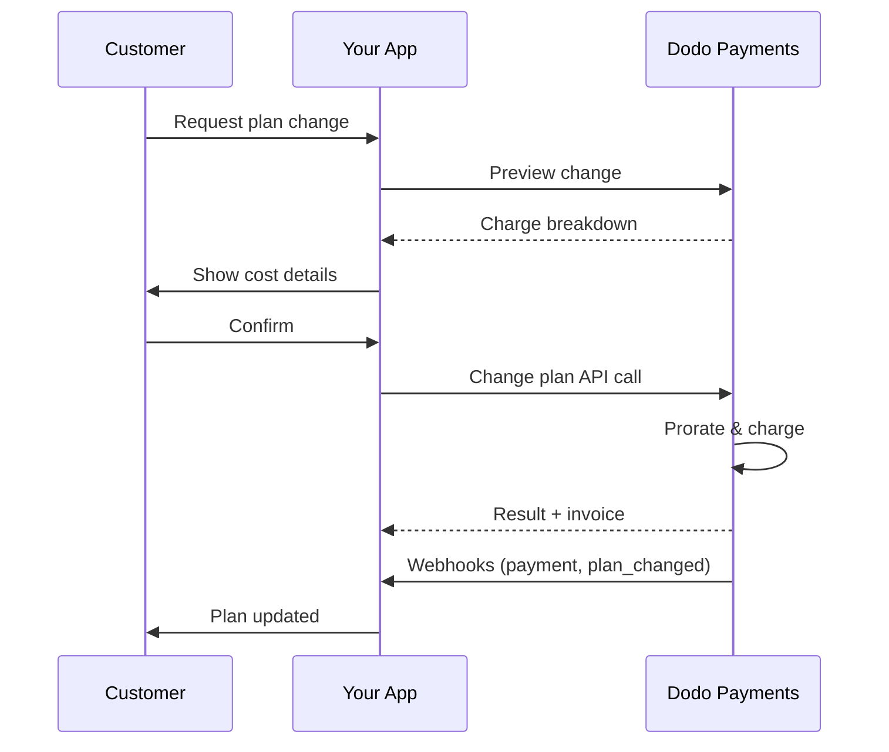
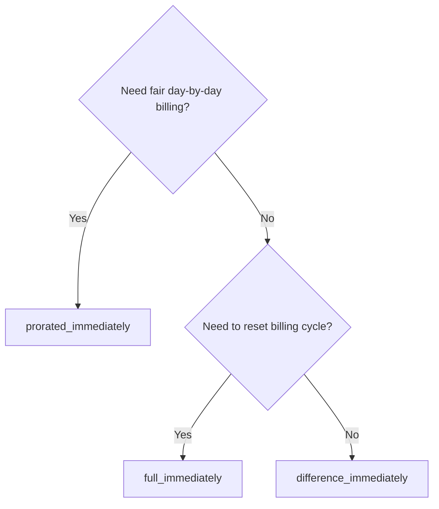
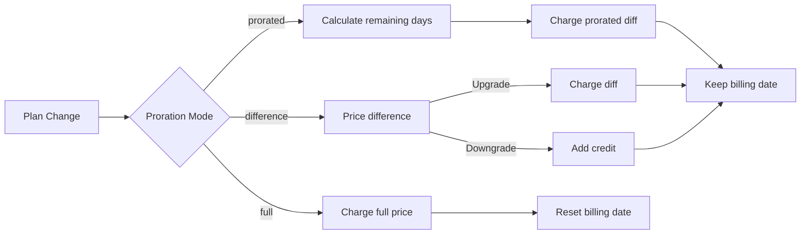

<CardGroup cols={3}>
<Card title="Change Plan API" icon="code" href="/api-reference/subscriptions/change-plan">
  الوثائق الكاملة لواجهة برمجة التطبيقات لتحديث الاشتراكات.
</Card>
<Card title="Plan Change Preview" icon="eye" href="/api-reference/subscriptions/preview-change-plan">
  رؤية مبالغ الرسوم قبل تغيير الخطط.
</Card>
<Card title="Integration Guide" icon="book" href="/developer-resources/subscription-integration-guide">
  إعداد الاشتراك خطوة بخطوة.
</Card>
</CardGroup>

## ما هو ترقية أو تخفيض الاشتراك؟

يسمح تغيير الخطط لك بتحريك العملاء بين مستويات الاشتراك أو الكميات. استخدمه لـ:
- مواءمة التسعير مع الاستخدام أو الميزات
- الانتقال من الشهري إلى السنوي (أو العكس)
- ضبط الكمية للمنتجات المعتمدة على المقاعد

<Info>
يمكن أن يؤدي تغيير الخطط إلى فرض رسوم فورية اعتمادًا على وضع التقسيم الذي تختاره.
</Info>

## متى تستخدم تغييرات الخطط

- ترقية عندما يحتاج العميل إلى المزيد من الميزات أو الاستخدام أو المقاعد
- تخفيض عندما يقل الاستخدام
- نقل المستخدمين إلى منتج أو سعر جديد دون إلغاء اشتراكهم

## تدفق تغيير الخطة



## المتطلبات الأساسية

قبل تنفيذ تغييرات خطة الاشتراك، تأكد من أن لديك:

- حساب تاجر Dodo Payments مع منتجات اشتراك نشطة
- بيانات اعتماد واجهة برمجة التطبيقات (مفتاح API ومفتاح سر الويب هوك) من لوحة التحكم
- اشتراك نشط موجود لتعديله
- نقطة نهاية الويب هوك مكونة للتعامل مع أحداث الاشتراك

<Info>
للحصول على تعليمات إعداد مفصلة، راجع [دليل التكامل](/developer-resources/integration-guide#dashboard-setup).
</Info>

## دليل التنفيذ خطوة بخطوة

اتبع هذا الدليل الشامل لتنفيذ تغييرات خطة الاشتراك في تطبيقك:

<Steps>
<Step title="فهم متطلبات تغيير الخطة">
قبل التنفيذ، حدد:
- أي منتجات اشتراك يمكن تغييرها إلى أي أخرى
- ما هو وضع النسبة المئوية الذي يناسب نموذج عملك
- كيفية التعامل مع تغييرات الخطط الفاشلة بشكل سلس
- أي أحداث ويب هوك يجب تتبعها لإدارة الحالة

<Tip>
اختبر تغييرات الخطط بدقة في وضع الاختبار قبل التنفيذ في الإنتاج.
</Tip>
</Step>

<Step title="اختر استراتيجية النسبة المئوية الخاصة بك">
اختر النهج الفوترة الذي يتماشى مع احتياجات عملك:

<Tabs>
<Tab title="prorated_immediately">
أفضل لـ: تطبيقات SaaS التي ترغب في تحصيل رسوم بشكل عادل عن الوقت غير المستخدم
- يحسب المبلغ الدقيق النسبي بناءً على الوقت المتبقي في الدورة
- يفرض مبلغًا نسبيًا بناءً على الوقت غير المستخدم المتبقي في الدورة
- يوفر فوترة شفافة للعملاء
</Tab>

<Tab title="difference_immediately">
أفضل لـ: سيناريوهات الترقية/التخفيض الواضحة
- ترقية: فرض الفرق الفوري (على سبيل المثال، $30→$80 = فرض $50)
- تخفيض: ائتمان القيمة المتبقية للتجديدات المستقبلية
- يبسط منطق الفوترة والتواصل مع العملاء
</Tab>

<Tab title="full_immediately">
أفضل لـ: عندما تريد إعادة تعيين دورة الفوترة
- يفرض المبلغ الكامل للخطة الجديدة على الفور
- يتجاهل الوقت المتبقي من الخطة القديمة
- مفيد للانتقالات من سنوي إلى شهري
</Tab>
</Tabs>
</Step>

<Step title="تنفيذ واجهة برمجة التطبيقات لتغيير الخطة">
استخدم واجهة برمجة التطبيقات لتغيير الخطة لتعديل تفاصيل الاشتراك:

<ParamField path="subscription_id" type="string" required>
معرف الاشتراك النشط الذي سيتم تعديله.
</ParamField>

<ParamField path="product_id" type="string" required>
معرف المنتج الجديد لتغيير الاشتراك إليه.
</ParamField>

<ParamField path="quantity" type="integer" default="1">
عدد الوحدات للخطة الجديدة (للمنتجات المعتمدة على المقاعد).
</ParamField>

<ParamField path="proration_billing_mode" type="string" required>
كيفية التعامل مع الفوترة الفورية: `prorated_immediately`, `full_immediately`, أو `difference_immediately`.
</ParamField>

<ParamField path="addons" type="array">
إضافات اختيارية للخطة الجديدة. ترك هذه خالية يزيل أي إضافات موجودة.
</ParamField>

<ParamField path="on_payment_failure" type="string">
يتحكم في السلوك عندما يفشل دفع تغيير الخطة:
- `prevent_change`: الاحتفاظ بالاشتراك على الخطة الحالية حتى تنجح عملية الدفع
- `apply_change` (افتراضي): تطبيق تغيير الخطة على الفور بغض النظر عن نتيجة الدفع

إذا لم يتم تحديده، يستخدم إعداد الافتراضي على مستوى العمل.
</ParamField>
</Step>

<Step title="تعامل مع أحداث Webhook">
إعداد معالجة Webhook لتتبع نتائج تغيير خطة:

- `subscription.active`: تم تغيير الخطة بنجاح، تم تحديث الاشتراك
- `subscription.plan_changed`: تم تغيير خطة الاشتراك (ترقية/تخفيض/تحديث الإضافات)
- `subscription.on_hold`: فشل رسوم تغيير الخطة، تم إيقاف الاشتراك
- `payment.succeeded`: تم فرض رسوم فورية لتغيير الخطة بنجاح
- `payment.failed`: فشل الرسوم الفورية

<Warning>
تحقق دائمًا من توقيعات Webhook وتنفيذ معالجة الأحداث idempotent.
</Warning>
</Step>

<Step title="تحديث حالة تطبيقك">
استنادًا إلى أحداث Webhook، قم بتحديث تطبيقك:
- منح/إلغاء الميزات بناءً على الخطة الجديدة
- تحديث لوحة معلومات العميل بتفاصيل الخطة الجديدة
- إرسال رسائل تأكيد بشأن تغييرات الخطة
- تسجيل تغييرات الفوترة لأغراض التدقيق
</Step>

<Step title="اختبار ومراقبة">
اختبر تنفيذك بشكل شامل:
- اختبر جميع أوضاع التقسيم مع سيناريوهات مختلفة
- تحقق من أن معالجة Webhook تعمل بشكل صحيح
- راقب معدلات نجاح تغييرات الخطط
- إعداد تنبيهات لتغييرات الخطط الفاشلة

<Check>
تنفيذ تغيير خطة الاشتراك الآن جاهز للاستخدام في الإنتاج.
</Check>
</Step>
</Steps>

## معاينة تغييرات الخطط

قبل الالتزام بتغيير خطة، استخدم واجهة برمجة التطبيقات للمشاهدة لإظهار للعملاء بالضبط ما سيُفرض عليهم:

<Tabs>
<Tab title="Node.js SDK">

```javascript
const preview = await client.subscriptions.previewChangePlan('sub_123', {
  product_id: 'prod_pro',
  quantity: 1,
  proration_billing_mode: 'prorated_immediately'
});

// Show customer the charge before confirming
console.log('Immediate charge:', preview.immediate_charge.summary);
console.log('New plan details:', preview.new_plan);
```

</Tab>

<Tab title="Python SDK">

```python
preview = client.subscriptions.preview_change_plan(
    subscription_id="sub_123",
    product_id="prod_pro",
    quantity=1,
    proration_billing_mode="prorated_immediately"
)

# Show customer the charge before confirming
print("Immediate charge:", preview.immediate_charge.summary)
print("New plan details:", preview.new_plan)
```

</Tab>
</Tabs>

<Tip>
استخدم واجهة برمجة التطبيقات للمشاهدة لبناء حوارات تأكيد تظهر للعملاء المبلغ الدقيق الذي سيتحملونه قبل تأكيد تغيير الخطة.
</Tip>

## واجهة برمجة التطبيقات لتغيير الخطة

استخدم واجهة برمجة التطبيقات لتغيير الخطة لتعديل المنتج والكمية وسلوك التقسيم للاشتراك النشط.

### أمثلة على البدء السريع

<Tabs>
  <Tab title="Node.js SDK">

    ```javascript
    import DodoPayments from 'dodopayments';

    const client = new DodoPayments({
      bearerToken: process.env.DODO_PAYMENTS_API_KEY,
      environment: 'test_mode', // defaults to 'live_mode'
    });

    async function changePlan() {
      const result = await client.subscriptions.changePlan('sub_123', {
        product_id: 'prod_new',
        quantity: 3,
        proration_billing_mode: 'prorated_immediately',
        on_payment_failure: 'prevent_change', // Optional: control behavior on payment failure
      });
      console.log(result.status, result.invoice_id, result.payment_id);
    }

    changePlan();
    ```

  </Tab>
  <Tab title="Python SDK">

    ```python
    import os
    from dodopayments import DodoPayments

    client = DodoPayments(
        bearer_token=os.environ.get("DODO_PAYMENTS_API_KEY"),
        environment="test_mode",  # defaults to "live_mode"
    )

    result = client.subscriptions.change_plan(
        subscription_id="sub_123",
        product_id="prod_new",
        quantity=3,
        proration_billing_mode="prorated_immediately",
        on_payment_failure="prevent_change",  # Optional: control behavior on payment failure
    )
    print(result.status, result.get("invoice_id"), result.get("payment_id"))
    ```

  </Tab>
  <Tab title="Go SDK">

    ```go
    package main

    import (
      "context"
      "fmt"
      "github.com/dodopayments/dodopayments-go"
      "github.com/dodopayments/dodopayments-go/option"
    )

    func main() {
      client := dodopayments.NewClient(option.WithBearerToken("YOUR_TOKEN"))
      res, err := client.Subscriptions.ChangePlan(context.TODO(), dodopayments.SubscriptionChangePlanParams{
        SubscriptionID: dodopayments.F("sub_123"),
        ProductID:             dodopayments.F("prod_new"),
        Quantity:              dodopayments.F(int64(3)),
        ProrationBillingMode:  dodopayments.F(dodopayments.SubscriptionChangePlanParamsProrationBillingModeProratedImmediately),
        OnPaymentFailure:      dodopayments.F(dodopayments.OnPaymentFailurePreventChange), // Optional
      })
      if err != nil { panic(err) }
      fmt.Println(res.Status, res.InvoiceID, res.PaymentID)
    }
    ```

  </Tab>
  <Tab title="HTTP">

    ```bash
    curl -X POST "$DODO_API_BASE/subscriptions/sub_123/change-plan" \
      -H "Authorization: Bearer $DODO_PAYMENTS_API_KEY" \
      -H "Content-Type: application/json" \
      -d '{
        "product_id": "prod_new",
        "quantity": 3,
        "proration_billing_mode": "prorated_immediately",
        "on_payment_failure": "prevent_change"
      }'
    ```

  </Tab>
</Tabs>

```json Success
{
  "status": "processing",
  "subscription_id": "sub_123",
  "invoice_id": "inv_789",
  "payment_id": "pay_456",
  "proration_billing_mode": "prorated_immediately"
}
```

<Note>
تُرجع حقول مثل <code>invoice_id</code> و<code>payment_id</code> فقط عند إنشاء رسوم فورية و/أو فاتورة أثناء تغيير الخطة. اعتمد دائمًا على أحداث Webhook (مثل <code>payment.succeeded</code>، <code>subscription.plan_changed</code>) لتأكيد النتائج.
</Note>

<Warning>
إذا فشلت الرسوم الفورية، قد ينتقل الاشتراك إلى `subscription.on_hold` حتى تنجح عملية الدفع.
</Warning>

## إدارة الإضافات

عند تغيير خطط الاشتراك، يمكنك أيضًا تعديل الإضافات:

```javascript
// Add addons to the new plan
await client.subscriptions.changePlan('sub_123', {
  product_id: 'prod_new',
  quantity: 1,
  proration_billing_mode: 'difference_immediately',
  addons: [
    { addon_id: 'addon_123', quantity: 2 }
  ]
});

// Remove all existing addons
await client.subscriptions.changePlan('sub_123', {
  product_id: 'prod_new',
  quantity: 1,
  proration_billing_mode: 'difference_immediately',
  addons: [] // Empty array removes all existing addons
});
```

<Info>
تُدرج الإضافات في حساب التقسيم وسيتم فرض رسوم وفقًا لوضع التقسيم المختار.
</Info>

## أوضاع التقسيم

اختر كيفية فواترة العميل عند تغيير الخطط:

#### `prorated_immediately`
- تفرض رسومًا على الفرق الجزئي في الدورة الحالية
- إذا كنت في الفترة التجريبية، تفرض الرسوم على الفور وتتحول إلى الخطة الجديدة الآن
- تخفيض: قد يولد رصيدًا مُخفضًا يُطبق على التجديدات المستقبلية

#### `full_immediately`
- تفرض الرسوم على المبلغ الكامل للخطة الجديدة على الفور
- تتجاهل الوقت المتبقي من الخطة القديمة

<Info>
الائتمانات التي تم إنشاؤها بواسطة التخفيضات باستخدام <code>difference_immediately</code> هي محصورة في الاشتراك ومتميزة عن <a href="/features/customer-credit">الائتمانات الخاصة بالعملاء</a>. يتم تطبيقها تلقائيًا على التجديدات المستقبلية لنفس الاشتراك وليست قابلة للنقل بين الاشتراكات.
</Info>

#### `difference_immediately`
- ترقية: تفرض مباشرة الفرق في السعر بين الخطط القديمة والجديدة
- تخفيض: أضف القيمة المتبقية كائتمان داخلي للاشتراك وتطبيقها تلقائيًا على التجديدات

| الميزة | `prorated_immediately` | `difference_immediately` | `full_immediately` |
|---------|----------------------|------------------------|-------------------|
| **رسوم الترقية** | الفرق المقسّم للأيام المتبقية | الفرق الكامل في السعر بين الخطتين | السعر الكامل للخطة الجديدة |
| **ائتمان التخفيض** | ائتمان مقسّم للأيام المتبقية | الفرق الكامل في السعر كائتمان | لا ائتمان |
| **دورة الفوترة** | لا تتغير | لا تتغير | تعود إلى اليوم |
| **سلوك التجربة** | ينهي التجربة، يفرض الرسوم على الفور | ينهي التجربة، يفرض الرسوم على الفور | ينهي التجربة، يفرض المبلغ الكامل |
| **الأفضل لـ** | فوترة عادلة بناءً على الوقت | عملية بسيطة للترقية/التخفيض | إعادة تعيين دورات الفوترة |
| **التعقيد** | متوسط (حساب الأيام) | منخفض (طرح بسيط) | منخفض (رسوم كاملة) |



### سيناريوهات الأمثلة

استخدم هذه الأرقام القانونية بشكل متسق:
- الخطة الحالية: **أساسية** مقابل **30 دولارًا/شهر**
- هدف الترقية: **احترافي** مقابل **80 دولارًا/شهر**
- هدف التخفيض (من احترافي): **بداية** مقابل **20 دولارًا/شهر**
- دورة الفوترة: **30 يومًا**، بدأت في **1 يناير**
- يحدث تغيير الخطة في **16 يناير** (15 يومًا متبقية، 15 يومًا مستخدمة)

<AccordionGroup>
  <Accordion title="ترقية: أساسية (30 دولارًا) → احترافي (80 دولارًا) مع prorated_immediately ">


    ```
    Step 1: Calculate unused credit from current plan
      Unused days = 15 out of 30 days
      Credit = $30 × (15/30) = $15.00

    Step 2: Calculate prorated cost of new plan
      Remaining days = 15 out of 30 days
      New plan cost = $80 × (15/30) = $40.00

    Step 3: Calculate immediate charge
      Charge = New plan cost − Credit
      Charge = $40.00 − $15.00 = $25.00

    → Customer pays $25.00 now
    → Next renewal (Feb 1): $80.00/month
    ```

    ```javascript
    await client.subscriptions.changePlan('sub_123', {
      product_id: 'prod_pro',
      quantity: 1,
      proration_billing_mode: 'prorated_immediately'
    })
    ```

  </Accordion>

  <Accordion title="تخفيض: احترافي (80 دولارًا) → بداية (20 دولارًا) مع prorated_immediately ">

    ```
    Step 1: Calculate unused credit from current plan
      Unused days = 15 out of 30 days
      Credit = $80 × (15/30) = $40.00

    Step 2: Calculate prorated cost of new plan
      Remaining days = 15 out of 30 days
      New plan cost = $20 × (15/30) = $10.00

    Step 3: Calculate credit balance
      Credit = $40.00 − $10.00 = $30.00

    → No charge — $30.00 credit added to subscription
    → Credit auto-applies to future renewals
    → Next renewal (Feb 1): $20.00 − $30.00 credit = $0.00
    → Following renewal (Mar 1): $20.00 − $10.00 remaining credit = $10.00
    ```

    ```javascript
    await client.subscriptions.changePlan('sub_123', {
      product_id: 'prod_starter',
      quantity: 1,
      proration_billing_mode: 'prorated_immediately'
    })
    ```

  </Accordion>

  <Accordion title="ترقية: أساسية (30 دولارًا) → احترافي (80 دولارًا) مع difference_immediately ">

    ```
    Immediate charge = New plan price − Old plan price
                     = $80 − $30
                     = $50.00

    → Customer pays $50.00 now (regardless of cycle position)
    → Next renewal (Feb 1): $80.00/month
    ```

    ```javascript
    await client.subscriptions.changePlan('sub_123', {
      product_id: 'prod_pro',
      quantity: 1,
      proration_billing_mode: 'difference_immediately'
    })
    ```

  </Accordion>

  <Accordion title="تخفيض: احترافي (80 دولارًا) → بداية (20 دولارًا) مع difference_immediately ">

    ```
    Credit = Old plan price − New plan price
           = $80 − $20
           = $60.00

    → No charge — $60.00 credit added to subscription
    → Credit auto-applies to future renewals
    → Next renewal: $20.00 − $20.00 (from credit) = $0.00
    → Following renewal: $20.00 − $20.00 (from credit) = $0.00
    → Third renewal: $20.00 − $20.00 (from remaining credit) = $0.00
    ```

    ```javascript
    await client.subscriptions.changePlan('sub_123', {
      product_id: 'prod_starter',
      quantity: 1,
      proration_billing_mode: 'difference_immediately'
    })
    ```

  </Accordion>

  <Accordion title="ترقية: أساسية (30 دولارًا) → احترافي (80 دولارًا) مع full_immediately ">

    ```
    Immediate charge = Full new plan price = $80.00

    → Customer pays $80.00 now
    → No credit for unused time on old plan
    → Billing cycle resets to today (January 16)
    → Next renewal: February 16 at $80.00/month
    ```

    ```javascript
    await client.subscriptions.changePlan('sub_123', {
      product_id: 'prod_pro',
      quantity: 1,
      proration_billing_mode: 'full_immediately'
    })
    ```

  </Accordion>

  <Accordion title="ترقية منتصف الدورة مع إضافات باستخدام prorated_immediately ">

    ```
    Current: Basic plan ($30/month), no add-ons
    New: Pro plan ($80/month) + Extra Seats add-on ($10/seat × 3 seats = $30/month)
    Change on day 16 of 30 (15 days remaining)

    Step 1: Credit from current plan
      Credit = $30 × (15/30) = $15.00

    Step 2: Prorated cost of new plan + add-ons
      New plan = $80 × (15/30) = $40.00
      Add-ons = $30 × (15/30) = $15.00
      Total new = $55.00

    Step 3: Immediate charge
      Charge = $55.00 − $15.00 = $40.00

    → Customer pays $40.00 now
    → Next renewal: $80.00 + $30.00 = $110.00/month
    ```

    ```javascript
    await client.subscriptions.changePlan('sub_123', {
      product_id: 'prod_pro',
      quantity: 1,
      proration_billing_mode: 'prorated_immediately',
      addons: [
        { addon_id: 'addon_seats', quantity: 3 }
      ]
    })
    ```

  </Accordion>
</AccordionGroup>

### كيفية معالجة كل وضع الفوترة



<Tip>
اختر `prorated_immediately` للمحاسبة العادلة القائمة على الوقت؛ اختر `full_immediately` لإعادة تشغيل الفوترة؛ استخدم `difference_immediately` للترقيات البسيطة والائتمان التلقائي في التخفيضات.
</Tip>

## التعامل مع فشل الدفع

تحكم فيما يحدث عندما يفشل دفع تغيير الخطة باستخدام معلمة `on_payment_failure`.

### أوضاع فشل الدفع

<Tabs>
<Tab title="prevent_change (موصى به للترقيات الحرجة)">
**السلوك**: احتفظ بالاشتراك على خطته الحالية حتى تنجح عملية الدفع.

- يتم تمييز تغيير الخطة كـ "معلق"
- يحتفظ العميل بالوصول إلى خطته الحالية
- ينتقل الاشتراك إلى `active` فقط بعد نجاح عملية الدفع
- مفيد عندما تريد التأكد من الدفع قبل منح الميزات المُتقدمة

```javascript
await client.subscriptions.changePlan('sub_123', {
  product_id: 'prod_pro',
  quantity: 1,
  proration_billing_mode: 'prorated_immediately',
  on_payment_failure: 'prevent_change'
});
```

</Tab>

<Tab title="apply_change (افتراضي)">
**السلوك**: تطبيق تغيير الخطة على الفور بغض النظر عن نتيجة الدفع.

- يتم تطبيق تغيير الخطة حتى وإن فشل الدفع
- يحصل العميل على وصول فوري للخطة الجديدة
- قد ينتقل الاشتراك إلى `on_hold` إذا فشل الدفع
- جيد للترقيات غير الحرجة أو عندما تثق بالعميل

```javascript
await client.subscriptions.changePlan('sub_123', {
  product_id: 'prod_pro',
  quantity: 1,
  proration_billing_mode: 'prorated_immediately',
  on_payment_failure: 'apply_change' // This is the default
});
```

</Tab>
</Tabs>

<Info>
إذا لم يتم تحديده، تستخدم معلمة `on_payment_failure` إعدادك الافتراضي على مستوى العمل المكون في لوحة المعلومات.
</Info>

### متى تستخدم كل وضع

| السيناريو | الوضع الموصى به | السبب |
|----------|------------------|--------|
| الترقية إلى ميزات مميزة | `prevent_change` | ضمان الدفع قبل منح الوصول |
| زيادة الكمية (المزيد من المقاعد) | `prevent_change` | منع الاستخدام بدون دفع |
| تخفيض الخطط | `apply_change` | يقوم العميل بتقليل الإنفاق |
| عملاء الشركات الموثوقين | `apply_change` | مخاطر أقل لعدم الدفع |
| تحويل من التجربة إلى الدفع | `prevent_change` | لحظة حرجة للدفع |

## التعامل مع Webhooks

تابع حالة الاشتراك من خلال Webhooks لتأكيد تغييرات الخطط والمدفوعات.

### أنواع الأحداث التي يجب التعامل معها
- `subscription.active`: تم تفعيل الاشتراك
- `subscription.plan_changed`: تم تغيير خطة الاشتراك (ترقية/تخفيض/تغييرات إضافات)
- `subscription.on_hold`: فشل الرسوم، تم إيقاف الاشتراك
- `subscription.renewed`: تم التجديد بنجاح
- `payment.succeeded`: الدفع لتغيير الخطة أو التجديد تم بنجاح
- `payment.failed`: فشل الدفع

<Info>
نوصي بدفع المنطق التجاري من أحداث الاشتراك واستخدام أحداث الدفع للتأكيد والمصالحة.
</Info>

### تحقق من التوقيعات وتعامل مع النوايا

<Tabs>
  <Tab title="معالج Route في Next.js">

    ```javascript
    import { NextRequest, NextResponse } from 'next/server';
    
    export async function POST(req) {
      const webhookId = req.headers.get('webhook-id');
      const webhookSignature = req.headers.get('webhook-signature');
      const webhookTimestamp = req.headers.get('webhook-timestamp');
      const secret = process.env.DODO_WEBHOOK_SECRET;
    
      const payload = await req.text();
      // verifySignature is a placeholder – in production, use a Standard Webhooks library
      const { valid, event } = await verifySignature(
        payload,
        { id: webhookId, signature: webhookSignature, timestamp: webhookTimestamp },
        secret
      );
      if (!valid) return NextResponse.json({ error: 'Invalid signature' }, { status: 400 });
    
      switch (event.type) {
        case 'subscription.active':
          // mark subscription active in your DB
          break;
        case 'subscription.plan_changed':
          // refresh entitlements and reflect the new plan in your UI
          break;
        case 'subscription.on_hold':
          // notify user to update payment method
          break;
        case 'subscription.renewed':
          // extend access window
          break;
        case 'payment.succeeded':
          // reconcile payment for plan change
          break;
        case 'payment.failed':
          // log and alert
          break;
        default:
          // ignore unknown events
          break;
      }
    
      return NextResponse.json({ received: true });
    }
    ```

  </Tab>
  <Tab title="Express.js">

    ```javascript
    import express from 'express';
    
    const app = express();
    app.post('/webhooks/dodo', express.raw({ type: 'application/json' }), async (req, res) => {
      const webhookId = req.header('webhook-id');
      const webhookSignature = req.header('webhook-signature');
      const webhookTimestamp = req.header('webhook-timestamp');
      const secret = process.env.DODO_WEBHOOK_SECRET;
      const payload = req.body.toString('utf8');
    
      const { valid, event } = await verifySignature(
        payload,
        { id: webhookId, signature: webhookSignature, timestamp: webhookTimestamp },
        secret
      );
      if (!valid) return res.status(400).send('Invalid signature');
    
      // handle events like above
      res.json({ received: true });
    });
    
    app.listen(3000);
    ```

  </Tab>
</Tabs>

<Note>
للحصول على مخططات الدفع التفصيلية، انظر <a href="/developer-resources/webhooks/intents/subscription">بيانات الحمولة لويب هوك الاشتراك</a> و<a href="/developer-resources/webhooks/intents/payment">بيانات الحمل لويب هوك الدفع</a>.
</Note>

## أفضل الممارسات

اتبع هذه التوصيات لإجراء تغييرات موثوقة في خطة الاشتراك:

### استراتيجية تغيير الخطة
- **اختبر بدقة**: دائمًا اختبر تغييرات الخطة في وضع الاختبار قبل الإنتاج
- **اختر التقسيم بحذر**: اختر وضع التقسيم الذي يتماشى مع نموذج عملك
- **تعامل مع الفشل براحة**: نفذ معالجة الأخطاء المناسبة ومنطق إعادة المحاولة
- **راقب معدلات النجاح**: تتبع معدلات نجاح/فشل تغييرات الخطط واستكشاف المشكلات

### تنفيذ Webhook
- **تحقق من التوقيعات**: دائمًا تحقق من توقيعات Webhook لضمان الأصالة
- **تنفيذ idempotency**: تعامل مع أحداث Webhook المتكررة براحة
- **معالجة غير متزامنة**: لا تقم بحظر ردود Webhook من خلال عمليات ثقيلة
- **سجل كل شيء**: احتفظ بسجلات تفصيلية لأغراض تصحيح الأخطاء والتدقيق

### تجربة المستخدم
- **تواصل بوضوح**: أبلغ العملاء بتغييرات الفوترة والتوقيت
- **قدم تأكيدات**: أرسل رسائل بريد إلكتروني للتأكيد بشأن تغييرات الخطط الناجحة
- **تعامل مع الحالات الشاذة**: اعتبر الفترات التجريبية، التقسيمات، وفشل المدفوعات
- **تحديث واجهة المستخدم على الفور**: عكس تغييرات الخطط في واجهة تطبيقك

## المشكلات الشائعة والحلول

حل المشكلات النموذجية التي تم مواجهتها أثناء تغييرات خطة الاشتراك:

<AccordionGroup>
<Accordion title="تم فرض رسوم ولكن لم يتم تحديث الاشتراك">
**الأعراض**: يتم نجاح استدعاء API ولكن الاشتراك يبقى على الخطة القديمة

**الأسباب الشائعة**:
- فشل معالجة Webhook أو تأخيرات
- عدم تحديث حالة التطبيق بعد استلام Webhooks
- مشاكل في معاملات قاعدة البيانات أثناء تحديث الحالة

**الحلول**:
- نفذ معالجة Webhook قوية مع منطق إعادة المحاولة
- استخدم عمليات idempotent لتحديث الحالات
- أضف مراقبة لاكتشاف وإشعار على أحداث Webhook المفقودة
- تحقق من أن نقطة النهاية لـ Webhook متاحة وتستجيب بشكل صحيح
</Accordion>

<Accordion title="الائتمانات غير المطبقة بعد التخفيض">
**الأعراض**: يقوم العميل بالتخفيض لكنه لا يرى رصيد الائتمان

**الأسباب الشائعة**:
- توقعات وضع التقسيم: الائتمانات الخاصة بالتخفيضات تطبق الفرق الكامل في السعر للخطة باستخدام `difference_immediately`، بينما `prorated_immediately` تنشئ ائتمانًا جزئيًا استنادًا إلى الوقت المتبقي في الدورة
- الائتمانات هي خاصة بالاشتراك ولا تنتقل بين الاشتراكات
- رصيد الائتمان ليس مرئيًا في لوحة معلومات العميل

**الحلول**:
- استخدم `difference_immediately` للتخفيضات عندما ترغب في الحصول على ائتمانات تلقائية
- اشرح للعملاء أن الائتمانات تنطبق على التجديدات المستقبلية لنفس الاشتراك
- نفذ بوابة العملاء لإظهار أرصدة الائتمان
- تحقق من معاينة الفاتورة التالية لرؤية الائتمانات المطبقة
</Accordion>

<Accordion title="فشل التحقق من توقيع Webhook">
**الأعراض**: تم رفض أحداث Webhook بسبب توقيع غير صالح

**الأسباب الشائعة**:
- مفتاح السري لـ Webhook غير صحيح
- تم تعديل جسم الطلب الخام قبل التحقق من التوقيع
- خوارزمية التحقق من التوقيع غير صحيحة

**الحلول**:
- تحقق من أنك تستخدم `DODO_WEBHOOK_SECRET` الصحيح من لوحة المعلومات
- اقرأ جسم الطلب الخام قبل أي وسيلة معالجة JSON
- استخدم مكتبة التحقق من Webhook القياسية لمنصتك
- اختبر التحقق من توقيعات Webhook في بيئة التطوير
</Accordion>

<Accordion title="فشل تغيير الخطة مع خطأ 422">
**الأعراض**: يعيد API خطأ 422 Unprocessable Entity

**الأسباب الشائعة**:
- معرف الاشتراك غير صالح أو معرف المنتج
- الاشتراك ليس في حالة نشطة
- المعلمات المطلوبة مفقودة
- المنتج غير متوفر لتغييرات الخطة

**الحلول**:
- تحقق من أن الاشتراك موجود ونشط
- تحقق من أن معرف المنتج صالح ومتوافر
- تأكد من توفير جميع المعلمات المطلوبة
- راجع وثائق API لمتطلبات المعلمة
</Accordion>

<Accordion title="فشل الرسوم الفورية أثناء تغيير الخطة">
**الأعراض**: تم بدء تغيير الخطة ولكن فشلت الرسوم الفورية

**الأسباب الشائعة**:
- عدم كفاية الأموال في طريقة الدفع للعميل
- انتهت صلاحية طريقة الدفع أو غير صالحة
- البنك رفض المعاملة
- تم حظر الرسوم بواسطة اكتشاف الاحتيال

**الحلول**:
- تعامل مع أحداث Webhook `payment.failed` بشكل مناسب
- أخطر العميل لتحديث طريقة الدفع
- نفذ منطق إعادة المحاولة للفشل المؤقت
- اعتبر السماح بتغييرات الخطط مع فشل الرسوم الفورية
</Accordion>

<Accordion title="اشتراك معلق بعد تغيير الخطة">
**الأعراض**: فشلت رسوم تغيير الخطة وانتقل الاشتراك إلى `on_hold` حالة.

**ماذا يحدث**:
عند فشل رسوم تغيير الخطة، يتم تلقائيًا وضع الاشتراك في حالة `on_hold`. لن يتم تجديد الاشتراك تلقائيًا حتى يتم تحديث طريقة الدفع.

**الحل**: تحديث طريقة الدفع لإعادة تنشيط الاشتراك

لإعادة تنشيط الاشتراك من حالة `on_hold` بعد فشل تغيير الخطة:

1. **تحديث طريقة الدفع** باستخدام واجهة برمجة التطبيقات لتحديث طريقة الدفع
2. **إنشاء رسوم تلقائية**: تقوم واجهة برمجة التطبيقات تلقائيًا بإنشاء رسوم للدين المتبقي
3. **توليد فاتورة**: يتم توليد فاتورة لهذه الرسوم
4. **معالجة الدفع**: يتم معالجة الدفع باستخدام طريقة الدفع الجديدة
5. **إعادة التنشيط**: عند نجاح الدفع، يتم إعادة تنشيط الاشتراك إلى حالة `active`

<CodeGroup>

```javascript Node.js
// Reactivate subscription from on_hold after failed plan change
async function reactivateAfterFailedPlanChange(subscriptionId) {
  // Update payment method - automatically creates charge for remaining dues
  const response = await client.subscriptions.updatePaymentMethod(subscriptionId, {
    type: 'new',
    return_url: 'https://example.com/return'
  });
  
  if (response.payment_id) {
    console.log('Charge created for remaining dues:', response.payment_id);
    console.log('Payment link:', response.payment_link);
    
    // Redirect customer to payment_link to complete payment
    // Monitor webhooks for:
    // 1. payment.succeeded - charge succeeded
    // 2. subscription.active - subscription reactivated
  }
  
  return response;
}

// Or use existing payment method if available
async function reactivateWithExistingPaymentMethod(subscriptionId, paymentMethodId) {
  const response = await client.subscriptions.updatePaymentMethod(subscriptionId, {
    type: 'existing',
    payment_method_id: paymentMethodId
  });
  
  // Monitor webhooks for payment.succeeded and subscription.active
  return response;
}
```

```python Python
# Reactivate subscription from on_hold after failed plan change
def reactivate_after_failed_plan_change(subscription_id):
    # Update payment method - automatically creates charge for remaining dues
    response = client.subscriptions.update_payment_method(
        subscription_id=subscription_id,
        type="new",
        return_url="https://example.com/return"
    )
    
    if response.payment_id:
        print("Charge created for remaining dues:", response.payment_id)
        print("Payment link:", response.payment_link)
        
        # Redirect customer to payment_link to complete payment
        # Monitor webhooks for:
        # 1. payment.succeeded - charge succeeded
        # 2. subscription.active - subscription reactivated
    
    return response

# Or use existing payment method if available
def reactivate_with_existing_payment_method(subscription_id, payment_method_id):
    response = client.subscriptions.update_payment_method(
        subscription_id=subscription_id,
        type="existing",
        payment_method_id=payment_method_id
    )
    
    # Monitor webhooks for payment.succeeded and subscription.active
    return response
```

</CodeGroup>

**أحداث Webhook لمراقبتها**:
- `subscription.on_hold`: تم وضع الاشتراك في حالة مؤجلة (تم استلامها عند فشل رسوم تغيير الخطة)
- `payment.succeeded`: الدفع للدين المتبقي تم بنجاح (بعد تحديث طريقة الدفع)
- `subscription.active`: تم إعادة تنشيط الاشتراك بعد نجاح الدفع

**أفضل الممارسات**:
- أخطر العملاء على الفور عندما تفشل رسوم تغيير الخطة
- قدم تعليمات واضحة حول كيفية تحديث طريقة الدفع لديهم
- راقب أحداث Webhook لتتبع حالة إعادة التنشيط
- اعتبر تنفيذ منطق إعادة المحاولة التلقائي لفشل الدفع المؤقت

<Card title="مرجع واجهة برمجة التطبيقات لتحديث طريقة الدفع" icon="code" href="/api-reference/subscriptions/update-payment-method">
استعرض الوثائق الكاملة لواجهة برمجة التطبيقات لتحديث طرق الدفع وإعادة تنشيط الاشتراكات.
</Card>
</Accordion>
</AccordionGroup>

## اختبار تنفيذك

اتبع هذه الخطوات لاختبار تنفيذ تغيير خطة الاشتراك بدقة:

<Steps>
<Step title="إعداد بيئة الاختبار">
- استخدم مفاتيح واجهة برمجة التطبيقات التجريبية والمنتجات التجريبية
- أنشئ اشتراكات تجريبية مع أنواع خطة مختلفة
- تكوين نقطة انتهاء Webhook التجريبية
- إعداد المراقبة والتسجيل
</Step>

<Step title="اختبار أوضاع التقسيم المختلفة">
- اختبر `prorated_immediately` مع مواضع مختلفة لدورة الفوترة
- اختبر `difference_immediately` للترقيات والتخفيضات
- اختبر `full_immediately` لإعادة تعيين دورات الفوترة
- تحقق من أن حسابات الائتمان صحيحة
</Step>

<Step title="اختبار معالجة Webhook">
- تحقق من استلام جميع أحداث Webhook ذات الصلة
- اختبر التحقق من توقيع Webhook
- تعامل مع أحداث Webhook المتكررة براحة
- اختبر سيناريوهات فشل معالجة Webhook
</Step>

<Step title="اختبار سيناريوهات الأخطاء">
- اختبر باستخدام معرفات اشتراك غير صالحة
- اختبر باستخدام طرق دفع منتهية الصلاحية
- اختبر فشل الشبكة ووقت الانتظار
- اختبر مع عدم كفاية الأموال
</Step>

<Step title="مراقبة في الإنتاج">
- إعداد تنبيهات لتغييرات الخطط الفاشلة
- راقب أوقات معالجة Webhook
- تتبع معدلات نجاح تغييرات الخطط
- مراجعة تذاكر دعم العملاء لمشاكل تغييرات الخطط
</Step>
</Steps>

## معالجة الأخطاء

تعامل مع الأخطاء الشائعة في واجهة برمجة التطبيقات براحة في تنفيذك:

### رموز الحالة HTTP

<AccordionGroup>
<Accordion title="200 OK">
تم معالجة طلب تغيير الخطة بنجاح. يتم تحديث الاشتراك وقد بدأت معالجة الدفع.
</Accordion>

<Accordion title="400 Bad Request">
معلمات الطلب غير صالحة. تحقق من أن جميع الحقول المطلوبة تم تقديمها وتم تنسيقها بشكل صحيح.
</Accordion>

<Accordion title="401 Unauthorized">
مفتاح واجهة برمجة التطبيقات غير صالح أو مفقود. تحقق مما إذا كان `DODO_PAYMENTS_API_KEY` صحيحًا وله الأذونات المناسبة.
</Accordion>

<Accordion title="404 Not Found">
معرف الاشتراك غير موجود أو لا ينتمي إلى حسابك.
</Accordion>

<Accordion title="422 Unprocessable Entity">
لا يمكن تغيير الاشتراك (على سبيل المثال، تم إلغاؤه بالفعل، لا يتوفر المنتج، وما إلى ذلك).
</Accordion>

<Accordion title="500 Internal Server Error">
حدث خطأ في الخادم. حاول طلب الإعادة بعد فترة وجيزة.
</Accordion>
</AccordionGroup>

### تنسيق استجابة الخطأ

```json
{
  "error": {
    "code": "subscription_not_found",
    "message": "The subscription with ID 'sub_123' was not found",
    "details": {
      "subscription_id": "sub_123"
    }
  }
}
```

## الخطوات التالية

- مراجعة <a href="/api-reference/subscriptions/change-plan">واجهة برمجة التطبيقات لتغيير الخطة</a>
- استكشاف <a href="/features/customer-credit">ائتمانات العملاء</a>
- تنفيذ تنبيهات لـ `subscription.on_hold`
- تحقق من <a href="/developer-resources/webhooks">دليل تكامل Webhook</a>
