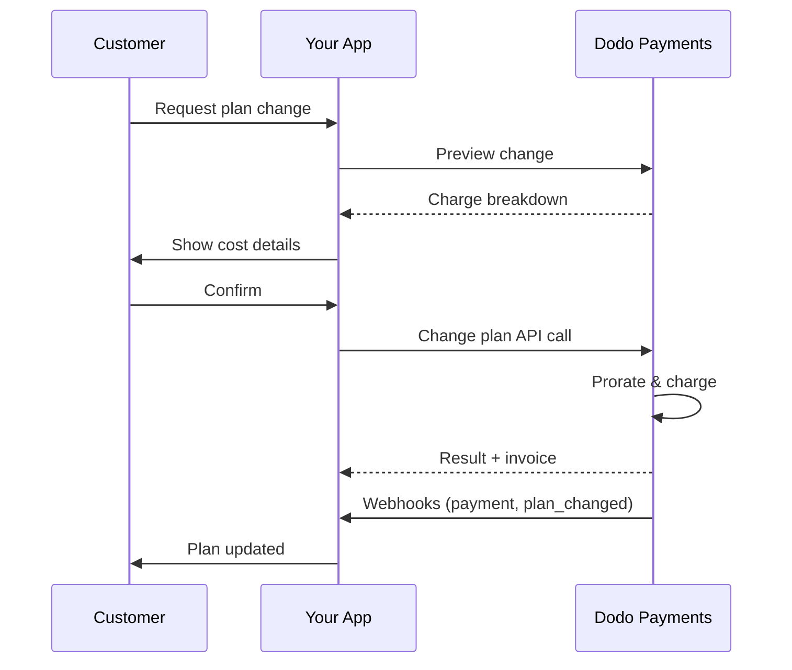
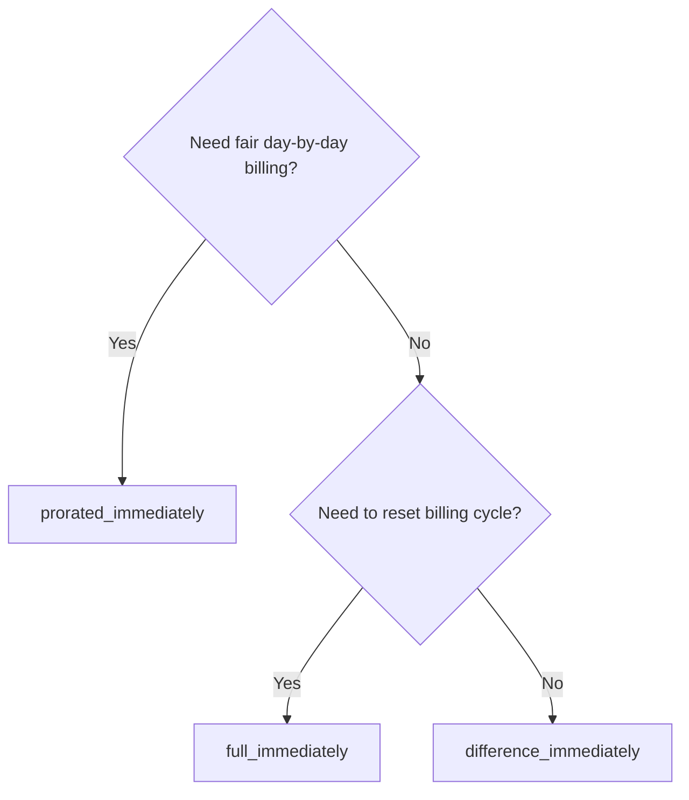
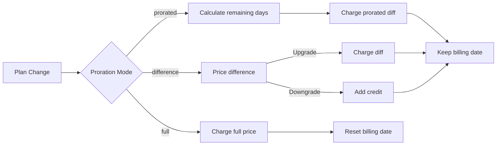

<CardGroup cols={3}>
<Card title="Change Plan API" icon="code" href="/api-reference/subscriptions/change-plan">
  Full API docs for updating subscriptions.
</Card>
<Card title="Plan Change Preview" icon="eye" href="/api-reference/subscriptions/preview-change-plan">
  See charge amounts before changing plans.
</Card>
<Card title="Integration Guide" icon="book" href="/developer-resources/subscription-integration-guide">
  Step-by-step subscription setup.
</Card>
</CardGroup>

## What is a subscription upgrade or downgrade?

Changing plans lets you move a customer between subscription tiers or quantities. Use it to:
- Align pricing with usage or features
- Move from monthly to annual (or vice versa)
- Adjust quantity for seat-based products

<Info>
Plan changes can trigger an immediate charge depending on the proration mode you choose.
</Info>

## When to use plan changes

- Upgrade when a customer needs more features, usage, or seats
- Downgrade when usage decreases
- Migrate users to a new product or price without cancelling their subscription

## Plan Change Flow



## Prerequisites

Before implementing subscription plan changes, ensure you have:

- A Dodo Payments merchant account with active subscription products
- API credentials (API key and webhook secret key) from the dashboard
- An existing active subscription to modify
- Webhook endpoint configured to handle subscription events

<Info>
For detailed setup instructions, see our [Integration Guide](/developer-resources/integration-guide#dashboard-setup).
</Info>

## Step-by-Step Implementation Guide

Follow this comprehensive guide to implement subscription plan changes in your application:

<Steps>
<Step title="Understand Plan Change Requirements">
Before implementing, determine:
- Which subscription products can be changed to which others
- What proration mode fits your business model
- How to handle failed plan changes gracefully
- Which webhook events to track for state management

<Tip>
Test plan changes thoroughly in test mode before implementing in production.
</Tip>
</Step>

<Step title="Choose Your Proration Strategy">
Select the billing approach that aligns with your business needs:

<Tabs>
<Tab title="prorated_immediately">
Best for: SaaS applications wanting to charge fairly for unused time
- Calculates exact prorated amount based on remaining cycle time
- Charges a prorated amount based on unused time remaining in the cycle
- Provides transparent billing to customers
</Tab>

<Tab title="difference_immediately">
Best for: Clear upgrade/downgrade scenarios
- Upgrade: Charge immediate difference (e.g., $30→$80 = charge $50)
- Downgrade: Credit remaining value for future renewals
- Simplifies billing logic and customer communication
</Tab>

<Tab title="full_immediately">
Best for: When you want to reset the billing cycle
- Charges full amount of new plan immediately
- Ignores remaining time from old plan
- Useful for annual to monthly transitions
</Tab>
</Tabs>
</Step>

<Step title="Implement the Change Plan API">
Use the Change Plan API to modify subscription details:

<ParamField path="subscription_id" type="string" required>
The ID of the active subscription to modify.
</ParamField>

<ParamField path="product_id" type="string" required>
The new product ID to change the subscription to.
</ParamField>

<ParamField path="quantity" type="integer" default="1">
Number of units for the new plan (for seat-based products).
</ParamField>

<ParamField path="proration_billing_mode" type="string" required>
How to handle immediate billing: `prorated_immediately`, `full_immediately`, or `difference_immediately`.
</ParamField>

<ParamField path="addons" type="array">
Optional addons for the new plan. Leaving this empty removes any existing addons.
</ParamField>

<ParamField path="on_payment_failure" type="string">
Controls behavior when the plan change payment fails:
- `prevent_change`: Keep subscription on current plan until payment succeeds
- `apply_change` (default): Apply plan change immediately regardless of payment outcome

إذا لم يتم تحديده، يستخدم إعداد الإفتراضي للمستوى التجاري.
</ParamField>

{/* LOCKED_PATTERN_654ba106ce306d93c6eba72bfc37d363 */}
رمز الخصم الاختياري لتطبيقه على الخطة الجديدة. إذا تم توفيره، يتم التحقق من صلاحية الخصم وتطبيقه على تغيير الخطة. إذا لم يتم تقديمه وكان الاشتراك يحتوي على خصم قائم مع `preserve_on_plan_change=true`، فسيتم الحفاظ على الخصم الحالي (إذا كان قابلاً للتطبيق على المنتج الجديد).
</ParamField>
</Step>

<Step title="Handle Webhook Events">
إعداد معالجة webhook لتتبع نتائج تغيير الخطة:

- `subscription.active`: تغيير الخطة ناجح، تم تحديث الاشتراك
- `subscription.plan_changed`: تم تغيير خطة الاشتراك (ترقية/ تخفيض/ تحديث إضافات)
- `subscription.on_hold`: فشل شحن تغيير الخطة، تم إيقاف الاشتراك مؤقتاً
- `payment.succeeded`: نجاح شحن فوري لتغيير الخطة
- `payment.failed`: فشل الشحن الفوري

<Warning>
تأكد دائماً من توقيعات webhook وقم بتنفيذ معالجة أحداث متكررة.
</Warning>
</Step>

<Step title="Update Your Application State">
بناءً على أحداث webhook، قم بتحديث تطبيقك:
- منح/إلغاء الميزات استناداً إلى الخطة الجديدة
- تحديث لوحة تحكم العملاء بتفاصيل الخطة الجديدة
- إرسال رسائل بريد إلكتروني تأكيدية حول تغيير الخطة
- تسجيل تغييرات الفواتير لأغراض التدقيق
</Step>

<Step title="Test and Monitor">
اختبر تنفيذك بدقة:
- اختبر جميع أوضاع النسبة مع السيناريوهات المختلفة
- تحقق من أن معالجة webhook تعمل بشكل صحيح
- راقب معدلات نجاح تغيير الخطة
- قم بإعداد تنبيهات لتغييرات الخطة الفاشلة

<Check>
تنفيذ تغيير خطة الاشتراك الخاص بك جاهز الآن للاستخدام الإنتاجي.
</Check>
</Step>
</Steps>

## معاينة تغييرات الخطة

قبل الالتزام بتغيير الخطة، استخدم الـ Preview API لعرض ما سيتم تحصيله من العملاء بالتحديد:

<Tabs>
<Tab title="Node.js SDK">

```javascript
const preview = await client.subscriptions.previewChangePlan('sub_123', {
  product_id: 'prod_pro',
  quantity: 1,
  proration_billing_mode: 'prorated_immediately'
});

// Show customer the charge before confirming
console.log('Immediate charge:', preview.immediate_charge.summary);
console.log('New plan details:', preview.new_plan);
```

</Tab>

<Tab title="Python SDK">

```python
preview = client.subscriptions.preview_change_plan(
    subscription_id="sub_123",
    product_id="prod_pro",
    quantity=1,
    proration_billing_mode="prorated_immediately"
)

# Show customer the charge before confirming
print("Immediate charge:", preview.immediate_charge.summary)
print("New plan details:", preview.new_plan)
```

</Tab>
</Tabs>

<Tip>
استخدم Preview API لإنشاء حوارات تأكيد تعرض للعملاء المبلغ الدقيق الذي سيتم خصمه قبل تأكيد تغيير الخطة.
</Tip>

## API تغيير الخطة

استخدم API تغيير الخطة لتعديل المنتج والكمية وسلوك النسبة للاشتراك النشط.

### أمثلة بداية سريعة

<Tabs>
  <Tab title="Node.js SDK">

    ```javascript
    import DodoPayments from 'dodopayments';

    const client = new DodoPayments({
      bearerToken: process.env.DODO_PAYMENTS_API_KEY,
      environment: 'test_mode', // defaults to 'live_mode'
    });

    async function changePlan() {
      const result = await client.subscriptions.changePlan('sub_123', {
        product_id: 'prod_new',
        quantity: 3,
        proration_billing_mode: 'prorated_immediately',
        on_payment_failure: 'prevent_change', // Optional: control behavior on payment failure
      });
      console.log(result.status, result.invoice_id, result.payment_id);
    }

    changePlan();
    ```

  </Tab>
  <Tab title="Python SDK">

    ```python
    import os
    from dodopayments import DodoPayments

    client = DodoPayments(
        bearer_token=os.environ.get("DODO_PAYMENTS_API_KEY"),
        environment="test_mode",  # defaults to "live_mode"
    )

    result = client.subscriptions.change_plan(
        subscription_id="sub_123",
        product_id="prod_new",
        quantity=3,
        proration_billing_mode="prorated_immediately",
        on_payment_failure="prevent_change",  # Optional: control behavior on payment failure
    )
    print(result.status, result.get("invoice_id"), result.get("payment_id"))
    ```

  </Tab>
  <Tab title="Go SDK">

    ```go
    package main

    import (
      "context"
      "fmt"
      "github.com/dodopayments/dodopayments-go"
      "github.com/dodopayments/dodopayments-go/option"
    )

    func main() {
      client := dodopayments.NewClient(option.WithBearerToken("YOUR_TOKEN"))
      res, err := client.Subscriptions.ChangePlan(context.TODO(), dodopayments.SubscriptionChangePlanParams{
        SubscriptionID: dodopayments.F("sub_123"),
        ProductID:             dodopayments.F("prod_new"),
        Quantity:              dodopayments.F(int64(3)),
        ProrationBillingMode:  dodopayments.F(dodopayments.SubscriptionChangePlanParamsProrationBillingModeProratedImmediately),
        OnPaymentFailure:      dodopayments.F(dodopayments.OnPaymentFailurePreventChange), // Optional
      })
      if err != nil { panic(err) }
      fmt.Println(res.Status, res.InvoiceID, res.PaymentID)
    }
    ```

  </Tab>
  <Tab title="HTTP">

    ```bash
    curl -X POST "$DODO_API_BASE/subscriptions/sub_123/change-plan" \
      -H "Authorization: Bearer $DODO_PAYMENTS_API_KEY" \
      -H "Content-Type: application/json" \
      -d '{
        "product_id": "prod_new",
        "quantity": 3,
        "proration_billing_mode": "prorated_immediately",
        "on_payment_failure": "prevent_change"
      }'
    ```

  </Tab>
</Tabs>

```json Success
{
  "status": "processing",
  "subscription_id": "sub_123",
  "invoice_id": "inv_789",
  "payment_id": "pay_456",
  "proration_billing_mode": "prorated_immediately"
}
```

<Note>
الحقول مثل <code>invoice_id</code> و<code>payment_id</code> تُرجع فقط عند إنشاء شحن فوري و/أو فاتورة أثناء تغيير الخطة. اعتمد دائماً على أحداث webhook (مثل <code>payment.succeeded</code>، <code>subscription.plan_changed</code>) لتأكيد النتائج.
</Note>

<Warning>
إذا فشل الشحن الفوري، قد ينتقل الاشتراك إلى `subscription.on_hold` حتى ينجح الدفع.
</Warning>

## إدارة الإضافات

عند تغيير خطط الاشتراك، يمكنك أيضاً تعديل الإضافات:

```javascript
// Add addons to the new plan
await client.subscriptions.changePlan('sub_123', {
  product_id: 'prod_new',
  quantity: 1,
  proration_billing_mode: 'difference_immediately',
  addons: [
    { addon_id: 'addon_123', quantity: 2 }
  ]
});

// Remove all existing addons
await client.subscriptions.changePlan('sub_123', {
  product_id: 'prod_new',
  quantity: 1,
  proration_billing_mode: 'difference_immediately',
  addons: [] // Empty array removes all existing addons
});
```

<Info>
تشمل الإضافات في حساب النسبة وستُحسّب وفقًا لنمط النسبة المحدد.
</Info>

## تطبيق رموز الخصم

يمكنك تطبيق رمز خصم عند تغيير خطط الاشتراك. هذا مفيد لتقديم أسعار ترويجية على الترقيات أو النقل.

<Tabs>
<Tab title="Node.js SDK">

```javascript
// Apply a discount code during plan change
await client.subscriptions.changePlan('sub_123', {
  product_id: 'prod_pro',
  quantity: 1,
  proration_billing_mode: 'prorated_immediately',
  discount_code: 'UPGRADE20'
});
```

</Tab>
<Tab title="Python SDK">

```python
# Apply a discount code during plan change
client.subscriptions.change_plan(
    subscription_id="sub_123",
    product_id="prod_pro",
    quantity=1,
    proration_billing_mode="prorated_immediately",
    discount_code="UPGRADE20"
)
```

</Tab>
<Tab title="HTTP">

```bash
curl -X POST "$DODO_API_BASE/subscriptions/sub_123/change-plan" \
  -H "Authorization: Bearer $DODO_PAYMENTS_API_KEY" \
  -H "Content-Type: application/json" \
  -d '{
    "product_id": "prod_pro",
    "quantity": 1,
    "proration_billing_mode": "prorated_immediately",
    "discount_code": "UPGRADE20"
  }'
```

</Tab>
</Tabs>

### سلوك الخصم عند تغيير الخطة

| السيناريو | السلوك |
|----------|----------|
| `discount_code` تم تقديمه | يتم التحقق وتطبيق الخصم على الخطة الجديدة. |
| لم يتم تقديم أي رمز، الخصم الحالي مع `preserve_on_plan_change=true` | يتم تلقائياً الحفاظ على الخصم الحالي إذا كان قابلاً للتطبيق على المنتج الجديد. |
| لم يتم تقديم أي رمز، لا يوجد خصم قابل للحفظ | لا يتم تطبيق أي خصم على الخطة الجديدة. |

<Tip>
استخدم [Preview Plan Change API](/api-reference/subscriptions/preview-change-plan) مع `discount_code` لعرض المبلغ الذي سيوفره العملاء بدقة قبل تأكيد تغيير الخطة.
</Tip>

## أوضاع النسبة

اختر كيفية فوترت العميل عند تغيير الخطط:

#### `prorated_immediately`
- تفرض رسوم على الفرق الجزئي في الدورة الحالية
- إذا كانت تحت التجربة، تفرض الرسوم فوراً وتتحول إلى الخطة الجديدة الآن
- خفض: قد يُنشئ رصيداً بنسبة معينة يُطبق على التجديدات القادمة

#### `full_immediately`
- تفرض الرسوم الكاملة للخطة الجديدة فوراً
- تتجاهل الوقت المتبقي من الخطة القديمة

<Info>
الأرصدة التي تُنشأ عن طريق التخفيض باستخدام <code>difference_immediately</code> مخصصة للاشتراك ومتميزة عن <a href="/features/credit-based-billing">الفوترة القائمة على الائتمان</a>. تُطبق تلقائياً على التجديدات المستقبلية لنفس الاشتراك ولا يمكن نقلها بين الاشتراكات.
</Info>

#### `difference_immediately`
- ترقية: تُفرض رسوم الفروق السعرية بين الخطط القديمة والجديدة فوراً
- تخفيض: تُضاف القيمة المتبقية كرصيد داخلي للاشتراك وتُطبق تلقائياً على التجديدات

| الميزة | `prorated_immediately` | `difference_immediately` | `full_immediately` |
|---------|----------------------|------------------------|-------------------|
| **رسوم الترقية** | الفرق النسبي لأيام الباقية | الفرق السعري الكامل بين الخطط | السعر الكامل للخطة الجديدة |
| **رصيد التخفيض** | رصيد نسبي لأيام الباقية | الفرق السعري الكامل كرصيد | لا رصيد |
| **دورة الفوترة** | لم يتغير | لم يتغير | يعيد الضبط إلى اليوم |
| **سلوك التجربة** | ينهي التجربة، يفرض الرسوم فوراً | ينهي التجربة، يفرض الرسوم فوراً | ينهي التجربة، يفرض المبلغ الكامل |
| **الأفضل لـ** | فوترة عادلة مستندة إلى الوقت | حساب بسيط للترقية/التخفيض | إعادة ضبط دورات الفوترة |
| **التعقيد** | متوسط (حساب اليوم) | منخفض (الطرح البسيط) | منخفض (الرسوم الكاملة) |



### سيناريوهات مثال

استخدم هذه الأرقام القياسية باستمرار:
- الخطة الحالية: **أساسي** بسعر **30 دولار/شهراً**
- هدف الترقية: **محترف** بسعر **80 دولار/شهراً**
- هدف التخفيض (من المحترف): **مبتدئ** بسعر **20 دولار/شهراً**
- دورة الفوترة: **30 يوماً**، بدأت في **1 يناير**
- تغيير الخطة يحدث في **16 يناير** (15 يوماً متبقة، 15 يوماً مستخدمة)

<AccordionGroup>
  <Accordion title="Upgrade: Basic ($30) → Pro ($80) with prorated_immediately">

    ```
    Step 1: Calculate unused credit from current plan
      Unused days = 15 out of 30 days
      Credit = $30 × (15/30) = $15.00

    Step 2: Calculate prorated cost of new plan
      Remaining days = 15 out of 30 days
      New plan cost = $80 × (15/30) = $40.00

    Step 3: Calculate immediate charge
      Charge = New plan cost − Credit
      Charge = $40.00 − $15.00 = $25.00

    → Customer pays $25.00 now
    → Next renewal (Feb 1): $80.00/month
    ```

    ```javascript
    await client.subscriptions.changePlan('sub_123', {
      product_id: 'prod_pro',
      quantity: 1,
      proration_billing_mode: 'prorated_immediately'
    })
    ```

  </Accordion>

  <Accordion title="Downgrade: Pro ($80) → Starter ($20) with prorated_immediately">

    ```
    Step 1: Calculate unused credit from current plan
      Unused days = 15 out of 30 days
      Credit = $80 × (15/30) = $40.00

    Step 2: Calculate prorated cost of new plan
      Remaining days = 15 out of 30 days
      New plan cost = $20 × (15/30) = $10.00

    Step 3: Calculate credit balance
      Credit = $40.00 − $10.00 = $30.00

    → No charge — $30.00 credit added to subscription
    → Credit auto-applies to future renewals
    → Next renewal (Feb 1): $20.00 − $30.00 credit = $0.00
    → Following renewal (Mar 1): $20.00 − $10.00 remaining credit = $10.00
    ```

    ```javascript
    await client.subscriptions.changePlan('sub_123', {
      product_id: 'prod_starter',
      quantity: 1,
      proration_billing_mode: 'prorated_immediately'
    })
    ```

  </Accordion>

  <Accordion title="Upgrade: Basic ($30) → Pro ($80) with difference_immediately">

    ```
    Immediate charge = New plan price − Old plan price
                     = $80 − $30
                     = $50.00

    → Customer pays $50.00 now (regardless of cycle position)
    → Next renewal (Feb 1): $80.00/month
    ```

    ```javascript
    await client.subscriptions.changePlan('sub_123', {
      product_id: 'prod_pro',
      quantity: 1,
      proration_billing_mode: 'difference_immediately'
    })
    ```

  </Accordion>

  <Accordion title="Downgrade: Pro ($80) → Starter ($20) with difference_immediately">

    ```
    Credit = Old plan price − New plan price
           = $80 − $20
           = $60.00

    → No charge — $60.00 credit added to subscription
    → Credit auto-applies to future renewals
    → Next renewal: $20.00 − $20.00 (from credit) = $0.00
    → Following renewal: $20.00 − $20.00 (from credit) = $0.00
    → Third renewal: $20.00 − $20.00 (from remaining credit) = $0.00
    ```

    ```javascript
    await client.subscriptions.changePlan('sub_123', {
      product_id: 'prod_starter',
      quantity: 1,
      proration_billing_mode: 'difference_immediately'
    })
    ```

  </Accordion>

  <Accordion title="Upgrade: Basic ($30) → Pro ($80) with full_immediately">

    ```
    Immediate charge = Full new plan price = $80.00

    → Customer pays $80.00 now
    → No credit for unused time on old plan
    → Billing cycle resets to today (January 16)
    → Next renewal: February 16 at $80.00/month
    ```

    ```javascript
    await client.subscriptions.changePlan('sub_123', {
      product_id: 'prod_pro',
      quantity: 1,
      proration_billing_mode: 'full_immediately'
    })
    ```

  </Accordion>

  <Accordion title="Mid-cycle upgrade with add-ons using prorated_immediately">

    ```
    Current: Basic plan ($30/month), no add-ons
    New: Pro plan ($80/month) + Extra Seats add-on ($10/seat × 3 seats = $30/month)
    Change on day 16 of 30 (15 days remaining)

    Step 1: Credit from current plan
      Credit = $30 × (15/30) = $15.00

    Step 2: Prorated cost of new plan + add-ons
      New plan = $80 × (15/30) = $40.00
      Add-ons = $30 × (15/30) = $15.00
      Total new = $55.00

    Step 3: Immediate charge
      Charge = $55.00 − $15.00 = $40.00

    → Customer pays $40.00 now
    → Next renewal: $80.00 + $30.00 = $110.00/month
    ```

    ```javascript
    await client.subscriptions.changePlan('sub_123', {
      product_id: 'prod_pro',
      quantity: 1,
      proration_billing_mode: 'prorated_immediately',
      addons: [
        { addon_id: 'addon_seats', quantity: 3 }
      ]
    })
    ```

  </Accordion>
</AccordionGroup>

### كيف يعالج كل نمط الفوترة



<Tip>
اختر `prorated_immediately` للمحاسبة العادلة للوقت؛ اختر `full_immediately` لإعادة بدء الفوترة؛ استخدم `difference_immediately` للترقيات البسيطة والائتمان التلقائي عند التخفيضات.
</Tip>

## التعامل مع فشل الدفع

تحكم فيما يحدث عندما يفشل دفع تغيير الخطة باستخدام المعلمة `on_payment_failure`.

### أوضاع فشل الدفع

<Tabs>
<Tab title="prevent_change (Recommended for critical upgrades)">
**السلوك**: الاحتفاظ بالاشتراك على الخطة الحالية حتى ينجح الدفع.

- يتم تحديد تغيير الخطة كـ "معلق"
- يحتفظ العميل بالوصول إلى خطته الحالية
- ينتقل الاشتراك إلى حالة `active` فقط بعد الدفع الناجح
- مفيد عندما ترغب في ضمان الدفع قبل منح الميزات المترقية

```javascript
await client.subscriptions.changePlan('sub_123', {
  product_id: 'prod_pro',
  quantity: 1,
  proration_billing_mode: 'prorated_immediately',
  on_payment_failure: 'prevent_change'
});
```

</Tab>

<Tab title="apply_change (Default)">
**السلوك**: تطبيق تغيير الخطة فوراً بغض النظر عن نتيجة الدفع.

- يتم تطبيق تغيير الخطة حتى لو فشل الدفع
- يحصل العميل على وصول فوري إلى الخطة الجديدة
- قد ينتقل الاشتراك إلى `on_hold` إذا فشل الدفع
- جيد للترقيات غير الحرجة أو عندما تثق في العميل

```javascript
await client.subscriptions.changePlan('sub_123', {
  product_id: 'prod_pro',
  quantity: 1,
  proration_billing_mode: 'prorated_immediately',
  on_payment_failure: 'apply_change' // This is the default
});
```

</Tab>
</Tabs>

<Info>
إذا لم يتم تحديده، تستخدم معلمة `on_payment_failure` إعدادك الافتراضي للمستوى التجاري الذي تم تهيئته في لوحة التحكم.
</Info>

### متى تستخدم كل نمط

| السيناريو | النمط الموصى به | السبب |
|----------|------------------|--------|
| الترقية إلى ميزات مميزة | `prevent_change` | ضمان الدفع قبل منح الوصول |
| زيادة الكمية (مزيد من المقاعد) | `prevent_change` | منع الاستخدام بدون الدفع |
| تخفيض الخطط | `apply_change` | العميل يقلل الإنفاق |
| العملاء المؤسسيون الموثوق بهم | `apply_change` | مخاطر عدم الدفع منخفضة |
| التحويل من تجربة إلى مدفوع | `prevent_change` | لحظة دفع حرجة |

## التعامل مع webhooks

تتبع حالة الاشتراك من خلال webhooks لتأكيد تغييرات الخطة والمدفوعات.

### أنواع الأحداث للتعامل معها
- `subscription.active`: تفعيل الاشتراك
- `subscription.plan_changed`: تم تغيير خطة الاشتراك (ترقية/تخفيض/تغييرات الإضافات)
- `subscription.on_hold`: فشل الشحن، تم إيقاف الاشتراك مؤقتاً
- `subscription.renewed`: تجديد نجاح
- `payment.succeeded`: دفعة ناجحة لتغيير الخطة أو التجديد
- `payment.failed`: فشل الدفع

<Info>
نوصي بقيادة المنطق التجاري من أحداث الاشتراك واستخدام أحداث الدفع للتأكيد والتوفيق.
</Info>

### التحقق من التوقيعات ومعالجة النوايا

<Tabs>
  <Tab title="Next.js Route Handler">

    ```javascript
    import { NextRequest, NextResponse } from 'next/server';
    
    export async function POST(req) {
      const webhookId = req.headers.get('webhook-id');
      const webhookSignature = req.headers.get('webhook-signature');
      const webhookTimestamp = req.headers.get('webhook-timestamp');
      const secret = process.env.DODO_WEBHOOK_SECRET;
    
      const payload = await req.text();
      // verifySignature is a placeholder – in production, use a Standard Webhooks library
      const { valid, event } = await verifySignature(
        payload,
        { id: webhookId, signature: webhookSignature, timestamp: webhookTimestamp },
        secret
      );
      if (!valid) return NextResponse.json({ error: 'Invalid signature' }, { status: 400 });
    
      switch (event.type) {
        case 'subscription.active':
          // mark subscription active in your DB
          break;
        case 'subscription.plan_changed':
          // refresh entitlements and reflect the new plan in your UI
          break;
        case 'subscription.on_hold':
          // notify user to update payment method
          break;
        case 'subscription.renewed':
          // extend access window
          break;
        case 'payment.succeeded':
          // reconcile payment for plan change
          break;
        case 'payment.failed':
          // log and alert
          break;
        default:
          // ignore unknown events
          break;
      }
    
      return NextResponse.json({ received: true });
    }
    ```

  </Tab>
  <Tab title="Express.js">

    ```javascript
    import express from 'express';
    
    const app = express();
    app.post('/webhooks/dodo', express.raw({ type: 'application/json' }), async (req, res) => {
      const webhookId = req.header('webhook-id');
      const webhookSignature = req.header('webhook-signature');
      const webhookTimestamp = req.header('webhook-timestamp');
      const secret = process.env.DODO_WEBHOOK_SECRET;
      const payload = req.body.toString('utf8');
    
      const { valid, event } = await verifySignature(
        payload,
        { id: webhookId, signature: webhookSignature, timestamp: webhookTimestamp },
        secret
      );
      if (!valid) return res.status(400).send('Invalid signature');
    
      // handle events like above
      res.json({ received: true });
    });
    
    app.listen(3000);
    ```

  </Tab>
</Tabs>

<Note>
لمخططات الحمولة المفصلة، انظر إلى <a href="/developer-resources/webhooks/intents/subscription">حمولات webhook للاشتراك</a> و<a href="/developer-resources/webhooks/intents/payment">حمولات webhook للدفع</a>.
</Note>

## أفضل الممارسات

اتبع هذه التوصيات لإجراء تغييرات موثوقة في خطط الاشتراك:

### إستراتيجية تغيير الخطة
- **اختبر بدقة**: دائما اختبر تغييرات الخطة في وضع الاختبار قبل الإنتاج
- **اختر النسبة بعناية**: حدد نمط النسبة الذي يتماشى مع نموذج عملك
- **تعامل مع الفشل برشاقة**: نفذ معالجة الأخطاء المناسبة ومنطق المحاولة مرة أخرى
- **راقب معدلات النجاح**: تتبع معدلات نجاح/فشل تغيير الخطة وتحقيق في المشاكل

### تنفيذ Webhook
- **تحقق من التوقيعات**: تحقق دائماً من توقيعات webhook لضمان الأصالة
- **نفذ التفرد**: تعامل بلطف مع أحداث webhook المكررة
- **معالجة غير متزامنة**: لا تعيقة استجابات webhook بعمليات ثقيلة
- **سجل كل شيء**: حافظ على سجلات مفصلة لأغراض التصحيح والتدقيق

### تجربة المستخدم
- **تواصل بوضوح**: أعلم العملاء بتغييرات الفوترة والوقت
- **قدّم التأكيدات**: أرسل تأكيدات بريد إلكتروني لتغييرات الخطة الناجحة
- **تعامل مع الحالات الحدية**: استخدم فترات التجربة، النسب، والمدفوعات الفاشلة
- **حدّث الواجهة فوراً**: عكس تغييرات الخطة في واجهة تطبيقك

## مشكلات شائعة وحلول

حل المشكلات الشائعة التي تواجهها أثناء تغييرات خطط الاشتراك:

<AccordionGroup>
<Accordion title="Charge created but subscription not updated">
**الأعراض**: يتم نجاح الاتصال API لكن يظل الاشتراك على الخطة القديمة

**الأسباب الشائعة**:
- فشل أو تأخرت معالجة webhook
- لم يتم تحديث حالة التطبيق بعد تلقي webhooks
- مشاكل في معاملات قاعدة البيانات أثناء تحديث الحالة

**الحلول**:
- تنفيذ معالجة webhook قوية مع منطق المحاولة مرة أخرى
- استخدام عمليات متكررة لتحديث الحالة
- إضافة رصد للكشف عن أحداث webhook المفقودة وتنبيهها
- تأكد من أن نقطة نهاية webhook قابلة للوصول وتستجيب بشكل صحيح
</Accordion>

<Accordion title="Credits not applied after downgrade">
**الأعراض**: العميل يخفّض لكن لا يرى رصيد الحساب

**الأسباب الشائعة**:
- توقعات نمط النسبة: التخفيضات ترصد الفرق الكامل في سعر الخطة مع `difference_immediately`، بينما قالب `prorated_immediately` يُنشئ رصيداً نسبياً بناءً على الوقت المتبقي في الدورة
- الأرصدة مخصصة للاشتراك ولا تنتقل بين الاشتراكات
- رصيد الحساب غير مرئي في لوحة تحكم العميل

**الحلول**:
- استخدم `difference_immediately` للتخفيضات عندما تريد الأرصدة التلقائية
- اشرح للعملاء أن الأرصدة تنطبق على التجديدات المستقبلية لنفس الاشتراك
- تنفيذ بوابة عملاء لعرض أرصدة الحسابات
- تحقق من معاينة الفاتورة التالية لرؤية الأرصدة المطبقة
</Accordion>

<Accordion title="Webhook signature verification fails">
**الأعراض**: أحداث webhook تم رفضها بسبب توقيع غير صالح

**الأسباب الشائعة**:
- مفتاح سري غير صحيح لل webhook
- تم تعديل جسم الطلب الخام قبل التحقق من التوقيع
- خوارزمية تحقق التوقيع غير صحيحة

**الحلول**:
- تأكد أنك تستخدم `DODO_WEBHOOK_SECRET` الصحيح من لوحة التحكم
- اقرأ جسم الطلب الخام قبل أي وسيط JSON parsing
- استخدم مكتبة التحقق القياسية لل webhook لمنصتك
- اختبر التحقق من توقيع webhook في بيئة التطوير
</Accordion>

<Accordion title="Plan change fails with 422 error">
**الأعراض**: API يعيد خطأ 422 Unprocessable Entity

**الأسباب الشائعة**:
- معرف اشتراك غير صالح أو معرف منتج
- الاشتراك ليس في حالة نشطة
- المعلمات المطلوبة مفقودة
- المنتج غير متاح لتغييرات الخطة

**الحلول**:
- تحقق من وجود الاشتراك وأنه نشط
- تحقق من أن معرف المنتج صالح ومتاح
- تأكد من تقديم جميع المعلمات المطلوبة
- راجع وثائق API لمتطلبات المعاملات
</Accordion>

<Accordion title="Immediate charge fails during plan change">
**الأعراض**: تم بدء تغيير الخطة لكن فشل الشحن الفوري

**الأسباب الشائعة**:
- أموال غير كافية على طريقة دفع العميل
- طريقة الدفع منتهية أو غير صالحة
- البنك رفض المعاملة
- كشف عن احتيال أوقف الشحن

**الحلول**:
- تعامل مع أحداث `payment.failed` بشكل مناسب
- قم بإخطار العميل لتحديث طريقة الدفع
- تنفيذ منطق المحاولة مرة أخرى للفشل المؤقت
- ضع في اعتبارك السماح بتغييرات الخطة مع الشحنات الفورية الفاشلة
</Accordion>

<Accordion title="Subscription on hold after plan change">
**الأعراض**: فشل شحن تغيير الخطة والتحول إلى حالة `on_hold`

**ماذا يحدث**:
عند فشل شحن تغيير الخطة، يتحول الاشتراك تلقائياً إلى حالة `on_hold`. لن يتم تجديد الاشتراك تلقائياً حتى يتم تحديث طريقة الدفع.

**الحل**: تحديث طريقة الدفع لإعادة تفعيل الاشتراك

لإعادة تفعيل الاشتراك من حالة `on_hold` بعد فشل تغيير الخطة:

1. **تحديث طريقة الدفع** باستخدام API تحديث طريقة الدفع
2. **إنشاء شحن تلقائي**: يقوم ال API تلقائياً بإنشاء شحن للمستحقات المتبقية
3. **توليد الفاتورة**: يتم توليد فاتورة للشحن
4. **معالجة الدفع**: يعالج الدفع باستخدام طريقة الدفع الجديدة
5. **إعادة التفعيل**: عند النجاح في الدفع، يعاد تفعيل الاشتراك إلى الحالة `active`

<CodeGroup>

```javascript Node.js
// Reactivate subscription from on_hold after failed plan change
async function reactivateAfterFailedPlanChange(subscriptionId) {
  // Update payment method - automatically creates charge for remaining dues
  const response = await client.subscriptions.updatePaymentMethod(subscriptionId, {
    type: 'new',
    return_url: 'https://example.com/return'
  });
  
  if (response.payment_id) {
    console.log('Charge created for remaining dues:', response.payment_id);
    console.log('Payment link:', response.payment_link);
    
    // Redirect customer to payment_link to complete payment
    // Monitor webhooks for:
    // 1. payment.succeeded - charge succeeded
    // 2. subscription.active - subscription reactivated
  }
  
  return response;
}

// Or use existing payment method if available
async function reactivateWithExistingPaymentMethod(subscriptionId, paymentMethodId) {
  const response = await client.subscriptions.updatePaymentMethod(subscriptionId, {
    type: 'existing',
    payment_method_id: paymentMethodId
  });
  
  // Monitor webhooks for payment.succeeded and subscription.active
  return response;
}
```

```python Python
# Reactivate subscription from on_hold after failed plan change
def reactivate_after_failed_plan_change(subscription_id):
    # Update payment method - automatically creates charge for remaining dues
    response = client.subscriptions.update_payment_method(
        subscription_id=subscription_id,
        type="new",
        return_url="https://example.com/return"
    )
    
    if response.payment_id:
        print("Charge created for remaining dues:", response.payment_id)
        print("Payment link:", response.payment_link)
        
        # Redirect customer to payment_link to complete payment
        # Monitor webhooks for:
        # 1. payment.succeeded - charge succeeded
        # 2. subscription.active - subscription reactivated
    
    return response

# Or use existing payment method if available
def reactivate_with_existing_payment_method(subscription_id, payment_method_id):
    response = client.subscriptions.update_payment_method(
        subscription_id=subscription_id,
        type="existing",
        payment_method_id=payment_method_id
    )
    
    # Monitor webhooks for payment.succeeded and subscription.active
    return response
```

</CodeGroup>

**أحداث webhook للمراقبة**:
- `subscription.on_hold`: تم وضع الاشتراك مؤقتاً (يُتلقى عند فشل شحن تغيير الخطة)
- `payment.succeeded`: نجاح الدفع للمستحقات المتبقية (بعد تحديث طريقة الدفع)
- `subscription.active`: إعادة تفعيل الاشتراك بعد الدفع الناجح

**أفضل الممارسات**:
- قم بإخطار العملاء فوراً عند فشل شحن تغيير الخطة
- تقديم تعليمات واضحة حول كيفية تحديث طريقة الدفع
- راقب أحداث webhook لمتابعة حالة إعادة التفعيل
- ضع في اعتبارك تنفيذ منطق المحاولة التلقائية لفشل الدفع المؤقت

<Card title="Update Payment Method API Reference" icon="code" href="/api-reference/subscriptions/update-payment-method">
عرض الوثائق الكاملة ل API لتحديث طرق الدفع وإعادة تفعيل الاشتراكات.
</Card>
</Accordion>
</AccordionGroup>

## اختبار تنفيذك

اتبع هذه الخطوات لاختبار تنفيذ تغيير خطة الاشتراك الخاص بك بدقة:

<Steps>
<Step title="Set up test environment">
- استخدم مفاتيح API التجريبية والمنتجات التجريبية
- إنشئ اشتراكات تجريبية بأنواع خطط مختلفة
- قم بتكوين نقطة نهاية webhook التجريبية
- إعداد المراقبة وتسجيل البيانات
</Step>

<Step title="Test different proration modes">
- اختبار `prorated_immediately` مع مواضع مختلفة لدورة الفوترة
- اختبار `difference_immediately` للترقيات والتخفيضات
- اختبار `full_immediately` لإعادة ضبط دورات الفوترة
- التحقق من صحة حسابات الرصيد
</Step>

<Step title="Test webhook handling">
- تحقق من استلام جميع أحداث webhook ذات الصلة
- اختبار تحقق توقيع webhook
- تعامل برفق مع أحداث webhook المكررة
- اختبار سيناريوهات فشل معالجة webhook
</Step>

<Step title="Test error scenarios">
- اختبار باستخدام معرفات اشتراك غير صالحة
- اختبار بطرق دفع منتهية
- اختبار إخفاقات الشبكة والانقطاعات الزمنية
- اختبار بأموال غير كافية
</Step>

<Step title="Monitor in production">
- إعداد تنبيهات لتغييرات الخطة الفاشلة
- مراقبة أوقات معالجة webhook
- تتبع معدلات نجاح تغيير الخطة
- مراجعة تذاكر دعم العملاء لقضايا تغيير الخطة
</Step>
</Steps>

## معالجة الأخطاء

تعامل مع أخطاء API الشائعة برشاقة في تنفيذك:

### رموز حالة HTTP

<AccordionGroup>
<Accordion title="200 OK">
تمت معالجة طلب تغيير الخطة بنجاح. يتم تحديث الاشتراك وبدأ معالجة الدفع.
</Accordion>

<Accordion title="400 Bad Request">
معلمات طلب غير صالحة. تحقق من تقديم جميع الحقول المطلوبة وتنسيقها بشكل صحيح.
</Accordion>

<Accordion title="401 Unauthorized">
مفتاح API غير صالح أو مفقود. تحقق من أن `DODO_PAYMENTS_API_KEY` صحيحة ولديها الأذونات المناسبة.
</Accordion>

<Accordion title="404 Not Found">
معرف الاشتراك غير موجود أو لا ينتمي إلى حسابك.
</Accordion>

<Accordion title="422 Unprocessable Entity">
لا يمكن تغيير الاشتراك (مثلاً، تم إلغاؤه بالفعل، المنتج غير متاح، إلخ.).
</Accordion>

<Accordion title="500 Internal Server Error">
حدث خطأ في الخادم. أعد المحاولة بعد فترة وجيزة.
</Accordion>
</AccordionGroup>

### تنسيق الاستجابة عن الخطأ

```json
{
  "error": {
    "code": "subscription_not_found",
    "message": "The subscription with ID 'sub_123' was not found",
    "details": {
      "subscription_id": "sub_123"
    }
  }
}
```

## الخطوات التالية

- مراجعة <a href="/api-reference/subscriptions/change-plan">Change Plan API</a>
- استكشاف <a href="/features/credit-based-billing">الفوترة القائمة على الائتمان</a>
- تنفيذ التنبيهات لـ `subscription.on_hold`
- اطلع على <a href="/developer-resources/webhooks">دليل دمج Webhook</a>
