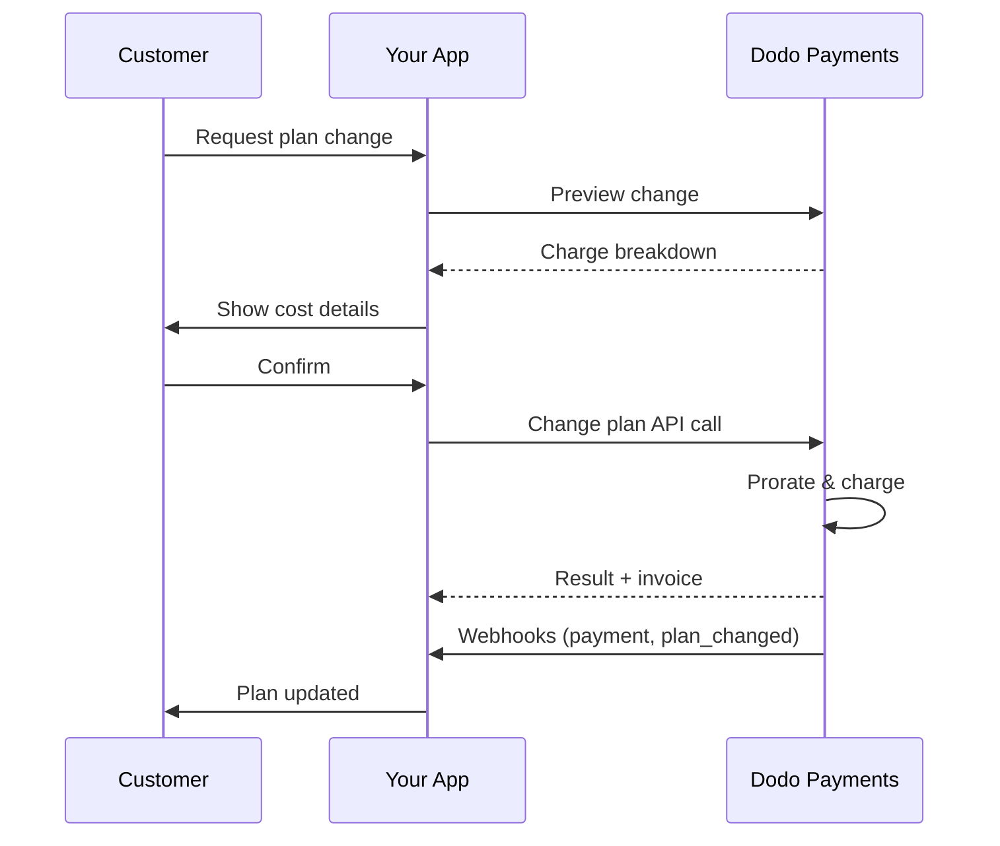
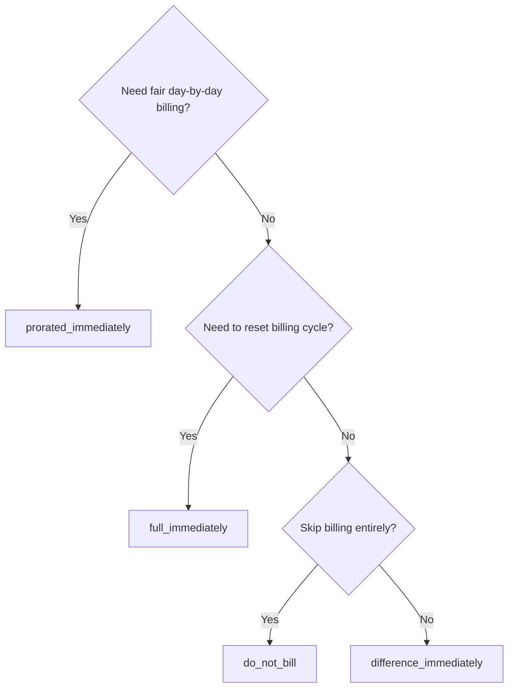
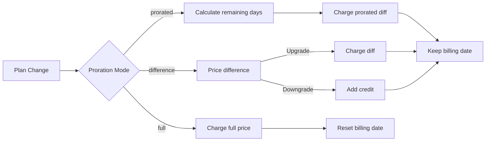

<CardGroup cols={3}>
<Card title="Change Plan API" icon="code" href="/api-reference/subscriptions/change-plan">
  Full API docs for updating subscriptions.
</Card>
<Card title="Plan Change Preview" icon="eye" href="/api-reference/subscriptions/preview-change-plan">
  See charge amounts before changing plans.
</Card>
<Card title="Integration Guide" icon="book" href="/developer-resources/subscription-integration-guide">
  Step-by-step subscription setup.
</Card>
</CardGroup>

## What is a subscription upgrade or downgrade?

Changing plans lets you move a customer between subscription tiers or quantities. Use it to:
- Align pricing with usage or features
- Move from monthly to annual (or vice versa)
- Adjust quantity for seat-based products

<Info>
Plan changes can trigger an immediate charge depending on the proration mode you choose.
</Info>

## When to use plan changes

- Upgrade when a customer needs more features, usage, or seats
- Downgrade when usage decreases
- Migrate users to a new product or price without cancelling their subscription

## Plan Change Flow



## Prerequisites

Before implementing subscription plan changes, ensure you have:

- A Dodo Payments merchant account with active subscription products
- API credentials (API key and webhook secret key) from the dashboard
- An existing active subscription to modify
- Webhook endpoint configured to handle subscription events

<Info>
For detailed setup instructions, see our [Integration Guide](/developer-resources/integration-guide#dashboard-setup).
</Info>

## Step-by-Step Implementation Guide

Follow this comprehensive guide to implement subscription plan changes in your application:

<Steps>
<Step title="Understand Plan Change Requirements">
Before implementing, determine:
- Which subscription products can be changed to which others
- What proration mode fits your business model
- How to handle failed plan changes gracefully
- Which webhook events to track for state management

<Tip>
Test plan changes thoroughly in test mode before implementing in production.
</Tip>
</Step>

<Step title="Choose Your Proration Strategy">
Select the billing approach that aligns with your business needs:

<Tabs>
<Tab title="prorated_immediately">
Best for: SaaS applications wanting to charge fairly for unused time
- Calculates exact prorated amount based on remaining cycle time
- Charges a prorated amount based on unused time remaining in the cycle
- Provides transparent billing to customers
</Tab>

<Tab title="difference_immediately">
Best for: Clear upgrade/downgrade scenarios
- Upgrade: Charge immediate difference (e.g., $30→$80 = charge $50)
- Downgrade: Credit remaining value for future renewals
- Simplifies billing logic and customer communication
</Tab>

<Tab title="full_immediately">
Best for: When you want to reset the billing cycle
- Charges full amount of new plan immediately
- Ignores remaining time from old plan
- Useful for annual to monthly transitions
</Tab>

<Tab title="do_not_bill">
Best for: Free migrations, courtesy switches, or absorbing cost differences
- No charges or credits calculated
- Customer moves to the new plan immediately without any billing adjustment
- Billing cycle remains unchanged
</Tab>
</Tabs>
</Step>

<Step title="Implement the Change Plan API">
Use the Change Plan API to modify subscription details:

<ParamField path="subscription_id" type="string" required>
The ID of the active subscription to modify.
</ParamField>

<ParamField path="product_id" type="string" required>
The new product ID to change the subscription to.
</ParamField>

<ParamField path="quantity" type="integer" default="1">
Number of units for the new plan (for seat-based products).
</ParamField>

<ParamField path="proration_billing_mode" type="string" required>
How to handle immediate billing: `prorated_immediately`, `full_immediately`, `difference_immediately`, or `do_not_bill`.
</ParamField>

<ParamField path="addons" type="array">
Optional addons for the new plan. Leaving this empty removes any existing addons.
</ParamField>

<ParamField path="on_payment_failure" type="string">
Controls behavior when the plan change payment fails:
- `prevent_change`: Keep subscription on current plan until payment succeeds
- `apply_change` (default): Apply plan change immediately regardless of payment outcome

If not specified, uses the business-level default setting.
</ParamField>

<ParamField path="discount_codes" type="array">
رموز الخصم **المكدسة** الاختيارية للتطبيق على الخطة الجديدة (بحد أقصى 20، تتم التطبيقة حسب ترتيب المصفوفة). يختلف السلوك بناءً على ما ترسله:

- **غير متوفر / `null`** — سيتم الحفاظ على الخصومات الحالية مع `preserve_on_plan_change=true` إذا كانت تنطبق على المنتج الجديد.
- **`[]` (مصفوفة فارغة)** — إزالة جميع الخصومات الحالية من الاشتراك.
- **`["CODE_A", "CODE_B", ...]`** — استبدال أي خصومات موجودة بهذه المجموعة المكدسة.
</ParamField>

<ParamField path="discount_code" type="string" deprecated>
**مهمل** — يفضل استخدام `discount_codes` للتكاملات الجديدة. هذا الحقل لا يزال يعمل للتوافق مع النسخ القديمة، ولكنه لا يمكن دمجه مع `discount_codes` في نفس الطلب.
</ParamField>

<ParamField path="effective_at" type="string" default="immediately">
متى ينبغي تطبيق تغيير الخطة:
- `immediately` (الافتراضي): تطبيق تغيير الخطة فورًا
- `next_billing_date`: جدولة التغيير لتاريخ الفواتير التالي. يبقى العميل على خطته الحالية حتى نهاية دورة الفواتير.

استخدم `next_billing_date` للتخفيضات حتى يحتفظ العملاء بفوائد خطتهم الحالية حتى نهاية فترة الفواتير.
</ParamField>
</Step>

<Step title="Handle Webhook Events">
إعداد التعامل مع الويب هوك لمتابعة نتائج تغيير الخطة:

- `subscription.active`: تغيير الخطة ناجح، تم تحديث الاشتراك
- `subscription.plan_changed`: تم تغيير خطة الاشتراك (تحديث الترقية/التخفيض/الإضافة)
- `subscription.on_hold`: فشل شحن تغيير الخطة، تم تعليق الاشتراك
- `payment.succeeded`: نجاح الشحن الفوري لتغيير الخطة
- `payment.failed`: فشل الشحن الفوري

<Warning>
تحقق دائمًا من توقيعات الويب هوك وطبق معالجة الأحداث بدون آثار جانبية.
</Warning>
</Step>

<Step title="Update Your Application State">
بناءً على أحداث الويب هوك، قم بتحديث تطبيقك:
- منح/إلغاء الميزات بناءً على الخطة الجديدة
- تحديث لوحة تحكم العميل بتفاصيل الخطة الجديدة
- إرسال رسائل تأكيد عبر البريد الإلكتروني حول تغييرات الخطة
- تسجيل تغييرات الفوترة لأغراض التدقيق
</Step>

<Step title="Test and Monitor">
اختبر تنفيذك بدقة:
- اختبر كافة أوضاع القسمة مع سيناريوهات مختلفة
- تحقق من أن التعامل مع الويب هوك يعمل بشكل صحيح
- راقب معدلات نجاح تغيير الخطة
- إعداد تنبيهات للتغييرات الفاشلة للخطة

<Check>
تنفيذ تغيير خطة الاشتراك لديك الآن جاهز للاستخدام في الإنتاج.
</Check>
</Step>
</Steps>

## معاينة تغييرات الخطة

قبل الالتزام بتغيير الخطة، استخدم واجهة برمجة التطبيقات للمعاينة لعرض تكلفة العملاء بدقة:

<Tabs>
<Tab title="Node.js SDK">

```javascript
const preview = await client.subscriptions.previewChangePlan('sub_123', {
  product_id: 'prod_pro',
  quantity: 1,
  proration_billing_mode: 'prorated_immediately'
});

// Show customer the charge before confirming
console.log('Immediate charge:', preview.immediate_charge.summary);
console.log('New plan details:', preview.new_plan);
```

</Tab>

<Tab title="Python SDK">

```python
preview = client.subscriptions.preview_change_plan(
    subscription_id="sub_123",
    product_id="prod_pro",
    quantity=1,
    proration_billing_mode="prorated_immediately"
)

# Show customer the charge before confirming
print("Immediate charge:", preview.immediate_charge.summary)
print("New plan details:", preview.new_plan)
```

</Tab>
</Tabs>

<Tip>
استخدم واجهة برمجة التطبيقات للمعاينة لإنشاء حوارات التأكيد التي تعرض للعملاء المبلغ الدقيق الذي سيتم تحصيله منهم قبل تأكيد تغيير الخطة.
</Tip>

## واجهة برمجة التطبيقات لتغيير الخطة

استخدم واجهة برمجة التطبيقات لتغيير الخطة لتعديل المنتج والكمية وسلوك القسمة للاشتراك النشط.

### أمثلة سريعة للبدء

<Tabs>
  <Tab title="Node.js SDK">

    ```javascript
    import DodoPayments from 'dodopayments';

    const client = new DodoPayments({
      bearerToken: process.env.DODO_PAYMENTS_API_KEY,
      environment: 'test_mode', // defaults to 'live_mode'
    });

    async function changePlan() {
      const result = await client.subscriptions.changePlan('sub_123', {
        product_id: 'prod_new',
        quantity: 3,
        proration_billing_mode: 'prorated_immediately',
        on_payment_failure: 'prevent_change', // Optional: control behavior on payment failure
      });
      console.log(result.status, result.invoice_id, result.payment_id);
    }

    changePlan();
    ```

  </Tab>
  <Tab title="Python SDK">

    ```python
    import os
    from dodopayments import DodoPayments

    client = DodoPayments(
        bearer_token=os.environ.get("DODO_PAYMENTS_API_KEY"),
        environment="test_mode",  # defaults to "live_mode"
    )

    result = client.subscriptions.change_plan(
        subscription_id="sub_123",
        product_id="prod_new",
        quantity=3,
        proration_billing_mode="prorated_immediately",
        on_payment_failure="prevent_change",  # Optional: control behavior on payment failure
    )
    print(result.status, result.get("invoice_id"), result.get("payment_id"))
    ```

  </Tab>
  <Tab title="Go SDK">

    ```go
    package main

    import (
      "context"
      "fmt"
      "github.com/dodopayments/dodopayments-go"
      "github.com/dodopayments/dodopayments-go/option"
    )

    func main() {
      client := dodopayments.NewClient(option.WithBearerToken("YOUR_TOKEN"))
      res, err := client.Subscriptions.ChangePlan(context.TODO(), dodopayments.SubscriptionChangePlanParams{
        SubscriptionID: dodopayments.F("sub_123"),
        ProductID:             dodopayments.F("prod_new"),
        Quantity:              dodopayments.F(int64(3)),
        ProrationBillingMode:  dodopayments.F(dodopayments.SubscriptionChangePlanParamsProrationBillingModeProratedImmediately),
        OnPaymentFailure:      dodopayments.F(dodopayments.OnPaymentFailurePreventChange), // Optional
      })
      if err != nil { panic(err) }
      fmt.Println(res.Status, res.InvoiceID, res.PaymentID)
    }
    ```

  </Tab>
  <Tab title="HTTP">

    ```bash
    curl -X POST "$DODO_API_BASE/subscriptions/sub_123/change-plan" \
      -H "Authorization: Bearer $DODO_PAYMENTS_API_KEY" \
      -H "Content-Type: application/json" \
      -d '{
        "product_id": "prod_new",
        "quantity": 3,
        "proration_billing_mode": "prorated_immediately",
        "on_payment_failure": "prevent_change"
      }'
    ```

  </Tab>
</Tabs>

```json Success
{
  "status": "processing",
  "subscription_id": "sub_123",
  "invoice_id": "inv_789",
  "payment_id": "pay_456",
  "proration_billing_mode": "prorated_immediately"
}
```

<Note>
يتم إرجاع الحقول مثل <code>invoice_id</code> و<code>payment_id</code> فقط عند إنشاء شحن فوري و/أو فاتورة أثناء تغيير الخطة. اعتمد دائمًا على أحداث الويب هوك ( مثل <code>payment.succeeded</code>, <code>subscription.plan_changed</code>) لتأكيد النتائج.
</Note>

<Warning>
إذا فشل الشحن الفوري، فقد ينتقل الاشتراك إلى `subscription.on_hold` حتى ينجح الدفع.
</Warning>

## إدارة الإضافات

عند تغيير خطط الاشتراك، يمكنك أيضًا تعديل الإضافات:

```javascript
// Add addons to the new plan
await client.subscriptions.changePlan('sub_123', {
  product_id: 'prod_new',
  quantity: 1,
  proration_billing_mode: 'difference_immediately',
  addons: [
    { addon_id: 'addon_123', quantity: 2 }
  ]
});

// Remove all existing addons
await client.subscriptions.changePlan('sub_123', {
  product_id: 'prod_new',
  quantity: 1,
  proration_billing_mode: 'difference_immediately',
  addons: [] // Empty array removes all existing addons
});
```

<Info>
تشمل الإضافات في حساب القسمة وستتحمل الرسوم وفقًا لوضع القسمة المختار.
</Info>

## تطبيق رموز الخصم

يمكنك تطبيق رموز خصم **مكدسة** عند تغيير خطط الاشتراك (بحد أقصى 20، تطبق بترتيب المصفوفة). يكون هذا مفيدًا لتقديم أسعار ترويجية على الترقيات أو النقلات.

<Tabs>
<Tab title="Node.js SDK">

```javascript
// Apply stacked discount codes during plan change
await client.subscriptions.changePlan('sub_123', {
  product_id: 'prod_pro',
  quantity: 1,
  proration_billing_mode: 'prorated_immediately',
  discount_codes: ['UPGRADE20']
});
```

</Tab>
<Tab title="Python SDK">

```python
# Apply stacked discount codes during plan change
client.subscriptions.change_plan(
    subscription_id="sub_123",
    product_id="prod_pro",
    quantity=1,
    proration_billing_mode="prorated_immediately",
    discount_codes=["UPGRADE20"]
)
```

</Tab>
<Tab title="HTTP">

```bash
curl -X POST "$DODO_API_BASE/subscriptions/sub_123/change-plan" \
  -H "Authorization: Bearer $DODO_PAYMENTS_API_KEY" \
  -H "Content-Type: application/json" \
  -d '{
    "product_id": "prod_pro",
    "quantity": 1,
    "proration_billing_mode": "prorated_immediately",
    "discount_codes": ["UPGRADE20"]
  }'
```

</Tab>
</Tabs>

### سلوك الخصم عند تغيير الخطة

| قيمة `discount_codes` | السلوك |
|------------------------|----------|
| غير متوفر / `null` | يتم تلقائيًا الحفاظ على الخصومات الحالية مع `preserve_on_plan_change=true` إذا كانت تنطبق على المنتج الجديد. |
| `[]` (مصفوفة فارغة) | **جميع** الخصومات الحالية يتم إزالتها من الاشتراك. |
| `["CODE_A", "CODE_B", ...]` | يحل محل أي خصومات موجودة بهذه المجموعة المكدسة، التي يتم التحقق منها وتطبيقها بترتيب المصفوفة. |

<Info>
الحقل الفريد `discount_code` في هذه النقطة النهاية **مهمل** ولكن لا يزال يعمل للتوافق مع النسخ القديمة — لا تحتاج التكاملات الحالية لتغييرها على الفور. لا يمكن دمجه مع `discount_codes` في نفس الطلب. انتقل إلى النموذج المصفوفة عندما يكون ذلك مناسبًا.
</Info>

<Tip>
استخدم [واجهة معاينة تغيير الخطة](/api-reference/subscriptions/preview-change-plan) مع `discount_codes` لعرض العملاء كم سيوفرون قبل تأكيد تغيير الخطة.
</Tip>

## أوضاع القسمة

اختر كيفية فرض الفواتير على العميل عند تغيير الخطط:

#### `prorated_immediately`
- رسوم الفرق الجزئي في الدورة الحالية
- إذا كان في فترة تجريبية، فإنه يفرض الرسوم فورًا وينتقل إلى الخطة الجديدة الآن
- خفض: قد ينشئ رصيدًا مقسطًا يتم تطبيقه على التجديدات المستقبلية

#### `full_immediately`
- يفرض المبلغ الكامل للخطة الجديدة فورًا
- يتجاهل الوقت المتبقي من الخطة القديمة

<Info>
الائتمانات التي تم إنشاؤها عن طريق التخفيضات باستخدام <code>difference_immediately</code> مرتبطة بالاشتراك ومختلفة عن استحقاقات <a href="/features/credit-based-billing">الفوترة المستندة إلى الائتمان</a>. يتم تطبيقها تلقائيًا على التجديدات المستقبلية لذات الاشتراك ولا يمكن نقلها بين الاشتراكات.
</Info>

#### `difference_immediately`
- ترقية: يفرض فورًا فرق السعر بين الخطط القديمة والجديدة
- خفض: يضيف القيمة المتبقية كائتمان داخلي للاشتراك ويتم تطبيقه تلقائيًا عند التجديدات

#### `do_not_bill`
- لا يتم حساب رسوم أو ائتمانات
- ينتقل العميل إلى الخطة الجديدة فورًا بدون أي تعديل في الفواتير
- تبقى دورة الفواتير دون تغيير
- الأفضل للمراحلة الطوعية، تحويلات الخطة الحرة، أو استيعاب فروقات التكلفة

| الميزة | `prorated_immediately` | `difference_immediately` | `full_immediately` | `do_not_bill` |
|---------|----------------------|------------------------|-------------------|--------------|
| **رسوم الترقية** | الفرق المقسط للأيام المتبقية | فرق السعر الكامل بين الخطط | سعر الخطة الجديدة بالكامل | بدون رسوم |
| **رصيد التخفيض** | رصيد مقسط للأيام المتبقية | فرق السعر الكامل كائتمان | لا يوجد رصيد | لا يوجد رصيد |
| **دورة الفواتير** | بدون تغيير | بدون تغيير | يعاد تعيينها إلى اليوم | بدون تغيير |
| **سلوك الفترة التجريبية** | تنتهي الفترة التجريبية، تفرض فورًا | تنتهي الفترة التجريبية، تفرض فورًا | تنتهي الفترة التجريبية، تفرض المبلغ الكامل | تنتهي الفترة التجريبية، بدون رسوم |
| **الأفضل ل** | الفوترة العادلة المستندة إلى الوقت | الرياضيات البسيطة للترقية/التخفيض | إعادة تعيين دورات الفواتير | التحويلات الطوعية أو التحولات المجانية |
| **التعقيد** | متوسط (حساب الأيام) | منخفض (طرح بسيط) | منخفض (رسوم كاملة) | لا يوجد |



### سيناريوهات نموذجية

استخدم هذه الأرقام الكنسية باستمرار:
- الخطة الحالية: **أساسي** بسعر **30$/شهر**
- هدف الترقية: **محترف** بسعر **80$/شهر**
- هدف التخفيض (من محترف): **مبتدئ** بسعر **20$/شهر**
- دورة الفوترة: **30 يومًا**، بدأت في **1 يناير**
- يحدث تغيير الخطة في **16 يناير** (تبقى 15 يومًا، استخدمت 15 يومًا)

<AccordionGroup>
  <Accordion title="Upgrade: Basic ($30) → Pro ($80) with prorated_immediately">

    ```
    Step 1: Calculate unused credit from current plan
      Unused days = 15 out of 30 days
      Credit = $30 × (15/30) = $15.00

    Step 2: Calculate prorated cost of new plan
      Remaining days = 15 out of 30 days
      New plan cost = $80 × (15/30) = $40.00

    Step 3: Calculate immediate charge
      Charge = New plan cost − Credit
      Charge = $40.00 − $15.00 = $25.00

    → Customer pays $25.00 now
    → Next renewal (Feb 1): $80.00/month
    ```

    ```javascript
    await client.subscriptions.changePlan('sub_123', {
      product_id: 'prod_pro',
      quantity: 1,
      proration_billing_mode: 'prorated_immediately'
    })
    ```

  </Accordion>

  <Accordion title="Downgrade: Pro ($80) → Starter ($20) with prorated_immediately">

    ```
    Step 1: Calculate unused credit from current plan
      Unused days = 15 out of 30 days
      Credit = $80 × (15/30) = $40.00

    Step 2: Calculate prorated cost of new plan
      Remaining days = 15 out of 30 days
      New plan cost = $20 × (15/30) = $10.00

    Step 3: Calculate credit balance
      Credit = $40.00 − $10.00 = $30.00

    → No charge — $30.00 credit added to subscription
    → Credit auto-applies to future renewals
    → Next renewal (Feb 1): $20.00 − $30.00 credit = $0.00
    → Following renewal (Mar 1): $20.00 − $10.00 remaining credit = $10.00
    ```

    ```javascript
    await client.subscriptions.changePlan('sub_123', {
      product_id: 'prod_starter',
      quantity: 1,
      proration_billing_mode: 'prorated_immediately'
    })
    ```

  </Accordion>

  <Accordion title="Upgrade: Basic ($30) → Pro ($80) with difference_immediately">

    ```
    Immediate charge = New plan price − Old plan price
                     = $80 − $30
                     = $50.00

    → Customer pays $50.00 now (regardless of cycle position)
    → Next renewal (Feb 1): $80.00/month
    ```

    ```javascript
    await client.subscriptions.changePlan('sub_123', {
      product_id: 'prod_pro',
      quantity: 1,
      proration_billing_mode: 'difference_immediately'
    })
    ```

  </Accordion>

  <Accordion title="Downgrade: Pro ($80) → Starter ($20) with difference_immediately">

    ```
    Credit = Old plan price − New plan price
           = $80 − $20
           = $60.00

    → No charge — $60.00 credit added to subscription
    → Credit auto-applies to future renewals
    → Next renewal: $20.00 − $20.00 (from credit) = $0.00
    → Following renewal: $20.00 − $20.00 (from credit) = $0.00
    → Third renewal: $20.00 − $20.00 (from remaining credit) = $0.00
    ```

    ```javascript
    await client.subscriptions.changePlan('sub_123', {
      product_id: 'prod_starter',
      quantity: 1,
      proration_billing_mode: 'difference_immediately'
    })
    ```

  </Accordion>

  <Accordion title="Upgrade: Basic ($30) → Pro ($80) with full_immediately">

    ```
    Immediate charge = Full new plan price = $80.00

    → Customer pays $80.00 now
    → No credit for unused time on old plan
    → Billing cycle resets to today (January 16)
    → Next renewal: February 16 at $80.00/month
    ```

    ```javascript
    await client.subscriptions.changePlan('sub_123', {
      product_id: 'prod_pro',
      quantity: 1,
      proration_billing_mode: 'full_immediately'
    })
    ```

  </Accordion>

  <Accordion title="Mid-cycle upgrade with add-ons using prorated_immediately">

    ```
    Current: Basic plan ($30/month), no add-ons
    New: Pro plan ($80/month) + Extra Seats add-on ($10/seat × 3 seats = $30/month)
    Change on day 16 of 30 (15 days remaining)

    Step 1: Credit from current plan
      Credit = $30 × (15/30) = $15.00

    Step 2: Prorated cost of new plan + add-ons
      New plan = $80 × (15/30) = $40.00
      Add-ons = $30 × (15/30) = $15.00
      Total new = $55.00

    Step 3: Immediate charge
      Charge = $55.00 − $15.00 = $40.00

    → Customer pays $40.00 now
    → Next renewal: $80.00 + $30.00 = $110.00/month
    ```

    ```javascript
    await client.subscriptions.changePlan('sub_123', {
      product_id: 'prod_pro',
      quantity: 1,
      proration_billing_mode: 'prorated_immediately',
      addons: [
        { addon_id: 'addon_seats', quantity: 3 }
      ]
    })
    ```

  </Accordion>
</AccordionGroup>

### كيف يعالج كل وضع الفواتير



<Tip>
اختر `prorated_immediately` للمحاسبة العادلة على الوقت؛ اختر `full_immediately` لإعادة تشغيل الفواتير؛ استخدم `difference_immediately` للترقيات البسيطة والائتمان التلقائي عند التخفيضات؛ أو استخدم `do_not_bill` لتغيير الخطط بدون أي تعديل في الفواتير.
</Tip>

## التعامل مع فشل الدفع

تحكم فيما يحدث عند فشل دفع تغيير الخطة باستخدام معلمة `on_payment_failure`.

### أوضاع فشل الدفع

<Tabs>
<Tab title="prevent_change (Recommended for critical upgrades)">
**السلوك**: ابق الاشتراك على خطته الحالية حتى ينجح الدفع.

- تم وضع علامة على تغيير الخطة كـ "معلق"
- يحتفظ العميل بالوصول إلى خطته الحالية
- ينتقل الاشتراك إلى حالة `active` فقط بعد نجاح الدفع
- مفيد عندما ترغب في ضمان الدفع قبل منح ميزات محدثة

```javascript
await client.subscriptions.changePlan('sub_123', {
  product_id: 'prod_pro',
  quantity: 1,
  proration_billing_mode: 'prorated_immediately',
  on_payment_failure: 'prevent_change'
});
```

</Tab>

<Tab title="apply_change (Default)">
**السلوك**: تطبيق التغيير في الخطة فورًا بغض النظر عن نتيجة الدفع.

- يتم تطبيق تغيير الخطة حتى لو فشل الدفع
- يحصل العميل على وصول فوري إلى الخطة الجديدة
- قد ينتقل الاشتراك إلى `on_hold` إذا فشل الدفع
- جيد للترقيات غير الحرجة أو عندما تثق في العميل

```javascript
await client.subscriptions.changePlan('sub_123', {
  product_id: 'prod_pro',
  quantity: 1,
  proration_billing_mode: 'prorated_immediately',
  on_payment_failure: 'apply_change' // This is the default
});
```

</Tab>
</Tabs>

<Info>
إذا لم يحدد، تستخدم معلمة `on_payment_failure` إعداد المستوى الخاص بالأعمال الذي تم تكوينه في لوحة التحكم.
</Info>

### متى يجب استخدام كل وضع

| السيناريو | الوضع الموصى به | السبب |
|----------|------------------|--------|
| الترقية إلى ميزات متميزة | `prevent_change` | ضمان الدفع قبل منح الوصول |
| زيادة الكمية (مقاعد أكثر) | `prevent_change` | منع الاستخدام بدون دفع |
| تخفيض الخطط | `apply_change` | العميل يقلل النفقات |
| العملاء الموثوق بهم في الشركات | `apply_change` | خطر عدم الدفع منخفض |
| التحويل من التجربة إلى الدفع | `prevent_change` | لحظة دفع حرجة |

## التعامل مع الويب هوك

تتبع حالة الاشتراك من خلال الويب هوك لتأكيد التغييرات في الخطة والمدفوعات.

### أنواع الأحداث للتعامل معها
- `subscription.active`: الاشتراك مفعل
- `subscription.plan_changed`: تم تغيير خطة الاشتراك (تحديث الترقية/التخفيض/الإضافات)
- `subscription.on_hold`: فشل الشحن، تم تعليق الاشتراك
- `subscription.renewed`: نجاح التجديد
- `payment.succeeded`: نجاح الدفع لتغيير الخطة أو التجديد
- `payment.failed`: فشل الدفع

<Info>
نوصي بقيادة منطق الأعمال من أحداث الاشتراك واستخدام أحداث الدفع للتأكيد والمصالحة.
</Info>

### تحقق من التوقيعات وتعامل مع النيات

<Tabs>
  <Tab title="Next.js Route Handler">

    ```javascript
    import { NextRequest, NextResponse } from 'next/server';
    
    export async function POST(req) {
      const webhookId = req.headers.get('webhook-id');
      const webhookSignature = req.headers.get('webhook-signature');
      const webhookTimestamp = req.headers.get('webhook-timestamp');
      const secret = process.env.DODO_WEBHOOK_SECRET;
    
      const payload = await req.text();
      // verifySignature is a placeholder – in production, use a Standard Webhooks library
      const { valid, event } = await verifySignature(
        payload,
        { id: webhookId, signature: webhookSignature, timestamp: webhookTimestamp },
        secret
      );
      if (!valid) return NextResponse.json({ error: 'Invalid signature' }, { status: 400 });
    
      switch (event.type) {
        case 'subscription.active':
          // mark subscription active in your DB
          break;
        case 'subscription.plan_changed':
          // refresh entitlements and reflect the new plan in your UI
          break;
        case 'subscription.on_hold':
          // notify user to update payment method
          break;
        case 'subscription.renewed':
          // extend access window
          break;
        case 'payment.succeeded':
          // reconcile payment for plan change
          break;
        case 'payment.failed':
          // log and alert
          break;
        default:
          // ignore unknown events
          break;
      }
    
      return NextResponse.json({ received: true });
    }
    ```

  </Tab>
  <Tab title="Express.js">

    ```javascript
    import express from 'express';
    
    const app = express();
    app.post('/webhooks/dodo', express.raw({ type: 'application/json' }), async (req, res) => {
      const webhookId = req.header('webhook-id');
      const webhookSignature = req.header('webhook-signature');
      const webhookTimestamp = req.header('webhook-timestamp');
      const secret = process.env.DODO_WEBHOOK_SECRET;
      const payload = req.body.toString('utf8');
    
      const { valid, event } = await verifySignature(
        payload,
        { id: webhookId, signature: webhookSignature, timestamp: webhookTimestamp },
        secret
      );
      if (!valid) return res.status(400).send('Invalid signature');
    
      // handle events like above
      res.json({ received: true });
    });
    
    app.listen(3000);
    ```

  </Tab>
</Tabs>

<Note>
لرؤية مخططات الحمولة المفصلة، انظر إلى <a href="/developer-resources/webhooks/intents/subscription">حمولات الويب هوك الخاصة بالاشتراك</a> و<a href="/developer-resources/webhooks/intents/payment">حمولات الويب هوك للدفع</a>.
</Note>

## أفضل الممارسات

اتبع هذه التوصيات لتغييرات موثوقة في خطة الاشتراك:

### استراتيجية تغيير الخطة
- **اختبر بدقة**: اختبر دائمًا تغييرات الخطة في وضع الاختبار قبل الإنتاج
- **اختر القسمة بعناية**: اختر وضع القسمة الذي يتماشى مع نموذج عملك
- **تعامل مع الفشل برفق**: طبق معالجة أخطاء مناسبة ومنطق إعادة المحاولة
- **راقب معدلات النجاح**: تتبع معدلات نجاح/فشل تغيير الخطة وقم بالتحقيق في المشكلات

### تنفيذ الويب هوك
- **تحقق من التوقيعات**: تحقق دائمًا من توقيعات الويب هوك لضمان الأصالة
- **طبق معالجة التكرار**: تعامل مع أحداث الويب هوك المكررة برفق
- **عالج بشكل غير متزامن**: لا تحظر ردود الويب هوك بعمليات ثقيلة
- **سجل كل شيء**: احتفظ بسجلات مفصلة لأغراض التصحيح والتدقيق

### تجربة المستخدم
- **تواصل بوضوح**: أبلغ العملاء عن تغييرات الفوترة والتوقيت
- **قدم تأكيدات**: أرسل تأكيدات بالبريد الإلكتروني لتغييرات الخطة الناجحة
- **تعامل مع الحالات الحرجة**: فكر في فترات التجربة، القسمة، وفشل المدفوعات
- **قم بتحديث الواجهة تلقائيًا**: عكس تغييرات الخطة في واجهة التطبيق الخاصة بك

## المشكلات الشائعة والحلول

حل المشاكل الشائعة عند تغيير خطط الاشتراك:

<AccordionGroup>
<Accordion title="Charge created but subscription not updated">
**الأعراض**: يتم استدعاء API بنجاح لكن الاشتراك يبقى على الخطة القديمة

**الأسباب الشائعة**:
- فشل أو تأخر معالجة الويب هوك
- لم يتم تحديث حالة التطبيق بعد استلام الويب هوك
- مشكلات في معاملات قاعدة البيانات أثناء تحديث الحالة

**الحلول**:
- ضع معالجة ويب هوك قوية مع منطق إعادة المحاولة
- استخدم عمليات بدون آثار جانبية لتحديث الحالة
- قم بإضافة مراقبة للكشف عن تنبيهات بشأن أحداث الويب هوك الفائتة
- تأكد من أن نقطة نهاية الويب هوك متاحة وتستجيب بشكل صحيح
</Accordion>

<Accordion title="Credits not applied after downgrade">
**الأعراض**: يقوم العميل بتخفيض الخطة لكنه لا يرى رصيد الحوافز

**الأسباب الشائعة**:
- توقّعات وضع القسمة: تخفيضات الائتمان للفرق في السعر الكامل للخطة مع `difference_immediately`، في حين أن `prorated_immediately` تنشئ رصيدًا مقسطًا على أساس الوقت المتبقي في الدورة
- الائتمانات خاصة بالاشتراك ولا تنتقل بين الاشتراكات
- رصيد الحوافز غير مرئي في لوحة تحكم العميل

**الحلول**:
- استخدم `difference_immediately` للتخفيضات عندما ترغب في حوافز تلقائية
- وضح للعملاء أن الأرصدة تنطبق على تجديدات نفس الاشتراك
- قم بتطبيق بوابة العملاء لعرض أرصدة الحوافز
- تحقق من معاينة الفاتورة التالية لرؤية الأرصدة المطبقة
</Accordion>

<Accordion title="Webhook signature verification fails">
**الأعراض**: تم رفض أحداث الويب هوك بسبب توقيع غير صالح

**الأسباب الشائعة**:
- مفتاح الويب هوك السري غير صحيح
- تم تعديل جسم الطلب الخام قبل التحقق من التوقيع
- خوارزمية التحقق من التوقيع خاطئة

**الحلول**:
- تحقق من أنك تستخدم `DODO_WEBHOOK_SECRET` الصحيح من لوحة التحكم
- اقرأ جسم الطلب الخام قبل أي وسيطة تحليل JSON
- استخدم مكتبة التحقق القياسية من الويب هوك لنظامك الأساسي
- اختبر التحقق من توقيع الويب هوك في بيئة التطوير
</Accordion>

<Accordion title="Plan change fails with 422 error">
**الأعراض**: ترتد API خطأ 422 Unprocessable Entity

**الأسباب الشائعة**:
- معرف اشتراك غير صالح أو معرف منتج غير صحيح
- الاشتراك ليس في حالة نشطة
- المعلمات المطلوبة مفقودة
- المنتج غير متاح لتغييرات الخطة

**الحلول**:
- تحقق من وجود الاشتراك وأنه نشط
- تأكد من أن معرف المنتج صالحة ومتاحة
- تأكد من توفير جميع المعلمات المطلوبة
- راجع مستندات API لمتطلبات المعلمات
</Accordion>

<Accordion title="Immediate charge fails during plan change">
**الأعراض**: تم بدء تغيير الخطة لكن فشل الشحن الفوري

**الأسباب الشائعة**:
- أموال غير كافية على طريقة دفع العميل
- انتهت صلاحية طريقة الدفع أو غير صالحة
- البنك رفض المعاملة
- اكتشاف الاحتيال حظر الشحنة

**الحلول**:
- تعامل مع أحداث `payment.failed` بشكل مناسب
- أبلغ العميل لتحديث طريقة الدفع
- نفذ منطق إعادة المحاولة للفشل المؤقت
- فكر في السماح بتغييرات الخطة مع فشل الشحنات الفورية
</Accordion>

<Accordion title="Subscription on hold after plan change">
**الأعراض**: فشل شحن تغيير الخطة وتحرك الاشتراك إلى حالة `on_hold`

**ما يحدث**:
عندما يفشل شحن تغيير الخطة، يتم تلقائيًا وضع الاشتراك في حالة `on_hold`. لن يتم تجديد الاشتراك تلقائيًا حتى يتم تحديث طريقة الدفع.

**الحل**: قم بتحديث طريقة الدفع لإعادة تفعيل الاشتراك

لإعادة تفعيل الاشتراك من حالة `on_hold` بعد فشل تغيير الخطة:

1. **قم بتحديث طريقة الدفع** باستخدام API لتحديث طريقة الدفع
2. **إنشاء شحنة تلقائية**: API ينشئ شحنة للديون المتبقية تلقائيًا
3. **إنشاء فاتورة**: يتم إنشاء فاتورة للشحنة
4. **معالجة الدفع**: يتم معالجة الدفع باستخدام طريقة الدفع الجديدة
5. **إعادة التفعيل**: عند نجاح الدفع، يتم إعادة تفعيل الاشتراك إلى حالة `active`

<CodeGroup>

```javascript Node.js
// Reactivate subscription from on_hold after failed plan change
async function reactivateAfterFailedPlanChange(subscriptionId) {
  // Update payment method - automatically creates charge for remaining dues
  const response = await client.subscriptions.updatePaymentMethod(subscriptionId, {
    type: 'new',
    return_url: 'https://example.com/return'
  });
  
  if (response.payment_id) {
    console.log('Charge created for remaining dues:', response.payment_id);
    console.log('Payment link:', response.payment_link);
    
    // Redirect customer to payment_link to complete payment
    // Monitor webhooks for:
    // 1. payment.succeeded - charge succeeded
    // 2. subscription.active - subscription reactivated
  }
  
  return response;
}

// Or use existing payment method if available
async function reactivateWithExistingPaymentMethod(subscriptionId, paymentMethodId) {
  const response = await client.subscriptions.updatePaymentMethod(subscriptionId, {
    type: 'existing',
    payment_method_id: paymentMethodId
  });
  
  // Monitor webhooks for payment.succeeded and subscription.active
  return response;
}
```

```python Python
# Reactivate subscription from on_hold after failed plan change
def reactivate_after_failed_plan_change(subscription_id):
    # Update payment method - automatically creates charge for remaining dues
    response = client.subscriptions.update_payment_method(
        subscription_id=subscription_id,
        type="new",
        return_url="https://example.com/return"
    )
    
    if response.payment_id:
        print("Charge created for remaining dues:", response.payment_id)
        print("Payment link:", response.payment_link)
        
        # Redirect customer to payment_link to complete payment
        # Monitor webhooks for:
        # 1. payment.succeeded - charge succeeded
        # 2. subscription.active - subscription reactivated
    
    return response

# Or use existing payment method if available
def reactivate_with_existing_payment_method(subscription_id, payment_method_id):
    response = client.subscriptions.update_payment_method(
        subscription_id=subscription_id,
        type="existing",
        payment_method_id=payment_method_id
    )
    
    # Monitor webhooks for payment.succeeded and subscription.active
    return response
```

</CodeGroup>

**أحداث الويب هوك لمراقبتها**:
- `subscription.on_hold`: تم تعليق الاشتراك (يتم استلامه عند فشل الشحنة لتغيير الخطة)
- `payment.succeeded`: نجاح الدفع للديون المتبقية (بعد تحديث طريقة الدفع)
- `subscription.active`: إعادة تفعيل الاشتراك بعد نجاح الدفع

**أفضل الممارسات**:
- أبلغ العملاء فورًا عندما تفشل الشحنة لتغيير الخطة
- قدم تعليمات واضحة حول كيفية تحديث طريقة الدفع الخاصة بهم
- راقب أحداث الويب هوك لتتبع حالة إعادة التفعيل
- فكر في تنفيذ منطق إعادة المحاولة التلقائية لفشل الدفعات المؤقتة

<Card title="Update Payment Method API Reference" icon="code" href="/api-reference/subscriptions/update-payment-method">
اطلع على وثائق API الكاملة لتحديث طرق الدفع وإعادة تفعيل الاشتراكات.
</Card>
</Accordion>
</AccordionGroup>

## اختبار تنفيذك

اتبع هذه الخطوات لاختبار تنفيذ تغيير اشتراكك بدقة:

<Steps>
<Step title="Set up test environment">
- استخدم مفاتيح API تجريبية ومنتجات تجريبية
- أنشئ اشتراكات تجريبية بأنواع خطط مختلفة
- إعداد نقطة نهاية ويب هوك تجريبية
- قم بتكوين المراقبة والتسجيل
</Step>

<Step title="Test different proration modes">
- اختبر `prorated_immediately` مع مواقع مختلفة في دورة الفواتير
- اختبر `difference_immediately` للترقيات والتخفيضات
- اختبر `full_immediately` لإعادة تعيين دورات الفواتير
- اختبر `do_not_bill` لتحويلات الخطط بدون رسوم/بدون حوافز
- تحقق من صحة حسابات الحوافز
</Step>

<Step title="Test webhook handling">
- تحقق من استلام جميع أحداث الويب هوك ذات الصلة
- اختبار التحقق من توقيع الويب هوك
- تعامل مع أحداث الويب هوك المكررة برفق
- اختبر سيناريوهات فشل معالجة الويب هوك
</Step>

<Step title="Test error scenarios">
- اختبر باستخدام معرفات اشتراك غير صالحة
- اختبر باستخدام طرق دفع منتهية الصلاحية
- اختبر فشل الشبكة وانقطاع الوقت
- اختبر عند عدم كفاية الأموال
</Step>

<Step title="Monitor in production">
- قم بتكوين التنبيهات للتغييرات الفاشلة للخطة
- راقب أوقات معالجة الويب هوك
- تتبع معدلات نجاح تغيير الخطة
- مراجعة تذاكر دعم العملاء للمشكلات المتعلقة بتغيير الخطة
</Step>
</Steps>

## معالجة الأخطاء

تعامل مع الأخطاء الشائعة في API برفق في تنفيذك:

### رموز حالة HTTP

<AccordionGroup>
<Accordion title="200 OK">
تمت معالجة طلب تغيير الخطة بنجاح. يتم تحديث الاشتراك وبدأت معالجة الدفع.
</Accordion>

<Accordion title="400 Bad Request">
معلمات الطلب غير صحيحة. تحقق من أن جميع الحقول المطلوبة متوفرة وصيغةها صحيحة.
</Accordion>

<Accordion title="401 Unauthorized">
مفتاح API غير صالح أو مفقود. تحقق من أن `DODO_PAYMENTS_API_KEY` صحيح ويملك الأذونات المناسبة.
</Accordion>

<Accordion title="404 Not Found">
لم يتم العثور على معرف الاشتراك أو لا يخص حسابك.
</Accordion>

<Accordion title="422 Unprocessable Entity">
لا يمكن تغيير الاشتراك (مثل: تم إلغاؤه بالفعل، المنتج غير متاح، إلخ).
</Accordion>

<Accordion title="500 Internal Server Error">
حدث خطأ في الخادم. أعد محاولة الطلب بعد تأخير قصير.
</Accordion>
</AccordionGroup>

### تنسيق استجابة الخطأ

```json
{
  "error": {
    "code": "subscription_not_found",
    "message": "The subscription with ID 'sub_123' was not found",
    "details": {
      "subscription_id": "sub_123"
    }
  }
}
```

## الخطوات التالية

- مراجعة <a href="/api-reference/subscriptions/change-plan">واجهة تغيير الخطة API</a>
- استكشاف <a href="/features/credit-based-billing">الفوترة المستندة إلى الائتمان</a>
- تنفيذ التنبيهات لـ `subscription.on_hold`
- اطلع على <a href="/developer-resources/webhooks">دليل الاندماجات عبر الويب هوك</a>
