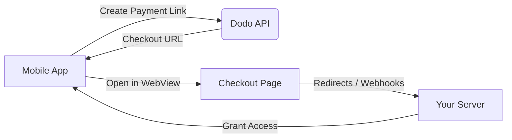

## مقدمة

يُمكّن Dodo Payments المطورين من بيع السلع والخدمات الرقمية في تطبيقات iOS، مع تولّي الجوانب المعقدة مثل الامتثال الضريبي وتحويل العملات والمدفوعات. يوضّح هذا الدليل الشامل كيفية دمج Dodo Payments في تطبيق iOS الخاص بك، لا سيما لأدوات SaaS واشتراكات المحتوى والأدوات الرقمية.

## نظرة عامة

يعمل Dodo Payments بصفته **Merchant of Record (MoR)** الخاص بك، ويدير الجوانب الأساسية لأعمالك الرقمية:

<Tabs>
<Tab title="What We Handle">
- تحصيل الضرائب وتحويلها إلى الجهات المختصة (VAT وGST والضرائب الإقليمية الأخرى)
- المدفوعات العالمية وفقًا للسياسات وطرق الدفع المحلية
- تحويل العملات والصرف الأجنبي
- عمليات رد المدفوعات ومنع الاحتيال
- إصدار الفواتير والإيصالات للعملاء النهائيين
- الامتثال للوائح الإقليمية
</Tab>

<Tab title="What You Get">
- API موحّد لمنصات الويب والأجهزة المحمولة
- دعم عمليات الدفع داخل التطبيق (UPI والبطاقات والمحافظ وBNPL)
- دعم المدفوعات العالمية (Payoneer وWise والتحويلات المصرفية المحلية)
- لوحة تحليلات وتقارير
- معالجة آمنة للمدفوعات
</Tab>
</Tabs>

## حالات الاستخدام

<CardGroup cols={2}>
<Card title="Subscriptions" icon="repeat">
- الوصول إلى المحتوى المميز أو الميزات المميزة
- فوترة متكررة بخيارات مرنة، وتجارب مجانية، وحساب نسبي، أو ترقية وخفض الباقات
</Card>

<Card title="Courses and Learning" icon="graduation-cap">
- الوصول المدفوع لكل دورة
- حزم المحتوى المجمّعة
- تراخيص دائمة أو قابلة للتجديد
- التكامل مع تتبّع التقدم
</Card>

<Card title="Digital Downloads" icon="download">
- عمليات شراء لمرة واحدة (ملفات PDF والموسيقى والأدوات)
- تسليم الأصول الرقمية
- إدارة مفاتيح الترخيص
</Card>

<Card title="SaaS Tools" icon="screwdriver-wrench">
- اشتراكات البرمجيات كخدمة
- الفوترة حسب الاستخدام
- خطط الفرق والمؤسسات
</Card>
</CardGroup>

## مسار التكامل

يمكنك دمج Dodo Payments في تطبيقك باستخدام صفحة الدفع المستضافة أو حل المتصفح داخل التطبيق الخاص بنا.

### خطوات التكامل

<Steps>
<Step title="Mobile App to Dodo API">
تبدأ العملية بإنشاء تطبيق الأجهزة المحمولة لرابط دفع من خلال التفاعل مع API الخاص بـ Dodo.
</Step>

<Step title="Dodo API to Mobile App">
يرد API الخاص بـ Dodo من خلال توفير عنوان URL لصفحة الدفع إلى تطبيق الأجهزة المحمولة.
</Step>

<Step title="Mobile App to Checkout Page">
يفتح تطبيق الأجهزة المحمولة بعد ذلك عنوان URL لصفحة الدفع داخل WebView، ما ينقل المستخدم إلى صفحة الدفع.
</Step>

<Step title="Checkout Page to Your Server">
عند اكتمال عملية الدفع، تتواصل صفحة الدفع مع خادمك من خلال عمليات إعادة التوجيه أو webhooks.
</Step>

<Step title="Your Server to Mobile App">
يمنح خادمك أخيرًا إمكانية الوصول إلى المحتوى أو الخدمة التي تم شراؤها، ليُكمل دورة المعاملة داخل تطبيق الأجهزة المحمولة.
</Step>
</Steps>

<Card title="Mobile Integration Guide" icon="mobile" href="/developer-resources/mobile-integration">
للاطلاع على شرح كامل للمطورين، استكشف دليل تكامل الأجهزة المحمولة الخاص بنا.
</Card>

## التوفّر الإقليمي

يتيح Dodo Payments تدفقات بديلة للشراء داخل التطبيق فقط في مناطق App Store التي تسمح فيها Apple صراحةً بالمدفوعات الخارجية، أو التي يفرض فيها أحد الجهات التنظيمية أو أمر قضائي ذلك.

### المناطق المدعومة

<AccordionGroup>
<Accordion title="United States">
مدعومة بالقدر الذي تسمح به الأوامر القضائية الحالية وإرشادات Apple المحدّثة.

- متاحة بموجب أحكام محددة تفرضها المحكمة
- خاضعة لامتثال Apple للمتطلبات القانونية
- يجب اتباع إرشادات Apple للتنفيذ
</Accordion>

<Accordion title="European Union (EU) App Store">
مدعومة من خلال الشروط البديلة للاتحاد الأوروبي الخاصة بـ Apple واستحقاق الشراء الخارجي.

- مفعّلة من خلال الشروط البديلة للاتحاد الأوروبي الخاصة بـ Apple
- تتطلب الموافقة على استحقاق الشراء الخارجي
- يجب الامتثال لمتطلبات قانون الأسواق الرقمية للاتحاد الأوروبي
</Accordion>

<Accordion title="South Korea">
مدعومة من خلال استحقاق الشراء الخارجي في StoreKit للثنائيات المخصصة لكوريا فقط.

- متاحة عبر استحقاق الشراء الخارجي في StoreKit
- تتطلب ثنائي تطبيق مخصصًا لكوريا
- يجب الامتثال لقانون الاتصالات الكوري
</Accordion>
</AccordionGroup>

<Warning>
راجع دائمًا استحقاقات Apple الخاصة بكل منطقة ومتطلبات App Store Connect والتزم بها قبل تفعيل Dodo Payments لأي واجهة متجر. قد يؤدي استخدام تدفقات الدفع البديلة في المناطق غير المدعومة إلى رفض التطبيق أو إزالته.
</Warning>

<Note>
بالنسبة إلى بعض نماذج الأعمال - مثل الخدمات أو فئات معينة من المحتوى - قد لا تتطلب Apple استخدام الشراء داخل التطبيق (IAP) على الإطلاق. يدعم Dodo Payments هذه النماذج أيضًا. تحقّق دائمًا من تصنيف تطبيقك وأحدث إرشادات Apple لتحديد ما إذا كان IAP إلزاميًا لحالة الاستخدام الخاصة بك.
</Note>

### تعرّف على المزيد

للاطلاع على تحليل مفصل للسياسات العالمية والسوابق القانونية والأساليب الاستراتيجية لتجاوز رسوم App Store، راجع دليلنا الشامل:

<Card title="Bypassing App Store & Play Store Fees: A Strategic and Legal Playbook" icon="shield-check" href="/features/bypassing-app-store-fees">
تعرّف على الأماكن والطرق التي يمكنك من خلالها تنفيذ تدفقات الدفع البديلة بشكل قانوني، مع إرشادات إقليمية محدّثة ونصائح حول الامتثال.
</Card>