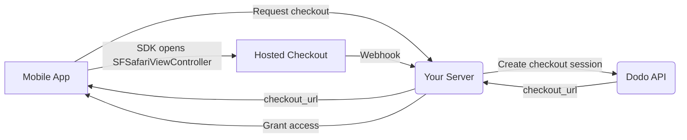

## مقدمة

يُمكّن Dodo Payments المطورين من بيع السلع والخدمات الرقمية في تطبيقات iOS، مع تولّي الجوانب المعقدة مثل الامتثال الضريبي وتحويل العملات والمدفوعات. يوضّح هذا الدليل الشامل كيفية دمج Dodo Payments في تطبيق iOS الخاص بك، لا سيما لأدوات SaaS واشتراكات المحتوى والأدوات الرقمية.

## نظرة عامة

يعمل Dodo Payments بصفته **Merchant of Record (MoR)** الخاص بك، ويدير الجوانب الأساسية لأعمالك الرقمية:

<Tabs>
<Tab title="What We Handle">
- تحصيل الضرائب وتحويلها إلى الجهات المختصة (VAT وGST والضرائب الإقليمية الأخرى)
- المدفوعات العالمية وفقًا للسياسات وطرق الدفع المحلية
- تحويل العملات والصرف الأجنبي
- عمليات رد المدفوعات ومنع الاحتيال
- إصدار الفواتير والإيصالات للعملاء النهائيين
- الامتثال للوائح الإقليمية
</Tab>

<Tab title="What You Get">
- API موحّد لمنصات الويب والأجهزة المحمولة
- دعم عمليات الدفع داخل التطبيق (UPI والبطاقات والمحافظ وBNPL)
- دعم المدفوعات العالمية (Payoneer وWise والتحويلات المصرفية المحلية)
- لوحة تحليلات وتقارير
- معالجة آمنة للمدفوعات
</Tab>
</Tabs>

## حالات الاستخدام

<CardGroup cols={2}>
<Card title="Subscriptions" icon="repeat">
- الوصول إلى المحتوى المميز أو الميزات المميزة
- فوترة متكررة بخيارات مرنة، وتجارب مجانية، وحساب نسبي، أو ترقية وخفض الباقات
</Card>

<Card title="Courses and Learning" icon="graduation-cap">
- الوصول المدفوع لكل دورة
- حزم المحتوى المجمّعة
- تراخيص دائمة أو قابلة للتجديد
- التكامل مع تتبّع التقدم
</Card>

<Card title="Digital Downloads" icon="download">
- عمليات شراء لمرة واحدة (ملفات PDF والموسيقى والأدوات)
- تسليم الأصول الرقمية
- إدارة مفاتيح الترخيص
</Card>

<Card title="SaaS Tools" icon="screwdriver-wrench">
- اشتراكات البرمجيات كخدمة
- الفوترة حسب الاستخدام
- خطط الفرق والمؤسسات
</Card>
</CardGroup>

## مسار التكامل

يفتح تطبيقك صفحة الدفع المستضافة من Dodo باستخدام
[iOS checkout SDK](/developer-resources/sdks/ios)، والتي تعرضها في
`SFSafariViewController` وتعيد نتيجة typed إلى التطبيق.

<Warning>
استخدم SDK بدلاً من تضمين صفحة الدفع في `WebView`. لا يتوفر Apple Pay إلا
في واجهة متصفح حقيقية، لذا فإن استخدام `WebView` يكلفك بصمت
تحويلات المحفظة — كما أن تدفقات الدفع داخل `WebView` تُعد سبباً شائعاً
لرفض المراجعة في App
Store.
</Warning>

### خطوات التكامل

<Steps>
<Step title="Mobile App to Your Server">
يطلب تطبيقك من backend الخاص بك عنوان URL لصفحة الدفع، مع مصادقة باستخدام
رمز جلسة المستخدم الذي سجّل الدخول.
</Step>

<Step title="Your Server to Dodo API">
ينشئ backend الخاص بك [جلسة الدفع](/developer-resources/checkout-session)
باستخدام API key الخاص بك، ثم يعيد `checkout_url` إلى التطبيق.

<Warning>
أنشئ جلسات الدفع على الخادم الخاص بك، وليس داخل التطبيق أبداً. يمكن استخراج API key
المضمّن داخل ملف التطبيق الثنائي من الحزمة.
</Warning>
</Step>

<Step title="Mobile App Opens Checkout">
مرّر `checkout_url` إلى `DodoCheckout.start(...)`. يعرض SDK صفحة الدفع في
`SFSafariViewController`، ويعيد نتيجة typed عند إكمال العميل لعملية الدفع أو إغلاقها.
</Step>

<Step title="Dodo Payments to Your Server">
يستدعي Dodo Payments نقطة نهاية webhook الخاصة بك عند نجاح الدفع أو
تفعيل الاشتراك.
</Step>

<Step title="Your Server Grants Access">
افتح المحتوى الذي تم شراؤه بناءً على webhook هذا، وليس بناءً على النتيجة التي تلقاها التطبيق.
نتيجة SDK هي تلميح لواجهة المستخدم، وليست دليلاً على الدفع.
</Step>
</Steps>

<CardGroup cols={2}>
<Card title="iOS Checkout SDK" icon="apple" href="/developer-resources/sdks/ios">
  خطوات التثبيت والعقد الكامل لـ `start(...)` في Swift.
</Card>
<Card title="Mobile Integration Guide" icon="mobile" href="/developer-resources/mobile-integration">
  التدفق الشامل، بالإضافة إلى العقد نفسه لـ Android وReact Native وFlutter.
</Card>
</CardGroup>

## التوفّر الإقليمي

يتيح Dodo Payments تدفقات بديلة للشراء داخل التطبيق فقط في مناطق App Store التي تسمح فيها Apple صراحةً بالمدفوعات الخارجية، أو عندما يفرض أحد الجهات التنظيمية أو أمر قضائي ذلك.

### المناطق المدعومة

<AccordionGroup>
<Accordion title="United States">
مدعومة بالقدر الذي تسمح به الأوامر القضائية الحالية وإرشادات Apple المحدّثة.

- متاحة بموجب أحكام محددة مفروضة بأوامر قضائية
- خاضعة لامتثال Apple للمتطلبات القانونية
- يجب اتباع إرشادات Apple الخاصة بالتنفيذ
</Accordion>

<Accordion title="European Union (EU) App Store">
مدعومة من خلال شروط Apple البديلة للاتحاد الأوروبي وميزة External Purchase Entitlement.

- مفعّلة من خلال شروط Apple البديلة للاتحاد الأوروبي
- تتطلب الموافقة على External Purchase Entitlement
- يجب الامتثال لمتطلبات قانون الأسواق الرقمية للاتحاد الأوروبي
</Accordion>

<Accordion title="South Korea">
مدعومة من خلال StoreKit External Purchase Entitlement للتطبيقات الثنائية المخصصة لكوريا فقط.

- متاحة عبر StoreKit External Purchase Entitlement
- تتطلب ملف تطبيق ثنائي مخصصاً لكوريا
- يجب الامتثال لقانون الاتصالات الكوري
</Accordion>
</AccordionGroup>

<Warning>
راجع دائماً امتيازات Apple الخاصة بكل منطقة ومتطلبات App Store Connect، والتزم بها قبل تفعيل Dodo Payments لأي واجهة متجر. قد يؤدي استخدام تدفقات الدفع البديلة في المناطق غير المدعومة إلى رفض التطبيق أو إزالته.
</Warning>

<Note>
بالنسبة إلى بعض نماذج الأعمال — مثل الخدمات أو فئات معينة من المحتوى — قد لا تتطلب Apple استخدام الشراء داخل التطبيق (IAP) على الإطلاق. يدعم Dodo Payments هذه النماذج أيضاً. تحقّق دائماً من تصنيف تطبيقك وأحدث إرشادات Apple لتحديد ما إذا كان IAP إلزامياً لحالة الاستخدام الخاصة بك.
</Note>

### تعلّم المزيد

للاطلاع على تحليل مفصل للسياسات العالمية والسوابق القانونية والأساليب الاستراتيجية لتجاوز رسوم App Store، راجع دليلنا الشامل:

<Card title="Bypassing App Store & Play Store Fees: A Strategic and Legal Playbook" icon="shield-check" href="/features/bypassing-app-store-fees">
تعرّف على الأماكن والطرق التي يمكنك من خلالها تنفيذ تدفقات الدفع البديلة بشكل قانوني، مع إرشادات إقليمية محدثة ونصائح للامتثال.
</Card>