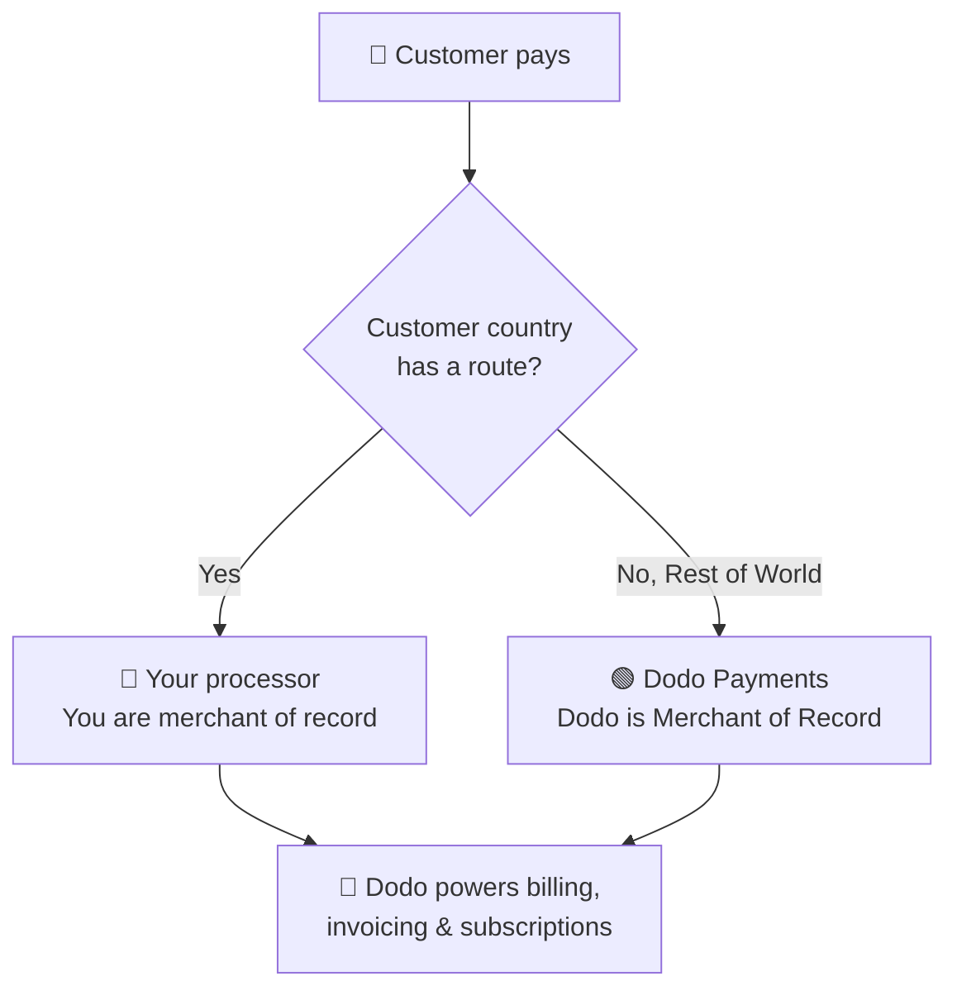

**استخدام المعالج الخاص بك (BYOP)** يتيح لك ربط معالج الدفع الخاص بك — حاليًا **Stripe** أو **Adyen**، مع دعم لمعالجات أكثر قريبًا — والاستمرار في استخدام Dodo Payments لكل ما يتعلق بالمعاملة: المنتجات، الاشتراكات، مفاتيح الترخيص ومحرك حقوق الوصول، الفواتير، بوابة العملاء، والتحليلات.

يمكنك تحديد، لكل بلد، ما إذا كانت عملية الدفع تتم بواسطة **معالجك الخاص** (تبقى أنت التاجر المسجل لتلك الطريق) أو بواسطة **Dodo Payments** كتاجر مسجل كامل الخدمات. البلدان التي لا تستهدفها بشكل صريح تسترجع تلقائيًا إلى Dodo.

 <CardGroup cols={2}>
<Card title="Route by geography" icon="globe">
أرسل المدفوعات من بلدان محددة إلى معالجك الخاص، وكل شيء آخر إلى Dodo.
</Card>

 <Card title="Keep your processor accounts" icon="plug">
استمر في استخدام حساباتك وعلاقاتك الحالية مع Stripe أو Adyen.
</Card>

 <Card title="Stay the merchant of record" icon="building">
في طرقك الخاصة، تبقى البائع القانوني وتتحكم في الضرائب والنزاعات والمدفوعات.
</Card>

 <Card title="One billing layer" icon="layer-group">
Dodo تشغل المنتجات والاشتراكات والفواتير والتحليلات عبر كلا الطريقين.
</Card>
</CardGroup>

## BYOP مقابل Dodo كتاجر مسجل

عند تفعيل BYOP يمكنك اختيار كيفية معالجة كل دفعة. يمكن تشغيل النموذجين جنبًا إلى جنب، وتوجيههما بحسب بلد العميل.

| ميزة | Dodo كتاجر مسجل | استخدام المعالج الخاص بك |
|---------|----------------------------|--------------------------|
| البائع القانوني | Dodo Payments | شركتك |
| الضرائب (VAT, GST & sales tax) | تُحسب، تُجمع وتُسلم لك | يجب عليك التسجيل والجمع وتقديم التقارير |
| التعويضات والاحتيال | المسؤولية والحماية تتم بواسطة Dodo | تديرها بأدوات معالجك الخاص |
| الامتثال لـ PCI | يتولى Dodo الأمر | يجب عليك إدارته |
| طرق الدفع | +30 عالمية ومحلية، متعددة العملات | بطاقات فقط (ائتمان/خصم) |
| المدفوعات | مدفوعات عالمية مجمعة | مباشرة من معالجك |
| الإعداد | بسيط، ابدأ في دقائق | معتدل، أضف المفاتيح والتوجيه |
| الأنسب لـ | البيع عالميًا، امتثال بدون تدخل | معالجة موجودة وتحكم إقليمي |

 <Tip>
اعداد شائع هو **هجين**: توجه بلدًا لديك فيه كيان مسجل ومعالج (على سبيل المثال، في سوقك المحلي) إلى معالجك الخاص، ودع Dodo تتولى بقية العالم كتاجر مسجل.
</Tip>

## المعالجات المدعومة

اليوم يمكنك ربط **Stripe** أو **Adyen**. دعم المزيد من المعالجات قادم في الطريق.

 <CardGroup cols={2}>
<Card title="Stripe" icon="stripe" />
<Card title="Adyen" icon="/images/logos/adyen.svg" />
</CardGroup>

 <Note>
المدفوعات الموجهة من خلال معالجك الخاص تدعم حاليًا **بطاقات الائتمان والخصم فقط**. نحن نضيف المزيد من طرق الدفع قريبًا.
</Note>

 <Warning>
كل من **Stripe** و **Adyen** يتطلبان تمكين **الوصول إلى واجهة برمجة تطبيقات البطاقات الخام** في حسابك حتى تتمكن Dodo من تشغيل الفواتير على معالجك. كل معالج يمنح هذا بناءً على الطلب — ترتب ذلك من خلال التواصل مع دعم المعالج قبل الاتصال. انظر أدلة [Stripe](/features/byop/stripe) و [Adyen](/features/byop/adyen) للتفاصيل.
</Warning>

 <Info>
يتم تكوين الاتصالات **لكل بيئة**. المعالج الذي تربطه في **وضع الاختبار** (Sandbox) منفصل عن الوضع في **الوضع الحي** (Production); قم بتكوين كلاهما إذا كنت ترغب في الاختبار قبل البدء. يتبع معالج الإعداد زر التبديل العالمي للاختبار/الحي في لوحة التحكم الخاصة بك.
</Info>

## إعداد BYOP

افتح **الإعدادات → BYOP** في لوحة التحكم وحدد **تكوين** على بطاقة *استخدام المعالج الخاص بك* لبدء معالج الإعداد.

 <Frame>

</Frame>

 <Steps>
<Step title="Choose a payment processor">
اختر المعالج الذي تريد الاتصال به، **Stripe** أو **Adyen**، وتابع.

 <Frame>

</Frame>
</Step>

 <Step title="Connect your account">
أطلق على الاتصال اسم **اسم الموفر** (مفيد عندما يكون لديك حسابات متعددة من نفس المعالج، مثل *Stripe US* و *Stripe UK*), ثم أدخل **المفتاح السري** لمعالجك (بالنسبة لـ Stripe، المفتاح `sk_...` الخاص بك).

بالنسبة لـ **Adyen**، أدخل أيضًا معرف **حساب التاجر**.

 <Frame>

</Frame>

الحفظ ينشئ الاتصال ويولد **نقطة نهاية ويب هوك** فريدة له. أضف هذا الرابط كوجهة ويب هوك في لوحة تحكم المعالج الخاص بك، ثم قم بلصق **سر التوقيع لنقطة النهاية** مرة أخرى في Dodo لإنهاء العملية:

- **Stripe**: الصق السر التوقيعي من نقطة نهاية الويب هوك التي أضفتها.
- **Adyen**: الصق **مفتاح HMAC** من *منطقة العملاء → ويب هوكس*.

 <Note>
مفتاحك السري مخزن بأمان ولا يمكن مشاهدته أو تغييره بعد الحفظ. تقوم بتكوين رابط ويب هوك الذي تولده Dodo في المعالج الخاص بك فقط؛ لا تتفاعل أبدًا مع البنية التحتية الأساسية مباشرة.
</Note>

 <Tip>
استخدم **التحقق من الاتصال** بعد الحفظ لإجراء اتصال اختبار مع معالجك والتأكد من أن المفاتيح وسر الويب هوك صحيحة قبل أن تبدأ.
</Tip>
</Step>

 <Step title="Configure payment routing">
أضف **قواعد التوجيه** التي ترسم بلدان العملاء إلى معالج. يمكن توجيه كل بلد إلى معالج واحد فقط.

- **معالجك** يتولى معالجة المدفوعات من البلدان التي تعينها له.
- **Dodo Payments** تتولى **بقية العالم** كالتاجر المسجل لجميع البلدان التي لا توجهها صراحة.

 <Frame>

</Frame>

استخدم **إضافة مسار** لتعيين بلد واحد أو أكثر إلى معالج.

 <Frame>

</Frame>

 <Info>
**إرشادات التوجيه**
- "بقية العالم" تغطي جميع البلدان غير المدرجة أعلاه.
- مسارات Dodo كتاجر مسجل تتولى الامتثال والضرائب تلقائيًا.
- مسارات المعالج الخاص بك تتطلب تكوين ضريبي منفصل إذا لزم الأمر.
</Info>
</Step>

 <Step title="Configure invoice information">
بالنسبة للمدفوعات الموجهة من خلال معالجك الخاص، **أنت** البائع على الفاتورة. أدخل تفاصيل العمل التي يجب أن تظهر على تلك الفواتير:

- **الاسم التجاري المسجل** (مطلوب)
- **معرّف الضريبة** (EIN، SSN، إلخ؛ اختياري، مع توفر التحقق من التنسيق لمعرّفات EIN الأمريكية)
- **البيان الوصفي** (مطلوب): ما يراه العملاء على كشف البنك الخاص بهم (من 5 إلى 22 حرفًا)
- **عنوان العمل المسجل** (مطلوب): ابدأ الكتابة للبحث والاستكمال التلقائي لعنوانك
- روابط **سياسة الخصوصية** و **شروط الخدمة** (مطلوبة)

يعرض **معاينة رأس الفاتورة المباشرة** كيف ستظهر التفاصيل. تنطبق هذه التفاصيل **فقط** على الفواتير للمسارات التي تديرها من خلال معالجك الخاص؛ المدفوعات الموجهة بواسطة Dodo تستمر في استخدام تفاصيل التاجر المسجل لـ Dodo.

 <Frame>

</Frame>
</Step>

 <Step title="Review and finish">
راجع اتصال معالجك وقواعد التوجيه وتفاصيل الفاتورة. أكد أن تفاصيل التوجيه والفوترة صحيحة، ثم حدد **إنهاء الإعداد**.

 <Frame>

</Frame>
</Step>
</Steps>

بمجرد تكوينها، تعرض بطاقة BYOP **تحرير التكوين**، ويمكنك العودة إلى MoR-only في أي وقت باستخدام **تحرير قواعد التوجيه**.

 <Frame>

</Frame>

## كيفية عمل التوجيه

يتم التوجيه بناءً على **بلد العميل** في وقت الدفع. ينطبق نفس المنطق عبر المدفوعات لمرة واحدة وجلسات الدفع والاشتراك. التجديدات تعيد استخدام المعالج الذي تم إنشاء الاشتراك عليه (انظر [الاشتراكات](#subscriptions)).

على المسار الذي يديره **معالجك**:

- يتم معالجة الدفع على حساب **معالجك** في عملة الفوترة.
- **لا يتم حساب أو جمع الضرائب** بواسطة Dodo؛ تبقى مسؤولاً عن الضرائب على هذا المسار.
- تستخدم الفواتير **تفاصيل العمل والبيان الوصفي** التي قمت بتكوينها، بدون أي إشارات للتاجر المسجل.
- تسوى المدفوعات **مباشرة لك** من معالجك؛ لا شيء يمر عبر محفظة Dodo.

على المسار الذي يديره **Dodo** (بقية العالم)، يتصرف Dodo كالتاجر المسجل الكامل الخدمات، يتولى الضرائب، الامتثال، النزاعات، الاحتيال، والمدفوعات المجمعة.

## الاشتراكات

تبقى الاشتراكات على المعالج الذي تم إنشاؤها عليه. عند التجديد، تقوم Dodo بشحن نفس معالج الدفع الذي تم استخدامه لشراء الاشتراك، وتعيد استخدام تفويض الدفع المخزن ضده. لا تتم إعادة تقييم قواعد التوجيه مع كل تجديد.

## مشاهدة أي معالج تعامل مع الدفع

بمجرد تكوين BYOP، تعرض جداول **المدفوعات** و **النزاعات** رمز معالج (Stripe، Adyen، أو Dodo) بجانب كل صف، وتشمل صفحات تفاصيل الدفع والنزاع حقل **معالج الدفع**، بحيث يمكنك دائمًا معرفة أي مسار تعامل مع معاملة معينة.

## الاسترداد، النزاعات والمدفوعات

 <Tabs>
<Tab title="Refunds">
تقوم بإجراء عمليات استرداد من لوحة تحكم Dodo كالمعتاد. بالنسبة للمدفوعات الموجهة من خلال معالجك الخاص، يتم تنفيذ الاسترداد على ذلك المعالج؛ بالنسبة للمدفوعات الموجهة بواسطة Dodo، يقوم Dodo بمعالجة الاسترداد.
</Tab>

 <Tab title="Disputes">
تظهر لوحة تحكم Dodo النزاعات للمدفوعات **التي تمت معالجتها بواسطة Dodo** فقط.

> تظهر هنا النزاعات التي تمت معالجتها بواسطة Dodo فقط. النزاعات على معالجك الخاص (مثل Stripe) تتم إدارتها في لوحة تحكم ذلك المعالج.

تحميل الأدلة، وقبول، وتحدي الإجراءات متاحة فقط للنزاعات التي تمت معالجتها بواسطة Dodo. النزاعات على معالجك تتم بإستخدام أدوات معالجك الخاص.
</Tab>

 <Tab title="Payouts">
بالنسبة للطرق على معالجك الخاص، يقوم معالجك بدفعك **مباشرة**؛ تلك المدفوعات لا تظهر في Dodo.

> تظهر هنا فقط مدفوعات Dodo. المدفوعات على معالجك الخاص تحدث في ذلك المعالج.

مدفوعات Dodo (لحجم MoR لبقية العالم) تتبع [هيكل الدفع](/features/payouts/payout-structure) القياسي.
</Tab>
</Tabs>

## التحليلات

تشمل تحليلات الإيرادات والضرائب والاشتراكات **كلا** الطريقين بحيث ترى الصورة الكاملة لفواتيرك. تعرض أدوات النزاعات والمدفوعات النشاط **الذي تمت معالجته بواسطة Dodo** فقط، مع لوحة تبين أن النشاط على معالجك الخاص موجود في لوحة تحكم ذلك المعالج.

## رسوم الفوترة

تطبق Dodo رسوم **فوترة BYOP صغيرة** على المدفوعات الموجهة من خلال معالجك الخاص، حيث لا تزال Dodo تشغل منتجاتك واشتراكاتك وفواتيرك وتحليلاتك على تلك المعاملات. تظهر كـ `byop_fee` في دفتر أرصدتك. النسبة الافتراضية هي **0.5%**؛ يتم تأكيد النسبة الدقيقة كجزء من تفعيل BYOP لحسابك. [تواصل معنا](mailto:founders@dodopayments.com) للتفاصيل.

## الأسئلة الشائعة

 <AccordionGroup>
<Accordion title="Which processors can I connect?">
 يتم دعم Stripe و Adyen حاليًا، مع دعم المزيد من المعالجات قريبًا. كلاهما يتطلب **الوصول إلى واجهة برمجة تطبيقات البطاقات الخام** مشغل في حسابك، والتي يمكنك ترتيبها بالتواصل مع دعم المعالج. راجع أدلة [Stripe](/features/byop/stripe) و [Adyen](/features/byop/adyen) للتفاصيل.
</Accordion>

 <Accordion title="Can I route only some countries to my processor?">
نعم. عين بلدانًا معينة إلى معالجك واترك الباقي كـ **بقية العالم**، الذي تتولى Dodo معالجته كتاجر مسجل. يتم توجيه كل بلد إلى معالج واحد بالضبط.
</Accordion>

 <Accordion title="Who is the merchant of record on BYOP routes?">
أنت. في المسارات التي يديرها معالجك الخاص، تبقى البائع القانوني وتكون مسؤولاً عن الضرائب، التعويضات، الامتثال لـ PCI، والمدفوعات على تلك المعاملات.
</Accordion>

 <Accordion title="Does Dodo calculate tax on my processor's routes?">
لا. لا يتم حساب أو جمع الضرائب على المسارات التي يتم التعامل معها من خلال معالجك الخاص؛ تدير الضرائب لتلك المعاملات. Dodo يستمر في التعامل مع الضرائب على المدفوعات الموجهة بواسطة Dodo (MoR).
</Accordion>

 <Accordion title="What happens to active subscriptions if I disable a processor?">
 ستفشل التجديدات على ذلك المعالج وتظهر كمدفوعات فاشلة في لوحة التحكم. أعد تمكين المعالج لاستعادة التجديدات.
</Accordion>
</AccordionGroup>

## البدء

 <Card title="What is Merchant of Record?" icon="building-columns" href="/features/mor-introduction">
فهم كيفية عمل نموذج MoR الكامل الخدمات لـ Dodo.
</Card>
