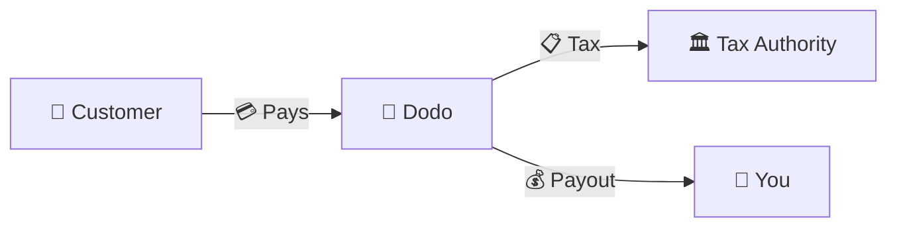
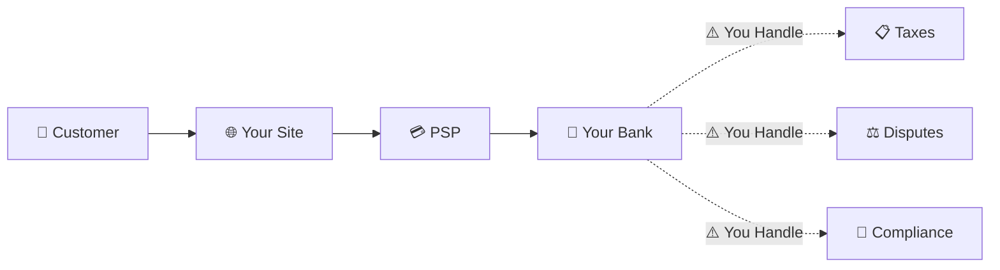
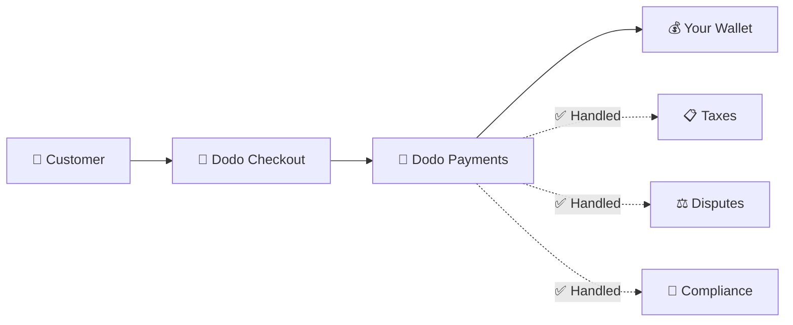
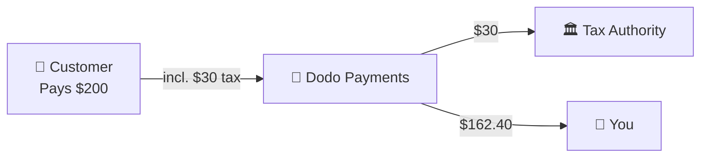

تعمل Dodo Payments بصفتها **Merchant of Record (MoR)** — أي أننا نصبح البائع القانوني لمنتجاتك الرقمية، ونتولى مسؤولية المدفوعات والضرائب والاحتيال والامتثال، حتى تتمكن من التركيز بالكامل على بناء منتجك.

<CardGroup cols={3}>
<Card title="220+ Regions" icon="globe">
الامتثال الضريبي تتم إدارته تلقائيًا
</Card>

<Card title="30+ Payment Methods" icon="credit-card">
البطاقات والمحافظ وطرق الدفع المحلية
</Card>

<Card title="Zero Tax Filing" icon="file-invoice">
نتولى جميع عمليات التحويل
</Card>
</CardGroup>

## ما هو Merchant of Record؟

إن **Merchant of Record** هو الكيان القانوني الذي يظهر اسمه في كشف بطاقة ائتمان العميل ويتحمل مسؤولية المعاملة. عند استخدام Dodo Payments بصفتها MoR الخاصة بك:

- **نحن البائع القانوني** — يظهر اسم Dodo في كشوف الحسابات البنكية والإيصالات
- **أنت منشئ المنتج** — أنت تبني منتجك وتحدد سعره وتوفره
- **نتولى أعمال المكتب الخلفي** — الضرائب والنزاعات والامتثال ودعم الفوترة
- **تحصل على دفعات صافية** — تُودع الإيرادات مباشرةً في حسابك

<Note>
فكّر في Merchant of Record باعتباره فريقًا ماليًا عالميًا تستعين به لإدارة الفوترة والضرائب وإصدار الفواتير في كل بلد — من دون أن تضطر إلى القيام بأي شيء.
</Note>

## لماذا تستخدم Merchant of Record؟

يعني بيع المنتجات الرقمية عالميًا التعامل مع VAT في أوروبا، وGST في أستراليا، وSales Tax في الولايات المتحدة، وعدد لا يحصى من المتطلبات الأخرى. لكل ولاية قضائية قواعد ومعدلات وحدود ومواعيد نهائية مختلفة لتقديم الإقرارات.

| مسؤوليتك | بدون MoR | مع Dodo بصفتها MoR |
|---------------------|:-----------:|:----------------:|
| التسجيل في VAT/GST | ❌ أنت | ✅ Dodo |
| احتساب الضرائب | ❌ أنت | ✅ Dodo |
| تقديم الإقرارات الضريبية وتحويل الضرائب | ❌ أنت | ✅ Dodo |
| مسؤولية عمليات رد المبالغ | ❌ أنت | ✅ Dodo |
| الامتثال لمعيار PCI | ❌ أنت | ✅ Dodo |
| دعم العملات المتعددة | ❌ معقد | ✅ مدمج |
| طرق الدفع المحلية | ❌ دمج كل طريقة على حدة | ✅ أكثر من 30 طريقة مضمنة |

<Tip>
**مثال**: هل تبيع اشتراكًا بقيمة 50 يورو شهريًا لعميل فرنسي؟

**بدون MoR**: سجّل في ضريبة القيمة المضافة الفرنسية، وحصّل 60 يورو (20% VAT)، وقدّم الإقرارات الفرنسية ربع السنوية، وتعامل مع عمليات التدقيق — باللغة الفرنسية.

**مع Dodo**: نحصل 60 يورو، ونحوّل 10 يورو من VAT إلى فرنسا، وندفع لك 50 يورو مطروحًا منها الرسوم. وأنت تكتب التعليمات البرمجية.
</Tip>

## PSP مقابل MoR: الاختلافات الرئيسية

من الضروري فهم الفرق بين **Payment Service Provider** (مثل Stripe) و**Merchant of Record**.

### Payment Service Provider (PSP)

يعالج PSP المعاملات، لكنه يتركك بصفتك البائع القانوني:

<Warning>
مع PSP، **أنت** المسؤول عن التسجيل الضريبي والتحصيل وتقديم الإقرارات وتحويل الضرائب في كل ولاية قضائية يوجد فيها عملاؤك.
</Warning>

### Merchant of Record (Dodo)

يصبح MoR البائع القانوني ويتولى الامتثال من البداية إلى النهاية:

<Check>
مع Dodo بصفتها MoR، نتولى الضرائب والنزاعات والامتثال. وتحصل على دفعات صافية من دون أي أوراق.
</Check>

### مقارنة جنبًا إلى جنب

| الجانب | PSP (Stripe وما إلى ذلك) | MoR (Dodo) |
|--------|:------------------:|:----------:|
| البائع القانوني | شركتك | Dodo |
| في كشف حساب العميل | اسمك | Dodo |
| التسجيل الضريبي | ❌ أنت | ✅ Dodo |
| احتساب الضرائب | ❌ أنت | ✅ Dodo |
| تحويل الضرائب | ❌ أنت | ✅ Dodo |
| مخاطر عمليات رد المبالغ | ❌ أنت | ✅ Dodo |
| الامتثال لمعيار PCI | ❌ أنت | ✅ Dodo |
| الإعداد للعمل عالميًا | معقد | بسيط |

<Info>
**مهم**: يتولى كل من PSP وMoR معالجة المدفوعات. والاختلاف الرئيسي هو **الجهة المسؤولة قانونيًا** عن الامتثال الضريبي والمسؤولية عن المعاملات.
</Info>

## كيفية عمل الامتثال الضريبي

تتولى Dodo دورة الضرائب بأكملها تلقائيًا:

<Steps>
<Step title="Customer Location">
نحدد بلد العميل ونقرر القواعد الضريبية المنطبقة — VAT أو GST أو Sales Tax أو غيرها من المتطلبات المحلية.
</Step>

<Step title="Rate Calculation">
يُحتسب معدل الضريبة الصحيح بناءً على نوع المنتج وموقع العميل وحالته B2B/B2C. ويُطبَّق reverse charge على عملاء الشركات في الاتحاد الأوروبي الذين يملكون أرقام VAT صالحة.
</Step>

<Step title="Collection at Checkout">
تُعرض الضريبة وتُحصّل بوضوح عند إتمام الدفع. ويرى العملاء المبلغ الذي يدفعونه بالضبط.
</Step>

<Step title="Filing & Remittance">
نقدّم الإقرارات وندفع الضرائب المحصّلة إلى السلطات المختصة في مواعيدها. ولن ترى أي نموذج ضريبي على الإطلاق.
</Step>
</Steps>

## تدفق الإيرادات

إليك كيفية انتقال الأموال من العميل إلى حسابك:

### مثال على تفاصيل الدفعة

| البند | المبلغ |
|-----------|-------:|
| دفعة العميل | $200.00 |
| Sales Tax (15% VAT) | −$30.00 |
| رسوم منصة Dodo (4%) | −$8.00 |
| معالجة الدفع | −$0.60 |
| **دفعتك** | **$162.40** |

## متى تختار MoR مقابل PSP؟

<Tabs>
<Tab title="Choose Dodo (MoR)">
**تُعد Dodo Payments مثالية إذا كنت:**

- تبيع منتجات رقمية أو SaaS أو اشتراكات
- لديك عملاء في عدة بلدان
- تريد تجنب تعقيدات التسجيل الضريبي
- تفضّل امتثالًا مستعانًا بمصادر خارجية ويمكن التنبؤ به
- تضع سرعة الوصول إلى السوق قبل أقصى درجات التحكم
- لا تريد إدارة النزاعات والاحتيال
</Tab>

<Tab title="Consider a PSP">
**قد يناسبك PSP إذا كنت:**

- تعمل بشكل أساسي في بلد واحد
- لديك فرق مالية وفرق امتثال داخلية
- تحتاج إلى تحكم كامل في تجربة إتمام الدفع
- تعمل بهوامش ربح ضئيلة للغاية
- تبيع سلعًا مادية (تركّز MoRs على المنتجات الرقمية)
</Tab>
</Tabs>

<Note>
تبدأ العديد من الشركات باستخدام PSP ثم تنتقل إلى MoR عند توسعها دوليًا. وتوفر Dodo دعمًا للترحيل لجعل هذا الانتقال سلسًا.
</Note>

## الأسئلة الشائعة

<AccordionGroup>
<Accordion title="What appears on my customer's credit card statement?">
تظهر Dodo Payments بصفتها التاجر. ونضمّن مرجع منتجك/علامتك التجارية حيثما تسمح حدود الأحرف، ويتلقى العملاء إيصالات مفصلة تعرض معلومات منتجك.
</Accordion>

<Accordion title="Do I still own the customer relationship?">
نعم. تتحكم في التسعير والعلامة التجارية وتوفير المنتج والتواصل المباشر. وتتولى Dodo آليات الفوترة، لكن العملاء يعرفون أنهم يشترون منك. وتظهر علامتك التجارية بوضوح في صفحة إتمام الدفع ورسائل البريد الإلكتروني والفواتير.
</Accordion>

<Accordion title="How does B2B VAT reverse charge work?">
بالنسبة إلى مبيعات B2B في الاتحاد الأوروبي، يمكن للعملاء إدخال رقم VAT الخاص بهم عند إتمام الدفع. نتحقق من صحته ونطبّق reverse charge تلقائيًا — إذ تنتقل الضريبة إلى إقرار VAT الخاص بالمشتري بدلًا من تحصيلها.
</Accordion>

<Accordion title="Can I use my own payment processor?">
تعمل Dodo كحل متكامل باستخدام البنية التحتية للمدفوعات الخاصة بنا. وهذا التكامل هو ما يتيح لنا تحمّل مسؤولية الضرائب والاحتيال. ونعمل مستقبلًا على توفير تكامل مع معالجي مدفوعات آخرين.
</Accordion>

<Accordion title="How do refunds work?">
ابدأ عمليات رد المبالغ من لوحة التحكم. نعالج رد المبلغ باستخدام طريقة الدفع والعملة الأصليتين للعميل. وتُعدّل مبالغ الضرائب وتُطابق تلقائيًا.
</Accordion>

<Accordion title="What about my income tax?">
تتولى Dodo **ضرائب المبيعات** (VAT وGST وSales Tax) على معاملات العملاء. وتظل مسؤولًا عن ضريبة دخل نشاطك التجاري وضريبة الشركات والالتزامات الضريبية المتعلقة بالدفعات التي تتلقاها.
</Accordion>

<Accordion title="Which countries can I sell to?">
نقبل المدفوعات من أكثر من 220 بلدًا ومنطقة، مع توسع مستمر. راجع القائمة الكاملة:

<Card title="Supported Regions" icon="globe" href="/miscellaneous/list-of-countries-we-accept-payments-from">
اطّلع على جميع البلدان والمناطق التي يزيد عددها على 220 والتي نقبل المدفوعات منها.
</Card>
</Accordion>
</AccordionGroup>

## ابدأ الآن

<CardGroup cols={2}>
<Card title="Create Account" icon="rocket" href="https://app.dodopayments.com/signup">
سجّل مجانًا واقبل المدفوعات العالمية خلال دقائق.
</Card>

<Card title="MoR vs PG Deep Dive" icon="scale-balanced" href="/features/mor-vs-pg">
مقارنة مفصلة مع أمثلة وحالات استخدام.
</Card>

<Card title="Acceptance Policy" icon="building-shield" href="/miscellaneous/merchant-acceptance">
تعرّف على الشركات التي ندعمها.
</Card>

<Card title="Talk to Us" icon="envelope" href="mailto:founders@dodopayments.com">
احصل على إرشادات مخصصة من فريقنا.
</Card>
</CardGroup>
