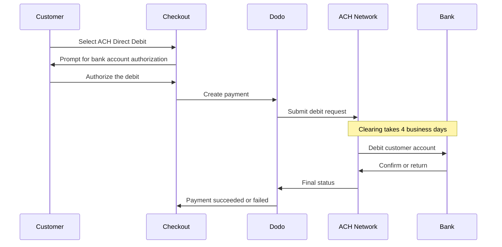

تتيح ACH Direct Debit للعملاء في الولايات المتحدة الدفع مباشرةً من حساباتهم المصرفية بدلاً من استخدام بطاقة. وتعمل عبر شبكة Automated Clearing House، وتتوفر في عمليات الدفع بالدولار الأمريكي للمدفوعات لمرة واحدة.

## لماذا تقدم ACH Direct Debit؟

<CardGroup cols={3}>
<Card title="Lower Processing Cost" icon="piggy-bank">
عادةً ما تكون تكلفة معالجة الخصم المصرفي أقل من تكلفة معالجة مدفوعات البطاقات، لا سيما في الطلبات ذات القيمة المرتفعة.
</Card>

<Card title="No Card Required" icon="building-columns">
يمكنك الوصول إلى العملاء في الولايات المتحدة الذين يفضلون الدفع من حساب مصرفي أو لا يرغبون في استخدام بطاقة للمشتريات الكبيرة.
</Card>

<Card title="Higher Value Orders" icon="chart-line">
تزداد ميزة التكلفة مقارنةً بالبطاقات مع ارتفاع قيمة الطلب، ما يجعل ACH مناسبًا للمشتريات الكبيرة لمرة واحدة.
</Card>
</CardGroup>

## نظرة عامة

| التفاصيل | القيمة |
| :----- | :---- |
| **عملة الفوترة** | USD |
| **الدول المدعومة** | الولايات المتحدة |
| **الاشتراكات** | لا |
| **الحد الأدنى للمبلغ** | $0.50 |
| **التسوية** | 4 أيام عمل |

<Warning>
ACH Direct Debit ليست فورية. يستغرق تأكيد الدفع **4 أيام عمل**، لذا لا تعتبر التفويض تسويةً — ولا تنفذ الطلب إلا بعد وصول الدفع إلى حالة succeeded.
</Warning>

## آلية العمل



## تجربة العميل

1. يختار العميل ACH Direct Debit عند الدفع
2. يفوض العميل الخصم من حسابه المصرفي في الولايات المتحدة
3. يُرسل الدفع إلى شبكة ACH ويدخل في حالة processing
4. تكتمل عملية المقاصة خلال أيام العمل التالية
5. ينتقل الدفع إلى حالة succeeded، أو يفشل إذا أعاده البنك

<Info>
نظرًا لأن المقاصة غير متزامنة، اعتمد على [webhooks](/developer-resources/webhooks) لمعرفة النتيجة النهائية بدلاً من إعادة التوجيه من صفحة الدفع. لا يعني نجاح إعادة التوجيه سوى أن العميل فوّض الخصم.

يصدر الدفع `payment.processing` بعد إرسال الخصم، ثم `payment.succeeded` أو `payment.failed` عند اكتمال المقاصة. وحده `payment.succeeded` آمن لتنفيذ الطلب بناءً عليه.
</Info>

## التوفر

تظهر ACH Direct Debit عند الدفع عندما تتحقق جميع الشروط التالية:

- **عملة الفوترة** هي `USD`
- **بلد الفوترة** هو `US`
- المعاملة هي **دفعة لمرة واحدة**

<Note>
لا تتوفر ACH Direct Debit للاشتراكات. تجعل فترة المقاصة التي تمتد عدة أيام هذه الطريقة غير مناسبة لدورات الفوترة المتكررة. للمدفوعات المتكررة، استخدم البطاقات أو طريقة أخرى تدعم الاشتراكات — راجع [نظرة عامة على طرق الدفع](/features/payment-methods).
</Note>

## الإعداد

```javascript
const session = await client.checkoutSessions.create({
  product_cart: [{ product_id: 'pdt_123', quantity: 1 }],
  allowed_payment_method_types: ['ach', 'credit', 'debit'],
  billing_currency: 'USD',
  billing_address: {
    country: 'US',
    zipcode: '94102'
  },
  return_url: 'https://example.com/success'
});
```

<Note>
تتطلب ACH Direct Debit عملة فوترة **USD** وعنوان فوترة في **الولايات المتحدة**. إذا كانت أسعارك محددة بعملة أخرى، فعّل [Adaptive Currency](/features/adaptive-currency) حتى تتم فوترة العملاء في الولايات المتحدة بالدولار الأمريكي وتصبح ACH متاحة.
</Note>

## نوع طريقة API

| النوع | الطريقة | البلد |
| :--- | :----- | :------ |
| `ach` | ACH Direct Debit | الولايات المتحدة |

## المبالغ المستردة والنزاعات

تستخدم المبالغ المستردة والنزاعات الخاصة بمدفوعات ACH واجهات API وتدفقات لوحة التحكم نفسها المستخدمة مع جميع طرق الدفع الأخرى — ولا يلزم تنفيذ معالجة خاصة بـ ACH.

<Warning>
نظرًا إلى إمكانية إعادة مدفوعات ACH من قِبل بنك العميل بعد أن تبدو وكأنها اكتملت، تجنب إصدار المبالغ المستردة حتى يصل الدفع الأصلي إلى حالة succeeded.
</Warning>

## الاختبار

<Steps>
<Step title="Enable test mode">
استخدم مفاتيح API للاختبار الخاصة بـ Dodo Payments.
</Step>

<Step title="Set currency and billing address">
عيّن عملة الفوترة إلى `USD` وبلد عنوان الفوترة إلى `US`.
</Step>

<Step title="Include `ach` in allowed methods">
مرّر `ach` في `allowed_payment_method_types`، أو احذف الحقل بالكامل لعرض كل الطرق المؤهلة.
</Step>

<Step title="Enter the test bank details">
أدخل أحد أزواج أرقام التوجيه وأرقام الحسابات للاختبار أدناه، ثم تأكد من أن معالج webhook يتلقى حالة الدفع النهائية.
</Step>
</Steps>

### الحسابات المصرفية للاختبار

يدخل العملاء رقم الحساب ورقم التوجيه مباشرةً عند الدفع. في وضع الاختبار، استخدم رقم التوجيه `110000000` مع أي من أرقام الحسابات أدناه لفرض نتيجة محددة.

| رقم الحساب | رقم التوجيه | السلوك |
| :------------- | :------------- | :------- |
| `000123456789` | `110000000` | ينجح الدفع. |
| `000222222227` | `110000000` | يفشل الدفع بسبب عدم كفاية الأموال. |
| `000111111113` | `110000000` | يفشل الدفع لأن الحساب مغلق. |
| `000111111116` | `110000000` | يفشل الدفع بسبب عدم العثور على الحساب. |
| `000333333335` | `110000000` | يفشل الدفع لأن الخصومات غير مصرّح بها على الحساب. |
| `000444444440` | `110000000` | يفشل الدفع بسبب عملة غير صالحة. |
| `000555555559` | `110000000` | ينجح الدفع، ثم يؤدي إلى نزاع. |
| `000000000009` | `110000000` | يظل الدفع في حالة processing إلى أجل غير مسمى، وهو أمر مفيد لاختبار واجهة المستخدم الخاصة بالحالة المعلّقة. |

<Note>
تصل معظم مدفوعات الاختبار إلى حالة نهائية أسرع بكثير من فترة المقاصة الفعلية، لذلك لا تحتاج إلى الانتظار أيامًا للتحقق من تكاملك. والاستثناء هو `000000000009`، المصمم للبقاء في حالة processing.
</Note>

## أفضل الممارسات

<AccordionGroup>
<Accordion title="Don't fulfill on authorization">
تفويض ACH ليس دفعًا. انتظر حتى يصل الدفع إلى حالة succeeded قبل منح الوصول أو شحن الطلب — إذ لا يزال بإمكان بنك العميل إعادة الخصم.
</Accordion>

<Accordion title="Set customer expectations at checkout">
أبلغ العملاء بأن المدفوعات المصرفية لا تتم مقاصتها فورًا. ويقلل ذلك من تذاكر الدعم التي تسأل عن سبب استمرار الطلب في حالة pending.
</Accordion>

<Accordion title="Provide card fallbacks">
احرص دائمًا على تضمين `credit` و`debit` إلى جانب `ach` حتى يتمكن العملاء الذين يحتاجون إلى وصول فوري إلى منتجك من اختيار طريقة أسرع.
</Accordion>

<Accordion title="Use ACH for high-value one-time purchases">
تزداد ميزة تكلفة ACH مع ارتفاع قيمة الطلب، لذا تكون أكثر فائدة في المشتريات الكبيرة لمرة واحدة، لا المشتريات الصغيرة.
</Accordion>
</AccordionGroup>

## استكشاف الأخطاء وإصلاحها

<AccordionGroup>
<Accordion title="ACH not appearing at checkout">
**تحقق من:**
1. هل عُيّنت عملة الفوترة إلى `USD`؟
2. هل بلد فوترة العميل هو `US`؟
3. هل تم تضمين `ach` في `allowed_payment_method_types`؟
4. هل هذه دفعة لمرة واحدة؟ لا تُعرض ACH في الاشتراكات.

**الحل:** أزل `allowed_payment_method_types` مؤقتًا لعرض جميع الطرق المؤهلة، ثم تحقق من عملة الفوترة وبلد عنوان الفوترة في طلب API.
</Accordion>

<Accordion title="ACH not appearing on a subscription checkout">
**السبب:** تُعرض ACH Direct Debit للمدفوعات لمرة واحدة فقط.

**الحل:** استخدم البطاقات أو طريقة أخرى تدعم الاشتراكات للفوترة المتكررة.
</Accordion>

<Accordion title="Payment stuck in processing">
**السبب:** هذا متوقع. تظل مدفوعات ACH في حالة processing طوال فترة المقاصة، وهي أطول بكثير من مدفوعات البطاقات.

**الحل:** انتظر webhook النهائي. لا تعاود محاولة الدفع — فقد تؤدي إعادة المحاولة إلى خصم المبلغ من العميل مرتين.
</Accordion>

<Accordion title="Payment failed after initially succeeding at checkout">
**السبب:** أعاد بنك العميل الخصم — وغالبًا ما يكون ذلك بسبب عدم كفاية الأموال أو إغلاق الحساب.

**الحل:** تعامل مع الدفع على أنه فاشل واطلب من العميل إعادة المحاولة باستخدام طريقة دفع أخرى. احرص دائمًا على ربط تنفيذ الطلب بحالة succeeded لتجنب ذلك.
</Accordion>
</AccordionGroup>

## صفحات ذات صلة

<CardGroup cols={2}>
<Card title="Payment Methods Overview" icon="credit-card" href="/features/payment-methods">
اطّلع على جميع طرق الدفع المدعومة.
</Card>

<Card title="Adaptive Currency" icon="globe" href="/features/adaptive-currency">
دعم العملات والتحويل التلقائي.
</Card>

<Card title="Checkout Guide" icon="book" href="/developer-resources/checkout-session">
دليل شامل لتنفيذ عملية الدفع.
</Card>

<Card title="Webhooks" icon="webhook" href="/developer-resources/webhooks">
تعامل مع تأكيدات الدفع المؤجلة بشكل غير متزامن.
</Card>
</CardGroup>
