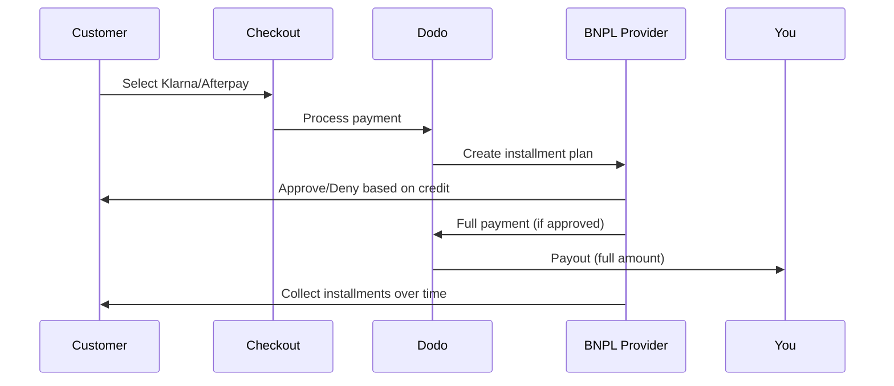

يتيح خيار اشتر الآن وادفع لاحقًا (BNPL) للعملاء تقسيم المشتريات إلى أقساط خالية من الفوائد، مما يزيد متوسط قيمة الطلب بنسبة 20-50٪ ومعدلات التحويل بنسبة 10-30٪ للمعاملات المؤهلة.

## لماذا تقديم BNPL؟

<CardGroup cols={3}>
<Card title="Higher AOV" icon="chart-line">
ينفق العملاء أكثر عندما يتمكنون من توزيع المدفوعات على مدى الزمن. يزيد متوسط قيمة الطلب بنسبة 20-50٪.
</Card>

<Card title="Better Conversion" icon="percent">
إزالة الاحتكاك في الدفع عند الخروج. تتحسن معدلات التحويل بنسبة 10-30٪ للسلع ذات القيمة العالية.
</Card>

<Card title="Zero Risk" icon="shield-check">
يتولى مقدمو BNPL مخاطر الائتمان والتحصيل. تتلقى الدفعة الكاملة مقدمًا.
</Card>
</CardGroup>

## المزودون المدعومون

### Klarna

| الميزة | التفاصيل |
| :------ | :------ |
| **التوافر** | الولايات المتحدة + 19 دولة أوروبية |
| **العملات** | USD, EUR, GBP, DKK, NOK, SEK, CZK, RON, PLN, CHF |
| **الحد الأدنى** | $50.01 (أو ما يعادله) |
| **الاشتراكات** | نعم |

**الدول المدعومة:** النمسا، بلجيكا، جمهورية التشيك، الدنمارك، فنلندا، فرنسا، ألمانيا، اليونان، أيرلندا، إيطاليا، هولندا، النرويج، بولندا، البرتغال، رومانيا، إسبانيا، السويد، سويسرا، المملكة المتحدة، الولايات المتحدة

**خيارات الدفع:**
- **Pay in 4** — قسّم المدفوعات إلى 4 دفعات بدون فوائد
- **Pay in 30 days** — الدفع الكامل مستحق خلال 30 يومًا
- **Financing** — خطط تقسيط أطول أمدًا

### Afterpay (Clearpay)

| الميزة | التفاصيل |
| :------ | :------ |
| **التوفر** | الولايات المتحدة، المملكة المتحدة |
| **العملات** | USD، GBP |
| **الحد الأدنى** | $50.01 (أو ما يعادله) |
| **الاشتراكات** | لا |

**خيارات الدفع:**
- **Pay in 4** — أربع دفعات بدون فوائد كل أسبوعين

<Note>
في المملكة المتحدة، تعمل Afterpay باسم «Clearpay» لكنها تستخدم نفس نوع واجهة برمجة التطبيقات (`afterpay_clearpay`).
</Note>

### Billie

| الميزة | التفاصيل |
| :------ | :------ |
| **التوفر** | عالمي |
| **العملات** | GBP |
| **الحد الأدنى** | لا يوجد |
| **الاشتراكات** | لا |

**حول Billie:** Billie هي حل اشتر الآن وادفع لاحقًا موجه للشركات يتيح للأعمال تقديم شروط دفع مرنة لعملائها. صُمّم للتعاملات بين الشركات التي يحتاج فيها المشترون إلى خيارات دفع تستند إلى الفواتير.

**خيارات الدفع:**
- **Invoice Payment** — ادفع ضمن شروط الدفع المتفق عليها
- **Flexible Terms** — جداول دفع ودية للأعمال

### Sunbit

| الميزة | التفاصيل |
| :------ | :------ |
| **التوفر** | الولايات المتحدة |
| **العملات** | USD |
| **الأدنى** | $60.00 |
| **الأعلى** | $19,999.00 |
| **الاشتراكات** | لا |

**خيارات الدفع:**
- **تمويل التقسيط** — قسم المشتريات إلى دفعات شهرية مريحة

## الإعداد

### أنواع طرق API

| النوع | المزود |
| :--- | :------- |
| `klarna` | Klarna |
| `afterpay_clearpay` | Afterpay / Clearpay |
| `billie` | Billie (B2B) |
| `sunbit` | Sunbit |

### مثال

```javascript
const session = await client.checkoutSessions.create({
  product_cart: [{ product_id: 'prod_123', quantity: 1 }],
  allowed_payment_method_types: [
    'klarna',
    'afterpay_clearpay',
    'credit',
    'debit'
  ],
  customer: {
    email: 'customer@example.com',
    name: 'Jane Smith'
  },
  billing_address: {
    country: 'US',
    zipcode: '10001'
  },
  return_url: 'https://example.com/success'
});
```

<Warning>
Always include `credit` و `debit` كخيارات بديلة. ليس كل العملاء مؤهلين لخيار BNPL، والمعاملات أقل من الحد الأدنى للمزود لن تكون مؤهلة.
</Warning>

## حدود مبلغ المعاملة

كل مزود BNPL له حد أدنى (وفي بعض الأحيان حد أقصى) لمبلغ المعاملة:

| المزود | الحد الأدنى | الحد الأقصى |
| :------- | :------ | :------ |
| Klarna | $50.01 | — |
| Afterpay | $50.01 | — |
| Sunbit | $60.00 | $19,999.00 |

المعاملات خارج هذه القيم:
- لن تظهر خيارات BNPL عند الخروج
- لن يتم عرض خطأ — ببساطة لن تظهر الخيارات
- ستظل مدفوعات البطاقات متاحة

هذا السلوك متوقع. لا تقم بتضمين طريقة BNPL في `allowed_payment_method_types` إذا كان من غير المحتمل أن يقع سعر منتجك في مدى دعم المزود.

## كيف تعمل الأقساط



**نقاط أساسية:**
- تتلقى **السداد الكامل مقدمًا** من مزود BNPL
- مزود BNPL يتولى مسؤولية **المخاطر الائتمانية والتحصيل**
- العميل يدفع مباشرة للمزود على مدار **أربع دفعات** (بشكل معتاد)
- **لا يوجد عكس رسوم** بسبب فشل السداد — تلك مسؤولية المزود

## الاختبار

### بيانات اختبار Klarna

استخدم هذه التفاصيل في وضع الاختبار:

| الحقل | موافق عليه | مرفوض |
| :---- | :------- | :----- |
| **تاريخ الميلاد** | 07-10-1970 | 07-10-1970 |
| **الاسم الأول** | Test | Test |
| **اسم العائلة** | Person-us | Person-us |
| **البريد الإلكتروني** | customer@email.us | customer+denied@email.us |
| **الشارع** | Amsterdam Ave | Amsterdam Ave |
| **رقم المنزل** | 509 | 509 |
| **المدينة** | New York | New York |
| **الولاية** | New York | New York |
| **الرمز البريدي** | 10024-3941 | 10024-3941 |
| **الهاتف** | +13106683312 | +13106354386 |

<Note>
المعاملة يجب أن تكون على الأقل $50 لكي تظهر Klarna كخيار.
</Note>

### اختبار Afterpay

<Steps>
<Step title="Select Afterpay">
اختر Afterpay في الخروج واضغط على الدفع.
</Step>

<Step title="Successful payment">
استخدم أي بريد إلكتروني وعنوان شحن صالح.
</Step>

<Step title="Failed authentication">
لاختبار الفشل: أغلق نافذة Afterpay على صفحة التحويل. حالة الدفع تنتقل إلى `requires_payment_method`.
</Step>
</Steps>

### اختبار Sunbit

<Steps>
<Step title="Set billing country and currency">
تأكد من أن جلسة الخروج تحتوي على `billing_address.country` معدة إلى `US` و `billing_currency` معدة إلى `USD`.
</Step>

<Step title="Use a qualifying amount">
حدد مبلغ المعاملة بين **$60.00 و $19,999.00**. لن يظهر Sunbit خارج هذا النطاق.
</Step>

<Step title="Select Sunbit">
اختر Sunbit عند الخروج وأكمل عملية التقديم للتمويل في نافذة Sunbit.
</Step>

<Step title="Test failure">
لتجربة طلب تم رفضه، أغلق نافذة Sunbit قبل إكمال العملية. الدفع ينتقل إلى `requires_payment_method`.
</Step>
</Steps>

<Note>
Sunbit متاح فقط للعملاء من الولايات المتحدة الذين يدفعون بالدولار الأمريكي بمبلغ معاملة بين $60.00 و $19,999.00.
</Note>

## أفضل الممارسات

<AccordionGroup>
<Accordion title="Target high-ticket items">
 يعمل BNPL بشكل أفضل للمنتجات التي تتراوح بين $100 و $1000. العرض القائل "ادفع مع الوقت" يكون الأكثر جاذبية في هذا النطاق.
</Accordion>

<Accordion title="Show installment amounts">
"4 دفعات بقيمة $25" أكثر جاذبية من "$100 مع Klarna". اعرض المبلغ لكل دفعة حينما يكون ممكنًا.
</Accordion>

<Accordion title="Don't force BNPL for low-value products">
أقل من $50، لن يظهر BNPL على أي حال. أقل من $100، يفضل معظم العملاء البطاقات. ركز ترويج BNPL على العناصر ذات السعر الأعلى.
</Accordion>

<Accordion title="Collect billing address">
يطلب مقدمو BNPL معلومات الفواتير لإجراء فحوصات الائتمان. تأكد من أن عملية الخروج لديك تجمع التفاصيل الكاملة للعناوين.
</Accordion>

<Accordion title="Set clear expectations">
يجب أن يفهم العملاء أنهم يدخلون في اتفاقية ائتمان مع Klarna/Afterpay، وليس معك.
</Accordion>
</AccordionGroup>

## القيود

### لا اشتراكات
طرق الدفع BNPL **لا تدعم المدفوعات الدورية**. للمنتجات الاشتراكية، استخدم البطاقات أو طرق أخرى تدعم المدفوعات الدورية.

### الموافقة بناءً على ائتمان
يقوم مقدمو BNPL بإجراء فحوصات ائتمانية فورية. لن يتم الموافقة على جميع العملاء. تختلف معدلات الموافقة بناءً على:
- سجل ائتمان العميل مع المزود
- مبلغ المعاملة
- موقع العميل

### توافق العملة والبلد

كل عملة مقيدة بمنطقتها المقابلة:

| العملة | الدول المدعومة |
| :------- | :------------------ |
| **USD** | الولايات المتحدة فقط |
| **EUR** | جميع الدول الأوروبية المدعومة (النمسا، بلجيكا، جمهورية التشيك، الدنمارك، فنلندا، فرنسا، ألمانيا، اليونان، أيرلندا، إيطاليا، هولندا، النرويج، بولندا، البرتغال، رومانيا، إسبانيا، السويد، سويسرا) |
| **GBP** | المملكة المتحدة وجميع الدول الأوروبية المدعومة |

العملات الأخرى المدعومة من Klarna (DKK، NOK، SEK، CZK، RON، PLN، CHF) تعمل في بلدانها الخاصة.

<Info>
على سبيل المثال، معاملة بالدولار الأمريكي ستظهر فقط خيارات BNPL للعملاء في الولايات المتحدة. معاملة باليورو ستعرض خيارات BNPL عبر جميع الدول الأوروبية المدعومة. معاملة بالجنيه الاسترليني ستعرض خيارات BNPL للعملاء في المملكة المتحدة وجميع الدول الأوروبية المدعومة.
</Info>

| المزود | العملات المدعومة |
| :------- | :------------------- |
| Klarna | USD، EUR، GBP، DKK، NOK، SEK، CZK، RON، PLN، CHF |
| Afterpay | USD (الولايات المتحدة)، GBP (المملكة المتحدة) |
| Sunbit | USD (الولايات المتحدة) |

## استكشاف الأخطاء

<AccordionGroup>
<Accordion title="BNPL not appearing at checkout">
**تحقق:**
1. هل مبلغ المعاملة ضمن المدى المدعوم من المزود؟ (Klarna/Afterpay: الحد الأدنى $50.01; Sunbit: $60.00–$19,999.00)
2. موقع العميل في بلد مدعوم؟
3. العملة مدعومة من مزود BNPL؟
4. هل تم تضمين طريقة BNPL في `allowed_payment_method_types`؟

**الحل:** عادةً، المعاملة تكون أقل من الحد الأدنى أو أعلى من الحد الأقصى. تحقق من أن المبلغ يقع ضمن المدى المدعوم من المزود.
</Accordion>

<Accordion title="Customer denied by BNPL provider">
**الأسباب:**
- تاريخ ائتماني غير كافٍ مع المزود
- كثير من خطط الأقساط النشطة
- فشل التحقق من الهوية

**الحل:** هذا متوقع لبعض العملاء. تأكد من توفر خيارات بديلة للبطاقات. لا تكشف عن أسباب الرفض المحددة.
</Accordion>

<Accordion title="Payment stuck in pending">
**السبب:** العميل لم يكمل عملية التوثيق مع مزود BNPL.

**الحل:** سينتهي الوقت ويفشل الدفع. يمكن للعميل المحاولة مرة أخرى أو استخدام طريقة أخرى.
</Accordion>
</AccordionGroup>

## الصفحات ذات الصلة

<CardGroup cols={2}>
<Card title="Payment Methods Overview" icon="credit-card" href="/features/payment-methods">
 مشاهدة جميع طرق الدفع المدعومة.
</Card>

<Card title="Checkout Guide" icon="book" href="/developer-resources/checkout-session">
 دليل تنفيذ الخروج الكامل.
</Card>

<Card title="Testing Process" icon="flask" href="/miscellaneous/testing-process">
 جميع بيانات الاختبار لطرق الدفع.
</Card>

<Card title="Adaptive Currency" icon="globe" href="/features/adaptive-currency">
 دعم العملات والتحويل.
</Card>
</CardGroup>