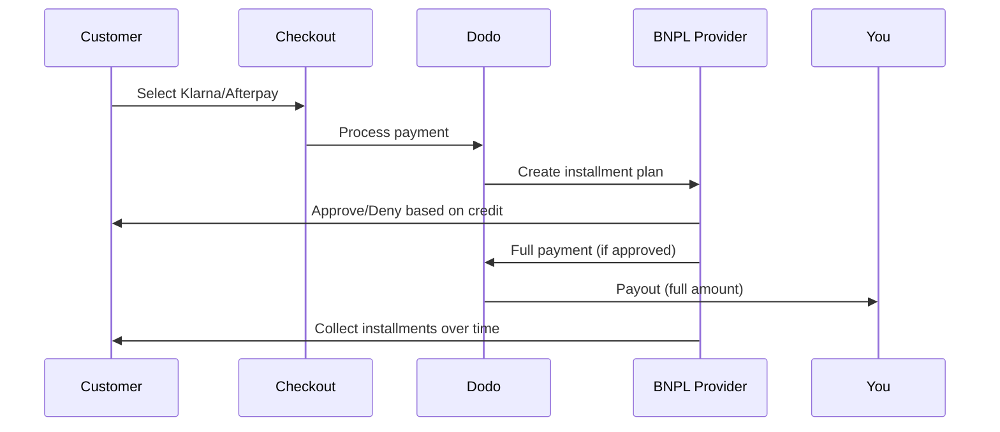

الشراء الآن والدفع لاحقًا (BNPL) يسمح للعملاء بتقسيم المشتريات إلى أقساط بدون فوائد، مما يزيد متوسط قيمة الطلب بنسبة 20-50٪ ومعدلات التحويل بنسبة 10-30٪ للمعاملات المؤهلة.

## لماذا تقدم BNPL؟

<CardGroup cols={3}>
<Card title="متوسط قيمة طلب أعلى" icon="chart-line">
ينفق العملاء المزيد عندما يمكنهم توزيع المدفوعات على مدى زمني. يزيد متوسط قيمة الطلب بنسبة 20-50٪.
</Card>

<Card title="تحسين التحويل" icon="percent">
إزالة الاحتكاك في الدفع عند الخروج. تحسن معدلات التحويل بنسبة 10-30٪ للسلع ذات الأسعار المرتفعة.
</Card>

<Card title="عدم وجود مخاطر" icon="shield-check">
موفروا BNPL يتعاملون مع مخاطر الائتمان والتحصيل. تتلقى المدفوعات كاملةً مسبقًا.
</Card>
</CardGroup>

## مقدمو الخدمة المدعومون

### كلارنا

| السمة | التفاصيل |
| :------ | :------ |
| **التوفر** | الولايات المتحدة + 19 دولة أوروبية |
| **العملات** | دولار أمريكي، يورو، جنيه إسترليني، كرونة دانمركية، كرونة نرويجية، كرونة سويدية، كرونة تشيكية، ليك روماني، زلوتي بولندي، فرنك سويسري |
| **الحد الأدنى** | 50.01 دولار (أو ما يعادلها) |
| **الاشتراكات** | لا |

**الدول المدعومة:** النمسا، بلجيكا، جمهورية التشيك، الدنمارك، فنلندا، فرنسا، ألمانيا، اليونان، أيرلندا، إيطاليا، هولندا، النرويج، بولندا، البرتغال، رومانيا، إسبانيا، السويد، سويسرا، المملكة المتحدة، الولايات المتحدة

**خيارات الدفع:**
- **الدفع على 4 دفعات** — تقسيط على 4 دفعات بدون فوائد
- **الدفع خلال 30 يومًا** — المدفوعات الكاملة مستحقة خلال 30 يومًا
- **تمويل** — خطط أقساط طويلة الأمد

### أفتر باي (كليرباي)

| السمة | التفاصيل |
| :------ | :------ |
| **التوفر** | الولايات المتحدة، المملكة المتحدة |
| **العملات** | دولار أمريكي، جنيه إسترليني |
| **الحد الأدنى** | 50.01 دولار (أو ما يعادلها) |
| **الاشتراكات** | لا |

**خيارات الدفع:**
- **الدفع على 4 دفعات** — 4 دفعات بدون فوائد كل أسبوعين

<Note>
في المملكة المتحدة، تعمل بعد الدفع "كليرباي" لكنها تستخدم نفس نوع واجهة برمجة التطبيقات (`afterpay_clearpay`).
</Note>

### بيلي

| السمة | التفاصيل |
| :------ | :------ |
| **التوفر** | عالمي |
| **العملات** | جنيه إسترليني |
| **الحد الأدنى** | لا شيء |
| **الاشتراكات** | لا |

**عن بيلي:**
بيلي هي حل الشراء الآن والدفع لاحقًا B2B الذي يمكن الشركات من تقديم شروط دفع مرنة لعملائها. تم تصميمه للمعاملات بين الشركات حيث يحتاج المشترون إلى خيارات سداد تعتمد على الفواتير.

**خيارات الدفع:**
- **دفع الفاتورة** — الدفع ضمن الشروط المتفق عليها
- **شروط مرنة** — جداول دفع صديقة للأعمال

## التكوين

### أنواع طرق API

| النوع | الموفر |
| :--- | :------- |
| `klarna` | كلارنا |
| `afterpay_clearpay` | أفتر باي / كليرباي |
| `billie` | بيلي (B2B) |

### مثال

```javascript
const session = await client.checkoutSessions.create({
  product_cart: [{ product_id: 'prod_123', quantity: 1 }],
  allowed_payment_method_types: [
    'klarna',
    'afterpay_clearpay',
    'credit',
    'debit'
  ],
  customer: {
    email: 'customer@example.com',
    name: 'Jane Smith'
  },
  billing_address: {
    country: 'US',
    zipcode: '10001'
  },
  return_url: 'https://example.com/success'
});
```

<Warning>
تأكد دائمًا من تضمين `credit` و `debit` كخيارات بديلة. ليس جميع العملاء مؤهلين لـ BNPL، والمعاملات التي تقل عن 50.01 دولار لن تؤهل.
</Warning>

## الحد الأدنى لمبلغ المعاملة

**كل من كلارنا وأفتر باي تتطلب حدًا أدنى قدره 50.01 دولار أمريكي** (أو ما يعادلها في العملات المدعومة).

المعاملات التي تقل عن هذا الحد:
- لن تظهر خيارات BNPL عند الخروج
- لا يتم إظهار أي خطأ — الخيارات ببساطة لا تظهر
- تظل المدفوعات ببطاقة الائتمان متاحة

هذا سلوك متوقع. لا تتضمن BNPL في `allowed_payment_method_types` للمنتجات التي تقل عن 50 دولارًا.

## كيفية عمل الأقساط



**النقاط الرئيسية:**
- تتلقى **الدفع الكامل مقدمًا** من موفر BNPL
- موفر BNPL يتعامل مع **مخاطر الائتمان والتحصيل**
- يدفع العميل مباشرة إلى الموفر على **4 دفعات** (عادة)
- **لا تراجع للمدفوعات** من فشل الأقساط — هذا هو خطر الموفر

## الاختبار

### بيانات اختبار كلارنا

استخدم هذه التفاصيل في وضع الاختبار:

| الحقل | معتمد | مرفوض |
| :---- | :------- | :----- |
| **تاريخ الميلاد** | 07-10-1970 | 07-10-1970 |
| **الاسم الأول** | اختبار | اختبار |
| **الاسم الأخير** | شخص-أمريكي | شخص-أمريكي |
| **البريد الإلكتروني** | customer@email.us | customer+denied@email.us |
| **الشارع** | Amsterdam Ave | Amsterdam Ave |
| **رقم المنزل** | 509 | 509 |
| **المدينة** | نيويورك | نيويورك |
| **الولاية** | نيويورك | نيويورك |
| **الرمز البريدي** | 10024-3941 | 10024-3941 |
| **الهاتف** | +13106683312 | +13106354386 |

<Note>
يجب أن تكون المعاملة على الأقل 50 دولارًا لتظهر كلارنا كخيار.
</Note>

### اختبار أفتر باي

<Steps>
<Step title="اختيار أفتر باي">
اختر أفتر باي عند الخروج واضغط على دفع.
</Step>

<Step title="دفع ناجح">
استخدم أي بريد إلكتروني وعنوان شحن صالحين.
</Step>

<Step title="فشل المصادقة">
لاختبار الفشل: أغلق نافذة أفتر باي على صفحة إعادة التوجيه. حالة الدفع تتحول إلى `requires_payment_method`.
</Step>
</Steps>

## أفضل الممارسات

<AccordionGroup>
<Accordion title="استهداف السلع عالية القيمة">
تعمل BNPL بشكل أفضل للمنتجات بين 100-1000 دولار. يعتبر عرض قيمة "الدفع على مر الزمن" الأكثر جذبًا في هذا النطاق.
</Accordion>

<Accordion title="عرض مبالغ الأقساط">
"4 دفعات بقيمة 25 دولار" تعتبر أكثر جاذبية من "$100 مع كلارنا". اعرض مبلغ الدفع لكل دفعة عند الإمكان.
</Accordion>

<Accordion title="لا تضغط على BNPL للمنتجات منخفضة القيمة">
تحت 50 دولار، لن تظهر BNPL على أي حال. تحت 100 دولار، معظم العملاء يفضلون بطاقات الائتمان. ركز ترويج BNPL على العناصر الأكثر قيمة.
</Accordion>

<Accordion title="جمع عنوان الفوترة">
يتطلب موفرو BNPL معلومات الفوترة لإجراء فحوصات الائتمان. تأكد من جمع معلومات العنوان الكامل عند الخروج.
</Accordion>

<Accordion title="تحديد التوقعات بوضوح">
يجب أن يفهم العملاء أنهم يدخلون في اتفاقية ائتمانية مع كلارنا/أفتر باي، وليس معك.
</Accordion>
</AccordionGroup>

## القيود

### لا اشتراكات
طرق دفع BNPL **لا تدعم المدفوعات المتكررة**. للمنتجات الاشتراكية، استخدم بطاقات الائتمان أو طرق أخرى متوافقة مع المدفوعات المتكررة.

### الموافقة المبنية على الائتمان
يبدأ موفرو BNPL عمليات فحص ائتمانية فورية. ليس كل العملاء سيحصلون على الموافقة. تختلف معدلات الموافقة حسب:
- تاريخ ائتماني العميل مع الموفر
- مبلغ المعاملة
- موقع العميل

### Mapping العملة والبلد
تقتصر كل عملة على منطقتها المعنية:

| العملة | الدول المدعومة |
| :------- | :------------------ |
| **دولار أمريكي** | الولايات المتحدة فقط |
| **يورو** | جميع الدول الأوروبية المدعومة (النمسا، بلجيكا، جمهورية التشيك، الدنمارك، فنلندا، فرنسا، ألمانيا، اليونان، أيرلندا، إيطاليا، هولندا، النرويج، بولندا، البرتغال، رومانيا، إسبانيا، السويد، سويسرا) |
| **جنيه إسترليني** | المملكة المتحدة وجميع الدول الأوروبية المدعومة |

تعمل العملات الأخرى المدعومة من كلارنا (DKK، NOK، SEK، CZK، RON، PLN، CHF) في دولها المعنية.

<Info>
على سبيل المثال، صفقة بالدولار الأمريكي ستظهر خيارات BNPL فقط للعملاء في الولايات المتحدة. صفقة باليورو ستظهر خيارات BNPL في جميع الدول الأوروبية المدعومة. صفقة بالجنيه الإسترليني ستظهر خيارات BNPL للعملاء في المملكة المتحدة وجميع الدول الأوروبية المدعومة.
</Info>

| الموفر | العملات المدعومة |
| :------- | :------------------- |
| كلارنا | دولار أمريكي، يورو، جنيه إسترليني، كرونة دانمركية، كرونة نرويجية، كرونة سويدية، كرونة تشيكية، ليك روماني، زلوتي بولندي، فرنك سويسري |
| أفتر باي | دولار أمريكي (الولايات المتحدة)، جنيه إسترليني (المملكة المتحدة) |

## استكشاف الأخطاء وإصلاحها

<AccordionGroup>
<Accordion title="لا تظهر BNPL عند الخروج">
**تحقق:**
1. هل مبلغ المعاملة 50.01 دولار على الأقل؟
2. هل موقع العميل في بلد مدعوم؟
3. هل العملة المدعومة من مزود BNPL؟
4. هل تم تضمين طريقة BNPL في `allowed_payment_method_types`؟

**الحل:** غالبًا ما يكون السبب هو أن المعاملة أقل من الحد الأدنى. تحقق من أن المبلغ يفي بعتبة 50.01 دولار.
</Accordion>

<Accordion title="تم رفض العميل من قبل موفر BNPL">
**الأسباب:**
- تاريخ ائتماني غير كافٍ مع الموفر
- عدد كبير من خطط الأقساط النشطة
- فشل التحقق من الهوية

**الحل:** هذا متوقع لبعض العملاء. تأكد من توفر خيارات بديلة باستخدام البطاقة. لا تعرض أسباب الرفض المحددة.
</Accordion>

<Accordion title="عملية الدفع عالقة في الانتظار">
**السبب:** لم يكمل العميل عملية المصادقة مع موفر BNPL.

**الحل:** ستنتهي صلاحية الدفع وتفشل. يمكن للعميل المحاولة مرة أخرى أو استخدام طريقة مختلفة.
</Accordion>
</AccordionGroup>

## صفحات ذات صلة

<CardGroup cols={2}>
<Card title="نظرة عامة على طرق الدفع" icon="credit-card" href="/features/payment-methods">
اطلع على جميع طرق الدفع المدعومة.
</Card>

<Card title="دليل الدفع" icon="book" href="/developer-resources/checkout-session">
دليل تنفيذ الدفع الكامل.
</Card>

<Card title="عملية الاختبار" icon="flask" href="/miscellaneous/testing-process">
جميع بيانات الاختبار لطرق الدفع.
</Card>

<Card title="العملة التكيفية" icon="globe" href="/features/adaptive-currency">
دعم وتحويل العملات.
</Card>
</CardGroup>

<Card title="Adaptive Currency" icon="globe" href="/features/adaptive-currency">
Currency support and conversion.
</Card>
</CardGroup>