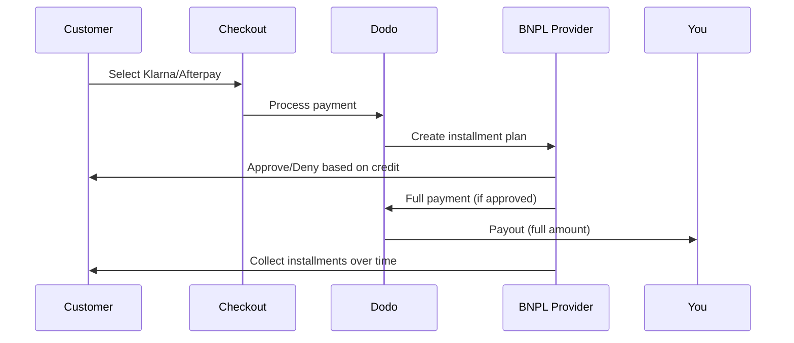

يتيح خيار اشتر الآن وادفع لاحقًا (BNPL) للعملاء تقسيم المشتريات إلى أقساط خالية من الفوائد، مما يزيد متوسط قيمة الطلب بنسبة 20-50٪ ومعدلات التحويل بنسبة 10-30٪ للمعاملات المؤهلة.

## لماذا تقديم BNPL؟

<CardGroup cols={3}>
<Card title="Higher AOV" icon="chart-line">
ينفق العملاء أكثر عندما يتمكنون من توزيع المدفوعات على مدى الزمن. يزيد متوسط قيمة الطلب بنسبة 20-50٪.
</Card>

<Card title="Better Conversion" icon="percent">
إزالة الاحتكاك في الدفع عند الخروج. تتحسن معدلات التحويل بنسبة 10-30٪ للسلع ذات القيمة العالية.
</Card>

<Card title="Zero Risk" icon="shield-check">
يتولى مقدمو BNPL مخاطر الائتمان والتحصيل. تتلقى الدفعة الكاملة مقدمًا.
</Card>
</CardGroup>

## المزودون المدعومون

### Klarna

| الميزة | التفاصيل |
| :------ | :------ |
| **التوافر** | الولايات المتحدة + 19 دولة أوروبية |
| **العملات** | USD, EUR, GBP, DKK, NOK, SEK, CZK, RON, PLN, CHF |
| **الحد الأدنى** | $50.01 (أو ما يعادله) |
| **الاشتراكات** | نعم |

**الدول المدعومة:** النمسا، بلجيكا، جمهورية التشيك، الدنمارك، فنلندا، فرنسا، ألمانيا، اليونان، أيرلندا، إيطاليا، هولندا، النرويج، بولندا، البرتغال، رومانيا، إسبانيا، السويد، سويسرا، المملكة المتحدة، الولايات المتحدة

**خيارات الدفع:**
- **Pay in 4** — قسّم المدفوعات إلى 4 دفعات بدون فوائد
- **Pay in 30 days** — الدفع الكامل مستحق خلال 30 يومًا
- **Financing** — خطط تقسيط أطول أمدًا

### Afterpay (Clearpay)

| الميزة | التفاصيل |
| :------ | :------ |
| **التوفر** | الولايات المتحدة، المملكة المتحدة |
| **العملات** | USD، GBP |
| **الحد الأدنى** | $50.01 (أو ما يعادله) |
| **الاشتراكات** | لا |

**خيارات الدفع:**
- **Pay in 4** — أربع دفعات بدون فوائد كل أسبوعين

<Note>
في المملكة المتحدة، تعمل Afterpay باسم «Clearpay» لكنها تستخدم نفس نوع واجهة برمجة التطبيقات (`afterpay_clearpay`).
</Note>

### Billie

| الميزة | التفاصيل |
| :------ | :------ |
| **التوفر** | عالمي |
| **العملات** | GBP |
| **الحد الأدنى** | لا يوجد |
| **الاشتراكات** | لا |

**حول Billie:** Billie هي حل اشتر الآن وادفع لاحقًا موجه للشركات يتيح للأعمال تقديم شروط دفع مرنة لعملائها. صُمّم للتعاملات بين الشركات التي يحتاج فيها المشترون إلى خيارات دفع تستند إلى الفواتير.

**خيارات الدفع:**
- **Invoice Payment** — ادفع ضمن شروط الدفع المتفق عليها
- **Flexible Terms** — جداول دفع ودية للأعمال

## الإعداد

### أنواع API Method

| النوع | المزوّد |
| :--- | :------- |
| `klarna` | Klarna |
| `afterpay_clearpay` | Afterpay / Clearpay |
| `billie` | Billie (B2B) |

### مثال

```javascript
const session = await client.checkoutSessions.create({
  product_cart: [{ product_id: 'pdt_123', quantity: 1 }],
  allowed_payment_method_types: [
    'klarna',
    'afterpay_clearpay',
    'credit',
    'debit'
  ],
  customer: {
    email: 'customer@example.com',
    name: 'Jane Smith'
  },
  billing_address: {
    country: 'US',
    zipcode: '10001'
  },
  return_url: 'https://example.com/success'
});
```

<Warning>
أدرج دائمًا `credit` و`debit` كخيارات احتياطية. ليس جميع العملاء مؤهلين لاستخدام BNPL، كما أن المعاملات التي تقل عن الحد الأدنى للمزوّد لن تكون مؤهلة.
</Warning>

## حدود مبالغ المعاملات

لكل مزوّد BNPL حد أدنى خاص به (وأحيانًا حد أقصى) لمبلغ المعاملة:

| المزوّد | الحد الأدنى | الحد الأقصى |
| :------- | :------ | :------ |
| Klarna | $50.01 | — |
| Afterpay | $50.01 | — |

المعاملات التي تقع خارج هذه الحدود:
- لن تظهر خيارات BNPL عند إتمام الدفع
- لن يظهر أي خطأ — لن تظهر الخيارات ببساطة
- تظل الدفعات بالبطاقات متاحة

هذا سلوك متوقّع. لا تُدرج طريقة BNPL في `allowed_payment_method_types` إذا كان من غير المرجح أن يقع سعر منتجك ضمن النطاق الذي يدعمه ذلك المزوّد.

## آلية عمل التقسيط



**النقاط الرئيسية:**
- تتلقى **الدفعة كاملة مقدمًا** من مزوّد BNPL
- يتولى مزوّد BNPL **مخاطر الائتمان والتحصيل**
- يدفع العميل للمزوّد مباشرة على **4 دفعات** (عادةً)
- **لا توجد عمليات رد مبالغ** بسبب فشل دفعات التقسيط — فهذه مسؤولية المزوّد

## الاختبار

### بيانات اختبار Klarna

استخدم هذه التفاصيل في وضع الاختبار:

| الحقل | موافَق عليه | مرفوض |
| :---- | :------- | :----- |
| **تاريخ الميلاد** | 07-10-1970 | 07-10-1970 |
| **الاسم الأول** | Test | Test |
| **اسم العائلة** | Person-us | Person-us |
| **البريد الإلكتروني** | customer@email.us | customer+denied@email.us |
| **الشارع** | Amsterdam Ave | Amsterdam Ave |
| **رقم المنزل** | 509 | 509 |
| **المدينة** | New York | New York |
| **الولاية** | New York | New York |
| **الرمز البريدي** | 10024-3941 | 10024-3941 |
| **الهاتف** | +13106683312 | +13106354386 |

<Note>
يجب ألا تقل قيمة المعاملة عن $50 حتى يظهر Klarna كخيار.
</Note>

### اختبار Afterpay

<Steps>
<Step title="Select Afterpay">
اختر Afterpay عند إتمام الدفع وانقر على Pay.
</Step>

<Step title="Successful payment">
استخدم أي بريد إلكتروني صالح وعنوان شحن صالح.
</Step>

<Step title="Failed authentication">
لاختبار الفشل: أغلق نافذة Afterpay المنبثقة في صفحة إعادة التوجيه. تنتقل حالة الدفع إلى `requires_payment_method`.
</Step>
</Steps>

## أفضل الممارسات

<AccordionGroup>
<Accordion title="Target high-ticket items">
يعمل BNPL بأفضل شكل مع المنتجات التي يتراوح سعرها بين $100 و$1000. وتكون القيمة المقترحة لعبارة "الدفع على فترة" الأكثر إقناعًا ضمن هذا النطاق.
</Accordion>

<Accordion title="Show installment amounts">
تُعد عبارة "4 دفعات بقيمة $25" أكثر إقناعًا من عبارة "$100 مع Klarna". اعرض مبلغ الدفعة الواحدة متى أمكن.
</Accordion>

<Accordion title="Don't force BNPL for low-value products">
لن يظهر BNPL أصلًا عند المبالغ التي تقل عن $50. وعند المبالغ التي تقل عن $100، يفضّل معظم العملاء البطاقات. ركّز الترويج لـ BNPL على المنتجات الأعلى سعرًا.
</Accordion>

<Accordion title="Collect billing address">
يتطلب مزوّدو BNPL معلومات الفوترة لإجراء فحوصات الائتمان. تأكد من أن صفحة الدفع تجمع تفاصيل العنوان كاملة.
</Accordion>

<Accordion title="Set clear expectations">
يجب أن يفهم العملاء أنهم يبرمون اتفاقية ائتمانية مع Klarna/Afterpay، وليس معك.
</Accordion>
</AccordionGroup>

## القيود

### لا توجد اشتراكات
**لا تدعم طرق الدفع عبر BNPL الدفعات المتكررة**. بالنسبة إلى المنتجات القائمة على الاشتراكات، استخدم البطاقات أو طرقًا أخرى متوافقة مع الدفعات المتكررة.

### الموافقة القائمة على الائتمان
يجري مزوّدو BNPL فحوصات ائتمانية فورية. لن تتم الموافقة على جميع العملاء. تختلف معدلات الموافقة حسب:
- السجل الائتماني للعميل لدى المزوّد
- مبلغ المعاملة
- موقع العميل

### ربط العملات بالدول

تقتصر كل عملة على المنطقة المقابلة لها:

| العملة | الدول المدعومة |
| :------- | :------------------ |
| **USD** | الولايات المتحدة فقط |
| **EUR** | جميع الدول الأوروبية المدعومة (النمسا، بلجيكا، جمهورية التشيك، الدنمارك، فنلندا، فرنسا، ألمانيا، اليونان، أيرلندا، إيطاليا، هولندا، النرويج، بولندا، البرتغال، رومانيا، إسبانيا، السويد، سويسرا) |
| **GBP** | المملكة المتحدة وجميع الدول الأوروبية المدعومة |

تعمل العملات الأخرى التي يدعمها Klarna ‏(DKK وNOK وSEK وCZK وRON وPLN وCHF) في بلدانها respective.

<Info>
على سبيل المثال، لن تعرض معاملة بعملة USD خيارات BNPL إلا للعملاء الموجودين في الولايات المتحدة. وستعرض معاملة بعملة EUR خيارات BNPL في جميع الدول الأوروبية المدعومة. وستعرض معاملة بعملة GBP خيارات BNPL للعملاء في المملكة المتحدة وجميع الدول الأوروبية المدعومة.
</Info>

| المزوّد | العملات المدعومة |
| :------- | :------------------- |
| Klarna | USD, EUR, GBP, DKK, NOK, SEK, CZK, RON, PLN, CHF |
| Afterpay | USD (US), GBP (UK) |

## استكشاف الأخطاء وإصلاحها

<AccordionGroup>
<Accordion title="BNPL not appearing at checkout">
**تحقّق من:**
1. هل يقع مبلغ المعاملة ضمن النطاق الذي يدعمه المزوّد؟ (Klarna/Afterpay: الحد الأدنى $50.01)
2. هل يقع موقع العميل في دولة مدعومة؟
3. هل العملة مدعومة من مزوّد BNPL؟
4. هل أُدرجت طريقة BNPL في `allowed_payment_method_types`؟

**الحل:** في معظم الحالات، تكون المعاملة أقل من الحد الأدنى أو أعلى من الحد الأقصى. تحقّق من أن المبلغ يقع ضمن النطاق الذي يدعمه المزوّد.
</Accordion>

<Accordion title="Customer denied by BNPL provider">
**الأسباب:**
- سجل ائتماني غير كافٍ لدى المزوّد
- وجود عدد كبير جدًا من خطط التقسيط النشطة
- فشل التحقق من الهوية

**الحل:** هذا أمر متوقّع لبعض العملاء. تأكد من توفر خيارات احتياطية باستخدام البطاقات. لا تعرض أسباب الرفض المحددة.
</Accordion>

<Accordion title="Payment stuck in pending">
**السبب:** لم يُكمل العميل تدفق المصادقة مع مزوّد BNPL.

**الحل:** ستنتهي مهلة الدفع وسيفشل. يمكن للعميل إعادة المحاولة أو استخدام طريقة مختلفة.
</Accordion>
</AccordionGroup>

## صفحات ذات صلة

<CardGroup cols={2}>
<Card title="Payment Methods Overview" icon="credit-card" href="/features/payment-methods">
اطّلع على جميع طرق الدفع المدعومة.
</Card>

<Card title="Checkout Guide" icon="book" href="/developer-resources/checkout-session">
اطّلع على الدليل الكامل لتنفيذ عملية الدفع.
</Card>

<Card title="Testing Process" icon="flask" href="/miscellaneous/testing-process">
جميع بيانات الاختبار لطرق الدفع.
</Card>

<Card title="Adaptive Currency" icon="globe" href="/features/adaptive-currency">
دعم العملات وتحويلها.
</Card>
</CardGroup>