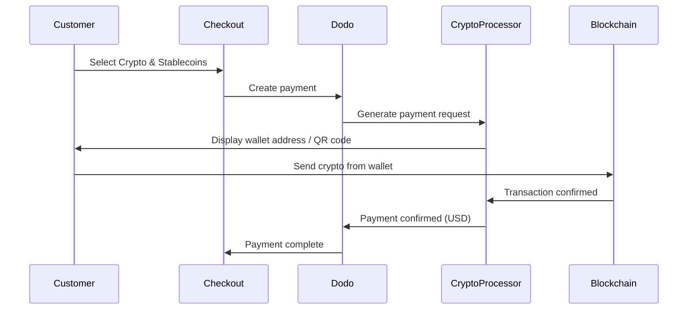

تتيح مدفوعات العملات الرقمية والعملات المستقرة للعملاء الدفع باستخدام العملات الرقمية من أي مكان في العالم (باستثناء الهند). يتم الفوترة بالدولار الأمريكي، لذا ستتلقى العملة الورقية بينما يدفع العملاء باستخدام محفظتهم الرقمية المفضلة.

## لماذا توفير العملات الرقمية والعملات المستقرة؟

عدم الحاجة إلى بنية تحتية مصرفية على الجانب الخاص بالعميل — قبول المدفوعات من أي بلد.

المعاملات الرقمية لا يمكن التراجع عنها، مما يلغي تمامًا احتيال الاسترداد.

ستحصل على الدولار الأمريكي — دون الحاجة لإدارة تقلبات العملات الرقمية أو المحافظ.

## نظرة عامة

| Detail | Value |
| :----- | :---- |
| **عملة الفوترة** | USD |
| **الدول المدعومة** | عالمي (باستثناء الهند) |
| **الاشتراكات** | لا |
| **المبلغ الأدنى** | $0.50 |
| **التسوية** | USD |

## كيف تعمل



## تجربة العميل

1. يختار العميل العملات الرقمية والعملات المستقرة عند الخروج
2. يتم عرض عنوان محفظة ورمز QR مع المبلغ بالعملات الرقمية
3. يُرسل العميل المبلغ المحدد من محفظته الرقمية
4. يتم تأكيد المعاملة على البلوكشين
5. يتم إعادة توجيه العميل إلى صفحة النجاح

المدفوعات الرقمية تُفوتر بالدولار الأمريكي. يعكس المبلغ المعروض عند الخروج سعر الصرف الفعلي في وقت الدفع.

## العملات والشبكات المدعومة

| Currency | Networks |
| :------- | :------- |
| **USDC** | Ethereum, Solana, Polygon, Base |
| **USDP** | Ethereum, Solana |
| **USDG** | Ethereum |

## التكوين

```javascript
const session = await client.checkoutSessions.create({
  product_cart: [{ product_id: 'prod_123', quantity: 1 }],
  allowed_payment_method_types: ['crypto', 'credit', 'debit'],
  return_url: 'https://example.com/success'
});
```

## نوع طريقة API

| Type | Method | Country |
| :--- | :----- | :------ |
| `crypto` | Crypto & Stablecoins | عالمي (باستثناء الهند) |

## الاختبار

استخدم مفاتيح API للاختبار من Dodo Payments.

أنشئ جلسة خروج مع `crypto` في طرق الدفع المسموح بها.

اتبع تدفق دفع العملات الرقمية المحاكى في بيئة الاختبار.

## أفضل الممارسات

ليس كل العملاء لديهم محافظ رقمية. دائماً قم بتضمين `credit` و`debit` كطرق دفع احتياطية.

تستغرق تأكيدات البلوكشين بضع دقائق اعتماداً على الشبكة. تأكد من توصيل هذا للعملاء عند الخروج.

قد تختلف المدفوعات الرقمية أحياناً قليلاً عن المبلغ الدقيق بسبب رسوم الشبكة. راقب الويب هوكس للحصول على تحديثات حالة المدفوعات.

## استكشاف الأخطاء وإصلاحها

**تحقق:**
1. `crypto` مدرجة في `allowed_payment_method_types`؟
2. يلبي مبلغ المعاملة الحد الأدنى ($0.50)؟

الحل: تأكد من تمرير نوع طريقة الدفع بشكل صحيح في طلب API الخاص بك.

السبب: تختلف أوقات تأكيد البلوكشين. تستغرق بعض الشبكات أطول من غيرها.

الحل: انتظر لتأكيد الويب هوك. لا تتعامل مع الدفع على أنه فاشل حتى انقضاء فترة التأكيد.

السبب: تتقلب أسعار صرف العملات الرقمية بين وقت بدء الدفع والوقت الذي يتم إرساله فيه.

الحل: راقب الويب هوكس للحصول على المبلغ المؤكد النهائي. التعامل مع الفروق الصغيرة تلقائياً.

## الصفحات المتعلقة

عرض جميع طرق الدفع المدعومة.

دليل التنفيذ الكامل للخروج.

التعامل مع تأكيدات الدفع بشكل غير متزامن.

الدليل الكامل للاختبار لجميع طرق الدفع.
