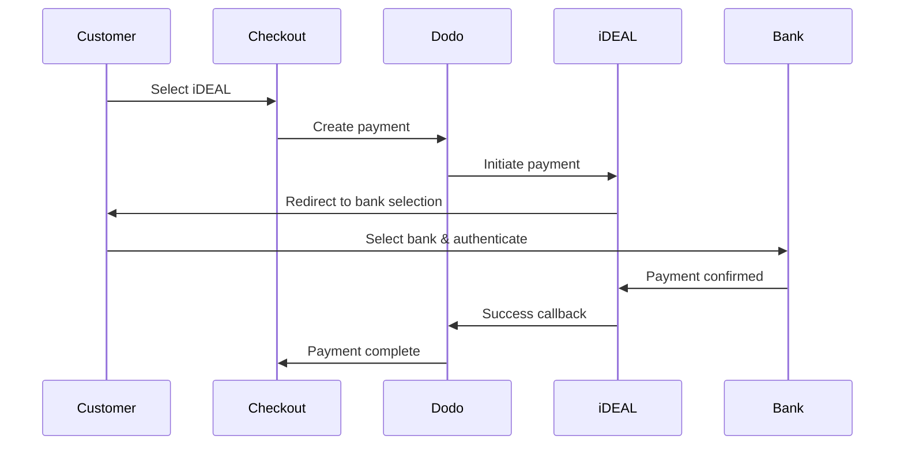
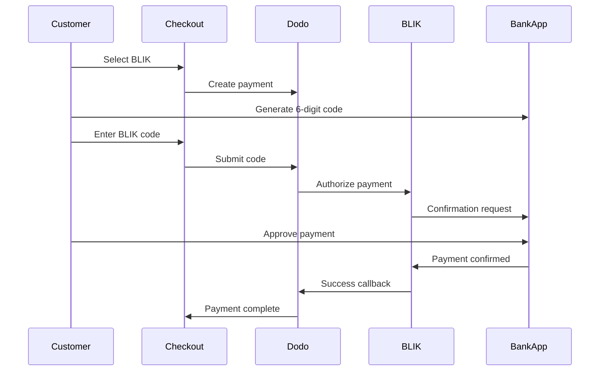
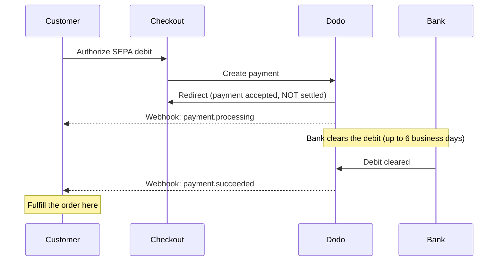

يفضل العملاء الأوروبيون بشدة طرق الدفع المحلية التي تندمج مع أنظمتهم المصرفية. يمكن أن يؤدي تقديم هذه الطرق إلى زيادة معدلات التحويل بنسبة 20-40٪ في الأسواق المستهدفة.

## لماذا طرق الدفع المحلية الأوروبية؟

<CardGroup cols={3}>
<Card title="Higher Conversion" icon="chart-line">
يجذب iDEAL حوالي 60٪ من المدفوعات الإلكترونية في هولندا. عدم تقديمه يعني خسارة العملاء.
</Card>

<Card title="Lower Fraud" icon="shield-check">
تتمتع المدفوعات المصادق عليها من البنك بمعدلات احتيال تكاد تكون صفرًا ولا توجد عمليات رد أموال.
</Card>

<Card title="Real-Time Settlement" icon="bolt">
توفر معظم الطرق الأوروبية تأكيدًا فوريًا للدفع.
</Card>
</CardGroup>

## الطرق المدعومة

| الطريقة | الدولة | الحصة السوقية | العملة | الاشتراكات |
| :----- | :------ | :----------- | :------- | :-----------: |
| **iDEAL** | هولندا | ~60% | EUR | لا |
| **Bancontact** | بلجيكا | ~50% | EUR | لا |
| **EPS** | النمسا | ~30% | EUR | لا |
| **Multibanco** | البرتغال | ~40% | EUR | لا |
| **BLIK** | بولندا | ~60% | PLN | لا |
| **SEPA Direct Debit** | منطقة اليورو | مستخدمة على نطاق واسع | EUR | لا |
| **Satispay** | أوروبا (إيطاليا) | متنامية | EUR | نعم |

## iDEAL (هولندا)

يعد iDEAL طريقة الدفع الإلكترونية المهيمنة في هولندا، ويتصل مباشرة بجميع البنوك الهولندية الكبرى.

### كيف يعمل



### البنوك المدعومة

جميع البنوك الهولندية الكبرى مدعومة:
- ABN AMRO
- ASN Bank
- Bunq
- ING
- Knab
- Rabobank
- RegioBank
- Revolut
- SNS
- Triodos Bank
- Van Lanschot

### الإعداد

```javascript
const session = await client.checkoutSessions.create({
  product_cart: [{ product_id: 'pdt_123', quantity: 1 }],
  allowed_payment_method_types: ['ideal', 'credit', 'debit'],
  billing_currency: 'EUR',
  billing_address: {
    country: 'NL',
    zipcode: '1012JS'
  },
  return_url: 'https://example.com/success'
});
```

## Bancontact (بلجيكا)

Bancontact هو نظام الدفع الوطني في بلجيكا، ويستخدمه تقريبًا جميع البنوك البلجيكية للمدفوعات الإلكترونية.

### الميزات
- يعمل مع بطاقات الخصم البلجيكية الحالية
- دعم تطبيق الهاتف المحمول (Payconiq بواسطة Bancontact)
- تأكيد فوري للدفع
- لا حاجة لتسجيل إضافي للعملاء

### الإعداد

```javascript
const session = await client.checkoutSessions.create({
  product_cart: [{ product_id: 'pdt_123', quantity: 1 }],
  allowed_payment_method_types: ['bancontact_card', 'credit', 'debit'],
  billing_currency: 'EUR',
  billing_address: {
    country: 'BE',
    zipcode: '1000'
  },
  return_url: 'https://example.com/success'
});
```

## EPS (النمسا)

تمكّن EPS (المعيار الإلكتروني للدفع) التحويلات المصرفية المباشرة عبر الإنترنت للعملاء النمساويين.

### الميزات
- التكامل المباشر مع البنوك النمساوية
- تأكيد الدفع في الوقت الحقيقي
- ثقة عالية بين المستهلكين النمساويين
- لا عمليات رد أموال

### البنوك المدعومة

تشمل البنوك النمساوية الكبرى:
- Erste Bank
- Bank Austria
- Raiffeisen
- BAWAG
- Volksbank

### الإعداد

```javascript
const session = await client.checkoutSessions.create({
  product_cart: [{ product_id: 'pdt_123', quantity: 1 }],
  allowed_payment_method_types: ['eps', 'credit', 'debit'],
  billing_currency: 'EUR',
  billing_address: {
    country: 'AT',
    zipcode: '1010'
  },
  return_url: 'https://example.com/success'
});
```

## Multibanco (البرتغال)

Multibanco هو الشبكة المصرفية البينية في البرتغال، ويوفر المدفوعات عبر الإنترنت والمدفوعات عبر أجهزة الصراف الآلي.

### خيارات الدفع

1. **الخدمات المصرفية عبر الإنترنت** — تحويل مصرفي مباشر عبر الخدمات المصرفية الإلكترونية
2. **الدفع عبر أجهزة الصراف الآلي** — يتلقى العميل مرجعًا للدفع في أي جهاز Multibanco
3. **الخدمات المصرفية عبر الهاتف المحمول** — الدفع عبر تطبيقات الهواتف المصرفية

### كيف يعمل الدفع عبر أجهزة الصراف الآلي

بالنسبة لمدفوعات أجهزة الصراف الآلي، يتلقى العملاء مرجع دفع:

```
Entity: 12345
Reference: 123 456 789
Amount: €50.00
Expiry: 24 hours
```

يمكن للعميل الدفع في أي جهاز صراف آلي برتغالي أو عبر الخدمات المصرفية عبر الإنترنت باستخدام هذا المرجع.

### الإعداد

```javascript
const session = await client.checkoutSessions.create({
  product_cart: [{ product_id: 'pdt_123', quantity: 1 }],
  allowed_payment_method_types: ['multibanco', 'credit', 'debit'],
  billing_currency: 'EUR',
  billing_address: {
    country: 'PT',
    zipcode: '1000-001'
  },
  return_url: 'https://example.com/success'
});
```

<Note>
قد تستغرق مدفوعات Multibanco عبر أجهزة الصراف الآلي وقتًا بين إتمام السداد والدفع الفعلي. راقب Webhooks لتأكيد الدفع.
</Note>

## BLIK (بولندا)

BLIK هي أشهر طريقة دفع عبر الهاتف المحمول في بولندا، إذ تتيح للعملاء الدفع باستخدام رمز لمرة واحدة مكوّن من 6 أرقام يتم إنشاؤه في تطبيقهم المصرفي. تتم تسوية BLIK بالعملة **PLN** (الزلوتي البولندي)، وليس EUR.

### كيفية عمله



### التوفر

- **عملة الفوترة:** PLN فقط
- **نوع المعاملة:** دفعات لمرة واحدة فقط (غير متاحة للاشتراكات)
- **التغطية:** جميع البنوك البولندية الكبرى التي تدعم BLIK

### التكوين

```javascript
const session = await client.checkoutSessions.create({
  product_cart: [{ product_id: 'pdt_123', quantity: 1 }],
  allowed_payment_method_types: ['blik', 'credit', 'debit'],
  billing_currency: 'PLN',
  billing_address: {
    country: 'PL',
    zipcode: '00-001'
  },
  return_url: 'https://example.com/success'
});
```

<Note>
تتطلب BLIK عملة فوترة هي **PLN**. إذا كنت تعرض أسعارك بالعملة EUR، فعّل [Adaptive Currency](/features/adaptive-currency) حتى تتم فوترة العملاء البولنديين بالعملة PLN وتصبح BLIK متاحة.
</Note>

## SEPA Direct Debit (منطقة اليورو)

تتيح SEPA Direct Debit للعملاء في جميع أنحاء منطقة اليورو الدفع مباشرةً من حساباتهم المصرفية بدلاً من استخدام البطاقة. وهي متاحة عند إتمام الدفع بالعملة EUR للدفعات لمرة واحدة.

<Warning>
**SEPA Direct Debit ليس فوريًا — يستغرق تأكيد الدفعة مدة تصل إلى 6 أيام عمل.** بخلاف كل طريقة أخرى في هذه الصفحة، فإن تفويض العميل للخصم عند إتمام الدفع **لا** يعني أن الأموال قد تم تحصيلها. لا تُنفّذ الطلب أبدًا عند إعادة التوجيه من إتمام الدفع أو عند `payment.processing`؛ انتظر وصول webhook‏ `payment.succeeded`.
</Warning>

### آلية العمل

يفوّض العميل الخصم أثناء إتمام الدفع، ثم يتولى Dodo Payments تحصيل الأموال من حسابه المصرفي. ونظرًا إلى أن البنك يُتمّ تسوية الخصم بشكل غير متزامن، تمر الدفعة بحالة `processing` قبل أن تصل إلى نتيجة نهائية:



### الجدول الزمني للدفعة

| المرحلة | الوقت | حالة الدفعة | ما الذي تعنيه |
| :---- | :--- | :------------- | :------------ |
| **التفويض** | عند إتمام الدفع | `processing` | وافق العميل على الخصم وأُعيد توجيهه. لم تتحرك الأموال **بعد** — لا تُنفّذ الطلب. |
| **التأكيد** | بعد مدة تصل إلى **6 أيام عمل** | `succeeded` | أتمّ البنك تسوية الخصم. نفّذ الطلب الآن. |
| **الفشل** | بعد مدة تصل إلى **6 أيام عمل** | `failed` | تعذر تحصيل الخصم (مثلًا بسبب عدم كفاية الأموال). لا تُنفّذ الطلب؛ أبلغ العميل. |

نظرًا إلى أن التأكيد يصل بعد مغادرة العميل لموقعك بعدة أيام، يجب أن يكون معالج webhook — وليس إعادة التوجيه من إتمام الدفع — هو الذي يمنح الوصول. راجع [معالجة تأخير التأكيد](#handling-the-confirmation-delay) أدناه.

### التوفّر

- **عملة الفوترة:** EUR
- **نوع المعاملة:** دفعات لمرة واحدة فقط (غير متاح للاشتراكات)

### الإعداد

```javascript
const session = await client.checkoutSessions.create({
  product_cart: [{ product_id: 'pdt_123', quantity: 1 }],
  allowed_payment_method_types: ['sepa', 'credit', 'debit'],
  billing_currency: 'EUR',
  billing_address: {
    country: 'DE',
    zipcode: '10115'
  },
  return_url: 'https://example.com/success'
});
```

### أرقام IBAN الاختبارية لـ SEPA

في وضع الاختبار، أدخل أحد أرقام IBAN أدناه عند إتمام الدفع لفرض نتيجة محددة.

| IBAN الاختباري | السلوك |
| :-------- | :------- |
| `DE89370400440532013000` | تنجح الدفعة. |
| `DE08370400440532013003` | تنجح الدفعة بعد تأخير لا يقل عن ثلاث دقائق. |
| `DE62370400440532013001` | تفشل الدفعة. |
| `DE78370400440532013004` | تفشل الدفعة بعد تأخير لا يقل عن ثلاث دقائق. |
| `DE35370400440532013002` | تنجح الدفعة، ثم يتم الاعتراض عليها فورًا. |
| `DE65370400440002222227` | تفشل الدفعة بسبب عدم كفاية الأموال. |
| `DE18370400440000066666` | لا يمكن استخدام الحساب المصرفي، لذلك يتعذر إنشاء طريقة الدفع. |

لاختبار السلوك الخاص بكل بلد، استخدم IBAN النجاح المكافئ لبلد آخر في منطقة اليورو:

| البلد | IBAN النجاح |
| :------ | :----------- |
| النمسا | `AT611904300234573201` |
| بلجيكا | `BE62510007547061` |
| إستونيا | `EE382200221020145685` |
| فنلندا | `FI2112345600000785` |
| فرنسا | `FR1420041010050500013M02606` |
| أيرلندا | `IE29AIBK93115212345678` |
| لوكسمبورغ | `LU280019400644750000` |

<Note>
تُعد أرقام IBAN الاختبارية ذات التأخير مفيدة للتأكد من أن معالج webhook — وليس إعادة التوجيه من إتمام الدفع — هو الذي يمنح الوصول، إذ يتم تأكيد دفعات SEPA بعد مغادرة العميل لصفحة إتمام الدفع بوقت طويل.
</Note>

### معالجة تأخير التأكيد

نظرًا إلى أن تسوية SEPA تستغرق مدة تصل إلى 6 أيام عمل بعد إتمام الدفع، لا يمكنك الاعتماد على إعادة توجيه المتصفح لمعرفة ما إذا تمت تسوية الدفعة. بدلًا من ذلك، أدر عملية تنفيذ الطلب من خلال أحداث webhook. فعّل `payload.type` وتعامل مع كل مرحلة:

| نوع الحدث | وقت إطلاقه | الإجراء المطلوب |
| :--------- | :------------ | :--------- |
| `payment.processing` | فوّض العميل الخصم عند إتمام الدفع وأُعيد توجيهه. | **لا تنفّذ الطلب.** ضع علامة قيد الانتظار على الطلب، وأبلغ العميل اختياريًا بأن دفعته قيد المعالجة. |
| `payment.succeeded` | أتمّ البنك تسوية الخصم (بعد مدة تصل إلى 6 أيام عمل). | نفّذ الطلب — امنح الوصول، وجهّز المنتج، وأرسل الإيصال. |
| `payment.failed` | تعذر تحصيل الخصم. | أبلغ العميل واطلب منه إعادة المحاولة؛ لا تنفّذ الطلب. |

```javascript Handling SEPA payment events expandable
app.post('/webhooks/dodo', async (req, res) => {
  const event = req.body;

  switch (event.type) {
    case 'payment.processing': {
      // SEPA debit authorized but NOT settled — this can last up to 6 business days.
      // Record the order as pending; do not grant access yet.
      await markOrderPending(event.data.payment_id);
      break;
    }
    case 'payment.succeeded': {
      // The debit cleared — safe to fulfill now.
      await fulfillOrder(event.data.payment_id);
      break;
    }
    case 'payment.failed': {
      // The debit could not be collected (e.g. insufficient funds).
      await markOrderFailed(event.data.payment_id);
      // Notify the customer and prompt a retry.
      break;
    }
  }

  res.json({ received: true });
});
```

<Tip>
نفّذ الطلب دائمًا عند `payment.succeeded` من webhook، وليس عند إعادة التوجيه من إتمام الدفع أو عند `payment.processing`. يتم إطلاق إعادة التوجيه لحظة تفويض العميل للخصم — أي قبل تسوية الأموال فعليًا بأيام. تحقّق من توقيع webhook قبل المعالجة؛ راجع [دليل Webhooks](/developer-resources/webhooks) للإعداد، و[دليل أحداث Webhook](/developer-resources/webhooks/intents/webhook-events-guide) للاطلاع على قائمة الأحداث الكاملة.
</Tip>

<Warning>
وضّح توقعات العميل عند إتمام الدفع. نظرًا إلى أن الوصول لا يُمنح إلا بعد تسوية الخصم، أخبر عملاء SEPA بأن طلبهم قيد المعالجة وأنه سيتم إعلامهم عند تأكيد الدفعة — وإلا فقد يتوقعون وصولًا فوريًا كما هو الحال مع الدفع بالبطاقة.
</Warning>

## Satispay (أوروبا)

Satispay هي شبكة دفع أوروبية شائعة للهواتف المحمولة، ولا سيما في إيطاليا، وتتيح للعملاء الدفع مباشرةً من تطبيق Satispay دون مشاركة تفاصيل البطاقة أو الحساب المصرفي. تتم تسوية Satispay بعملة **EUR**.

### الميزات

- دفعات قائمة على التطبيق ومستقلة عن شبكات البطاقات
- انتشار واسع في إيطاليا ونمو في أسواق أوروبية أخرى
- دعم الدفعات لمرة واحدة والاشتراكات

### التوفّر

- **عملة الفوترة:** EUR
- **نوع المعاملة:** دفعات لمرة واحدة واشتراكات

### الإعداد

```javascript
const session = await client.checkoutSessions.create({
  product_cart: [{ product_id: 'pdt_123', quantity: 1 }],
  allowed_payment_method_types: ['satispay', 'credit', 'debit'],
  billing_currency: 'EUR',
  billing_address: {
    country: 'IT',
    zipcode: '00100'
  },
  return_url: 'https://example.com/success'
});
```

## أنواع أساليب API

| النوع | الأسلوب | البلد |
| :--- | :----- | :------ |
| `ideal` | iDEAL | هولندا |
| `bancontact_card` | Bancontact | بلجيكا |
| `eps` | EPS | النمسا |
| `multibanco` | Multibanco | البرتغال |
| `blik` | BLIK | بولندا |
| `sepa` | SEPA Direct Debit | منطقة اليورو |
| `satispay` | Satispay | أوروبا (إيطاليا) |

## إتمام الدفع متعدد البلدان الأوروبية

بالنسبة إلى الأنشطة التجارية التي تخدم عدة بلدان أوروبية، أدرج جميع الطرق الإقليمية:

```javascript
const session = await client.checkoutSessions.create({
  product_cart: [{ product_id: 'pdt_123', quantity: 1 }],
  allowed_payment_method_types: [
    'ideal',           // Netherlands
    'bancontact_card', // Belgium
    'eps',             // Austria
    'multibanco',      // Portugal
    'blik',            // Poland (requires PLN billing currency)
    'sepa',            // Eurozone (one-time payments only)
    'satispay',        // Europe / Italy
    'credit',          // Fallback
    'debit'            // Fallback
  ],
  billing_currency: 'EUR',
  return_url: 'https://example.com/success'
});
```

يعرض Dodo تلقائيًا الطرق ذات الصلة فقط بناءً على موقع العميل. سيرى العميل الهولندي iDEAL، بينما سيرى العميل البلجيكي Bancontact.

## الاختبار

يمكن اختبار طرق الدفع الأوروبية في Test Mode. يحاكي تدفق الاختبار عملية مصادقة البنك.

<Note>
يتم اختبار SEPA Direct Debit بطريقة مختلفة — فبدلًا من تدفق مصرفي محاكى، تدخل IBAN اختباريًا مباشرةً. راجع [أرقام IBAN الاختبارية لـ SEPA](#sepa-test-ibans).
</Note>

<Steps>
<Step title="Enable test mode">
استخدم مفاتيح API الاختبارية الخاصة بـ Dodo Payments.
</Step>

<Step title="Set appropriate billing address">
اضبط بلد عنوان الفوترة ليتطابق مع طريقة الدفع:
- `NL` لـ iDEAL
- `BE` لـ Bancontact
- `AT` لـ EPS
- `PT` لـ Multibanco
- `PL` لـ BLIK (مع عملة فوترة PLN)
- `IT` لـ Satispay
</Step>

<Step title="Complete the test flow">
اتبع تدفق مصادقة البنك المحاكى في بيئة الاختبار.
</Step>
</Steps>

## أفضل الممارسات

<AccordionGroup>
<Accordion title="Always include regional methods for target markets">
إذا كنت تبيع للعملاء الهولنديين، فأدرج iDEAL. إن عدم القيام بذلك يشبه عدم قبول Visa في الولايات المتحدة — وستفقد قدرًا كبيرًا من المبيعات.
</Accordion>

<Accordion title="Match currency to region">
تتطلب معظم طرق الدفع الأوروبية عملة EUR — تأكد من أن استراتيجية التسعير لديك تدعم معاملات اليورو. والاستثناء الوحيد هو BLIK، الذي يتوفر بعملة **PLN** (الزلوتي البولندي) فقط.
</Accordion>

<Accordion title="Handle redirects gracefully">
تتضمن جميع الطرق الأوروبية إعادة التوجيه إلى مواقع البنوك. تأكد من أن معالجة عنوان العودة لديك متينة، وأنها تراعي المستخدمين الذين يتركون التدفق في منتصفه.
</Accordion>

<Accordion title="Provide card fallbacks">
لا يملك جميع العملاء الأوروبيين إمكانية الوصول إلى هذه الطرق الإقليمية (مثل السياح والمغتربين وغيرهم). أدرج دائمًا `credit` و`debit` كخيارين احتياطيين.
</Accordion>

<Accordion title="Consider Multibanco timing">
قد تستغرق دفعات Multibanco عبر أجهزة الصراف الآلي ساعات حتى تكتمل. لا تعلّق تنفيذ الطلب على الدفع الفوري — استخدم webhooks للتأكيد غير المتزامن.
</Accordion>

<Accordion title="Account for the SEPA 6-day delay">
يستغرق تأكيد SEPA Direct Debit مدة تصل إلى **6 أيام عمل**. لا تنفّذ الطلب أبدًا عند إعادة التوجيه من إتمام الدفع أو عند `payment.processing` — امنح الوصول فقط من خلال webhook‏ `payment.succeeded`، ووضّح التوقعات عند إتمام الدفع حتى يعرف العملاء أن طلبهم قيد الانتظار. راجع [معالجة تأخير التأكيد](#handling-the-confirmation-delay).
</Accordion>
</AccordionGroup>

## استكشاف الأخطاء وإصلاحها

<AccordionGroup>
<Accordion title="European method not appearing">
**تحقّق من:**
1. هل يطابق بلد فوترة العميل بلد الطريقة؟
2. هل تم ضبط العملة على EUR؟
3. هل الطريقة مضمنة في `allowed_payment_method_types`؟

**الحل:** الطرق الأوروبية إقليمية بشكل صارم. لن يرى العميل الذي يقع بلد فوترته `DE` (ألمانيا) طريقة iDEAL، التي تقتصر على هولندا.
</Accordion>

<Accordion title="Bank authentication failed">
**الأسباب:**
- ألغى العميل العملية أثناء مصادقة البنك
- نظام مصادقة البنك غير متاح مؤقتًا
- أدخل العميل بيانات اعتماد غير صحيحة

**الحل:** ينبغي للعميل إعادة المحاولة. وإذا استمرت المشكلة، اقترح تجربة طريقة دفع مختلفة.
</Accordion>

<Accordion title="Redirect not completing">
**الأسباب:**
- أغلق العميل المتصفح أثناء إعادة التوجيه إلى البنك
- مشكلات في الشبكة أثناء المصادقة
- تم إعداد عنوان العودة بشكل غير صحيح

**الحل:** تحقّق من صحة عنوان العودة وإمكانية الوصول إليه. تأكد من أنه يتعامل مع حالات النجاح والفشل كلتيهما.
</Accordion>

<Accordion title="Multibanco payment pending">
**السبب:** تلقى العميل مرجع الدفع لكنه لم يدفع بعد.

**الحل:** هذا متوقع في الدفعات القائمة على أجهزة الصراف الآلي. انتظر تأكيد webhook. تنتهي صلاحية المرجع عادةً خلال 24 إلى 72 ساعة.
</Accordion>

<Accordion title="SEPA payment stuck in processing">
**السبب:** تتم تسوية SEPA Direct Debit بشكل غير متزامن عبر بنك العميل.

**الحل:** هذا متوقع. قد تستمر حالة `payment.processing` مدة تصل إلى **6 أيام عمل** قبل تسوية الخصم. انتظر webhook النهائي `payment.succeeded` (تنفيذ الطلب) أو `payment.failed` (عدم تنفيذ الطلب) — لا تتعامل مع إعادة التوجيه من إتمام الدفع على أنها تأكيد. راجع [معالجة تأخير التأكيد](#handling-the-confirmation-delay).
</Accordion>
</AccordionGroup>

## الامتثال لمعيار PSD2

تتوافق جميع طرق الدفع الأوروبية مع لوائح PSD2 (توجيه خدمات الدفع 2):

- **المصادقة القوية للعميل (SCA)** — مدمجة في تدفق مصادقة البنك
- **الاتصال الآمن** — تُنقل جميع البيانات عبر قنوات آمنة
- **حماية المستهلك** — امتثال كامل لحقوق المستهلك في الاتحاد الأوروبي

## الصفحات ذات الصلة

<CardGroup cols={2}>
<Card title="Payment Methods Overview" icon="credit-card" href="/features/payment-methods">
اطّلع على جميع طرق الدفع المدعومة.
</Card>

<Card title="Adaptive Currency" icon="globe" href="/features/adaptive-currency">
دعم العملات والتحويل التلقائي.
</Card>

<Card title="Checkout Guide" icon="book" href="/developer-resources/checkout-session">
دليل التنفيذ الكامل لإتمام الدفع.
</Card>

<Card title="Webhooks" icon="webhook" href="/developer-resources/webhooks">
تعامل مع تأكيدات الدفع بشكل غير متزامن.
</Card>
</CardGroup>