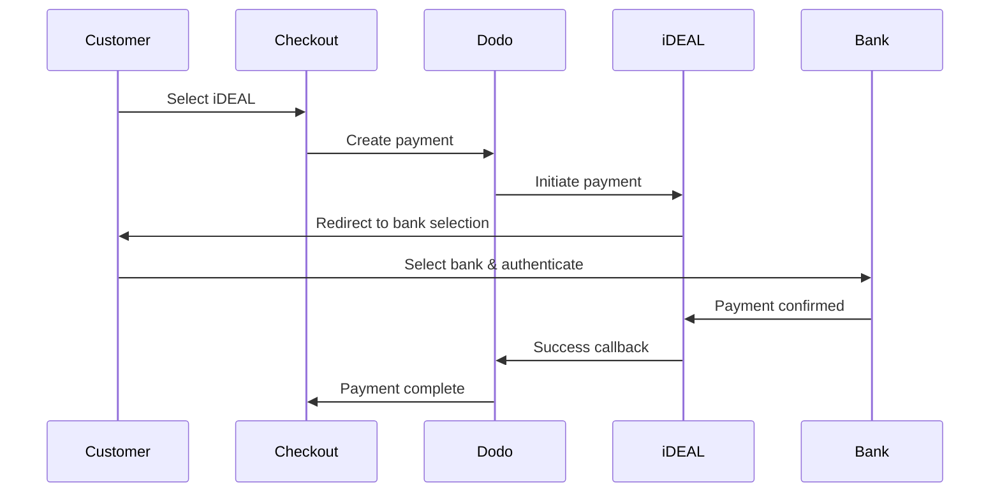
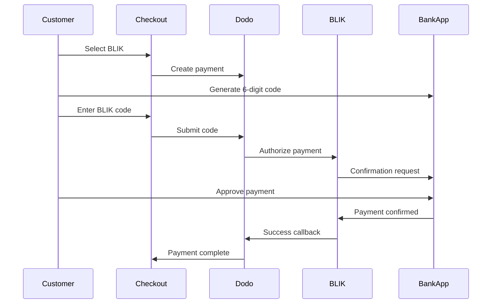

يفضل العملاء الأوروبيون بشدة طرق الدفع المحلية التي تندمج مع أنظمتهم المصرفية. يمكن أن يؤدي تقديم هذه الطرق إلى زيادة معدلات التحويل بنسبة 20-40٪ في الأسواق المستهدفة.

## لماذا طرق الدفع المحلية الأوروبية؟

<CardGroup cols={3}>
<Card title="Higher Conversion" icon="chart-line">
يجذب iDEAL حوالي 60٪ من المدفوعات الإلكترونية في هولندا. عدم تقديمه يعني خسارة العملاء.
</Card>

<Card title="Lower Fraud" icon="shield-check">
تتمتع المدفوعات المصادق عليها من البنك بمعدلات احتيال تكاد تكون صفرًا ولا توجد عمليات رد أموال.
</Card>

<Card title="Real-Time Settlement" icon="bolt">
توفر معظم الطرق الأوروبية تأكيدًا فوريًا للدفع.
</Card>
</CardGroup>

## الطرق المدعومة

| الطريقة | الدولة | الحصة السوقية | العملة | الاشتراكات |
| :----- | :------ | :----------- | :------- | :-----------: |
| **iDEAL** | هولندا | ~60% | EUR | لا |
| **Bancontact** | بلجيكا | ~50% | EUR | لا |
| **EPS** | النمسا | ~30% | EUR | لا |
| **Multibanco** | البرتغال | ~40% | EUR | لا |
| **BLIK** | بولندا | ~60% | PLN | لا |
| **SEPA Direct Debit** | منطقة اليورو | مستخدمة على نطاق واسع | EUR | لا |
| **Satispay** | أوروبا (إيطاليا) | متنامية | EUR | نعم |

## iDEAL (هولندا)

يعد iDEAL طريقة الدفع الإلكترونية المهيمنة في هولندا، ويتصل مباشرة بجميع البنوك الهولندية الكبرى.

### كيف يعمل



### البنوك المدعومة

جميع البنوك الهولندية الكبرى مدعومة:
- ABN AMRO
- ASN Bank
- Bunq
- ING
- Knab
- Rabobank
- RegioBank
- Revolut
- SNS
- Triodos Bank
- Van Lanschot

### الإعداد

```javascript
const session = await client.checkoutSessions.create({
  product_cart: [{ product_id: 'pdt_123', quantity: 1 }],
  allowed_payment_method_types: ['ideal', 'credit', 'debit'],
  billing_currency: 'EUR',
  billing_address: {
    country: 'NL',
    zipcode: '1012JS'
  },
  return_url: 'https://example.com/success'
});
```

## Bancontact (بلجيكا)

Bancontact هو نظام الدفع الوطني في بلجيكا، ويستخدمه تقريبًا جميع البنوك البلجيكية للمدفوعات الإلكترونية.

### الميزات
- يعمل مع بطاقات الخصم البلجيكية الحالية
- دعم تطبيق الهاتف المحمول (Payconiq بواسطة Bancontact)
- تأكيد فوري للدفع
- لا حاجة لتسجيل إضافي للعملاء

### الإعداد

```javascript
const session = await client.checkoutSessions.create({
  product_cart: [{ product_id: 'pdt_123', quantity: 1 }],
  allowed_payment_method_types: ['bancontact_card', 'credit', 'debit'],
  billing_currency: 'EUR',
  billing_address: {
    country: 'BE',
    zipcode: '1000'
  },
  return_url: 'https://example.com/success'
});
```

## EPS (النمسا)

تمكّن EPS (المعيار الإلكتروني للدفع) التحويلات المصرفية المباشرة عبر الإنترنت للعملاء النمساويين.

### الميزات
- التكامل المباشر مع البنوك النمساوية
- تأكيد الدفع في الوقت الحقيقي
- ثقة عالية بين المستهلكين النمساويين
- لا عمليات رد أموال

### البنوك المدعومة

تشمل البنوك النمساوية الكبرى:
- Erste Bank
- Bank Austria
- Raiffeisen
- BAWAG
- Volksbank

### الإعداد

```javascript
const session = await client.checkoutSessions.create({
  product_cart: [{ product_id: 'pdt_123', quantity: 1 }],
  allowed_payment_method_types: ['eps', 'credit', 'debit'],
  billing_currency: 'EUR',
  billing_address: {
    country: 'AT',
    zipcode: '1010'
  },
  return_url: 'https://example.com/success'
});
```

## Multibanco (البرتغال)

Multibanco هو الشبكة المصرفية البينية في البرتغال، ويوفر المدفوعات عبر الإنترنت والمدفوعات عبر أجهزة الصراف الآلي.

### خيارات الدفع

1. **الخدمات المصرفية عبر الإنترنت** — تحويل مصرفي مباشر عبر الخدمات المصرفية الإلكترونية
2. **الدفع عبر أجهزة الصراف الآلي** — يتلقى العميل مرجعًا للدفع في أي جهاز Multibanco
3. **الخدمات المصرفية عبر الهاتف المحمول** — الدفع عبر تطبيقات الهواتف المصرفية

### كيف يعمل الدفع عبر أجهزة الصراف الآلي

بالنسبة لمدفوعات أجهزة الصراف الآلي، يتلقى العملاء مرجع دفع:

```
Entity: 12345
Reference: 123 456 789
Amount: €50.00
Expiry: 24 hours
```

يمكن للعميل الدفع في أي جهاز صراف آلي برتغالي أو عبر الخدمات المصرفية عبر الإنترنت باستخدام هذا المرجع.

### الإعداد

```javascript
const session = await client.checkoutSessions.create({
  product_cart: [{ product_id: 'pdt_123', quantity: 1 }],
  allowed_payment_method_types: ['multibanco', 'credit', 'debit'],
  billing_currency: 'EUR',
  billing_address: {
    country: 'PT',
    zipcode: '1000-001'
  },
  return_url: 'https://example.com/success'
});
```

<Note>
قد تستغرق مدفوعات Multibanco عبر أجهزة الصراف الآلي وقتًا بين إتمام السداد والدفع الفعلي. راقب Webhooks لتأكيد الدفع.
</Note>

## BLIK (بولندا)

BLIK هي أشهر طريقة دفع عبر الهاتف المحمول في بولندا، إذ تتيح للعملاء الدفع باستخدام رمز لمرة واحدة مكوّن من 6 أرقام يتم إنشاؤه في تطبيقهم المصرفي. تتم تسوية BLIK بالعملة **PLN** (الزلوتي البولندي)، وليس EUR.

### كيفية عمله



### التوفر

- **عملة الفوترة:** PLN فقط
- **نوع المعاملة:** دفعات لمرة واحدة فقط (غير متاحة للاشتراكات)
- **التغطية:** جميع البنوك البولندية الكبرى التي تدعم BLIK

### التكوين

```javascript
const session = await client.checkoutSessions.create({
  product_cart: [{ product_id: 'pdt_123', quantity: 1 }],
  allowed_payment_method_types: ['blik', 'credit', 'debit'],
  billing_currency: 'PLN',
  billing_address: {
    country: 'PL',
    zipcode: '00-001'
  },
  return_url: 'https://example.com/success'
});
```

<Note>
تتطلب BLIK عملة فوترة هي **PLN**. إذا كنت تعرض أسعارك بالعملة EUR، فعّل [Adaptive Currency](/features/adaptive-currency) حتى تتم فوترة العملاء البولنديين بالعملة PLN وتصبح BLIK متاحة.
</Note>

## SEPA Direct Debit (منطقة اليورو)

تتيح SEPA Direct Debit للعملاء في جميع أنحاء منطقة اليورو الدفع مباشرةً من حساباتهم المصرفية بدلاً من استخدام البطاقة. وهي متاحة عند إتمام الدفع بالعملة EUR للدفعات لمرة واحدة.

### كيف يعمل

يفوّض العميل الخصم أثناء إتمام الدفع، ثم تُحصّل الدفعة من حسابه المصرفي. وعلى عكس معظم الطرق الأوروبية في هذه الصفحة، لا يكون التأكيد فورياً.

<Warning>
SEPA Direct Debit ليست فورية. يستغرق تأكيد الدفعة **6 أيام عمل**، لذا لا تتعامل مع التفويض على أنه تسوية — لا تُتمم الطلب إلا بعد وصول الدفعة إلى حالة succeeded.
</Warning>

### التوافر

- **عملة الفوترة:** EUR
- **نوع المعاملة:** دفعات لمرة واحدة فقط (غير متاحة للاشتراكات)

### التكوين

```javascript
const session = await client.checkoutSessions.create({
  product_cart: [{ product_id: 'pdt_123', quantity: 1 }],
  allowed_payment_method_types: ['sepa', 'credit', 'debit'],
  billing_currency: 'EUR',
  billing_address: {
    country: 'DE',
    zipcode: '10115'
  },
  return_url: 'https://example.com/success'
});
```

### IBANs للاختبار في SEPA

في وضع الاختبار، أدخل أحد أرقام IBAN أدناه عند إتمام الدفع لفرض نتيجة محددة.

| IBAN للاختبار | السلوك |
| :-------- | :------- |
| `DE89370400440532013000` | تنجح الدفعة. |
| `DE08370400440532013003` | تنجح الدفعة بعد تأخير لا يقل عن ثلاث دقائق. |
| `DE62370400440532013001` | تفشل الدفعة. |
| `DE78370400440532013004` | تفشل الدفعة بعد تأخير لا يقل عن ثلاث دقائق. |
| `DE35370400440532013002` | تنجح الدفعة، ثم يتم الاعتراض عليها فوراً. |
| `DE65370400440002222227` | تفشل الدفعة بسبب عدم كفاية الأموال. |
| `DE18370400440000066666` | لا يمكن استخدام الحساب المصرفي، لذا يتعذر إنشاء طريقة الدفع. |

لاختبار السلوك الخاص بكل دولة، استخدم IBAN النجاح المقابل لدولة أخرى في منطقة اليورو:

| الدولة | IBAN النجاح |
| :------ | :----------- |
| النمسا | `AT611904300234573201` |
| بلجيكا | `BE62510007547061` |
| إستونيا | `EE382200221020145685` |
| فنلندا | `FI2112345600000785` |
| فرنسا | `FR1420041010050500013M02606` |
| أيرلندا | `IE29AIBK93115212345678` |
| لوكسمبورغ | `LU280019400644750000` |

<Note>
تُعد IBANs الاختبار المؤجلة مفيدة للتأكد من أن معالج webhook لديك — وليس إعادة التوجيه من صفحة إتمام الدفع — هو الذي يمنح الوصول، إذ يتم تأكيد دفعات SEPA بعد مغادرة العميل لصفحة إتمام الدفع بوقت طويل.
</Note>

## Satispay (أوروبا)

Satispay هي شبكة دفع أوروبية شائعة عبر الهاتف المحمول، ولا سيما في إيطاليا، وتتيح للعملاء الدفع مباشرةً من تطبيق Satispay دون مشاركة تفاصيل البطاقة أو الحساب المصرفي. تتم تسوية Satispay بالعملة **EUR**.

### الميزات

- دفعات مستندة إلى التطبيق ومستقلة عن شبكات البطاقات
- انتشار واسع في إيطاليا ونمو في أسواق أوروبية أخرى
- دعم الدفعات لمرة واحدة والاشتراكات

### التوافر

- **عملة الفوترة:** EUR
- **نوع المعاملة:** دفعات لمرة واحدة واشتراكات

### التكوين

```javascript
const session = await client.checkoutSessions.create({
  product_cart: [{ product_id: 'pdt_123', quantity: 1 }],
  allowed_payment_method_types: ['satispay', 'credit', 'debit'],
  billing_currency: 'EUR',
  billing_address: {
    country: 'IT',
    zipcode: '00100'
  },
  return_url: 'https://example.com/success'
});
```

## أنواع طرق API

| النوع | الطريقة | الدولة |
| :--- | :----- | :------ |
| `ideal` | iDEAL | هولندا |
| `bancontact_card` | Bancontact | بلجيكا |
| `eps` | EPS | النمسا |
| `multibanco` | Multibanco | البرتغال |
| `blik` | BLIK | بولندا |
| `sepa` | SEPA Direct Debit | منطقة اليورو |
| `satispay` | Satispay | أوروبا (إيطاليا) |

## إتمام الدفع الأوروبي متعدد الدول

بالنسبة إلى الأنشطة التجارية التي تخدم عدة دول أوروبية، أدرج جميع الطرق الإقليمية:

```javascript
const session = await client.checkoutSessions.create({
  product_cart: [{ product_id: 'pdt_123', quantity: 1 }],
  allowed_payment_method_types: [
    'ideal',           // Netherlands
    'bancontact_card', // Belgium
    'eps',             // Austria
    'multibanco',      // Portugal
    'blik',            // Poland (requires PLN billing currency)
    'sepa',            // Eurozone (one-time payments only)
    'satispay',        // Europe / Italy
    'credit',          // Fallback
    'debit'            // Fallback
  ],
  billing_currency: 'EUR',
  return_url: 'https://example.com/success'
});
```

يعرض Dodo تلقائياً الطرق ذات الصلة فقط بناءً على موقع العميل. سيرى العميل الهولندي iDEAL، بينما سيرى العميل البلجيكي Bancontact.

## الاختبار

يمكن اختبار طرق الدفع الأوروبية في Test Mode. يحاكي تدفق الاختبار عملية مصادقة البنك.

<Note>
يتم اختبار SEPA Direct Debit بطريقة مختلفة — فبدلاً من تدفق مصرفي مُحاكى، تُدخل IBAN للاختبار مباشرةً. راجع [IBANs للاختبار في SEPA](#sepa-test-ibans).
</Note>

<Steps>
<Step title="Enable test mode">
استخدم مفاتيح API للاختبار الخاصة بـ Dodo Payments.
</Step>

<Step title="Set appropriate billing address">
اضبط دولة عنوان الفوترة لتطابق طريقة الدفع:
- `NL` لـ iDEAL
- `BE` لـ Bancontact
- `AT` لـ EPS
- `PT` لـ Multibanco
- `PL` لـ BLIK (مع عملة فوترة PLN)
- `IT` لـ Satispay
</Step>

<Step title="Complete the test flow">
اتبع تدفق مصادقة البنك المُحاكى في بيئة الاختبار.
</Step>
</Steps>

## أفضل الممارسات

<AccordionGroup>
<Accordion title="Always include regional methods for target markets">
إذا كنت تبيع للعملاء الهولنديين، فأدرج iDEAL. إن عدم قبولها يشبه عدم قبول Visa في الولايات المتحدة — وستفقد مبيعات كبيرة.
</Accordion>

<Accordion title="Match currency to region">
تتطلب معظم طرق الدفع الأوروبية العملة EUR — احرص على أن يدعم تسعيرك المعاملات باليورو. والاستثناء الوحيد هو BLIK، التي لا تُتاح إلا مع الفوترة بالعملة **PLN** (الزلوتي البولندي).
</Accordion>

<Accordion title="Handle redirects gracefully">
تتضمن جميع الطرق الأوروبية عمليات إعادة توجيه إلى مواقع البنوك. احرص على أن تكون معالجة عنوان العودة لديك قوية وأن تراعي المستخدمين الذين ينسحبون أثناء التدفق.
</Accordion>

<Accordion title="Provide card fallbacks">
لا يمكن لجميع العملاء الأوروبيين الوصول إلى هذه الطرق الإقليمية (السياح والمغتربون وغيرهم). أدرج دائماً `credit` و`debit` كخيارات بديلة.
</Accordion>

<Accordion title="Consider Multibanco timing">
قد تستغرق دفعات أجهزة الصراف الآلي عبر Multibanco ساعات حتى تكتمل. لا تعلّق تنفيذ الطلب على الدفع الفوري — استخدم webhooks للتأكيد غير المتزامن.
</Accordion>
</AccordionGroup>

## استكشاف الأخطاء وإصلاحها

<AccordionGroup>
<Accordion title="European method not appearing">
**تحقق من الآتي:**
1. هل تتطابق دولة فوترة العميل مع دولة الطريقة؟
2. هل العملة مضبوطة على EUR؟
3. هل الطريقة مدرجة في `allowed_payment_method_types`؟

**الحل:** الطرق الأوروبية إقليمية بشكل صارم. لن يرى العميل الذي تحمل دولة فوترته `DE` (ألمانيا) طريقة iDEAL، التي تقتصر على هولندا.
</Accordion>

<Accordion title="Bank authentication failed">
**الأسباب:**
- ألغى العميل العملية أثناء مصادقة البنك
- نظام مصادقة البنك غير متاح مؤقتاً
- أدخل العميل بيانات اعتماد غير صحيحة

**الحل:** ينبغي للعميل إعادة المحاولة. وإذا استمرت المشكلة، اقترح تجربة طريقة دفع مختلفة.
</Accordion>

<Accordion title="Redirect not completing">
**الأسباب:**
- أغلق العميل المتصفح أثناء إعادة التوجيه إلى البنك
- مشكلات في الشبكة أثناء المصادقة
- تم تكوين عنوان العودة بشكل غير صحيح

**الحل:** تحقق من صحة عنوان العودة وإمكانية الوصول إليه. وتأكد من أنه يعالج حالات النجاح والفشل معاً.
</Accordion>

<Accordion title="Multibanco payment pending">
**السبب:** تلقى العميل مرجع الدفع لكنه لم يدفع بعد.

**الحل:** هذا متوقع بالنسبة إلى الدفعات المستندة إلى أجهزة الصراف الآلي. انتظر تأكيد webhook. تنتهي صلاحية المرجع عادةً خلال 24 إلى 72 ساعة.
</Accordion>
</AccordionGroup>

## الامتثال لـ PSD2

تتوافق جميع طرق الدفع الأوروبية مع لوائح PSD2 (توجيه خدمات الدفع 2):

- **مصادقة العميل القوية (SCA)** — مدمجة في تدفق مصادقة البنك
- **الاتصال الآمن** — تُنقل جميع البيانات عبر قنوات آمنة
- **حماية المستهلك** — امتثال كامل لحقوق المستهلك في الاتحاد الأوروبي

## الصفحات ذات الصلة

<CardGroup cols={2}>
<Card title="Payment Methods Overview" icon="credit-card" href="/features/payment-methods">
اطّلع على جميع طرق الدفع المدعومة.
</Card>

<Card title="Adaptive Currency" icon="globe" href="/features/adaptive-currency">
دعم العملات والتحويل التلقائي.
</Card>

<Card title="Checkout Guide" icon="book" href="/developer-resources/checkout-session">
دليل التنفيذ الكامل لإتمام الدفع.
</Card>

<Card title="Webhooks" icon="webhook" href="/developer-resources/webhooks">
تعامل مع تأكيدات الدفع بشكل غير متزامن.
</Card>
</CardGroup>