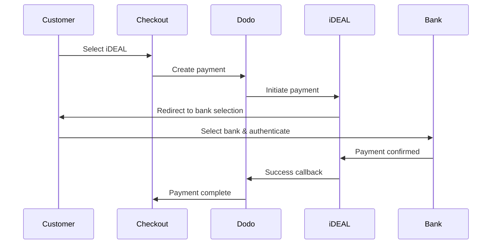

يفضل العملاء الأوروبيون بشدة طرق الدفع المحلية التي تتكامل مع أنظمتهم المصرفية. يمكن أن يزيد تقديم هذه الطرق من معدلات التحويل بنسبة 20-40٪ في الأسواق المستهدفة.

## لماذا طرق الدفع الأوروبية المحلية؟

<CardGroup cols={3}>
<Card title="معدل تحويل أعلى" icon="chart-line">
iDEAL تسجّل حوالي 60% من المدفوعات عبر الإنترنت في هولندا. عدم تقديمها يعني فقدان العملاء.
</Card>

<Card title="احتيال أقل" icon="shield-check">
المدفوعات المعتمدة من البنوك لديها معدلات احتيال قريبة من الصفر ولا توجد استردادات.
</Card>

<Card title="تسوية في الوقت الحقيقي" icon="bolt">
توفر معظم الطرق الأوروبية تأكيد الدفع الفوري.
</Card>
</CardGroup>

## الطرق المدعومة

| الطريقة | البلد | حصة السوق | العملة | الاشتراكات |
| :----- | :------ | :----------- | :------- | :-----------: |
| **iDEAL** | هولندا | ~60% | يورو | لا |
| **Bancontact** | بلجيكا | ~50% | يورو | لا |
| **EPS** | النمسا | ~30% | يورو | لا |
| **Multibanco** | البرتغال | ~40% | يورو | لا |

## iDEAL (هولندا)

iDEAL هي الطريقة الرئيسية للدفع عبر الإنترنت في هولندا، وتتصل مباشرة بجميع البنوك الهولندية الرئيسية.

### كيف تعمل؟



### البنوك المدعومة

تدعم جميع البنوك الهولندية الرئيسية:
- ABN AMRO
- ASN Bank
- Bunq
- ING
- Knab
- Rabobank
- RegioBank
- Revolut
- SNS
- Triodos Bank
- Van Lanschot

### التكوين

```javascript
const session = await client.checkoutSessions.create({
  product_cart: [{ product_id: 'prod_123', quantity: 1 }],
  allowed_payment_method_types: ['ideal', 'credit', 'debit'],
  billing_currency: 'EUR',
  billing_address: {
    country: 'NL',
    zipcode: '1012JS'
  },
  return_url: 'https://example.com/success'
});
```

## Bancontact (بلجيكا)

Bancontact هو نظام الدفع الوطني في بلجيكا، الذي تستخدمه جميع البنوك البلجيكية تقريبًا للدفع عبر الإنترنت.

### الميزات
- يعمل مع بطاقات الخصم البلجيكية الحالية
- دعم التطبيقات المحمولة (Payconiq من Bancontact)
- تأكيد الدفع الفوري
- لا حاجة للتسجيل الإضافي للعملاء

### التكوين

```javascript
const session = await client.checkoutSessions.create({
  product_cart: [{ product_id: 'prod_123', quantity: 1 }],
  allowed_payment_method_types: ['bancontact_card', 'credit', 'debit'],
  billing_currency: 'EUR',
  billing_address: {
    country: 'BE',
    zipcode: '1000'
  },
  return_url: 'https://example.com/success'
});
```

## EPS (النمسا)

EPS (المعيار الإلكتروني للدفع) يتيح تحويلات بنكية مباشرة عبر الإنترنت للعملاء النمساويين.

### الميزات
- تكامل مباشر مع البنوك النمساوية
- تأكيد الدفع في الوقت الحقيقي
- ثقة عالية بين المستهلكين النمساويين
- لا استردادات

### البنوك المدعومة

تتضمن البنوك النمساوية الرئيسية:
- Erste Bank
- Bank Austria
- Raiffeisen
- BAWAG
- Volksbank

### التكوين

```javascript
const session = await client.checkoutSessions.create({
  product_cart: [{ product_id: 'prod_123', quantity: 1 }],
  allowed_payment_method_types: ['eps', 'credit', 'debit'],
  billing_currency: 'EUR',
  billing_address: {
    country: 'AT',
    zipcode: '1010'
  },
  return_url: 'https://example.com/success'
});
```

## Multibanco (البرتغال)

Multibanco هو الشبكة المصرفية في البرتغال، التي تقدم خدمات الدفع عبر الإنترنت وكذلك الدفع عبر أجهزة الصراف الآلي.

### خيارات الدفع

1. **المصرفية عبر الإنترنت** — تحويل بنكي مباشر عبر المصرفية عبر الإنترنت
2. **دفع عبر أجهزة الصراف الآلي** — يتلقى العميل مرجعًا للدفع في أي جهاز صراف آلي Multibanco
3. **المصرفية المحمولة** — الدفع عبر تطبيقات البنوك المحمولة

### كيف يعمل دفع أجهزة الصراف الآلي؟

بالنسبة لمدفوعات أجهزة الصراف الآلي، يتلقى العملاء مرجع دفع:

```
Entity: 12345
Reference: 123 456 789
Amount: €50.00
Expiry: 24 hours
```

يمكن للعميل الدفع في أي جهاز صراف آلي برتغالي أو عبر المصرفية عبر الإنترنت باستخدام هذا المرجع.

### التكوين

```javascript
const session = await client.checkoutSessions.create({
  product_cart: [{ product_id: 'prod_123', quantity: 1 }],
  allowed_payment_method_types: ['multibanco', 'credit', 'debit'],
  billing_currency: 'EUR',
  billing_address: {
    country: 'PT',
    zipcode: '1000-001'
  },
  return_url: 'https://example.com/success'
});
```

<Note>
قد تستغرق مدفوعات أجهزة صراف Multibanco بعض الوقت بين الخروج والدفع الفعلي. راقب webhooks لتأكيد الدفع.
</Note>

## أنواع طرق API

| النوع | الطريقة | البلد |
| :--- | :----- | :------ |
| `ideal` | iDEAL | هولندا |
| `bancontact_card` | Bancontact | بلجيكا |
| `eps` | EPS | النمسا |
| `multibanco` | Multibanco | البرتغال |

## الخروج متعدد البلدان الأوروبية

بالنسبة للأعمال التي تخدم عدة دول أوروبية، يجب تضمين جميع الطرق الإقليمية:

```javascript
const session = await client.checkoutSessions.create({
  product_cart: [{ product_id: 'prod_123', quantity: 1 }],
  allowed_payment_method_types: [
    'ideal',           // Netherlands
    'bancontact_card', // Belgium
    'eps',             // Austria
    'multibanco',      // Portugal
    'credit',          // Fallback
    'debit'            // Fallback
  ],
  billing_currency: 'EUR',
  return_url: 'https://example.com/success'
});
```

Dodo تظهر تلقائيًا الطرق ذات الصلة بناءً على موقع العميل. سيرى العميل الهولندي iDEAL؛ بينما سيرى العميل البلجيكي Bancontact.

## الاختبار

يمكن اختبار طرق الدفع الأوروبية في وضع Sandbox. تحاكي تدفق الاختبار عملية المصادقة البنكية.

<Steps>
<Step title="تفعيل وضع الاختبار">
استخدم مفاتيح API للاختبار من Dodo Payments.
</Step>

<Step title="تعيين عنوان الفوترة المناسب">
قم بتعيين دولة عنوان الفوترة لمطابقة طريقة الدفع:
- `NL` لـ iDEAL
- `BE` لـ Bancontact
- `AT` لـ EPS
- `PT` لـ Multibanco
</Step>

<Step title="إكمال تدفق الاختبار">
اتبع تدفق المصادقة البنكية المحاكية في بيئة الاختبار.
</Step>
</Steps>

## أفضل الممارسات

<AccordionGroup>
<Accordion title="تضمين الطرق الإقليمية دائمًا للأسواق المستهدفة">
إذا كنت تبيع للعملاء الهولنديين، يجب تضمين iDEAL. عدم القيام بذلك سيكون كعدم قبول Visa في الولايات المتحدة — ستفقد مبيعات كبيرة.
</Accordion>

<Accordion title="توافق العملة مع المنطقة">
تتطلب طرق الدفع الأوروبية اليورو. تأكد من أن تسعيرك يدعم معاملات اليورو.
</Accordion>

<Accordion title="تعامل مع التحويلات بشكل سلس">
تتضمن جميع الطرق الأوروبية تحويلات إلى مواقع البنوك. تأكد من أن معالجة URL العائد لديك قوية وتأخذ بعين الاعتبار المستخدمين الذين يتخلون عن العملية وسط تدفقها.
</Accordion>

<Accordion title="توفير بدائل للبطاقات">
ليس جميع العملاء الأوروبيين لديهم حق الوصول إلى هذه الطرق الإقليمية (السياح، المغتربين، إلخ). احتفظ دائمًا بـ `credit` و`debit` كبدائل.
</Accordion>

<Accordion title="مراعاة توقيت Multibanco">
قد تستغرق مدفوعات أجهزة صراف Multibanco ساعات لإكمالها. لا تجعل بدأت التنفيذ تعتمد على الدفع الفوري — استخدم webhooks لتأكيد غير متزامن.
</Accordion>
</AccordionGroup>

## استكشاف الأخطاء وإصلاحها

<AccordionGroup>
<Accordion title="طريقة أوروبية غير ظاهرة">
**تحقق:**
1. هل يتطابق بلد الفوترة للعميل مع بلد الطريقة؟
2. هل العملة مضبوطة على اليورو؟
3. هل الطريقة مدرجة في `allowed_payment_method_types`؟

**الحل:** طرق الدفع الأوروبية صارمة إقليميًا. لن يرى عميل من بلد فوترة `DE` (ألمانيا) iDEAL، الذي هو خاص بهولندا فقط.
</Accordion>

<Accordion title="فشلت المصادقة البنكية">
**الأسباب:**
- ألغي العميل العملية أثناء المصادقة البنكية
- نظام المصادقة البنكية غير متوفر مؤقتًا
- أدخل العميل بيانات اعتماد غير صحيحة

**الحل:** يجب على العميل المحاولة مرة أخرى. إذا استمرت المشكلة، اقترح تجربة طريقة دفع مختلفة.
</Accordion>

<Accordion title="التحويل غير مكتمل">
**الأسباب:**
- أغلق العميل المتصفح أثناء التحويل البنكي
- مشاكل في الشبكة أثناء المصادقة
- تكوين URL العائد خاطئ

**الحل:** تحقق من أن URL العائد صحيح وقابل للوصول. تأكد من أنه يعالج حالتي النجاح والفشل.
</Accordion>

<Accordion title="مدفوعات Multibanco معلقة">
**السبب:** تسلم العميل مرجع الدفع ولكنه لم يقم بالدفع بعد.

**الحل:** هذا متوقع بالنسبة لمدفوعات أجهزة الصراف الآلي. انتظر تأكيد webhook. عادة ما تنتهي صلاحية المرجع خلال 24-72 ساعة.
</Accordion>
</AccordionGroup>

## الامتثال لـ PSD2

تتوافق جميع طرق الدفع الأوروبية مع لوائح PSD2 (توجيه خدمات الدفع 2):

- **المصادقة القوية للعملاء (SCA)** — مضمنة في تدفق المصادقة البنكية
- **التواصل الآمن** — يتم نقل جميع البيانات عبر قنوات آمنة
- **حماية المستهلك** — الامتثال الكامل لحقوق المستهلك في الاتحاد الأوروبي

## الصفحات ذات الصلة

<CardGroup cols={2}>
<Card title="نظرة عامة على طرق الدفع" icon="credit-card" href="/features/payment-methods">
اطلع على جميع طرق الدفع المدعومة.
</Card>

<Card title="العملة التكيفية" icon="globe" href="/features/adaptive-currency">
دعم العملة والتحويل التلقائي.
</Card>

<Card title="دليل الخروج" icon="book" href="/developer-resources/checkout-session">
دليل كامل لتنفيذ الخروج.
</Card>

<Card title="Webhooks" icon="webhook" href="/developer-resources/webhooks">
تعامل مع تأكيدات الدفع بشكل غير متزامن.
</Card>
</CardGroup>