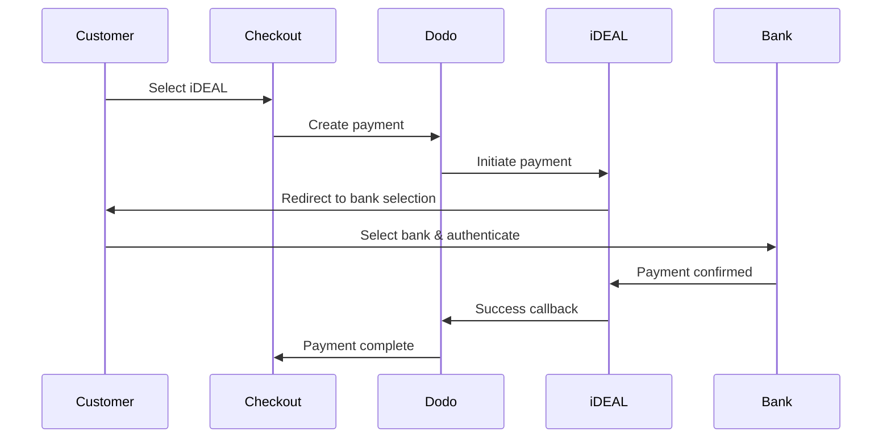
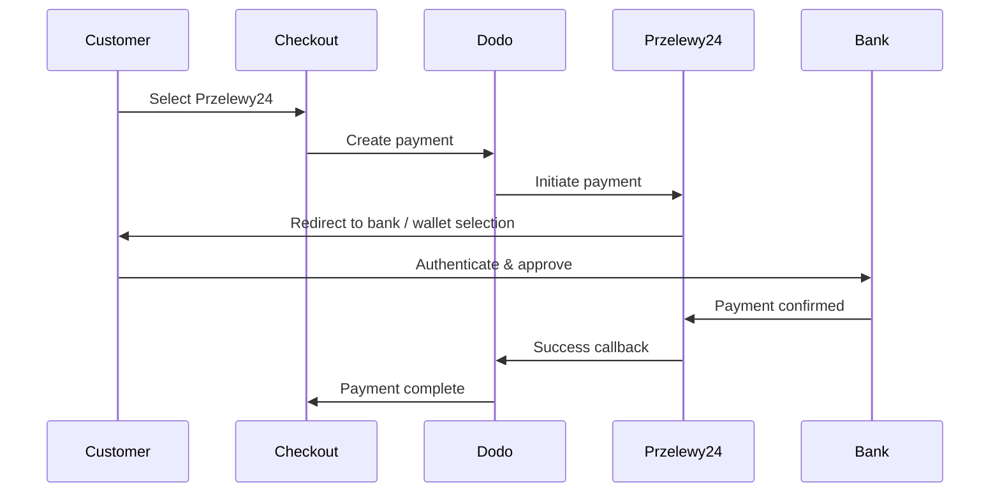
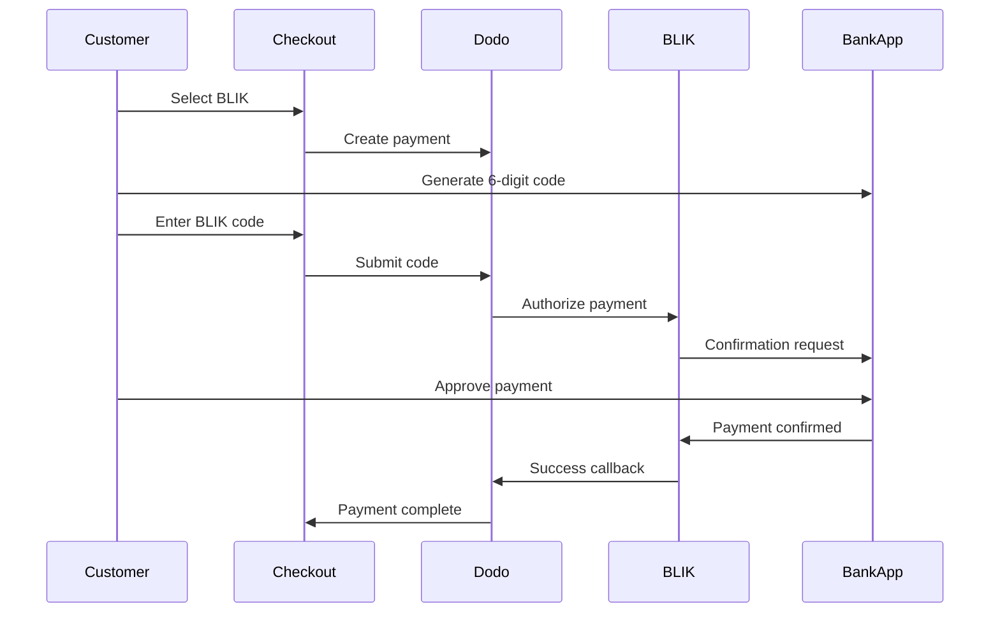

يفضل العملاء الأوروبيون بشدة طرق الدفع المحلية التي تندمج مع أنظمتهم المصرفية. يمكن أن يؤدي تقديم هذه الطرق إلى زيادة معدلات التحويل بنسبة 20-40٪ في الأسواق المستهدفة.

## لماذا طرق الدفع المحلية الأوروبية؟

<CardGroup cols={3}>
<Card title="Higher Conversion" icon="chart-line">
يجذب iDEAL حوالي 60٪ من المدفوعات الإلكترونية في هولندا. عدم تقديمه يعني خسارة العملاء.
</Card>

<Card title="Lower Fraud" icon="shield-check">
تتمتع المدفوعات المصادق عليها من البنك بمعدلات احتيال تكاد تكون صفرًا ولا توجد عمليات رد أموال.
</Card>

<Card title="Real-Time Settlement" icon="bolt">
توفر معظم الطرق الأوروبية تأكيدًا فوريًا للدفع.
</Card>
</CardGroup>

## الطرق المدعومة

| Method | Country | Market Share | Currency | Subscriptions |
| :----- | :------ | :----------- | :------- | :-----------: |
| **iDEAL** | هولندا | ~60% | EUR | No |
| **Bancontact** | بلجيكا | ~50% | EUR | No |
| **EPS** | النمسا | ~30% | EUR | No |
| **Multibanco** | البرتغال | ~40% | EUR | No |
| **Przelewy24 (P24)** | بولندا | ~30% | PLN | No |
| **BLIK** | بولندا | ~60% | PLN | No |
| **SEPA Direct Debit** | منطقة اليورو | مستخدم على نطاق واسع | EUR | No |
| **Satispay** | أوروبا (إيطاليا) | متنامٍ | EUR | Yes |

## iDEAL (هولندا)

يعد iDEAL طريقة الدفع الإلكترونية المهيمنة في هولندا، ويتصل مباشرة بجميع البنوك الهولندية الكبرى.

### كيف يعمل



### البنوك المدعومة

جميع البنوك الهولندية الكبرى مدعومة:
- ABN AMRO
- ASN Bank
- Bunq
- ING
- Knab
- Rabobank
- RegioBank
- Revolut
- SNS
- Triodos Bank
- Van Lanschot

### الإعداد

```javascript
const session = await client.checkoutSessions.create({
  product_cart: [{ product_id: 'prod_123', quantity: 1 }],
  allowed_payment_method_types: ['ideal', 'credit', 'debit'],
  billing_currency: 'EUR',
  billing_address: {
    country: 'NL',
    zipcode: '1012JS'
  },
  return_url: 'https://example.com/success'
});
```

## Bancontact (بلجيكا)

Bancontact هو نظام الدفع الوطني في بلجيكا، ويستخدمه تقريبًا جميع البنوك البلجيكية للمدفوعات الإلكترونية.

### الميزات
- يعمل مع بطاقات الخصم البلجيكية الحالية
- دعم تطبيق الهاتف المحمول (Payconiq بواسطة Bancontact)
- تأكيد فوري للدفع
- لا حاجة لتسجيل إضافي للعملاء

### الإعداد

```javascript
const session = await client.checkoutSessions.create({
  product_cart: [{ product_id: 'prod_123', quantity: 1 }],
  allowed_payment_method_types: ['bancontact_card', 'credit', 'debit'],
  billing_currency: 'EUR',
  billing_address: {
    country: 'BE',
    zipcode: '1000'
  },
  return_url: 'https://example.com/success'
});
```

## EPS (النمسا)

تمكّن EPS (المعيار الإلكتروني للدفع) التحويلات المصرفية المباشرة عبر الإنترنت للعملاء النمساويين.

### الميزات
- التكامل المباشر مع البنوك النمساوية
- تأكيد الدفع في الوقت الحقيقي
- ثقة عالية بين المستهلكين النمساويين
- لا عمليات رد أموال

### البنوك المدعومة

تشمل البنوك النمساوية الكبرى:
- Erste Bank
- Bank Austria
- Raiffeisen
- BAWAG
- Volksbank

### الإعداد

```javascript
const session = await client.checkoutSessions.create({
  product_cart: [{ product_id: 'prod_123', quantity: 1 }],
  allowed_payment_method_types: ['eps', 'credit', 'debit'],
  billing_currency: 'EUR',
  billing_address: {
    country: 'AT',
    zipcode: '1010'
  },
  return_url: 'https://example.com/success'
});
```

## Multibanco (البرتغال)

Multibanco هو الشبكة المصرفية البينية في البرتغال، ويوفر المدفوعات عبر الإنترنت والمدفوعات عبر أجهزة الصراف الآلي.

### خيارات الدفع

1. **الخدمات المصرفية عبر الإنترنت** — تحويل مصرفي مباشر عبر الخدمات المصرفية الإلكترونية
2. **الدفع عبر أجهزة الصراف الآلي** — يتلقى العميل مرجعًا للدفع في أي جهاز Multibanco
3. **الخدمات المصرفية عبر الهاتف المحمول** — الدفع عبر تطبيقات الهواتف المصرفية

### كيف يعمل الدفع عبر أجهزة الصراف الآلي

بالنسبة لمدفوعات أجهزة الصراف الآلي، يتلقى العملاء مرجع دفع:

```
Entity: 12345
Reference: 123 456 789
Amount: €50.00
Expiry: 24 hours
```

يمكن للعميل الدفع في أي جهاز صراف آلي برتغالي أو عبر الخدمات المصرفية عبر الإنترنت باستخدام هذا المرجع.

### الإعداد

```javascript
const session = await client.checkoutSessions.create({
  product_cart: [{ product_id: 'prod_123', quantity: 1 }],
  allowed_payment_method_types: ['multibanco', 'credit', 'debit'],
  billing_currency: 'EUR',
  billing_address: {
    country: 'PT',
    zipcode: '1000-001'
  },
  return_url: 'https://example.com/success'
});
```

<Note>
قد تستغرق مدفوعات Multibanco عبر أجهزة الصراف الآلي وقتًا بين إتمام السداد والدفع الفعلي. راقب Webhooks لتأكيد الدفع.
</Note>

## Przelewy24 (بولندا)

Przelewy24 (P24) هو الرائد في طرق الدفع عبر الإنترنت في بولندا، ويجمع بين التحويلات البنكية والمحافظ المحلية عبر جميع البنوك البولندية الكبرى. على عكس الطرق الأوروبية الأخرى، يتم التسوية بعملة **PLN** (زلوتي بولندي)، وليس اليورو.

### كيفية عمله



### التوفر

- **عملة الفوترة:** PLN فقط
- **نوع المعاملة:** الدفعات لمرة واحدة فقط (غير متاحة للاشتراكات)
- **التغطية:** جميع البنوك البولندية الكبرى بالإضافة إلى المحافظ المحلية الشهيرة

### التكوين

```javascript
const session = await client.checkoutSessions.create({
  product_cart: [{ product_id: 'prod_123', quantity: 1 }],
  allowed_payment_method_types: ['przelewy24', 'credit', 'debit'],
  billing_currency: 'PLN',
  billing_address: {
    country: 'PL',
    zipcode: '00-001'
  },
  return_url: 'https://example.com/success'
});
```

<Note>
يتطلب Przelewy24 عملة فوترة **PLN**. إذا كنت تحدد أسعارك باليورو، فعّل [العملة التكيفية](/features/adaptive-currency) لتُحتَسَب بالفاتورة بعملة PLN وتصبح Przelewy24 متاحة.
</Note>

## BLIK (بولندا)

BLIK هو الطريقة الأكثر شيوعًا للدفع عبر الهاتف المحمول في بولندا، مما يسمح للعملاء بالدفع باستخدام كود مكون من 6 أرقام يتم إنشاؤه في تطبيقهم المصرفي. مثل Przelewy24، يتم تسوية BLIK بالـ **PLN** (الزلوتي البولندي)، وليس بالـ EUR.

### كيف يعمل



### التوفر

- **عملة الفوترة:** PLN فقط
- **نوع المعاملة:** مدفوعات لمرة واحدة فقط (غير متاحة للاشتراكات)
- **التغطية:** جميع البنوك البولندية الكبرى التي تدعم BLIK

### التكوين

```javascript
const session = await client.checkoutSessions.create({
  product_cart: [{ product_id: 'prod_123', quantity: 1 }],
  allowed_payment_method_types: ['blik', 'credit', 'debit'],
  billing_currency: 'PLN',
  billing_address: {
    country: 'PL',
    zipcode: '00-001'
  },
  return_url: 'https://example.com/success'
});
```

<Note>
BLIK يتطلب عملة فوترة **PLN**. إذا كنت تعرض أسعارك بالـ EUR، فقم بتمكين [العملة التكيفية](/features/adaptive-currency) لتسديد الفواتير بالـ PLN لعملاء بولندا وإتاحة BLIK.
</Note>

## SEPA Direct Debit (منطقة اليورو)

يتيح SEPA Direct Debit للعملاء في جميع أنحاء منطقة اليورو الدفع مباشرةً من حساباتهم المصرفية بدلاً من استخدام البطاقة. ويتوفر في عمليات checkout بعملة EUR للمدفوعات لمرة واحدة.

### آلية العمل

يفوّض العميل عملية الخصم المباشر أثناء checkout، ثم يتم تحصيل الدفعة من حسابه المصرفي. وعلى خلاف معظم الطرق الأوروبية في هذه الصفحة، لا يكون التأكيد فورياً.

<Warning>
SEPA Direct Debit ليس فورياً. يستغرق تأكيد الدفعة **6 أيام عمل**، لذا لا تعتبر التفويض بمثابة تسوية — نفّذ الطلب فقط بعد وصول الدفعة إلى حالة succeeded.
</Warning>

### التوفّر

- **عملة الفوترة:** EUR
- **نوع المعاملة:** المدفوعات لمرة واحدة فقط (غير متاح للاشتراكات)

### الإعداد

```javascript
const session = await client.checkoutSessions.create({
  product_cart: [{ product_id: 'prod_123', quantity: 1 }],
  allowed_payment_method_types: ['sepa', 'credit', 'debit'],
  billing_currency: 'EUR',
  billing_address: {
    country: 'DE',
    zipcode: '10115'
  },
  return_url: 'https://example.com/success'
});
```

## Satispay (أوروبا)

Satispay هي شبكة مدفوعات محمولة أوروبية شائعة، ولا سيما في إيطاليا، وتتيح للعملاء الدفع مباشرةً من تطبيق Satispay الخاص بهم من دون مشاركة بيانات البطاقة أو الحساب المصرفي. تتم تسوية Satispay بعملة **EUR**.

### الميزات

- مدفوعات تعتمد على التطبيق ومستقلة عن شبكات البطاقات
- انتشار واسع في إيطاليا ونمو في أسواق أوروبية أخرى
- تدعم المدفوعات لمرة واحدة والاشتراكات

### التوفّر

- **عملة الفوترة:** EUR
- **نوع المعاملة:** المدفوعات لمرة واحدة والاشتراكات

### الإعداد

```javascript
const session = await client.checkoutSessions.create({
  product_cart: [{ product_id: 'prod_123', quantity: 1 }],
  allowed_payment_method_types: ['satispay', 'credit', 'debit'],
  billing_currency: 'EUR',
  billing_address: {
    country: 'IT',
    zipcode: '00100'
  },
  return_url: 'https://example.com/success'
});
```

## أنواع طرق API

| Type | Method | Country |
| :--- | :----- | :------ |
| `ideal` | iDEAL | هولندا |
| `bancontact_card` | Bancontact | بلجيكا |
| `eps` | EPS | النمسا |
| `multibanco` | Multibanco | البرتغال |
| `przelewy24` | Przelewy24 (P24) | بولندا |
| `blik` | BLIK | بولندا |
| `sepa` | SEPA Direct Debit | منطقة اليورو |
| `satispay` | Satispay | أوروبا (إيطاليا) |

## Checkout أوروبي متعدد البلدان

بالنسبة إلى الشركات التي تخدم عدة بلدان أوروبية، أدرج جميع الطرق الإقليمية:

```javascript
const session = await client.checkoutSessions.create({
  product_cart: [{ product_id: 'prod_123', quantity: 1 }],
  allowed_payment_method_types: [
    'ideal',           // Netherlands
    'bancontact_card', // Belgium
    'eps',             // Austria
    'multibanco',      // Portugal
    'przelewy24',      // Poland (requires PLN billing currency)
    'blik',            // Poland (requires PLN billing currency)
    'sepa',            // Eurozone (one-time payments only)
    'satispay',        // Europe / Italy
    'credit',          // Fallback
    'debit'            // Fallback
  ],
  billing_currency: 'EUR',
  return_url: 'https://example.com/success'
});
```

يعرض Dodo تلقائياً الطرق ذات الصلة فقط بناءً على موقع العميل. سيرى العميل الهولندي iDEAL، بينما سيرى العميل البلجيكي Bancontact.

## الاختبار

يمكن اختبار طرق الدفع الأوروبية في وضع sandbox. يحاكي مسار الاختبار عملية مصادقة البنك.

<Steps>
<Step title="Enable test mode">
استخدم مفاتيح API للاختبار الخاصة بك في Dodo Payments.
</Step>

<Step title="Set appropriate billing address">
عيّن بلد عنوان الفوترة ليتطابق مع طريقة الدفع:
- `NL` لـ iDEAL
- `BE` لـ Bancontact
- `AT` لـ EPS
- `PT` لـ Multibanco
- `PL` لـ Przelewy24 وBLIK (مع عملة فوترة PLN)
- `IT` لـ Satispay
</Step>

<Step title="Complete the test flow">
اتبع مسار مصادقة البنك المُحاكى في بيئة الاختبار.
</Step>
</Steps>

## أفضل الممارسات

<AccordionGroup>
<Accordion title="Always include regional methods for target markets">
إذا كنت تبيع للعملاء الهولنديين، فأدرج iDEAL. إن عدم القيام بذلك يشبه عدم قبول Visa في الولايات المتحدة — ستخسر مبيعات كبيرة.
</Accordion>

<Accordion title="Match currency to region">
تتطلب معظم طرق الدفع الأوروبية عملة EUR — تأكد من أن نظام التسعير لديك يدعم معاملات اليورو. والاستثناء الوحيد هو Przelewy24، الذي يتوفر فقط بعملة الفوترة **PLN** (الزلوتي البولندي).
</Accordion>

<Accordion title="Handle redirects gracefully">
تتضمن جميع الطرق الأوروبية عمليات إعادة توجيه إلى مواقع البنوك. تأكد من أن معالجة return URL لديك قوية وتأخذ في الحسبان المستخدمين الذين يتركون العملية في منتصفها.
</Accordion>

<Accordion title="Provide card fallbacks">
لا يستطيع جميع العملاء الأوروبيين الوصول إلى هذه الطرق الإقليمية (السياح والمغتربون وغيرهم). احرص دائماً على تضمين `credit` و`debit` كخيارات بديلة.
</Accordion>

<Accordion title="Consider Multibanco timing">
قد تستغرق مدفوعات أجهزة الصراف الآلي عبر Multibanco ساعات حتى تكتمل. لا تحظر تنفيذ الطلب بانتظار الدفع الفوري — استخدم webhooks للتأكيد غير المتزامن.
</Accordion>
</AccordionGroup>

## استكشاف الأخطاء وإصلاحها

<AccordionGroup>
<Accordion title="European method not appearing">
**تحقق من:**
1. هل يطابق بلد فوترة العميل بلد الطريقة؟
2. هل العملة معيّنة على EUR؟
3. هل الطريقة مضمنة في `allowed_payment_method_types`؟

**الحل:** الطرق الأوروبية إقليمية بشكل صارم. لن يرى العميل الذي يحمل بلد الفوترة `DE` (ألمانيا) طريقة iDEAL، التي تقتصر على هولندا.
</Accordion>

<Accordion title="Bank authentication failed">
**الأسباب:**
- ألغى العميل العملية أثناء مصادقة البنك
- نظام مصادقة البنك غير متاح مؤقتاً
- أدخل العميل بيانات اعتماد غير صحيحة

**الحل:** ينبغي أن يعيد العميل المحاولة. وإذا استمرت المشكلة، اقترح تجربة طريقة دفع مختلفة.
</Accordion>

<Accordion title="Redirect not completing">
**الأسباب:**
- أغلق العميل المتصفح أثناء إعادة توجيهه إلى البنك
- مشكلات في الشبكة أثناء المصادقة
- تم إعداد return URL بشكل غير صحيح

**الحل:** تحقّق من صحة return URL وإمكانية الوصول إليه. تأكد من أنه يعالج حالتي النجاح والفشل.
</Accordion>

<Accordion title="Multibanco payment pending">
**السبب:** تلقى العميل مرجع الدفع لكنه لم يدفع بعد.

**الحل:** هذا متوقع في المدفوعات المعتمدة على أجهزة الصراف الآلي. انتظر تأكيد webhook. تنتهي صلاحية المرجع عادةً خلال 24-72 ساعة.
</Accordion>
</AccordionGroup>

## الامتثال لمعيار PSD2

تتوافق جميع طرق الدفع الأوروبية مع لوائح PSD2 (توجيه خدمات الدفع 2):

- **مصادقة العميل القوية (SCA)** — مضمّنة في مسار مصادقة البنك
- **الاتصال الآمن** — تُنقل جميع البيانات عبر قنوات آمنة
- **حماية المستهلك** — امتثال كامل لحقوق المستهلك في الاتحاد الأوروبي

## الصفحات ذات الصلة

<CardGroup cols={2}>
<Card title="Payment Methods Overview" icon="credit-card" href="/features/payment-methods">
اطّلع على جميع طرق الدفع المدعومة.
</Card>

<Card title="Adaptive Currency" icon="globe" href="/features/adaptive-currency">
دعم العملات والتحويل التلقائي.
</Card>

<Card title="Checkout Guide" icon="book" href="/developer-resources/checkout-session">
دليل التنفيذ الكامل لعملية checkout.
</Card>

<Card title="Webhooks" icon="webhook" href="/developer-resources/webhooks">
عالج تأكيدات الدفع بشكل غير متزامن.
</Card>
</CardGroup>