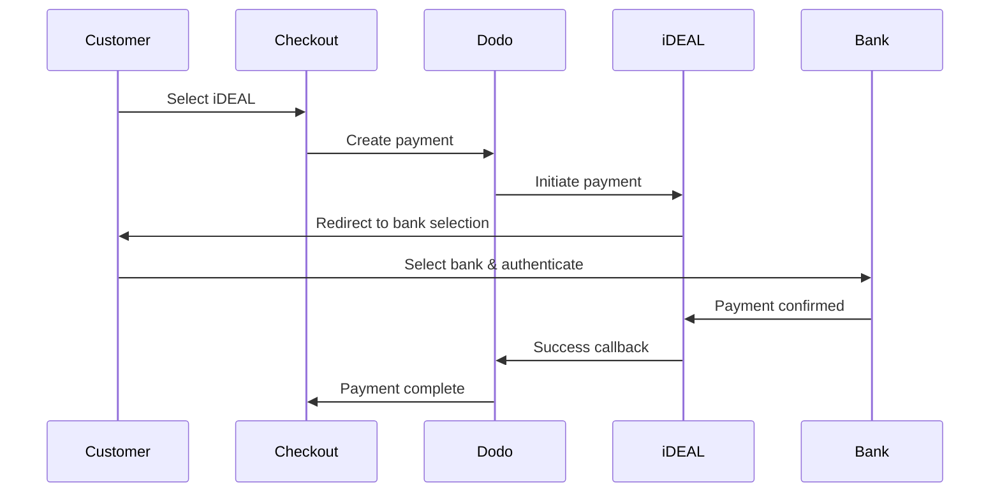
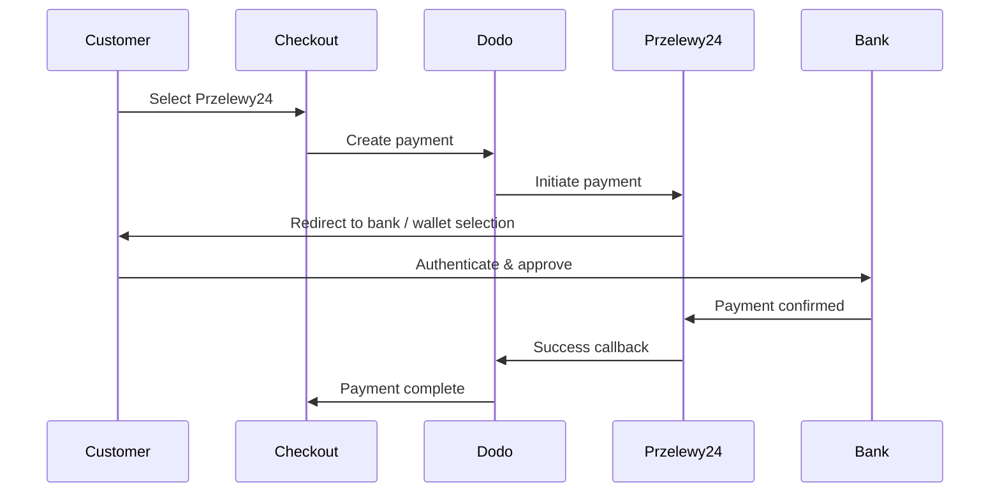

يفضل العملاء الأوروبيون بشدة طرق الدفع المحلية التي تندمج مع أنظمتهم المصرفية. يمكن أن يؤدي تقديم هذه الطرق إلى زيادة معدلات التحويل بنسبة 20-40٪ في الأسواق المستهدفة.

## لماذا طرق الدفع المحلية الأوروبية؟

<CardGroup cols={3}>
<Card title="Higher Conversion" icon="chart-line">
يجذب iDEAL حوالي 60٪ من المدفوعات الإلكترونية في هولندا. عدم تقديمه يعني خسارة العملاء.
</Card>

<Card title="Lower Fraud" icon="shield-check">
تتمتع المدفوعات المصادق عليها من البنك بمعدلات احتيال تكاد تكون صفرًا ولا توجد عمليات رد أموال.
</Card>

<Card title="Real-Time Settlement" icon="bolt">
توفر معظم الطرق الأوروبية تأكيدًا فوريًا للدفع.
</Card>
</CardGroup>

## الطرق المدعومة

| Method | Country | Market Share | Currency | Subscriptions |
| :----- | :------ | :----------- | :------- | :-----------: |
| **iDEAL** | Netherlands | ~60% | EUR | No |
| **Bancontact** | Belgium | ~50% | EUR | No |
| **EPS** | Austria | ~30% | EUR | No |
| **Multibanco** | Portugal | ~40% | EUR | No |
| **Przelewy24 (P24)** | Poland | ~30% | PLN | No |

## iDEAL (هولندا)

يعد iDEAL طريقة الدفع الإلكترونية المهيمنة في هولندا، ويتصل مباشرة بجميع البنوك الهولندية الكبرى.

### كيف يعمل



### البنوك المدعومة

جميع البنوك الهولندية الكبرى مدعومة:
- ABN AMRO
- ASN Bank
- Bunq
- ING
- Knab
- Rabobank
- RegioBank
- Revolut
- SNS
- Triodos Bank
- Van Lanschot

### الإعداد

```javascript
const session = await client.checkoutSessions.create({
  product_cart: [{ product_id: 'prod_123', quantity: 1 }],
  allowed_payment_method_types: ['ideal', 'credit', 'debit'],
  billing_currency: 'EUR',
  billing_address: {
    country: 'NL',
    zipcode: '1012JS'
  },
  return_url: 'https://example.com/success'
});
```

## Bancontact (بلجيكا)

Bancontact هو نظام الدفع الوطني في بلجيكا، ويستخدمه تقريبًا جميع البنوك البلجيكية للمدفوعات الإلكترونية.

### الميزات
- يعمل مع بطاقات الخصم البلجيكية الحالية
- دعم تطبيق الهاتف المحمول (Payconiq بواسطة Bancontact)
- تأكيد فوري للدفع
- لا حاجة لتسجيل إضافي للعملاء

### الإعداد

```javascript
const session = await client.checkoutSessions.create({
  product_cart: [{ product_id: 'prod_123', quantity: 1 }],
  allowed_payment_method_types: ['bancontact_card', 'credit', 'debit'],
  billing_currency: 'EUR',
  billing_address: {
    country: 'BE',
    zipcode: '1000'
  },
  return_url: 'https://example.com/success'
});
```

## EPS (النمسا)

تمكّن EPS (المعيار الإلكتروني للدفع) التحويلات المصرفية المباشرة عبر الإنترنت للعملاء النمساويين.

### الميزات
- التكامل المباشر مع البنوك النمساوية
- تأكيد الدفع في الوقت الحقيقي
- ثقة عالية بين المستهلكين النمساويين
- لا عمليات رد أموال

### البنوك المدعومة

تشمل البنوك النمساوية الكبرى:
- Erste Bank
- Bank Austria
- Raiffeisen
- BAWAG
- Volksbank

### الإعداد

```javascript
const session = await client.checkoutSessions.create({
  product_cart: [{ product_id: 'prod_123', quantity: 1 }],
  allowed_payment_method_types: ['eps', 'credit', 'debit'],
  billing_currency: 'EUR',
  billing_address: {
    country: 'AT',
    zipcode: '1010'
  },
  return_url: 'https://example.com/success'
});
```

## Multibanco (البرتغال)

Multibanco هو الشبكة المصرفية البينية في البرتغال، ويوفر المدفوعات عبر الإنترنت والمدفوعات عبر أجهزة الصراف الآلي.

### خيارات الدفع

1. **الخدمات المصرفية عبر الإنترنت** — تحويل مصرفي مباشر عبر الخدمات المصرفية الإلكترونية
2. **الدفع عبر أجهزة الصراف الآلي** — يتلقى العميل مرجعًا للدفع في أي جهاز Multibanco
3. **الخدمات المصرفية عبر الهاتف المحمول** — الدفع عبر تطبيقات الهواتف المصرفية

### كيف يعمل الدفع عبر أجهزة الصراف الآلي

بالنسبة لمدفوعات أجهزة الصراف الآلي، يتلقى العملاء مرجع دفع:

```
Entity: 12345
Reference: 123 456 789
Amount: €50.00
Expiry: 24 hours
```

يمكن للعميل الدفع في أي جهاز صراف آلي برتغالي أو عبر الخدمات المصرفية عبر الإنترنت باستخدام هذا المرجع.

### الإعداد

```javascript
const session = await client.checkoutSessions.create({
  product_cart: [{ product_id: 'prod_123', quantity: 1 }],
  allowed_payment_method_types: ['multibanco', 'credit', 'debit'],
  billing_currency: 'EUR',
  billing_address: {
    country: 'PT',
    zipcode: '1000-001'
  },
  return_url: 'https://example.com/success'
});
```

<Note>
قد تستغرق مدفوعات Multibanco عبر أجهزة الصراف الآلي وقتًا بين إتمام السداد والدفع الفعلي. راقب Webhooks لتأكيد الدفع.
</Note>

## Przelewy24 (بولندا)

Przelewy24 (P24) هو الرائد في طرق الدفع عبر الإنترنت في بولندا، ويجمع بين التحويلات البنكية والمحافظ المحلية عبر جميع البنوك البولندية الكبرى. على عكس الطرق الأوروبية الأخرى، يتم التسوية بعملة **PLN** (زلوتي بولندي)، وليس اليورو.

### كيفية عمله



### التوفر

- **عملة الفوترة:** PLN فقط
- **نوع المعاملة:** الدفعات لمرة واحدة فقط (غير متاحة للاشتراكات)
- **التغطية:** جميع البنوك البولندية الكبرى بالإضافة إلى المحافظ المحلية الشهيرة

### التكوين

```javascript
const session = await client.checkoutSessions.create({
  product_cart: [{ product_id: 'prod_123', quantity: 1 }],
  allowed_payment_method_types: ['przelewy24', 'credit', 'debit'],
  billing_currency: 'PLN',
  billing_address: {
    country: 'PL',
    zipcode: '00-001'
  },
  return_url: 'https://example.com/success'
});
```

<Note>
يتطلب Przelewy24 عملة فوترة **PLN**. إذا كنت تحدد أسعارك باليورو، فعّل [العملة التكيفية](/features/adaptive-currency) لتُحتَسَب بالفاتورة بعملة PLN وتصبح Przelewy24 متاحة.
</Note>

## أنواع طرق API

| Type | Method | Country |
| :--- | :----- | :------ |
| `ideal` | iDEAL | Netherlands |
| `bancontact_card` | Bancontact | Belgium |
| `eps` | EPS | Austria |
| `multibanco` | Multibanco | Portugal |
| `przelewy24` | Przelewy24 (P24) | Poland |

## الدفع الأوروبي المتعدد الدول

للشركات التي تخدم دولًا أوروبية متعددة، قم بتضمين جميع الطرق الإقليمية:

```javascript
const session = await client.checkoutSessions.create({
  product_cart: [{ product_id: 'prod_123', quantity: 1 }],
  allowed_payment_method_types: [
    'ideal',           // Netherlands
    'bancontact_card', // Belgium
    'eps',             // Austria
    'multibanco',      // Portugal
    'przelewy24',      // Poland (requires PLN billing currency)
    'credit',          // Fallback
    'debit'            // Fallback
  ],
  billing_currency: 'EUR',
  return_url: 'https://example.com/success'
});
```

يُظهر Dodo تلقائيًا الطرق ذات الصلة بناءً على موقع العميل. سيشاهد العميل الهولندي iDEAL؛ بينما سيشاهد العميل البلجيكي Bancontact.

## اختبار

يمكن اختبار طرق الدفع الأوروبية في وضع الصندوق الرملي. يحاكي تدفق الاختبار عملية مصادقة البنك.

<Steps>
<Step title="Enable test mode">
استخدم مفاتيح API للاختبار في Dodo Payments.
</Step>

<Step title="Set appropriate billing address">
حدد بلد عنوان الفوترة ليتناسب مع طريقة الدفع:
- `NL` for iDEAL
- `BE` for Bancontact
- `AT` for EPS
- `PT` for Multibanco
- `PL` for Przelewy24 (مع عملة فوترة PLN)
</Step>

<Step title="Complete the test flow">
اتبع تدفق مصادقة البنك في بيئة الاختبار.
</Step>
</Steps>

## أفضل الممارسات

<AccordionGroup>
<Accordion title="Always include regional methods for target markets">
إذا كنت تبيع لعملاء هولنديين، قم بتضمين iDEAL. عدم القيام بذلك يشبه عدم قبول فيزا في الولايات المتحدة — ستفوتك مبيعات كبيرة.
</Accordion>

<Accordion title="Match currency to region">
تتطلب معظم طرق الدفع الأوروبية اليورو — تأكد من أن تسعيرك يدعم معاملات اليورو. الاستثناء الوحيد هو Przelewy24، والذي يُعرض فقط على فوترة **PLN** (زلوتي بولندي).
</Accordion>

<Accordion title="Handle redirects gracefully">
تشمل جميع الطرق الأوروبية إعادة التوجيه إلى مواقع البنوك. تأكد من أن معالجة URL الخاص بالعودة قوية وأنها تتعامل مع المستخدمين الذين يتركون العملية في الوسط.
</Accordion>

<Accordion title="Provide card fallbacks">
ليس جميع العملاء الأوروبيين لديهم إمكانية الوصول إلى هذه الطرق الإقليمية (السياح، المغتربون، إلخ). قم دائمًا بتضمين `credit` و`debit` كخيارات احتياطية.
</Accordion>

<Accordion title="Consider Multibanco timing">
قد تستغرق مدفوعات الصراف الآلي عبر Multibanco ساعات لإكمالها. لا تقم بحجب التنفيذ حتى الدفع الفوري — استخدم إشعارات الويب للتأكيد غير المتزامن.
</Accordion>
</AccordionGroup>

## استكشاف الأخطاء وإصلاحها

<AccordionGroup>
<Accordion title="European method not appearing">
**تحقق:**
1. هل يتطابق بلد فوترة العميل مع بلد الطريقة؟
2. هل العملة مضبوطة على اليورو؟
3. هل الطريقة مضمنة في `allowed_payment_method_types`؟

**الحل:** الطرق الأوروبية إقليمية بحتة. لن يرى العميل ذو بلد الفوترة `DE` (ألمانيا) iDEAL، والذي يخص هولندا فقط.
</Accordion>

<Accordion title="Bank authentication failed">
**الأسباب:**
- ألغى العميل أثناء مصادقة البنك
- نظام مصادقة البنك غير متاح مؤقتًا
- أدخل العميل بيانات اعتماد غير صحيحة

**الحل:** يجب على العميل المحاولة مرة أخرى. إذا استمرت، ننصح بتجربة طريقة دفع مختلفة.
</Accordion>

<Accordion title="Redirect not completing">
**الأسباب:**
- أغلق العميل المتصفح أثناء إعادة توجيه البنك
- مشاكل في الشبكة أثناء المصادقة
- عنوان URL للعودة مكوّن بشكل غير صحيح

**الحل:** تحقق من أن عنوان URL للعودة صحيح ويمكن الوصول إليه. تأكد من أنه يتعامل مع حالات النجاح والفشل.
</Accordion>

<Accordion title="Multibanco payment pending">
**السبب:** تلقى العميل مرجعًا للدفع ولكنه لم يدفع بعد.

**الحل:** هذا متوقع لمدفوعات الصراف الآلي. انتظر تأكيد إشعار الويب. ينتهي المرجع عادةً في غضون 24-72 ساعة.
</Accordion>
</AccordionGroup>

## الامتثال لـ PSD2

تلتزم جميع طرق الدفع الأوروبية بلوائح PSD2 (توجيه خدمات الدفع 2):

- **مصادقة العميل القوية (SCA)** — مضمنة في تدفق مصادقة البنك
- **الاتصال الآمن** — يتم نقل جميع البيانات عبر قنوات آمنة
- **حماية المستهلك** — الامتثال الكامل لحقوق المستهلك في الاتحاد الأوروبي

## الصفحات ذات الصلة

<CardGroup cols={2}>
<Card title="Payment Methods Overview" icon="credit-card" href="/features/payment-methods">
شاهد جميع طرق الدفع المدعومة.
</Card>

<Card title="Adaptive Currency" icon="globe" href="/features/adaptive-currency">
دعم العملات والتحويل التلقائي.
</Card>

<Card title="Checkout Guide" icon="book" href="/developer-resources/checkout-session">
دليل تنفيذ الدفع الكامل.
</Card>

<Card title="Webhooks" icon="webhook" href="/developer-resources/webhooks">
التعامل مع تأكيدات الدفع بشكل غير متزامن.
</Card>
</CardGroup>