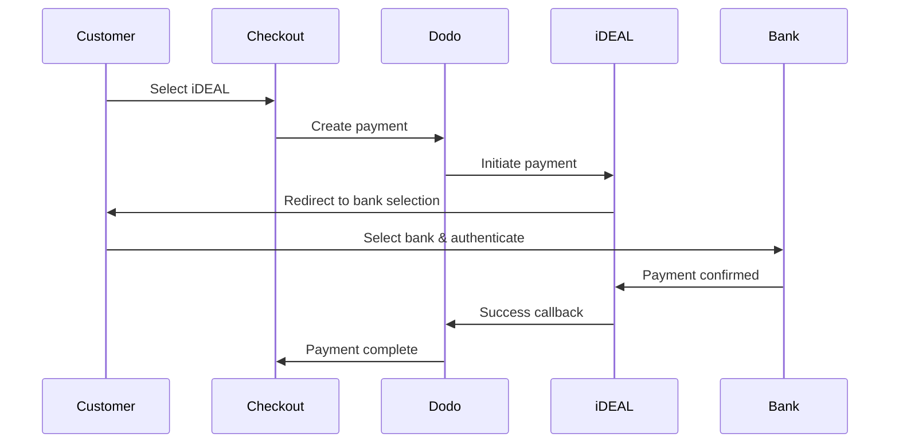
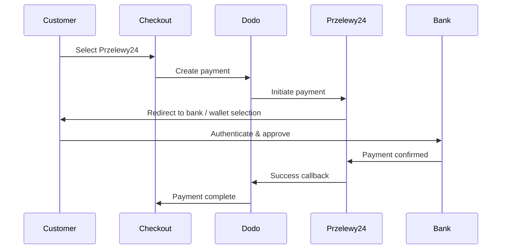
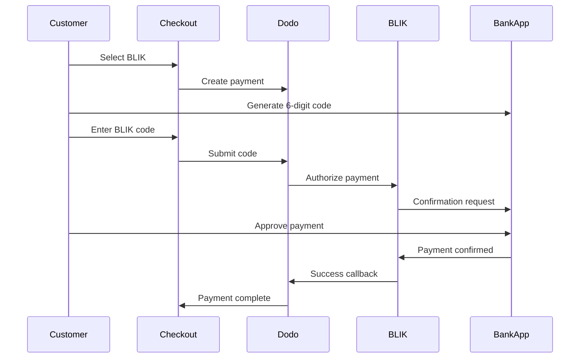

يفضل العملاء الأوروبيون بشدة طرق الدفع المحلية التي تندمج مع أنظمتهم المصرفية. يمكن أن يؤدي تقديم هذه الطرق إلى زيادة معدلات التحويل بنسبة 20-40٪ في الأسواق المستهدفة.

## لماذا طرق الدفع المحلية الأوروبية؟

<CardGroup cols={3}>
<Card title="Higher Conversion" icon="chart-line">
يجذب iDEAL حوالي 60٪ من المدفوعات الإلكترونية في هولندا. عدم تقديمه يعني خسارة العملاء.
</Card>

<Card title="Lower Fraud" icon="shield-check">
تتمتع المدفوعات المصادق عليها من البنك بمعدلات احتيال تكاد تكون صفرًا ولا توجد عمليات رد أموال.
</Card>

<Card title="Real-Time Settlement" icon="bolt">
توفر معظم الطرق الأوروبية تأكيدًا فوريًا للدفع.
</Card>
</CardGroup>

## الطرق المدعومة

| طريقة | الدولة | حصة السوق | العملة | الإشتراكات |
| :----- | :------ | :----------- | :------- | :-----------: |
| **iDEAL** | هولندا | ~60% | EUR | لا |
| **Bancontact** | بلجيكا | ~50% | EUR | لا |
| **EPS** | النمسا | ~30% | EUR | لا |
| **Multibanco** | البرتغال | ~40% | EUR | لا |
| **Przelewy24 (P24)** | بولندا | ~30% | PLN | لا |
| **BLIK** | بولندا | ~60% | PLN | لا |
| **Satispay** | أوروبا (إيطاليا) | متنامي | EUR | نعم |

## iDEAL (هولندا)

يعد iDEAL طريقة الدفع الإلكترونية المهيمنة في هولندا، ويتصل مباشرة بجميع البنوك الهولندية الكبرى.

### كيف يعمل



### البنوك المدعومة

جميع البنوك الهولندية الكبرى مدعومة:
- ABN AMRO
- ASN Bank
- Bunq
- ING
- Knab
- Rabobank
- RegioBank
- Revolut
- SNS
- Triodos Bank
- Van Lanschot

### الإعداد

```javascript
const session = await client.checkoutSessions.create({
  product_cart: [{ product_id: 'prod_123', quantity: 1 }],
  allowed_payment_method_types: ['ideal', 'credit', 'debit'],
  billing_currency: 'EUR',
  billing_address: {
    country: 'NL',
    zipcode: '1012JS'
  },
  return_url: 'https://example.com/success'
});
```

## Bancontact (بلجيكا)

Bancontact هو نظام الدفع الوطني في بلجيكا، ويستخدمه تقريبًا جميع البنوك البلجيكية للمدفوعات الإلكترونية.

### الميزات
- يعمل مع بطاقات الخصم البلجيكية الحالية
- دعم تطبيق الهاتف المحمول (Payconiq بواسطة Bancontact)
- تأكيد فوري للدفع
- لا حاجة لتسجيل إضافي للعملاء

### الإعداد

```javascript
const session = await client.checkoutSessions.create({
  product_cart: [{ product_id: 'prod_123', quantity: 1 }],
  allowed_payment_method_types: ['bancontact_card', 'credit', 'debit'],
  billing_currency: 'EUR',
  billing_address: {
    country: 'BE',
    zipcode: '1000'
  },
  return_url: 'https://example.com/success'
});
```

## EPS (النمسا)

تمكّن EPS (المعيار الإلكتروني للدفع) التحويلات المصرفية المباشرة عبر الإنترنت للعملاء النمساويين.

### الميزات
- التكامل المباشر مع البنوك النمساوية
- تأكيد الدفع في الوقت الحقيقي
- ثقة عالية بين المستهلكين النمساويين
- لا عمليات رد أموال

### البنوك المدعومة

تشمل البنوك النمساوية الكبرى:
- Erste Bank
- Bank Austria
- Raiffeisen
- BAWAG
- Volksbank

### الإعداد

```javascript
const session = await client.checkoutSessions.create({
  product_cart: [{ product_id: 'prod_123', quantity: 1 }],
  allowed_payment_method_types: ['eps', 'credit', 'debit'],
  billing_currency: 'EUR',
  billing_address: {
    country: 'AT',
    zipcode: '1010'
  },
  return_url: 'https://example.com/success'
});
```

## Multibanco (البرتغال)

Multibanco هو الشبكة المصرفية البينية في البرتغال، ويوفر المدفوعات عبر الإنترنت والمدفوعات عبر أجهزة الصراف الآلي.

### خيارات الدفع

1. **الخدمات المصرفية عبر الإنترنت** — تحويل مصرفي مباشر عبر الخدمات المصرفية الإلكترونية
2. **الدفع عبر أجهزة الصراف الآلي** — يتلقى العميل مرجعًا للدفع في أي جهاز Multibanco
3. **الخدمات المصرفية عبر الهاتف المحمول** — الدفع عبر تطبيقات الهواتف المصرفية

### كيف يعمل الدفع عبر أجهزة الصراف الآلي

بالنسبة لمدفوعات أجهزة الصراف الآلي، يتلقى العملاء مرجع دفع:

```
Entity: 12345
Reference: 123 456 789
Amount: €50.00
Expiry: 24 hours
```

يمكن للعميل الدفع في أي جهاز صراف آلي برتغالي أو عبر الخدمات المصرفية عبر الإنترنت باستخدام هذا المرجع.

### الإعداد

```javascript
const session = await client.checkoutSessions.create({
  product_cart: [{ product_id: 'prod_123', quantity: 1 }],
  allowed_payment_method_types: ['multibanco', 'credit', 'debit'],
  billing_currency: 'EUR',
  billing_address: {
    country: 'PT',
    zipcode: '1000-001'
  },
  return_url: 'https://example.com/success'
});
```

<Note>
قد تستغرق مدفوعات Multibanco عبر أجهزة الصراف الآلي وقتًا بين إتمام السداد والدفع الفعلي. راقب Webhooks لتأكيد الدفع.
</Note>

## Przelewy24 (بولندا)

Przelewy24 (P24) هو الرائد في طرق الدفع عبر الإنترنت في بولندا، ويجمع بين التحويلات البنكية والمحافظ المحلية عبر جميع البنوك البولندية الكبرى. على عكس الطرق الأوروبية الأخرى، يتم التسوية بعملة **PLN** (زلوتي بولندي)، وليس اليورو.

### كيفية عمله



### التوفر

- **عملة الفوترة:** PLN فقط
- **نوع المعاملة:** الدفعات لمرة واحدة فقط (غير متاحة للاشتراكات)
- **التغطية:** جميع البنوك البولندية الكبرى بالإضافة إلى المحافظ المحلية الشهيرة

### التكوين

```javascript
const session = await client.checkoutSessions.create({
  product_cart: [{ product_id: 'prod_123', quantity: 1 }],
  allowed_payment_method_types: ['przelewy24', 'credit', 'debit'],
  billing_currency: 'PLN',
  billing_address: {
    country: 'PL',
    zipcode: '00-001'
  },
  return_url: 'https://example.com/success'
});
```

<Note>
يتطلب Przelewy24 عملة فوترة **PLN**. إذا كنت تحدد أسعارك باليورو، فعّل [العملة التكيفية](/features/adaptive-currency) لتُحتَسَب بالفاتورة بعملة PLN وتصبح Przelewy24 متاحة.
</Note>

## BLIK (بولندا)

BLIK هو الطريقة الأكثر شيوعًا للدفع عبر الهاتف المحمول في بولندا، مما يسمح للعملاء بالدفع باستخدام كود مكون من 6 أرقام يتم إنشاؤه في تطبيقهم المصرفي. مثل Przelewy24، يتم تسوية BLIK بالـ **PLN** (الزلوتي البولندي)، وليس بالـ EUR.

### كيف يعمل



### التوفر

- **عملة الفوترة:** PLN فقط
- **نوع المعاملة:** مدفوعات لمرة واحدة فقط (غير متاحة للاشتراكات)
- **التغطية:** جميع البنوك البولندية الكبرى التي تدعم BLIK

### التكوين

```javascript
const session = await client.checkoutSessions.create({
  product_cart: [{ product_id: 'prod_123', quantity: 1 }],
  allowed_payment_method_types: ['blik', 'credit', 'debit'],
  billing_currency: 'PLN',
  billing_address: {
    country: 'PL',
    zipcode: '00-001'
  },
  return_url: 'https://example.com/success'
});
```

<Note>
BLIK يتطلب عملة فوترة **PLN**. إذا كنت تعرض أسعارك بالـ EUR، فقم بتمكين [العملة التكيفية](/features/adaptive-currency) لتسديد الفواتير بالـ PLN لعملاء بولندا وإتاحة BLIK.
</Note>

## Satispay (أوروبا)

Satispay هو شبكة دفع شائعة عبر الهاتف المحمول في أوروبا، وخاصة في إيطاليا، تتيح للعملاء الدفع مباشرة من تطبيق Satispay بدون مشاركة تفاصيل البطاقة أو البنك. يقوم Satispay بالتسوية بالـ **EUR**.

### الميزات

- مدفوعات عبر التطبيق دون الاعتماد على شبكات البطاقات
- تبني قوي عبر إيطاليا ونمو في الأسواق الأوروبية الأخرى
- يدعم المدفوعات لمرة واحدة والاشتراكات

### التوفر

- **عملة الفوترة:** EUR
- **نوع المعاملة:** مدفوعات لمرة واحدة واشتراكات

### التكوين

```javascript
const session = await client.checkoutSessions.create({
  product_cart: [{ product_id: 'prod_123', quantity: 1 }],
  allowed_payment_method_types: ['satispay', 'credit', 'debit'],
  billing_currency: 'EUR',
  billing_address: {
    country: 'IT',
    zipcode: '00100'
  },
  return_url: 'https://example.com/success'
});
```

## أنواع أساليب API

| النوع | الطريقة | الدولة |
| :--- | :----- | :------ |
| `ideal` | iDEAL | هولندا |
| `bancontact_card` | Bancontact | بلجيكا |
| `eps` | EPS | النمسا |
| `multibanco` | Multibanco | البرتغال |
| `przelewy24` | Przelewy24 (P24) | بولندا |
| `blik` | BLIK | بولندا |
| `satispay` | Satispay | أوروبا (إيطاليا) |

## دفع متعدد البلدان في أوروبا

للشركات التي تخدم دول أوروبية متعددة، قم بتضمين جميع الطرق الإقليمية:

```javascript
const session = await client.checkoutSessions.create({
  product_cart: [{ product_id: 'prod_123', quantity: 1 }],
  allowed_payment_method_types: [
    'ideal',           // Netherlands
    'bancontact_card', // Belgium
    'eps',             // Austria
    'multibanco',      // Portugal
    'przelewy24',      // Poland (requires PLN billing currency)
    'blik',            // Poland (requires PLN billing currency)
    'satispay',        // Europe / Italy
    'credit',          // Fallback
    'debit'            // Fallback
  ],
  billing_currency: 'EUR',
  return_url: 'https://example.com/success'
});
```

Dodo يعرض تلقائيًا فقط الطرق ذات الصلة بناءً على موقع العميل. سيشاهد العميل الهولندي iDEAL؛ وسيشاهد العميل البلجيكي Bancontact.

## الاختبار

يمكن اختبار طرق الدفع الأوروبية في وضع الصندوق الرمل. تدفق الاختبار يحاكي عملية مصادقة البنك.

<Steps>
<Step title="Enable test mode">
استخدم مفاتيح اختبار API من Dodo Payments.
</Step>

<Step title="Set appropriate billing address">
قم بتعيين بلد عنوان الفوترة لمطابقة طريقة الدفع:
- `NL` لـ iDEAL
- `BE` لـ Bancontact
- `AT` لـ EPS
- `PT` لـ Multibanco
- `PL` لـ Przelewy24 وBLIK (مع PLN كعملة فوترة)
- `IT` لـ Satispay
</Step>

<Step title="Complete the test flow">
اتبع تدفق مصادقة البنك المحاكي في بيئة الاختبار.
</Step>
</Steps>

## أفضل الممارسات

<AccordionGroup>
<Accordion title="Always include regional methods for target markets">
إذا كنت تبيع للعملاء الهولنديين، فأدرج iDEAL. عدم القيام بذلك يشبه عدم قبول Visa في الولايات المتحدة — ستفقد مبيعات كبيرة.
</Accordion>

<Accordion title="Match currency to region">
تتطلب معظم طرق الدفع الأوروبية EUR — تأكد من دعم تسعيرك للمعاملات باليورو. الاستثناء الوحيد هو Przelewy24، الذي يُعرض فقط على فوترة **PLN** (الزلوتي البولندي).
</Accordion>

<Accordion title="Handle redirects gracefully">
كل الطرق الأوروبية تتضمن إعادة توجيه إلى مواقع البنوك. تأكد من أن معالجتك لعناوين URL العودة قوية وتأخذ في الاعتبار الإجراءات التي يترك فيها المستخدم العملية في منتصف الطريق.
</Accordion>

<Accordion title="Provide card fallbacks">
ليس كل العملاء الأوروبيين لديهم وصول إلى هذه الطرق الإقليمية (السائحون، المغتربون، إلخ). يجب دائمًا تضمين `credit` و `debit` كبدائل.
</Accordion>

<Accordion title="Consider Multibanco timing">
قد تستغرق مدفوعات الصراف الآلي Multibanco ساعات لإتمامها. لا تحجب الإيفاء على الدفع الفوري — استخدم webhooks لتأكيد غير متزامن.
</Accordion>
</AccordionGroup>

## استكشاف المشاكل وحلها

<AccordionGroup>
<Accordion title="European method not appearing">
**تحقق:**
1. هل بلد فوترة العميل يطابق بلد الطريقة؟
2. هل العملة مضبوطة على EUR؟
3. هل الطريقة مدرجة في `allowed_payment_method_types`؟

**الحل:** الطرق الأوروبية إقليمية بحتة. لن يرى العميل الذي لديه بلد فوترة `DE` (ألمانيا) iDEAL، الذي يخص هولندا فقط.
</Accordion>

<Accordion title="Bank authentication failed">
**الأسباب:**
- العميل ألغى أثناء مصادقة البنك
- نظام مصادقة البنك غير متوفر مؤقتًا
- العميل أدخل بيانات اعتماد غير صحيحة

**الحل:** يجب على العميل إعادة المحاولة. إذا استمرت المشكلة، نقترح محاولة طريقة دفع مختلفة.
</Accordion>

<Accordion title="Redirect not completing">
**الأسباب:**
- العميل أغلق المتصفح أثناء إعادة توجيه المصرف
- مشكلات في الشبكة أثناء المصادقة
- عنوان URL العودة غير مضبوط بشكل صحيح

**الحل:** تحقق من أن عنوان URL العودة صحيح ويمكن الوصول إليه. تأكد من قدرته على التعامل مع كل من الحالات الناجحة والفاشلة.
</Accordion>

<Accordion title="Multibanco payment pending">
**السبب:** العميل حصل على مرجع الدفع لكنه لم يدفع بعد.

**الحل:** هذا متوقع للمدفوعات المستندة إلى الصراف الآلي. انتظر تأكيد الـ webhook. ينتهي المرجع عادة في غضون 24-72 ساعة.
</Accordion>
</AccordionGroup>

## الامتثال لـ PSD2

جميع طرق الدفع الأوروبية تتوافق مع لوائح PSD2 (توجيه خدمات الدفع 2):

- **المصادقة القوية للعميل (SCA)** — مدمجة في تدفق مصادقة البنك
- **الاتصال الآمن** — يتم إرسال جميع البيانات عبر قنوات آمنة
- **حماية المستهلك** — التوافق الكامل مع حقوق المستهلك في الاتحاد الأوروبي

## الصفحات ذات الصلة

<CardGroup cols={2}>
<Card title="Payment Methods Overview" icon="credit-card" href="/features/payment-methods">
شاهد جميع طرق الدفع المدعومة.
</Card>

<Card title="Adaptive Currency" icon="globe" href="/features/adaptive-currency">
دعم العملة والتحويل التلقائي.
</Card>

<Card title="Checkout Guide" icon="book" href="/developer-resources/checkout-session">
دليل تنفيذ الدفع الكامل.
</Card>

<Card title="Webhooks" icon="webhook" href="/developer-resources/webhooks">
التعامل مع تأكيدات الدفع بشكل غير متزامن.
</Card>
</CardGroup>