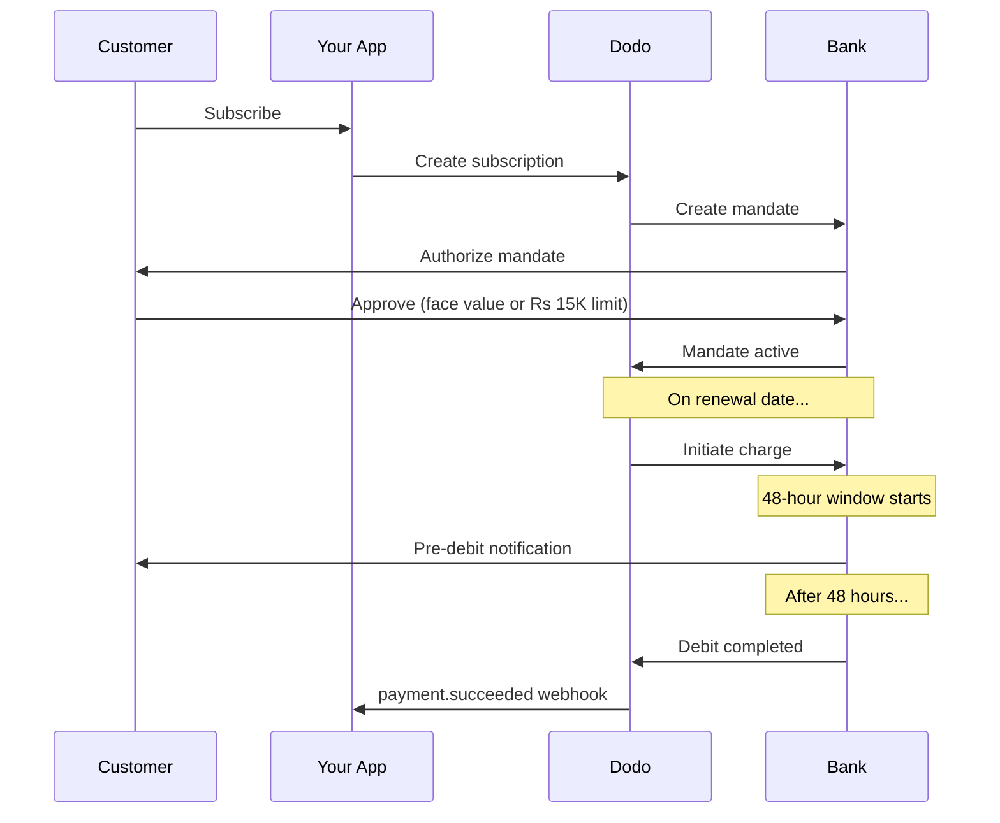

تتمتع الهند ببنية تحتية فريدة لطرق الدفع تهيمن عليها UPI (60%+ من المعاملات الرقمية) وبطاقات Rupay. تدعم دودي للدفع كلاهما مع الامتثال الكامل لـ RBI لتفويضات الاشتراك.

## لماذا تعتبر طرق دفع الهند مهمة

<CardGroup cols={3}>
<Card title="هيمنة UPI" icon="mobile">
تقوم UPI بمعالجة أكثر من 10 مليار معاملة شهريًا. العديد من العملاء الهنود ليس لديهم بطاقات دولية.
</Card>

<Card title="تكاليف معاملات منخفضة" icon="رمز الروبية الهندية">
تتمتع UPI برسوم معاملات قريبة من الصفر. ممتازة للمعاملات ذات الحجم الكبير والقيمة المنخفضة.
</Card>

<Card title="دعم الاشتراكات" icon="repeat">
على عكس معظم طرق الدفع البديلة، تدعم UPI و Rupay المدفوعات المتكررة عبر تفويضات RBI.
</Card>
</CardGroup>

## طرق الدفع المدعومة

| الطريقة | النوع | الاشتراكات | الحد الأدنى من المبلغ |
| :----- | :--- | :-----------: | :--------- |
| **جمع UPI** | رمز QR / VPA | نعم* | ₹1 |
| **بطاقة Rupay الائتمانية** | بطاقة | نعم* | ₹1 |
| **بطاقة Rupay المدينة** | بطاقة | نعم* | ₹1 |

*الاشتراكات تتطلب تفويضات متوافقة مع RBI مع قواعد معالجة خاصة.

## التكوين

### أنواع طرق API

| النوع | الوصف |
| :--- | :---------- |
| `upi_collect` | UPI عبر رمز QR أو إدخال VPA |
| `credit` | بطاقات الائتمان بما فيها Rupay |
| `debit` | بطاقات المدينة بما فيها Rupay |

### مثال: عملية تسجيل الخروج المتعلقة بالهند

```javascript
const session = await client.checkoutSessions.create({
  product_cart: [{ product_id: 'prod_123', quantity: 1 }],
  allowed_payment_method_types: [
    'upi_collect',
    'credit',
    'debit'
  ],
  billing_currency: 'INR',
  customer: {
    email: 'customer@example.in',
    name: 'Priya Sharma',
    phone_number: '+919876543210'
  },
  billing_address: {
    country: 'IN',
    zipcode: '560001'
  },
  return_url: 'https://example.com/success'
});
```

### متطلبات UPI

لكي تظهر UPI في تسجيل الخروج:
1. **الدولة المستحقة** يجب أن تكون الهند (`IN`)
2. **العملة** يجب أن تكون INR
3. بالنسبة للتجار غير الهنود: يجب تمكين **العملة التكيفية**

<Warning>
إذا كنت تاجرًا غير هندي و**العملة التكيفية** غير مفعلة، فلن تكون UPI متاحة لعملائك.
</Warning>

## الاشتراكات مع تفويضات RBI

تعمل اشتراكات طرق الدفع الهندية بموجب لوائح RBI (البنك الاحتياطي الهندي) مع متطلبات فريدة.

### كيفية عمل تفويضات RBI



### أنواع التفويضات

| مبلغ الاشتراك | نوع التفويض | الحد |
| :------------------ | :----------- | :---- |
| **أقل من 15,000 روبية** | تفويض عند الطلب | 15,000 روبية |
| **15,000 روبية أو أكثر** | تفويض بمبلغ ثابت | مبلغ الاشتراك المحدد |

**مهم لتغييرات الخطط:** إذا كانت الترقية تؤدي إلى رسوم تتجاوز حد التفويض الحالي، فستفشل الرسوم ويجب على العميل إعادة التفويض.

### التأخير في المعالجة لمدة 48 ساعة

هذه هي أهم نقطة اختلاف عن مدفوعات البطاقات الدولية:

<Steps>
<Step title="بدء الرسوم (اليوم 0)">
في تاريخ التجديد المحدد، تبدأ دودي الرسوم مع البنك.
</Step>

<Step title="إشعار ما قبل الخصم">
يتلقى العميل إشعار من بنكهم حول الخصم القادم.
</Step>

<Step title="نافذة 48 ساعة">
يمكن للعميل إلغاء التفويض خلال هذه الفترة عبر تطبيق البنك الخاص بهم.
</Step>

<Step title="اكتمل الخصم (~48-51 ساعة)">
بعد 48 ساعة (بالإضافة إلى ما يصل إلى 3 ساعات إضافية لمعالجة البنك)، يتم خصم الأموال.
</Step>

<Step title="إرسال الويب هوك">
`payment.succeeded` يتم إرسال الويب هوك بعد الخصم الفعلي، وليس عند البدء.
</Step>
</Steps>

<Warning>
**لا تمنح الفوائد عند بدء الرسوم.** انتظر حتى يصل `payment.succeeded` الويب هوك، الذي يصل إلى ~48-51 ساعة بعد تاريخ الرسوم المحدد.
</Warning>

### التعامل مع نافذة الـ 48 ساعة

```javascript
// DON'T do this:
async function handleSubscriptionRenewal(subscription) {
  // ❌ Bad: Granting access immediately when charge is initiated
  grantPremiumAccess(subscription.customer_id);
}

// DO this:
async function handlePaymentWebhook(event) {
  if (event.type === 'payment.succeeded') {
    // ✅ Good: Only grant access after payment is confirmed
    grantPremiumAccess(event.data.customer_id);
  }
  
  if (event.type === 'payment.failed') {
    // Handle failed payment (mandate cancelled, insufficient funds)
    revokePremiumAccess(event.data.customer_id);
  }
}
```

### أحداث الويب هوك للاشتراكات الهندية

| الحدث | متى | الإجراء |
| :---- | :--- | :----- |
| `subscription.created` | تم تفويض التفويض | سجل بدء الاشتراك |
| `payment.succeeded` | ~48 ساعة بعد تاريخ الرسوم | منح/استمرار الوصول |
| `payment.failed` | فشل الخصم | قم بإبلاغ العميل، أوقف الوصول |
| `subscription.on_hold` | فشل الدفع | قم بالمطالبة بتحديث طريقة الدفع |
| `subscription.active` | تم إعادة تفعيلها بعد الدفع | استعادة الوصول |

## اختبار

### معرفات اختبار UPI

| الحالة | معرف UPI |
| :----- | :----- |
| النجاح | `success@upi` |
| الفشل | `failure@upi` |

### أرقام اختبار بطاقات الهند

| العلامة التجارية | السيناريو | رقم البطاقة | انتهاء الصلاحية | CVV |
| :---- | :------- | :---------- | :----- | :-- |
| فيزا | نجاح | `4576238912771450` | 06/32 | 123 |
| فيزا | مرفوضة | `4706131211212123` | 06/32 | 123 |
| ماستركارد | نجاح | `5409162669381034` | 06/32 | 123 |
| ماستركارد | مرفوضة | `5105105105105100` | 06/32 | 123 |

## أفضل الممارسات

<AccordionGroup>
<Accordion title="خطط للتأخير لمدة 48 ساعة">
قم ببناء تطبيقك ليكون قادرًا على التعامل مع الفجوة بين بدء الرسوم والدفع الفعلي. اعتبر:
- فترات سماح للوصول للاشتراك
- تواصل واضح مع العملاء حول الوقت المستغرق في المعالجة
- الوفاء المعتمد على الويب هوك، وليس المعتمد على التاريخ
</Accordion>

<Accordion title="التعامل مع إلغاءات التفويض">
يمكن للعملاء إلغاء التفويضات عبر تطبيقات بنوكهم في أي وقت. راقب `subscription.on_hold` الويب هوك واطلب من العملاء إعادة الاشتراك أو تحديث طرق الدفع.
</Accordion>

<Accordion title="تحديد مبالغ تفويض مناسبة">
بالنسبة للتسعير المتغير (على سبيل المثال، بناءً على الاستخدام)، اعتبر ما إذا كان تفويضًا عند الطلب بقيمة 15,000 روبية يكفي. إذا كانت الرسوم قد تتجاوز ذلك، سيحتاج العملاء إلى إعادة التفويض.
</Accordion>

<Accordion title="عرض UPI بشكل بارز">
بالنسبة للعملاء الهنود، يجب أن تكون UPI هي الخيار الرئيسي للدفع. يفضل العديد من المستخدمين ذلك على البطاقات بسبب الألفة وانخفاض الاحتكاك.
</Accordion>
</AccordionGroup>

## استكشاف الأخطاء وإصلاحها

<AccordionGroup>
<Accordion title="UPI لا تظهر في الخروج">
**تحقق:**
1. هل تم تعيين الدولة المستحقة إلى `IN`؟
2. هل تم تعيين العملة إلى `INR`؟
3. إذا كنت تاجرًا غير هندي: هل تم تمكين العملة التكيفية؟
4. هل تم تضمين `upi_collect` في `allowed_payment_method_types`؟

**الحل:** تحقق من أن عنوان الفاتورة يحتوي على `country: "IN"` و `billing_currency: "INR"`.
</Accordion>

<Accordion title="فشل رسوم الاشتراك بعد الترقية">
**السبب:** يتجاوز مبلغ الرسوم الجديد حد التفويض الحالي (حد 15,000 روبية).
</Accordion>

**الحل:** يحتاج العميل إلى تحديث طريقة الدفع لوضع تفويض جديد بالحد الصحيح.
</Accordion>

<Accordion title="اشتراك موقوف لكن العميل يدعي أنه لم يقم بالإلغاء">
**السبب:** قد يكون العميل قد ألغى التفويض خلال نافذة الـ 48 ساعة، أو أن بنكهم رفض الخصم.
</Accordion>

**الحل:** يحتاج العميل إلى إعادة تفويض التفويض أو تحديث طريقة الدفع الخاصة بهم.
</Accordion>

<Accordion title="تأخر خصم الدفع لأكثر من 48 ساعة">
**السبب:** يمكن أن تؤدي تأخيرات واجهة برمجة التطبيقات الخاصة بالبنك إلى تمديد المعالجة لساعتين إلى ثلاث ساعات إضافية.
</Accordion>

**الحل:** هذا متوقع. قم ببناء نظامك للتعامل مع التأخيرات المتغيرة التي تصل إلى ~51 ساعة إجمالًا.
</Accordion>

<Accordion title="تم إلغاء التفويض لكن الاشتراك لا يزال نشط">
**السبب:** حالة خاصة في لوائح RBI — إلغاء التفويض خلال نافذة المعالجة لا يلغي الاشتراك على الفور.
</Accordion>

**الحل:** ستفشل الرسوم التالية وسينتقل الاشتراك إلى `on_hold`. راقب الويب هوكس لـ `payment.failed`.
</Accordion>
</AccordionGroup>

## صفحات ذات صلة

<CardGroup cols={2}>
<Card title="نظرة عامة على طرق الدفع" icon="credit-card" href="/features/payment-methods">
انظر جميع طرق الدفع المدعومة.
</Card>

<Card title="الاشتراكات" icon="repeat" href="/features/subscription">
توثيق الاشتراك الكامل بما في ذلك تفويضات RBI.
</Card>

<Card title="ويب هوكس" icon="webhook" href="/developer-resources/webhooks">
التعامل مع الويب هوك لأحداث الدفع.
</Card>

<Card title="عملية الاختبار" icon="flask" href="/miscellaneous/testing-process">
جميع بيانات الاختبار بما في ذلك معرفات UPI وبطاقات الهند.
</Card>
</CardGroup>