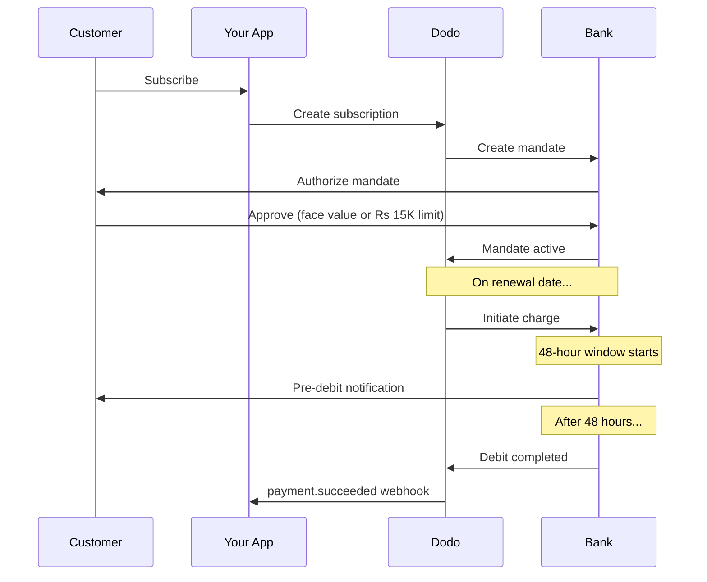

تتمتع الهند ببنية تحتية فريدة للدفع، تهيمن عليها UPI (أكثر من 60% من المعاملات الرقمية) والبطاقات المُصدرة في الهند (Visa وMastercard وRupay وغيرها). Dodo Payments تدعم كل هذه الخيارات مع الامتثال الكامل لمتطلبات RBI الخاصة بتفويضات الاشتراك.

## أهمية طرق الدفع في الهند

<CardGroup cols={3}>
<Card title="UPI Dominance" icon="mobile">
تُعالج UPI أكثر من 10 مليارات معاملة شهريًا. ولا يمتلك العديد من العملاء الهنود بطاقات دولية.
</Card>

<Card title="Low Transaction Costs" icon="indian-rupee-sign">
تفرض UPI رسوم معاملات شبه معدومة. وهي ممتازة للمعاملات ذات الحجم الكبير والقيمة المنخفضة.
</Card>

<Card title="Subscription Support" icon="repeat">
على عكس معظم طرق الدفع البديلة، تدعم UPI وجميع البطاقات المُصدرة في الهند (Visa وMastercard وRupay وغيرها) المدفوعات المتكررة عبر تفويضات RBI.
</Card>
</CardGroup>

## الطرق المدعومة

| الطريقة | النوع | الاشتراكات | الحد الأدنى للمبلغ |
| :----- | :--- | :-----------: | :--------- |
| **UPI Collect** | رمز QR / VPA | نعم* | ₹1 |
| **Rupay Credit** | بطاقة | نعم* | ₹1 |
| **Rupay Debit** | بطاقة | نعم* | ₹1 |

*تتطلب الاشتراكات تفويضات متوافقة مع RBI مع قواعد معالجة خاصة. تنطبق مهلة المعالجة البالغة 48 ساعة على جميع البطاقات المُصدرة في الهند وUPI.

## الإعداد

### أنواع طرق API

| النوع | الوصف |
| :--- | :---------- |
| `upi_collect` | UPI عبر رمز QR أو إدخال VPA |
| `credit` | بطاقات ائتمان، بما في ذلك Rupay |
| `debit` | بطاقات خصم، بما في ذلك Rupay |

### مثال: صفحة دفع مخصصة للهند

```javascript
const session = await client.checkoutSessions.create({
  product_cart: [{ product_id: 'prod_123', quantity: 1 }],
  allowed_payment_method_types: [
    'upi_collect',
    'credit',
    'debit'
  ],
  billing_currency: 'INR',
  customer: {
    email: 'customer@example.in',
    name: 'Priya Sharma',
    phone_number: '+919876543210'
  },
  billing_address: {
    country: 'IN',
    zipcode: '560001'
  },
  return_url: 'https://example.com/success'
});
```

### متطلبات UPI

لكي تظهر UPI عند الدفع:
1. يجب أن تكون **دولة الفوترة** هي الهند (`IN`)
2. يجب أن تكون **العملة** هي INR
3. بالنسبة إلى التجار من خارج الهند: يجب تمكين **Adaptive Currency**

<Warning>
إذا كنت تاجرًا من خارج الهند ولم يتم تمكين Adaptive Currency، فلن تكون UPI متاحة لعملائك.
</Warning>

## الاشتراكات مع تفويضات RBI

تعمل اشتراكات طرق الدفع الهندية بموجب لوائح RBI (Reserve Bank of India) مع متطلبات فريدة.

### آلية عمل تفويضات RBI



### أنواع التفويضات

| مبلغ الاشتراك | نوع التفويض | الحد |
| :------------------ | :----------- | :---- |
| **أقل من حد التفويض الأدنى** | تفويض عند الطلب | حد التفويض الأدنى (₹15,000 افتراضيًا) |
| **عند حد التفويض الأدنى أو أعلى** | تفويض بمبلغ ثابت | مبلغ الاشتراك المحدد |

المبلغ المسجل لدى بنك العميل هو `max(mandate_floor, billing_amount)`. لذلك، يمثل الحد الأدنى فعليًا **سقف التفويض** الذي يراه العميل عندما تكون الفوترة أقل من هذا الحد.

**مهم عند تغيير الخطة:** إذا أدت الترقية إلى رسم يتجاوز حد التفويض الحالي، فستفشل العملية وسيتعين على العميل إعادة التفويض.

### حد التفويض الأدنى القابل للتهيئة

يمكن تهيئة حد التفويض الأدنى للتفويضات الإلكترونية بعملة INR عبر الحقل `mandate_min_amount_inr_paise` (بوحدة **paise الهندية** — 1 INR = 100 paise). يمكنك تجاوز القيمة الافتراضية للنظام، وهي ₹15,000، على ثلاثة مستويات:

| المستوى | مكان الإعداد | النطاق |
|-------|--------------|-------|
| **لكل طلب** | `mandate_min_amount_inr_paise` في جلسة دفع أو عملية دفع أو اشتراك | معاملة واحدة |
| **التاجر** | إعدادات النشاط التجاري | جميع اشتراكاتك بعملة INR |
| **النظام** | — | القيمة الافتراضية ₹15,000 |

أولوية تحديد القيمة: التجاوز لكل طلب ← إعداد التاجر ← القيمة الافتراضية للنظام.

```typescript
// Per-checkout override
const session = await client.checkoutSessions.create({
  product_cart: [{ product_id: 'prod_inr_monthly', quantity: 1 }],
  mandate_min_amount_inr_paise: 2_000_000, // ₹20,000 ceiling
  return_url: 'https://yoursite.com/return'
});

// Per-subscription override
const subscription = await client.subscriptions.create({
  product_id: 'prod_inr_monthly',
  customer: { email: 'customer@example.in' },
  billing: { country: 'IN', /* ... */ },
  mandate_min_amount_inr_paise: 2_000_000
});
```

| الحقل | النوع | التحقق | ينطبق على |
|-------|------|------------|------------|
| `mandate_min_amount_inr_paise` | `integer` (paise بعملة INR) | `>= 1` | اشتراكات البطاقات الهندية بعملة INR على موصلات غير Airwallex |

<Info>
يسمح لك تعيين حد أدنى أعلى بدعم رسوم فردية أكبر لاحقًا (مثل ترقيات الخطط أو الرسوم الإضافية المستندة إلى الاستخدام) دون إجبار العملاء على إعادة التفويض. ويجعل تعيين حد أدنى أقل تفويض العميل أقرب إلى مبلغ الفوترة الفعلي، لكنه يحد من هامش الرسوم المتغيرة المستقبلية.
</Info>

<Warning>
يؤثر هذا الإعداد فقط في التفويضات الإلكترونية المسجلة للبطاقات المُصدرة في الهند (Visa وMastercard وRuPay) ضمن الاشتراكات بعملة INR. وتتبع اشتراكات UPI تدفق AutoPay الخاص بها ولا تتأثر.
</Warning>

### مهلة المعالجة البالغة 48 ساعة

هذا هو الاختلاف الأهم عن مدفوعات البطاقات الدولية:

<Steps>
<Step title="Charge Initiated (Day 0)">
في تاريخ التجديد المجدول، يبدأ Dodo عملية الخصم مع البنك.
</Step>

<Step title="Pre-Debit Notification">
يتلقى العميل إشعارًا من بنكه بشأن الخصم القادم.
</Step>

<Step title="48-Hour Window">
يمكن للعميل إلغاء التفويض خلال هذه الفترة عبر تطبيقه المصرفي.
</Step>

<Step title="Debit Completed (~48-51 hours)">
بعد 48 ساعة (بالإضافة إلى ما يصل إلى 3 ساعات إضافية لمعالجة البنك)، تُخصم الأموال.
</Step>

<Step title="Webhook Sent">
يُرسل webhook ‏`payment.succeeded` بعد الخصم الفعلي، وليس عند بدء العملية.
</Step>
</Steps>

<Warning>
**لا تمنح المزايا عند بدء الخصم.** انتظر webhook ‏`payment.succeeded`، الذي يصل بعد نحو 48 إلى 51 ساعة من تاريخ الخصم المجدول.
</Warning>

### التعامل مع نافذة الـ48 ساعة

```javascript
// DON'T do this:
async function handleSubscriptionRenewal(subscription) {
  // ❌ Bad: Granting access immediately when charge is initiated
  grantPremiumAccess(subscription.customer_id);
}

// DO this:
async function handlePaymentWebhook(event) {
  if (event.type === 'payment.succeeded') {
    // ✅ Good: Only grant access after payment is confirmed
    grantPremiumAccess(event.data.customer_id);
  }
  
  if (event.type === 'payment.failed') {
    // Handle failed payment (mandate cancelled, insufficient funds)
    revokePremiumAccess(event.data.customer_id);
  }
}
```

### أحداث Webhook للاشتراكات الهندية

| الحدث | التوقيت | الإجراء |
| :---- | :--- | :----- |
| `subscription.active` | تم تفويض التفويض | تسجيل بدء الاشتراك |
| `payment.succeeded` | بعد نحو 48 ساعة من تاريخ الخصم | منح الوصول أو استمراره |
| `payment.failed` | فشل الخصم | إخطار العميل وإيقاف الوصول مؤقتًا |
| `subscription.on_hold` | فشل الدفع | مطالبة العميل بتحديث طريقة الدفع |
| `subscription.active` | أُعيد التفعيل بعد الدفع | استعادة الوصول |

## الاختبار

### معرّفات اختبار UPI

| الحالة | معرّف UPI |
| :----- | :----- |
| نجاح | `success@upi` |
| فشل | `failure@upi` |

### أرقام اختبار البطاقات الهندية

| العلامة التجارية | السيناريو | رقم البطاقة | تاريخ الانتهاء | CVV |
| :---- | :------- | :---------- | :----- | :-- |
| Visa | نجاح | `4576238912771450` | 06/32 | 123 |
| Visa | مرفوضة | `4706131211212123` | 06/32 | 123 |
| Mastercard | نجاح | `5409162669381034` | 06/32 | 123 |
| Mastercard | مرفوضة | `5105105105105100` | 06/32 | 123 |

## أفضل الممارسات

<AccordionGroup>
<Accordion title="Plan for the 48-hour delay">
صمّم تطبيقك للتعامل مع الفجوة بين بدء الخصم والدفع الفعلي. ضع في اعتبارك:
- فترات سماح للوصول إلى الاشتراك
- التواصل الواضح مع العملاء بشأن مدة المعالجة
- تنفيذ يعتمد على webhooks، وليس على التواريخ
</Accordion>

<Accordion title="Handle mandate cancellations">
يمكن للعملاء إلغاء التفويضات عبر تطبيقاتهم المصرفية في أي وقت. راقب webhooks ‏`subscription.on_hold` واطلب من العملاء إعادة الاشتراك أو تحديث طرق الدفع.
</Accordion>

<Accordion title="Set appropriate mandate amounts">
بالنسبة إلى التسعير المتغير (مثل التسعير المستند إلى الاستخدام)، ضع في اعتبارك ما إذا كان تفويض عند الطلب بقيمة Rs 15,000 كافيًا. إذا تجاوزت الرسوم هذا المبلغ، فسيتعين على العملاء إعادة التفويض.
</Accordion>

<Accordion title="Offer UPI prominently">
بالنسبة إلى العملاء الهنود، ينبغي أن تكون UPI خيار الدفع الأساسي. يفضلها العديد من المستخدمين على البطاقات بسبب familiarity وسهولة الاستخدام الأكبر.
</Accordion>
</AccordionGroup>

## استكشاف الأخطاء وإصلاحها

<AccordionGroup>
<Accordion title="UPI not appearing at checkout">
**تحقق من:**
1. هل تم تعيين دولة الفوترة إلى `IN`؟
2. هل تم تعيين العملة إلى `INR`؟
3. إذا كان التاجر من خارج الهند: هل تم تمكين Adaptive Currency؟
4. هل تم تضمين `upi_collect` في `allowed_payment_method_types`؟

**الحل:** تحقق من أن عنوان الفوترة يتضمن `country: "IN"` و`billing_currency: "INR"`.
</Accordion>

<Accordion title="Subscription charge failed after upgrade">
**السبب:** يتجاوز مبلغ الخصم الجديد حد التفويض الحالي (عتبة Rs 15,000).

**الحل:** يجب على العميل تحديث طريقة الدفع لإنشاء تفويض جديد بالحد الصحيح.
</Accordion>

<Accordion title="Subscription on hold but customer claims they didn't cancel">
**السبب:** ربما ألغى العميل التفويض خلال نافذة الـ48 ساعة، أو رفض البنك عملية الخصم.

**الحل:** يحتاج العميل إلى إعادة تفويض التفويض أو تحديث طريقة الدفع.
</Accordion>

<Accordion title="Payment deduction delayed beyond 48 hours">
**السبب:** قد تؤدي تأخيرات Bank API إلى تمديد المعالجة لمدة ساعتين أو ثلاث ساعات إضافية.

**الحل:** هذا متوقع. صمّم نظامك للتعامل مع تأخيرات متغيرة تصل إجمالًا إلى نحو 51 ساعة.
</Accordion>

<Accordion title="Mandate cancelled but subscription still active">
**السبب:** حالة خاصة في لوائح RBI — لا يؤدي إلغاء التفويض أثناء نافذة المعالجة إلى إلغاء الاشتراك فورًا.

**الحل:** ستفشل عملية الخصم التالية، وسينتقل الاشتراك إلى `on_hold`. راقب webhooks بحثًا عن `payment.failed`.
</Accordion>
</AccordionGroup>

## الصفحات ذات الصلة

<CardGroup cols={2}>
<Card title="Payment Methods Overview" icon="credit-card" href="/features/payment-methods">
اطّلع على جميع طرق الدفع المدعومة.
</Card>

<Card title="Subscriptions" icon="repeat" href="/features/subscription">
اطّلع على وثائق الاشتراكات الكاملة، بما في ذلك تفويضات RBI.
</Card>

<Card title="Webhooks" icon="webhook" href="/developer-resources/webhooks">
التعامل مع webhooks لأحداث الدفع.
</Card>

<Card title="Testing Process" icon="flask" href="/miscellaneous/testing-process">
جميع بيانات الاختبار، بما في ذلك معرّفات UPI والبطاقات الهندية.
</Card>
</CardGroup>