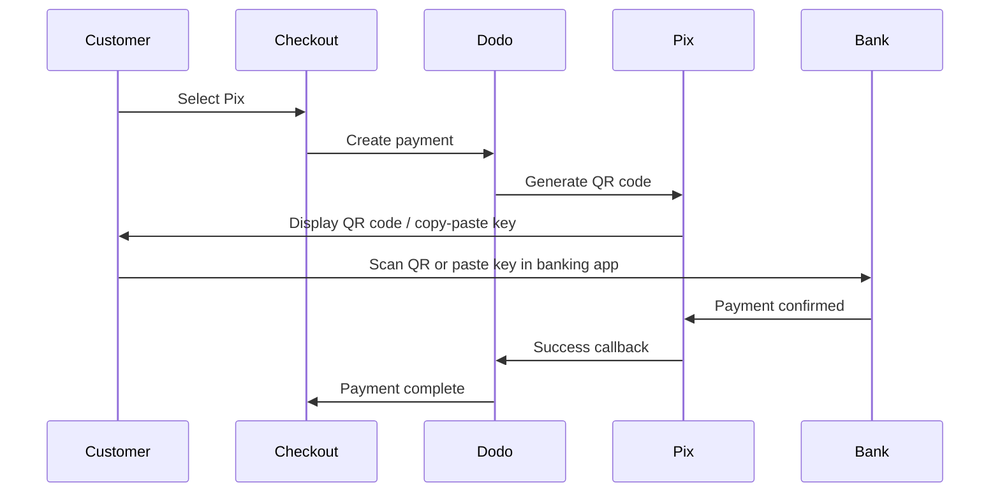

Pix هو نظام الدفع الفوري في البرازيل الذي أنشأه البنك المركزي البرازيلي (Banco Central do Brasil). يتيح التحويلات الفورية على مدار الساعة طوال أيام الأسبوع، بما في ذلك العطلات ونهايات الأسبوع، وأصبح الوسيلة الأكثر شعبية للدفع في البرازيل.

## لماذا تقدم Pix؟

<CardGroup cols={3}>
<Card title="Dominant in Brazil" icon="chart-line">
Pix هو أكثر طرق الدفع استخداماً في البرازيل، متفوقاً على بطاقات الائتمان و boleto.
</Card>

<Card title="Instant Settlement" icon="bolt">
تأكيد المدفوعات في ثوانٍ، 24/7/365 — لا حاجة لانتظار نوافذ معالجة البنك.
</Card>

<Card title="Low Friction" icon="mobile">
يدفع العملاء باستخدام رمز الاستجابة السريعة أو مفتاح النسخ واللصق — لا حاجة لأرقام البطاقات أو تفاصيل البنك.
</Card>
</CardGroup>

## نظرة عامة

| تفاصيل | القيمة |
| :----- | :---- |
| **عملة الفوترة** | BRL |
| **البلدان المدعومة** | البرازيل |
| **الاشتراكات** | لا |
| **الحد الأدنى للمبلغ** | 0.50 دولار |
| **التسوية** | فورية |

## كيف يعمل



## تجربة العملاء

1. يختار العميل خدمة Pix عند الدفع
2. يتم عرض رمز الاستجابة السريعة ومفتاح النسخ واللصق
3. يفتح العميل تطبيقه البنكي ويمسح رمز الاستجابة السريعة أو يلصق المفتاح
4. يتم تأكيد الدفع فوراً
5. يتم إعادة العملاء إلى صفحة النجاح

<Info>
عادة ما تنتهي صلاحية رموز الاستجابة السريعة الخاصة بـ Pix بعد فترة محددة. إذا لم يكمل العميل الدفع في الوقت المحدد، يجب عليهم إعادة بدء عملية الخروج.
</Info>

## التكوين

```javascript
const session = await client.checkoutSessions.create({
  product_cart: [{ product_id: 'prod_123', quantity: 1 }],
  allowed_payment_method_types: ['pix', 'credit', 'debit'],
  billing_currency: 'BRL',
  return_url: 'https://example.com/success'
});
```

## نوع طريقة API

| النوع | الطريقة | البلد |
| :--- | :----- | :------ |
| `pix` | Pix | البرازيل |

## الاختبار

<Steps>
<Step title="Enable test mode">
استخدم مفاتيح API الاختبارية الخاصة بـ Dodo Payments.
</Step>

<Step title="Set billing currency to BRL">
تأكد من تعيين عملة الفوترة إلى `BRL` في طلب الدفع الخاص بك.
</Step>

<Step title="Enter test CPF and scan the QR code">
عند الطلب لإدخال CPF لـ Pix، أدخل `1234567890`. سيتم إنشاء رمز استجابة سريعة اختبار — امسحه بواسطة كاميرا الهاتف العادية (لا حاجة لتطبيق Pix). سيتم تحويلك إلى صفحة اختبار Stripe حيث يمكنك محاكاة العملية كنجاح أو فشل.
</Step>
</Steps>

## أفضل الممارسات

<AccordionGroup>
<Accordion title="Set billing currency to BRL">
يعمل Pix فقط مع BRL. تأكد من أن الأسعار الخاصة بك تدعم معاملات الريال البرازيلي للسوق البرازيلية.
</Accordion>

<Accordion title="Provide card fallbacks">
قد لا يفضل جميع العملاء البرازيليين Pix. يجب دائماً تضمين `credit` و `debit` كخيارات احتياطية.
</Accordion>

<Accordion title="Handle QR code expiration">
تنتهي صلاحية رموز Pix للاستجابة السريعة بعد فترة محددة. تأكد من أن عملية الدفع الخاصة بك تتعامل مع انتهاء الصلاحية بسلاسة وتسمح للعملاء بإعادة توليد الرمز.
</Accordion>
</AccordionGroup>

## استكشاف الأخطاء وإصلاحها

<AccordionGroup>
<Accordion title="Pix not appearing at checkout">
**تأكد:**
1. هل تم تعيين عملة الفوترة إلى `BRL`؟
2. هل تم تضمين `pix` في `allowed_payment_method_types`؟
3. هل بلد الفواتير للعميل هو البرازيل؟

**الحل:** Pix متاح فقط للمعاملات بالريال البرازيلي. تحقق من العملة وعنوان الفواتير في طلب API الخاص بك.
</Accordion>

<Accordion title="QR code expired">
**السبب:** لم يكمل العميل الدفع ضمن فترة الصلاحية.

**الحل:** يحتاج العميل لإعادة عملية الدفع لتوليد رمز استجابة سريعة جديد.
</Accordion>

<Accordion title="Payment pending">
**السبب:** تتأكد مدفوعات Pix فوراً في معظم الحالات، ولكن قد تحدث أحياناً تأخيرات من الجهة المصرفية.

**الحل:** راقب إشعارات الويب للتأكد من الدفع. إذا لم يتم تأكيد الدفع في غضون بضع دقائق، تعامل معه كفشل.
</Accordion>
</AccordionGroup>

## الصفحات ذات الصلة

<CardGroup cols={2}>
<Card title="Payment Methods Overview" icon="credit-card" href="/features/payment-methods">
اطلع على جميع طرق الدفع المدعومة.
</Card>

<Card title="Adaptive Currency" icon="globe" href="/features/adaptive-currency">
دعم العملات والتحويل التلقائي.
</Card>

<Card title="Checkout Guide" icon="book" href="/developer-resources/checkout-session">
دليل تنفيذ عملية الدفع الكامل.
</Card>

<Card title="Webhooks" icon="webhook" href="/developer-resources/webhooks">
التعامل مع تأكيدات الدفع بشكل غير متزامن.
</Card>
</CardGroup>
