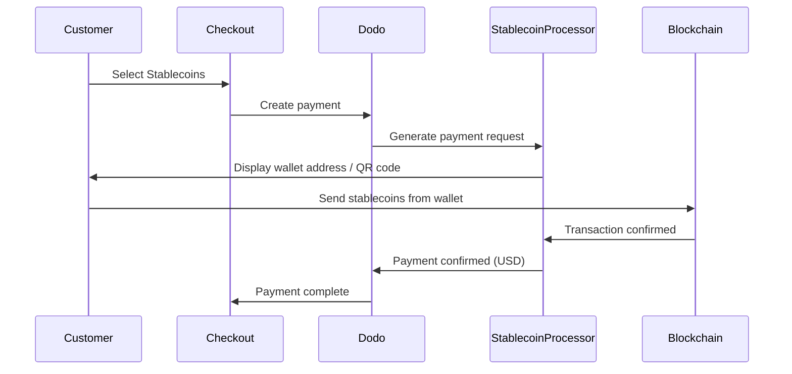

تسمح مدفوعات العملات المستقرة للعملاء بالدفع باستخدام العملات المستقرة من أي مكان في العالم (باستثناء الهند). يتم الفوترة بالدولار الأمريكي، لذلك تتلقى العملة الورقية بينما يدفع العملاء بمحفظتهم المفضلة من العملات المستقرة.

## لماذا تقديم العملات المستقرة؟

<CardGroup cols={3}>
<Card title="Global Reach" icon="globe">
قبول المدفوعات من أي بلد — لا حاجة للبنية التحتية المصرفية على جانب العميل.
</Card>

<Card title="No Chargebacks" icon="shield-check">
المعاملات بالعملات المستقرة غير قابلة للعكس، مما يقضي بشكل كلي على الاحتيال في استعادة المبالغ المدفوعة.
</Card>

<Card title="USD Settlement" icon="dollar-sign">
أنت تتلقى الدولار الأمريكي — لا حاجة لإدارة التقلبات أو المحافظ.
</Card>
</CardGroup>

## نظرة عامة

| التفاصيل | القيمة |
| :----- | :---- |
| **عملة الفوترة** | USD |
| **الدول المدعومة** | عالمية (باستثناء IN) |
| **الاشتراكات** | لا |
| **الحد الأدنى** | $0.50 |
| **التسوية** | USD |

## كيف تعمل



## تجربة العميل

1. يختار العميل العملات المستقرة عند الدفع
2. يتم عرض عنوان المحفظة ورمز QR مع المبلغ بالعملات المستقرة
3. يرسل العميل المبلغ المحدد من محفظة العملات المستقرة الخاصة به
4. يتم تأكيد المعاملة على البلوكشين
5. يتم إعادة توجيه العميل إلى صفحة النجاح

<Info>
يتم الفوترة بالعملات المستقرة بالدولار الأمريكي. المبلغ المعروض في الخروج يعكس سعر الصرف الفعلي في وقت الدفع.
</Info>

## العملات والشبكات المدعومة

| العملة | الشبكات |
| :------- | :------- |
| **USDC** | Ethereum, Solana, Polygon, Base |
| **USDP** | Ethereum, Solana |
| **USDG** | Ethereum |

## التكوين

```javascript
const session = await client.checkoutSessions.create({
  product_cart: [{ product_id: 'prod_123', quantity: 1 }],
  allowed_payment_method_types: ['crypto_currency', 'credit', 'debit'],
  return_url: 'https://example.com/success'
});
```

## نوع طريقة API

| النوع | الطريقة | البلد |
| :--- | :----- | :------ |
| `crypto_currency` | العملات المستقرة | عالمي (باستثناء IN) |

## الاختبار

<Steps>
<Step title="Enable test mode">
استخدم مفاتيح API الاختبارية من Dodo Payments الخاصة بك.
</Step>

<Step title="Create a test checkout">
إنشاء جلسة دفع باستخدام `crypto_currency` في طرق الدفع المسموحة.
</Step>

<Step title="Complete the test flow">
اتبع تدفق المدفوعات المستقرة المحاكية في بيئة الاختبار.
</Step>
</Steps>

## أفضل الممارسات

<AccordionGroup>
<Accordion title="Always include card fallbacks">
ليس كل العملاء لديهم محافظ العملات المستقرة. يجب دائمًا تضمين `credit` و `debit` كطرق دفع احتياطية.
</Accordion>

<Accordion title="Set clear expectations on confirmation time">
يمكن أن تستغرق تأكيدات البلوكشين دقائق حسب الشبكة. تأكد من أن الدفع يحث العملاء على هذا.
</Accordion>

<Accordion title="Handle underpayments and overpayments">
قد تختلف مدفوعات العملات المستقرة أحيانًا قليلاً عن المبلغ المحدد بسبب رسوم الشبكة. راقب أشياء الويب لتحديثات حالة الدفع.
</Accordion>
</AccordionGroup>

## استكشاف الأخطاء وإصلاحها

<AccordionGroup>
<Accordion title="Stablecoins not appearing at checkout">
**تحقق:**
1. هل تم تضمين `crypto_currency` في `allowed_payment_method_types`؟
2. هل مبلغ المعاملة يحقق الحد الأدنى ($0.50)؟

**الحل:** تأكد من تمرير نوع طريقة الدفع بشكل صحيح في طلب API الخاص بك.
</Accordion>

<Accordion title="Payment not confirming">
**السبب:** تختلف أوقات تأكيد البلوكشين. بعض الشبكات تستغرق وقتًا أطول من غيرها.

**الحل:** انتظر تأكيد الويب. لا تعامل الدفع على أنه فاشل حتى مرور نافذة التأكيد.
</Accordion>

<Accordion title="Amount mismatch">
**السبب:** قد تتسبب رسوم الشبكة في اختلاف المبلغ المستلم قليلاً عن المبلغ المطلوب.

**الحل:** راقب أشياء الويب للحصول على المبلغ النهائي المؤكد. يتم التعامل تلقائيًا مع الفروق الصغيرة.
</Accordion>
</AccordionGroup>

## الصفحات ذات الصلة

<CardGroup cols={2}>
<Card title="Payment Methods Overview" icon="credit-card" href="/features/payment-methods">
راجع جميع طرق الدفع المدعومة.
</Card>

<Card title="Checkout Guide" icon="book" href="/developer-resources/checkout-session">
دليل تنفيذ الخروج الكامل.
</Card>

<Card title="Webhooks" icon="webhook" href="/developer-resources/webhooks">
التعامل مع تأكيدات الدفع بشكل غير متزامن.
</Card>

<Card title="Testing Process" icon="flask" href="/miscellaneous/testing-process">
دليل الاختبار الكامل لجميع طرق الدفع.
</Card>
</CardGroup>
