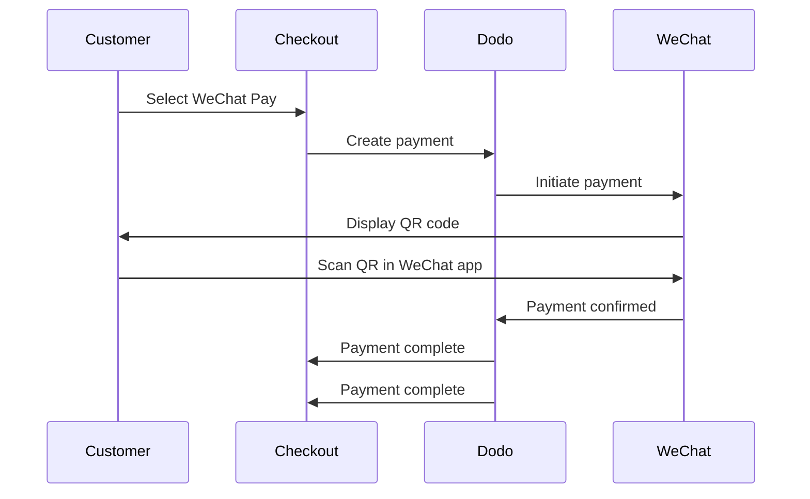

WeChat Pay هي واحدة من منصتين رئيسيتين للدفع عبر الهاتف المحمول في الصين، حيث يستخدمها أكثر من مليار شخص. تمكن من الدفع عبر رموز QR داخل تطبيق WeChat، مما يجعلها ضرورية للشركات التي تستهدف المستهلكين الصينيين.

## لماذا تقدم WeChat Pay؟

<CardGroup cols={3}>
<Card title="1B+ Users" icon="users">
WeChat Pay يستخدمها أكثر من مليار شخص، مما يجعلها واحدة من أكبر منصات الدفع في العالم.
</Card>

<Card title="Mobile-First" icon="mobile">
تُكمل عمليات الدفع بالكامل داخل تطبيق WeChat — سريع، مألوف، وبدون حواجز للعملاء الصينيين.
</Card>

<Card title="Dual Currency" icon="money-bill-transfer">
قبول الدفعات بالدولار الأمريكي واليوان، مما يوفر مرونة للمعاملات العابرة للحدود والمحلية.
</Card>
</CardGroup>

## نظرة عامة

| التفاصيل | القيمة |
| :----- | :---- |
| **عملة الفوترة** | USD, CNY |
| **الاشتراكات** | لا |
| **الحد الأدنى للمبلغ** | $0.50 / ¥1.00 |
| **التسوية** | USD |

## كيف تعمل



## تجربة العميل

1. يختار العميل WeChat Pay عند الدفع
2. يظهر رمز QR على صفحة الدفع
3. يفتح العميل تطبيق WeChat على هاتفه ويمسح رمز QR
4. يؤكد العميل الدفع في تطبيق WeChat
5. يتم تأكيد الدفع فورًا ويُعاد توجيه العميل إلى صفحة النجاح

<Info>
يدفع العملاء بالدولار الأمريكي أو اليوان، وتتلقى التسوية بالدولار الأمريكي.
</Info>

## الإعداد

```javascript
const session = await client.checkoutSessions.create({
  product_cart: [{ product_id: 'prod_123', quantity: 1 }],
  allowed_payment_method_types: ['we_chat_pay', 'credit', 'debit'],
  return_url: 'https://example.com/success'
});
```

## نوع طريقة API

| النوع | الطريقة | العملات |
| :--- | :----- | :--------- |
| `we_chat_pay` | WeChat Pay | USD, CNY |

## الاختبار

<Steps>
<Step title="Enable test mode">
استخدم مفاتيح API للاختبار من Dodo Payments.
</Step>

<Step title="Create a test checkout">
قم بإنشاء جلسة دفع باستخدام `we_chat_pay` في طرق الدفع المسموح بها.
</Step>

<Step title="Scan the QR code">
سيتم إنشاء رمز QR للاختبار — امسحه باستخدام كاميرا هاتفك العادية (لا حاجة لتطبيق WeChat). سيتم توجيهك إلى صفحة اختبار حيث يمكنك محاكاة نجاح أو فشل العملية.
</Step>
</Steps>

## أفضل الممارسات

<AccordionGroup>
<Accordion title="Target Chinese customers">
WeChat Pay يُستخدم بشكل أساسي من قبل المستهلكين الصينيين. ضمه عندما تتضمن قاعدة عملائك مشترين صينيين أو عند استهداف السوق الصيني.
</Accordion>

<Accordion title="Always include card fallbacks">
ليس كل العملاء لديهم WeChat. قم دائمًا بتضمين `credit` و `debit` كطرق دفع احتياطية.
</Accordion>

<Accordion title="Optimize for mobile">
كثير من مستخدمي WeChat Pay يتصفحون على الهواتف المحمولة. تأكد من أن صفحة الدفع مستجيبة — يعمل مسح رمز QR بشكل أفضل عند عرض الصفحة على سطح مكتب أو جهاز لوحي بينما يقوم العميل بالمسح بهاتفه.
</Accordion>

<Accordion title="Consider both currencies">
WeChat Pay يدعم كل من الدولار الأمريكي واليوان. اختر عملة الفوترة التي تناسب سوقك المستهدف — الدولار للمعاملات العابرة للحدود، واليوان للمعاملات المحلية الصينية.
</Accordion>
</AccordionGroup>

## استكشاف الأخطاء وإصلاحها

<AccordionGroup>
<Accordion title="WeChat Pay not appearing at checkout">
**تحقق:**
1. هل تم تضمين `we_chat_pay` في `allowed_payment_method_types`؟
2. هل تم تعيين عملة الفوترة على USD أو CNY؟
3. هل المبلغ يفي بالحد الأدنى؟

**الحل:** تحقق من أن نوع طريقة الدفع والعملة قد تم تمريرهما بشكل صحيح في طلب API الخاص بك.
</Accordion>

<Accordion title="QR code not scanning">
**السبب:** قد يكون رمز QR قد انتهت صلاحيته، أو إصدار WeChat الخاص بالعميل قديم.

**الحل:** قم بتحديث صفحة الدفع لإنشاء رمز QR جديد. تأكد من أن العميل يستخدم الإصدار الحالي من WeChat.
</Accordion>

<Accordion title="Payment not confirming">
**السبب:** يؤكد WeChat Pay عادة على الفور، لكن قد تحدث تأخيرات في الشبكة.

**الحل:** قم بمراقبة الحلقات الشبكية لتأكيد الدفع. إذا لم يتم تأكيد الدفع في غضون بضع دقائق، قد يحتاج العميل إلى المحاولة مرة أخرى.
</Accordion>
</AccordionGroup>

## الصفحات ذات الصلة

<CardGroup cols={2}>
<Card title="Payment Methods Overview" icon="credit-card" href="/features/payment-methods">
اطلع على جميع طرق الدفع المدعومة.
</Card>

<Card title="Checkout Guide" icon="book" href="/developer-resources/checkout-session">
دليل إتمام تنفيذ عملية الدفع.
</Card>

<Card title="Webhooks" icon="webhook" href="/developer-resources/webhooks">
التعامل مع تأكيدات الدفع بشكل غير متزامن.
</Card>

<Card title="Testing Process" icon="flask" href="/miscellaneous/testing-process">
دليل اختبار كامل لجميع طرق الدفع.
</Card>
</CardGroup>
