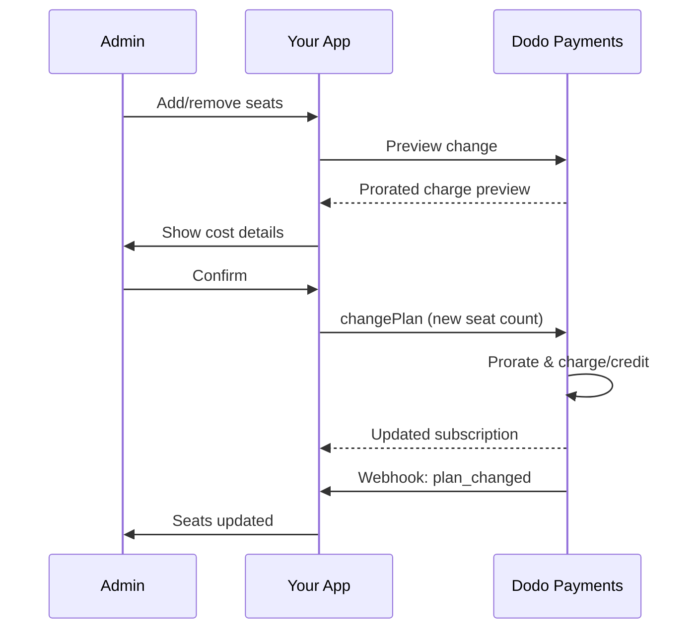

<Info>
تتيح لك الفوترة المعتمدة على المقاعد فرض رسوم على العملاء بناءً على عدد المستخدمين أو أعضاء الفريق أو التراخيص التي يحتاجونها. إنها نموذج التسعير القياسي لأدوات التعاون بين الفرق، والبرامج المؤسسية، ومنتجات SaaS B2B.
</Info>

<CardGroup cols={2}>
<Card title="دليل التنفيذ" icon="code" href="/developer-resources/seat-based-pricing">
  دليل خطوة بخطوة مع أمثلة على الشيفرة.
</Card>

<Card title="وثائق الإضافات" icon="puzzle" href="/features/addons">
  تعرف على نظام الإضافات الذي يدعم الفوترة المعتمدة على المقاعد.
</Card>

<Card title="إدارة الاشتراكات" icon="repeat" href="/features/subscription">
  إدارة الاشتراكات المعتمدة على المقاعد وتغييرات الخطط.
</Card>

<Card title="الويب هوكس" icon="bell" href="/developer-resources/webhooks/intents/subscription">
  تتبع تغييرات المقاعد باستخدام الويب هوكس للاشتراكات.
</Card>
</CardGroup>

---

## ما هي الفوترة المعتمدة على المقاعد؟

تفرض الفوترة المعتمدة على المقاعد (المعروفة أيضًا بالتسعير لكل مستخدم أو لكل مقعد) رسومًا على العملاء بناءً على عدد المستخدمين الذين يصلون إلى منتجك. بدلاً من رسم ثابت، يتزايد السعر مع حجم الفريق.

### حالات الاستخدام الشائعة

| الصناعة | المثال | نموذج التسعير |
|----------|---------|---------------|
| تعاون الفرق | Slack، Notion، Asana | لكل مستخدم نشط/شهر |
| أدوات المطورين | GitHub، GitLab، Jira | لكل مقعد/شهر |
| برامج إدارة علاقات العملاء | Salesforce، HubSpot | لكل ترخيص مستخدم |
| أدوات التصميم | Figma، Canva | لكل مقعد محرر |
| برامج الأمان | 1Password، Okta | لكل مستخدم/شهر |
| مؤتمرات الفيديو | Zoom، Teams | لكل ترخيص مضيف |

### فوائد التسعير المعتمد على المقاعد

**لعملك:**
- تتزايد الإيرادات بشكل طبيعي مع نمو العملاء
- تسعير يمكن التنبؤ به يمكن للعملاء وضع ميزانية له
- مسار ترقية واضح من الفرد إلى الفريق إلى المؤسسة
- قيمة عمرية أعلى مع توسع الفرق

**لعملائك:**
- الدفع فقط مقابل ما يستخدمونه
- سهل الفهم وتوقع التكاليف
- مرونة لإضافة/إزالة المستخدمين حسب الحاجة
- تسعير عادل يتناسب مع حجم الفريق

---

## كيف تعمل الفوترة المعتمدة على المقاعد في Dodo Payments

تقوم Dodo Payments بتنفيذ الفوترة المعتمدة على المقاعد باستخدام نظام **الإضافات**. إليك كيف يعمل:

### نظرة عامة على الهيكلية

تكلفة اشتراك Team Pro هي 99 دولارًا شهريًا وتتضمن 5 مقاعد. إذا كان لديك أكثر من 5 مستخدمين، سوف تدفع مبلغًا إضافيًا قدره 15 دولارًا شهريًا عن كل مقعد إضافي.

على سبيل المثال، إذا كانت فريقك يحتاج إلى 15 مقعدًا:
- الخطة الأساسية: 99 دولارًا شهريًا (تشمل 5 مقاعد)
- الإضافات: 10 مقاعد إضافية × 15 دولارًا شهريًا = 150 دولارًا شهريًا
- إجمالي التكلفة الشهرية: 99 + 150 = 249 دولارًا لـ 15 مقعدًا

### المكونات الرئيسية

| المكون | الغرض | المثال |
|-----------|---------|---------|
| المنتج الأساسي | الاشتراك الأساسي مع المقاعد المضمنة | "خطة الفريق - 99 دولارًا/شهر (5 مقاعد مضمنة)" |
| إضافة المقعد | رسوم لكل مقعد لمستخدمين إضافيين | "مقعد إضافي - 15 دولارًا/شهر لكل" |
| الكمية | عدد المقاعد الإضافية المشتراة | 10 مقاعد إضافية |

---

## استراتيجيات التسعير

اختر استراتيجية التسعير المعتمدة على المقاعد التي تناسب عملك:

### الاستراتيجية 1: خطة أساسية + إضافة لكل مقعد

قم بتضمين عدد محدد من المقاعد في الخطة الأساسية، وفرض رسوم على المقاعد الإضافية.

**مثال:**

```
Starter Plan: $49/month
├── Includes: 3 seats
├── Extra seats: $10/month each
└── 8 total seats = $49 + (5 × $10) = $99/month
```

**الأفضل لـ:** المنتجات التي يمكن أن تعمل فيها الفرق الصغيرة مع العرض الأساسي.

### الاستراتيجية 2: تسعير لكل مقعد فقط

فرض رسوم ثابتة لكل مقعد دون رسوم أساسية.

**مثال:**

```
Per User: $12/month
├── 5 users = $60/month
├── 20 users = $240/month
└── 100 users = $1,200/month
```

**التنفيذ:** تعيين سعر الخطة الأساسية إلى 0 دولار، واستخدام إضافة المقعد فقط.

**الأفضل لـ:** تسعير بسيط وشفاف؛ نماذج قائمة على الاستخدام.

### الاستراتيجية 3: تسعير مقاعد متدرجة

خطط أساسية مختلفة مع معدلات مختلفة لكل مقعد.

**مثال:**

```
Starter: $0/month base + $15/seat
├── Lower features, higher per-seat cost

Professional: $99/month base + $10/seat
├── More features, lower per-seat cost

Enterprise: $499/month base + $7/seat
└── All features, volume discount on seats
```

**التنفيذ:** إنشاء منتجات منفصلة لكل مستوى مع أسعار إضافات مختلفة.

**الأفضل لـ:** تشجيع الترقيات إلى مستويات أعلى؛ مبيعات المؤسسات.

### الاستراتيجية 4: حزم المقاعد

بيع المقاعد في حزم بدلاً من فردية.

**مثال:**

```
5-Seat Pack: $50/month ($10/seat)
10-Seat Pack: $80/month ($8/seat)
25-Seat Pack: $175/month ($7/seat)
```

**التنفيذ:** إنشاء إضافات متعددة لأحجام الحزم المختلفة.

**الأفضل لـ:** تبسيط قرارات الشراء؛ تشجيع الالتزامات الأكبر.

---

## إعداد الفوترة المعتمدة على المقاعد

### الخطوة 1: خطط لتسعيرك

قبل التنفيذ، حدد هيكل التسعير الخاص بك:

<Steps>
<Step title="حدد الخطة الأساسية">
قرر ما هو مضمن في الاشتراك الأساسي:
- السعر الأساسي (يمكن أن يكون 0 دولار للتسعير لكل مقعد فقط)
- عدد المقاعد المضمنة
- الميزات المتاحة في هذه الفئة
</Step>

<Step title="حدد تسعير المقاعد">
حدد تكلفة الإضافة لكل مقعد:
- السعر لكل مقعد إضافي
- أي خصومات على الكمية (عبر إضافات متعددة)
- الحد الأقصى للمقاعد المسموح بها (إذا كان ذلك مناسبًا)
</Step>

<Step title="اعتبر تكرار الفوترة">
قم بمحاذاة تسعير المقاعد مع دورة الفوترة الخاصة بك:
- الاشتراكات الشهرية → رسوم المقاعد الشهرية
- الاشتراكات السنوية → رسوم المقاعد السنوية (غالبًا ما تكون مخفضة)
</Step>
</Steps>

### الخطوة 2: إنشاء إضافة المقعد

في لوحة معلومات Dodo Payments الخاصة بك:

1. انتقل إلى **المنتجات** → **الإضافات**
2. انقر على **إنشاء إضافة**
3. قم بتكوين الإضافة:

| الحقل | القيمة | الملاحظات |
|-------|-------|-------|
| الاسم | "مقعد إضافي" أو "عضو فريق" | اسم واضح وسهل الاستخدام |
| الوصف | "أضف عضو فريق آخر إلى مساحة العمل الخاصة بك" | اشرح ما يحصل عليه العملاء |
| السعر | سعر المقعد الخاص بك | على سبيل المثال، 10.00 دولار |
| العملة | تطابق منتجك الأساسي | يجب أن تكون نفس العملة |
| فئة الضريبة | نفس المنتج الأساسي | يضمن معالجة ضريبية متسقة |

<Tip>
قم بإنشاء أسماء إضافات وصفية تتناسب مع الفواتير. "مقعد فريق إضافي" أوضح من "إضافة مقعد" للعملاء الذين يراجعون فواتيرهم.
</Tip>

### الخطوة 3: إنشاء الاشتراك الأساسي

قم بإنشاء منتج الاشتراك الخاص بك:

1. انتقل إلى **المنتجات** → **إنشاء منتج**
2. اختر **اشتراك**
3. قم بتكوين التسعير والتفاصيل
4. في قسم **الإضافات**، قم بإرفاق إضافة المقعد الخاصة بك

### الخطوة 4: ربط الإضافة بالمنتج

قم بربط إضافة المقعد باشتراكك:

1. قم بتحرير منتج الاشتراك الخاص بك
2. انتقل إلى قسم **الإضافات**
3. انقر على **إضافة إضافات**
4. اختر إضافة المقعد الخاصة بك
5. احفظ التغييرات

<Check>
الآن يدعم منتج الاشتراك الخاص بك التسعير المعتمد على المقاعد. يمكن للعملاء شراء أي كمية من المقاعد الإضافية أثناء الخروج.
</Check>

---

## إدارة المقاعد

### إضافة مقاعد للاشتراكات الجديدة

عند إنشاء جلسة الخروج، حدد كمية المقاعد:

```typescript
const session = await client.checkoutSessions.create({
  product_cart: [{
    product_id: 'prod_team_plan',
    quantity: 1,
    addons: [{
      addon_id: 'addon_seat',
      quantity: 10  // 10 additional seats
    }]
  }],
  customer: { email: 'admin@company.com' },
  return_url: 'https://yourapp.com/success'
});
```

### تغيير عدد المقاعد في الاشتراكات الحالية

استخدم واجهة برمجة التطبيقات لتغيير الخطة لضبط المقاعد:

```typescript
// Add 5 more seats to existing subscription
await client.subscriptions.changePlan('sub_123', {
  product_id: 'prod_team_plan',
  quantity: 1,
  proration_billing_mode: 'prorated_immediately',
  addons: [{
    addon_id: 'addon_seat',
    quantity: 15  // New total: 15 additional seats
  }]
});
```

### إزالة المقاعد

لتقليل عدد المقاعد، حدد الكمية الأقل:

```typescript
// Reduce from 15 to 8 additional seats
await client.subscriptions.changePlan('sub_123', {
  product_id: 'prod_team_plan',
  quantity: 1,
  proration_billing_mode: 'difference_immediately',
  addons: [{
    addon_id: 'addon_seat',
    quantity: 8  // Reduced to 8 additional seats
  }]
});
```

### إزالة جميع المقاعد الإضافية

مرر مصفوفة إضافات فارغة لإزالة جميع الإضافات:

```typescript
// Remove all additional seats, keep only base plan seats
await client.subscriptions.changePlan('sub_123', {
  product_id: 'prod_team_plan',
  quantity: 1,
  proration_billing_mode: 'difference_immediately',
  addons: []  // Removes all add-ons
});
```

---

## التقسيم لتغييرات المقاعد

عندما يضيف العملاء أو يزيلون المقاعد في منتصف الدورة، يحدد التقسيم كيفية فرض الرسوم عليهم.



### أوضاع القسمة

| الوضع | إضافة مقاعد | إزالة مقاعد |
|------|-------------|----------------|
| `prorated_immediately` | تحصيل رسوم للأيام المتبقية في الدورة | ائتمان للأيام غير المستخدمة |
| `difference_immediately` | تحصيل سعر المقعد الكامل | ائتمان يُطبق على التجديدات المستقبلية |
| `full_immediately` | تحصيل سعر المقعد الكامل، إعادة تعيين دورة الفوترة | لا يوجد ائتمان |

### أمثلة على القسمة

**السيناريو: 15 يومًا متبقية في دورة الفوترة، إضافة 5 مقاعد بسعر 10 دولارات لكل مقعد**

<Tabs>
<Tab title="prorated_immediately">

```
Prorated charge = ($10 × 5 seats) × (15 days / 30 days)
                = $50 × 0.5
                = $25 immediate charge
```

العميل يدفع 25 دولارًا الآن، ثم 50 دولارًا شهريًا عند التجديد.
</Tab>

<Tab title="difference_immediately">

```
Immediate charge = $10 × 5 seats = $50
```

العميل يدفع كامل 50 دولارًا الآن، بغض النظر عن موقع الدورة.
</Tab>

<Tab title="full_immediately">

```
Immediate charge = Full subscription + add-ons
Billing cycle resets to today
```

العميل يدفع المبلغ الكامل، وتبدأ دورة الفوترة الجديدة.
</Tab>
</Tabs>

**السيناريو: إزالة 3 مقاعد في منتصف الدورة مع proration_immediately**

```
Current: Team Plan ($99/month) + 10 extra seats × $10/seat = $199/month
Change: Remove 3 seats (10 → 7 extra seats) on day 20 of 30-day cycle
Remaining: 10 days

Credit for removed seats:
  = ($10 × 3 seats) × (10 days / 30 days)
  = $30 × 0.333
  = $10.00 credit

→ $10.00 credit added to subscription
→ Next renewal: $99 + (7 × $10) = $169.00/month
→ Credit auto-applies: $169.00 − $10.00 = $159.00 on next invoice
```

<Tip>
**اختيار وضع القسمة لتغييرات المقاعد**: استخدم `prorated_immediately` لفوترة عادلة تعتمد على الأيام عند قيام الفرق بالتعديل المتكرر على المقاعد. استخدم `difference_immediately` للرياضيات الأبسط التي تحصُّل أو تُالغي overpricedprice بشكل كامل. راجع [دليل القسمة](/developer-resources/subscription-upgrade-downgrade#proration-modes) لمقارنات مفصلة.
</Tip>

### معاينة قبل التغيير

دائمًا يتم معاينة القسمة قبل إجراء تغييرات:

```typescript
const preview = await client.subscriptions.previewChangePlan('sub_123', {
  product_id: 'prod_team_plan',
  quantity: 1,
  proration_billing_mode: 'prorated_immediately',
  addons: [{ addon_id: 'addon_seat', quantity: 20 }]
});

console.log('Immediate charge:', preview.immediate_charge.summary);
// Show customer: "Adding 5 seats will cost $25 today"
```

---

## تتبع المقاعد باستخدام Webhooks

راقب تغييرات المقاعد من خلال الاستماع إلى Webhooks الاشتراك:

### الأحداث ذات الصلة

| الحدث | عند تشغيله | حالة الاستخدام |
|-------|----------------|----------|
| `subscription.active` | تم تفعيل اشتراك جديد | توفير المقاعد الأولية |
| `subscription.plan_changed` | تمت إضافة/إزالة المقاعد | تحديث عدد المقاعد في تطبيقك |
| `subscription.renewed` | تم تجديد الاشتراك | تأكيد عدم تغيير عدد المقاعد |
| `subscription.cancelled` | تم إلغاء الاشتراك | إلغاء جميع المقاعد |

### مثال معالج Webhook

```typescript
app.post('/webhooks/dodo', async (req, res) => {
  const event = req.body;

  switch (event.type) {
    case 'subscription.active':
      // New subscription - provision seats
      const seats = calculateTotalSeats(event.data);
      await provisionSeats(event.data.customer_id, seats);
      break;

    case 'subscription.plan_changed':
      // Seats changed - update access
      const newSeats = calculateTotalSeats(event.data);
      await updateSeatCount(event.data.subscription_id, newSeats);
      break;

    case 'subscription.cancelled':
      // Subscription cancelled - deprovision
      await deprovisionAllSeats(event.data.subscription_id);
      break;
  }

  res.json({ received: true });
});

function calculateTotalSeats(subscriptionData) {
  const baseSeats = 5;  // Included in plan
  const addonSeats = subscriptionData.addons?.reduce(
    (total, addon) => total + addon.quantity, 0
  ) || 0;
  return baseSeats + addonSeats;
}
```

---

## تطبيق حدود المقاعد

يجب على تطبيقك تطبيق حدود المقاعد. تقوم Dodo Payments بتعقب الفوترة، ولكنك تتحكم في الوصول.

### استراتيجيات إنفاذ

<Tabs>
<Tab title="حد صارم">
يمنع بشكل صارم إضافة مستخدمين متجاوزين لعدد المقاعد.

```typescript
async function inviteUser(teamId: string, email: string) {
  const team = await getTeam(teamId);
  const subscription = await getSubscription(team.subscriptionId);
  const totalSeats = calculateTotalSeats(subscription);
  const usedSeats = await countTeamMembers(teamId);

  if (usedSeats >= totalSeats) {
    throw new Error('No seats available. Please upgrade your plan.');
  }

  await sendInvitation(teamId, email);
}
```

</Tab>

<Tab title="حد مرن مع تحذير">
يسمح بالتجاوز مع تحذير وفترة سماح.

```typescript
async function inviteUser(teamId: string, email: string) {
  const team = await getTeam(teamId);
  const { totalSeats, usedSeats } = await getSeatInfo(team);

  if (usedSeats >= totalSeats) {
    // Allow but flag for billing
    await flagOverage(teamId, usedSeats - totalSeats + 1);
    await notifyAdmin(team.adminEmail, 'You have exceeded your seat limit');
  }

  await sendInvitation(teamId, email);
}
```

</Tab>

<Tab title="ترقية تلقائية">
تضيف المقاعد تلقائيًا عند بلوغ الحد.


```typescript
async function inviteUser(teamId: string, email: string) {
  const team = await getTeam(teamId);
  const { totalSeats, usedSeats, subscriptionId } = await getSeatInfo(team);

  if (usedSeats >= totalSeats) {
    // Automatically add a seat
    await client.subscriptions.changePlan(subscriptionId, {
      product_id: team.productId,
      quantity: 1,
      proration_billing_mode: 'prorated_immediately',
      addons: [{ addon_id: 'addon_seat', quantity: totalSeats - baseSeats + 1 }]
    });

    await notifyAdmin(team.adminEmail, 'A new seat was added to your plan');
  }

  await sendInvitation(teamId, email);
}
```

</Tab>
</Tabs>

---

## أنماط متقدمة

### أنواع المقاعد المختلفة

قدم أنواعًا مختلفة من المقاعد مع تسعير مختلف:

```
Full Seats: $20/month - Full access to all features
View-Only Seats: $5/month - Read-only access
Guest Seats: $0/month - Limited external collaborator access
```

**التنفيذ:** إنشاء إضافات منفصلة لكل نوع من أنواع المقاعد.

```typescript
const session = await client.checkoutSessions.create({
  product_cart: [{
    product_id: 'prod_team_plan',
    quantity: 1,
    addons: [
      { addon_id: 'addon_full_seat', quantity: 10 },
      { addon_id: 'addon_viewer_seat', quantity: 25 },
      { addon_id: 'addon_guest_seat', quantity: 50 }
    ]
  }]
});
```

### خصومات المقاعد السنوية

قدم تسعير مقاعد سنوية مخفضة:

```
Monthly: $15/seat/month
Annual: $12/seat/month (20% savings)
```

**التنفيذ:** إنشاء منتجات منفصلة للخطط الشهرية والسنوية بأسعار إضافية مختلفة.

### متطلبات الحد الأدنى للمقاعد

يتطلب عددًا أدنى من المقاعد لبعض الخطط:

```typescript
async function validateSeatCount(planId: string, seatCount: number) {
  const minimums = {
    'prod_starter': 1,
    'prod_team': 5,
    'prod_enterprise': 25
  };

  if (seatCount < minimums[planId]) {
    throw new Error(`${planId} requires at least ${minimums[planId]} seats`);
  }
}
```

---

## ممارسات أفضل

### ممارسات التسعير الأفضل

- **التواصل الواضح**: عرض تسعير المقعد بشكل بارز على صفحة التسعير الخاصة بك
- **المقاعد المتضمنة**: فكر في تضمين بعض المقاعد في السعر الأساسي لتقليل الاحتكاك
- **خصومات على الحجم**: قدم أسعارًا منخفضة لكل مقعد للفرق الكبيرة للفوز بعقود المؤسسات
- **حوافز سنوية**: تخفيض الخطط السنوية لتحسين تدفق الأموال والاحتفاظ بالعملاء

### ممارسات تقنية أفضل

- **تخزين عدد المقاعد**: تخزين أعداد المقاعد للاشتراك محليًا لتجنب مكالمات API في كل طلب
- **مزامنة بانتظام**: مزامنة عدد المقاعد المحلية مع Dodo Payments عبر API بشكل دوري
- **التعامل مع الفشل**: إذا فشل تغيير المقعد، أظهر رسائل خطأ واضحة وخيارات إعادة المحاولة
- **مسار التدقيق**: تسجيل جميع تغييرات المقاعد للنزاعات الفواتيرية والامتثال

### ممارسات تجربة المستخدم الأفضل

- **تغذية راجعة فورية**: عرض التأثير الفوري للتكلفة عند ضبط المقاعد
- **خطوات التأكيد**: طلب التأكيد قبل تغييرات الفوترة
- **شفافية القسمة**: شرح واضح للرسوم المقسمة قبل التطبيق
- **تخفيضات سهلة**: عدم جعل تقليل المقاعد صعبًا (إنه يبني الثقة)

---

## استكشاف الأخطاء وإصلاحها

<AccordionGroup>
<Accordion title="عدم تطابق عدد المقاعد بين التطبيق والفوترة">
**العراضة**: يظهر تطبيقك عدد مقاعد مختلف عن الاشتراك.

**الأسباب**:
- لم يتم استقبال أو معالجة الويب هوك
- حالة سباق أثناء تغيير المقعد
- البيانات المخبأة لم يتم تحديثها

**الحلول**:
1. تنفيذ معالجات الويب هوك لـ `subscription.plan_changed`
2. إضافة زر "التزامن مع الفوترة" الذي يجلب الاشتراك الحالي
3. تعيين TTL للتخزين المؤقت لضمان التحديث المنتظم
</Accordion>

<Accordion title="رسوم القسمة غير المتوقعة">
**العراضة**: عميل مرتبك بسبب مبلغ الشحنة في منتصف الدورة.

**الأسباب**:
- وضع القسمة لم يتم توصيله بوضوح
- لم ير العميل المعاينة قبل التأكيد

**الحلول**:
1. استخدام دائمًا `previewChangePlan` قبل إجراء تغييرات
2. عرض تفصيل واضح: "إضافة مقاعد X = $Y اليوم (مقسم لـ Z أيام)"
3. توثيق سياسة القسمة في مركز المساعدة
</Accordion>

<Accordion title="الإضافة غير ظاهرة في الدفع">
**العراضة**: إضافة المقعد غير متاحة أثناء الدفع.

**الأسباب**:
- الإضافة غير متصلة بالمنتج
- الإضافة أرشيفية أو محذوفة
- عدم توافق العملة بين المنتج والإضافة

**الحلول**:
1. تحقق من أن الإضافة متصلة في إعدادات المنتج
2. تحقق من حالة الإضافة في لوحة التحكم للإضافات
3. تأكد من توافق العملات بدقة
</Accordion>

<Accordion title="لا يمكن تقليل المقاعد تحت الاستخدام الحالي">
**العراضة**: طالب العميل بتقليل المقاعد لكن لديه مستخدمون معينون.

**الحلول**:
1. أظهر أي مستخدمون يجب إزالتهم قبل تقليل المقاعد
2. تنفيذ سير عمل: إزالة المستخدمون → تقليل المقاعد
3. فكر في فترة سماح قبل تطبيق تقليل المقاعد
</Accordion>
</AccordionGroup>

---

## الوثائق ذات الصلة

<CardGroup cols={2}>
<Card title="دليل تسعير يعتمد على المقاعد" icon="code" href="/developer-resources/seat-based-pricing">
  دليل تنفيذ كامل مع كود.
</Card>

<Card title="الإضافات" icon="puzzle" href="/features/addons">
  فهم نظام الإضافات بعمق.
</Card>

<Card title="تغييرات الخطط والقسمة" icon="arrows-rotate" href="/developer-resources/subscription-upgrade-downgrade">
  التعامل مع تعديلات الاشتراك.
</Card>

<Card title="Webhooks الاشتراك" icon="bell" href="/developer-resources/webhooks/intents/subscription">
  تتبع أحداث الاشتراك.
</Card>
</CardGroup>
