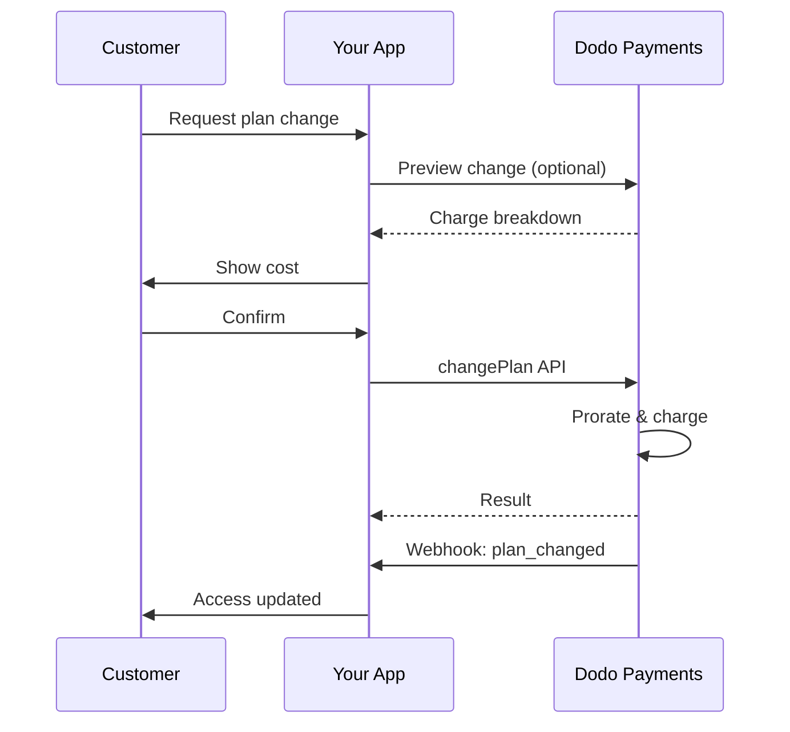
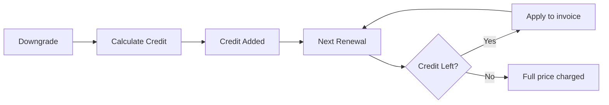
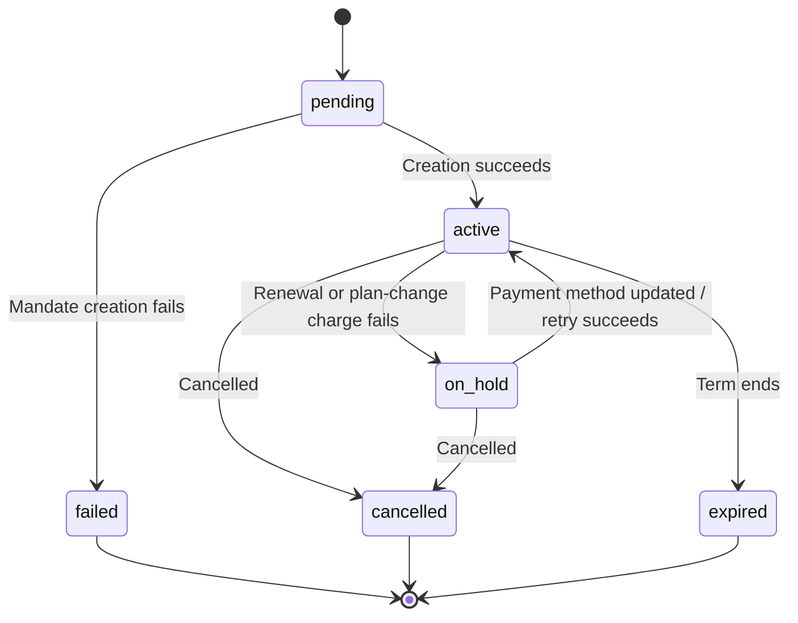

<Info>
تتيح الاشتراكات لك بيع وصول مستمر مع تجديدات آلية. استخدم دورات فوترة مرنة، تجارب مجانية، تغييرات الخطة، والإضافات لتخصيص التسعير لكل عميل.
</Info>

<CardGroup cols={2}>
<Card title="Upgrade & Downgrade" icon="repeat" href="/developer-resources/subscription-upgrade-downgrade">
تحكم في تغييرات الخطة باستخدام النسبة وتحديثات الكمية.
</Card>

<Card title="On‑Demand Subscriptions" icon="bolt" href="/developer-resources/ondemand-subscriptions">
فوض تفويضًا الآن وادفع لاحقًا بمبالغ مخصصة.
</Card>

<Card title="Customer Portal" icon="id-card" href="/features/customer-portal">
دع العملاء يديرون الخطط والفوترة والإلغاءات.
</Card>

<Card title="Subscription Webhooks" icon="code" href="/developer-resources/webhooks/intents/subscription">
تفاعل مع أحداث دورة الحياة مثل الإنشاء والتجديد والإلغاء.
</Card>
</CardGroup>

## ما هي الاشتراكات؟

الاشتراكات هي منتجات متكررة يشتريها العملاء وفق جدول زمني. إنها مثالية لـ:

- **ترخيص SaaS**: التطبيقات، واجهات برمجة التطبيقات، أو الوصول إلى المنصات
- **العضويات**: المجتمعات، البرامج، أو الأندية
- **المحتوى الرقمي**: الدورات، الوسائط، أو المحتوى المتميز
- **خطط الدعم**: اتفاقيات مستوى الخدمة، حزم النجاح، أو الصيانة

## الفوائد الرئيسية

- **إيرادات متوقعة**: فواتير متكررة مع تجديدات تلقائية
- **دورات مرنة**: شهرية، سنوية، فترات مخصصة، وتجارب
- **مرونة الخطط**: تقسيط للترقيات والتخفيضات
- **إضافات ومقاعد**: أضف ترقيات اختيارية وقابلة للقياس
- **تجربة دفع سلسة**: دفع مستضاف وبوابة العملاء
- **موجه للمطورين**: واجهات برمجة تطبيقات واضحة لإنشاء، تغييرات، وتتبع الاستخدام

## إنشاء الاشتراكات

قم بإنشاء منتجات الاشتراك في لوحة معلومات مدفوعات Dodo الخاصة بك، ثم قم ببيعها من خلال الدفع أو واجهة برمجة التطبيقات الخاصة بك. يفصل المنتجات عن الاشتراكات النشطة مما يتيح لك إصدار أسعار، إرفاق إضافات، وتتبع الأداء بشكل مستقل.

### إنشاء منتج الاشتراك

قم بتكوين الحقول في لوحة المعلومات لتعريف كيفية بيع اشتراكك، تجديده، وفوترة. الأقسام أدناه تتطابق مباشرة مع ما تراه في نموذج الإنشاء.

#### تفاصيل المنتج

- **اسم المنتج** (مطلوب): الاسم المعروض في الدفع، بوابة العملاء، والفواتير.
- **وصف المنتج** (مطلوب): بيان قيمة واضح يظهر في الدفع والفواتير.
- **صورة المنتج** (مطلوب): PNG/JPG/WebP حتى 3 ميغابايت. تستخدم في الدفع والفواتير.
- **العلامة التجارية**: ربط المنتج بعلامة تجارية معينة للتصميم والبريد الإلكتروني.
- **فئة الضريبة** (مطلوب): اختر الفئة (على سبيل المثال، SaaS) لتحديد قواعد الضريبة.

<Tip>
اختر فئة الضريبة الأكثر دقة لضمان جمع الضريبة الصحيح لكل منطقة.
</Tip>

#### التسعير

- **نوع التسعير**: اختر <b>الاشتراك</b> (هذا الدليل). البدائل هي الدفع الفردي والفوترة بناءً على الاستخدام.
- **السعر** (إلزامي): السعر الأساسي المتكرر مع العملة. يجب أن يكون السعر على الأقل **$1** (أو ما يعادله في العملة المختارة). لا تدعم المبالغ الأقل من هذا الحد الأدنى ولن يعمل الاشتراك.
- **الخصم المطبق (%)**: خصم اختياري بالنسبة المئوية يُطبق على السعر الأساسي؛ يُعكس في الدفع والفواتير.
- **تكرار الدفع كل** (إلزامي): الفاصل الزمني للتجديدات، مثل كل 1 شهر. حدد التواتر (أشهر أو سنوات) والكمية.
- **مدة الاشتراك** (إلزامي): المدة الإجمالية لبقاء الاشتراك نشطًا (مثل 10 سنوات). بعد انتهاء هذه الفترة، تتوقف التجديدات ما لم يتم تمديدها.
- **أيام فترة التجريب** (إلزامي): حدد طول الفترة التجريبية بالأيام. استخدم 0 لتعطيل الفترات التجريبية. يتم الخصم الأول تلقائيًا عند انتهاء الفترة التجريبية.
- **حدد الإضافة**: إرفاق ما يصل إلى 10 إضافات يمكن للعملاء شراؤها مع الخطة الأساسية.

<Warning>
يؤثر تغيير التسعير على منتج نشط على المشتريات الجديدة. تتبع الاشتراكات الحالية إعدادات تغيير الخطة والنسبة الخاصة بك.
</Warning>

<Info>
الإضافات مثالية للميزات القابلة للقياس مثل المقاعد أو التخزين. يمكنك التحكم في الكميات المسموح بها وسلوك النسبة عندما يغيرها العملاء.
</Info>

#### الإعدادات المتقدمة

- **تسعير شامل للضرائب**: عرض الأسعار شاملة الضرائب المطبقة. لا يزال حساب الضريبة النهائي يختلف حسب موقع العميل.
- **إنشاء مفاتيح الترخيص**: إصدار مفتاح فريد لكل عميل بعد الشراء. راجع دليل <a href="/features/license-keys">مفاتيح الترخيص</a>.
- **تسليم المنتج الرقمي**: تسليم الملفات أو المحتوى تلقائيًا بعد الشراء. تعرف على المزيد في <a href="/features/digital-product-delivery">تسليم المنتج الرقمي</a>.
- **البيانات الوصفية**: إرفاق أزواج مفتاح-قيمة مخصصة للتصنيف الداخلي أو تكاملات العملاء. راجع <a href="/api-reference/metadata">البيانات الوصفية</a>.

<Tip>
استخدم البيانات الوصفية لتخزين المعرفات من نظامك (على سبيل المثال accountId) حتى تتمكن من تسوية الأحداث والفواتير لاحقًا.
</Tip>

## تجارب الاشتراك

تتيح التجارب للعملاء الوصول إلى الاشتراكات دون دفع فوري. يتم فرض الرسوم الأولى تلقائيًا عند انتهاء التجربة.

### تكوين التجارب

قم بتعيين **أيام الفترة التجريبية** في قسم تسعير المنتج (استخدم `0` لتعطيلها). يمكنك تجاوز هذا عند إنشاء الاشتراكات:

```typescript
// Via subscription creation
const subscription = await client.subscriptions.create({
  customer_id: 'cus_123',
  product_id: 'prod_monthly',
  trial_period_days: 14  // Overrides product's trial period
});

// Via checkout session
const session = await client.checkoutSessions.create({
  product_cart: [{ product_id: 'prod_monthly', quantity: 1 }],
  subscription_data: { trial_period_days: 14 }
});
```

<Warning>
يجب أن تكون القيمة `trial_period_days` بين 0 و10,000 يوم.
</Warning>

### اكتشاف حالة التجربة

<Warning>
حاليًا لا يوجد حقل مباشر لاكتشاف حالة الفترة التجريبية. الحل البديل التالي يتطلب استعلامًا عن المدفوعات، وهو أمر غير فعال. نحن نعمل على حل أكثر كفاءة.
</Warning>

لتحديد ما إذا كان الاشتراك في فترة تجربة، استرجع قائمة المدفوعات للاشتراك. إذا كان هناك دفعة واحدة فقط بمبلغ 0، فإن الاشتراك في فترة التجربة:

```typescript
const subscription = await client.subscriptions.retrieve('sub_123');
const payments = await client.payments.list({
  subscription_id: subscription.subscription_id
});

// Check if subscription is in trial
const isInTrial = payments.items.length === 1 && 
                  payments.items[0].total_amount === 0;
```

### تحديث فترة التجربة

مدد الفترة التجريبية بتحديث `next_billing_date`:

```typescript
await client.subscriptions.update('sub_123', {
  next_billing_date: '2025-02-15T00:00:00Z'  // New trial end date
});
```

<Warning>
لا يمكنك تعيين `next_billing_date` إلى وقت ماضي. يجب أن يكون التاريخ في المستقبل.
</Warning>

## تغييرات خطة الاشتراك

تسمح لك تغييرات الخطة بالترقية أو التخفيض للاشتراكات، تعديل الكميات، أو الانتقال إلى منتجات مختلفة. اعتمادًا على وضع التقسيم الذي تختاره، قد تؤدي التغيير إلى تحميل فوري، إنشاء رصيد، أو عدم تطبيق أي تعديل في الفواتير.

<Tip>
يمكنك تغيير خطط الاشتراك وتحديث تاريخ الفوترة التالي مباشرة من لوحة تحكم Dodo Payments. يوفر ذلك وسيلة سريعة لتعديل الاشتراكات لطلبات دعم العملاء أو الترقيات الترويجية أو انتقالات الخطط دون استدعاء واجهة برمجة التطبيقات.
</Tip>

<Tip>
**تمكين تغييرات الخطة بالخدمة الذاتية:** هل تريد أن يقوم العملاء بترقية أو تخفيض اشتراكاتهم عبر بوابة العملاء؟ أضف منتجات الاشتراك إلى مجموعة منتجات وقم بتمكين "السماح بتحديثات الاشتراك" في إعدادات الاشتراك.
</Tip>



<Card title="Product Collections" icon="layer-group" href="/features/product-collections">
  جمع المنتجات ذات الصلة في مجموعات لتمكين مسارات ترقية/تخفيض سلسة في بوابة العملاء.
</Card>

### أوضاع النسبة

اختر كيف يتم محاسبة العملاء عند تغيير الخطط:

<Info>
**مقارنة سريعة لأنماط التقسيم الأربعة:**

| | `prorated_immediately` | `difference_immediately` | `full_immediately` | `do_not_bill` |
|---|---|---|---|---|
| **ترقية** | رسوم تناسبية للأيام المتبقية | يتم تحصيل فرق السعر الكامل | يتم تحصيل السعر الكامل للخطة الجديدة | لا رسوم — تبديل فوري |
| **تخفيض** | رصيد تناسبي للأيام المتبقية | فرق السعر الكامل كرصيد | لا رصيد، يتم التحصيل الكامل | لا رصيد — تبديل فوري |
| **دورة الفوترة** | تُعاد إلى اليوم | تُعاد إلى اليوم | تُعاد إلى اليوم | تبقى كما هي |
| **الأفضل لـ** | فوترة عادلة بناءً على الوقت | تغييرات الفئات البسيطة | إعادة ضبط دورة الفوترة | الهجرات المجانية أو التبديلات المجانية |
</Info>

#### `prorated_immediately`
تحصل على المبلغ المحسوب بناءً على الوقت المتبقي في دورة الفوترة الحالية. الأفضل للفوترة العادلة التي تأخذ في الحسبان الوقت غير المستخدم.

```typescript
await client.subscriptions.changePlan('sub_123', {
  product_id: 'prod_pro',
  quantity: 1,
  proration_billing_mode: 'prorated_immediately'
});
```

#### `difference_immediately`
تحصل على فرق السعر فورًا (عند الترقية) أو تضيف رصيدًا للتجديدات المستقبلية (عند التخفيض). الأفضل للسيناريوهات البسيطة للترقية/التخفيض.

```typescript
// Upgrade: charges $50 (difference between $30 and $80)
// Downgrade: credits remaining value, auto-applied to renewals
await client.subscriptions.changePlan('sub_123', {
  product_id: 'prod_pro',
  quantity: 1,
  proration_billing_mode: 'difference_immediately'
});
```

<Info>
يتم تطبيق الاعتمادات من التخفيضات التي تستخدم `difference_immediately` ضمن نطاق الاشتراك وتُطبق تلقائيًا على عمليات التجديد المستقبلية. وهي مختلفة عن الامتيازات الخاصة بـ <a href="/features/credit-based-billing">Credit-Based Billing</a>.
</Info>

عندما يخفض العميل باستخدام `difference_immediately`، تصبح القيمة غير المستخدمة رصيدًا مخصصًا للاشتراك يعوض التجديدات المستقبلية تلقائيًا:



#### `full_immediately`
تحصل على مبلغ الخطة الجديدة بالكامل فورًا، متجاهلًا الوقت المتبقي. الأفضل لإعادة تعيين دورات الفوترة.

```typescript
await client.subscriptions.changePlan('sub_123', {
  product_id: 'prod_monthly',
  quantity: 1,
  proration_billing_mode: 'full_immediately'
});
```

#### `do_not_bill`
التحويل إلى الخطة الجديدة دون أي تعديل في الفواتير. لا توجد رسوم تقسيم، ولا أرصدة — ينتقل العميل ببساطة إلى الخطة الجديدة. الأفضل للانتقالات المجاملة أو التبديلات المجانية أو السيناريوهات التي ترغب في استيعاب فرق التكلفة.

```typescript
await client.subscriptions.changePlan('sub_123', {
  product_id: 'prod_new_plan',
  quantity: 1,
  proration_billing_mode: 'do_not_bill'
});
```

<AccordionGroup>
<Accordion title="Example: Prorated upgrade calculation">

**سيناريو**: عميل في الخطة الأساسية ($30/شهر) يترقى إلى الخطة الاحترافية ($80/شهر) في اليوم 16 من دورة 30 يومًا باستخدام `prorated_immediately`.

```
Unused credit from Basic = $30 × (15 remaining / 30 total) = $15.00
Prorated cost of Pro     = $80 × (15 remaining / 30 total) = $40.00
────────────────────────────────────────────────────────────────────
Immediate charge         = $40.00 − $15.00 = $25.00
```

التجديد التالي في **15 فبراير** (16 يناير + 30 يومًا): **$80.00/شهريًا**.

<Tip>
لمزيد من أمثلة الحسابات التفصيلية والحالات المتقدمة، انظر دليل [Upgrade & Downgrade Guide](/developer-resources/subscription-upgrade-downgrade) الكامل.
</Tip>

</Accordion>
<Accordion title="Example: Downgrade credit calculation">

**سيناريو**: عميل في الخطة الاحترافية ($80/شهر) يخفض إلى الخطة المبدئية ($20/شهر) باستخدام `difference_immediately`.

```
Credit = Old plan − New plan = $80 − $20 = $60.00
```

$60 رصيد يُطبق تلقائيًا على تجديدات المستقبل:
- التجديد 1: $20 − $20 (رصيد) = **$0.00** ($40 رصيد متبقي)
- التجديد 2: $20 − $20 (رصيد) = **$0.00** ($20 رصيد متبقي)  
- التجديد 3: $20 − $20 (رصيد) = **$0.00** (الرصيد مستهلك)
- التجديد 4: **$20.00** (السعر الكامل)

<Info>
تعرف على المزيد حول كيفية إدارة الأرصدة في [Upgrade & Downgrade Guide](/developer-resources/subscription-upgrade-downgrade).
</Info>

</Accordion>
</AccordionGroup>

### تغيير الخطط مع الإضافات

تعديل الإضافات عند تغيير الخطط. تُدرج الإضافات في حسابات التقسيم:

```typescript
await client.subscriptions.changePlan('sub_123', {
  product_id: 'prod_pro',
  quantity: 1,
  proration_billing_mode: 'difference_immediately',
  addons: [{ addon_id: 'addon_extra_seats', quantity: 2 }]  // Add add-ons
  // addons: []  // Empty array removes all existing add-ons
});
```

<Info>
تؤدي تغييرات الخطة إلى تحميلات فورية. قد تؤدي الفشل في التحميل إلى نقل الاشتراك إلى حالة `on_hold`. تتبع التغييرات عبر أحداث ويب هوك `subscription.plan_changed`.
</Info>

### معاينة تغييرات الخطة

قبل الالتزام بتغيير الخطة، معاينة التحميل الدقيق والاشتراك الناتج:

```typescript
const preview = await client.subscriptions.previewChangePlan('sub_123', {
  product_id: 'prod_pro',
  quantity: 1,
  proration_billing_mode: 'prorated_immediately'
});

// Show customer the charge before confirming
console.log('You will be charged:', preview.immediate_charge.summary);
```

<Card title="Preview Change Plan API" icon="eye" href="/api-reference/subscriptions/preview-change-plan">
  معاينة تغييرات الخطة قبل الالتزام بها.
</Card>

## حالات الاشتراك

تمر الاشتراك بمجموعة محددة من الحالات طوال فترة حياته. يُعد هذا الجدول مرجعًا لكل حالة، وما يسببها، وكيف يمكنك استعادتها (أو إذا كان ممكناً استعادتها).

| الحالة | ماذا تعني | قابلة للاسترداد؟ | مسار الاسترداد / الخطوة التالية |
|--------|---------------|--------------|---------------------------|
| `pending` | يجري إنشاء أو معالجة الاشتراك | — | انتظر `subscription.active` (أو `subscription.failed`) |
| `active` | الاشتراك نشط وسيتم تجديده تلقائيًا | — | لا تحتاج إلى اتخاذ أي إجراء |
| `on_hold` | فشل دفع التجديد (أو رسوم تغيير الخطة)؛ الاشتراك متوقف مؤقتاً | **نعم** | قم بتحديث وسيلة الدفع لإعادة التنشيط — تلقائيًا عبر [إعادة المحاولة في الدفع](/features/recovery/payment-retries) و[التوجيه](/features/recovery/subscription-dunning)، أو يدويًا عبر [واجهة برمجة التطبيقات لتحديث وسيلة الدفع](/api-reference/subscriptions/update-payment-method) |
| `cancelled` | تم إلغاء الاشتراك ولن يتم تجديده | إعادة الشراء فقط | يجب على العميل البدء باشتراك جديد؛ يمكن لـ [التوجيه](/features/recovery/subscription-dunning) تحفيز إعادة الشراء |
| `failed` | فشل **إنشاء** الاشتراك (فشلت التفويض أو الدفع الأولي) | **لا — نهائية** | يجب على العميل إنشاء اشتراك جديد بوسيلة دفع تعمل |
| `expired` | وصل الاشتراك إلى نهاية مدته | — | يجب على العميل بدء اشتراك جديد إذا أراد ذلك|

<Warning>
غالبًا ما يتم الخلط بين `on_hold` و `failed`. `on_hold` هي حالة **قابلة للاسترداد** للاشتراك النشط بالفعل الذي فشل تجديده. `failed` هي حالة **نهائية** تحدث فقط عند فشل إنشاء الاشتراك **الأولي** — لا يمكن إعادة تنشيطها.
</Warning>

### آلة الحالة



### حالة التعليق المؤقت

يدخل الاشتراك في حالة `on_hold` عندما:

- يفشل دفع التجديد (عدم كفاية الأموال، انتهاء صلاحية البطاقة، إلخ)
- تفشل رسوم تغيير الخطة
- تفشل تفويض وسيلة الدفع

<Warning>
عندما يكون الاشتراك في حالة `on_hold`، لن يتم تجديده تلقائيًا. يجب عليك تحديث وسيلة الدفع لإعادة تفعيل الاشتراك.
</Warning>

### إعادة التفعيل من حالة التعليق المؤقت

لإعادة تفعيل اشتراك من حالة `on_hold`، قم بتحديث وسيلة الدفع. هذا تلقائيًا:

1. يُنشئ رسوم للديون المتبقية
2. يُصدر فاتورة
3. يُعالج الدفع باستخدام وسيلة الدفع الجديدة
4. يُعيد تفعيل الاشتراك إلى حالة `active` عند نجاح الدفع

```typescript
// Reactivate subscription from on_hold
const response = await client.subscriptions.updatePaymentMethod('sub_123', {
  type: 'new',
  return_url: 'https://example.com/return'
});

// For on_hold subscriptions, a charge is automatically created
if (response.payment_id) {
  console.log('Charge created:', response.payment_id);
  // Redirect customer to response.payment_link to complete payment
  // Monitor webhooks for payment.succeeded and subscription.active
}
```

<Info>
بعد تحديث وسيلة الدفع بنجاح لاشتراك `on_hold`، ستتلقى `payment.succeeded` يليه أحداث الويب هوك `subscription.active`.
</Info>

### أحداث الويب هوك حسب الانتقال

كل انتقال يُصدر ويب هوك حتى تتمكن من تحريك منطق الحقوق دون الاستطلاع:

| الانتقال | الحدث |
|------------|-------|
| تنشيط الاشتراك | `subscription.active` |
| النجاح في التجديد | `subscription.renewed` |
| فشل التجديد → متوقف مؤقتاً | `subscription.on_hold` |
| فشل في الإنشاء | `subscription.failed` |
| ترقية/خفض الخطة | `subscription.plan_changed` |
| إلغاء | `subscription.cancelled` |
| انتهاء المدة | `subscription.expired` |
| أي تغييرات في الحقول | `subscription.updated` |

<Card title="Subscription Webhook Payloads" icon="webhook" href="/developer-resources/webhooks/intents/subscription">
عرض مخطط الحمولة الكامل لأحداث دورة حياة الاشتراك.
</Card>

## إدارة API

<AccordionGroup>
<Accordion title="Create subscriptions">
استخدم `POST /subscriptions` لإنشاء الاشتراكات برمجياً من المنتجات، مع التجارب الاختيارية والإضافات.

<Card title="API Reference" icon="code" href="/api-reference/subscriptions/post-subscriptions">
عرض API لإنشاء الاشتراك.
</Card>
</Accordion>

<Accordion title="Update subscriptions">
استخدم `PATCH /subscriptions/{id}` لتحديث الكميات، الإلغاء عند تاريخ الفوترة التالي، أو تعديل البيانات الوصفية.

<Card title="API Reference" icon="code" href="/api-reference/subscriptions/patch-subscriptions">
تعلم كيفية تحديث تفاصيل الاشتراك.
</Card>
</Accordion>

<Accordion title="Change plans (proration)">
قم بتغيير المنتج النشط والكميات مع ضوابط التناسب.

<Card title="API Reference" icon="code" href="/api-reference/subscriptions/change-plan">
مراجعة خيارات تغيير الخطة.
</Card>
</Accordion>

<Accordion title="On‑demand charges">
بالنسبة للاشتراكات عند الطلب، فرض مبالغ معينة عند الطلب.

<Card title="API Reference" icon="code" href="/api-reference/subscriptions/create-charge">
فرض تكاليف اشتراك عند الطلب.
</Card>
</Accordion>

<Accordion title="List and retrieve">
استخدم `GET /subscriptions` لقائمة جميع الاشتراكات و `GET /subscriptions/{id}` لاسترداد واحدة.

<Card title="API Reference" icon="code" href="/api-reference/subscriptions/get-subscriptions">
تصفح واجهات برمجة التطبيقات للقوائم والاسترجاع.
</Card>
</Accordion>

<Accordion title="Usage history">
احصل على الاستخدام المسجل لنماذج التسعير المقاسة أو المختلطة.

<Card title="API Reference" icon="code" href="/api-reference/subscriptions/get-usage-history">
شاهد واجهة برمجة التطبيقات لتاريخ الاستخدام.
</Card>
</Accordion>

<Accordion title="Update payment method">
قم بتحديث وسيلة الدفع للاشتراك. بالنسبة للاشتراكات النشطة، يتم تحديث وسيلة الدفع للتجديدات المستقبلية. بالنسبة للاشتراكات في حالة `on_hold`، يتم إعادة تفعيل الاشتراك عن طريق إنشاء رسوم للديون المتبقية.

عند توليد رابط وسيلة دفع جديدة (نوع الطلب `New`)، يمكنك تمرير `allowed_payment_method_types` لتقييد وسائل الدفع التي يراها العميل في تلك الصفحة. لن يرى العملاء وسيلة غير موجودة في القائمة، على الرغم من أن تضمين وسيلة لا يضمن ظهورها (لا يزال التوفر يعتمد على عوامل مثل موقع العميل وإعدادات عملك).

<Card title="API Reference" icon="code" href="/api-reference/subscriptions/update-payment-method">
تعلم كيفية تحديث وسائل الدفع وإعادة تفعيل الاشتراكات.
</Card>
</Accordion>
</AccordionGroup>

## الحالات الشائعة للاستخدام

- **SaaS وAPIs**: وصول شبه منظم مع إضافات للمقاعد أو الاستخدام
- **المحتوى والوسائط**: وصول شهري مع تجارب تعريفية
- **خطط الدعم B2B**: عقود سنوية مع إضافات دعم مميزة
- **الأدوات والمكونات الإضافية**: مفاتيح ترخيص وإصدارات مرقمة

## أمثلة على التكامل

### جلسات الإتمام (الاشتراكات)
عند إنشاء جلسات الإتمام، تضمّن منتج الاشتراك الخاص بك وملحقات اختيارية:

```typescript
const session = await client.checkoutSessions.create({
  product_cart: [
    {
      product_id: 'prod_subscription',
      quantity: 1
    }
  ]
});
```

### تغييرات الخطط مع التناسبية
ترقية أو تخفيض اشتراك وتحكم في سلوك التناسبية:

```typescript
await client.subscriptions.changePlan('sub_123', {
  product_id: 'prod_new',
  quantity: 1,
  proration_billing_mode: 'difference_immediately'
});
```

### الإلغاء في تاريخ الفوترة التالي
جدولة إلغاء يتخذ أثره في نهاية فترة الفوترة الحالية:

```typescript
await client.subscriptions.update('sub_123', {
  cancel_at_next_billing_date: true
});
```

### الاشتراكات عند الطلب
إنشاء اشتراك عند الطلب وفرض الشحن لاحقًا حسب الحاجة:

```typescript
const onDemand = await client.subscriptions.create({
  customer_id: 'cus_123',
  product_id: 'prod_on_demand',
  on_demand: true
});

await client.subscriptions.charge(onDemand.id, {
  amount: 4900,
  currency: 'USD',
  description: 'Extra usage for September'
});
```

### تحديث وسيلة الدفع للاشتراك النشط
قم بتحديث وسيلة الدفع للاشتراك النشط:

```typescript
// Update with new payment method
const response = await client.subscriptions.updatePaymentMethod('sub_123', {
  type: 'new',
  return_url: 'https://example.com/return'
});

// Or use existing payment method
await client.subscriptions.updatePaymentMethod('sub_123', {
  type: 'existing',
  payment_method_id: 'pm_abc123'
});
```

### إعادة تفعيل الاشتراك من on_hold
إعادة تفعيل اشتراك توقّف بسبب عدم الدفع:

```typescript
// Update payment method - automatically creates charge for remaining dues
const response = await client.subscriptions.updatePaymentMethod('sub_123', {
  type: 'new',
  return_url: 'https://example.com/return'
});

if (response.payment_id) {
  // Charge created for remaining dues
  // Redirect customer to response.payment_link
  // Monitor webhooks: payment.succeeded → subscription.active
}
```

## الاشتراكات مع القيم المؤمنة وفقاً لـ RBI

  تعمل الاشتراكات من خلال UPI والبطاقات الهندية تحت لوائح RBI (البنك الاحتياطي في الهند) مع متطلبات محددة للتفويض:

  ### حدود التفويض

  يعتمد نوع التفويض والمبلغ على الشحنة الدورية لاشتراكك:

  - **الرسوم دون الحد الأدنى للتفويض (افتراضي ₹15,000):** نحن ننشئ تفويض عند الطلب للمبلغ الأدنى. يتم شحن مبلغ الاشتراك بشكل دوري وفقًا لتكرار اشتراكك، حتى الحد الأقصى للتفويض.
  - **الرسوم التي تساوي أو تزيد عن الحد الأدنى للتفويض:** نقوم بإنشاء تفويض اشتراك (أو تفويض عند الطلب) للمبلغ المحدد للاشتراك.

  الحد الأدنى للتفويض قابل للتكوين لكل تاجر أو لكل طلب عبر `mandate_min_amount_inr_paise` (INR paise). المبلغ المسجل مع البنك هو `max(mandate_floor, billing_amount)` — وبالتالي يصبح الحد الأدنى فعليًا سقف التفويض الظاهر للعميل كلما كانت الفوترة أقل.

لمزيد من المعلومات التفصيلية حول القيم المؤمنة وفقاً لـ RBI والحد الأدنى القابل للتكوين للتفويض لوسائل الدفع الهندية، راجع صفحة <a href="/features/payment-methods/india#configurable-mandate-floor">طرق الدفع الهندية</a>.

  ### اعتبارات الترقية والتخفيض

  **مهم:** عند ترقية أو تخفيض الاشتراكات، اعتبر بعناية حدود التفويض:

  - إذا أدت الترقية/التخفيض إلى مبلغ شحنة يتجاوز 15,000 روبية ويتجاوز حد الدفع عند الطلب الحالي، فربما تفشل رسوم المعاملة.
  - في مثل هذه الحالات، قد يحتاج العميل إلى تحديث وسيلة الدفع الخاصة به أو تغيير الاشتراك مرة أخرى لإنشاء تفويض جديد بالحد الصحيح.

  ### تفويض للشحنات عالية القيمة

  بالنسبة لشحنات الاشتراك بقيمة 15,000 روبية أو أكثر:

  - سيقوم البنك بتحفيز العميل لتفويض المعاملة.
  - إذا فشل العميل في تفويض المعاملة، ستفشل المعاملة وسيتم وضع الاشتراك قيد الانتظار.

  ### تأخير المعالجة بمقدار 48 ساعة

  **جدول المعالجة:** تتبع الشحنات الدورية على البطاقات الهندية والاشتراكات عبر UPI نمط معالجة فريد:

  - يتم **بدء** الشحنات في التاريخ المحدد وفقًا لتكرار اشتراكك.
  - يتم **خصم** المبلغ فعليًا من حساب العميل فقط بعد **48 ساعة** من بدء الدفع.
  - قد تمتد هذه النافذة البالغة 48 ساعة حتى **ساعتين أو ثلاث ساعات إضافية** اعتمادًا على ردود API البنك.

  ### نافذة إلغاء التفويض

  خلال نافذة المعالجة البالغة 48 ساعة:

  - يمكن للعملاء إلغاء التفويض عبر تطبيقات البنك الخاصة بهم.
  - إذا ألغى العملاء التفويض خلال هذه الفترة، سيظل الاشتراك **نشطاً** (هذا هو حالة حدية خاصة بالبطاقات الهندية والاشتراكات التلقائية عبر UPI).
  - مع ذلك، قد يفشل الخصم الفعلي، وفي هذه الحالة، سنضع الاشتراك **قيد الانتظار**.

  **معالجة الحالات الحدية:** إذا قمت بتوفير فوائد أو ائتمانات أو استخدام للاشتراك للعملاء فور بدء الخصم، ستحتاج إلى التعامل مع هذه النافذة البالغة 48 ساعة بشكل مناسب في تطبيقك. اعتبر:

  - تأجيل تفعيل الفوائد حتى تأكيد الدفع
  - تطبيق فترات السماح أو الوصول المؤقت
  - مراقبة حالة الاشتراك لإلغاءات التفويض
  - التعامل مع حالات تعليق الاشتراك في منطق التطبيق الخاص بك

  <Tip>
  راقب ويب هوك الاشتراكات لتتبع تغييرات حالة الدفع ومعالجة الحالات الحدية حيث يتم إلغاء التفويضات خلال نافذة 48 ساعة.
  </Tip>

## أفضل الممارسات

- **ابدأ بمستويات واضحة**: من 2-3 خطط ذات اختلافات واضحة
- **تواصل الأسعار**: اظهر الإجماليات، التناسب، والتجديد التالي
- **استخدم التجارب بحكمة**: قم بتحويل بالتوجيه، وليس مجرد الوقت
- **استفد من الإضافات**: حافظ على الخطط الأساسية بسيطة وقم ببيع الإضافات بشكل ثانوي
- **اختبار التغييرات**: تحقق من صحة تغييرات الخطة والتناسب في وضع الاختبار

<Info>
الاشتراكات هي أساس مرن للإيرادات المتكررة. ابدأ ببساطة، اختبر بدقة، وتكرار بناءً على مؤشرات الاعتماد، والتسرب، والتوسع.
</Info>