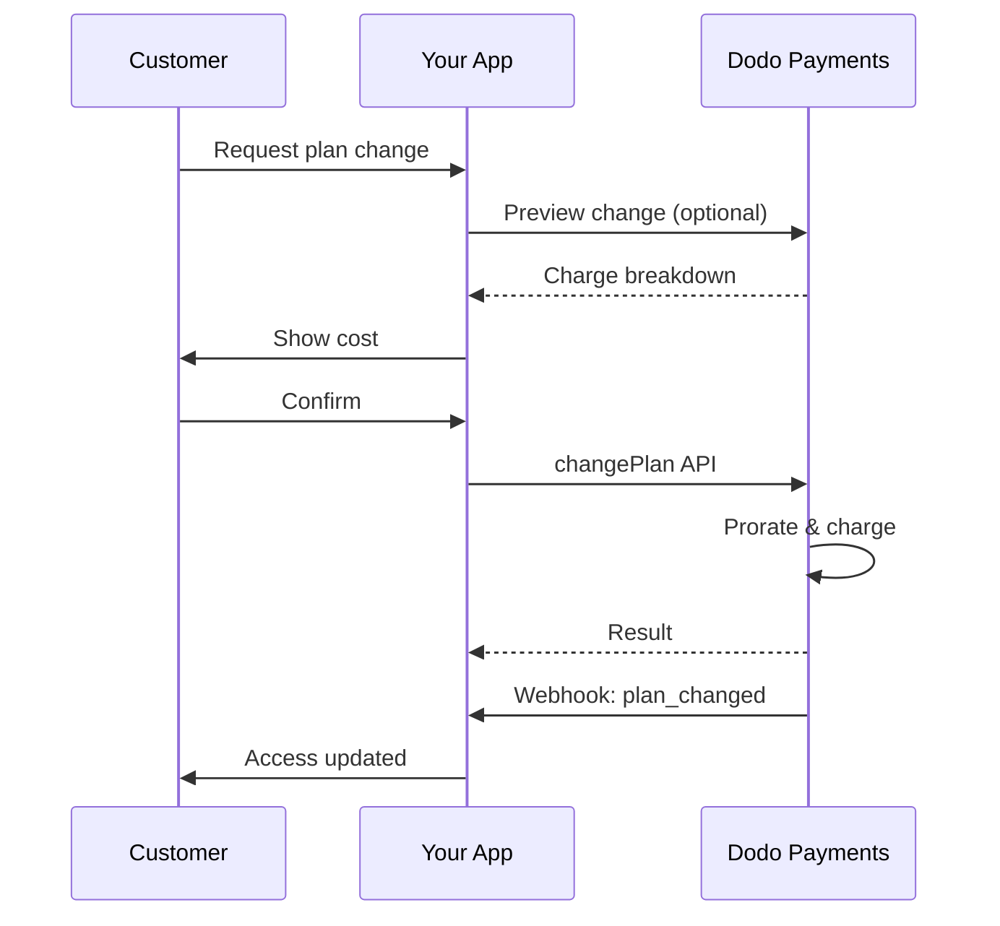
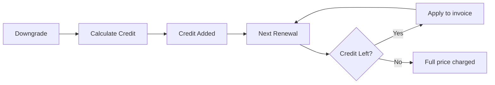

<Info>
تتيح لك الاشتراكات بيع الوصول المستمر مع تجديدات تلقائية. استخدم دورات الفوترة المرنة، التجارب المجانية، تغييرات الخطط، والإضافات لتخصيص الأسعار لكل عميل.
</Info>

<CardGroup cols={2}>
<Card title="ترقية وتخفيض" icon="repeat" href="/developer-resources/subscription-upgrade-downgrade">
تحكم في تغييرات الخطط مع التقسيط وتحديثات الكمية.
</Card>

<Card title="الاشتراكات عند الطلب" icon="bolt" href="/developer-resources/ondemand-subscriptions">
قم بتفويض تفويض الآن واحتسب لاحقًا بمبالغ مخصصة.
</Card>

<Card title="بوابة العملاء" icon="id-card" href="/features/customer-portal">
دع العملاء يديرون الخطط، الفواتير، والإلغاءات.
</Card>

<Card title="Webhooks الاشتراك" icon="code" href="/developer-resources/webhooks/intents/subscription">
تفاعل مع أحداث دورة الحياة مثل الإنشاء، التجديد، والإلغاء.
</Card>
</CardGroup>

## ما هي الاشتراكات؟

الاشتراكات هي منتجات متكررة يشتريها العملاء وفق جدول زمني. إنها مثالية لـ:

- **ترخيص SaaS**: التطبيقات، واجهات برمجة التطبيقات، أو الوصول إلى المنصات
- **العضويات**: المجتمعات، البرامج، أو الأندية
- **المحتوى الرقمي**: الدورات، الوسائط، أو المحتوى المتميز
- **خطط الدعم**: اتفاقيات مستوى الخدمة، حزم النجاح، أو الصيانة

## الفوائد الرئيسية

- **إيرادات متوقعة**: فواتير متكررة مع تجديدات تلقائية
- **دورات مرنة**: شهرية، سنوية، فترات مخصصة، وتجارب
- **مرونة الخطط**: تقسيط للترقيات والتخفيضات
- **إضافات ومقاعد**: أضف ترقيات اختيارية وقابلة للقياس
- **تجربة دفع سلسة**: دفع مستضاف وبوابة العملاء
- **موجه للمطورين**: واجهات برمجة تطبيقات واضحة لإنشاء، تغييرات، وتتبع الاستخدام

## إنشاء الاشتراكات

قم بإنشاء منتجات الاشتراك في لوحة معلومات مدفوعات Dodo الخاصة بك، ثم قم ببيعها من خلال الدفع أو واجهة برمجة التطبيقات الخاصة بك. يفصل المنتجات عن الاشتراكات النشطة مما يتيح لك إصدار أسعار، إرفاق إضافات، وتتبع الأداء بشكل مستقل.

### إنشاء منتج الاشتراك

قم بتكوين الحقول في لوحة المعلومات لتعريف كيفية بيع اشتراكك، تجديده، وفوترة. الأقسام أدناه تتطابق مباشرة مع ما تراه في نموذج الإنشاء.

#### تفاصيل المنتج

- **اسم المنتج** (مطلوب): الاسم المعروض في الدفع، بوابة العملاء، والفواتير.
- **وصف المنتج** (مطلوب): بيان قيمة واضح يظهر في الدفع والفواتير.
- **صورة المنتج** (مطلوب): PNG/JPG/WebP حتى 3 ميغابايت. تستخدم في الدفع والفواتير.
- **العلامة التجارية**: ربط المنتج بعلامة تجارية معينة للتصميم والبريد الإلكتروني.
- **فئة الضريبة** (مطلوب): اختر الفئة (على سبيل المثال، SaaS) لتحديد قواعد الضريبة.

<Tip>
اختر فئة الضريبة الأكثر دقة لضمان جمع الضرائب بشكل صحيح حسب المنطقة.
</Tip>

#### التسعير

- **نوع التسعير**: اختر <b>الاشتراك</b> (هذا الدليل). البدائل هي الدفع لمرة واحدة والفوترة بناءً على الاستخدام.
- **السعر** (مطلوب): السعر الأساسي المتكرر مع العملة.
- **نسبة الخصم المطبقة (%)**: نسبة الخصم الاختيارية المطبقة على السعر الأساسي؛ تظهر في صفحة الدفع والفواتير.
- **تكرار الدفع كل** (مطلوب): الفاصل الزمني للتجديدات، على سبيل المثال، كل شهر واحد. اختر التكرار (شهور أو سنوات) والكمية.
- **مدة الاشتراك** (مطلوب): المدة الإجمالية التي يظل فيها الاشتراك نشطًا (على سبيل المثال، 10 سنوات). بعد انتهاء هذه الفترة، تتوقف التجديدات ما لم يتم تمديدها.
- **أيام فترة التجربة** (مطلوب): حدد طول فترة التجربة بالأيام. استخدم 0 لتعطيل التجارب. يتم فرض الرسوم الأولى تلقائيًا عند انتهاء فترة التجربة.
- **اختر الإضافة**: أرفق ما يصل إلى 10 إضافات يمكن للعملاء شراؤها جنبًا إلى جنب مع الخطة الأساسية.

<Warning>
تغيير التسعير على منتج نشط يؤثر على المشتريات الجديدة. تتابع الاشتراكات الحالية إعدادات تغيير خطتك والتقسيط.
</Warning>

<Info>
الإضافات مثالية للإضافات القابلة للقياس مثل المقاعد أو التخزين. يمكنك التحكم في الكميات المسموح بها وسلوك التقسيط عندما يغيرها العملاء.
</Info>

#### الإعدادات المتقدمة

- **تسعير شامل للضرائب**: عرض الأسعار شاملة الضرائب المطبقة. لا يزال حساب الضريبة النهائي يختلف حسب موقع العميل.
- **إنشاء مفاتيح الترخيص**: إصدار مفتاح فريد لكل عميل بعد الشراء. راجع دليل <a href="/features/license-keys">مفاتيح الترخيص</a>.
- **تسليم المنتج الرقمي**: تسليم الملفات أو المحتوى تلقائيًا بعد الشراء. تعرف على المزيد في <a href="/features/digital-product-delivery">تسليم المنتج الرقمي</a>.
- **البيانات الوصفية**: إرفاق أزواج مفتاح-قيمة مخصصة للتصنيف الداخلي أو تكاملات العملاء. راجع <a href="/api-reference/metadata">البيانات الوصفية</a>.

<Tip>
استخدم البيانات الوصفية لتخزين المعرفات من نظامك (مثل accountId) حتى تتمكن من تسوية الأحداث والفواتير لاحقًا.
</Tip>

## تجارب الاشتراك

تتيح التجارب للعملاء الوصول إلى الاشتراكات دون دفع فوري. يتم فرض الرسوم الأولى تلقائيًا عند انتهاء التجربة.

### تكوين التجارب

حدد **أيام فترة التجربة** في قسم تسعير المنتج (استخدم `0` لتعطيلها). يمكنك تعديل ذلك عند إنشاء الاشتراكات:

```typescript
// Via subscription creation
const subscription = await client.subscriptions.create({
  customer_id: 'cus_123',
  product_id: 'prod_monthly',
  trial_period_days: 14  // Overrides product's trial period
});

// Via checkout session
const session = await client.checkoutSessions.create({
  product_cart: [{ product_id: 'prod_monthly', quantity: 1 }],
  subscription_data: { trial_period_days: 14 }
});
```

<Warning>
يجب أن تكون قيمة `trial_period_days` بين 0 و 10,000 يوم.
</Warning>

### اكتشاف حالة التجربة

<Warning>
حاليًا، لا يوجد حقل مباشر لاكتشاف حالة التجربة. الحل التالي هو حل بديل يتطلب استعلام المدفوعات، وهو غير فعال. نحن نعمل على حل أكثر كفاءة.
</Warning>

لتحديد ما إذا كان الاشتراك في فترة تجربة، استرجع قائمة المدفوعات للاشتراك. إذا كان هناك دفعة واحدة فقط بمبلغ 0، فإن الاشتراك في فترة التجربة:

```typescript
const subscription = await client.subscriptions.retrieve('sub_123');
const payments = await client.payments.list({
  subscription_id: subscription.subscription_id
});

// Check if subscription is in trial
const isInTrial = payments.items.length === 1 && 
                  payments.items[0].total_amount === 0;
```

### تحديث فترة التجربة

مدد الفترة التجريبية عن طريق تحديث `next_billing_date`:

```typescript
await client.subscriptions.update('sub_123', {
  next_billing_date: '2025-02-15T00:00:00Z'  // New trial end date
});
```

<Warning>
لا يمكنك تعيين `next_billing_date` إلى وقت ماضي. يجب أن تكون التاريخ في المستقبل.
</Warning>

## تغييرات خطة الاشتراك

تتيح تغييرات الخطط لك ترقية أو تخفيض الاشتراكات، تعديل الكميات، أو الانتقال إلى منتجات مختلفة. كل تغيير يؤدي إلى فرض رسوم فورية بناءً على وضع التقسيط الذي تختاره.

<Tip>
يمكنك تغيير خطط الاشتراك وتحديث تاريخ الفوترة التالي مباشرة من لوحة تحكم مدفوعات دودي. يوفر ذلك وسيلة سريعة لتعديل الاشتراكات لطلبات دعم العملاء، أو الترقيات الترويجية، أو ترحيل الخطط دون الحاجة لإجراء مكالمات API.
</Tip>

<Tip>
**قم بتمكين تغييرات الخطط ذات الخدمة الذاتية:** هل تريد من العملاء ترقية أو تخفيض اشتراكاتهم عبر بوابة العميل؟ أضف منتجات اشتراكك إلى مجموعة منتجات وقم بتمكين "السماح بتحديثات الاشتراك" في إعدادات الاشتراك الخاصة بك.
</Tip>



<Card title="مجموعة المنتجات" icon="layer-group" href="/features/product-collections">
  اجمع المنتجات ذات الصلة في مجموعات لتمكين مسارات الترقية/التخفيض السلسة في بوابة العميل.
</Card>

### أوضاع التوزيع

اختر كيفية فواتير العملاء عند تغيير الخطط:

<Info>
**مقارنة سريعة للثلاثة أوضاع توزيع:**

| | `prorated_immediately` | `difference_immediately` | `full_immediately` |
|---|---|---|---|
| **ترقية** | رسوم موزعة على الأيام المتبقية | رسوم الفرق الكامل | رسوم خطة جديدة كاملة |
| **تخفيض** | رصيد موزع على الأيام المتبقية | فرق السعر الكامل كرصيد | لا يوجد رصيد، رسوم كاملة |
| **دورة الفوترة** | تبقى كما هي | تبقى كما هي | تعود إلى اليوم |
| **الأفضل ل** | فواتير عادلة قائمة على الوقت | تغييرات بسيطة في الفئات | إعادة تعيين دورة الفوترة |
</Info>

#### `prorated_immediately`
تتراوح الرسوم بناءً على الوقت المتبقي في دورة الفوترة الحالية. الأفضل للفواتير العادلة التي تأخذ في الاعتبار الوقت غير المستخدم.

```typescript
await client.subscriptions.changePlan('sub_123', {
  product_id: 'prod_pro',
  quantity: 1,
  proration_billing_mode: 'prorated_immediately'
});
```

#### `difference_immediately`
تفرض فرق السعر على الفور (ترقية) أو تضيف رصيد للتجديدات المستقبلية (تخفيض). الأفضل لسيناريوهات الترقية/التخفيض البسيطة.

```typescript
// Upgrade: charges $50 (difference between $30 and $80)
// Downgrade: credits remaining value, auto-applied to renewals
await client.subscriptions.changePlan('sub_123', {
  product_id: 'prod_pro',
  quantity: 1,
  proration_billing_mode: 'difference_immediately'
});
```

<Info>
تكون الأرصدة الناتجة من التخفيضات باستخدام `difference_immediately` ذات نطاق اشتراك وتطبق تلقائيًا على التجديدات المستقبلية. وهي تختلف عن <a href="/features/customer-credit">أرصدة العملاء</a>.
</Info>

عند تخفيض اشتراك العميل باستخدام `difference_immediately`، تصبح القيمة غير المستخدمة رصيدًا ذات نطاق اشتراك يخفف تلقائيًا التجديدات المستقبلية:



#### `full_immediately`
تفرض كامل مبلغ الخطة الجديدة على الفور، متجاهلة الوقت المتبقي. الأفضل لإعادة ضبط دورات الفوترة.

```typescript
await client.subscriptions.changePlan('sub_123', {
  product_id: 'prod_monthly',
  quantity: 1,
  proration_billing_mode: 'full_immediately'
});
```

<AccordionGroup>
<Accordion title="مثال: حساب ترقية موزعة">

**السيناريو**: عميل على الخطة الأساسية ($30/شهريًا) يرقى إلى الخطة المحترفة ($80/شهريًا) في اليوم 16 من دورة مدتها 30 يومًا باستخدام `prorated_immediately`.

```
Unused credit from Basic = $30 × (15 remaining / 30 total) = $15.00
Prorated cost of Pro     = $80 × (15 remaining / 30 total) = $40.00
────────────────────────────────────────────────────────────────────
Immediate charge         = $40.00 − $15.00 = $25.00
```

التجديد التالي في تاريخ الفوترة الأصلي: **$80.00/شهريًا**.

<Tip>
لمزيد من الأمثلة التفصيلية حول الحساب والحالات النادرة، انظر دليل [الترقية والتخفيض](/developer-resources/subscription-upgrade-downgrade) الكامل لدينا.
</Tip>

</Accordion>
<Accordion title="مثال: حساب رصيد التخفيض">

**السيناريو**: عميل على الخطة المحترفة ($80/شهريًا) يخفض إلى الخطة المبدئية ($20/شهريًا) باستخدام `difference_immediately`.

```
Credit = Old plan − New plan = $80 − $20 = $60.00
```

الرصيد $60 يطبق تلقائيًا على التجديدات المستقبلية:
- التجديد 1: $20 − $20 (رصيد) = **$0.00** ($40 رصيد متبقي)
- التجديد 2: $20 − $20 (رصيد) = **$0.00** ($20 رصيد متبقي)  
- التجديد 3: $20 − $20 (رصيد) = **$0.00** (استنفاذ الرصيد)
- التجديد 4: **$20.00** (السعر الكامل)

<Info>
تعرف على المزيد حول كيفية إدارة الأرصدة في دليل [الترقية والتخفيض](/developer-resources/subscription-upgrade-downgrade).
</Info>

</Accordion>
</AccordionGroup>

### تغيير الخطط مع الإضافات

عدل الإضافات عند تغيير الخطط. تُدرج الإضافات في حسابات التوزيع:

```typescript
await client.subscriptions.changePlan('sub_123', {
  product_id: 'prod_pro',
  quantity: 1,
  proration_billing_mode: 'difference_immediately',
  addons: [{ addon_id: 'addon_extra_seats', quantity: 2 }]  // Add add-ons
  // addons: []  // Empty array removes all existing add-ons
});
```

<Info>
ت triggers تغييرات الخطط رسومًا فورية. قد تؤدي الرسوم الفاشلة إلى نقل الاشتراك إلى حالة `on_hold`. تابع التغييرات عبر أحداث الويب `subscription.plan_changed`.
</Info>

### معاينة تغييرات الخطط

قبل الالتزام بتغيير الخطة، شاهد الرسوم الدقيقة والاشتراك الناتج:

```typescript
const preview = await client.subscriptions.previewChangePlan('sub_123', {
  product_id: 'prod_pro',
  quantity: 1,
  proration_billing_mode: 'prorated_immediately'
});

// Show customer the charge before confirming
console.log('You will be charged:', preview.immediate_charge.summary);
```

<Card title="معاينة API تغيير الخطة" icon="eye" href="/api-reference/subscriptions/preview-change-plan">
  معاينة تغييرات الخطط قبل الالتزام بها.
</Card>

## حالات الاشتراك

يمكن أن تكون الاشتراكات في حالات مختلفة طوال دورة حياتها:

- **`active`**: الاشتراك نشط وسيتجدد تلقائيًا
- **`on_hold`**: تم إيقاف الاشتراك بسبب فشل الدفع. يتطلب تحديث طريقة الدفع لإعادة التفعيل
- **`cancelled`**: تم إلغاء الاشتراك ولن يتجدد
- **`expired`**: انتهت مدة الاشتراك
- **`pending`**: يُجري الاشتراك أو يتم معالجته

### حالة الإيقاف

يدخل الاشتراك في حالة `on_hold` عندما:

- يفشل الدفع عند التجديد (نقص في الأموال، بطاقة منتهية الصلاحية، إلخ)
- تفشل رسوم تغيير الخطة
- تفشل مصادقة طريقة الدفع

<Warning>
عندما يكون الاشتراك في حالة `on_hold`، فلن يتجدد تلقائيًا. يجب تحديث طريقة الدفع لإعادة تنشيط الاشتراك.
</Warning>

### إعادة التفعيل من حالة الإيقاف

لإعادة تفعيل الاشتراك من حالة `on_hold`، قم بتحديث طريقة الدفع. هذا تلقائيًا:

1. ينشئ رسومًا للمدفوعات المتبقية
2. يولّد فاتورة
3. يعالج الدفع باستخدام طريقة الدفع الجديدة
4. يعيد تنشيط الاشتراك إلى حالة `active` عند نجاح الدفع

```typescript
// Reactivate subscription from on_hold
const response = await client.subscriptions.updatePaymentMethod('sub_123', {
  type: 'new',
  return_url: 'https://example.com/return'
});

// For on_hold subscriptions, a charge is automatically created
if (response.payment_id) {
  console.log('Charge created:', response.payment_id);
  // Redirect customer to response.payment_link to complete payment
  // Monitor webhooks for payment.succeeded and subscription.active
}
```

<Info>
بعد تحديث طريقة الدفع بنجاح للاشتراك الموجود في حالة `on_hold`، ستتلقى أحداث ويب `payment.succeeded` تليها `subscription.active`.
</Info>

## إدارة API

<AccordionGroup>
<Accordion title="إنشاء الاشتراكات">
استخدم `POST /subscriptions` لإنشاء الاشتراكات برمجيًا من المنتجات، مع تجارب وإضافات اختيارية.

<Card title="مرجع API" icon="code" href="/api-reference/subscriptions/post-subscriptions">
عرض واجهة برمجة تطبيقات إنشاء الاشتراك.
</Card>
</Accordion>

<Accordion title="تحديث الاشتراكات">
استخدم `PATCH /subscriptions/{id}` لتحديث الكميات، الإلغاء في تاريخ الفوترة التالي، أو تعديل البيانات الوصفية.

<Card title="مرجع API" icon="code" href="/api-reference/subscriptions/patch-subscriptions">
تعرف على كيفية تحديث تفاصيل الاشتراك.
</Card>
</Accordion>

<Accordion title="تغيير الخطط (التوزيع)">
تغيير المنتج النشط والكميات مع أدوات التوزيع.

<Card title="مرجع API" icon="code" href="/api-reference/subscriptions/change-plan">
استعرض خيارات تغيير الخطط.
</Card>
</Accordion>

<Accordion title="الرسوم حسب الطلب">
لكل الاشتراكات حسب الطلب، فرض رسوم محددة عند الطلب.

<Card title="مرجع API" icon="code" href="/api-reference/subscriptions/create-charge">
فرض رسوم على اشتراك حسب الطلب.
</Card>
</Accordion>

<Accordion title="قائمة والاسترجاع">
استخدم `GET /subscriptions` لإدراج جميع الاشتراكات و`GET /subscriptions/{id}` لاسترجاع واحدة.

<Card title="مرجع API" icon="code" href="/api-reference/subscriptions/get-subscriptions">
تصفح واجهات برمجة التطبيقات للإدراج والاسترجاع.
</Card>
</Accordion>

<Accordion title="تاريخ الاستخدام">
استرجاع الاستخدام المسجل لنماذج التسعير القائمة على المتر.

<Card title="مرجع API" icon="code" href="/api-reference/subscriptions/get-usage-history">
انظر واجهة برمجة التطبيقات لتاريخ الاستخدام.
</Card>
</Accordion>

<Accordion title="تحديث طريقة الدفع">
تحديث طريقة الدفع للاشتراك. بالنسبة للاشتراكات النشطة، يتم تحديث طريقة الدفع للتجديدات المستقبلية. بالنسبة للاشتراكات في حالة `on_hold`، يتم إعادة تفعيل الاشتراك من خلال إنشاء رسوم للمدفوعات المتبقية.

<Card title="مرجع API" icon="code" href="/api-reference/subscriptions/update-payment-method">
تعرف على كيفية تحديث طرق الدفع وإعادة تفعيل الاشتراكات.
</Card>
</Accordion>
</AccordionGroup>

## حالات الاستخدام الشائعة

- **برامج SaaS وAPIs**: وصول مرحلي مع إضافات للمقاعد أو الاستخدام
- **المحتوى والوسائط**: وصول شهري مع تجارب تمهيدية
- **خطط دعم B2B**: عقود سنوية مع إضافات دعم متميزة
- **الأدوات والإضافات**: مفاتيح الترخيص والإصدارات المرقمة

## أمثلة التكامل

### جلسات الخروج (الاشتراكات)
عند إنشاء جلسات الخروج، قم بتضمين منتج الاشتراك الخاص بك والإضافات الاختيارية:

```typescript
const session = await client.checkoutSessions.create({
  product_cart: [
    {
      product_id: 'prod_subscription',
      quantity: 1
    }
  ]
});
```

### تغييرات الخطط مع التوزيع
قم بترقية أو تخفيض اشتراك وControl سلوك التوزيع:

```typescript
await client.subscriptions.changePlan('sub_123', {
  product_id: 'prod_new',
  quantity: 1,
  proration_billing_mode: 'difference_immediately'
});
```

### الإلغاء في تاريخ الفوترة التالي
جدولة إلغاء ساري المفعول في نهاية الفترة الحالية:

```typescript
await client.subscriptions.update('sub_123', {
  cancel_at_next_billing_date: true
});
```

### اشتراكات حسب الطلب
إنشاء اشتراك حسب الطلب وفرض رسوم لاحقًا كما هو مطلوب:

```typescript
const onDemand = await client.subscriptions.create({
  customer_id: 'cus_123',
  product_id: 'prod_on_demand',
  on_demand: true
});

await client.subscriptions.createCharge(onDemand.id, {
  amount: 4900,
  currency: 'USD',
  description: 'Extra usage for September'
});
```

### تحديث طريقة الدفع للاشتراك النشط
تحديث طريقة الدفع للاشتراك النشط:

```typescript
// Update with new payment method
const response = await client.subscriptions.updatePaymentMethod('sub_123', {
  type: 'new',
  return_url: 'https://example.com/return'
});

// Or use existing payment method
await client.subscriptions.updatePaymentMethod('sub_123', {
  type: 'existing',
  payment_method_id: 'pm_abc123'
});
```

### إعادة تفعيل الاشتراك من حالة الإيقاف
إعادة تفعيل اشتراك تم إيقافه بسبب فشل الدفع:

```typescript
// Update payment method - automatically creates charge for remaining dues
const response = await client.subscriptions.updatePaymentMethod('sub_123', {
  type: 'new',
  return_url: 'https://example.com/return'
});

if (response.payment_id) {
  // Charge created for remaining dues
  // Redirect customer to response.payment_link
  // Monitor webhooks: payment.succeeded → subscription.active
}
```

## الاشتراكات مع تفويضات متوافقة مع RBI

تعمل اشتراكات UPI وبطاقات الهند وفقًا لوائح RBI (البنك الاحتياطي الهندي) مع متطلبات تفويض محددة:

### حدود التفويض

تعتمد نوع ومبلغ التفويض على رسوم الاشتراك المتكررة الخاصة بك:

- **رسوم أقل من 15,000 روبية:** نقوم بإنشاء تفويض حسب الطلب بمبلغ 15,000 روبية هندية. يتم فرض مبلغ الاشتراك دوريًا وفقًا لتكرار الاشتراك الخاص بك، حتى حدود التفويض.
- **الرسوم 15,000 روبية أو أكثر:** نقوم بإنشاء تفويض اشتراك (أو تفويض حسب الطلب) للمبلغ الدقيق للاشتراك.

لمزيد من المعلومات المفصلة حول التفويضات المتوافقة مع RBI بالنسبة لطرق الدفع الهندية، انظر صفحة <a href="/features/payment-methods/india">طرق الدفع في الهند</a>.

### اعتبارات الترقية والتخفيض

**مهم:** عند ترقية أو تخفيض الاشتراكات، ضع في اعتبارك بعناية حدود التفويض:

- إذا نتج عن الترقية/التخفيض مبلغ رسوم يتجاوز 15,000 روبية ويتجاوز الحد المتاح للدفع حسب الطلب، فقد تفشل رسوم المعاملة.
- في مثل هذه الحالات، قد يحتاج العميل إلى تحديث طريقة الدفع الخاصة به أو تغيير الاشتراك مرة أخرى لإنشاء تفويض جديد مع الحد المناسب.

###الإذن لمبالغ مرتفعة

لرسوم الاشتراك بمبلغ 15,000 روبية أو أكثر:

- سيتم مطالبة العميل من قبل مصرفه بتفويض المعاملة.
- إذا فشل العميل في تفويض المعاملة، فستفشل المعاملة وسيتم وضع الاشتراك في حالة إيقاف.

### تأخير معالجة 48 ساعة

**جدول معالجة:** تتبع الرسوم المتكررة على بطاقات الهند واشتراكات UPI نمط معالجة مميز:

- يتم **بدء** الرسوم في التاريخ المجدول وفقًا لتكرار اشتراكك.
- يتم **خصم** المبلغ الفعلي من حساب العميل فقط بعد **48 ساعة** من بدء الدفع.
- قد يمتد هذا الإطار الزمني لمدة تصل إلى **2-3 ساعات إضافية** اعتمادًا على استجابات واجهة برمجة تطبيقات البنك.

### نافذة إلغاء التفويض

خلال نافذة المعالجة التي تستمر 48 ساعة:

- يمكن للعملاء إلغاء التفويض عبر تطبيقاتهم البنكية.
- إذا قام العميل بإلغاء التفويض خلال هذه الفترة، سيبقى الاشتراك **نشطًا** (هذه حالة خاصة تتعلق باشتراكات بطاقات الهند واشتراكات UPI AutoPay).
- ومع ذلك، قد تفشل الخصم الفعلي، وفي هذه الحالة، سنضع الاشتراك **في حالة إيقاف**.

**معالجة الحالات الخاصة:** إذا قدمت فوائد أو أرصدة أو استخدام اشتراك للعملاء فور بدء الرسوم، تحتاج إلى معالجة هذه النافذة التي تمتد 48 ساعة بشكل مناسب في تطبيقك. النظر في:

- تأخير تفعيل الفوائد حتى التأكيد على الدفع
- تنفيذ فترات سماح أو وصول مؤقت
- متابعة حالة الاشتراك لإلغاء التفويضات
- معالجة حالات إيقاف الاشتراك في منطق تطبيقك

<Tip>
راقب أحداث الويب للاشتراك لتتبع التغييرات في حالة الدفع ومعالجة الحالات الخاصة حيث يتم إلغاء التفويضات خلال نافذة معالجة 48 ساعة.
</Tip>

## أفضل الممارسات

- **ابدأ مع شفافيات واضحة**: 2-3 خطط مع اختلافات واضحة
- **التواصل بشأن التسعير**: عرض المجموعات والتوزيع والتجديد التالي
- **استخدم التجارب بحكمة**: التحويل مع الانضباط، وليس فقط الوقت
- **استفد من الإضافات**:保持التخطيط الأساسي بسيطًا وكسب العروض الإضافية
- **اختبر التغييرات**: تحقق من تغيير الخطط والتوزيع في وضع الاختبار

<Info>
تعتبر الاشتراكات أساسًا مرنًا للإيرادات المتكررة. ابدأ ببساطة، واختبر بشكل شامل، وكرر بناءً على الاعتماد والتقلبات ومؤشرات التوسع.
</Info>