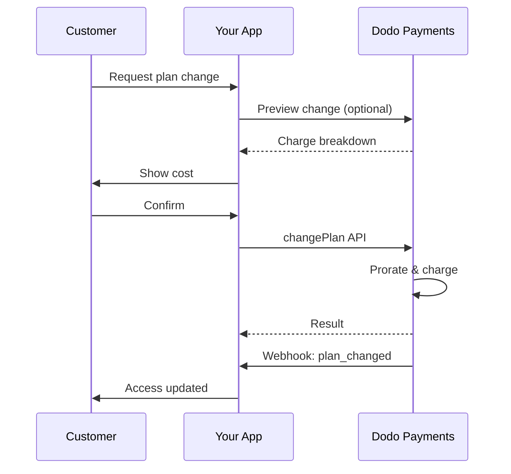
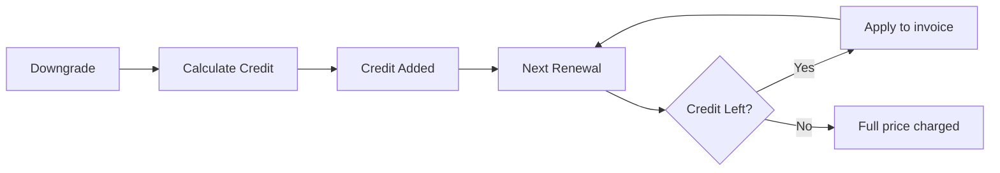
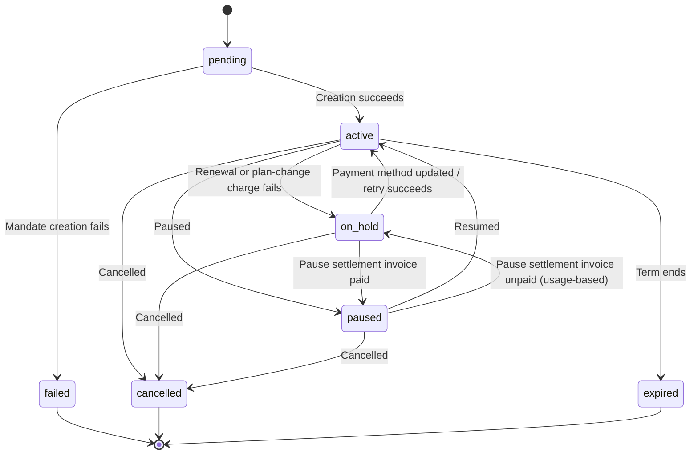

<Info>
تتيح الاشتراكات لك بيع وصول مستمر مع تجديدات آلية. استخدم دورات فوترة مرنة، تجارب مجانية، تغييرات الخطة، والإضافات لتخصيص التسعير لكل عميل.
</Info>

<CardGroup cols={2}>
<Card title="Upgrade & Downgrade" icon="repeat" href="/developer-resources/subscription-upgrade-downgrade">
تحكم في تغييرات الخطة باستخدام النسبة وتحديثات الكمية.
</Card>

<Card title="On‑Demand Subscriptions" icon="bolt" href="/developer-resources/ondemand-subscriptions">
فوض تفويضًا الآن وادفع لاحقًا بمبالغ مخصصة.
</Card>

<Card title="Customer Portal" icon="id-card" href="/features/customer-portal">
دع العملاء يديرون الخطط والفوترة والإلغاءات.
</Card>

<Card title="Subscription Webhooks" icon="code" href="/developer-resources/webhooks/intents/subscription">
تفاعل مع أحداث دورة الحياة مثل الإنشاء والتجديد والإلغاء.
</Card>
</CardGroup>

## ما هي الاشتراكات؟

الاشتراكات هي منتجات متكررة يشتريها العملاء وفق جدول زمني. إنها مثالية لـ:

- **ترخيص SaaS**: التطبيقات، واجهات برمجة التطبيقات، أو الوصول إلى المنصات
- **العضويات**: المجتمعات، البرامج، أو الأندية
- **المحتوى الرقمي**: الدورات، الوسائط، أو المحتوى المتميز
- **خطط الدعم**: اتفاقيات مستوى الخدمة، حزم النجاح، أو الصيانة

## الفوائد الرئيسية

- **إيرادات متوقعة**: فواتير متكررة مع تجديدات تلقائية
- **دورات مرنة**: شهرية، سنوية، فترات مخصصة، وتجارب
- **مرونة الخطط**: تقسيط للترقيات والتخفيضات
- **إضافات ومقاعد**: أضف ترقيات اختيارية وقابلة للقياس
- **تجربة دفع سلسة**: دفع مستضاف وبوابة العملاء
- **موجه للمطورين**: واجهات برمجة تطبيقات واضحة لإنشاء، تغييرات، وتتبع الاستخدام

## إنشاء الاشتراكات

قم بإنشاء منتجات الاشتراك في لوحة معلومات مدفوعات Dodo الخاصة بك، ثم قم ببيعها من خلال الدفع أو واجهة برمجة التطبيقات الخاصة بك. يفصل المنتجات عن الاشتراكات النشطة مما يتيح لك إصدار أسعار، إرفاق إضافات، وتتبع الأداء بشكل مستقل.

### إنشاء منتج الاشتراك

قم بتكوين الحقول في لوحة المعلومات لتعريف كيفية بيع اشتراكك، تجديده، وفوترة. الأقسام أدناه تتطابق مباشرة مع ما تراه في نموذج الإنشاء.

#### تفاصيل المنتج

- **اسم المنتج** (مطلوب): الاسم المعروض في الدفع، بوابة العملاء، والفواتير.
- **وصف المنتج** (مطلوب): بيان قيمة واضح يظهر في الدفع والفواتير.
- **صورة المنتج** (مطلوب): PNG/JPG/WebP حتى 3 ميغابايت. تستخدم في الدفع والفواتير.
- **العلامة التجارية**: ربط المنتج بعلامة تجارية معينة للتصميم والبريد الإلكتروني.
- **فئة الضريبة** (مطلوب): اختر الفئة (على سبيل المثال، SaaS) لتحديد قواعد الضريبة.

<Tip>
اختر فئة الضريبة الأكثر دقة لضمان جمع الضريبة الصحيح لكل منطقة.
</Tip>

#### التسعير

- **نوع التسعير**: اختر <b>Subscription</b> (هذا الدليل). البدائل هي Single Payment وUsage Based Billing.
- **السعر** (مطلوب): السعر الأساسي المتكرر مع العملة. يجب ألا يقل السعر عن **$1** (أو ما يعادله بالعملة التي اخترتها). المبالغ الأقل من هذا الحد الأدنى غير مدعومة، ولن يعمل الاشتراك.
- **الخصم المطبق (%)**: خصم اختياري بنسبة مئوية يُطبَّق على السعر الأساسي؛ ويظهر في checkout والفواتير.
- **تكرار الدفع كل** (مطلوب): الفاصل الزمني للتجديدات، مثل كل شهر واحد. اختر الوتيرة (بالأشهر أو السنوات) والكمية.
- **فترة الاشتراك** (مطلوب): المدة الإجمالية التي يظل فيها الاشتراك نشطًا (مثل 10 سنوات). بعد انتهاء هذه الفترة، تتوقف التجديدات ما لم يتم تمديدها.
- **أيام الفترة التجريبية** (مطلوب): حدّد مدة التجربة بالأيام. استخدم 0 لتعطيل الفترات التجريبية. يتم تحصيل الدفعة الأولى تلقائيًا عند انتهاء التجربة.
- **مبلغ الفترة التجريبية**: رسم مقدّم اختياري لفترة تجريبية مدفوعة. اتركه دون تعيين لفترة تجريبية مجانية. راجع [الفترات التجريبية المدفوعة](#paid-trials).
- **تحديد الإضافة**: أرفق ما يصل إلى 10 إضافات يمكن للعملاء شراؤها إلى جانب الخطة الأساسية.

<Warning>
يؤثر تغيير التسعير على منتج نشط على المشتريات الجديدة. تتبع الاشتراكات الحالية إعدادات تغيير الخطة والنسبة الخاصة بك.
</Warning>

<Info>
الإضافات مثالية للميزات القابلة للقياس مثل المقاعد أو التخزين. يمكنك التحكم في الكميات المسموح بها وسلوك النسبة عندما يغيرها العملاء.
</Info>

#### الإعدادات المتقدمة

- **تسعير شامل للضرائب**: عرض الأسعار شاملة الضرائب المطبقة. لا يزال حساب الضريبة النهائي يختلف حسب موقع العميل.
- **إنشاء مفاتيح الترخيص**: إصدار مفتاح فريد لكل عميل بعد الشراء. راجع دليل <a href="/features/license-keys">مفاتيح الترخيص</a>.
- **تسليم المنتج الرقمي**: تسليم الملفات أو المحتوى تلقائيًا بعد الشراء. تعرف على المزيد في <a href="/features/digital-product-delivery">تسليم المنتج الرقمي</a>.
- **البيانات الوصفية**: إرفاق أزواج مفتاح-قيمة مخصصة للتصنيف الداخلي أو تكاملات العملاء. راجع <a href="/api-reference/metadata">البيانات الوصفية</a>.

<Tip>
استخدم البيانات الوصفية لتخزين المعرفات من نظامك (على سبيل المثال accountId) حتى تتمكن من تسوية الأحداث والفواتير لاحقًا.
</Tip>

## تجارب الاشتراك

تتيح الفترات التجريبية للعملاء تقييم الاشتراك قبل دفع السعر المتكرر الكامل. يمكن أن تكون الفترة التجريبية **مجانية**، حيث لا يتم تحصيل أي مبلغ حتى انتهائها، أو **مدفوعة**، حيث يتم تحصيل مبلغ مخفّض مقدمًا. في كلتا الحالتين، يبدأ تحصيل السعر الكامل عند أول تجديد بعد انتهاء الفترة التجريبية.

### تكوين التجارب

قم بتعيين **أيام الفترة التجريبية** في قسم تسعير المنتج (استخدم `0` لتعطيلها). يمكنك تجاوز هذا عند إنشاء الاشتراكات:

```typescript
// Via subscription creation
const subscription = await client.subscriptions.create({
  customer: { customer_id: 'cus_123' },
  billing: { country: 'US' },
  product_id: 'pdt_monthly',
  quantity: 1,
  trial_period_days: 14  // Overrides product's trial period
});

// Via checkout session
const session = await client.checkoutSessions.create({
  product_cart: [{ product_id: 'pdt_monthly', quantity: 1 }],
  subscription_data: { trial_period_days: 14 }
});
```

<Warning>
يجب أن تكون القيمة `trial_period_days` بين 0 و10,000 يوم.
</Warning>

### الفترات التجريبية المدفوعة

لا يشترط أن تكون الفترات التجريبية مجانية. عيّن **مبلغ الفترة التجريبية** على السعر المتكرر لمنتج الاشتراك لتحصيل رسم مقدّم مخفّض خلال فترة التجربة. بعد ذلك، يحل السعر المتكرر الكامل محلّه عند أول تجديد.

<Frame>

</Frame>

يتم إعداد الفترات التجريبية المدفوعة على سعر المنتج، وليس لكل اشتراك أو جلسة checkout:

| الحقل | النوع | الوصف |
|-------|------|-------------|
| `trial_amount` | integer | المبلغ الذي يتم تحصيله اليوم مقابل التجربة، بوحدات العملة الفرعية لعملة السعر (على سبيل المثال، `500` مقابل $5.00). يتطلب `trial_period_days > 0`. احذفه أو عيّنه إلى `null` للحصول على فترة تجريبية مجانية. |
| `trial_apply_discounts` | boolean | ما إذا كانت رموز خصم checkout تقلل رسم التجربة. القيمة الافتراضية هي `false`، لذلك يتم تحصيل مبلغ التجربة بالكامل حتى عند تطبيق خصم على السعر المتكرر. |

```typescript
const product = await client.products.create({
  name: 'Pro Plan',
  tax_category: 'saas',
  price: {
    type: 'recurring_price',
    price: 2900,                      // $29.00 per month after the trial
    currency: 'USD',
    discount: 0,
    purchasing_power_parity: false,
    payment_frequency_count: 1,
    payment_frequency_interval: 'Month',
    subscription_period_count: 1,
    subscription_period_interval: 'Year',
    trial_period_days: 14,            // A paid trial requires a positive trial period
    trial_amount: 500,                // $5.00 charged today
    trial_apply_discounts: false      // Discounts apply to the recurring price only
  }
});
```

تمر الفترات التجريبية المدفوعة عبر checkout أيضًا. تخضع قيمة التجربة للضريبة، وتظهر في حسابات جلسة checkout وتسعير روابط الدفع، ويتم تطبيق هامش Adaptive Currency لكل عملة. يعيد [نقطة نهاية المعاينة](/developer-resources/checkout-session) `trial_amount` و`trial_period_days`، بحيث يمكنك عرض المبلغ المستحق اليوم قبل إنشاء الاشتراك.

<Info>
لم تتغير الفترات التجريبية المجانية. يؤدي ترك **مبلغ الفترة التجريبية** دون تعيين إلى الإبقاء على السلوك الحالي، حيث تكون الدفعة الأولى `0` ويتم تحصيل السعر الكامل عند انتهاء الفترة التجريبية.
</Info>

### منع إساءة استخدام الفترة التجريبية

يمنع **منع إساءة استخدام الفترة التجريبية** العملاء من المطالبة بالفترات التجريبية مرارًا للنشاط التجاري نفسه. عند تفعيله، يتم تحويل العميل الذي استرد فترة تجريبية من قبل تلقائيًا إلى **عملية شراء مدفوعة بلا فترة تجريبية** بدلًا من منحه فترة تجريبية جديدة.

<Frame>

</Frame>

فعّله من علامة تبويب **الاشتراكات** في **الإعدادات**. بعد تفعيله:

- تتم مطابقة العملاء باستخدام **البريد الإلكتروني المطبّع**، مع إزالة الأسماء المستعارة بعلامة الجمع، لذلك يُعتدّ بـ `user+trial@example.com` و`user@example.com` على أنهما الشخص نفسه.
- يتم تسجيل عمليات الاسترداد عند **تفعيل الفترة التجريبية**، لذلك يكون العميل الذي يلغي الاشتراك في اليوم نفسه قد استهلك فترته التجريبية بالفعل.
- تتم إضافة العملاء الحاليين بأثر رجعي من فترات التجربة السابقة لديهم عبر البريد الإلكتروني، ولذلك يتم التعرّف على مستخدمي الفترات التجريبية السابقين فورًا.

<Info>
الإعداد **معطّل افتراضيًا**. راجع [إعدادات الاشتراك](/features/product-collections#subscription-settings) للاطلاع على القائمة الكاملة لعناصر التحكم في الاشتراكات على مستوى النشاط التجاري.
</Info>

### اكتشاف حالة الفترة التجريبية

<Warning>
لا يوجد حاليًا حقل مباشر لاكتشاف حالة الفترة التجريبية. الحل البديل التالي يتطلب الاستعلام عن المدفوعات، وهو غير فعّال. نعمل على توفير حل أكثر كفاءة.
</Warning>

لتحديد ما إذا كان اشتراك **فترة تجريبية مجانية** لا يزال في فترة التجربة، استرجع قائمة المدفوعات الخاصة بالاشتراك. إذا كانت هناك دفعة واحدة بالضبط ومبلغها 0، يكون الاشتراك في الفترة التجريبية:

```typescript
const subscription = await client.subscriptions.retrieve('sub_123');
const payments = await client.payments.list({
  subscription_id: subscription.subscription_id
});

// Check if subscription is in trial
const isInTrial = payments.items.length === 1 && 
                  payments.items[0].total_amount === 0;
```

<Warning>
يعمل التحقق من المبلغ الصفري مع الفترات التجريبية المجانية فقط. بالنسبة إلى [الفترة التجريبية المدفوعة](#paid-trials)، تساوي الدفعة الأولى مبلغ التجربة، وليس `0`. قارن الدفعة الأولى مع `trial_amount` الخاص بالاشتراك، أو تحقق مما إذا كان `next_billing_date` لا يزال ضمن فترة التجربة.
</Warning>

### تحديث الفترة التجريبية

مدّد الفترة التجريبية من خلال تحديث `next_billing_date`:

```typescript
await client.subscriptions.update('sub_123', {
  next_billing_date: '2025-02-15T00:00:00Z'  // New trial end date
});
```

<Warning>
لا يمكنك تعيين `next_billing_date` إلى وقت سابق. يجب أن يكون التاريخ في المستقبل.
</Warning>

## تغييرات خطة الاشتراك

تتيح تغييرات الخطة ترقية الاشتراكات أو تخفيضها، وضبط الكميات، أو الانتقال إلى منتجات مختلفة. بناءً على وضع proration الذي تختاره، قد يؤدي التغيير إلى تحصيل فوري، أو إنشاء رصيد، أو عدم تطبيق أي تعديل على الفوترة.

<Tip>
يمكنك تغيير خطط الاشتراك وتحديث تاريخ الفوترة التالي مباشرةً من لوحة معلومات Dodo Payments. توفر هذه الطريقة وسيلة سريعة لضبط الاشتراكات استجابةً لطلبات دعم العملاء أو الترقيات الترويجية أو عمليات نقل الخطط، من دون إجراء استدعاءات API.
</Tip>

<Tip>
**تمكين تغييرات الخطط بالخدمة الذاتية:** هل تريد أن يتمكن العملاء من ترقية اشتراكاتهم أو تخفيضها عبر Customer Portal؟ أضف منتجات الاشتراك إلى Product Collection وفعّل "Allow Subscription Updates" في Subscription Settings.
</Tip>



<Card title="Product Collections" icon="layer-group" href="/features/product-collections">
  جمّع المنتجات المرتبطة في مجموعات لتمكين مسارات الترقية والتخفيض السلسة في Customer Portal.
</Card>

### أوضاع proration

اختر طريقة فوترة العملاء عند تغيير الخطط:

<Info>
**مقارنة سريعة بين أوضاع proration الأربعة:**

| | `prorated_immediately` | `difference_immediately` | `full_immediately` | `do_not_bill` |
|---|---|---|---|---|
| **الترقية** | رسم محسوب نسبيًا للأيام المتبقية | تحصيل فرق السعر الكامل | تحصيل سعر الخطة الجديدة بالكامل | لا يوجد رسم — التبديل فورًا |
| **التخفيض** | رصيد محسوب نسبيًا للأيام المتبقية | فرق السعر الكامل كرصيد | لا يوجد رصيد، تحصيل كامل | لا يوجد رصيد — التبديل فورًا |
| **دورة الفوترة** | تُعاد إلى اليوم | تُعاد إلى اليوم | تُعاد إلى اليوم | تبقى كما هي |
| **الأفضل لـ** | فوترة عادلة بحسب الوقت | تغييرات المستويات البسيطة | إعادة ضبط دورة الفوترة | عمليات النقل المجانية أو التبديلات المجاملة |
</Info>

#### `prorated_immediately`
يحصّل مبلغًا محسوبًا نسبيًا بناءً على الوقت المتبقي في دورة الفوترة الحالية. وهو مناسب للفوترة العادلة التي تراعي الوقت غير المستخدم.

```typescript
await client.subscriptions.changePlan('sub_123', {
  product_id: 'pdt_pro',
  quantity: 1,
  proration_billing_mode: 'prorated_immediately'
});
```

#### `difference_immediately`
يحصّل فرق السعر فورًا (عند الترقية) أو يضيف رصيدًا إلى التجديدات المستقبلية (عند التخفيض). وهو مناسب لسيناريوهات الترقية والتخفيض البسيطة.

```typescript
// Upgrade: charges $50 (difference between $30 and $80)
// Downgrade: credits remaining value, auto-applied to renewals
await client.subscriptions.changePlan('sub_123', {
  product_id: 'pdt_pro',
  quantity: 1,
  proration_billing_mode: 'difference_immediately'
});
```

<Info>
الأرصدة الناتجة عن التخفيضات باستخدام `difference_immediately` تكون مقيّدة بالاشتراك وتُطبّق تلقائيًا على التجديدات المستقبلية. وهي تختلف عن استحقاقات <a href="/features/credit-based-billing">Credit-Based Billing</a>.
</Info>

عندما يخفض العميل خطته باستخدام `difference_immediately`، تصبح القيمة غير المستخدمة رصيدًا مقيّدًا بالاشتراك، ويُخصم تلقائيًا من التجديدات المستقبلية:



#### `full_immediately`
يحصّل مبلغ الخطة الجديدة بالكامل فورًا، متجاهلًا الوقت المتبقي. وهو مناسب لإعادة ضبط دورات الفوترة.

```typescript
await client.subscriptions.changePlan('sub_123', {
  product_id: 'pdt_monthly',
  quantity: 1,
  proration_billing_mode: 'full_immediately'
});
```

#### `do_not_bill`
ينتقل إلى الخطة الجديدة من دون أي تعديل على الفوترة. لا توجد رسوم proration أو أرصدة — ينتقل العميل ببساطة إلى الخطة الجديدة. وهو مناسب لعمليات النقل المجاملة، أو تبديلات الخطط المجانية، أو الحالات التي تريد فيها تحمّل فرق التكلفة.

```typescript
await client.subscriptions.changePlan('sub_123', {
  product_id: 'pdt_new_plan',
  quantity: 1,
  proration_billing_mode: 'do_not_bill'
});
```

<AccordionGroup>
<Accordion title="Example: Prorated upgrade calculation">

**السيناريو**: يرقّي عميل مشترك في Basic ($30/شهريًا) إلى Pro ($80/شهريًا) في اليوم 16 من دورة مدتها 30 يومًا باستخدام `prorated_immediately`.

```
Unused credit from Basic = $30 × (15 remaining / 30 total) = $15.00
Prorated cost of Pro     = $80 × (15 remaining / 30 total) = $40.00
────────────────────────────────────────────────────────────────────
Immediate charge         = $40.00 − $15.00 = $25.00
```

التجديد التالي في **15 فبراير** (16 يناير + 30 يومًا): **$80.00/شهريًا**.

<Tip>
للاطلاع على أمثلة حسابية أكثر تفصيلًا والحالات الطرفية، راجع [دليل الترقية والتخفيض الكامل](/developer-resources/subscription-upgrade-downgrade).
</Tip>

</Accordion>
<Accordion title="Example: Downgrade credit calculation">

**السيناريو**: يخفض عميل مشترك في Pro ($80/شهريًا) إلى Starter ($20/شهريًا) باستخدام `difference_immediately`.

```
Credit = Old plan − New plan = $80 − $20 = $60.00
```

يُطبّق رصيد $60 تلقائيًا على التجديدات المستقبلية:
- التجديد 1: $20 − $20 (رصيد) = **$0.00** (الرصيد المتبقي $40)
- التجديد 2: $20 − $20 (رصيد) = **$0.00** (الرصيد المتبقي $20)  
- التجديد 3: $20 − $20 (رصيد) = **$0.00** (استهلاك الرصيد بالكامل)
- التجديد 4: **$20.00** (السعر الكامل)

<Info>
تعرّف على المزيد حول إدارة الأرصدة في [دليل الترقية والتخفيض](/developer-resources/subscription-upgrade-downgrade).
</Info>

</Accordion>
</AccordionGroup>

### تغيير الخطط مع الإضافات

عدّل الإضافات عند تغيير الخطط. يتم تضمين الإضافات في حسابات proration:

```typescript
await client.subscriptions.changePlan('sub_123', {
  product_id: 'pdt_pro',
  quantity: 1,
  proration_billing_mode: 'difference_immediately',
  addons: [{ addon_id: 'addon_extra_seats', quantity: 2 }]  // Add add-ons
  // addons: []  // Empty array removes all existing add-ons
});
```

<Info>
بشكل افتراضي، تؤدي تغييرات الخطة (`effective_at: 'immediately'`) إلى تحصيل الرسوم فورًا. مرّر `effective_at: 'next_billing_date'` لجدولة التغيير في تاريخ الفوترة التالي بدلًا من ذلك — ويُعاد التغيير المعلّق في الاشتراك باسم `scheduled_change`، ويمكنك إلغاؤه باستخدام [إلغاء تغيير الخطة المجدول](/api-reference/subscriptions/cancel-change-plan). قد تؤدي الرسوم الفاشلة إلى نقل الاشتراك إلى حالة `on_hold`، ما لم تمرّر `on_payment_failure: 'prevent_change'`، حيث يُبقي الاشتراك على خطته الحالية إلى أن تنجح عملية الدفع. تتبّع التغييرات عبر أحداث webhook‏ `subscription.plan_changed`.
</Info>

### معاينة تغييرات الخطط

قبل اعتماد تغيير الخطة، اعرض معاينة للرسم الدقيق والاشتراك الناتج:

```typescript
const preview = await client.subscriptions.previewChangePlan('sub_123', {
  product_id: 'pdt_pro',
  quantity: 1,
  proration_billing_mode: 'prorated_immediately'
});

// Show customer the charge before confirming
console.log('You will be charged:', preview.immediate_charge.summary);
```

<Card title="Preview Change Plan API" icon="eye" href="/api-reference/subscriptions/preview-change-plan">
  عاين تغييرات الخطط قبل اعتمادها.
</Card>

## إيقاف الاشتراكات مؤقتًا واستئنافها

يؤدي الإيقاف المؤقت إلى تجميد الاشتراك بدلًا من إنهائه. تتوقف الفوترة، ويُلغى الوصول، ويحتفظ الاشتراك بخطته وسجله حتى يتمكن العميل من المتابعة من حيث توقف تمامًا. استخدمه كبديل للاحتفاظ بالعميل بدلًا من الإلغاء.

افتح أي اشتراك نشط ضمن **Sales → Subscriptions** وانقر على **Pause subscription**. تتغير الحالة إلى `paused` وتتوقف عمليات التجديد حتى يتم استئناف الاشتراك.

<Frame>
    
</Frame>

### ما يحدث عند الإيقاف المؤقت

- **تتوقف عمليات التجديد.** لا يتم إنشاء فاتورة ولا تُحاول المنصة تحصيل رسوم التجديد أثناء إيقاف الاشتراك مؤقتًا.
- **يُلغى الوصول فورًا.** يؤدي الإيقاف المؤقت إلى إلغاء كل [منح الاستحقاقات](/features/entitlements/introduction) التي تم تسليمها أو ما زالت معلقة على الاشتراك، ما يعطل [مفاتيح الترخيص](/features/license-keys) ويوقف إصدار عناوين URL جديدة لتنزيل [المنتجات الرقمية](/features/digital-product-delivery). عند الاستئناف، تتم إعادة منحها بالطريقة نفسها التي تتم بها الاستعادة من `on_hold`.
- **تتجمد ساعة الفوترة.** يتقدم كل من `next_billing_date` و`expires_at` بالمقدار نفسه تمامًا لمدة الإيقاف المؤقت، بحيث يحتفظ العميل بالمدة التي دفع ثمنها بالفعل.
- **لا يوجد حد لمدة الإيقاف المؤقت.** يظل الاشتراك متوقفًا مؤقتًا حتى يستأنفه أحدهم. ولا تحتاج إلى تحديد مدة الإيقاف مسبقًا.

<Warning>
يُلغى الوصول فورًا عند الإيقاف المؤقت، وليس عند نهاية فترة الفوترة. إذا كان الاشتراك يتحكم في الوصول إلى منتجك، فاحرص على توضيح ذلك للعميل قبل تأكيده.
</Warning>

يعيد الاستئناف الاشتراك إلى `active` ويستعيد استحقاقاته. وبما أن الساعة كانت مجمدة، يحل التجديد التالي بعد مدة الإيقاف المؤقت مقارنة بموعده الأصلي — فإذا أُوقف الاشتراك مؤقتًا لمدة 12 يومًا، يتجدد متأخرًا 12 يومًا.

### إيقاف الاشتراكات القائمة على الاستخدام مؤقتًا

قد يحتوي الاشتراك [القائم على الاستخدام](/features/usage-based-billing/introduction) على استخدام مسجل لكنه لم يُفوتر بعد عند إيقافه مؤقتًا. ويحدد الخيار **Bill Usage at Pause** ضمن **Settings → Subscriptions** ما يحدث لهذا الاستخدام:

| الإعداد | السلوك |
|---------|----------|
| **On** (افتراضي) | تنشئ Dodo Payments فاتورة للاستخدام المتراكم منذ آخر تاريخ فوترة وتحصّل المبلغ فورًا. |
| **Off** | يُرحّل الاستخدام المستحق ويُفوتر في الفاتورة الدورية التالية للاشتراك. |

تتم تسوية الاستخدام المقاس فقط بهذه الطريقة — ولا تُحصّل الرسوم الأساسية المتكررة أبدًا عند الإيقاف المؤقت. لا تحتوي الاشتراكات القياسية والاشتراكات عند الطلب على مبالغ لتسويتها، لذلك لا يؤثر هذا الإعداد فيها.

<Info>
يُسجل **Bill Usage at Pause** لكل دورة فوترة. ولا يؤدي تغييره في منتصف الدورة إلى تغيير طريقة تسوية الدورة الجارية؛ إذ تُطبق القيمة الجديدة بدءًا من الدورة التالية.
</Info>

<Warning>
تُحصّل فاتورة التسوية مثل أي فاتورة أخرى، ولذلك قد تفشل. وإذا ظلت غير مدفوعة بعد انتهاء فترة السماح الخاصة بـ [dunning](/features/recovery/subscription-dunning)، ينتقل الاشتراك إلى `on_hold` مع بقائه معلّمًا بأنه متوقف مؤقتًا.
</Warning>

يوجد أمام الاشتراك في هذه الحالة طريقان للخروج، ويختلفان في الطرف الذي يتحمل الاستخدام المستحق:

| الخروج | النتيجة |
|------|--------|
| دفع فاتورة التسوية | يعود الاشتراك إلى `paused`، وليس `active`. استأنفه صراحةً عندما يكون العميل مستعدًا. |
| استئناف الاشتراك مباشرةً | ينتقل الاشتراك مباشرةً إلى `active`، وتُلغى فاتورة التسوية غير المدفوعة **voided**، إلى جانب محاولات إعادة التحصيل المعلقة. ويُشطب الاستخدام المستحق. |

<Info>
يُعد الاستئناف خروجًا صالحًا من حالة التعليق هذه — ولا يتعين عليك تحصيل فاتورة التسوية أولًا. لكن انتبه إلى أن الاستئناف يعفي من الاستخدام المستحق بدلًا من تأجيله.
</Info>

### السماح للعملاء بإيقاف اشتراكاتهم مؤقتًا بأنفسهم

يتحكم الخيار **Allow Subscription Pause** ضمن **Settings → Subscriptions** في إمكانية إيقاف العملاء لاشتراكاتهم مؤقتًا واستئنافها من Customer Portal. وهو **متوقف افتراضيًا**، لذا يجب تفعيل الإيقاف الذاتي صراحةً.

<Frame>
    
</Frame>

يتحكم هذا الإعداد في Customer Portal فقط. ويمكنك دائمًا إيقاف الاشتراك مؤقتًا واستئنافه من لوحة المعلومات أو API، بغض النظر عن وضع الخيار.

يؤدي إيقافه إلى منع عمليات الإيقاف المؤقت الجديدة التي يجريها العملاء، لكنه لا يحاصر العميل الذي أوقف اشتراكه مؤقتًا بالفعل — إذ يظل بإمكانه استئناف الإيقاف الذي بدأه بنفسه. أما عمليات الإيقاف التي بدأتها أنت فتظل تحت سيطرتك.

<Card title="Pausing from the Customer Portal" icon="id-card" href="/features/customer-portal#pausing-a-subscription">
اطّلع على ما يراه العميل، بما في ذلك مربع حوار التأكيد.
</Card>

### الإيقاف المؤقت عبر API

يمثل الإيقاف والاستئناف حقل `pause` واحدًا في نقطة نهاية تحديث الاشتراك. ولا توجد نقطة نهاية منفصلة للإيقاف المؤقت.

```typescript
// Pause
await client.subscriptions.update('sub_123', { pause: true });

// Resume
await client.subscriptions.update('sub_123', { pause: false });
```

<Warning>
يُعد `pause` حصريًا لجميع الحقول الأخرى — ويُرفض إرساله مع أي حقل آخر مع `422`. ولا يؤدي تعيين `status` إلى `paused` إلى إيقاف الاشتراك مؤقتًا؛ استخدم حقل `pause` بدلًا من ذلك.
</Warning>

يصدر الإيقاف المؤقت `subscription.paused`، ويصدر الاستئناف `subscription.unpaused`. ويحمل كلاهما كائن الاشتراك كاملًا، مع تعيين `paused_at` أثناء الإيقاف المؤقت و`null` بعد الاستئناف.

### الإيقاف المؤقت وإجراءات الاشتراك الأخرى

- **يظل الإلغاء متاحًا.** يمكنك إلغاء اشتراك متوقف مؤقتًا بالطريقة نفسها التي تلغي بها اشتراكًا نشطًا. وتُلغى أي فاتورة تسوية مفتوحة ناتجة عن الإيقاف المؤقت عند إجراء ذلك.
- **تتأخر تغييرات الخطة المجدولة ولا تُحذف.** يظل [تغيير الخطة](#subscription-plan-changes) المجدول لتاريخ الفوترة التالي دون تغيير أثناء إيقاف الاشتراك مؤقتًا، ثم يُطبق في تاريخ الفوترة المؤجل بعد استئنافه. ويُعد `scheduled_change.effective_at` الخاص به لقطة من وقت جدولة التغيير ولا يُعدّل بسبب الإيقاف المؤقت، لذلك قد يعرض تاريخًا في الماضي — اقرأه على أنه «كان مجدولًا في»، وليس كتاريخ مضمون. ولإسقاط التغيير بدلًا من تركه ساريًا، استخدم [Cancel Scheduled Plan Change](/api-reference/subscriptions/cancel-change-plan).

## حالات الاشتراك

ينتقل الاشتراك عبر مجموعة محددة من الحالات طوال فترة حياته. ويوفر هذا الجدول مرجعًا لكل حالة، وسبب حدوثها، وكيفية استعادتها أو ما إذا كان ذلك ممكنًا.

| الحالة | معناها | قابلة للاستعادة؟ | مسار الاستعادة / الخطوة التالية |
|--------|---------------|--------------|---------------------------|
| `pending` | يجري إنشاء الاشتراك أو معالجته | — | انتظر `subscription.active` (أو `subscription.failed`) |
| `active` | الاشتراك نشط وسيُجدد تلقائيًا | — | لا يلزم اتخاذ أي إجراء |
| `on_hold` | فشلت دفعة التجديد (أو رسوم تغيير الخطة)؛ وتوقفت عمليات التجديد | **نعم** | حدّث طريقة الدفع لإعادة التفعيل — تلقائيًا عبر [Payment Retries](/features/recovery/payment-retries) و[Dunning](/features/recovery/subscription-dunning)، أو يدويًا عبر [Update Payment Method API](/api-reference/subscriptions/update-payment-method) |
| `paused` | أوقفتَ أنت أو العميل الاشتراك مؤقتًا عمدًا؛ تجمدت الفوترة وأُلغي الوصول | **نعم** | استأنفه باستخدام `pause: false`، أو من Customer Portal عند تفعيل الإيقاف الذاتي — راجع [إيقاف الاشتراكات مؤقتًا واستئنافها](#pausing-and-resuming-subscriptions) |
| `cancelled` | أُلغي الاشتراك ولن يُجدد | إعادة الشراء فقط | يجب على العميل بدء اشتراك جديد؛ ويمكن لـ [Dunning](/features/recovery/subscription-dunning) حثه على إعادة الشراء |
| `failed` | فشل **إنشاء** الاشتراك (لم ينجح التفويض أو الدفع الأولي) | **لا — نهائية** | يجب على العميل إنشاء اشتراك جديد باستخدام طريقة دفع صالحة |
| `expired` | بلغ الاشتراك نهاية مدته | — | يجب على العميل بدء اشتراك جديد إذا رغب في ذلك |

<Warning>
غالبًا ما يحدث خلط بين `on_hold` و`failed`. تمثل `on_hold` حالة **قابلة للاستعادة** لاشتراك نشط بالفعل فشل تجديده. أما `failed` فهي حالة **نهائية** تحدث فقط عند فشل **الإنشاء الأولي** للاشتراك — ولا يمكن إعادة تفعيله.
</Warning>

<Info>
تختلف `on_hold` و`paused` أيضًا. فالأولى غير طوعية — إذ فشلت دفعة. أما الثانية فمتعمدة — فقد اخترتَ أنت أو العميل تجميد الاشتراك، ولا تُجرى أي محاولة تجديد ما دام متوقفًا مؤقتًا. وقد يظل على الاشتراك القائم على الاستخدام فاتورة تسوية لمرة واحدة عند إيقافه مؤقتًا؛ راجع [إيقاف الاشتراكات القائمة على الاستخدام مؤقتًا](#pausing-usage-based-subscriptions).
</Info>

### آلة الحالات



### حالة التعليق

يدخل الاشتراك في حالة `on_hold` عندما:

- تفشل دفعة تجديد (بسبب عدم كفاية الرصيد أو انتهاء صلاحية البطاقة وغير ذلك)
- تفشل رسوم تغيير الخطة
- يفشل تفويض طريقة الدفع
- تظل [فاتورة تسوية الإيقاف المؤقت](#pausing-usage-based-subscriptions) لاشتراك قائم على الاستخدام غير مدفوعة

<Warning>
عندما يكون الاشتراك في حالة `on_hold`، فلن يُجدد تلقائيًا. يجب تحديث طريقة الدفع لإعادة تفعيل الاشتراك.
</Warning>

### إعادة التفعيل من حالة التعليق

لإعادة تفعيل اشتراك من حالة `on_hold`، حدّث طريقة الدفع. يؤدي ذلك تلقائيًا إلى:

1. إنشاء رسوم للمبالغ المستحقة المتبقية
2. إنشاء فاتورة
3. معالجة الدفع باستخدام طريقة الدفع الجديدة
4. إعادة تفعيل الاشتراك إلى حالة `active` عند نجاح الدفع

<Note>
الاستثناء الوحيد هو التعليق الناتج عن فاتورة تسوية إيقاف مؤقت غير مدفوعة. تؤدي تسوية هذه الفاتورة إلى إعادة الاشتراك إلى `paused`، وليس `active`، لأن الإيقاف المؤقت هو الحالة التي كان عليها قبل فشل الدفع. استأنفه صراحةً بعد تسوية الفاتورة.
</Note>

```typescript
// Reactivate subscription from on_hold
const response = await client.subscriptions.updatePaymentMethod('sub_123', {
  payment_method: {
    type: 'new',
    return_url: 'https://example.com/return'
  }
});

// For on_hold subscriptions, a charge is automatically created
if (response.payment_id) {
  console.log('Charge created:', response.payment_id);
  // Redirect customer to response.payment_link to complete payment
  // Monitor webhooks for payment.succeeded and subscription.active
}
```

<Info>
بعد تحديث طريقة الدفع بنجاح لاشتراك في حالة `on_hold`، ستتلقى أحداث webhook هي `payment.succeeded` ثم `subscription.active`.
</Info>

### أحداث webhook حسب الانتقال

يصدر كل انتقال حدث webhook حتى تتمكن من تشغيل منطق الاستحقاقات دون الاستطلاع الدوري:

| الانتقال | الحدث |
|------------|-------|
| تفعيل الاشتراك | `subscription.active` |
| نجاح التجديد | `subscription.renewed` |
| فشل التجديد ← التعليق | `subscription.on_hold` |
| إيقاف الاشتراك مؤقتًا | `subscription.paused` |
| استئناف الاشتراك المتوقف مؤقتًا | `subscription.unpaused` |
| فشل الإنشاء | `subscription.failed` |
| ترقية/تخفيض الخطة | `subscription.plan_changed` |
| الإلغاء | `subscription.cancelled` |
| انتهاء المدة | `subscription.expired` |
| تغيير أي حقل | `subscription.updated` |

<Card title="Subscription Webhook Payloads" icon="webhook" href="/developer-resources/webhooks/intents/subscription">
اطّلع على مخطط الحمولة الكامل لأحداث دورة حياة الاشتراك.
</Card>

## إدارة API

<AccordionGroup>
<Accordion title="Create subscriptions">
استخدم `POST /checkouts` لإنشاء اشتراكات برمجيًا من المنتجات، مع تجارب اختيارية (`subscription_data.trial_period_days`) وإضافات (`product_cart[].addons`).

<Warning>
أصبح `POST /subscriptions` مهجورًا. تستمر عمليات التكامل الحالية في العمل، لكن ينبغي لعمليات التكامل الجديدة استخدام [Checkout Sessions](/api-reference/checkout-sessions/create).
</Warning>

<Card title="API Reference" icon="code" href="/api-reference/checkout-sessions/create">
اطّلع على API لإنشاء جلسة Checkout.
</Card>
</Accordion>

<Accordion title="Update subscriptions">
استخدم `PATCH /subscriptions/{subscription_id}` للإلغاء في تاريخ الفوترة التالي، أو تمديد فترة الاشتراك، أو تحديث تفاصيل الفوترة، أو تعديل البيانات الوصفية. ولتغيير الكمية، استخدم [Change Plan API](/api-reference/subscriptions/change-plan) بدلًا من ذلك — إذ لا يقبل `PATCH` الحقل `quantity`.

<Card title="API Reference" icon="code" href="/api-reference/subscriptions/patch-subscriptions">
تعرّف على كيفية تحديث تفاصيل الاشتراك.
</Card>
</Accordion>

<Accordion title="Pause and resume subscriptions">
يتم الإيقاف المؤقت والاستئناف عبر نقطة النهاية `PATCH /subscriptions/{subscription_id}` نفسها باستخدام الحقل `pause`: إذ يوقف `pause: true` اشتراكًا نشطًا مؤقتًا، ويستأنفه `pause: false`. ولا يمكن دمج الحقل مع أي حقل آخر في الطلب نفسه. لمعرفة السلوك الكامل وتأثيرات الفوترة وإعدادات الأعمال ذات الصلة، راجع [إيقاف الاشتراكات مؤقتًا واستئنافها](#pausing-and-resuming-subscriptions).

<Card title="API Reference" icon="code" href="/api-reference/subscriptions/patch-subscriptions">
اطّلع على API لتحديث الاشتراك، بما في ذلك الحقل `pause`.
</Card>
</Accordion>

<Accordion title="Change plans (proration)">
غيّر المنتج النشط والكميات مع عناصر التحكم في التوزيع النسبي.

<Card title="API Reference" icon="code" href="/api-reference/subscriptions/change-plan">
راجع خيارات تغيير الخطة.
</Card>
</Accordion>

<Accordion title="On‑demand charges">
بالنسبة إلى الاشتراكات عند الطلب، احصّل مبالغ محددة عند الطلب.

<Card title="API Reference" icon="code" href="/api-reference/subscriptions/create-charge">
حصّل رسوم اشتراك عند الطلب.
</Card>
</Accordion>

<Accordion title="List and retrieve">
استخدم `GET /subscriptions` لسرد جميع الاشتراكات و`GET /subscriptions/{id}` لاسترداد اشتراك واحد.

<Card title="API Reference" icon="code" href="/api-reference/subscriptions/get-subscriptions">
استعرض APIs الخاصة بالسرد والاسترداد.
</Card>
</Accordion>

<Accordion title="Usage history">
استرد الاستخدام المسجل لنماذج التسعير المقاس أو الهجين.

<Card title="API Reference" icon="code" href="/api-reference/subscriptions/get-usage-history">
اطّلع على API لسجل الاستخدام.
</Card>
</Accordion>

<Accordion title="Update payment method">
حدّث طريقة الدفع لاشتراك. بالنسبة إلى الاشتراكات النشطة، يؤدي ذلك إلى تحديث طريقة الدفع لعمليات التجديد المستقبلية. أما الاشتراكات في حالة `on_hold`، فيعيد ذلك تفعيل الاشتراك من خلال إنشاء رسوم للمبالغ المستحقة المتبقية.

عند إنشاء رابط جديد لطريقة الدفع (نوع الطلب `New`)، يمكنك تمرير `allowed_payment_method_types` لتقييد طرق الدفع التي يراها العميل في تلك الصفحة. ولن يرى العملاء طريقة غير موجودة في القائمة، مع أن تضمين طريقة لا يضمن ظهورها (فالتوافر لا يزال يعتمد على عوامل مثل موقع العميل وإعدادات نشاطك التجاري).

<Card title="API Reference" icon="code" href="/api-reference/subscriptions/update-payment-method">
تعرّف على كيفية تحديث طرق الدفع وإعادة تفعيل الاشتراكات.
</Card>
</Accordion>
</AccordionGroup>

## حالات الاستخدام الشائعة

- **SaaS وواجهات API**: وصول متدرج مع إضافات للمقاعد أو الاستخدام
- **المحتوى والوسائط**: وصول شهري مع تجارب تمهيدية
- **خطط دعم B2B**: عقود سنوية مع إضافات دعم متميزة
- **الأدوات والمكونات الإضافية**: مفاتيح ترخيص وإصدارات متعاقبة

## أمثلة على التكامل

### Checkout Sessions (الاشتراكات)
عند إنشاء Checkout Sessions، أدرج منتج الاشتراك والإضافات الاختيارية:

```typescript
const session = await client.checkoutSessions.create({
  product_cart: [
    {
      product_id: 'pdt_subscription',
      quantity: 1
    }
  ]
});
```

### تغييرات الخطة مع التوزيع النسبي
رقِّ الاشتراك أو خفّضه وتحكم في سلوك التوزيع النسبي:

```typescript
await client.subscriptions.changePlan('sub_123', {
  product_id: 'pdt_new',
  quantity: 1,
  proration_billing_mode: 'difference_immediately'
});
```

### الإلغاء في تاريخ الفوترة التالي
جدول إلغاءً يسري في نهاية فترة الفوترة الحالية:

```typescript
await client.subscriptions.update('sub_123', {
  cancel_at_next_billing_date: true
});
```

### تمديد فترة الاشتراك
مدّد مدة تشغيل الاشتراك عبر تمرير `subscription_period_count` و`subscription_period_interval` جديدين إلى `PATCH /subscriptions/{subscription_id}`. يُعاد حساب تاريخ انتهاء الاشتراك استنادًا إلى العدد والفاصل الجديدين — مثلًا لمنح العميل وقتًا إضافيًا في خطته الحالية:

```typescript
await client.subscriptions.update('sub_123', {
  subscription_period_count: 5,
  subscription_period_interval: 'Month'
});
```

<Note>
لا يمكن زيادة فترة الاشتراك إلا **تمديدًا**، ولا يمكن تقصيرها.
</Note>

### الاشتراكات عند الطلب
أنشئ اشتراكًا عند الطلب وحصّل الرسوم لاحقًا حسب الحاجة:

```typescript
const onDemand = await client.subscriptions.create({
  customer: { customer_id: 'cus_123' },
  billing: { country: 'US' },
  product_id: 'pdt_on_demand',
  quantity: 1,
  on_demand: { mandate_only: true }
});

await client.subscriptions.charge(onDemand.subscription_id, {
  product_price: 4900,
  product_currency: 'USD',
  product_description: 'Extra usage for September'
});
```

### تحديث طريقة الدفع لاشتراك نشط
حدّث طريقة الدفع لاشتراك نشط:

```typescript
// Update with new payment method
const response = await client.subscriptions.updatePaymentMethod('sub_123', {
  payment_method: {
    type: 'new',
    return_url: 'https://example.com/return'
  }
});

// Or use existing payment method
await client.subscriptions.updatePaymentMethod('sub_123', {
  payment_method: {
    type: 'existing',
    payment_method_id: 'pm_abc123'
  }
});
```

### إعادة تفعيل اشتراك من on_hold
أعد تفعيل اشتراك دخل حالة التعليق بسبب فشل الدفع:

```typescript
// Update payment method - automatically creates charge for remaining dues
const response = await client.subscriptions.updatePaymentMethod('sub_123', {
  payment_method: {
    type: 'new',
    return_url: 'https://example.com/return'
  }
});

if (response.payment_id) {
  // Charge created for remaining dues
  // Redirect customer to response.payment_link
  // Monitor webhooks: payment.succeeded → subscription.active
}
```

## الاشتراكات ذات التفويضات المتوافقة مع RBI

  تعمل اشتراكات UPI والبطاقات الهندية بموجب لوائح RBI (Reserve Bank of India) مع متطلبات تفويض محددة:

  ### حدود التفويض

  يعتمد نوع التفويض ومبلغه على الرسوم المتكررة لاشتراكك:

  - **الرسوم الأقل من حد التفويض (₹15,000 افتراضيًا):** ننشئ تفويضًا عند الطلب بمبلغ الحد. ويُحصّل مبلغ الاشتراك دوريًا وفقًا لتكرار اشتراكك، حتى حد التفويض.
  - **الرسوم التي تساوي حد التفويض أو تتجاوزه:** ننشئ تفويض اشتراك (أو تفويضًا عند الطلب) بالمبلغ الدقيق للاشتراك.

  يمكن ضبط حد التفويض لكل تاجر أو لكل طلب عبر `mandate_min_amount_inr_paise` (بالبايسات الهندية INR). والمبلغ المسجل لدى البنك هو `max(mandate_floor, billing_amount)` — لذلك يصبح الحد فعليًا سقف التفويض الذي يراه العميل عندما تكون الفوترة أقل منه.

للحصول على معلومات تفصيلية حول التفويضات المتوافقة مع RBI وحد التفويض القابل للضبط لطرق الدفع الهندية، راجع صفحة <a href="/features/payment-methods/india#configurable-mandate-floor">India Payment Methods</a>.

  ### اعتبارات ترقية الخطة وتخفيضها

  **مهم:** عند ترقية الاشتراكات أو تخفيضها، ضع حدود التفويض في الاعتبار بعناية:

  - إذا أدت الترقية أو التخفيض إلى مبلغ رسوم يتجاوز Rs 15,000 ويتجاوز حد الدفع الحالي عند الطلب، فقد تفشل رسوم المعاملة.
  - في هذه الحالات، قد يحتاج العميل إلى تحديث طريقة الدفع أو تغيير الاشتراك مرة أخرى لإنشاء تفويض جديد بالحد الصحيح.

  ### التفويض للرسوم مرتفعة القيمة

  بالنسبة إلى رسوم الاشتراك التي تبلغ Rs 15,000 أو أكثر:

  - سيطلب البنك من العميل تفويض المعاملة.
  - إذا لم ينجح العميل في تفويض المعاملة، فستفشل المعاملة وسيوضع الاشتراك في حالة تعليق.

  ### تأخير المعالجة لمدة 48 ساعة

  **الجدول الزمني للمعالجة:** تتبع الرسوم المتكررة على البطاقات الهندية واشتراكات UPI نمط معالجة فريدًا:

  - **تبدأ** الرسوم في التاريخ المجدول وفقًا لتكرار اشتراكك.
  - لا يحدث **الخصم** الفعلي من حساب العميل إلا بعد **48 ساعة** من بدء الدفع.
  - قد تمتد هذه الفترة البالغة 48 ساعة حتى **ساعتين أو 3 ساعات إضافية** وفقًا لاستجابات API البنك.

  ### فترة إلغاء التفويض

  خلال فترة المعالجة البالغة 48 ساعة:

  - يمكن للعملاء إلغاء التفويض عبر تطبيقاتهم المصرفية.
  - إذا ألغى العميل التفويض خلال هذه الفترة، فسيظل الاشتراك **نشطًا** (وهذه حالة خاصة باشتراكات البطاقات الهندية وUPI AutoPay).
  - لكن قد يفشل الخصم الفعلي، وفي هذه الحالة سنضع الاشتراك في حالة **تعليق**.

  **معالجة الحالات الاستثنائية:** إذا قدمت مزايا أو أرصدة أو استخدامًا للاشتراك للعملاء فور بدء تحصيل الرسوم، فعليك معالجة فترة الـ48 ساعة هذه بشكل مناسب في تطبيقك. ضع في اعتبارك ما يلي:

  - تأخير تفعيل المزايا حتى تأكيد الدفع
  - تطبيق فترات سماح أو وصول مؤقت
  - مراقبة حالة الاشتراك لاكتشاف إلغاءات التفويض
  - معالجة حالات تعليق الاشتراك في منطق تطبيقك

  <Tip>
  راقب webhooks الخاصة بالاشتراك لتتبع تغييرات حالة الدفع ومعالجة الحالات الاستثنائية التي تُلغى فيها التفويضات خلال فترة الـ48 ساعة.
  </Tip>

## أفضل الممارسات

- **ابدأ بمستويات واضحة**: خطتان إلى 3 خطط ذات فروق واضحة
- **وضّح التسعير**: اعرض الإجماليات والتوزيع النسبي والتجديد التالي
- **استخدم التجارب بعناية**: حوّل العملاء عبر الإعداد الأولي، لا بمجرد منح الوقت
- **استفد من الإضافات**: أبقِ الخطط الأساسية بسيطة وبِع الإضافات بشكل إضافي
- **اختبر التغييرات**: تحقّق من تغييرات الخطة والتوزيع النسبي في وضع الاختبار

<Info>
تمثل الاشتراكات أساسًا مرنًا للإيرادات المتكررة. ابدأ ببساطة، واختبر بدقة، ثم حسّن استنادًا إلى مقاييس التبني والتسرب والتوسع.
</Info>