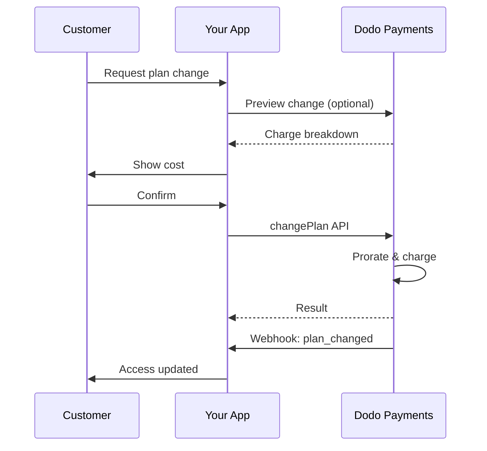
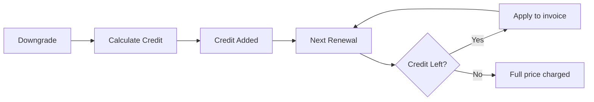

<Info>
تتيح الاشتراكات لك بيع وصول مستمر مع تجديدات آلية. استخدم دورات فوترة مرنة، تجارب مجانية، تغييرات الخطة، والإضافات لتخصيص التسعير لكل عميل.
</Info>

<CardGroup cols={2}>
<Card title="Upgrade & Downgrade" icon="repeat" href="/developer-resources/subscription-upgrade-downgrade">
تحكم في تغييرات الخطة باستخدام النسبة وتحديثات الكمية.
</Card>

<Card title="On‑Demand Subscriptions" icon="bolt" href="/developer-resources/ondemand-subscriptions">
فوض تفويضًا الآن وادفع لاحقًا بمبالغ مخصصة.
</Card>

<Card title="Customer Portal" icon="id-card" href="/features/customer-portal">
دع العملاء يديرون الخطط والفوترة والإلغاءات.
</Card>

<Card title="Subscription Webhooks" icon="code" href="/developer-resources/webhooks/intents/subscription">
تفاعل مع أحداث دورة الحياة مثل الإنشاء والتجديد والإلغاء.
</Card>
</CardGroup>

## ما هي الاشتراكات؟

الاشتراكات هي منتجات متكررة يشتريها العملاء وفق جدول زمني. إنها مثالية لـ:

- **ترخيص SaaS**: التطبيقات، واجهات برمجة التطبيقات، أو الوصول إلى المنصات
- **العضويات**: المجتمعات، البرامج، أو الأندية
- **المحتوى الرقمي**: الدورات، الوسائط، أو المحتوى المتميز
- **خطط الدعم**: اتفاقيات مستوى الخدمة، حزم النجاح، أو الصيانة

## الفوائد الرئيسية

- **إيرادات متوقعة**: فواتير متكررة مع تجديدات تلقائية
- **دورات مرنة**: شهرية، سنوية، فترات مخصصة، وتجارب
- **مرونة الخطط**: تقسيط للترقيات والتخفيضات
- **إضافات ومقاعد**: أضف ترقيات اختيارية وقابلة للقياس
- **تجربة دفع سلسة**: دفع مستضاف وبوابة العملاء
- **موجه للمطورين**: واجهات برمجة تطبيقات واضحة لإنشاء، تغييرات، وتتبع الاستخدام

## إنشاء الاشتراكات

قم بإنشاء منتجات الاشتراك في لوحة معلومات مدفوعات Dodo الخاصة بك، ثم قم ببيعها من خلال الدفع أو واجهة برمجة التطبيقات الخاصة بك. يفصل المنتجات عن الاشتراكات النشطة مما يتيح لك إصدار أسعار، إرفاق إضافات، وتتبع الأداء بشكل مستقل.

### إنشاء منتج الاشتراك

قم بتكوين الحقول في لوحة المعلومات لتعريف كيفية بيع اشتراكك، تجديده، وفوترة. الأقسام أدناه تتطابق مباشرة مع ما تراه في نموذج الإنشاء.

#### تفاصيل المنتج

- **اسم المنتج** (مطلوب): الاسم المعروض في الدفع، بوابة العملاء، والفواتير.
- **وصف المنتج** (مطلوب): بيان قيمة واضح يظهر في الدفع والفواتير.
- **صورة المنتج** (مطلوب): PNG/JPG/WebP حتى 3 ميغابايت. تستخدم في الدفع والفواتير.
- **العلامة التجارية**: ربط المنتج بعلامة تجارية معينة للتصميم والبريد الإلكتروني.
- **فئة الضريبة** (مطلوب): اختر الفئة (على سبيل المثال، SaaS) لتحديد قواعد الضريبة.

<Tip>
اختر فئة الضريبة الأكثر دقة لضمان جمع الضريبة الصحيح لكل منطقة.
</Tip>

#### التسعير

- **نوع التسعير**: اختر <b>الاشتراك</b> (هذا الدليل). البدائل هي الدفع لمرة واحدة والفوترة بناءً على الاستخدام.
- **السعر** (مطلوب): السعر الأساسي المتكرر مع العملة.
- **نسبة الخصم المطبقة (%)**: نسبة الخصم الاختيارية المطبقة على السعر الأساسي؛ تظهر في صفحة الدفع والفواتير.
- **تكرار الدفع كل** (مطلوب): الفاصل الزمني للتجديدات، على سبيل المثال، كل شهر واحد. اختر التكرار (شهور أو سنوات) والكمية.
- **مدة الاشتراك** (مطلوب): المدة الإجمالية التي يظل فيها الاشتراك نشطًا (على سبيل المثال، 10 سنوات). بعد انتهاء هذه الفترة، تتوقف التجديدات ما لم يتم تمديدها.
- **أيام فترة التجربة** (مطلوب): حدد طول فترة التجربة بالأيام. استخدم 0 لتعطيل التجارب. يتم فرض الرسوم الأولى تلقائيًا عند انتهاء فترة التجربة.
- **اختر الإضافة**: أرفق ما يصل إلى 10 إضافات يمكن للعملاء شراؤها جنبًا إلى جنب مع الخطة الأساسية.

<Warning>
يؤثر تغيير التسعير على منتج نشط على المشتريات الجديدة. تتبع الاشتراكات الحالية إعدادات تغيير الخطة والنسبة الخاصة بك.
</Warning>

<Info>
الإضافات مثالية للميزات القابلة للقياس مثل المقاعد أو التخزين. يمكنك التحكم في الكميات المسموح بها وسلوك النسبة عندما يغيرها العملاء.
</Info>

#### الإعدادات المتقدمة

- **تسعير شامل للضرائب**: عرض الأسعار شاملة الضرائب المطبقة. لا يزال حساب الضريبة النهائي يختلف حسب موقع العميل.
- **إنشاء مفاتيح الترخيص**: إصدار مفتاح فريد لكل عميل بعد الشراء. راجع دليل <a href="/features/license-keys">مفاتيح الترخيص</a>.
- **تسليم المنتج الرقمي**: تسليم الملفات أو المحتوى تلقائيًا بعد الشراء. تعرف على المزيد في <a href="/features/digital-product-delivery">تسليم المنتج الرقمي</a>.
- **البيانات الوصفية**: إرفاق أزواج مفتاح-قيمة مخصصة للتصنيف الداخلي أو تكاملات العملاء. راجع <a href="/api-reference/metadata">البيانات الوصفية</a>.

<Tip>
استخدم البيانات الوصفية لتخزين المعرفات من نظامك (على سبيل المثال accountId) حتى تتمكن من تسوية الأحداث والفواتير لاحقًا.
</Tip>

## تجارب الاشتراك

تتيح التجارب للعملاء الوصول إلى الاشتراكات دون دفع فوري. يتم فرض الرسوم الأولى تلقائيًا عند انتهاء التجربة.

### تكوين التجارب

قم بتعيين **أيام الفترة التجريبية** في قسم تسعير المنتج (استخدم `0` لتعطيلها). يمكنك تجاوز هذا عند إنشاء الاشتراكات:

```typescript
// Via subscription creation
const subscription = await client.subscriptions.create({
  customer_id: 'cus_123',
  product_id: 'prod_monthly',
  trial_period_days: 14  // Overrides product's trial period
});

// Via checkout session
const session = await client.checkoutSessions.create({
  product_cart: [{ product_id: 'prod_monthly', quantity: 1 }],
  subscription_data: { trial_period_days: 14 }
});
```

<Warning>
يجب أن تكون القيمة `trial_period_days` بين 0 و10,000 يوم.
</Warning>

### اكتشاف حالة التجربة

<Warning>
حاليًا لا يوجد حقل مباشر لاكتشاف حالة الفترة التجريبية. الحل البديل التالي يتطلب استعلامًا عن المدفوعات، وهو أمر غير فعال. نحن نعمل على حل أكثر كفاءة.
</Warning>

لتحديد ما إذا كان الاشتراك في فترة تجربة، استرجع قائمة المدفوعات للاشتراك. إذا كان هناك دفعة واحدة فقط بمبلغ 0، فإن الاشتراك في فترة التجربة:

```typescript
const subscription = await client.subscriptions.retrieve('sub_123');
const payments = await client.payments.list({
  subscription_id: subscription.subscription_id
});

// Check if subscription is in trial
const isInTrial = payments.items.length === 1 && 
                  payments.items[0].total_amount === 0;
```

### تحديث فترة التجربة

مدد الفترة التجريبية بتحديث `next_billing_date`:

```typescript
await client.subscriptions.update('sub_123', {
  next_billing_date: '2025-02-15T00:00:00Z'  // New trial end date
});
```

<Warning>
لا يمكنك تعيين `next_billing_date` إلى وقت ماضي. يجب أن يكون التاريخ في المستقبل.
</Warning>

## تغييرات خطة الاشتراك

تسمح لك تغييرات الخطة بالترقية أو التخفيض للاشتراكات، تعديل الكميات، أو الانتقال إلى منتجات مختلفة. اعتمادًا على وضع التقسيم الذي تختاره، قد تؤدي التغيير إلى تحميل فوري، إنشاء رصيد، أو عدم تطبيق أي تعديل في الفواتير.

<Tip>
يمكنك تغيير خطط الاشتراك وتحديث تاريخ الفوترة التالي مباشرة من لوحة تحكم Dodo Payments. يوفر ذلك وسيلة سريعة لتعديل الاشتراكات لطلبات دعم العملاء أو الترقيات الترويجية أو انتقالات الخطط دون استدعاء واجهة برمجة التطبيقات.
</Tip>

<Tip>
**تمكين تغييرات الخطة بالخدمة الذاتية:** هل تريد أن يقوم العملاء بترقية أو تخفيض اشتراكاتهم عبر بوابة العملاء؟ أضف منتجات الاشتراك إلى مجموعة منتجات وقم بتمكين "السماح بتحديثات الاشتراك" في إعدادات الاشتراك.
</Tip>



<Card title="Product Collections" icon="layer-group" href="/features/product-collections">
  جمع المنتجات ذات الصلة في مجموعات لتمكين مسارات ترقية/تخفيض سلسة في بوابة العملاء.
</Card>

### أوضاع النسبة

اختر كيف يتم محاسبة العملاء عند تغيير الخطط:

<Info>
**مقارنة سريعة لأنماط التقسيم الأربعة:**

| | `prorated_immediately` | `difference_immediately` | `full_immediately` | `do_not_bill` |
|---|---|---|---|---|
| **ترقية** | تحميل مقسم للأيام المتبقية | الفرق الكامل في السعر محمل | سعر الخطة الجديدة بالكامل محمل | لا يوجد تحميل — التحويل فوراً |
| **تخفيض** | رصيد مقسم للأيام المتبقية | الفرق الكامل في السعر كرصيد | لا يوجد رصيد، تحميل كامل | لا يوجد رصيد — التحويل فوراً |
| **دورة الفوترة** | تبقى كما هي | تبقى كما هي | تعيد التعيين لليوم | تبقى كما هي |
| **الأفضل لـ** | فوترة عادلة تعتمد على الوقت | تغييرات بسيطة في الطبقات | إعادة تعيين دورة الفوترة | انتقالات مجانية أو تغييرات مجاملة |
</Info>

#### `prorated_immediately`
تحصل على المبلغ المحسوب بناءً على الوقت المتبقي في دورة الفوترة الحالية. الأفضل للفوترة العادلة التي تأخذ في الحسبان الوقت غير المستخدم.

```typescript
await client.subscriptions.changePlan('sub_123', {
  product_id: 'prod_pro',
  quantity: 1,
  proration_billing_mode: 'prorated_immediately'
});
```

#### `difference_immediately`
تحصل على فرق السعر فورًا (عند الترقية) أو تضيف رصيدًا للتجديدات المستقبلية (عند التخفيض). الأفضل للسيناريوهات البسيطة للترقية/التخفيض.

```typescript
// Upgrade: charges $50 (difference between $30 and $80)
// Downgrade: credits remaining value, auto-applied to renewals
await client.subscriptions.changePlan('sub_123', {
  product_id: 'prod_pro',
  quantity: 1,
  proration_billing_mode: 'difference_immediately'
});
```

<Info>
يتم تطبيق الاعتمادات من التخفيضات التي تستخدم `difference_immediately` ضمن نطاق الاشتراك وتُطبق تلقائيًا على عمليات التجديد المستقبلية. وهي مختلفة عن الامتيازات الخاصة بـ <a href="/features/credit-based-billing">Credit-Based Billing</a>.
</Info>

عندما يخفض العميل باستخدام `difference_immediately`، تصبح القيمة غير المستخدمة رصيدًا مخصصًا للاشتراك يعوض التجديدات المستقبلية تلقائيًا:



#### `full_immediately`
تحصل على مبلغ الخطة الجديدة بالكامل فورًا، متجاهلًا الوقت المتبقي. الأفضل لإعادة تعيين دورات الفوترة.

```typescript
await client.subscriptions.changePlan('sub_123', {
  product_id: 'prod_monthly',
  quantity: 1,
  proration_billing_mode: 'full_immediately'
});
```

#### `do_not_bill`
التحويل إلى الخطة الجديدة دون أي تعديل في الفواتير. لا توجد رسوم تقسيم، ولا أرصدة — ينتقل العميل ببساطة إلى الخطة الجديدة. الأفضل للانتقالات المجاملة أو التبديلات المجانية أو السيناريوهات التي ترغب في استيعاب فرق التكلفة.

```typescript
await client.subscriptions.changePlan('sub_123', {
  product_id: 'prod_new_plan',
  quantity: 1,
  proration_billing_mode: 'do_not_bill'
});
```

<AccordionGroup>
<Accordion title="Example: Prorated upgrade calculation">

**سيناريو**: عميل في الخطة الأساسية ($30/شهر) يترقى إلى الخطة الاحترافية ($80/شهر) في اليوم 16 من دورة 30 يومًا باستخدام `prorated_immediately`.

```
Unused credit from Basic = $30 × (15 remaining / 30 total) = $15.00
Prorated cost of Pro     = $80 × (15 remaining / 30 total) = $40.00
────────────────────────────────────────────────────────────────────
Immediate charge         = $40.00 − $15.00 = $25.00
```

التجديد التالي في تاريخ الفوترة الأصلي: **$80.00/شهر**.

<Tip>
لمزيد من أمثلة الحسابات التفصيلية والحالات المتقدمة، انظر دليل [Upgrade & Downgrade Guide](/developer-resources/subscription-upgrade-downgrade) الكامل.
</Tip>

</Accordion>
<Accordion title="Example: Downgrade credit calculation">

**سيناريو**: عميل في الخطة الاحترافية ($80/شهر) يخفض إلى الخطة المبدئية ($20/شهر) باستخدام `difference_immediately`.

```
Credit = Old plan − New plan = $80 − $20 = $60.00
```

$60 رصيد يُطبق تلقائيًا على تجديدات المستقبل:
- التجديد 1: $20 − $20 (رصيد) = **$0.00** ($40 رصيد متبقي)
- التجديد 2: $20 − $20 (رصيد) = **$0.00** ($20 رصيد متبقي)  
- التجديد 3: $20 − $20 (رصيد) = **$0.00** (الرصيد مستهلك)
- التجديد 4: **$20.00** (السعر الكامل)

<Info>
تعرف على المزيد حول كيفية إدارة الأرصدة في [Upgrade & Downgrade Guide](/developer-resources/subscription-upgrade-downgrade).
</Info>

</Accordion>
</AccordionGroup>

### تغيير الخطط مع الإضافات

تعديل الإضافات عند تغيير الخطط. تُدرج الإضافات في حسابات التقسيم:

```typescript
await client.subscriptions.changePlan('sub_123', {
  product_id: 'prod_pro',
  quantity: 1,
  proration_billing_mode: 'difference_immediately',
  addons: [{ addon_id: 'addon_extra_seats', quantity: 2 }]  // Add add-ons
  // addons: []  // Empty array removes all existing add-ons
});
```

<Info>
تؤدي تغييرات الخطة إلى تحميلات فورية. قد تؤدي الفشل في التحميل إلى نقل الاشتراك إلى حالة `on_hold`. تتبع التغييرات عبر أحداث ويب هوك `subscription.plan_changed`.
</Info>

### معاينة تغييرات الخطة

قبل الالتزام بتغيير الخطة، معاينة التحميل الدقيق والاشتراك الناتج:

```typescript
const preview = await client.subscriptions.previewChangePlan('sub_123', {
  product_id: 'prod_pro',
  quantity: 1,
  proration_billing_mode: 'prorated_immediately'
});

// Show customer the charge before confirming
console.log('You will be charged:', preview.immediate_charge.summary);
```

<Card title="Preview Change Plan API" icon="eye" href="/api-reference/subscriptions/preview-change-plan">
  معاينة تغييرات الخطة قبل الالتزام بها.
</Card>

## حالات الاشتراك

يمكن أن تكون الاشتراكات في حالات مختلفة طوال دورة حياتها:

- **`active`**: الاشتراك نشط وسيتجدد تلقائيًا
- **`on_hold`**: الاشتراك متوقف بسبب فشل الدفع. تحديث طريقة الدفع مطلوب لتفعيلها من جديد
- **`cancelled`**: تم إلغاء الاشتراك ولن يتم تجديده
- **`expired`**: وصل الاشتراك إلى تاريخ نهايته
- **`pending`**: يجري إنشاء الاشتراك أو معالجته

### حالة الانتظار

يدخل الاشتراك في حالة `on_hold` عندما:

- يفشل الدفع في التجديد (رصيد غير كافٍ، بطاقة منتهية، إلخ.)
- يفشل تحميل تغيير الخطة
- يفشل ترخيص طريقة الدفع

<Warning>
عندما يكون الاشتراك في حالة `on_hold`، لن يتجدد تلقائيًا. يجب عليك تحديث طريقة الدفع لإعادة تفعيل الاشتراك.
</Warning>

### إعادة التفعيل من الانتظار

لإعادة تفعيل الاشتراك من حالة `on_hold`، قم بتحديث طريقة الدفع. يقوم هذا تلقائيًا:

1. بإنشاء تحميل للمبالغ المستحقة
2. توليد فاتورة
3. معالجة الدفع باستخدام طريقة الدفع الجديدة
4. إعادة تفعيل الاشتراك إلى حالة `active` عند نجاح الدفع

```typescript
// Reactivate subscription from on_hold
const response = await client.subscriptions.updatePaymentMethod('sub_123', {
  type: 'new',
  return_url: 'https://example.com/return'
});

// For on_hold subscriptions, a charge is automatically created
if (response.payment_id) {
  console.log('Charge created:', response.payment_id);
  // Redirect customer to response.payment_link to complete payment
  // Monitor webhooks for payment.succeeded and subscription.active
}
```

<Info>
بعد تحديث طريقة الدفع بنجاح لاشتراك في حالة `on_hold`، ستتلقى `payment.succeeded` متبوعًا بأحداث ويب هوك `subscription.active`.
</Info>

## إدارة API

<AccordionGroup>
<Accordion title="Create subscriptions">
استخدم `POST /subscriptions` لإنشاء الاشتراكات برمجيًا من المنتجات، مع التجارب الاختيارية والإضافات.

<Card title="API Reference" icon="code" href="/api-reference/subscriptions/post-subscriptions">
عرض API إنشاء الاشتراك.
</Card>
</Accordion>

<Accordion title="Update subscriptions">
استخدم `PATCH /subscriptions/{id}` لتحديث الكميات، الإلغاء في تاريخ الفاتورة التالي، أو تعديل البيانات الوصفية.

<Card title="API Reference" icon="code" href="/api-reference/subscriptions/patch-subscriptions">
تعلم كيفية تحديث تفاصيل الاشتراك.
</Card>
</Accordion>

<Accordion title="Change plans (proration)">
تغيير المنتج النشط والكميات مع التحكم في التقسيم.

<Card title="API Reference" icon="code" href="/api-reference/subscriptions/change-plan">
مراجعة خيارات تغيير الخطة.
</Card>
</Accordion>

<Accordion title="On‑demand charges">
بالنسبة للاشتراكات عند الطلب، قم بتحميل مبالغ محددة عند الطلب.

<Card title="API Reference" icon="code" href="/api-reference/subscriptions/create-charge">
تحميل اشتراك عند الطلب.
</Card>
</Accordion>

<Accordion title="List and retrieve">
استخدم `GET /subscriptions` لإدراج جميع الاشتراكات و`GET /subscriptions/{id}` لاسترجاع واحدة.

<Card title="API Reference" icon="code" href="/api-reference/subscriptions/get-subscriptions">
تصفح APIs الإدراج والاسترجاع.
</Card>
</Accordion>

<Accordion title="Usage history">
استرجاع الاستخدام المسجل لنماذج التسعير المتدرجة أو الهجينة.

<Card title="API Reference" icon="code" href="/api-reference/subscriptions/get-usage-history">
شاهد API تاريخ الاستخدام.
</Card>
</Accordion>

<Accordion title="Update payment method">
تحديث طريقة الدفع للاشتراك. بالنسبة للاشتراكات النشطة، يتم تحديث طريقة الدفع للتجديدات المستقبلية. بالنسبة للاشتراكات في حالة `on_hold`، يقوم هذا بإعادة تفعيل الاشتراك بإنشاء تحميل للمبالغ المستحقة.

<Card title="API Reference" icon="code" href="/api-reference/subscriptions/update-payment-method">
تعلم كيفية تحديث طرق الدفع وإعادة تفعيل الاشتراكات.
</Card>
</Accordion>
</AccordionGroup>

## حالات الاستخدام الشائعة

- **SaaS وAPIs**: الوصول المتدرج مع الإضافات للمقاعد أو الاستخدام
- **المحتوى والإعلام**: الوصول الشهري مع التجارب التمهيدية
- **خطط دعم B2B**: عقود سنوية مع إضافات دعم متميزة
- **الأدوات والمكونات الإضافية**: مفاتيح الترخيص والأصدارات المحددة

## أمثلة التكامل

### جلسات الخروج (الاشتراكات)
عند إنشاء جلسات الخروج، قم بتضمين منتج الاشتراك والإضافات الاختيارية:

```typescript
const session = await client.checkoutSessions.create({
  product_cart: [
    {
      product_id: 'prod_subscription',
      quantity: 1
    }
  ]
});
```

### تغيير الخطط مع التقسيم
الترقية أو التخفيض للاشتراك والتحكم في سلوك التقسيم:

```typescript
await client.subscriptions.changePlan('sub_123', {
  product_id: 'prod_new',
  quantity: 1,
  proration_billing_mode: 'difference_immediately'
});
```

### الإلغاء في تاريخ الفاتورة التالي
جدولة إلغاء يسري في نهاية فترة الفاتورة الحالية:

```typescript
await client.subscriptions.update('sub_123', {
  cancel_at_next_billing_date: true
});
```

### اشتراكات عند الطلب
إنشاء اشتراك عند الطلب وتحميل لاحقًا كما هو مطلوب:

```typescript
const onDemand = await client.subscriptions.create({
  customer_id: 'cus_123',
  product_id: 'prod_on_demand',
  on_demand: true
});

await client.subscriptions.createCharge(onDemand.id, {
  amount: 4900,
  currency: 'USD',
  description: 'Extra usage for September'
});
```

### تحديث طريقة الدفع للاشتراك النشط
تحديث طريقة الدفع لاشتراك نشط:

```typescript
// Update with new payment method
const response = await client.subscriptions.updatePaymentMethod('sub_123', {
  type: 'new',
  return_url: 'https://example.com/return'
});

// Or use existing payment method
await client.subscriptions.updatePaymentMethod('sub_123', {
  type: 'existing',
  payment_method_id: 'pm_abc123'
});
```

### إعادة تفعيل الاشتراك من on_hold
إعادة تفعيل اشتراك تم تعليقه بسبب فشل الدفع:

```typescript
// Update payment method - automatically creates charge for remaining dues
const response = await client.subscriptions.updatePaymentMethod('sub_123', {
  type: 'new',
  return_url: 'https://example.com/return'
});

if (response.payment_id) {
  // Charge created for remaining dues
  // Redirect customer to response.payment_link
  // Monitor webhooks: payment.succeeded → subscription.active
}
```

## اشتراكات مع التفويضات المتوافقة مع RBI

تعمل اشتراكات UPI والبطاقات الهندية ضمن لوائح RBI (بنك الاحتياطي الهندي) بمتطلبات تفويض محددة:

### حدود التفويض

يعتمد نوع وكلفة التفويض على الرسوم المتكررة لاشتراكك:

  - **الرسوم تحت الحد الأدنى للأمر (الافتراضي ₹15,000):** نقوم بإنشاء أمر حسب الطلب للمبلغ الأدنى. يتم تحصيل مبلغ الاشتراك دوريًا وفقًا لتكرار اشتراكك، حتى حد الأمر.
  - **الرسوم عند أو فوق الحد الأدنى للأمر:** نقوم بإنشاء أمر اشتراك (أو أمر حسب الطلب) لمبلغ الاشتراك الدقيق.

  يمكن تكوين الحد الأدنى للأمر لكل تاجر أو لكل طلب عبر `mandate_min_amount_inr_paise` (INR paise). المبلغ المسجل لدى البنك هو `max(mandate_floor, billing_amount)` — لذا يصبح الحد الأدنى فعليًا هو سقف التفويض الظاهر للعميل عندما تكون الفواتير أقل.

لمزيد من المعلومات التفصيلية حول الأوامر المتوافقة مع RBI والحد الأدنى للأوامر القابلة للتكوين لأساليب الدفع في الهند، راجع صفحة <a href="/features/payment-methods/india#configurable-mandate-floor">أساليب الدفع في الهند</a>.

  ### اعتبارات الترقية والتخفيض

  **هام:** عند ترقية أو تخفيض الاشتراكات، انظر بعناية إلى حدود الأوامر:

  - إذا نتج عن الترقية/التخفيض مبلغ رسوم يتجاوز Rs 15,000 ويتخطى حد الدفع الفوري الحالي، فقد يفشل تحصيل العملية.
  - في مثل هذه الحالات، قد يحتاج العميل إلى تحديث طريقة الدفع الخاصة به أو تغيير الاشتراك مرة أخرى لإنشاء أمر جديد بالحد الصحيح.

  ### التفويض للرسوم مرتفعة القيمة

  لأجل رسوم الاشتراك التي تصل إلى Rs 15,000 أو أكثر:

  - سيتم مطالبة العميل من قبل البنك بتفويض المعاملة.
  - إذا فشل العميل في تفويض المعاملة، ستفشل المعاملة وسيتم تعليق الاشتراك.

  ### تأخير معالجة يستغرق 48 ساعة

  **خط الزمني للمعالجة:** تتبع الرسوم المتكررة على بطاقات الهند واشتراكات UPI نمط معالجة فريد:

  - يتم **بدء** الرسوم في التاريخ المجدول وفقًا لتكرار الاشتراك الخاص بك.
  - تحدث **الخصم** الفعلي من حساب العميل بعد **48 ساعة** فقط من بدء الدفع.
  - قد تمتد نافذة 48 ساعة هذه حتى **2-3 ساعات إضافية** اعتمادًا على استجابات واجهة برمجة التطبيقات للبنك.

  ### نافذة إلغاء الأمر

  خلال نافذة المعالجة التي تستغرق 48 ساعة:

  - يمكن للعملاء إلغاء الأمر عبر تطبيقات البنك الخاص بهم.
  - إذا قام العميل بإلغاء الأمر خلال هذه الفترة، سيظل الاشتراك **نشطًا** (هذه حالة خاصة للاشتراكات تلقائية الدفع لبطاقات الهند وUPI).
  - ومع ذلك، قد يفشل الخصم الفعلي، وفي هذه الحالة، سنقوم بوضع الاشتراك **قيد الانتظار**.

  **معالجة الحالات الخاصة:** إذا كنت تقدم مزايا أو أرصدة أو استخدام اشتراك للعملاء فور بدء الشحن، تحتاج إلى التعامل بشكل مناسب مع نافذة الـ48 ساعة هذه في تطبيقك. فكر في:

  - تأخير تفعيل المزايا حتى تأكيد الدفع
  - تنفيذ فترات سماح أو وصول مؤقت
  - مراقبة حالة الاشتراك لإلغاءات الأوامر
  - التعامل مع حالات تعليق الاشتراك في منطق تطبيقك

  <Tip>
  راقب ويب هوكس الاشتراك لتتبع تغييرات حالة الدفع والتعامل مع الحالات الخاصة حيث تلغى الأوامر خلال نافذة الـ48 ساعة.
  </Tip>

## أفضل الممارسات

- **ابدأ بشرائح واضحة**: 2-3 خطط بفروقات واضحة
- **قم بإبلاغ التسعير**: أظهر الإجماليات، النسب، والتجديد التالي
- **استخدم التجارب بحكمة**: قم بالتحويل باستخدام الإعداد، ليس فقط الوقت
- **استفد من الإضافات**: اجعل الخطط الأساسية بسيطة وزيادة المبيعات مع الإضافات
- **اختبر التغييرات**: تحقق من تغييرات الخطة والنسبة في وضع الاختبار

<Info>
تعتبر الاشتراكات أساسًا مرنًا للإيرادات المتكررة. ابدأ ببساطة، اختبر بدقة، وكرر بناءً على التبني، والتسرب، ومقاييس التوسع.
</Info>