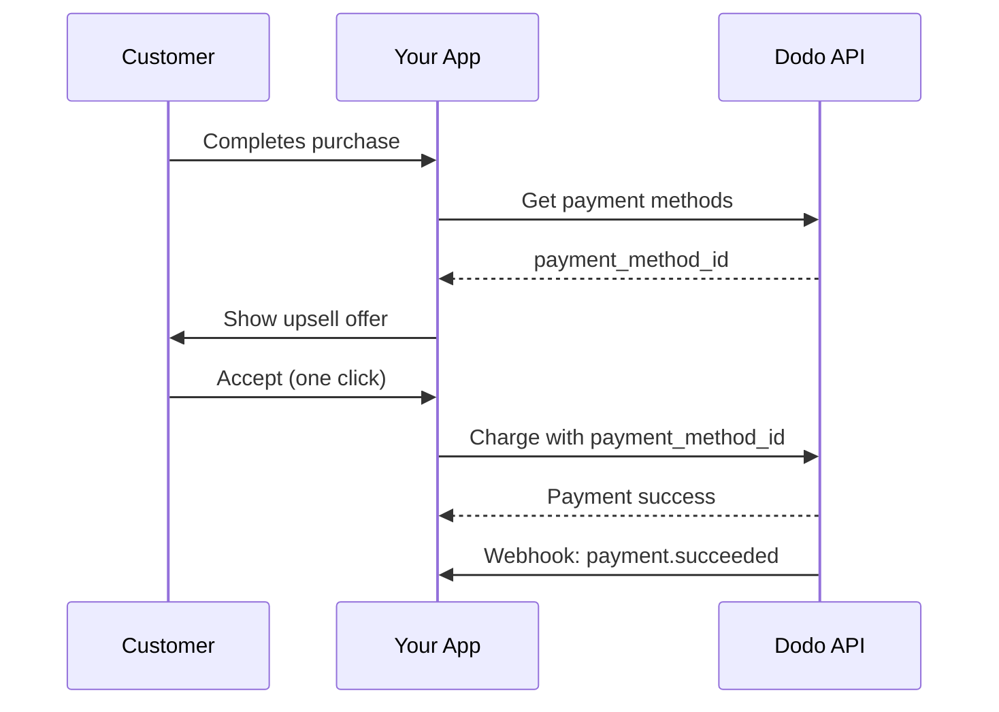
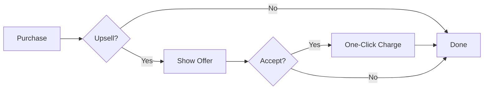
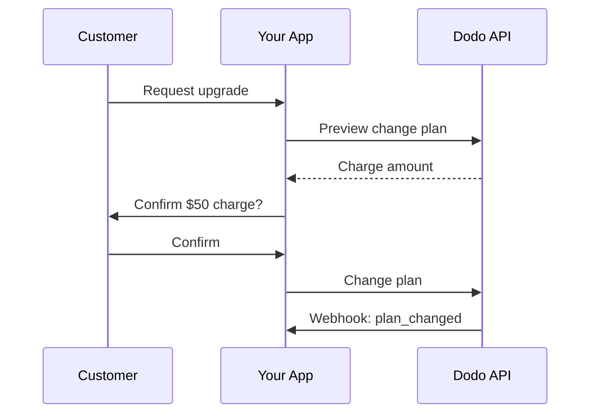
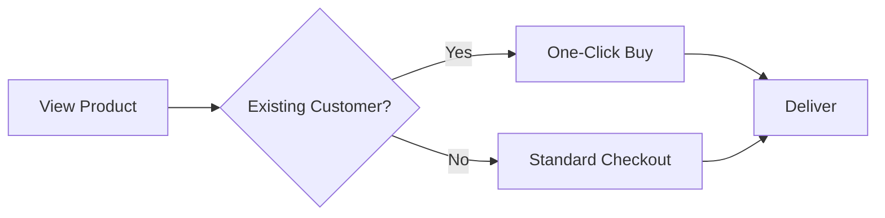

<Info>
تتيح لك العروض الإضافية والخصومات تقديم منتجات إضافية أو تغييرات في الخطط للعملاء باستخدام طرق الدفع المحفوظة. وهذا يمكّن من عمليات الشراء بنقرة واحدة تتجاوز جمع المدفوعات، مما يُحسن معدلات التحويل بشكل كبير.
</Info>

<CardGroup cols={3}>
<Card title="عروض البيع بعد الشراء" icon="cart-plus">
  عرض منتجات مكملة فوراً بعد إنهاء عملية الشراء مع إمكانية الشراء بنقرة واحدة.
</Card>

<Card title="ترقيات الاشتراك" icon="arrow-up">
  نقل العملاء إلى مستويات أعلى مع حساب تلقائي للنسب والفوترة الفورية.
</Card>

<Card title="البيع المتقاطع" icon="grid-2-plus">
  إضافة منتجات مرتبطة للعملاء الحاليين دون إعادة إدخال تفاصيل الدفع.
</Card>
</CardGroup>

## نظرة عامة

تُعَد العروض الإضافية والخصومات استراتيجيات قوية لتحسين الإيرادات:

- **العروض الإضافية**: تقديم منتج أو ترقية ذات قيمة أعلى (مثل، خطة Pro بدلاً من Basic)
- **الخصومات**: تقديم بديل بسعر أقل عند رفض العميل أو تخفيض المستوى
- **البيع المتقاطع**: اقتراح منتجات مكملة (مثل، إضافات، عناصر ذات صلة)

تُمكّن مدفوعات دودي هذه العمليات من خلال المعاملات `payment_method_id`، التي تتيح لك فرض رسوم على طريقة الدفع المحفوظة للعميل دون الحاجة إلى إعادة إدخال تفاصيل البطاقة.

### الفوائد الرئيسية

| الفائدة | التأثير |
|---------|--------|
| **عمليات الشراء بنقرة واحدة** | تجاوز نموذج الدفع بالكامل للعملاء العائدين |
| **زيادة التحويل** | تقليل الاحتكاك عند لحظة القرار |
| **معالجة فورية** | تتم معالجة الرسوم على الفور مع `confirm: true` |
| **تجربة مستخدم سلسة** | يظل العملاء في تطبيقك طوال التدفق |

## كيفية العمل



## المتطلبات الأساسية

قبل تنفيذ العروض الإضافية والخصومات، تأكد من أنك تمتلك:

<Steps>
<Step title="عميل بحالة دفع محفوظة">
  يجب أن يكون العملاء قد أكملوا على الأقل عملية شراء واحدة. يتم حفظ طرق الدفع تلقائياً عندما يكمل العملاء عملية الدفع.
</Step>

<Step title="المنتجات المكونة">
  قم بإنشاء منتجات العروض الإضافية في لوحة التحكم الخاصة بمدفوعات دودي. يمكن أن تكون هذه رسوم لمرة واحدة، أو اشتراكات، أو إضافات.
</Step>

<Step title="نهاية الويب">
  قم بإعداد عمليات الويب لمعالجة `payment.succeeded`، `payment.failed`، و`subscription.plan_changed`.
</Step>
</Steps>

## الحصول على طرق دفع العميل

قبل عرض عرض إضافي، استرجع طرق الدفع المحفوظة للعميل:

<Tabs>
<Tab title="TypeScript">

```typescript
import DodoPayments from 'dodopayments';

const client = new DodoPayments({
  bearerToken: process.env.DODO_PAYMENTS_API_KEY,
  environment: 'live_mode',
});

async function getPaymentMethods(customerId: string) {
  const paymentMethods = await client.customers.listPaymentMethods(customerId);
  
  // Returns array of saved payment methods
  // Each has: payment_method_id, type, card (last4, brand, exp_month, exp_year)
  return paymentMethods;
}

// Example usage
const methods = await getPaymentMethods('cus_123');
console.log('Available payment methods:', methods);

// Use the first available method for upsell
const primaryMethod = methods[0]?.payment_method_id;
```

</Tab>

<Tab title="Python">

```python
import os
from dodopayments import DodoPayments

client = DodoPayments(
    bearer_token=os.environ.get("DODO_PAYMENTS_API_KEY"),
    environment="live_mode",
)

def get_payment_methods(customer_id: str):
    payment_methods = client.customers.list_payment_methods(customer_id)
    
    # Returns list of saved payment methods
    # Each has: payment_method_id, type, card (last4, brand, exp_month, exp_year)
    return payment_methods

# Example usage
methods = get_payment_methods("cus_123")
print("Available payment methods:", methods)

# Use the first available method for upsell
primary_method = methods[0].payment_method_id if methods else None
```

</Tab>

<Tab title="Go">

```go
package main

import (
    "context"
    "fmt"
    "github.com/dodopayments/dodopayments-go"
    "github.com/dodopayments/dodopayments-go/option"
)

func getPaymentMethods(customerID string) ([]dodopayments.PaymentMethod, error) {
    client := dodopayments.NewClient(
        option.WithBearerToken(os.Getenv("DODO_PAYMENTS_API_KEY")),
    )
    
    methods, err := client.Customers.ListPaymentMethods(
        context.TODO(),
        customerID,
    )
    if err != nil {
        return nil, err
    }
    
    return methods, nil
}

func main() {
    methods, err := getPaymentMethods("cus_123")
    if err != nil {
        panic(err)
    }
    
    fmt.Println("Available payment methods:", methods)
    
    // Use the first available method for upsell
    if len(methods) > 0 {
        primaryMethod := methods[0].PaymentMethodID
        fmt.Println("Primary method:", primaryMethod)
    }
}
```

</Tab>
</Tabs>

<Info>
تُحفظ طرق الدفع تلقائياً عند إكمال العملاء لعملية الدفع. لا تحتاج إلى حفظها صراحة.
</Info>

## عروض البيع الإضافي بنقرة واحدة بعد الشراء

عرض منتجات إضافية فوراً بعد عملية شراء ناجحة. يمكن للعميل القبول بنقرة واحدة حيث إن طريقة الدفع الخاصة به محفوظة بالفعل.



### التنفيذ

<Tabs>
<Tab title="TypeScript">

```typescript
import DodoPayments from 'dodopayments';

const client = new DodoPayments({
  bearerToken: process.env.DODO_PAYMENTS_API_KEY,
  environment: 'live_mode',
});

async function createOneClickUpsell(
  customerId: string,
  paymentMethodId: string,
  upsellProductId: string
) {
  // Create checkout session with saved payment method
  // confirm: true processes the payment immediately
  const session = await client.checkoutSessions.create({
    product_cart: [
      {
        product_id: upsellProductId,
        quantity: 1
      }
    ],
    customer: {
      customer_id: customerId
    },
    payment_method_id: paymentMethodId,
    confirm: true,  // Required when using payment_method_id
    return_url: 'https://yourapp.com/upsell-success',
    feature_flags: {
      redirect_immediately: true  // Skip success page
    },
    metadata: {
      upsell_source: 'post_purchase',
      original_order_id: 'order_123'
    }
  });

  return session;
}

// Example: Offer premium add-on after initial purchase
async function handlePostPurchaseUpsell(customerId: string) {
  // Get customer's payment methods
  const methods = await client.customers.listPaymentMethods(customerId);
  
  if (methods.length === 0) {
    console.log('No saved payment methods available');
    return null;
  }

  // Create the upsell with one-click checkout
  const upsell = await createOneClickUpsell(
    customerId,
    methods[0].payment_method_id,
    'prod_premium_addon'
  );

  console.log('Upsell processed:', upsell.session_id);
  return upsell;
}
```

</Tab>

<Tab title="Python">

```python
import os
from dodopayments import DodoPayments

client = DodoPayments(
    bearer_token=os.environ.get("DODO_PAYMENTS_API_KEY"),
    environment="live_mode",
)

def create_one_click_upsell(
    customer_id: str,
    payment_method_id: str,
    upsell_product_id: str
):
    """Create a one-click upsell using saved payment method."""
    
    # Create checkout session with saved payment method
    # confirm=True processes the payment immediately
    session = client.checkout_sessions.create(
        product_cart=[
            {
                "product_id": upsell_product_id,
                "quantity": 1
            }
        ],
        customer={
            "customer_id": customer_id
        },
        payment_method_id=payment_method_id,
        confirm=True,  # Required when using payment_method_id
        return_url="https://yourapp.com/upsell-success",
        feature_flags={
            "redirect_immediately": True  # Skip success page
        },
        metadata={
            "upsell_source": "post_purchase",
            "original_order_id": "order_123"
        }
    )
    
    return session

def handle_post_purchase_upsell(customer_id: str):
    """Offer premium add-on after initial purchase."""
    
    # Get customer's payment methods
    methods = client.customers.list_payment_methods(customer_id)
    
    if not methods:
        print("No saved payment methods available")
        return None
    
    # Create the upsell with one-click checkout
    upsell = create_one_click_upsell(
        customer_id=customer_id,
        payment_method_id=methods[0].payment_method_id,
        upsell_product_id="prod_premium_addon"
    )
    
    print(f"Upsell processed: {upsell.session_id}")
    return upsell
```

</Tab>

<Tab title="Go">

```go
package main

import (
    "context"
    "fmt"
    "os"
    
    "github.com/dodopayments/dodopayments-go"
    "github.com/dodopayments/dodopayments-go/option"
)

func createOneClickUpsell(
    customerID string,
    paymentMethodID string,
    upsellProductID string,
) (*dodopayments.CheckoutSession, error) {
    client := dodopayments.NewClient(
        option.WithBearerToken(os.Getenv("DODO_PAYMENTS_API_KEY")),
    )
    
    // Create checkout session with saved payment method
    // Confirm: true processes the payment immediately
    session, err := client.CheckoutSessions.Create(context.TODO(), dodopayments.CheckoutSessionCreateParams{
        ProductCart: dodopayments.F([]dodopayments.CheckoutSessionCreateParamsProductCart{
            {
                ProductID: dodopayments.F(upsellProductID),
                Quantity:  dodopayments.F(int64(1)),
            },
        }),
        Customer: dodopayments.F(dodopayments.CheckoutSessionCreateParamsCustomer{
            CustomerID: dodopayments.F(customerID),
        }),
        PaymentMethodID: dodopayments.F(paymentMethodID),
        Confirm:         dodopayments.F(true), // Required when using payment_method_id
        ReturnURL:       dodopayments.F("https://yourapp.com/upsell-success"),
        FeatureFlags: dodopayments.F(dodopayments.CheckoutSessionCreateParamsFeatureFlags{
            RedirectImmediately: dodopayments.F(true), // Skip success page
        }),
        Metadata: dodopayments.F(map[string]string{
            "upsell_source":     "post_purchase",
            "original_order_id": "order_123",
        }),
    })
    
    return session, err
}

func handlePostPurchaseUpsell(customerID string) (*dodopayments.CheckoutSession, error) {
    client := dodopayments.NewClient(
        option.WithBearerToken(os.Getenv("DODO_PAYMENTS_API_KEY")),
    )
    
    // Get customer's payment methods
    methods, err := client.Customers.ListPaymentMethods(context.TODO(), customerID)
    if err != nil {
        return nil, err
    }
    
    if len(methods) == 0 {
        fmt.Println("No saved payment methods available")
        return nil, nil
    }
    
    // Create the upsell with one-click checkout
    upsell, err := createOneClickUpsell(
        customerID,
        methods[0].PaymentMethodID,
        "prod_premium_addon",
    )
    if err != nil {
        return nil, err
    }
    
    fmt.Printf("Upsell processed: %s\n", upsell.SessionID)
    return upsell, nil
}
```

</Tab>
</Tabs>

<Warning>
عند استخدام `payment_method_id`، يجب عليك ضبط `confirm: true` وتوفير `customer_id` موجود. يجب أن تخص طرق الدفع هذا العميل.
</Warning>

## ترقيات الاشتراك

نقل العملاء إلى خطط اشتراك أعلى مع معالجة تلقائية للنسب.



### المعاينة قبل الالتزام

دائماً معاينة تغييرات الخطط لإظهار العملاء بالضبط ما سيتعين عليهم دفعه:

<Tabs>
<Tab title="TypeScript">

```typescript
async function previewUpgrade(
  subscriptionId: string,
  newProductId: string
) {
  const preview = await client.subscriptions.previewChangePlan(subscriptionId, {
    product_id: newProductId,
    quantity: 1,
    proration_billing_mode: 'difference_immediately'
  });

  return {
    immediateCharge: preview.immediate_charge?.summary,
    newPlan: preview.new_plan,
    effectiveDate: preview.effective_date
  };
}

// Show customer the charge before confirming
const preview = await previewUpgrade('sub_123', 'prod_pro_plan');
console.log(`Upgrade will charge: ${preview.immediateCharge}`);
```

</Tab>

<Tab title="Python">

```python
def preview_upgrade(subscription_id: str, new_product_id: str):
    preview = client.subscriptions.preview_change_plan(
        subscription_id=subscription_id,
        product_id=new_product_id,
        quantity=1,
        proration_billing_mode="difference_immediately"
    )
    
    return {
        "immediate_charge": preview.immediate_charge.summary if preview.immediate_charge else None,
        "new_plan": preview.new_plan,
        "effective_date": preview.effective_date
    }

# Show customer the charge before confirming
preview = preview_upgrade("sub_123", "prod_pro_plan")
print(f"Upgrade will charge: {preview['immediate_charge']}")
```

</Tab>

<Tab title="Go">

```go
func previewUpgrade(subscriptionID string, newProductID string) (map[string]interface{}, error) {
    client := dodopayments.NewClient(
        option.WithBearerToken(os.Getenv("DODO_PAYMENTS_API_KEY")),
    )
    
    preview, err := client.Subscriptions.PreviewChangePlan(
        context.TODO(),
        subscriptionID,
        dodopayments.SubscriptionPreviewChangePlanParams{
            ProductID:             dodopayments.F(newProductID),
            Quantity:              dodopayments.F(int64(1)),
            ProrationBillingMode:  dodopayments.F(dodopayments.ProrationBillingModeDifferenceImmediately),
        },
    )
    if err != nil {
        return nil, err
    }
    
    return map[string]interface{}{
        "immediate_charge": preview.ImmediateCharge.Summary,
        "new_plan":         preview.NewPlan,
        "effective_date":   preview.EffectiveDate,
    }, nil
}
```

</Tab>
</Tabs>

### تنفيذ الترقية

<Tabs>
<Tab title="TypeScript">

```typescript
async function upgradeSubscription(
  subscriptionId: string,
  newProductId: string,
  prorationMode: 'prorated_immediately' | 'difference_immediately' | 'full_immediately' = 'difference_immediately'
) {
  const result = await client.subscriptions.changePlan(subscriptionId, {
    product_id: newProductId,
    quantity: 1,
    proration_billing_mode: prorationMode
  });

  return {
    status: result.status,
    subscriptionId: result.subscription_id,
    paymentId: result.payment_id,
    invoiceId: result.invoice_id
  };
}

// Upgrade from Basic ($30) to Pro ($80)
// With difference_immediately: charges $50 instantly
const upgrade = await upgradeSubscription('sub_123', 'prod_pro_plan');
console.log('Upgrade status:', upgrade.status);
```

</Tab>

<Tab title="Python">

```python
def upgrade_subscription(
    subscription_id: str,
    new_product_id: str,
    proration_mode: str = "difference_immediately"
):
    result = client.subscriptions.change_plan(
        subscription_id=subscription_id,
        product_id=new_product_id,
        quantity=1,
        proration_billing_mode=proration_mode
    )
    
    return {
        "status": result.status,
        "subscription_id": result.subscription_id,
        "payment_id": result.payment_id,
        "invoice_id": result.invoice_id
    }

# Upgrade from Basic ($30) to Pro ($80)
# With difference_immediately: charges $50 instantly
upgrade = upgrade_subscription("sub_123", "prod_pro_plan")
print(f"Upgrade status: {upgrade['status']}")
```

</Tab>

<Tab title="Go">

```go
func upgradeSubscription(
    subscriptionID string,
    newProductID string,
    prorationMode dodopayments.ProrationBillingMode,
) (*dodopayments.SubscriptionChangePlanResponse, error) {
    client := dodopayments.NewClient(
        option.WithBearerToken(os.Getenv("DODO_PAYMENTS_API_KEY")),
    )
    
    result, err := client.Subscriptions.ChangePlan(
        context.TODO(),
        subscriptionID,
        dodopayments.SubscriptionChangePlanParams{
            ProductID:            dodopayments.F(newProductID),
            Quantity:             dodopayments.F(int64(1)),
            ProrationBillingMode: dodopayments.F(prorationMode),
        },
    )
    
    return result, err
}

// Upgrade from Basic ($30) to Pro ($80)
// With DifferenceImmediately: charges $50 instantly
upgrade, err := upgradeSubscription(
    "sub_123",
    "prod_pro_plan",
    dodopayments.ProrationBillingModeDifferenceImmediately,
)
if err != nil {
    panic(err)
}
fmt.Printf("Upgrade status: %s\n", upgrade.Status)
```

</Tab>
</Tabs>

### أوضاع النسب

اختر كيفية محاسبة العملاء عند الترقية:

| الوضع | السلوك | الأفضل ل |
|------|----------|----------|
| `difference_immediately` | يحاسب الفارق في السعر على الفور ($30→$80 = $50) | ترقيات بسيطة |
| `prorated_immediately` | يحاسب بناءً على الوقت المتبقي في دورة الفوترة | فوترة عادلة قائمة على الوقت |
| `full_immediately` | يحاسب السعر الكامل للخطة الجديدة، ويتجاهل الوقت المتبقي | إعادة تعيين دورة الفوترة |

<Tip>
استخدم `difference_immediately` لتدفقات الترقية البسيطة. استخدم `prorated_immediately` عندما تريد أخذ الوقت غير المستخدم في الخطة الحالية في الاعتبار.
</Tip>

## البيع المتقاطع

إضافة منتجات مكملة للعملاء الحاليين دون الحاجة إلى إعادة إدخال تفاصيل الدفع.



### التنفيذ

<Tabs>
<Tab title="TypeScript">

```typescript
async function createCrossSell(
  customerId: string,
  paymentMethodId: string,
  productId: string,
  quantity: number = 1
) {
  // Create a one-time payment using saved payment method
  const payment = await client.payments.create({
    product_cart: [
      {
        product_id: productId,
        quantity: quantity
      }
    ],
    customer_id: customerId,
    payment_method_id: paymentMethodId,
    return_url: 'https://yourapp.com/purchase-complete',
    metadata: {
      purchase_type: 'cross_sell',
      source: 'product_recommendation'
    }
  });

  return payment;
}

// Example: Customer bought a course, offer related ebook
async function offerRelatedProduct(customerId: string, relatedProductId: string) {
  const methods = await client.customers.listPaymentMethods(customerId);
  
  if (methods.length === 0) {
    // Fall back to standard checkout
    return client.checkoutSessions.create({
      product_cart: [{ product_id: relatedProductId, quantity: 1 }],
      customer: { customer_id: customerId },
      return_url: 'https://yourapp.com/purchase-complete'
    });
  }

  // One-click purchase
  return createCrossSell(customerId, methods[0].payment_method_id, relatedProductId);
}
```

</Tab>

<Tab title="Python">

```python
def create_cross_sell(
    customer_id: str,
    payment_method_id: str,
    product_id: str,
    quantity: int = 1
):
    """Create a one-time payment using saved payment method."""
    
    payment = client.payments.create(
        product_cart=[
            {
                "product_id": product_id,
                "quantity": quantity
            }
        ],
        customer_id=customer_id,
        payment_method_id=payment_method_id,
        return_url="https://yourapp.com/purchase-complete",
        metadata={
            "purchase_type": "cross_sell",
            "source": "product_recommendation"
        }
    )
    
    return payment

def offer_related_product(customer_id: str, related_product_id: str):
    """Offer related product with one-click purchase if possible."""
    
    methods = client.customers.list_payment_methods(customer_id)
    
    if not methods:
        # Fall back to standard checkout
        return client.checkout_sessions.create(
            product_cart=[{"product_id": related_product_id, "quantity": 1}],
            customer={"customer_id": customer_id},
            return_url="https://yourapp.com/purchase-complete"
        )
    
    # One-click purchase
    return create_cross_sell(customer_id, methods[0].payment_method_id, related_product_id)
```

</Tab>

<Tab title="Go">

```go
func createCrossSell(
    customerID string,
    paymentMethodID string,
    productID string,
    quantity int64,
) (*dodopayments.Payment, error) {
    client := dodopayments.NewClient(
        option.WithBearerToken(os.Getenv("DODO_PAYMENTS_API_KEY")),
    )
    
    payment, err := client.Payments.Create(context.TODO(), dodopayments.PaymentCreateParams{
        ProductCart: dodopayments.F([]dodopayments.PaymentCreateParamsProductCart{
            {
                ProductID: dodopayments.F(productID),
                Quantity:  dodopayments.F(quantity),
            },
        }),
        CustomerID:      dodopayments.F(customerID),
        PaymentMethodID: dodopayments.F(paymentMethodID),
        ReturnURL:       dodopayments.F("https://yourapp.com/purchase-complete"),
        Metadata: dodopayments.F(map[string]string{
            "purchase_type": "cross_sell",
            "source":        "product_recommendation",
        }),
    })
    
    return payment, err
}

func offerRelatedProduct(customerID string, relatedProductID string) (interface{}, error) {
    client := dodopayments.NewClient(
        option.WithBearerToken(os.Getenv("DODO_PAYMENTS_API_KEY")),
    )
    
    methods, err := client.Customers.ListPaymentMethods(context.TODO(), customerID)
    if err != nil {
        return nil, err
    }
    
    if len(methods) == 0 {
        // Fall back to standard checkout
        return client.CheckoutSessions.Create(context.TODO(), dodopayments.CheckoutSessionCreateParams{
            ProductCart: dodopayments.F([]dodopayments.CheckoutSessionCreateParamsProductCart{
                {ProductID: dodopayments.F(relatedProductID), Quantity: dodopayments.F(int64(1))},
            }),
            Customer:  dodopayments.F(dodopayments.CheckoutSessionCreateParamsCustomer{CustomerID: dodopayments.F(customerID)}),
            ReturnURL: dodopayments.F("https://yourapp.com/purchase-complete"),
        })
    }
    
    // One-click purchase
    return createCrossSell(customerID, methods[0].PaymentMethodID, relatedProductID, 1)
}
```

</Tab>
</Tabs>

## تخفيضات الاشتراك

عندما يرغب العملاء في الانتقال إلى خطة ذات مستوى أدنى، يتم التعامل مع الانتقال بشكل سلس مع تقديم اعتمادات تلقائية.

### كيفية عمل التخفيضات

1. يطلب العميل التخفيض (Pro → Basic)
2. يحسب النظام القيمة المتبقية في الخطة الحالية
3. يتم إضافة ائتمان إلى الاشتراك للتجديدات المستقبلية
4. ينتقل العميل إلى الخطة الجديدة على الفور

<Tabs>
<Tab title="TypeScript">

```typescript
async function downgradeSubscription(
  subscriptionId: string,
  newProductId: string
) {
  // Preview the downgrade first
  const preview = await client.subscriptions.previewChangePlan(subscriptionId, {
    product_id: newProductId,
    quantity: 1,
    proration_billing_mode: 'difference_immediately'
  });

  console.log('Credit to be applied:', preview.credit_amount);

  // Execute the downgrade
  const result = await client.subscriptions.changePlan(subscriptionId, {
    product_id: newProductId,
    quantity: 1,
    proration_billing_mode: 'difference_immediately'
  });

  // Credits are automatically applied to future renewals
  return result;
}

// Downgrade from Pro ($80) to Basic ($30)
// $50 credit added to subscription, auto-applied on next renewal
const downgrade = await downgradeSubscription('sub_123', 'prod_basic_plan');
```

</Tab>

<Tab title="Python">

```python
def downgrade_subscription(subscription_id: str, new_product_id: str):
    # Preview the downgrade first
    preview = client.subscriptions.preview_change_plan(
        subscription_id=subscription_id,
        product_id=new_product_id,
        quantity=1,
        proration_billing_mode="difference_immediately"
    )
    
    print(f"Credit to be applied: {preview.credit_amount}")
    
    # Execute the downgrade
    result = client.subscriptions.change_plan(
        subscription_id=subscription_id,
        product_id=new_product_id,
        quantity=1,
        proration_billing_mode="difference_immediately"
    )
    
    # Credits are automatically applied to future renewals
    return result

# Downgrade from Pro ($80) to Basic ($30)
# $50 credit added to subscription, auto-applied on next renewal
downgrade = downgrade_subscription("sub_123", "prod_basic_plan")
```

</Tab>

<Tab title="Go">

```go
func downgradeSubscription(subscriptionID string, newProductID string) (*dodopayments.SubscriptionChangePlanResponse, error) {
    client := dodopayments.NewClient(
        option.WithBearerToken(os.Getenv("DODO_PAYMENTS_API_KEY")),
    )
    
    // Preview the downgrade first
    preview, err := client.Subscriptions.PreviewChangePlan(
        context.TODO(),
        subscriptionID,
        dodopayments.SubscriptionPreviewChangePlanParams{
            ProductID:            dodopayments.F(newProductID),
            Quantity:             dodopayments.F(int64(1)),
            ProrationBillingMode: dodopayments.F(dodopayments.ProrationBillingModeDifferenceImmediately),
        },
    )
    if err != nil {
        return nil, err
    }
    
    fmt.Printf("Credit to be applied: %v\n", preview.CreditAmount)
    
    // Execute the downgrade
    result, err := client.Subscriptions.ChangePlan(
        context.TODO(),
        subscriptionID,
        dodopayments.SubscriptionChangePlanParams{
            ProductID:            dodopayments.F(newProductID),
            Quantity:             dodopayments.F(int64(1)),
            ProrationBillingMode: dodopayments.F(dodopayments.ProrationBillingModeDifferenceImmediately),
        },
    )
    
    return result, err
}
```

</Tab>
</Tabs>

<Info>
تُحسب الاعتمادات الناجمة عن التخفيضات باستخدام `difference_immediately` بموجب الاشتراك والتطبيق تلقائياً على التجديدات المستقبلية. وهي متميزة عن [الاعتمادات الخاصة بالعملاء](/features/customer-credit).
</Info>

## مثال كامل: تدفق عرض البيع الإضافي بعد الشراء

إليك نموذج كامل يُظهر كيفية تقديم عرض إضافي بعد عملية شراء ناجحة:

<Tabs>
<Tab title="TypeScript">

```typescript
import DodoPayments from 'dodopayments';
import express from 'express';

const client = new DodoPayments({
  bearerToken: process.env.DODO_PAYMENTS_API_KEY,
  environment: 'live_mode',
});

const app = express();

// Store for tracking upsell eligibility (use your database in production)
const eligibleUpsells = new Map<string, { customerId: string; productId: string }>();

// Webhook handler for initial purchase success
app.post('/webhooks/dodo', express.raw({ type: 'application/json' }), async (req, res) => {
  const event = JSON.parse(req.body.toString());
  
  switch (event.type) {
    case 'payment.succeeded':
      // Check if customer is eligible for upsell
      const customerId = event.data.customer_id;
      const productId = event.data.product_id;
      
      // Define upsell rules (e.g., bought Basic, offer Pro)
      const upsellProduct = getUpsellProduct(productId);
      
      if (upsellProduct) {
        eligibleUpsells.set(customerId, {
          customerId,
          productId: upsellProduct
        });
      }
      break;
      
    case 'payment.failed':
      console.log('Payment failed:', event.data.payment_id);
      // Handle failed upsell payment
      break;
  }
  
  res.json({ received: true });
});

// API endpoint to check upsell eligibility
app.get('/api/upsell/:customerId', async (req, res) => {
  const { customerId } = req.params;
  const upsell = eligibleUpsells.get(customerId);
  
  if (!upsell) {
    return res.json({ eligible: false });
  }
  
  // Get payment methods
  const methods = await client.customers.listPaymentMethods(customerId);
  
  if (methods.length === 0) {
    return res.json({ eligible: false, reason: 'no_payment_method' });
  }
  
  // Get product details for display
  const product = await client.products.retrieve(upsell.productId);
  
  res.json({
    eligible: true,
    product: {
      id: product.product_id,
      name: product.name,
      price: product.price,
      currency: product.currency
    },
    paymentMethodId: methods[0].payment_method_id
  });
});

// API endpoint to accept upsell
app.post('/api/upsell/:customerId/accept', async (req, res) => {
  const { customerId } = req.params;
  const upsell = eligibleUpsells.get(customerId);
  
  if (!upsell) {
    return res.status(400).json({ error: 'No upsell available' });
  }
  
  try {
    const methods = await client.customers.listPaymentMethods(customerId);
    
    // Create one-click purchase
    const session = await client.checkoutSessions.create({
      product_cart: [{ product_id: upsell.productId, quantity: 1 }],
      customer: { customer_id: customerId },
      payment_method_id: methods[0].payment_method_id,
      confirm: true,
      return_url: `${process.env.APP_URL}/upsell-success`,
      feature_flags: { redirect_immediately: true },
      metadata: { upsell: 'true', source: 'post_purchase' }
    });
    
    // Clear the upsell offer
    eligibleUpsells.delete(customerId);
    
    res.json({ success: true, sessionId: session.session_id });
  } catch (error) {
    console.error('Upsell failed:', error);
    res.status(500).json({ error: 'Upsell processing failed' });
  }
});

// Helper function to determine upsell product
function getUpsellProduct(purchasedProductId: string): string | null {
  const upsellMap: Record<string, string> = {
    'prod_basic_plan': 'prod_pro_plan',
    'prod_starter_course': 'prod_complete_bundle',
    'prod_single_license': 'prod_team_license'
  };
  
  return upsellMap[purchasedProductId] || null;
}

app.listen(3000);
```

</Tab>

<Tab title="Python">

```python
import os
from flask import Flask, request, jsonify
from dodopayments import DodoPayments

client = DodoPayments(
    bearer_token=os.environ.get("DODO_PAYMENTS_API_KEY"),
    environment="live_mode",
)

app = Flask(__name__)

# Store for tracking upsell eligibility (use your database in production)
eligible_upsells = {}

@app.route('/webhooks/dodo', methods=['POST'])
def webhook_handler():
    event = request.json
    
    if event['type'] == 'payment.succeeded':
        # Check if customer is eligible for upsell
        customer_id = event['data']['customer_id']
        product_id = event['data']['product_id']
        
        # Define upsell rules
        upsell_product = get_upsell_product(product_id)
        
        if upsell_product:
            eligible_upsells[customer_id] = {
                'customer_id': customer_id,
                'product_id': upsell_product
            }
    
    elif event['type'] == 'payment.failed':
        print(f"Payment failed: {event['data']['payment_id']}")
    
    return jsonify({'received': True})

@app.route('/api/upsell/<customer_id>', methods=['GET'])
def check_upsell(customer_id):
    upsell = eligible_upsells.get(customer_id)
    
    if not upsell:
        return jsonify({'eligible': False})
    
    # Get payment methods
    methods = client.customers.list_payment_methods(customer_id)
    
    if not methods:
        return jsonify({'eligible': False, 'reason': 'no_payment_method'})
    
    # Get product details for display
    product = client.products.retrieve(upsell['product_id'])
    
    return jsonify({
        'eligible': True,
        'product': {
            'id': product.product_id,
            'name': product.name,
            'price': product.price,
            'currency': product.currency
        },
        'payment_method_id': methods[0].payment_method_id
    })

@app.route('/api/upsell/<customer_id>/accept', methods=['POST'])
def accept_upsell(customer_id):
    upsell = eligible_upsells.get(customer_id)
    
    if not upsell:
        return jsonify({'error': 'No upsell available'}), 400
    
    try:
        methods = client.customers.list_payment_methods(customer_id)
        
        # Create one-click purchase
        session = client.checkout_sessions.create(
            product_cart=[{'product_id': upsell['product_id'], 'quantity': 1}],
            customer={'customer_id': customer_id},
            payment_method_id=methods[0].payment_method_id,
            confirm=True,
            return_url=f"{os.environ['APP_URL']}/upsell-success",
            feature_flags={'redirect_immediately': True},
            metadata={'upsell': 'true', 'source': 'post_purchase'}
        )
        
        # Clear the upsell offer
        del eligible_upsells[customer_id]
        
        return jsonify({'success': True, 'session_id': session.session_id})
    
    except Exception as error:
        print(f"Upsell failed: {error}")
        return jsonify({'error': 'Upsell processing failed'}), 500

def get_upsell_product(purchased_product_id: str) -> str:
    """Determine upsell product based on purchased product."""
    upsell_map = {
        'prod_basic_plan': 'prod_pro_plan',
        'prod_starter_course': 'prod_complete_bundle',
        'prod_single_license': 'prod_team_license'
    }
    return upsell_map.get(purchased_product_id)

if __name__ == '__main__':
    app.run(port=3000)
```

</Tab>
</Tabs>

## أفضل الممارسات

<AccordionGroup>
<Accordion title="قم بتوقيت عروض البيع الإضافية بشكل استراتيجي">
أفضل وقت لتقديم عرض إضافي هو مباشرة بعد عملية شراء ناجحة عندما يكون العملاء في عقلية الشراء. لحظات فعالة أخرى:
- بعد نقاط التحميل الوظيفية
- عند الاقتراب من حدود الخطة
- خلال إكمال عملية الإعداد
</Accordion>

<Accordion title="تحقق من أهلية طريقة الدفع">
قبل محاولة فرض رسوم بنقرة واحدة، تحقق من طريقة الدفع:
- هل تتوافق مع عملة المنتج
- لم تنتهي صلاحيتها
- تخص العميل


سيتحقق واجهة برمجة التطبيقات من ذلك، لكن التحقق بشكل استباقي يُحسن تجربة المستخدم.
</Accordion>

<Accordion title="تعامل مع الفشل بشكل سلس">
عند فشل عمليات رسوم بنقرة واحدة:
1. العودة إلى تدفق الدفع القياسي
2. إخطار العميل برسالة واضحة
3. عرض تحديث طريقة الدفع
4. عدم محاولة فرض رسوم فاشلة مراراً
</Accordion>

<Accordion title="قدم عرض قيمة واضح">
تتحسن معدلات التحويل عند فهم العملاء للقيمة:
- عرض ما يحصلون عليه مقارنة بالخطة الحالية
- تسليط الضوء على الفرق في السعر، وليس سعر الإجمالي
- استخدام الدلائل الاجتماعية (مثل، "الترقية الأكثر شعبية")
</Accordion>

<Accordion title="احترم اختيار العملاء">
- قدم دائماً وسيلة سهلة للرفض
- لا تُظهر نفس العرض الإضافي بشكل متكرر بعد الرفض
- تتبع وتحليل أي العروض الإضافية قد تحولت لتحسين العروض
</Accordion>
</AccordionGroup>

## عمليات الويب للمراقبة

تتبع هذه الأحداث الخاصة بعوامل الويب لتدفقات العرض الإضافي والتقليل:

| الحدث | الزناد | الإجراء |
|-------|---------|--------|
| `payment.succeeded` | تمت عملية الدفع للعروض الإضافية/البيع المتقاطع بنجاح | تسليم المنتج، تحديث الوصول |
| `payment.failed` | فشل فرض رسوم بنقرة واحدة | عرض خطأ، تقديم المحاولة مرة أخرى أو التراجع |
| `subscription.plan_changed` | تمت الترقية/التخفيض بنجاح | تحديث الميزات، إرسال تأكيد |
| `subscription.active` | تمت إعادة تفعيل الاشتراك بعد تغيير الخطة | منح الوصول إلى المستوى الجديد |

<Card title="دليل تكامل الويب" icon="webhook" href="/developer-resources/webhooks">
  تعلم كيفية إعداد والتحقق من نقاط نهاية عمليات الويب.
</Card>

## الموارد ذات الصلة

<CardGroup cols={2}>
<Card title="دليل ترقية الاشتراك" icon="arrows-rotate" href="/developer-resources/subscription-upgrade-downgrade">
  دليل مفصل حول تغييرات الخطط، أوضاع النسب، ومعالجة الفشل.
</Card>

<Card title="جلسات الدفع" icon="cart-shopping" href="/developer-resources/checkout-session">
  مرجع كامل لإنشاء جلسات الدفع مع جميع الخيارات.
</Card>

<Card title="واجهة برمجة تطبيقات طرق الدفع للعملاء" icon="credit-card" href="/api-reference/customers/get-customer-payment-methods">
  مرجع API لقائمة طرق الدفع للعملاء.
</Card>

<Card title="الإضافات" icon="puzzle-piece" href="/features/addons">
  تعزيز الاشتراكات بإضافات مرنة لتحقيق إيرادات إضافية.
</Card>
</CardGroup>
