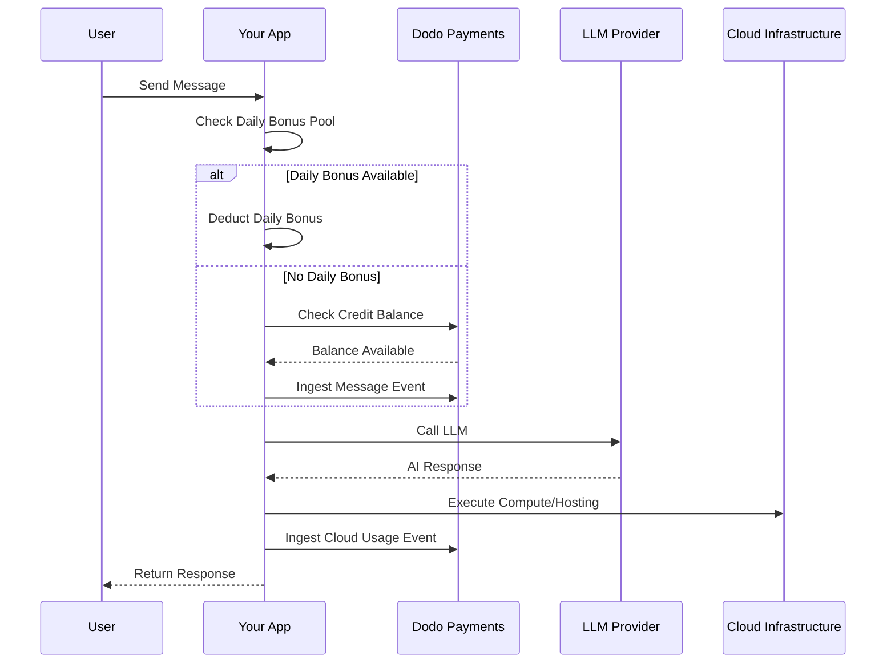

Lovable (lovable.dev) 是一个采用基于积分的订阅模式的 AI Web 应用程序构建器。与基于 Token 的系统不同，Lovable 通过每条消息收取一个积分来简化用户体验。此模式将月度积分池与每日奖励滴水相结合，以鼓励持续参与，同时允许突发使用。

## Lovable 的计费模型

Lovable 的定价围绕消息积分和云基础设施的独立计量计费构建。

| 计划 | 价格 | 月度积分 | 每日奖励 | 主要功能 |
| :--- | :--- | :--- | :--- | :--- |
| 免费 | $0/月 | 0 | 每天 5 分（最多每月 30 分） | 仅限公共项目 |
| 专业 | $25/月 | 100 | 每天 5 分（每月最多共 150 分） | 按需充值、基于使用的云 + AI、定制域名 |
| 商务 | $50/月 | 100 | 每天 5 分 | SSO、团队工作空间、设计模板、安全中心 |
| 企业 | 定制 | 定制 | 定制 | SCIM、专属支持、审计日志 |

- **基于积分的订阅**：1 积分 = 向 AI 发送 1 条消息/提示。
- **积分可在无限用户之间共享**：团队共享池，而非按座分配。
- **积分在每个计费周期重置**：月度积分在续订时刷新。
- **按需积分充值**：用户用完积分后可以购买更多积分。
- **独立基于使用量的云 + AI 计费**：主机和计算的计量计费。
- **每日奖励积分每天重置**：每日使用或失去的 5 积分滴水。

## 独特之处

- **基于消息的简单性**：1 积分 = 1 条消息，无论复杂程度如何。无需计数 Token 或计算模型权重。
- **每日滴水 + 月度池混合**：每日的 5 积分奖励创造了一个每日参与激励，而 100 积分的月度池允许突发使用。
- **团队共享池**：积分在无限用户之间共享，对团队统一收费，而非按座收费。
- **双层计费**：AI 交互的积分 + 独立的云基础设施计量计费。

## 使用 Dodo Payments 构建此模型

你可以使用 Dodo Payments 的积分授权和基于使用的计量来复制 Lovable 的混合模型。

<Steps>
  <Step title="Create a Custom Unit Credit Entitlement">
    在你的 Dodo Payments 仪表板中定义消息积分系统。此授权处理月度积分池。

    - **积分类型**：自定义单位
    - **单位名称**："Messages"
    - **精确度**：0
    - **积分到期**：30 天
    - **超额**：禁用（积分至 0 时硬性上限）
  </Step>

  <Step title="Create Subscription Products">
    创建你的计划并附加积分授权。对于免费计划，你将通过应用逻辑处理每日奖励。

    - **免费**：$0/月，0 积分（通过应用逻辑处理每日奖励）
    - **专业**：$25/月，100 积分/周期，附加积分授权
    - **商务**：$50/月，100 积分/周期，附加积分授权

    ```typescript
    import DodoPayments from 'dodopayments';

    const client = new DodoPayments({
      bearerToken: process.env.DODO_PAYMENTS_API_KEY,
    });

    const session = await client.checkoutSessions.create({
      product_cart: [
        { product_id: 'prod_lovable_pro', quantity: 1 }
      ],
      customer: { email: 'user@example.com' },
      return_url: 'https://lovable.dev/dashboard'
    });
    ```

  </Step>

  <Step title="Create a Usage Meter for Cloud + AI">
    Lovable 对云基础设施单独计费。创建一个计量器来跟踪这些成本。

    - **计量器名称**：`cloud.compute_seconds`
    - **聚合**：在 `compute_seconds` 属性上求和

    将此计量器附加到你的订阅产品上，按单位定价。消耗数据时，Dodo 根据你的费率计算成本。

    ```typescript
    await client.usageEvents.ingest({
      events: [{
        event_id: `compute_${Date.now()}`,
        customer_id: 'cust_123',
        event_name: 'cloud.compute_seconds',
        timestamp: new Date().toISOString(),
        metadata: {
          compute_seconds: 3600,
          project_id: 'proj_abc'
        }
      }]
    });
    ```

  </Step>

  <Step title="Implement Daily Bonus Credits (Application Logic)">
    每日奖励滴水在应用级别处理。你可以使用 cron 作业来授予这些积分或在数据库中单独跟踪。

    要在 Dodo 中跟踪这些奖励积分的使用而不立即耗尽主要授权余额，你可以使用单独的事件名称或在应用中处理逻辑以首先检查奖励池。

    ```typescript
    // Example cron job logic (pseudo-code)
    // Every day at midnight UTC:
    // 1. Reset 'daily_bonus_used' to 0 for all users in your DB
    
    // When a user sends a message:
    async function handleMessage(userId: string) {
      const user = await db.users.findUnique({ where: { id: userId } });
      
      if (user.daily_bonus_used < 5) {
        // Use daily bonus
        await db.users.update({
          where: { id: userId },
          data: { daily_bonus_used: { increment: 1 } }
        });
        // Track for analytics but don't deduct from Dodo credits yet
        await client.usageEvents.ingest({
          events: [{
            event_id: `msg_bonus_${Date.now()}`,
            customer_id: userId,
            event_name: 'ai.message.bonus',
            timestamp: new Date().toISOString(),
            metadata: { type: 'daily_bonus' }
          }]
        });
      } else {
        // Deduct from Dodo credit entitlement
        await client.usageEvents.ingest({
          events: [{
            event_id: `msg_${Date.now()}`,
            customer_id: userId,
            event_name: 'ai.message',
            timestamp: new Date().toISOString(),
            metadata: { type: 'subscription_credit' }
          }]
        });
      }
    }
    ```

  </Step>

  <Step title="Send Usage Events for Messages">
    将每条 AI 消息跟踪为使用事件。在 Dodo 仪表板中将 `ai.message` 事件链接到你的 "Messages" 积分授权。

    ```typescript
    await client.usageEvents.ingest({
      events: [{
        event_id: `msg_${Date.now()}`,
        customer_id: 'cust_123',
        event_name: 'ai.message',
        timestamp: new Date().toISOString(),
        metadata: {
          content_length: 450,
          project_id: 'proj_abc',
          feature_type: 'editor'
        }
      }]
    });
    ```

  </Step>

  <Step title="Handle Webhooks for Low Balance">
    通知用户当他们的积分余额不足时，以便充值或升级。

    ```typescript
    import DodoPayments from 'dodopayments';
    import express from 'express';

    const app = express();
    app.use(express.raw({ type: 'application/json' }));

    const client = new DodoPayments({
      bearerToken: process.env.DODO_PAYMENTS_API_KEY,
      webhookKey: process.env.DODO_PAYMENTS_WEBHOOK_KEY,
    });

    app.post('/webhooks/dodo', async (req, res) => {
      try {
        const event = client.webhooks.unwrap(req.body.toString(), {
          headers: {
            'webhook-id': req.headers['webhook-id'] as string,
            'webhook-signature': req.headers['webhook-signature'] as string,
            'webhook-timestamp': req.headers['webhook-timestamp'] as string,
          },
        });

        if (event.type === 'credit.balance_low') {
          const { customer_id, available_balance } = event.data;
          await notifyUser(customer_id, `Your balance is low: ${available_balance} messages left.`);
        }

        res.json({ received: true });
      } catch (error) {
        res.status(401).json({ error: 'Invalid signature' });
      }
    });
    ```

  </Step>
</Steps>

## 加速使用 LLM 摄取蓝图

[LLM 摄取蓝图](/developer-resources/ingestion-blueprints/llm) 通过包装你的 AI 客户端简化跟踪。

```typescript
import { createLLMTracker } from '@dodopayments/ingestion-blueprints';
import OpenAI from 'openai';

const tracker = createLLMTracker({
  apiKey: process.env.DODO_PAYMENTS_API_KEY,
  environment: 'live_mode',
  eventName: 'ai.message',
});

const trackedClient = tracker.wrap({
  client: new OpenAI(),
  customerId: 'cust_123',
});

// Automatically tracks the message and deducts 1 credit (if configured)
await trackedClient.chat.completions.create({
  model: 'gpt-4o',
  messages: [{ role: 'user', content: 'Build a landing page' }],
});
```

<Tip>
  查看 [完整蓝图文档](/developer-resources/ingestion-blueprints/llm) 了解有关自动跟踪的更多详细信息。
</Tip>

## 架构概览



## 使用的 Dodo 关键功能

探索让此实现成为可能的功能。

<CardGroup cols={2}>
  <Card title="Credit-Based Billing" icon="coins" href="/features/credit-based-billing">
    管理消息积分和共享团队池。
  </Card>
  <Card title="Subscriptions" icon="calendar" href="/features/subscription">
    为专业和商务层设置定期计划。
  </Card>
  <Card title="Usage-Based Billing" icon="chart-line" href="/features/usage-based-billing/introduction">
    独立于 AI 积分计量云基础设施使用。
  </Card>
  <Card title="Event Ingestion" icon="bolt" href="/features/usage-based-billing/event-ingestion">
    发送大量消息和计算事件到 Dodo。
  </Card>
  <Card title="Webhooks" icon="webhook" href="/developer-resources/webhooks/intents/credit">
    为低积分余额自动发送通知。
  </Card>
  <Card title="LLM Ingestion Blueprint" icon="brain-circuit" href="/developer-resources/ingestion-blueprints/llm">
    使用预构建集成简化 AI 使用跟踪。
  </Card>
</CardGroup>
