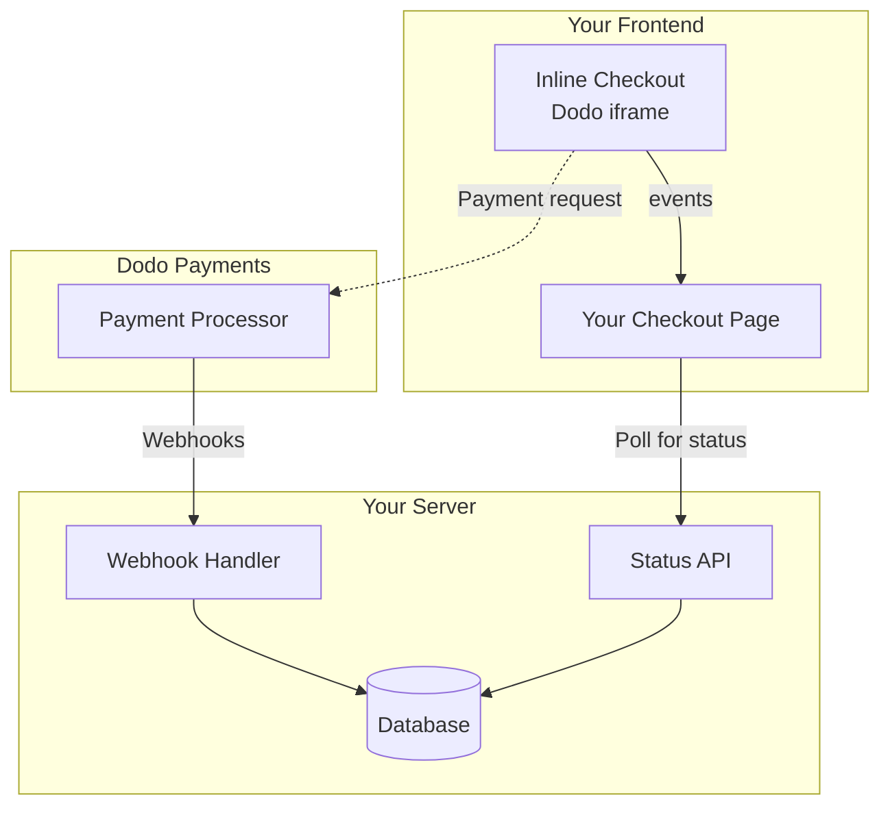

## 概述

内嵌结账让您可以创建与您的网站或应用程序无缝融合的完全集成的结账体验。与在页面顶部弹出模式显示的[覆盖结账](/developer-resources/overlay-checkout)不同，内嵌结账将支付表单直接嵌入到页面布局中。

使用内嵌结账，您可以：

- 创建与您的应用或网站完全集成的结账体验
- 让 Dodo Payments 在优化的结账框中安全捕获客户和支付信息
- 在您的页面上显示来自 Dodo Payments 的商品、总价和其他信息
- 使用 SDK 方法和事件构建高级结账体验

<Frame>
    
</Frame>

## 工作原理

内嵌结账通过在您的网站或应用中嵌入一个安全的 Dodo Payments 框架来工作。

结账框负责收集客户信息和捕获支付细节。您的页面显示商品列表、总价和更改选项的选项。SDK 允许您的页面与结账框进行交互。

Dodo Payments 在结账完成后自动创建一个订阅，供您配置。

<Note>
内嵌结账框安全处理所有敏感支付信息，确保 PCI 合规，无需额外的认证。
</Note>

## 什么是好的内嵌结账？

客户知道他们在从谁那里购买，购买的是什么，以及支付的金额是很重要的。

为了构建符合规范并优化转化率的内嵌结账，您的实现必须包括：

<Frame caption="Example inline checkout layout showing required elements">
    
</Frame>

1. **循环信息**：如果是循环，说明它的频率及续订支付总额。如果是试用，说明试用持续时间。
2. **商品描述**：对所购买商品的描述。
3. **交易总额**：交易总额，包括小计、总税款及总额。请务必包括货币。
4. **Dodo Payments 页脚**：完整的内嵌结账框架，包括结账页脚，包含有关 Dodo Payments、销售条款和隐私政策的信息。
5. **退款政策**：如果与 Dodo Payments 标准退款政策不同，请提供您的退款政策链接。

<Warning>
始终显示完整的内嵌结账框架，包括页脚。删除或隐藏法律信息违背合规要求。
</Warning>

## 客户旅程

结账流程由您的结账会话配置决定。根据您如何配置结账会话，客户可能会在单页或多个步骤中看到所有信息。

<Steps>
<Step title="Customer opens checkout">

您可以通过传递商品或现有交易来打开内嵌结账。使用 SDK 显示和更新页面信息，并使用 SDK 方法根据客户交互更新商品。
    

</Step>

<Step title="Customer enters their details">

内嵌结账首先要求客户输入他们的电子邮件地址、选择他们的国家，并在需要时输入他们的邮政编码。此步骤收集所有必要的信息，以确定税款和可用的支付选项。

您可以预填客户详情并提供保存的地址以简化体验。

</Step>

<Step title="Customer selects payment method">

输入详细信息后，客户会看到可用的支付方法和支付表单。选项可能包括信用卡或借记卡、PayPal、Apple Pay、Google Pay 及其他基于其位置的本地支付方法。

如果可以，显示保存的支付方法以加快结账速度。


</Step>

<Step title="Checkout completed">

Dodo Payments 将每笔支付路由到该销售的最佳收单行，以获得最佳的成功机会。客户会进入您可以构建的成功工作流程。


</Step>

<Step title="Dodo Payments creates subscription">

Dodo Payments 自动为客户创建一个可供您准备的订阅。客户使用的支付方法会保存以备续订或订阅更改。


</Step>
</Steps>

## 快速开始

只需几行代码即可开始使用 Dodo Payments 内嵌结账：

```typescript
import { DodoPayments } from "dodopayments-checkout";

// Initialize the SDK for inline mode
DodoPayments.Initialize({
  mode: "test",
  displayType: "inline",
  onEvent: (event) => {
    console.log("Checkout event:", event);
  },
});

// Open checkout in a specific container
DodoPayments.Checkout.open({
  checkoutUrl: "https://test.dodopayments.com/session/cks_123",
  elementId: "dodo-inline-checkout" // ID of the container element
});
```

<Tip>
确保您的页面上有一个具有相应 `id` 的容器元素：`<div id="dodo-inline-checkout"></div>`。
</Tip>

## 分步集成指南

<Steps>
<Step title="Install the SDK">

安装 Dodo Payments 结账 SDK：

<CodeGroup>

```bash npm
npm install dodopayments-checkout
```

```bash yarn
yarn add dodopayments-checkout
```

```bash pnpm
pnpm add dodopayments-checkout
```

</CodeGroup>

</Step>

<Step title="Initialize the SDK for Inline Display">

初始化 SDK 并指定 `displayType: 'inline'`。您还应该监听 `checkout.breakdown` 事件，以实时更新您的用户界面和税款总额计算。

```typescript
import { DodoPayments } from "dodopayments-checkout";

DodoPayments.Initialize({
  mode: "test",
  displayType: "inline",
  onEvent: (event) => {
    if (event.event_type === "checkout.breakdown") {
      const breakdown = event.data?.message;
      // Update your UI with breakdown.subTotal, breakdown.tax, breakdown.total, etc.
    }
  },
});
```

</Step>

<Step title="Create a Container Element">

在您的 HTML 中添加一个元素，用于插入结账框：

```html
<div id="dodo-inline-checkout"></div>
```

</Step>

<Step title="Open the Checkout">

调用 `DodoPayments.Checkout.open()`，使用您的容器的 `checkoutUrl` 和 `elementId`：

```typescript
DodoPayments.Checkout.open({
  checkoutUrl: "https://test.dodopayments.com/session/cks_123",
  elementId: "dodo-inline-checkout"
});
```

</Step>

<Step title="Test Your Integration">

1. 启动开发服务器：

```bash
npm run dev
```

2. 测试结账流程：
   - 在内嵌框中输入您的电子邮件和地址详细信息。
   - 验证您的自定义订单摘要是否实时更新。
   - 使用测试凭证测试支付流程。
   - 确保重定向正常工作。

<Check>
如果您在 `onEvent` 回调中添加了控制台日志，您应该会在浏览器控制台中看到 `checkout.breakdown` 事件记录。
</Check>

</Step>

<Step title="Go Live">

准备好上线时：

1. 将模式更改为 `'live'`：

```typescript
DodoPayments.Initialize({
  mode: "live",
  displayType: "inline",
  onEvent: (event) => {
    // Handle events
  }
});
```

2. 更新您的结账 URL，以使用来自后端的实时结账会话。
3. 在生产环境中测试完整流程。

</Step>
</Steps>

## 完整 React 示例

此示例演示如何实现自定义订单摘要，以及使用 `checkout.breakdown` 事件保持与内嵌结账同步。

```tsx
"use client";

import { useEffect, useState } from 'react';
import { DodoPayments, CheckoutBreakdownData } from 'dodopayments-checkout';

export default function CheckoutPage() {
  const [breakdown, setBreakdown] = useState<Partial<CheckoutBreakdownData>>({});

  useEffect(() => {
    // 1. Initialize the SDK
    DodoPayments.Initialize({
      mode: 'test',
      displayType: 'inline',
      onEvent: (event) => {
        // 2. Listen for the 'checkout.breakdown' event
        if (event.event_type === "checkout.breakdown") {
          const message = event.data?.message as CheckoutBreakdownData;
          if (message) setBreakdown(message);
        }
      }
    });

    // 3. Open the checkout in the specified container
    DodoPayments.Checkout.open({
      checkoutUrl: 'https://test.dodopayments.com/session/cks_123',
      elementId: 'dodo-inline-checkout'
    });

    return () => DodoPayments.Checkout.close();
  }, []);

  const format = (amt: number | null | undefined, curr: string | null | undefined) => 
    amt != null && curr ? `${curr} ${(amt/100).toFixed(2)}` : '0.00';

  const currency = breakdown.currency ?? breakdown.finalTotalCurrency ?? '';

  return (
    <div className="flex flex-col md:flex-row min-h-screen">
      {/* Left Side - Checkout Form */}
      <div className="w-full md:w-1/2 flex items-center">
        <div id="dodo-inline-checkout" className='w-full' />
      </div>

      {/* Right Side - Custom Order Summary */}
      <div className="w-full md:w-1/2 p-8 bg-gray-50">
        <h2 className="text-2xl font-bold mb-4">Order Summary</h2>
        <div className="space-y-2">
          {breakdown.subTotal && (
            <div className="flex justify-between">
              <span>Subtotal</span>
              <span>{format(breakdown.subTotal, currency)}</span>
            </div>
          )}
          {breakdown.discount && (
            <div className="flex justify-between">
              <span>Discount</span>
              <span>{format(breakdown.discount, currency)}</span>
            </div>
          )}
          {breakdown.tax != null && (
            <div className="flex justify-between">
              <span>Tax</span>
              <span>{format(breakdown.tax, currency)}</span>
            </div>
          )}
          <hr />
          {(breakdown.finalTotal ?? breakdown.total) && (
            <div className="flex justify-between font-bold text-xl">
              <span>Total</span>
              <span>{format(breakdown.finalTotal ?? breakdown.total, breakdown.finalTotalCurrency ?? currency)}</span>
            </div>
          )}
        </div>
      </div>
    </div>
  );
}

```

## API 参考

### 配置

#### 初始化选项

```typescript
interface InitializeOptions {
  mode: "test" | "live";
  displayType: "inline"; // Required for inline checkout
  onEvent: (event: CheckoutEvent) => void;
}
```

| 选项 | 类型 | 必需 | 描述 |
|--------|------|----------|-------------|
| `mode` | `"test" \| "live"` | 是 | 环境模式。 |
| `displayType` | `"inline" \| "overlay"` | 是 | 必须设置为 `"inline"` 以嵌入结账。 |
| `onEvent` | `function` | 是 | 用于处理结账事件的回调函数。 |

#### 结账选项

```typescript
export type FontSize = "xs" | "sm" | "md" | "lg" | "xl" | "2xl";
export type FontWeight = "normal" | "medium" | "bold" | "extraBold";

interface CheckoutOptions {
  checkoutUrl: string;
  elementId: string; // Required for inline checkout
  options?: {
    showTimer?: boolean;
    showSecurityBadge?: boolean;
    payButtonText?: string;
    fontSize?: FontSize;
    fontWeight?: FontWeight;
  };
}
```

| 选项 | 类型 | 必需 | 描述 |
|--------|------|----------|-------------|
| `checkoutUrl` | `string` | 是 | 结账会话 URL。 |
| `elementId` | `string` | 是 | 应渲染结账的 DOM 元素的 `id`。 |
| `options.showTimer` | `boolean` | 否 | 显示或隐藏结账计时器。默认为 `true`。当禁用时，会在会话过期时收到 `checkout.link_expired` 事件。 |
| `options.showSecurityBadge` | `boolean` | 否 | 显示或隐藏安全徽章。默认为 `true`。 |
| `options.payButtonText` | `string` | 否 | 显示在支付按钮上的自定义文本。 |
| `options.fontSize` | `FontSize` | 否 | 结账的全局字体大小。 |
| `options.fontWeight` | `FontWeight` | 否 | 结账的全局字体粗细。 |

### 方法

#### 打开结账

在指定的容器中打开结账框。

```typescript
DodoPayments.Checkout.open({
  checkoutUrl: "https://test.dodopayments.com/session/cks_123",
  elementId: "dodo-inline-checkout"
});
```

您还可以传递其他选项来自定义结账行为：

```typescript
DodoPayments.Checkout.open({
  checkoutUrl: "https://test.dodopayments.com/session/cks_123",
  elementId: "dodo-inline-checkout",
  options: {
    showTimer: false,
    showSecurityBadge: false,
    payButtonText: "Pay Now",
  },
});
```

#### 关闭结账

以编程方式移除结账框并清理事件监听器。

```typescript
DodoPayments.Checkout.close();
```

#### 检查状态

返回结账框当前是否已注入。

```typescript
const isOpen = DodoPayments.Checkout.isOpen();
// Returns: boolean
```

### 事件

SDK 通过 `onEvent` 回调提供实时事件。对于内嵌结账，`checkout.breakdown` 特别有助于同步您的用户界面。

| 事件类型 | 描述 |
|------------|-------------|
| `checkout.opened` | 结账框已加载。 |
| `checkout.form_ready` | 结账表单已准备好接收用户输入。用于隐藏加载状态并显示结账用户界面。 |
| `checkout.breakdown` | 当价格、税款或折扣更新时触发。 |
| `checkout.customer_details_submitted` | 已提交客户详细信息。 |
| `checkout.pay_button_clicked` | 当客户点击支付按钮时触发。用于分析和跟踪转化漏斗。 |
| `checkout.redirect` | 结账将执行重定向（例如，转到银行页面）。 |
| `checkout.error` | 结账过程中发生错误。 |
| `checkout.link_expired` | 当结账会话过期时触发。仅在 `showTimer` 设置为 `false` 时收到。 |

#### 结账细目数据

`checkout.breakdown` 事件提供以下数据：

```typescript
interface CheckoutBreakdownData {
  subTotal?: number;          // Amount in cents
  discount?: number;         // Amount in cents
  tax?: number;              // Amount in cents
  total?: number;            // Amount in cents
  currency?: string;         // e.g., "USD"
  finalTotal?: number;       // Final amount including adjustments
  finalTotalCurrency?: string; // Currency for the final total
}
```

#### 理解细目事件

`checkout.breakdown` 事件是保持应用程序的用户界面与 Dodo Payments 结账状态同步的主要方式。

**触发时机：**
- **初始化时**：结账框加载并准备就绪后立即。
- **地址更改时**：每当客户选择国家或输入导致税款重新计算的邮政编码时。

**字段详情：**

| 字段 | 描述 |
|-------|-------------|
| `subTotal` | 在应用任何折扣或税款之前会话中所有商品项的总和。 |
| `discount` | 所有应用折扣的总价值。 |
| `tax` | 计算的税额。在 `inline` 模式下，当用户与地址字段互动时，动态更新。 |
| `total` | 会话基础货币中 `subTotal - discount + tax` 的数学结果。 |
| `currency` | 标准小计、折扣和税收值的 ISO 货币代码（例如，`"USD"`）。 |
| `finalTotal` | 向客户收取的实际金额。这可能包括未在基本价格细目中包含的额外外汇调整或本地支付方式费用。 |
| `finalTotalCurrency` | 客户实际支付的货币。如果启用了购买力平价或本地货币兑换，这可能与 `currency` 不同。 |

**关键集成提示：**

1.  **货币格式化**：价格始终以最小货币单位（例如，美分为美元，日圆为日元）整数形式返回。要显示它们，请除以 100（或适当的 10 的幂）或使用类似 `Intl.NumberFormat` 的格式化库。
2.  **处理初始状态**：当结账首次加载时，`tax` 和 `discount` 可能是 `0` 或 `null`，直到用户提供其账单信息或应用代码。您的用户界面应优雅地处理这些状态（例如，显示破折号 `—` 或隐藏行）。
3.  **“最终总额” 与 “总额”**：虽然 `total` 为您提供标准价格计算，但 `finalTotal` 是交易的真实来源。如果存在 `finalTotal`，它准确地反映了将向客户卡收取的费用，包括任何动态调整。
4.  **实时反馈**：使用 `tax` 字段向用户展示税款正在实时计算。这为结账页面带来“实时”感受，并减少在输入地址步骤中的摩擦。

## 实施选项

### 包管理器安装

如 [分步集成指南](#step-by-step-integration-guide) 中所示，通过 npm、yarn 或 pnpm 安装。

### CDN 实现

若无需构建步骤即可进行快速集成，您可以使用我们的 CDN：

```html
<!DOCTYPE html>
<html lang="en">
<head>
    <meta charset="UTF-8">
    <meta name="viewport" content="width=device-width, initial-scale=1.0">
    <title>Dodo Payments Inline Checkout</title>
    
    <!-- Load DodoPayments -->
    <script src="https://cdn.jsdelivr.net/npm/dodopayments-checkout@latest/dist/index.js"></script>
    <script>
        // Initialize the SDK
        DodoPaymentsCheckout.DodoPayments.Initialize({
            mode: "test",
            displayType: "inline",
            onEvent: (event) => {
                console.log('Checkout event:', event);
            }
        });
    </script>
</head>
<body>
    <div id="dodo-inline-checkout"></div>

    <script>
        // Open the checkout
        DodoPaymentsCheckout.DodoPayments.Checkout.open({
            checkoutUrl: "https://test.dodopayments.com/session/cks_123",
            elementId: "dodo-inline-checkout"
        });
    </script>
</body>
</html>
```

## 更新支付方法

内嵌结账支持订阅的**支付方法更新**。当客户需要更新其支付方法时——无论是用于激活订阅还是重新激活暂停中的订阅——您可以在页面布局中直接呈现更新流程。

### 工作原理

1. 调用 [更新支付方法 API](/features/subscription#update-payment-method-for-active-subscription) 以获取 `payment_link`：

```typescript
const response = await client.subscriptions.updatePaymentMethod('sub_123', {
  type: 'new',
  return_url: 'https://example.com/return'
});
```

2. 将返回的 `payment_link` 作为 `checkoutUrl` 传递以打开内嵌结账：

```typescript
DodoPayments.Checkout.open({
  checkoutUrl: response.payment_link,
  elementId: "dodo-inline-checkout"
});
```

内嵌框仅呈现支付方法收集表单。客户可以输入新卡详细信息或选择保存的支付方法，而无需离开您的页面。

### 针对暂停的订阅

为处于 `on_hold` 状态的订阅更新支付方法时，Dodo Payments 会自动为任何剩余欠款创建一笔交易。监控 `payment.succeeded` 和 `subscription.active` webhook 以确认重新激活。

```typescript
const response = await client.subscriptions.updatePaymentMethod('sub_123', {
  type: 'new',
  return_url: 'https://example.com/return'
});

if (response.payment_id) {
  // Charge created for remaining dues
  // Open inline checkout for payment collection
  DodoPayments.Checkout.open({
    checkoutUrl: response.payment_link,
    elementId: "dodo-inline-checkout"
  });
}
```

<Tip>
您还可以通过将具有 `payment_method_id` 的 `type: 'existing'` 传递给更新支付方法 API，而不是收集新详细信息，使用现有保存的支付方法。
</Tip>

## 错误处理

SDK 通过事件系统提供详细的错误信息。始终在您的 `onEvent` 回调中实现正确的错误处理：

```typescript
DodoPayments.Initialize({
  mode: "test",
  displayType: "inline",
  onEvent: (event: CheckoutEvent) => {
    if (event.event_type === "checkout.error") {
      console.error("Checkout error:", event.data?.message);
      // Handle error appropriately
    }
  }
});
```

<Warning>
当发生问题时，始终处理 `checkout.error` 事件，以提供良好的用户体验。
</Warning>

## 最佳实践

1. **响应式设计**：确保您的容器元素有足够的宽度和高度。iframe 通常会扩展以填满它的容器。
2. **同步**：使用 `checkout.breakdown` 事件保持您的自定义订单摘要或价格表与用户在结账框中看到的内容同步。
3. **骨架状态**：在 `checkout.opened` 事件触发前，在您的容器中显示加载指示器。
4. **清理**：当您的组件卸载时，调用 `DodoPayments.Checkout.close()`，以清理 iframe 和事件监听器。

<Info>
对于暗模式实现，建议使用 `#0d0d0d` 作为背景色，以便与内嵌结账框架实现最佳视觉集成。
</Info>

## 支付状态验证

<Warning>
不要仅依赖内嵌结账事件来确定支付成功或失败。始终实现使用 webhooks 和/或轮询的服务器端验证。
</Warning>

### 为什么服务器端验证至关重要

虽然内嵌结账事件提供实时反馈，但它们**不应该**是您支付状态的唯一信息来源。网络问题、浏览器崩溃或用户关闭页面可能导致事件丢失。为了确保可靠的支付验证：

1. **您的服务器应监听 webhook 事件**——Dodo Payments 发送支付状态更改的 webhooks
2. **实现轮询机制**——您的前端应轮询服务器以获取状态更新
3. **结合两种方法**——使用 webhooks 作为主要来源，并以轮询作为备份

### 推荐架构



### 实施步骤

**1. 监听结账事件**——当用户点击支付时，开始准备验证状态：

```typescript
onEvent: (event) => {
  if (event.event_type === 'checkout.pay_button_clicked') {
    // Start polling your server for confirmed status
    startPolling();
  }
}
```

**2. 轮询您的服务器**——创建一个端点，以检查由 webhooks 更新的数据库中的支付状态：

```typescript
// Poll every 2 seconds until status is confirmed
const interval = setInterval(async () => {
  const { status } = await fetch(`/api/payments/${paymentId}/status`).then(r => r.json());
  if (status === 'succeeded' || status === 'failed') {
    clearInterval(interval);
    handlePaymentResult(status);
  }
}, 2000);
```

**3. 服务器端处理 webhooks**——当 Dodo 发送 `payment.succeeded` 或 `payment.failed` webhooks 时更新您的数据库。查看我们的 [Webhooks 文档](/developer-resources/webhooks) 了解详细信息。

## 故障排除

<AccordionGroup>
<Accordion title="Checkout frame is not appearing">
- 验证 `elementId` 与 DOM 中实际存在的 `div` 匹配。
- 确保已将 `displayType: 'inline'` 传递给 `Initialize`。
- 检查 `checkoutUrl` 是否有效。
</Accordion>

<Accordion title="Taxes are not updating in my UI">
- 确保您正在监听 `checkout.breakdown` 事件。
- 仅在用户在结账框中输入有效国家和邮政编码后计算税款。
</Accordion>
</AccordionGroup>

## 启用数字钱包

有关设置 Apple Pay、Google Pay 和其他数字钱包的详细信息，请参阅<a href="/features/payment-methods/digital-wallets">数字钱包</a>页面。

### Apple Pay 的快速设置

<Info>
只有 **inline（嵌入式）checkout** 需要进行域名验证。托管式 checkout 不需要验证。
</Info>

<Warning>
Overlay checkout 不支持 Apple Pay。
</Warning>

Apple Pay 需要在 dashboard 中按域名进行验证。

<Steps>
<Step title="Open Wallet domains">
前往 **Settings → Payment Methods**，然后在 **Apple Pay** 所在行点击 **Manage domains**。

<Frame caption="Open Wallet domains from the Apple Pay row">
  
</Frame>
</Step>

<Step title="Download the domain association file">
在 Wallet domains 面板中，下载关联文件。

<Frame caption="Download the Apple Pay domain association file">
  
</Frame>
</Step>

<Step title="Register your domain">
点击 **Register domain**，输入嵌入 inline checkout 的域名（例如 `shop.example.com`），然后点击 **Continue**。

<Frame caption="Register the domain where you embed inline checkout">
  
</Frame>
</Step>

<Step title="Host the file on your domain">
将其托管在：

```
https://shop.example.com/.well-known/apple-developer-merchantid-domain-association
```

该文件必须通过 HTTPS 提供服务，可在不经过重定向的情况下访问，并且必须使用 `Content-Type: application/octet-stream` 或 `text/plain` 提供。
</Step>

<Step title="Verify the domain">
点击 **Verify domain**。Dodo Payments 会确认文件处于可访问状态，并将你的域名提交给 Apple。

<Frame caption="Verify the hosted association file">
  
</Frame>
</Step>

<Step title="Confirm it's active">
当状态显示为 **Active** 时，Apple Pay 已为该域名启用。使用 **Enabled** 切换开关，可按域名开启或关闭 Apple Pay。

<Frame caption="Verified domains show an Active status">
  
</Frame>
</Step>

<Step title="Test the integration">
1. 在 Apple 设备上打开 checkout
2. 确认 Apple Pay 按钮显示
3. 完成一笔测试交易
</Step>
</Steps>

## 浏览器支持

Dodo Payments Checkout SDK 支持以下浏览器：

- Chrome（最新版本）
- Firefox（最新版本）
- Safari（最新版本）
- Edge（最新版本）
- IE11+

## Inline 与 Overlay Checkout

根据你的使用场景选择合适的 checkout 类型：

| 功能 | Inline Checkout | Overlay Checkout |
|---------|-----------------|------------------|
| 集成深度 | 完全嵌入页面 | 页面上方的 Modal |
| 布局控制 | 完全控制 | 受限 |
| 品牌展示 | 无缝衔接 | 与页面分离 |
| 实现工作量 | 较高 | 较低 |
| 适用场景 | 自定义 checkout 页面、高转化流程 | 快速集成、现有页面 |

<Tip>
如果你希望最大限度地控制 checkout 体验并实现无缝的品牌展示，请使用 **inline checkout**。如果你希望以最少的现有页面改动快速完成集成，请使用 **overlay checkout**。
</Tip>

## 相关资源

<CardGroup cols={2}>
<Card title="Overlay Checkout" icon="layer-group" href="/developer-resources/overlay-checkout">
    使用 overlay checkout 快速完成基于 Modal 的集成。
</Card>

<Card title="Checkout Sessions API" icon="code" href="/api-reference/checkout-sessions/create">
    创建 checkout sessions，为你的 checkout 体验提供支持。
</Card>

<Card title="Webhooks" icon="webhook" href="/developer-resources/webhooks">
    使用 webhooks 在 server-side 处理支付事件。
</Card>

<Card title="Integration Guide" icon="book" href="/developer-resources/integration-guide">
    Dodo Payments 集成完整指南。
</Card>
</CardGroup>

欲获得更多帮助，请访问我们的[Discord 社区](https://discord.gg/bYqAp4ayYh)或联系我们的开发者支持团队。
