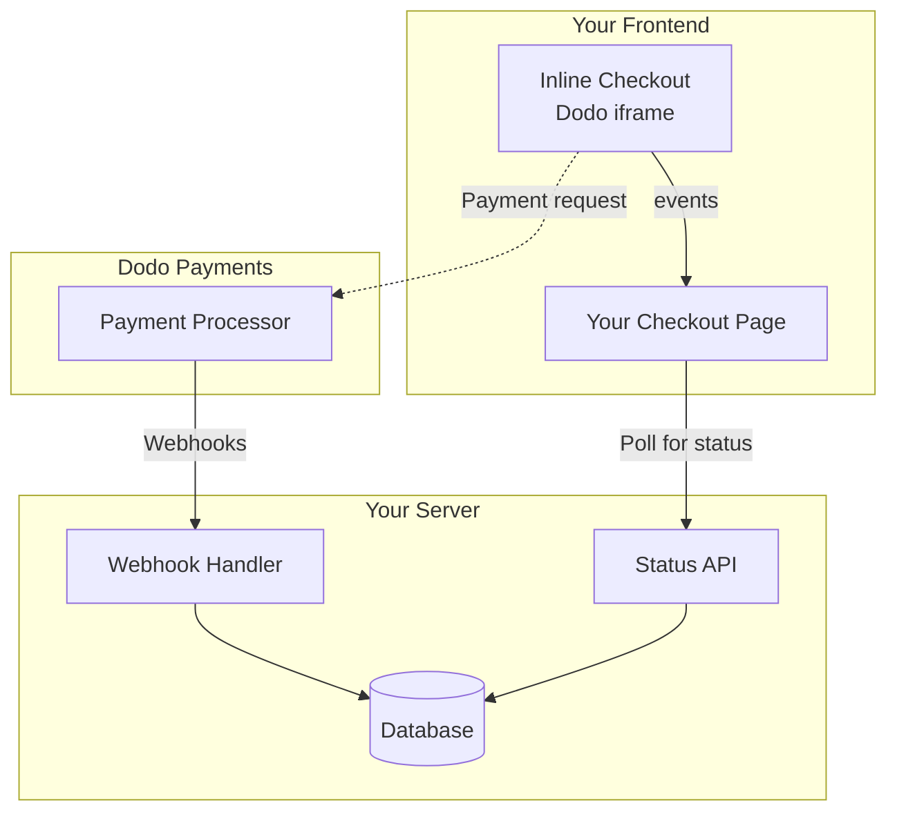

## Overview

Inline checkout lets you create fully integrated checkout experiences that blend seamlessly with your website or application. Unlike the [overlay checkout](/developer-resources/overlay-checkout), which opens as a modal on top of your page, inline checkout embeds the payment form directly into your page layout.

Using inline checkout, you can:

- Create checkout experiences that are fully integrated with your app or website
- Let Dodo Payments securely capture customer and payment information in an optimized checkout frame
- Display items, totals, and other information from Dodo Payments on your page
- Use SDK methods and events to build advanced checkout experiences

/* LOCKED_PATTERN_3081a298b9494352000db8bcb2f0ac9f */}
    
</Frame>

## How It Works

Inline checkout works by embedding a secure Dodo Payments frame into your website or app.

The checkout frame handles collecting customer information and capturing payment details. Your page displays the items list, totals, and options for changing what's on the checkout. The SDK lets your page and the checkout frame interact with each other.

Dodo Payments automatically creates a subscription when a checkout completes, ready for you to provision.

<Note>
The inline checkout frame securely handles all sensitive payment information, ensuring PCI compliance without additional certification on your end.
</Note>

## What Makes a Good Inline Checkout?

It's important that customers know who they're buying from, what they're buying, and how much they're paying.

To build an inline checkout that's compliant and optimized for conversion, your implementation must include:

/* LOCKED_PATTERN_2c3203bfa100605bc2704d01e7dccd32 */}
    
</Frame>

1. **Recurring information**: If recurring, how often it recurs and the total to pay on renewal. If a trial, how long the trial lasts.
2. **Item descriptions**: A description of what's being purchased.
3. **Transaction totals**: Transaction totals, including subtotal, total tax, and grand total. Be sure to include the currency too.
4. **Dodo Payments footer**: The full inline checkout frame, including the checkout footer that has information about Dodo Payments, our terms of sale, and our privacy policy.
5. **Refund policy**: A link to your refund policy, if it differs from the Dodo Payments standard refund policy.

<Warning>
Always display the complete inline checkout frame, including the footer. Removing or hiding legal information violates compliance requirements.
</Warning>

## Customer Journey

The checkout flow is determined by your checkout session configuration. Depending on how you configure the checkout session, customers will experience a checkout that may present all information on a single page or across multiple steps.

<Steps>
<Step title="Customer opens checkout">

您可以通过传递商品或现有交易来打开内嵌结账。使用 SDK 显示和更新页面信息，并使用 SDK 方法根据客户交互更新商品。
    

</Step>

<Step title="Customer enters their details">

Inline checkout first asks customers to enter their email address, select their country, and (where required) enter their ZIP or postal code. This step gathers all necessary information to determine taxes and available payment options.

You can prefill customer details and present saved addresses to streamline the experience.

</Step>

<Step title="Customer selects payment method">

After entering their details, customers are presented with available payment methods and the payment form. Options may include credit or debit card, PayPal, Apple Pay, Google Pay, and other local payment methods based on their location.

Display saved payment methods if available to speed up checkout.


</Step>

<Step title="Checkout completed">

Dodo Payments routes every payment to the best acquirer for that sale to get the best possible chance of success. Customers enter a success workflow that you can build.


</Step>

<Step title="Dodo Payments creates subscription">

Dodo Payments automatically creates a subscription for the customer, ready for you to provision. The payment method the customer used is held on file for renewals or subscription changes.


</Step>
</Steps>

## Quick Start

Get started with the Dodo Payments Inline Checkout in just a few lines of code:

```typescript
import { DodoPayments } from "dodopayments-checkout";

// Initialize the SDK for inline mode
DodoPayments.Initialize({
  mode: "test",
  displayType: "inline",
  onEvent: (event) => {
    console.log("Checkout event:", event);
  },
});

// Open checkout in a specific container
DodoPayments.Checkout.open({
  checkoutUrl: "https://test.dodopayments.com/session/cks_123",
  elementId: "dodo-inline-checkout" // ID of the container element
});
```

<Tip>
Ensure you have a container element with the corresponding `id` on your page: `<div id="dodo-inline-checkout"></div>`.
</Tip>

## Step-by-Step Integration Guide

<Steps>
<Step title="Install the SDK">

Install the Dodo Payments Checkout SDK:

<CodeGroup>

```bash npm
npm install dodopayments-checkout
```

```bash yarn
yarn add dodopayments-checkout
```

```bash pnpm
pnpm add dodopayments-checkout
```

</CodeGroup>

</Step>

<Step title="Initialize the SDK for Inline Display">

Initialize the SDK and specify `displayType: 'inline'`. You should also listen for the `checkout.breakdown` event to update your UI with real-time tax and total calculations.

```typescript
import { DodoPayments } from "dodopayments-checkout";

DodoPayments.Initialize({
  mode: "test",
  displayType: "inline",
  onEvent: (event) => {
    if (event.event_type === "checkout.breakdown") {
      const breakdown = event.data?.message;
      // Update your UI with breakdown.subTotal, breakdown.tax, breakdown.total, etc.
    }
  },
});
```

</Step>

<Step title="Create a Container Element">

Add an element to your HTML where the checkout frame will be injected:

```html
<div id="dodo-inline-checkout"></div>
```

</Step>

<Step title="Open the Checkout">

Call `DodoPayments.Checkout.open()` with the `checkoutUrl` and the `elementId` of your container:

```typescript
DodoPayments.Checkout.open({
  checkoutUrl: "https://test.dodopayments.com/session/cks_123",
  elementId: "dodo-inline-checkout"
});
```

</Step>

<Step title="Test Your Integration">

1. Start your development server:

```bash
npm run dev
```

2. Test the checkout flow:
   - Enter your email and address details in the inline frame.
   - Verify that your custom order summary updates in real-time.
   - Test the payment flow using test credentials.
   - Confirm redirects work correctly.

<Check>
You should see `checkout.breakdown` events logged in your browser console if you added a console log in the `onEvent` callback.
</Check>

</Step>

<Step title="Go Live">

When you're ready for production:

1. Change the mode to `'live'`:

```typescript
DodoPayments.Initialize({
  mode: "live",
  displayType: "inline",
  onEvent: (event) => {
    // Handle events
  }
});
```

2. Update your checkout URLs to use live checkout sessions from your backend.
3. Test the complete flow in production.

</Step>
</Steps>

## Complete React Example

This example demonstrates how to implement a custom order summary alongside the inline checkout, keeping them in sync using the `checkout.breakdown` event.

```tsx
"use client";

import { useEffect, useState } from 'react';
import { DodoPayments, CheckoutBreakdownData } from 'dodopayments-checkout';

export default function CheckoutPage() {
  const [breakdown, setBreakdown] = useState<Partial<CheckoutBreakdownData>>({});

  useEffect(() => {
    // 1. Initialize the SDK
    DodoPayments.Initialize({
      mode: 'test',
      displayType: 'inline',
      onEvent: (event) => {
        // 2. Listen for the 'checkout.breakdown' event
        if (event.event_type === "checkout.breakdown") {
          const message = event.data?.message as CheckoutBreakdownData;
          if (message) setBreakdown(message);
        }
      }
    });

    // 3. Open the checkout in the specified container
    DodoPayments.Checkout.open({
      checkoutUrl: 'https://test.dodopayments.com/session/cks_123',
      elementId: 'dodo-inline-checkout'
    });

    return () => DodoPayments.Checkout.close();
  }, []);

  const format = (amt: number | null | undefined, curr: string | null | undefined) => 
    amt != null && curr ? `${curr} ${(amt/100).toFixed(2)}` : '0.00';

  const currency = breakdown.currency ?? breakdown.finalTotalCurrency ?? '';

  return (
    <div className="flex flex-col md:flex-row min-h-screen">
      {/* Left Side - Checkout Form */}
      <div className="w-full md:w-1/2 flex items-center">
        <div id="dodo-inline-checkout" className='w-full' />
      </div>

      {/* Right Side - Custom Order Summary */}
      <div className="w-full md:w-1/2 p-8 bg-gray-50">
        <h2 className="text-2xl font-bold mb-4">Order Summary</h2>
        <div className="space-y-2">
          {breakdown.subTotal && (
            <div className="flex justify-between">
              <span>Subtotal</span>
              <span>{format(breakdown.subTotal, currency)}</span>
            </div>
          )}
          {breakdown.discount && (
            <div className="flex justify-between">
              <span>Discount</span>
              <span>{format(breakdown.discount, currency)}</span>
            </div>
          )}
          {breakdown.tax != null && (
            <div className="flex justify-between">
              <span>Tax</span>
              <span>{format(breakdown.tax, currency)}</span>
            </div>
          )}
          <hr />
          {(breakdown.finalTotal ?? breakdown.total) && (
            <div className="flex justify-between font-bold text-xl">
              <span>Total</span>
              <span>{format(breakdown.finalTotal ?? breakdown.total, breakdown.finalTotalCurrency ?? currency)}</span>
            </div>
          )}
        </div>
      </div>
    </div>
  );
}

```

## API Reference

### Configuration

#### Initialize Options

```typescript
interface InitializeOptions {
  mode: "test" | "live";
  displayType: "inline"; // Required for inline checkout
  onEvent: (event: CheckoutEvent) => void;
}
```

| Option | Type | Required | Description |
|--------|------|----------|-------------|
| `mode` | `"test" \| "live"` | Yes | Environment mode. |
| `displayType` | `"inline" \| "overlay"` | Yes | Must be set to `"inline"` to embed the checkout. |
| `onEvent` | `function` | Yes | Callback function for handling checkout events. |

#### Checkout Options

```typescript
export type FontSize = "xs" | "sm" | "md" | "lg" | "xl" | "2xl";
export type FontWeight = "normal" | "medium" | "bold" | "extraBold";

interface CheckoutOptions {
  checkoutUrl: string;
  elementId: string; // Required for inline checkout
  options?: {
    showTimer?: boolean;
    showSecurityBadge?: boolean;
    payButtonText?: string;
    fontSize?: FontSize;
    fontWeight?: FontWeight;
  };
}
```

| 选项 | 类型 | 必需 | 描述 |
|--------|------|----------|-------------|
| `checkoutUrl` | `string` | 是 | 结账会话 URL。 |
| `elementId` | `string` | 是 | 渲染结账的 DOM 元素的 `id`。 |
| `options.showTimer` | `boolean` | 否 | 显示或隐藏结账计时器。默认为 `true`。当禁用时，会话到期时您将收到 `checkout.link_expired` 事件。 |
| `options.showSecurityBadge` | `boolean` | 否 | 显示或隐藏安全徽章。默认为 `true`。 |
| `options.payButtonText` | `string` | 否 | 在支付按钮上显示的自定义文本。 |
| `options.fontSize` | `FontSize` | 否 | 结账的全局字体大小。 |
| `options.fontWeight` | `FontWeight` | 否 | 结账的全局字体重量。 |

### Methods

#### Open Checkout

Opens the checkout frame in the specified container.

```typescript
DodoPayments.Checkout.open({
  checkoutUrl: "https://test.dodopayments.com/session/cks_123",
  elementId: "dodo-inline-checkout"
});
```

You can also pass additional options to customize the checkout behavior:

```typescript
DodoPayments.Checkout.open({
  checkoutUrl: "https://test.dodopayments.com/session/cks_123",
  elementId: "dodo-inline-checkout",
  options: {
    showTimer: false,
    showSecurityBadge: false,
    payButtonText: "Pay Now",
  },
});
```

#### 关闭结账

以编程方式移除结账框架，并清理事件监听器。

```typescript
DodoPayments.Checkout.close();
```

#### 检查状态

返回结账框架当前是否已注入。

```typescript
const isOpen = DodoPayments.Checkout.isOpen();
// Returns: boolean
```

### 事件

SDK 通过 `onEvent` 回调提供实时事件。对于内嵌结账，`checkout.breakdown` 尤其有助于同步用户界面。

| 事件类型 | 描述 |
|------------|-------------|
| `checkout.opened` | 结账框架已加载。 |
| `checkout.form_ready` | 结账表单准备好接收用户输入。对于隐藏加载状态并显示结账界面很有用。|
| `checkout.breakdown` | 当价格、税费或折扣更新时触发。|
| `checkout.customer_details_submitted` | 客户详细信息已提交。|
| `checkout.pay_button_clicked` | 当客户点击支付按钮时触发。对分析和转化漏斗跟踪有用。|
| `checkout.redirect` | 结账将执行重定向（例如，前往银行页面）。|
| `checkout.error` | 结账过程中发生错误。|
| `checkout.link_expired` | 当结账会话到期时触发。仅在设置 `showTimer` 为 `false` 时收到。|

#### 结账细目数据

`checkout.breakdown` 事件提供以下数据：

```typescript
interface CheckoutBreakdownData {
  subTotal?: number;          // Amount in cents
  discount?: number;         // Amount in cents
  tax?: number;              // Amount in cents
  total?: number;            // Amount in cents
  currency?: string;         // e.g., "USD"
  finalTotal?: number;       // Final amount including adjustments
  finalTotalCurrency?: string; // Currency for the final total
}
```

#### 理解细目事件

`checkout.breakdown` 事件是保持应用程序 UI 与 Dodo Payments 结账状态同步的主要方式。

**触发时机:**
- **初始化时**：在结账框架加载完毕并准备就绪后立即触发。
- **地址更改时**：每当客户选择国家或输入邮政编码导致税费重新计算时。

**字段详情：**

| 字段 | 描述 |
|-------|-------------|
| `subTotal` | 会话中应用任何折扣或税费之前的所有项目金额总和。|
| `discount` | 应用所有折扣后的总价值。|
| `tax` | 计算的税款金额。在 `inline` 模式下，用户与地址字段交互时会动态更新。|
| `total` | 在会话基础货币单位中的数学结果 `subTotal - discount + tax`。|
| `currency` | 标准小计、折扣和税金值的 ISO 货币代码（例如，`"USD"`）。|
| `finalTotal` | 客户实际需要支付的金额。可能包括其他外汇调整或不属于基本价格细分的本地支付方法费用。 |
| `finalTotalCurrency` | 客户实际支付的货币。这可能与 `currency` 不同， 如果启用了购买力平价或当地货币转换。|

**关键集成提示：**

1. **货币格式化**: 价格始终以最小货币单位的整数返回（例如美元为分、日元为金额）。要显示它们， 除以 100（或适当的 10 次方）或使用诸如 `Intl.NumberFormat` 的格式化库。
2. **处理初始状态**：当结账首次加载时，`tax` 和 `discount` 可能为 `0` 或 `null`，直到用户提供其结算信息或应用代码。您的 UI 应该优雅地处理这些状态（例如，显示横杠 `—` 或隐藏行）。
3. **"最终总计" vs "总计"**：虽然 `total` 为您提供标准价格计算， `finalTotal` 是交易的真实来源。如果存在 `finalTotal`， 它会准确地反映将向客户卡收取的费用，包括任何动态调整。
4. **实时反馈**：使用 `tax` 字段向用户显示税费是实时计算的。这为您的结账页面提供了“实时”感觉，并减少了地址输入步骤中的摩擦。

## 实施选项

### 包管理器安装

如[分步集成指南](#step-by-step-integration-guide)中所示，通过 npm、yarn 或 pnpm 安装。

### CDN 实现

若要在没有构建步骤的情况下快速集成，可以使用我们的 CDN：

```html
<!DOCTYPE html>
<html lang="en">
<head>
    <meta charset="UTF-8">
    <meta name="viewport" content="width=device-width, initial-scale=1.0">
    <title>Dodo Payments Inline Checkout</title>
    
    <!-- Load DodoPayments -->
    <script src="https://cdn.jsdelivr.net/npm/dodopayments-checkout@latest/dist/index.js"></script>
    <script>
        // Initialize the SDK
        DodoPaymentsCheckout.DodoPayments.Initialize({
            mode: "test",
            displayType: "inline",
            onEvent: (event) => {
                console.log('Checkout event:', event);
            }
        });
    </script>
</head>
<body>
    <div id="dodo-inline-checkout"></div>

    <script>
        // Open the checkout
        DodoPaymentsCheckout.DodoPayments.Checkout.open({
            checkoutUrl: "https://test.dodopayments.com/session/cks_123",
            elementId: "dodo-inline-checkout"
        });
    </script>
</body>
</html>
```

## 更新支付方式

内嵌结账支持订阅的**支付方式更新**。当客户需要更新其支付方式时–无论是出于激活中的订阅或重新激活暂停的订阅–您都可以直接在页面布局中呈现更新流程。

### 工作原理

1. 调用 [更新支付方式 API](/features/subscription#update-payment-method-for-active-subscription) 以获取 `payment_link`：

```typescript
const response = await client.subscriptions.updatePaymentMethod('sub_123', {
  type: 'new',
  return_url: 'https://example.com/return'
});
```

2. 将返回的 `payment_link` 作为 `checkoutUrl` 传递以打开内嵌结账：

```typescript
DodoPayments.Checkout.open({
  checkoutUrl: response.payment_link,
  elementId: "dodo-inline-checkout"
});
```

内嵌框架仅渲染付款方式收集表格。客户可以在不离开您的页面的情况下输入新卡信息或选择已保存的支付方式。

### 对于暂停订阅

在为处于 `on_hold` 状态的订阅更新支付方式时，Dodo Payments 会自动为任何剩余未偿还费用创建扣费。监控 `payment.succeeded` 和 `subscription.active` webhooks 以确认重新激活。

```typescript
const response = await client.subscriptions.updatePaymentMethod('sub_123', {
  type: 'new',
  return_url: 'https://example.com/return'
});

if (response.payment_id) {
  // Charge created for remaining dues
  // Open inline checkout for payment collection
  DodoPayments.Checkout.open({
    checkoutUrl: response.payment_link,
    elementId: "dodo-inline-checkout"
  });
}
```

/* LOCKED_PATTERN_317ec56569e36d0c9e56c2648890a76e */}
您也可以使用现有的已保存支付方式，而不是收集新信息，通过传递 `type: 'existing'` 和一个 `payment_method_id` 到更新支付方式 API。
</Tip>

## 错误处理

SDK 通过事件系统提供详细的错误信息。在您的 `onEvent` 回调中始终实施适当的错误处理：

```typescript
DodoPayments.Initialize({
  mode: "test",
  displayType: "inline",
  onEvent: (event: CheckoutEvent) => {
    if (event.event_type === "checkout.error") {
      console.error("Checkout error:", event.data?.message);
      // Handle error appropriately
    }
  }
});
```

/* LOCKED_PATTERN_4907e9f6f7fbd509120d7a87afc829e9 */}
始终处理 `checkout.error` 事件，以便在出现问题时提供良好的用户体验。
</Warning>

## 最佳实践

1. **响应设计**：确保您的容器元素具有足够的宽度和高度。iframe 通常会扩展以填充其容器。
2. **同步**：使用 `checkout.breakdown` 事件将您的自定义订单摘要或价格表与用户在结账框架中看到的内容保持同步。
3. **骨架状态**：在 `checkout.opened` 事件触发之前，在您的容器中显示加载指示符。
4. **清理**：当您的组件卸载时调用 `DodoPayments.Checkout.close()`，以清理 iframe 和事件监听器。

/* LOCKED_PATTERN_6fa96040307d68e9fa44436559d63ee8 */}
对于暗模式实现，建议使用 `#0d0d0d` 作为背景颜色，以便实现与内嵌结账框架的最佳视觉集成。
</Info>

## 支付状态验证

/* LOCKED_PATTERN_4907e9f6f7fbd509120d7a87afc829e9 */}
不要仅依赖内嵌结账事件来确定支付成功或失败。始终使用 webhooks 和/或轮询实现服务器端验证。
</Warning>

### 为什么服务器端验证必不可少

尽管内嵌结账事件提供实时反馈，但它们**不应该**是您支付状态的唯一真相来源。网络问题、浏览器崩溃或用户关闭页面可能导致事件丢失。为保证可靠的支付验证：

1. **您的服务器应监听 webhook 事件**- Dodo Payments 发送有关支付状态更改的 webhook
2. **实施轮询机制**- 您的前端应轮询您的服务器获取状态更新
3. **结合以上两种方式**- 使用 webhooks 作为主要来源，轮询作为备用

### 推荐的架构



### 实施步骤

**1. 监听结账事件**- 当用户点击支付时，开始准备验证状态：

```typescript
onEvent: (event) => {
  if (event.event_type === 'checkout.pay_button_clicked') {
    // Start polling your server for confirmed status
    startPolling();
  }
}
```

**2. 轮询您的服务器**- 创建一个端点，检查您的数据库中由 webhooks 更新的支付状态：

```typescript
// Poll every 2 seconds until status is confirmed
const interval = setInterval(async () => {
  const { status } = await fetch(`/api/payments/${paymentId}/status`).then(r => r.json());
  if (status === 'succeeded' || status === 'failed') {
    clearInterval(interval);
    handlePaymentResult(status);
  }
}, 2000);
```

**3. 处理服务器端的 webhooks** - 当 Dodo 发送 `payment.succeeded` 或 `payment.failed` webhooks 时更新您的数据库。详细信息，请参阅我们的 [Webhooks 文档](/developer-resources/webhooks)。

## 故障排除

/* LOCKED_PATTERN_3a00efd457b01f610250031fcbf16962 */}
<Accordion title="Checkout frame is not appearing">
- 验证 `elementId` 是否与一个实际存在于 DOM 中的 `div` 的 `id` 匹配。
- 确保传递了 `displayType: 'inline'` 到 `Initialize`。
- 检查 `checkoutUrl` 是否有效。
</Accordion>

/* LOCKED_PATTERN_05b89b97a7f9c53e2d9d7a4e480e2342 */}
- 确保您正在监听 `checkout.breakdown` 事件。
- 税费仅在用户在结账框架中输入有效国家和邮政编码后计算。
</Accordion>
</AccordionGroup>

## 启用数字钱包

有关设置 Apple Pay、Google Pay 及其他数字钱包的详细信息，请参阅 <a href="/features/payment-methods/digital-wallets">数字钱包</a> 页面。

### Apple Pay 快速设置

/* LOCKED_PATTERN_bd2642ca094c2e4ce733f0386172be2d */}
<Step title="Download domain association file">
下载 [Apple Pay 域关联文件](http://checkout.dodopayments.com/.well-known/apple-developer-merchantid-domain-association)。
</Step>

/* LOCKED_PATTERN_3a44bb73d2b6657e3ef8dfb6df5437c3 */}
通过电子邮件将您的生产域 URL 发送至 **support@dodopayments.com** 并请求启用 Apple Pay。
</Step>

/* LOCKED_PATTERN_f4cb4ca481d047ba1b29ad7a11be722d */}
确认后，验证 Apple Pay 在结账中显示并测试完整流程。
</Step>
</Steps>

/* LOCKED_PATTERN_4907e9f6f7fbd509120d7a87afc829e9 */}
Apple Pay 需要在生产环境中进行域验证后才会出现。如果您计划提供 Apple Pay，请在上线前联系支持。
</Warning>

## 浏览器支持

Dodo Payments 结账 SDK 支持以下浏览器：

- Chrome（最新）
- Firefox（最新）
- Safari（最新）
- Edge（最新）
- IE11+

## 内嵌 vs 覆盖结账

为您的用例选择合适的结账类型：

| 功能 | 内嵌结账 | 覆盖结账 |
|---------|-----------------|------------------|
| 集成深度 | 完全嵌入页面 | 页面的模态框|
| 布局控制 | 完全控制 | 有限 |
| 品牌 | 无缝集成 | 与页面分离|
| 实施努力 | 较高 | 较低 |
| 最适合 | 自定义结账页面、高转换流程| 快速集成、现有页面|

/* LOCKED_PATTERN_317ec56569e36d0c9e56c2648890a76e */}
当您希望对结账体验进行最大控制和无缝品牌化时，使用**内嵌结账**。要以最小的页面更改实现快速集成，请使用**覆盖结账**。
</Tip>

## 相关资源

/* LOCKED_PATTERN_bd3b9ce11ef978f59c6eb5461169b62d */}
<Card title="Overlay Checkout" icon="layer-group" href="/developer-resources/overlay-checkout">
使用覆盖结账进行快速基于模态的集成。
</Card>

/* LOCKED_PATTERN_5e9b3579ee53b9305eb4a383d135b798 */}
创建结账会话以推动您的结账体验。
</Card>

/* LOCKED_PATTERN_4fdc255b113f889a339d4227d31c920b */}
使用 webhooks 在服务器端处理支付事件。
</Card>

/* LOCKED_PATTERN_4389e7f71e1a171de8ea420860f91acc */}
Dodo Payments 完整集成指南。
</Card>
</CardGroup>

如需更多帮助，请访问我们的 [Discord 社区](https://discord.gg/bYqAp4ayYh) 或联系我们的开发者支持团队。
