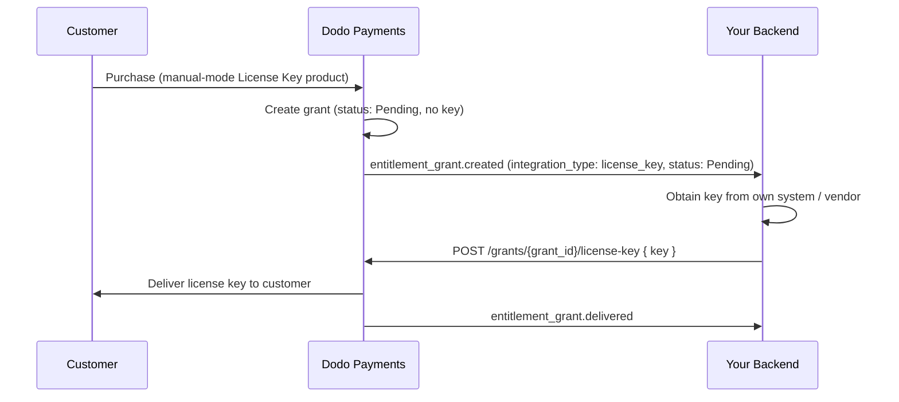

本指南将完整介绍如何构建一个**手动许可证密钥发放**系统。Dodo Payments 不会在付款后自动生成密钥，而是由每次购买创建一个 `Pending` grant，并等待*您*从自己的系统、第三方供应商或有限的代码池中提供密钥值。

最后您将拥有：

- 一个产品的许可证密钥授权设置为`manual`履行。
- 一个 webhooks 监听器，用于检测客户何时等待密钥。
- 一个交付调用，用于传递密钥并自动通知客户。

<CardGroup cols={2}>
<Card title="License Keys overview" icon="key" href="/features/license-keys">
完整的许可证密钥生命周期和`fulfillment_mode`设置。
</Card>
<Card title="Fulfill License Key Grant API" icon="code" href="/api-reference/entitlements/fulfill-license-key">
您调用以交付密钥的端点的 API 参考。
</Card>
</CardGroup>

## 工作原理



手动履行仅改变了**发行**步骤。激活、验证、停用、过期和吊销的行为与交付后自动生成的密钥完全相同。

## 前提条件

要遵循本指南，您将需要：

- 一个 Dodo Payments 商户账户。
- 您的 API key（`DODO_PAYMENTS_API_KEY`）以及控制台中的 webhook secret key。请参阅 [API key 生成指南](/api-reference/introduction#api-key-management-and-authentication)。
- 一个可以接收 webhook 的后端端点。

<Info>
使用`https://test.dodopayments.com`和测试模式凭证进行构建。在进入生产时切换到`https://live.dodopayments.com`和实时密钥。
</Info>

## 第一步 — 在手动模式中创建许可证密钥授权

**授权**是您交付内容的可重用定义。创建许可证密钥授权并将其 `fulfillment_mode` 设置为 `manual`。

<Tabs>
<Tab title="Dashboard">
<Steps>
<Step title="Open Entitlements">
进入仪表板中的**授权**，然后单击**+**以创建新的授权。
</Step>
<Step title="Choose License Key">
选择**许可证密钥**作为集成并为其命名。表单将显示以下字段：

- **履行模式** — 默认情况下为 `Automatic`。这是启用手动履行的设置；您将在下一步中更改它。
- **许可证期限** — 每个发行的密钥保持有效的时间，或选择**无过期**。
- **激活限制** — 每个密钥的最大激活次数，或选择**无限制**。
- **激活信息** — 可选的客户展示信息，在他们激活密钥时显示。

<Frame>

</Frame>
</Step>
<Step title="Set Fulfillment Mode to Manual">
打开 **Fulfillment Mode** 下拉菜单，将其从 **Automatic** 更改为 **Manual**。这是驱动整篇指南的设置——如果不进行此设置，密钥会自动生成并通过电子邮件发送，也不会创建待处理的 grant。选择 **Manual** 后，每次购买都会创建一个 `Pending` grant，供您发放。点击 **Create Entitlement** 进行保存。
</Step>
</Steps>
</Tab>

<Tab title="API">
创建具有`integration_config.fulfillment_mode` 设置为 `manual` 的授权。
<CodeGroup>

```typescript Node.js theme={null}
import DodoPayments from 'dodopayments';

const client = new DodoPayments({
  bearerToken: process.env.DODO_PAYMENTS_API_KEY,
  environment: 'test_mode', // defaults to 'live_mode'
});

const entitlement = await client.entitlements.create({
  name: 'Pro License (Manual)',
  integration_type: 'license_key',
  integration_config: {
    fulfillment_mode: 'manual',
    activations_limit: 5,
    duration_count: 1,
    duration_interval: 'Year',
  },
});

console.log(entitlement.id); // ent_...
```

```python Python theme={null}
import os
from dodopayments import DodoPayments

client = DodoPayments(
    bearer_token=os.environ.get("DODO_PAYMENTS_API_KEY"),
    environment="test_mode",  # defaults to "live_mode"
)

entitlement = client.entitlements.create(
    name="Pro License (Manual)",
    integration_type="license_key",
    integration_config={
        "fulfillment_mode": "manual",
        "activations_limit": 5,
        "duration_count": 1,
        "duration_interval": "Year",
    },
)

print(entitlement.id)
```

```bash cURL theme={null}
curl -X POST https://test.dodopayments.com/entitlements \
  -H "Authorization: Bearer $DODO_PAYMENTS_API_KEY" \
  -H "Content-Type: application/json" \
  -d '{
    "name": "Pro License (Manual)",
    "integration_type": "license_key",
    "integration_config": {
      "fulfillment_mode": "manual",
      "activations_limit": 5,
      "duration_count": 1,
      "duration_interval": "Year"
    }
  }'
```

</CodeGroup>
</Tab>
</Tabs>

<Note>
`fulfillment_mode` 默认设置为 `auto`。省略它或保持现有授权不变，将保留自动行为。只有明确设置为 `manual` 的授权会创建待处理的授权。
</Note>

## 第二步 — 将授权附加到产品

打开您要销售的产品，展开**高级设置 → 授权与积分**，选择您在步骤 1 中设置为手动的**许可证密钥授权**。单个产品可以在同一购买中交付此许可证密钥和其他授权。

<Frame caption="Selecting the License Key entitlement in the product entitlements panel.">

</Frame>

<Note>
履行模式是**授权**的属性，而不是产品的属性。因为您在步骤 1 中将其设置为**手动**，所以每个附加此授权的产品在购买时都会创建 `pending` 许可证密钥授权 — 这里无需额外配置。
</Note>

<Note>
Fulfillment mode 是 **entitlement** 的属性，而不是产品的属性。由于您已在第 1 步将其设置为 **Manual**，因此附加了此 entitlement 的每个产品在购买时都会创建 `Pending` license-key grant——无需在此处进行其他配置。
</Note>

## 第三步 — 检测待处理的授权

当客户购买产品后，Dodo Payments 会创建一个状态为 `pending` 的授权，并触发 `entitlement_grant.created` webhook。这个信号表明客户正在等待一个密钥。

当客户购买产品时，Dodo Payments 会创建一个处于 `Pending` 状态且**未附加密钥**的 grant，并触发一个 `entitlement_grant.created` webhook。这表示有客户正在等待密钥。

设置一个 webhook 端点（开发者 → 仪表板中的 Webhooks），并对待处理的许可证密钥授权采取操作。实施遵循 [标准 Webhooks](https://standardwebhooks.com/) 规范。

```typescript theme={null}
import { Webhook } from 'standardwebhooks';

const webhook = new Webhook(process.env.DODO_WEBHOOK_KEY!);

export async function POST(request: Request) {
  const rawBody = await request.text();
  const headers = {
    'webhook-id': request.headers.get('webhook-id') || '',
    'webhook-signature': request.headers.get('webhook-signature') || '',
    'webhook-timestamp': request.headers.get('webhook-timestamp') || '',
  };

  await webhook.verify(rawBody, headers);
  const event = JSON.parse(rawBody);

  // A customer bought a manual-mode license key and is waiting for it.
  if (
    event.type === 'entitlement_grant.created' &&
    event.data.integration_type === 'license_key' &&
    event.data.status === 'pending'
  ) {
    await queueLicenseKeyFulfillment({
      grantId: event.data.id,
      customerId: event.data.customer_id,
    });
  }

  return new Response('ok');
}
```

```typescript theme={null}
import { Webhook } from 'standardwebhooks';

const webhook = new Webhook(process.env.DODO_WEBHOOK_KEY!);

export async function POST(request: Request) {
  const rawBody = await request.text();
  const headers = {
    'webhook-id': request.headers.get('webhook-id') || '',
    'webhook-signature': request.headers.get('webhook-signature') || '',
    'webhook-timestamp': request.headers.get('webhook-timestamp') || '',
  };

  await webhook.verify(rawBody, headers);
  const event = JSON.parse(rawBody);

  // A customer bought a manual-mode license key and is waiting for it.
  if (
    event.type === 'entitlement_grant.created' &&
    event.data.integration_type === 'license_key' &&
    event.data.status === 'Pending'
  ) {
    await queueLicenseKeyFulfillment({
      grantId: event.data.id,
      customerId: event.data.customer_id,
    });
  }

  return new Response('ok');
}
```

### 或轮询列表授权 API

如果您不想依赖 webhooks，可以列出授权然后按 `integration_type` 和 `status` 进行筛选：

如果您不想依赖webhooks，列出您的许可证密钥授权的授予，并通过`status`进行过滤。许可证密钥授权上的每个授予已经是一个许可证密钥授予，因此无需使用`integration_type`进行过滤：

```typescript Node.js theme={null}
const pending = await client.entitlements.grants.list('ent_license_key_id', {
  integration_type: 'license_key',
  status: 'pending',
});

for (const grant of pending.items) {
  console.log(`Grant ${grant.id} for customer ${grant.customer_id} needs a key`);
}
```

```typescript Node.js theme={null}
const pending = await client.entitlements.grants.list('ent_license_key_id', {
  status: 'Pending',
});

for (const grant of pending.items) {
  console.log(`Grant ${grant.id} for customer ${grant.customer_id} needs a key`);
}
```

```bash cURL theme={null}
curl -G https://test.dodopayments.com/entitlements/ent_license_key_id/grants \
  -H "Authorization: Bearer $DODO_PAYMENTS_API_KEY" \
  --data-urlencode "status=Pending"
```

## 第四步 — 提供密钥

从您自己的系统获取密钥值，然后使用 [履行许可证密钥授权](/api-reference/entitlements/fulfill-license-key) 端点提交它。这需要您的秘密 API 密钥（编辑权限）；它不是公共许可证端点之一。

<CodeGroup>

```typescript Node.js theme={null}
async function fulfill(grantId: string, key: string) {
  const res = await fetch(
    `https://test.dodopayments.com/grants/${grantId}/license-key`,
    {
      method: 'POST',
      headers: {
        'Content-Type': 'application/json',
        Authorization: `Bearer ${process.env.DODO_PAYMENTS_API_KEY}`,
      },
      body: JSON.stringify({
        key,
        // Optional — fall back to the entitlement config when omitted
        activations_limit: 5,
        expires_at: '2027-05-01T00:00:00Z',
      }),
    },
  );

  if (!res.ok) {
    // See the status code table below for handling
    throw new Error(`Fulfillment failed: ${res.status}`);
  }

  return res.json(); // updated grant, now status: "delivered"
}
```

```typescript Node.js theme={null}
async function fulfill(grantId: string, key: string) {
  const res = await fetch(
    `https://test.dodopayments.com/grants/${grantId}/license-key`,
    {
      method: 'POST',
      headers: {
        'Content-Type': 'application/json',
        Authorization: `Bearer ${process.env.DODO_PAYMENTS_API_KEY}`,
      },
      body: JSON.stringify({
        key,
        // Optional — fall back to the entitlement config when omitted
        activations_limit: 5,
        expires_at: '2027-05-01T00:00:00Z',
      }),
    },
  );

  if (!res.ok) {
    // See the status code table below for handling
    throw new Error(`Fulfillment failed: ${res.status}`);
  }

  return res.json(); // updated grant, now status: "Delivered"
}
```

</CodeGroup>

### 请求字段

<ParamField body="key" type="string" required>
要提供给客户的许可证密钥字符串。空白被去除；空或只有空白的值将被拒绝。
</ParamField>

<ParamField body="activations_limit" type="integer">
每个密钥的激活限制。如果省略，将以授权配置为默认。
</ParamField>

<ParamField body="expires_at" type="string">
每个密钥的过期时间（ISO 8601）。如果省略，将以授权配置的持续时间为默认。对于订阅发布的授权，效力仍然与订阅保持联系。
</ParamField>

成功后，授权将移动到 `delivered`，客户会自动收到密钥（与自动履行时收到的电子邮件相同），并触发 `entitlement_grant.delivered`。

成功后，grant 会转为 `Delivered`，客户会自动收到密钥（与自动发放时收到的电子邮件相同），并触发 `license_key.created` 和 `entitlement_grant.delivered` webhook 事件。

<Frame caption="The license key email the customer receives once you fulfill the grant.">

</Frame>

<Check>
您不需要自己通过电子邮件发送密钥—履行后会自动完成交付。
</Check>

## 第五步 — 处理错误和重试

端点在交付任何内容之前验证授权。处理这些响应：

| 状态 | 含义 | 处理措施 |
|---|---|---|
| `200` | 密钥已交付，授权目前为 `delivered` | 完成。 |
| `400` | 不是许可证密钥授权，或密钥为空/只有空白 | 修复请求；不要原样重试。 |
| `404` | 您的业务没有此 ID 的授权 | 验证 `grant_id`。 |
| `409` | 授权不在等待履行状态（已交付或已有密钥）**或**密钥值已存在 | 如果已经交付，视为成功。如果是重复密钥，请提供不同的密钥。 |
| `422` | 请求体验证失败（例如 `activations_limit < 1`） | 更正字段并重试。 |

| 状态 | 含义 | 操作 |
|---|---|---|
| `200` | 密钥已交付，grant 现在处于 `Delivered` 状态。 | 完成。 |
| `400` | 不是 license-key grant，或者密钥为空/仅包含空白字符。 | 修正请求；不要直接重试。 |
| `404` | 您的 business 中不存在具有该 ID 的 grant。 | 验证 `grant_id`。 |
| `409` | Grant 无需发放（已交付或已有密钥），**或者**该密钥值已存在。 | 如果已交付，则视为成功。如果密钥重复，请提供其他密钥。 |
| `422` | 请求正文未通过验证（例如 `activations_limit < 1`）。 | 修正字段后重试。 |

## 验证流程

1. 在测试模式下购买产品（请参阅[结账指南](/developer-resources/integration-guide)）。
2. 确认您的 webhook 接收到 `entitlement_grant.created`，包含 `status: "pending"` 和 `integration_type: "license_key"`，或者确认授权显示在列表授权响应中并使用这些筛选器。
3. 使用测试密钥调用履行端点。
4. 确认响应显示 `status: "delivered"`，并填充 `license_key`，客户收到密钥电子邮件，并触发 `entitlement_grant.delivered`。

1. 在测试模式下购买产品（请参阅[结账指南](/developer-resources/integration-guide)）。
2. 确认您的 webhook 已收到包含 `status: "Pending"` 和 `integration_type: "license_key"` 的 `entitlement_grant.created`，或者 grant 已使用这些筛选条件出现在 List Grants 响应中。
3. 使用测试密钥调用 fulfill endpoint。
4. 确认响应显示 `status: "Delivered"`，且 `license_key` 已填充；确认客户收到密钥电子邮件，并且 `entitlement_grant.delivered` 已触发。

## 相关 API 参考

<CardGroup cols={2}>
<Card title="Create Entitlement" icon="plus" href="/api-reference/entitlements/create-entitlement">
使用 `fulfillment_mode: manual` 创建许可证密钥授权。
</Card>
<Card title="List Grants" icon="users" href="/api-reference/entitlements/list-grants">
按 `integration_type` 和 `status` 筛选以查找待处理的授权。
</Card>
<Card title="Fulfill License Key Grant" icon="code" href="/api-reference/entitlements/fulfill-license-key">
提供密钥值并将授权转换为已交付。
</Card>
<Card title="Entitlement Grant Webhooks" icon="webhook" href="/developer-resources/webhooks/intents/entitlement-grant">
`entitlement_grant.*` 事件标志待处理和已交付的授权。
</Card>
</CardGroup>

<CardGroup cols={2}>
<Card title="Create Entitlement" icon="plus" href="/api-reference/entitlements/create-entitlement">
使用 `fulfillment_mode: manual` 创建 License Key entitlement。
</Card>
<Card title="List Grants" icon="users" href="/api-reference/entitlements/list-grants">
按 `status` 和 `customer_id` 筛选，以查找待处理的 grant。
</Card>
<Card title="Fulfill License Key Grant" icon="code" href="/api-reference/entitlements/fulfill-license-key">
提供密钥值，并将 grant 转换为已交付状态。
</Card>
<Card title="Entitlement Grant Webhooks" icon="webhook" href="/developer-resources/webhooks/intents/entitlement-grant">
用于表示 grant 待处理和已交付的 `entitlement_grant.*` 事件。
</Card>
</CardGroup>
