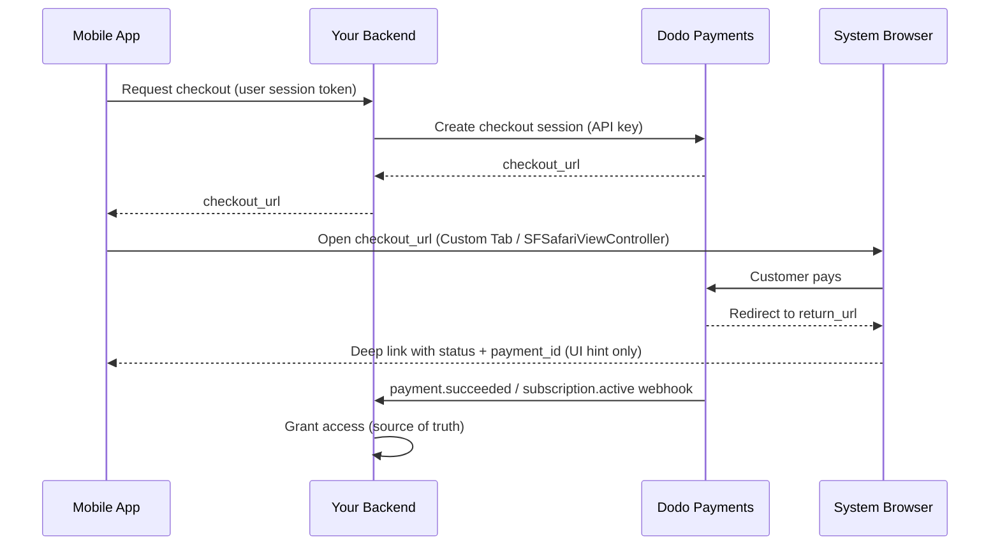

<CardGroup cols={4}>
<Card title="Quick Start" icon="rocket" href="#integration-workflow">
  只需 4 个简单步骤，即可完成移动支付集成
</Card>

<Card title="Platform Examples" icon="code" href="#choose-your-sdk">
  Android、iOS、React Native 和 Flutter 的完整代码示例
</Card>

<Card title="Checkout Customization" icon="sliders" href="#checkout-page-customization">
  配置主题、预填充信息和 14 个移动端专用参数
</Card>

<Card title="Mobile Recipes" icon="flask" href="#mobile-optimized-recipes">
  适用于 5 种常见移动端场景的可直接复制结账配置
</Card>
</CardGroup>

<Info>
Dodo Payments 为 **Android、iOS、React Native 和 Flutter** 提供官方结账 SDK。每个 SDK 都将下文介绍的模式（打开结账 URL、捕获返回结果、解析结果）封装在一次类型安全的 `start(...)` 调用中，并内置已放弃会话恢复功能。只有在这些 SDK 都不适用于你的技术栈时，才应使用手动 WebView。
</Info>

## 前置条件

将 Dodo Payments 集成到移动应用之前，请确保你具备以下条件：

- **Dodo Payments 账户**：已启用且具有 API 访问权限的商户账户
- **API 凭证**：从控制面板获取的 API key 和 webhook secret key
- **移动应用项目**：Android、iOS、React Native 或 Flutter 应用
- **后端服务器**：用于安全地处理结账会话创建

## 集成流程

移动端集成遵循安全的 4 步流程：后端处理 API 调用，移动应用管理用户体验。



<Info>
深层链接 `status` 仅是告诉界面向用户显示什么的 **UI 提示**。始终通过后端的 `payment.succeeded` / `subscription.active` **webhook** 授予访问权限，绝不能仅依据移动端结果。
</Info>

<Steps>
<Step title="Backend: Create Checkout Session">
<Card title="Checkout Session API Docs" icon="book" href="/developer-resources/checkout-session">
了解如何使用 Node.js、Python 等技术在后端创建结账会话。完整示例和参数参考请参阅专门的 <strong>Checkout Sessions API</strong> 文档。
</Card>
<Note>
**安全性**：结账会话必须在后端服务器上创建，绝不能在移动应用中创建。这样可以保护你的 API keys，并确保进行适当的验证。
</Note>

</Step>

<Step title="Mobile: Get Checkout URL">

移动应用调用后端以获取结账 URL。请使用已登录用户自己的会话令牌对该请求进行身份验证。

<Tabs>
<Tab title="iOS (Swift)">

```swift
func getCheckoutURL(productId: String, customerEmail: String, customerName: String) async throws -> String {
    let url = URL(string: "https://your-backend.com/api/create-checkout-session")!
    var request = URLRequest(url: url)
    request.httpMethod = "POST"
    request.setValue("application/json", forHTTPHeaderField: "Content-Type")
    request.setValue("Bearer \(userSessionToken)", forHTTPHeaderField: "Authorization")
    
    let requestData: [String: Any] = [
        "productId": productId,
        "customerEmail": customerEmail,
        "customerName": customerName
    ]
    request.httpBody = try JSONSerialization.data(withJSONObject: requestData)
    
    let (data, _) = try await URLSession.shared.data(for: request)
    let response = try JSONDecoder().decode(CheckoutResponse.self, from: data)
    return response.checkout_url
}
```

</Tab>
<Tab title="Android (Kotlin)">

```kotlin
suspend fun getCheckoutURL(productId: String, customerEmail: String, customerName: String): String {
    val client = OkHttpClient()
    val requestBody = JSONObject().apply {
        put("productId", productId)
        put("customerEmail", customerEmail)
        put("customerName", customerName)
    }.toString().toRequestBody("application/json".toMediaType())
    
    val request = Request.Builder()
        .url("https://your-backend.com/api/create-checkout-session")
        .header("Authorization", "Bearer $userSessionToken")
        .post(requestBody)
        .build()
    
    val response = client.newCall(request).execute()
    val responseBody = response.body?.string()
    val jsonResponse = JSONObject(responseBody ?: "")
    return jsonResponse.getString("checkout_url")
}
```

</Tab>
<Tab title="React Native (JavaScript)">

```javascript
const getCheckoutURL = async (productId, customerEmail, customerName) => {
  try {
    const response = await fetch('https://your-backend.com/api/create-checkout-session', {
      method: 'POST',
      headers: {
        'Content-Type': 'application/json',
        'Authorization': `Bearer ${userSessionToken}`,
      },
      body: JSON.stringify({
        productId,
        customerEmail,
        customerName
      })
    });
    
    const data = await response.json();
    return data.checkout_url;
  } catch (error) {
    console.error('Failed to get checkout URL:', error);
    throw error;
  }
};
```

</Tab>
<Tab title="Flutter (Dart)">

```dart
import 'dart:convert';
import 'package:http/http.dart' as http;

Future<String> getCheckoutUrl({
  required String productId,
  required String customerEmail,
  required String customerName,
}) async {
  final response = await http.post(
    Uri.parse('https://your-backend.com/api/create-checkout-session'),
    headers: {
      'Content-Type': 'application/json',
      'Authorization': 'Bearer $userSessionToken',
    },
    body: jsonEncode({
      'productId': productId,
      'customerEmail': customerEmail,
      'customerName': customerName,
    }),
  );

  if (response.statusCode != 200) {
    throw Exception('Failed to get checkout URL: ${response.statusCode}');
  }
  return jsonDecode(response.body)['checkout_url'] as String;
}
```

</Tab>
</Tabs>
<Note>
**安全性**：移动应用只能与后端通信，不能直接调用 Dodo Payments API。
</Note>
</Step>

<Step title="Mobile: Open Checkout in Browser">
在安全的应用内浏览器中打开结账 URL 以处理付款。
或者，使用适用于你的平台的官方结账 SDK，完全跳过手动配置。

<Card title="Pick your mobile SDK" icon="box" href="#choose-your-sdk">
  Android、iOS、React Native 和 Flutter 的安装步骤与配置说明。
</Card>

</Step>

<Step title="Backend: Handle Payment Completion">
通过 webhooks 和重定向 URL 处理付款完成事件，以确认付款状态。
</Step>
</Steps>

## 选择 SDK

每个移动端 SDK 都公开相同的契约：一次 `start(...)` 调用即可在平台的原生浏览器界面中打开 Dodo 托管的结账页面，并返回一个类型化的 `CheckoutResult`，其 `status` 为 `succeeded`、`failed`、`cancelled`、`pending` 或 `expired`。它们都不会保存 API key 或调用 Dodo Payments API，并且全部支持已放弃会话恢复。

<CardGroup cols={2}>
<Card title="Android" icon="android" href="/developer-resources/sdks/android">
  `com.dodopayments.api:checkout-android` 会打开 Chrome Custom Tab。需要 `minSdk` 23。
</Card>
<Card title="iOS" icon="apple" href="/developer-resources/sdks/ios">
  `dodopayments-mobile-sdk-ios` 会打开 `SFSafariViewController`。需要 iOS 16+。
</Card>
<Card title="React Native" icon="react" href="/developer-resources/sdks/react-native">
  `@dodopayments/react-native-checkout` 是同时运行于两个原生核心之上的 Turbo Module。需要 React Native 0.76+。
</Card>
<Card title="Flutter" icon="layer-group" href="/developer-resources/sdks/flutter">
  `dodopayments_checkout` 是同时运行于两个原生核心之上的 Pigeon channel。需要 Flutter 3.44+。
</Card>
</CardGroup>

<Warning>
你收到的 `status` 是 UI 提示，而不是付款凭证。请始终通过后端的 `payment.succeeded` / `subscription.active` webhook，或使用 secret key 获取付款信息，确认每笔付款。
</Warning>

### 注册回调 URL Scheme

四个 SDK 都会通过你选择的自定义 URL scheme 将控制权交还给应用，例如 `myapp://checkout/return`。请在每个平台上注册一次：

<Tabs>
<Tab title="Android">

```kotlin android/app/build.gradle
android {
    defaultConfig {
        manifestPlaceholders["dodoCallbackScheme"] = "myapp"
    }
}
```

SDK 自带的 manifest 已声明重定向 activity，因此无需添加 manifest XML。
</Tab>
<Tab title="iOS">

```xml Info.plist
<key>CFBundleURLTypes</key>
<array>
  <dict>
    <key>CFBundleURLName</key>
    <string>myapp</string>
    <key>CFBundleURLSchemes</key>
    <array>
      <string>myapp</string>
    </array>
  </dict>
</array>
```

在 iOS 上，你还必须将传入的 URL 转发给 SDK，因为 `SFSafariViewController` 无法捕获自己的返回 URL。有关确切的 handler，请参阅 [iOS](/developer-resources/sdks/ios) 或 [React Native](/developer-resources/sdks/react-native) 页面。
</Tab>
<Tab title="Expo">
`@dodopayments/react-native-checkout` 提供了一个 config plugin，可在 `prebuild` 为两个平台注册 scheme。向其传入 `scheme` 选项：

```json app.json
{
  "expo": {
    "scheme": "myapp",
    "plugins": [
      [
        "@dodopayments/react-native-checkout",
        { "scheme": "myappcheckout" }
      ]
    ]
  }
}
```

`scheme` 必须与 `returnUrl` 匹配，并且必须不同于 Expo 已在 `MainActivity` 注册的 `expo.scheme`。详情请参阅 [React Native SDK](/developer-resources/sdks/react-native) 页面。

如果 `android/app/build.gradle` 是手动维护的，且没有标准的 `defaultConfig { }` 块，请改为手动设置占位符（参见 Android 选项卡）。

仅适用于开发构建，不适用于 Expo Go。编辑 `app.json` 后运行 `npx expo prebuild --clean`。
</Tab>
</Tabs>

<Note>
想自行构建？在平台的系统浏览器中打开 `checkout_url`（Android Custom Tabs / iOS `SFSafariViewController`），拦截导航到 `return_url` 的过程，然后读取 `status` 和 `payment_id` 查询参数。上述 SDK 会为你完成这些操作。
</Note>

<Warning>
**不要在嵌入式 WebView（`WKWebView` / Android `WebView`）中打开结账页面。** 这是移动端集成中最常见的问题：嵌入式 WebView **会阻止 Apple Pay 和 Google Pay**，还可能破坏 3-D Secure 验证和已保存卡片的自动填充，导致客户可用的付款选项更少、失败更多。请始终使用 SDK，或在系统浏览器（Custom Tabs / `SFSafariViewController`）中打开 `checkout_url`。Apple Pay 和 Google Pay 能够继续正常工作，正是因为使用了这一原生浏览器界面。
</Warning>

## 外观自定义

每个 SDK 都接受 `start(...)` / `CheckoutParams` 上的可选 `customization` 参数，用于控制原生浏览器界面的外观和行为，包括工具栏、按钮和呈现方式。这与结账页面自身的主题不同；后者需要在服务器端通过结账会话上的 [`customization.theme_config`](/developer-resources/checkout-session) 进行配置。

选项按平台分组，因为 Android 的 Custom Tab 和 iOS 的 `SFSafariViewController` 提供的原生控件不同。所有字段均为可选；完全省略 `customization` 时，将使用各平台的默认外观。

<AccordionGroup>
<Accordion title="Android - Custom Tab">

<ParamField body="toolbarColor" type="Color">
工具栏背景颜色。
</ParamField>

<ParamField body="navigationBarColor" type="Color">
导航栏颜色。
</ParamField>

<ParamField body="navigationBarDividerColor" type="Color">
导航栏上方分隔线的颜色。
</ParamField>

<ParamField body="closeButtonStyle" type="'default' | 'back'">
`default` 显示系统的“X”图标；`back` 则显示返回箭头。
</ParamField>

<ParamField body="closeButtonPosition" type="'start' | 'end'">
关闭按钮在工具栏中出现的位置。
</ParamField>

<ParamField body="shareButtonEnabled" type="boolean">
显示工具栏的分享图标。
</ParamField>

<ParamField body="showTitleEnabled" type="boolean">
在工具栏中 URL 下方显示页面标题。
</ParamField>

<ParamField body="urlBarHidingEnabled" type="boolean">
页面滚动时允许工具栏自动隐藏。
</ParamField>

<ParamField body="bookmarksButtonEnabled" type="boolean">
在溢出菜单中显示“将此页面加入书签”。
</ParamField>

<ParamField body="downloadsButtonEnabled" type="boolean">
在溢出菜单中显示“下载页面”。
</ParamField>

<ParamField body="colorScheme" type="'system' | 'light' | 'dark'">
无论设备的系统设置如何，强制使用浅色或深色外观。
</ParamField>

</Accordion>

<Accordion title="iOS - SFSafariViewController">

<ParamField body="dismissButtonStyle" type="'done' | 'close' | 'cancel'">
关闭按钮的标签或图标。
</ParamField>

<ParamField body="presentationStyle" type="'pageSheet' | 'fullScreen'">
`pageSheet` 以支持滑动关闭的卡片形式呈现；`fullScreen` 覆盖整个屏幕。
</ParamField>

<ParamField body="barCollapsingEnabled" type="boolean">
允许工具栏在滚动时折叠。仅当 `presentationStyle` 为 `fullScreen` 时可见；无论此设置如何，`pageSheet` 都会固定工具栏。
</ParamField>

<ParamField body="colorScheme" type="'system' | 'light' | 'dark'">
无论设备的系统设置如何，强制使用浅色或深色外观。
</ParamField>

</Accordion>
</AccordionGroup>

<Tabs>
<Tab title="React Native">

```typescript
const result = await DodoCheckout.start({
  checkoutUrl,
  returnUrl: 'myapp://checkout/return',
  customization: {
    android: { toolbarColor: '#6366F1', closeButtonStyle: 'back' },
    ios: { presentationStyle: 'fullScreen', colorScheme: 'dark' },
  },
});
```

</Tab>
<Tab title="Flutter">

```dart
final result = await DodoCheckout.instance.start(
  CheckoutParams(
    checkoutUrl: Uri.parse(checkoutUrl),
    returnUrl: Uri.parse('myapp://checkout/return'),
    customization: BrowserCustomization(
      android: AndroidBrowserOptions(
        toolbarColor: Color(0xFF6366F1),
        closeButtonStyle: CloseButtonStyle.back,
      ),
      ios: IosBrowserOptions(
        presentationStyle: PresentationStyle.fullScreen,
        colorScheme: BrowserColorScheme.dark,
      ),
    ),
  ),
);
```

</Tab>
<Tab title="Android (Kotlin)">

```kotlin
val result = DodoCheckout.start(
    activity,
    CheckoutParams(
        checkoutUrl = checkoutUrl,
        returnUrl = "myapp://checkout/return",
        customization = BrowserCustomization(
            toolbarColor = Color.parseColor("#6366F1"),
            closeButtonStyle = BrowserCustomization.CloseButtonStyle.BACK,
        )
    )
) { event -> }
```

</Tab>
<Tab title="iOS (Swift)">

```swift
let result = try await DodoCheckout.start(
    checkoutUrl: checkoutUrl,
    returnUrl: URL(string: "myapp://checkout/return")!,
    customization: BrowserCustomization(
        presentationStyle: .fullScreen,
        colorScheme: .dark
    )
)
```

</Tab>
</Tabs>

## 结账页面自定义

上面的[外观自定义](#appearance-customization)部分控制原生浏览器界面，包括工具栏、按钮和配色方案。结账*页面本身*（显示哪些字段、使用何种主题、显示哪些付款方式）是在创建结账会话时于服务器端配置的。这些参数对移动端转化率影响最大。

以下参数分别位于结账会话请求的三个不同位置；**位置**列会告诉你每个参数所属的对象。配置错误是最常见的问题：放在错误对象中的参数会被静默忽略。

| 参数 | 所属位置 | 移动端优势 | 默认值 | 适用场景 |
|-----------|---------------|---------------|---------|-----------|
| `show_order_details` | `customization` | 折叠订单摘要，使付款方式显示在屏幕顶部 | `true` | 移动端始终设置 `false`；将付款方式移到首屏上方可显著减少用户流失 |
| `minimal_address` | 顶层 | 只需邮政编码；隐藏街道、城市和州字段 | `false` | 移动端几乎总是启用；每增加一个字段都会降低转化率 |
| `theme` | `customization` | 控制结账页面的浅色或深色外观 | 商户默认值 | 使用 `"system"` 以匹配设备 OS 偏好 |
| `theme_config` | `customization` | 完整品牌配色，包括颜色、字体、边框圆角和支付按钮标签 | 无 | 需要让结账页面与应用融为一体时 |
| `force_language` | `customization` | 覆盖浏览器语言区域检测 | 自动检测 | 从应用的语言区域设置该值，不要依赖浏览器 |
| `show_on_demand_tag` | `customization` | 显示或隐藏结账页面上的“按需”标签 | `true` | 将按需计费仅用于卡片令牌化时设置 `false` |
| `show_saved_payment_methods` | 顶层 | 为回访客户显示已保存的卡片，以支持一键付款 | `false` | 为曾经付款且已登录的用户启用 |
| `allow_discount_code` | `feature_flags` | 显示促销码输入字段 | `true` | 设置 `false` 以缩短表单；离开页面寻找代码的用户很少会回来 |
| `allow_currency_selection` | `feature_flags` | 允许客户切换计费货币 | `true` | 使用 `billing_currency` 锁定货币时设置 `false` |
| `redirect_immediately` | `feature_flags` | 跳过成功页面，直接跳转到 `return_url` | `false` | 需要无缝返回应用时启用 |
| `confirm` | 顶层 | 无需额外确认步骤即可完成付款 | `false` | 与 `payment_method_id` 一起用于一键结账 |
| `short_link` | 顶层 | 返回更短的结账 URL | `false` | 适用于 URL 必须放入推送通知或 SMS 的场景 |
| `payment_method_id` | 顶层 | 预先选择已保存的付款方式 | - | 与 `confirm: true` 一起传入以实现一键结账 |
| `allowed_payment_method_types` | 顶层 | 将显示的付款方式限制为指定列表 | 全部启用 | 仅保留适用于你的产品类型的付款方式 |

<Warning>
**始终同时传入 `billing_currency` 和 `billing_address.country`。** 如果缺少其中任意一个，Adaptive Currency 可能会根据客户的 IP 地址静默更改计费货币。曾有一位商户的客户前往欧洲后，其美国订阅被切换为 EUR，原因就是没有明确设置计费国家/地区。
</Warning>

<Tip>
**移动端提升转化率最有效的单项措施：**设置 `show_order_details: false` 和 `minimal_address: true`。将付款方式移到首屏上方并减少表单字段，是你能做出的影响最大的两项改动。
</Tip>

<Frame caption="show_order_details: false moves the contact and payment fields above the fold, instead of behind the order summary.">
  
</Frame>

将 `minimal_address: true` 设置为仅收集邮政编码，而不是完整的街道、城市和州字段：

<Frame caption="minimal_address: true reduces the billing address to a single postcode field.">
  
</Frame>

设置 `theme: "system"`，使结账页面遵循设备的浅色或深色模式偏好：

<Frame caption="With theme: system, the checkout follows the device's light or dark appearance automatically.">
  
</Frame>

<Info>
**付款方式的可用性因产品类型而异。** Apple Pay 和 Cash App 支持非零金额的周期性订阅。对于一次性付款，所有已启用的付款方式均可用。
</Info>

<Card title="Full checkout session parameter reference" icon="book" href="/developer-resources/checkout-session">
  在 Checkout Sessions 指南中查看所有可用参数、类型和默认值。
</Card>

## 移动端优化方案

以下每个方案都是完整的结账会话请求正文。选择与你的场景匹配的方案，替换产品 ID，然后将其传递给后端的会话创建端点。

<AccordionGroup>
<Accordion title="Minimal Mobile Checkout - fastest path to payment">

当你希望表单尽可能简短时使用：付款方式位于顶部，地址只需填写邮政编码，不显示折扣字段，主题与设备保持一致。

<Tabs>
<Tab title="Node.js SDK">

```javascript expandable
import DodoPayments from 'dodopayments';

const client = new DodoPayments({
  bearerToken: process.env.DODO_PAYMENTS_API_KEY,
  environment: 'test_mode',
});

const session = await client.checkoutSessions.create({
  product_cart: [{ product_id: 'pdt_your_product_id', quantity: 1 }],
  customer: { email: 'user@example.com', name: 'Jane Smith' },
  billing_address: { country: 'US' },
  return_url: 'myapp://checkout/success',
  cancel_url: 'myapp://checkout/cancelled',
  billing_currency: 'USD',
  minimal_address: true,
  customization: {
    show_order_details: false,
    theme: 'system',
  },
  feature_flags: {
    allow_discount_code: false,
    allow_currency_selection: false,
  },
});

console.log(session.checkout_url);
```

</Tab>
<Tab title="Python SDK">

```python expandable
import os
import dodopayments

client = dodopayments.DodoPayments(
    bearer_token=os.environ.get("DODO_PAYMENTS_API_KEY"),
    environment="test_mode",
)

session = client.checkout_sessions.create(
    product_cart=[{"product_id": "pdt_your_product_id", "quantity": 1}],
    customer={"email": "user@example.com", "name": "Jane Smith"},
    billing_address={"country": "US"},
    return_url="myapp://checkout/success",
    cancel_url="myapp://checkout/cancelled",
    billing_currency="USD",
    minimal_address=True,
    customization={
        "show_order_details": False,
        "theme": "system",
    },
    feature_flags={
        "allow_discount_code": False,
        "allow_currency_selection": False,
    },
)

print(session.checkout_url)
```

</Tab>
</Tabs>

<Note>
所有可用参数及其默认值请参阅 [Checkout Sessions](/developer-resources/checkout-session)。
</Note>
</Accordion>

<Accordion title="Branded Mobile Checkout - custom colors, fonts, and button label">

当结账页面需要与应用融为一体时使用。设置品牌颜色、自定义字体和本地化的支付按钮标签。

<Frame>
  
</Frame>

<Tabs>
<Tab title="Node.js SDK">

```javascript expandable
const session = await client.checkoutSessions.create({
  product_cart: [{ product_id: 'pdt_your_product_id', quantity: 1 }],
  customer: { email: 'user@example.com', name: 'Jane Smith' },
  billing_address: { country: 'US' },
  billing_currency: 'USD',
  return_url: 'myapp://checkout/success',
  minimal_address: true,
  customization: {
    show_order_details: false,
    theme: 'dark',
    theme_config: {
      dark: {
        button_primary: '#7C3AED',
        button_primary_hover: '#6D28D9',
        button_text_primary: '#FFFFFF',
        bg_primary: '#1A1A2E',
        bg_secondary: '#16213E',
        text_primary: '#E2E8F0',
      },
      pay_button_text: 'Complete Purchase',
      radius: '8px',
    },
  },
});
```

</Tab>
<Tab title="Python SDK">

```python expandable
session = client.checkout_sessions.create(
    product_cart=[{"product_id": "pdt_your_product_id", "quantity": 1}],
    customer={"email": "user@example.com", "name": "Jane Smith"},
    billing_address={"country": "US"},
    billing_currency="USD",
    return_url="myapp://checkout/success",
    minimal_address=True,
    customization={
        "show_order_details": False,
        "theme": "dark",
        "theme_config": {
            "dark": {
                "button_primary": "#7C3AED",
                "button_primary_hover": "#6D28D9",
                "button_text_primary": "#FFFFFF",
                "bg_primary": "#1A1A2E",
                "bg_secondary": "#16213E",
                "text_primary": "#E2E8F0",
            },
            "pay_button_text": "Complete Purchase",
            "radius": "8px",
        },
    },
)
```

</Tab>
</Tabs>

<Note>
`theme_config` 接受单独的 `dark` 和 `light` 对象，因此配色可以适应设备当前的外观。完整的颜色键参考请参阅 [Checkout Sessions](/developer-resources/checkout-session)。
</Note>
</Accordion>

<Accordion title="One-Click Returning Customer - saved card, instant confirmation">

对于曾经付款的已登录用户使用。组合传入客户 ID、其已保存的付款方式以及 `confirm: true`，即可完全跳过结账表单。

<Tabs>
<Tab title="Node.js SDK">

```javascript expandable
const session = await client.checkoutSessions.create({
  product_cart: [{ product_id: 'pdt_your_product_id', quantity: 1 }],
  customer: { customer_id: 'cus_returning_customer_id' },
  billing_address: { country: 'US' },
  billing_currency: 'USD',
  return_url: 'myapp://checkout/success',
  payment_method_id: 'pm_saved_payment_method_id',
  confirm: true,
  show_saved_payment_methods: true,           // top-level parameter
  feature_flags: { redirect_immediately: true },
});
```

</Tab>
<Tab title="Python SDK">

```python expandable
session = client.checkout_sessions.create(
    product_cart=[{"product_id": "pdt_your_product_id", "quantity": 1}],
    customer={"customer_id": "cus_returning_customer_id"},
    billing_address={"country": "US"},
    billing_currency="USD",
    return_url="myapp://checkout/success",
    payment_method_id="pm_saved_payment_method_id",
    confirm=True,
    show_saved_payment_methods=True,           # top-level parameter
    feature_flags={"redirect_immediately": True},
)
```

</Tab>
</Tabs>

<Note>
深层链接返回中的 `status` 仅是 UI 提示。请通过监听后端的 `payment.succeeded` webhook 来确认访问权限。
</Note>
</Accordion>

<Accordion title="Subscription with Free Trial - trial before first charge">

对于在第一个计费周期之前提供免费试用期的订阅产品使用。

<Tabs>
<Tab title="Node.js SDK">

```javascript expandable
const session = await client.checkoutSessions.create({
  product_cart: [{ product_id: 'pdt_your_subscription_product_id', quantity: 1 }],
  customer: { email: 'user@example.com', name: 'Jane Smith' },
  billing_address: { country: 'US' },
  billing_currency: 'USD',
  return_url: 'myapp://subscription/activated',
  cancel_url: 'myapp://subscription/cancelled',
  minimal_address: true,
  customization: {
    show_order_details: false,
    theme: 'system',
  },
  subscription_data: { trial_period_days: 14 },
});
```

</Tab>
<Tab title="Python SDK">

```python expandable
session = client.checkout_sessions.create(
    product_cart=[{"product_id": "pdt_your_subscription_product_id", "quantity": 1}],
    customer={"email": "user@example.com", "name": "Jane Smith"},
    billing_address={"country": "US"},
    billing_currency="USD",
    return_url="myapp://subscription/activated",
    cancel_url="myapp://subscription/cancelled",
    minimal_address=True,
    customization={"show_order_details": False, "theme": "system"},
    subscription_data={"trial_period_days": 14},
)
```

</Tab>
</Tabs>

<Note>
当后端收到 `subscription.active` webhook 时授予功能访问权限，而不是在移动 SDK 返回结果时授予。完整的 webhook 流程请参阅[订阅集成指南](/developer-resources/subscription-integration-guide)。
</Note>
</Accordion>

<Accordion title="On-Demand Mandate - save a card for future variable charges">

用于将客户的卡片令牌化，以便之后进行扣款（钱包充值、随用随付、BNPL），且不显示“订阅”标签。客户只需授权一次付款方式；之后即可按需收取不同金额。

<Info>
这是按使用量收费的应用所采用的模式，例如一款从预授权卡片中按会话收费的占星应用，而不是按照固定时间表收费。
</Info>

<Tabs>
<Tab title="Node.js SDK">

```javascript expandable
// Step 1: Authorize the mandate (no charge yet)
const session = await client.checkoutSessions.create({
  product_cart: [{ product_id: 'pdt_your_subscription_product_id', quantity: 1 }],
  customer: { email: 'user@example.com', name: 'Jane Smith' },
  billing_address: { country: 'US' },
  billing_currency: 'USD',
  return_url: 'myapp://mandate/authorized',
  cancel_url: 'myapp://mandate/cancelled',
  minimal_address: true,
  customization: {
    show_order_details: false,
    show_on_demand_tag: false, // hides the "on-demand" / "subscription" label
    theme: 'system',
  },
  subscription_data: {
    on_demand: { mandate_only: true },
  },
});

// Step 2: Later, charge any amount using the subscription ID
// (received via the subscription.active webhook after mandate authorization)
// await client.subscriptions.charge(subscriptionId, {
//   product_price: 2000,         // $20.00 in cents
//   product_currency: 'USD',
//   product_description: 'Session credits',
// });
```

</Tab>
<Tab title="Python SDK">

```python expandable
# Step 1: Authorize the mandate (no charge yet)
session = client.checkout_sessions.create(
    product_cart=[{"product_id": "pdt_your_subscription_product_id", "quantity": 1}],
    customer={"email": "user@example.com", "name": "Jane Smith"},
    billing_address={"country": "US"},
    billing_currency="USD",
    return_url="myapp://mandate/authorized",
    cancel_url="myapp://mandate/cancelled",
    minimal_address=True,
    customization={
        "show_order_details": False,
        "show_on_demand_tag": False,  # hides the "on-demand" / "subscription" label
        "theme": "system",
    },
    subscription_data={"on_demand": {"mandate_only": True}},
)

# Step 2: Later, charge any amount using the subscription ID
# client.subscriptions.charge(subscription_id, {
#     "product_price": 2000,  # $20.00 in cents
#     "product_currency": "USD",
#     "product_description": "Session credits",
# })
```

</Tab>
</Tabs>

<Warning>
按需扣款的最低金额为 1 USD（100 cents）。低于 1 USD 的金额将被 `"value out of range"` 拒绝。若要进行零金额授权，请使用上文所示的 `mandate_only: true`，然后在后续调用中至少扣款 1 USD。
</Warning>

<Note>
完整的扣款流程、webhook 事件和重试策略请参阅[按需订阅](/developer-resources/ondemand-subscriptions)。
</Note>
</Accordion>
</AccordionGroup>

## 移动端订阅流程

订阅通过与一次性付款相同的结账会话流程创建：移动 SDK 打开托管结账页面，客户完成订阅，应用处理深层链接返回。之后，订阅生命周期完全由后端管理。

### 常规周期性订阅

对于固定间隔计费（月付、年付），请使用订阅产品和深层链接 `return_url` 创建结账会话。订阅确认后，后端会收到 `subscription.active`。

<Info>
**Apple Pay** 和 **Cash App** 支持非零金额的周期性订阅。
</Info>

完整的后端 webhook 流程请参阅[订阅集成指南](/developer-resources/subscription-integration-guide)。

---

### 按需订阅

按需订阅允许你仅授权一次客户的付款方式，之后再收取不同金额，适用于钱包充值、随用随付以及无法提前确定扣款金额的任何场景。完整请求正文请参阅上文的 **按需授权** 方案。

移动端的关键注意事项：

- 设置 `show_on_demand_tag: false`，使结账页面不显示“订阅”或“按需”字样。对于卡片令牌化场景，客户并不期待看到订阅术语。
- 授权完成后，后端会收到 `subscription.active`。请保存 `subscription_id`，之后的所有扣款都需要使用它。

<Warning>
最低扣款金额为 1 USD（100 cents）。低于 1 USD 的按需扣款将被 `"value out of range"` 拒绝。请至少扣款 1 USD，或使用 `mandate_only: true` 进行免扣款授权，之后再收取第一笔实际金额。
</Warning>

<Warning>
**避免快速连续重试。** 如果之前的扣款仍在处理中，同一订阅上的新扣款会因 `"Cannot create new charge as previous payment is not successful yet"` 失败。印度付款方式（UPI、印度借记卡/信用卡）尤其容易出现这种情况，因为 RBI mandate 规则可能使交易保持处理状态长达 48 小时。请在重试前于扣款逻辑中加入冷却检查。
</Warning>

完整的扣款端点、webhook 事件和重试策略请参阅[按需订阅](/developer-resources/ondemand-subscriptions)。

---

### 带免费试用期的订阅

在结账会话中传入 `subscription_data.trial_period_days`，即可在第一个计费周期之前提供试用期。客户在注册试用时授权付款方式；试用期结束后会自动进行首次扣款。完整请求正文请参阅上文的**带免费试用期的订阅**方案。

---

### 升级与降级

计划变更通过后端的 API 完成，而不是创建新的结账会话。Dodo Payments 会自动计算按比例计费。若要为客户提供自助服务选项，请嵌入或链接到 [Customer Portal](/features/customer-portal)。

<CardGroup cols={2}>
<Card title="Subscription Integration Guide" icon="repeat" href="/developer-resources/subscription-integration-guide">
  完整的后端配置：webhook 流程、访问权限配置和取消
</Card>
<Card title="On-Demand Subscriptions" icon="bolt" href="/developer-resources/ondemand-subscriptions">
  授权、可变金额扣款和重试策略
</Card>
<Card title="Upgrade / Downgrade" icon="arrows-up-down" href="/developer-resources/subscription-upgrade-downgrade">
  按比例计费策略、计划变更和席位调整
</Card>
<Card title="Customer Portal" icon="user" href="/features/customer-portal">
  面向客户的自助订阅管理
</Card>
</CardGroup>

## 减少结账流失

移动端结账的放弃率高于网页端：屏幕更小、干扰更多、表单更长都会造成影响。最快的改进来自结账会话本身的配置。

### 优化表单

| 设置 | 建议值 | 作用 |
|---------|------------------|--------|
| `show_order_details` | `false` | 折叠订单摘要；付款方式显示在顶部 |
| `minimal_address` | `true` | 只需填写邮政编码；移除街道、城市和州字段 |
| `show_saved_payment_methods` | `true` | 回访客户一键付款 |
| `allow_discount_code` | `false` | 移除促销码字段 |
| `theme` | `"system"` | 匹配设备的浅色或深色偏好 |
| `force_language` | 应用语言区域 | 防止结账页面默认使用浏览器语言 |

### 预填充客户数据

客户无需输入的每个字段，都会降低其放弃结账的可能性：

- **新客户**：从身份验证会话中设置 `customer.email` 和 `customer.name`。
- **回访客户**：设置 `customer.customer_id`，自动预填充所有已存储的信息。
- **货币**：始终同时传入 `billing_currency` 和 `billing_address.country`。

### 恢复工具

<CardGroup cols={2}>
<Card title="Abandoned Cart Recovery" icon="cart-shopping" href="/features/recovery/abandoned-cart-recovery">
  针对未完成结账的自动化邮件序列
</Card>
<Card title="Payment Retries" icon="rotate" href="/features/recovery/payment-retries">
  针对订阅续期失败的智能重试逻辑
</Card>
<Card title="Subscription Dunning" icon="envelope" href="/features/recovery/subscription-dunning">
  针对已流失订阅的重新触达邮件
</Card>
<Card title="Recovery Overview" icon="chart-line" href="/features/recovery/overview">
  所有恢复工具及其综合收入影响
</Card>
</CardGroup>

<Tip>
**启用前请测试购物车放弃邮件。** 在 live mode 中创建结账会话，并输入无效的卡片信息。失败的付款会触发恢复邮件流程，让你预览客户实际收到的内容。
</Tip>

## 最佳实践

- **安全性**：绝不要将 API key 放入应用中。请在后端创建结账会话，并仅将生成的 `checkout_url` 传递给客户端。
- **权威性**：将 `CheckoutResult.status` 视为 UI 提示。只有后端确认付款后才授予访问权限。
- **用户体验**：后端创建会话时显示加载状态，并将 `cancelled` 作为正常结果处理，而不是错误。
- **测试**：使用 test mode 和测试卡，并在真实设备和模拟器上验证返回 URL 的往返流程。
- **转化率**：设置 `show_order_details: false` 和 `minimal_address: true`，以获得最佳移动端结账完成率。将付款方式移到首屏上方并减少表单字段，是影响最大的两项改动。
- **货币**：始终显式传入 `billing_currency` 和 `billing_address.country`；缺少其中任意一个时，Adaptive Currency 可能会根据客户 IP 地址更改计费货币。
- **按需计费**：将按需订阅用于卡片令牌化时设置 `show_on_demand_tag: false`。使用钱包充值流程的客户不会期待看到“订阅”字样。
- **恢复**：在 Dodo Payments 控制面板中启用已放弃购物车恢复功能，自动重新触达未完成结账的客户。

## 故障排除

### 常见问题

- **从未收到回调**：`returnUrl` 中的 scheme 必须与注册的 scheme 匹配。在 Android 上，它是 `dodoCallbackScheme` manifest 占位符；在 iOS 和 React Native 上，它是 `Info.plist` URL type。
- **结账返回浏览器而不是应用（iOS）**：你尚未转发传入的 URL。请从 `.onOpenURL`、`scene(_:openURLContexts:)` 或 React Native `Linking` listener 中调用 `DodoCheckout.handleOpenURL(url)`。
- **Android 上出现 `PLATFORM_ERROR`**：通常是 scheme 不匹配。若 `MainActivity` 将 `android:taskAffinity=""` 设置为默认的 `flutter create`，也可能出现此问题，因为某些 OEM 构建会丢失正在进行的结账会话。
- **`ALREADY_IN_PROGRESS`**：已有结账会话处于打开状态。请等待或关闭之前的会话，然后再启动新的会话。
- **构建因未解析的占位符失败**：你添加了 Android SDK，但从未设置 `manifestPlaceholders["dodoCallbackScheme"]`。
- **付款成功但未授予访问权限**：如果你依据移动端结果授予权限，这是预期行为。请改为根据 `payment.succeeded` / `subscription.active` webhook 授予权限。
- **移动端未显示 Apple Pay / Google Pay**：结账页面正在嵌入式 WebView（`WKWebView` / Android `WebView`）中加载，这会阻止电子钱包，并可能破坏 3-D Secure。请改用 SDK 或系统浏览器（Custom Tabs / `SFSafariViewController`）打开。

## 其他资源
- [支付集成指南](/developer-resources/integration-guide)
- [Webhook 文档](/developer-resources/webhooks/intents/webhook-events-guide)
- [测试流程](/miscellaneous/testing-process)
- [技术常见问题](/miscellaneous/faq)
- [结账会话自定义](/developer-resources/checkout-session)
- [按需订阅](/developer-resources/ondemand-subscriptions)
- [订阅升级/降级](/developer-resources/subscription-upgrade-downgrade)
- [已放弃购物车恢复](/features/recovery/abandoned-cart-recovery)
- [Customer Portal](/features/customer-portal)

<Check>
如有疑问或需要支持，请联系 <a href="mailto:support@dodopayments.com">support@dodopayments.com</a>。
</Check>