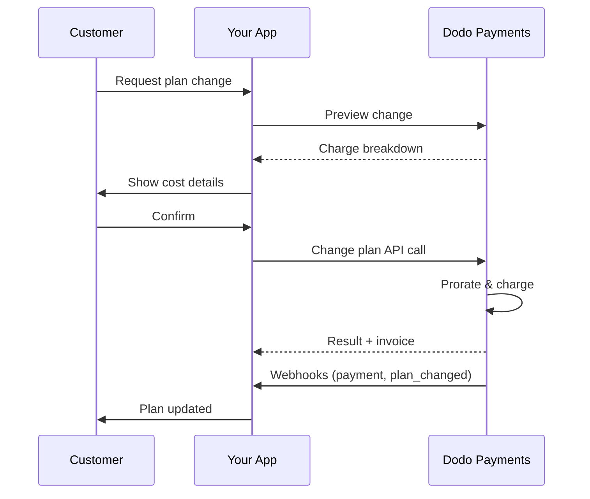
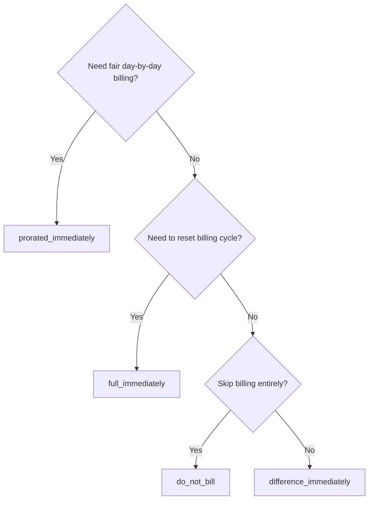
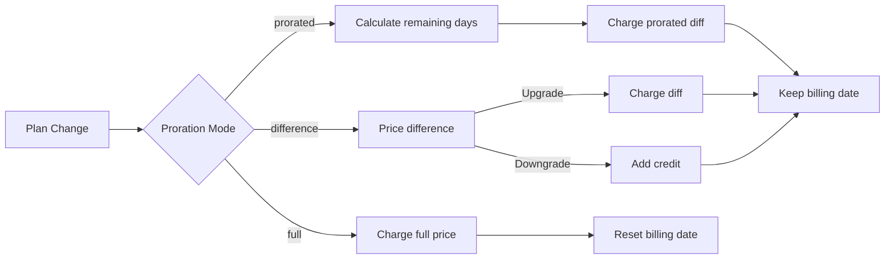

<CardGroup cols={3}>
<Card title="Change Plan API" icon="code" href="/api-reference/subscriptions/change-plan">
  Full API docs for updating subscriptions.
</Card>
<Card title="Plan Change Preview" icon="eye" href="/api-reference/subscriptions/preview-change-plan">
  See charge amounts before changing plans.
</Card>
<Card title="Integration Guide" icon="book" href="/developer-resources/subscription-integration-guide">
  Step-by-step subscription setup.
</Card>
</CardGroup>

## What is a subscription upgrade or downgrade?

Changing plans lets you move a customer between subscription tiers or quantities. Use it to:
- Align pricing with usage or features
- Move from monthly to annual (or vice versa)
- Adjust quantity for seat-based products

<Info>
Plan changes can trigger an immediate charge depending on the proration mode you choose.
</Info>

## When to use plan changes

- Upgrade when a customer needs more features, usage, or seats
- Downgrade when usage decreases
- Migrate users to a new product or price without cancelling their subscription

## Plan Change Flow



## Prerequisites

Before implementing subscription plan changes, ensure you have:

- A Dodo Payments merchant account with active subscription products
- API credentials (API key and webhook secret key) from the dashboard
- An existing active subscription to modify
- Webhook endpoint configured to handle subscription events

<Info>
For detailed setup instructions, see our [Integration Guide](/developer-resources/integration-guide#dashboard-setup).
</Info>

## Step-by-Step Implementation Guide

Follow this comprehensive guide to implement subscription plan changes in your application:

<Steps>
<Step title="Understand Plan Change Requirements">
Before implementing, determine:
- Which subscription products can be changed to which others
- What proration mode fits your business model
- How to handle failed plan changes gracefully
- Which webhook events to track for state management

<Tip>
Test plan changes thoroughly in test mode before implementing in production.
</Tip>
</Step>

<Step title="Choose Your Proration Strategy">
Select the billing approach that aligns with your business needs:

<Tabs>
<Tab title="prorated_immediately">
Best for: SaaS applications wanting to charge fairly for unused time
- Calculates exact prorated amount based on remaining cycle time
- Charges a prorated amount based on unused time remaining in the cycle
- Provides transparent billing to customers
</Tab>

<Tab title="difference_immediately">
Best for: Clear upgrade/downgrade scenarios
- Upgrade: Charge immediate difference (e.g., $30→$80 = charge $50)
- Downgrade: Credit remaining value for future renewals
- Simplifies billing logic and customer communication
</Tab>

<Tab title="full_immediately">
最佳用途：当您想要重置计费周期时
- 立即收取新计划的全额费用
- 忽略旧计划的剩余时间
- 对于从年度到月度过渡非常有用
</Tab>

{/* LOCKED_PATTERN_7fa7f81fc66b83c441dd56aff76d586c */}
最佳用途：免费迁移、礼貌切换或吸收成本差异
- 不计算费用或贷项
- 客户立即转换到新计划，无需任何计费调整
- 计费周期保持不变
</Tab>
</Tabs>
</Step>

<Step title="Implement the Change Plan API">
使用更改计划API修改订阅详情：

<ParamField path="subscription_id" type="string" required>
要修改的活动订阅ID。
</ParamField>

<ParamField path="product_id" type="string" required>
要更改订阅的新产品ID。
</ParamField>

<ParamField path="quantity" type="integer" default="1">
新计划的单位数量（基于席位的产品）。
</ParamField>

<ParamField path="proration_billing_mode" type="string" required>
如何处理立即计费：`prorated_immediately`，`full_immediately`，`difference_immediately` 或 `do_not_bill`。
</ParamField>

<ParamField path="addons" type="array">
新计划的可选附加项。留空将移除任何现有附加项。
</ParamField>

<ParamField path="on_payment_failure" type="string">
控制计划更改支付失败时的行为：
- `prevent_change`: 保持订阅在当前计划上，直到支付成功
- `apply_change`（默认）：无论支付结果如何，立即应用计划更改

如果未指定，使用企业级默认设置。
</ParamField>

<ParamField path="discount_code" type="string">
应用于新计划的可选折扣代码。如果提供，将验证并应用折扣。如果未提供并且订阅有现有折扣且 `preserve_on_plan_change=true`，则会保留现有折扣（如果适用于新产品）。
</ParamField>
</Step>

<Step title="Handle Webhook Events">
设置webhook处理以跟踪计划更改结果：

- `subscription.active`: 计划更改成功，订阅已更新
- `subscription.plan_changed`: 订阅计划已更改（升级/降级/附加项更新）
- `subscription.on_hold`: 计划更改收费失败，订阅已暂停
- `payment.succeeded`: 计划更改的即时收费成功
- `payment.failed`: 即时收费失败

<Warning>
始终验证webhook签名并实施幂等事件处理。
</Warning>
</Step>

<Step title="Update Your Application State">
根据webhook事件，更新您的应用程序：
- 根据新计划授予/撤销功能
- 使用新计划详细信息更新客户仪表板
- 发送有关计划更改的确认电子邮件
- 为审计目的记录计费更改
</Step>

<Step title="Test and Monitor">
彻底测试您的实现：
- 在不同场景下测试所有比例模式
- 验证webhook处理是否正常工作
- 监控计划更改成功率
- 为失败的计划更改设置警报

<Check>
您的订阅计划更改实现现在可以用于生产环境。
</Check>
</Step>
</Steps>

## 预览计划更改

在更改计划之前，使用预览API向客户展示他们将被收取的确切费用：

<Tabs>
<Tab title="Node.js SDK">

```javascript
const preview = await client.subscriptions.previewChangePlan('sub_123', {
  product_id: 'prod_pro',
  quantity: 1,
  proration_billing_mode: 'prorated_immediately'
});

// Show customer the charge before confirming
console.log('Immediate charge:', preview.immediate_charge.summary);
console.log('New plan details:', preview.new_plan);
```

</Tab>

<Tab title="Python SDK">

```python
preview = client.subscriptions.preview_change_plan(
    subscription_id="sub_123",
    product_id="prod_pro",
    quantity=1,
    proration_billing_mode="prorated_immediately"
)

# Show customer the charge before confirming
print("Immediate charge:", preview.immediate_charge.summary)
print("New plan details:", preview.new_plan)
```

</Tab>
</Tabs>

<Tip>
使用预览API构建确认对话框，在客户确认更改计划之前，让他们看到将被收取的确切金额。
</Tip>

## 更改计划API

使用更改计划API修改产品、数量以及活动订阅的比例行为。

### 快速入门示例

<Tabs>
  <Tab title="Node.js SDK">

    ```javascript
    import DodoPayments from 'dodopayments';

    const client = new DodoPayments({
      bearerToken: process.env.DODO_PAYMENTS_API_KEY,
      environment: 'test_mode', // defaults to 'live_mode'
    });

    async function changePlan() {
      const result = await client.subscriptions.changePlan('sub_123', {
        product_id: 'prod_new',
        quantity: 3,
        proration_billing_mode: 'prorated_immediately',
        on_payment_failure: 'prevent_change', // Optional: control behavior on payment failure
      });
      console.log(result.status, result.invoice_id, result.payment_id);
    }

    changePlan();
    ```

  </Tab>
  <Tab title="Python SDK">

    ```python
    import os
    from dodopayments import DodoPayments

    client = DodoPayments(
        bearer_token=os.environ.get("DODO_PAYMENTS_API_KEY"),
        environment="test_mode",  # defaults to "live_mode"
    )

    result = client.subscriptions.change_plan(
        subscription_id="sub_123",
        product_id="prod_new",
        quantity=3,
        proration_billing_mode="prorated_immediately",
        on_payment_failure="prevent_change",  # Optional: control behavior on payment failure
    )
    print(result.status, result.get("invoice_id"), result.get("payment_id"))
    ```

  </Tab>
  <Tab title="Go SDK">

    ```go
    package main

    import (
      "context"
      "fmt"
      "github.com/dodopayments/dodopayments-go"
      "github.com/dodopayments/dodopayments-go/option"
    )

    func main() {
      client := dodopayments.NewClient(option.WithBearerToken("YOUR_TOKEN"))
      res, err := client.Subscriptions.ChangePlan(context.TODO(), dodopayments.SubscriptionChangePlanParams{
        SubscriptionID: dodopayments.F("sub_123"),
        ProductID:             dodopayments.F("prod_new"),
        Quantity:              dodopayments.F(int64(3)),
        ProrationBillingMode:  dodopayments.F(dodopayments.SubscriptionChangePlanParamsProrationBillingModeProratedImmediately),
        OnPaymentFailure:      dodopayments.F(dodopayments.OnPaymentFailurePreventChange), // Optional
      })
      if err != nil { panic(err) }
      fmt.Println(res.Status, res.InvoiceID, res.PaymentID)
    }
    ```

  </Tab>
  <Tab title="HTTP">

    ```bash
    curl -X POST "$DODO_API_BASE/subscriptions/sub_123/change-plan" \
      -H "Authorization: Bearer $DODO_PAYMENTS_API_KEY" \
      -H "Content-Type: application/json" \
      -d '{
        "product_id": "prod_new",
        "quantity": 3,
        "proration_billing_mode": "prorated_immediately",
        "on_payment_failure": "prevent_change"
      }'
    ```

  </Tab>
</Tabs>

```json Success
{
  "status": "processing",
  "subscription_id": "sub_123",
  "invoice_id": "inv_789",
  "payment_id": "pay_456",
  "proration_billing_mode": "prorated_immediately"
}
```

<Note>
字段如<code>invoice_id</code>和<code>payment_id</code>仅在计划更改时创建了即时收费和/或发票时返回。请始终依赖webhook事件（例如，<code>payment.succeeded</code>，<code>subscription.plan_changed</code>）来确认结果。
</Note>

<Warning>
如果即时收费失败，订阅可能会移动到`subscription.on_hold`，直到支付成功。
</Warning>

## 管理附加项

更改订阅计划时，您也可以修改附加项：

```javascript
// Add addons to the new plan
await client.subscriptions.changePlan('sub_123', {
  product_id: 'prod_new',
  quantity: 1,
  proration_billing_mode: 'difference_immediately',
  addons: [
    { addon_id: 'addon_123', quantity: 2 }
  ]
});

// Remove all existing addons
await client.subscriptions.changePlan('sub_123', {
  product_id: 'prod_new',
  quantity: 1,
  proration_billing_mode: 'difference_immediately',
  addons: [] // Empty array removes all existing addons
});
```

<Info>
附加项包含在比例计算中，并将根据所选比例模式进行收费。
</Info>

## 应用折扣代码

更改订阅计划时可以应用折扣代码。这对于提供升级或迁移的促销定价非常有用。

<Tabs>
<Tab title="Node.js SDK">

```javascript
// Apply a discount code during plan change
await client.subscriptions.changePlan('sub_123', {
  product_id: 'prod_pro',
  quantity: 1,
  proration_billing_mode: 'prorated_immediately',
  discount_code: 'UPGRADE20'
});
```

</Tab>
<Tab title="Python SDK">

```python
# Apply a discount code during plan change
client.subscriptions.change_plan(
    subscription_id="sub_123",
    product_id="prod_pro",
    quantity=1,
    proration_billing_mode="prorated_immediately",
    discount_code="UPGRADE20"
)
```

</Tab>
<Tab title="HTTP">

```bash
curl -X POST "$DODO_API_BASE/subscriptions/sub_123/change-plan" \
  -H "Authorization: Bearer $DODO_PAYMENTS_API_KEY" \
  -H "Content-Type: application/json" \
  -d '{
    "product_id": "prod_pro",
    "quantity": 1,
    "proration_billing_mode": "prorated_immediately",
    "discount_code": "UPGRADE20"
  }'
```

</Tab>
</Tabs>

### 计划更改时的折扣行为

| 场景 | 行为 |
|----------|----------|
| 提供 `discount_code` | 验证并应用折扣到新计划。 |
| 未提供代码，现有折扣与 `preserve_on_plan_change=true` | 如果适用于新产品，自动保留现有折扣。 |
| 未提供代码，不可保留折扣 | 新计划未应用折扣。 |

<Tip>
使用 [预览计划更改API](/api-reference/subscriptions/preview-change-plan) 搭配 `discount_code`，在客户确认计划更改之前展示他们的具体节省情况。
</Tip>

## 分期模式

选择更改计划时如何向客户收费：

#### `prorated_immediately`
- 收取当前周期中部分差额
- 如果在试用中，立即收费并切换至新计划
- 降级：可能生成按比例分配的贷项，适用于未来续约

#### `full_immediately`
- 立即收取新计划的全额费用
- 忽略旧计划的剩余时间

<Info>
使用 <code>difference_immediately</code> 进行降级所创建的贷项是订阅范围内的，与 <a href="/features/credit-based-billing">基于信用的计费</a> 权益不同。它们自动适用于同一订阅的未来续期，不可转移到其他订阅。
</Info>

#### `difference_immediately`
- 升级：立即收取新旧计划之间的价格差
- 降级：将剩余价值作为内部信用添加到订阅，并在续约时自动应用

#### `do_not_bill`
- 不计算任何费用或贷项
- 客户立即切换到新计划，无需任何计费调整
- 计费周期保持不变
- 最适合礼貌迁移、免费计划切换或吸收成本差异

| 功能 | `prorated_immediately` | `difference_immediately` | `full_immediately` | `do_not_bill` |
|---------|----------------------|------------------------|-------------------|--------------|
| **升级费用** | 按比例计算剩余天数的差额 | 新旧计划全价差 | 新计划全额 | 无费用 |
| **降级贷项** | 按比例计算剩余天数的贷项 | 全额差价作为贷项 | 无贷项 | 无贷项 |
| **计费周期** | 不变 | 不变 | 重新设置为今天 | 不变 |
| **试用行为** | 结束试用，立即收费 | 结束试用，立即收费 | 结束试用，收取全额 | 结束试用，无费用 |
| **最佳用途** | 公正的基于时间的计费 | 简单的升级/降级运算 | 重置计费周期 | 免费迁移或礼貌切换 |
| **复杂性** | 中等（天数计算） | 低（简单相减） | 低（全额收费） | 无 |



### 示例场景

始终使用这些标准数字：
- 当前计划：**Basic** 每月 **$30**
- 升级目标：**Pro** 每月 **$80**
- 降级目标（从Pro开始）：**Starter** 每月 **$20**
- 计费周期：**30天**，从 **1月1日** 开始
- 计划更改发生在 **1月16日**（剩余15天，已使用15天）

<AccordionGroup>
  <Accordion title="Upgrade: Basic ($30) → Pro ($80) with prorated_immediately">

    ```
    Step 1: Calculate unused credit from current plan
      Unused days = 15 out of 30 days
      Credit = $30 × (15/30) = $15.00

    Step 2: Calculate prorated cost of new plan
      Remaining days = 15 out of 30 days
      New plan cost = $80 × (15/30) = $40.00

    Step 3: Calculate immediate charge
      Charge = New plan cost − Credit
      Charge = $40.00 − $15.00 = $25.00

    → Customer pays $25.00 now
    → Next renewal (Feb 1): $80.00/month
    ```

    ```javascript
    await client.subscriptions.changePlan('sub_123', {
      product_id: 'prod_pro',
      quantity: 1,
      proration_billing_mode: 'prorated_immediately'
    })
    ```

  </Accordion>

  <Accordion title="Downgrade: Pro ($80) → Starter ($20) with prorated_immediately">

    ```
    Step 1: Calculate unused credit from current plan
      Unused days = 15 out of 30 days
      Credit = $80 × (15/30) = $40.00

    Step 2: Calculate prorated cost of new plan
      Remaining days = 15 out of 30 days
      New plan cost = $20 × (15/30) = $10.00

    Step 3: Calculate credit balance
      Credit = $40.00 − $10.00 = $30.00

    → No charge — $30.00 credit added to subscription
    → Credit auto-applies to future renewals
    → Next renewal (Feb 1): $20.00 − $30.00 credit = $0.00
    → Following renewal (Mar 1): $20.00 − $10.00 remaining credit = $10.00
    ```

    ```javascript
    await client.subscriptions.changePlan('sub_123', {
      product_id: 'prod_starter',
      quantity: 1,
      proration_billing_mode: 'prorated_immediately'
    })
    ```

  </Accordion>

  <Accordion title="Upgrade: Basic ($30) → Pro ($80) with difference_immediately">

    ```
    Immediate charge = New plan price − Old plan price
                     = $80 − $30
                     = $50.00

    → Customer pays $50.00 now (regardless of cycle position)
    → Next renewal (Feb 1): $80.00/month
    ```

    ```javascript
    await client.subscriptions.changePlan('sub_123', {
      product_id: 'prod_pro',
      quantity: 1,
      proration_billing_mode: 'difference_immediately'
    })
    ```

  </Accordion>

  <Accordion title="Downgrade: Pro ($80) → Starter ($20) with difference_immediately">

    ```
    Credit = Old plan price − New plan price
           = $80 − $20
           = $60.00

    → No charge — $60.00 credit added to subscription
    → Credit auto-applies to future renewals
    → Next renewal: $20.00 − $20.00 (from credit) = $0.00
    → Following renewal: $20.00 − $20.00 (from credit) = $0.00
    → Third renewal: $20.00 − $20.00 (from remaining credit) = $0.00
    ```

    ```javascript
    await client.subscriptions.changePlan('sub_123', {
      product_id: 'prod_starter',
      quantity: 1,
      proration_billing_mode: 'difference_immediately'
    })
    ```

  </Accordion>

  <Accordion title="Upgrade: Basic ($30) → Pro ($80) with full_immediately">

    ```
    Immediate charge = Full new plan price = $80.00

    → Customer pays $80.00 now
    → No credit for unused time on old plan
    → Billing cycle resets to today (January 16)
    → Next renewal: February 16 at $80.00/month
    ```

    ```javascript
    await client.subscriptions.changePlan('sub_123', {
      product_id: 'prod_pro',
      quantity: 1,
      proration_billing_mode: 'full_immediately'
    })
    ```

  </Accordion>

  <Accordion title="Mid-cycle upgrade with add-ons using prorated_immediately">

    ```
    Current: Basic plan ($30/month), no add-ons
    New: Pro plan ($80/month) + Extra Seats add-on ($10/seat × 3 seats = $30/month)
    Change on day 16 of 30 (15 days remaining)

    Step 1: Credit from current plan
      Credit = $30 × (15/30) = $15.00

    Step 2: Prorated cost of new plan + add-ons
      New plan = $80 × (15/30) = $40.00
      Add-ons = $30 × (15/30) = $15.00
      Total new = $55.00

    Step 3: Immediate charge
      Charge = $55.00 − $15.00 = $40.00

    → Customer pays $40.00 now
    → Next renewal: $80.00 + $30.00 = $110.00/month
    ```

    ```javascript
    await client.subscriptions.changePlan('sub_123', {
      product_id: 'prod_pro',
      quantity: 1,
      proration_billing_mode: 'prorated_immediately',
      addons: [
        { addon_id: 'addon_seats', quantity: 3 }
      ]
    })
    ```

  </Accordion>
</AccordionGroup>

### 每种模式如何处理计费



<Tip>
选择 `prorated_immediately` 进行公平时间记账；选择 `full_immediately` 重新开始计费；使用 `difference_immediately` 进行简单升级并在降级时自动信用；或使用 `do_not_bill` 在不进行任何计费调整的情况下切换计划。
</Tip>

## 处理支付失败

使用 `on_payment_failure` 参数控制计划更改支付失败时的行为。

### 支付失败模式

<Tabs>
<Tab title="prevent_change (Recommended for critical upgrades)">
**行为**：保持订阅在其当前计划上，直到支付成功。

- 计划更改标记为“待定”
- 客户保留其当前计划的访问权限
- 只有在支付成功后，订阅才会进入 `active` 状态
- 适用于希望确保支付成功后再提供升级功能的情况

```javascript
await client.subscriptions.changePlan('sub_123', {
  product_id: 'prod_pro',
  quantity: 1,
  proration_billing_mode: 'prorated_immediately',
  on_payment_failure: 'prevent_change'
});
```

</Tab>

<Tab title="apply_change (Default)">
**行为**：无论支付结果如何，立即应用计划更改。

- 即使支付失败，计划更改仍然适用
- 客户立即获得新计划的访问权限
- 如果支付失败，订阅可能会进入 `on_hold`
- 适用于不关键的升级或您信任客户的情况

```javascript
await client.subscriptions.changePlan('sub_123', {
  product_id: 'prod_pro',
  quantity: 1,
  proration_billing_mode: 'prorated_immediately',
  on_payment_failure: 'apply_change' // This is the default
});
```

</Tab>
</Tabs>

<Info>
如果未指定，`on_payment_failure` 参数将使用您在仪表板中配置的企业级默认设置。
</Info>

### 何时使用每种模式

| 场景 | 推荐模式 | 原因 |
|----------|------------------|--------|
| 升级到高级功能 | `prevent_change` | 确保支付成功后再授予访问权限 |
| 增加数量（更多席位） | `prevent_change` | 防止在没有支付的情况下使用 |
| 降级计划 | `apply_change` | 客户在减少支出 |
| 信任的企业客户 | `apply_change` | 非支付风险较低 |
| 试用到付费转换 | `prevent_change` | 重要的支付时刻 |

## 处理webhook

通过webhook跟踪订阅状态以确认计划更改和支付。

### 要处理的事件类型
- `subscription.active`: 订阅已激活
- `subscription.plan_changed`: 订阅计划已更改（升级/降级/附加项变更）
- `subscription.on_hold`: 收费失败，订阅已暂停
- `subscription.renewed`: 续订成功
- `payment.succeeded`: 计划更改或续订的支付成功
- `payment.failed`: 支付失败

<Info>
我们建议从订阅事件中驱动业务逻辑，并使用支付事件进行确认和对账。
</Info>

### 验证签名并处理意图

<Tabs>
  <Tab title="Next.js Route Handler">

    ```javascript
    import { NextRequest, NextResponse } from 'next/server';
    
    export async function POST(req) {
      const webhookId = req.headers.get('webhook-id');
      const webhookSignature = req.headers.get('webhook-signature');
      const webhookTimestamp = req.headers.get('webhook-timestamp');
      const secret = process.env.DODO_WEBHOOK_SECRET;
    
      const payload = await req.text();
      // verifySignature is a placeholder – in production, use a Standard Webhooks library
      const { valid, event } = await verifySignature(
        payload,
        { id: webhookId, signature: webhookSignature, timestamp: webhookTimestamp },
        secret
      );
      if (!valid) return NextResponse.json({ error: 'Invalid signature' }, { status: 400 });
    
      switch (event.type) {
        case 'subscription.active':
          // mark subscription active in your DB
          break;
        case 'subscription.plan_changed':
          // refresh entitlements and reflect the new plan in your UI
          break;
        case 'subscription.on_hold':
          // notify user to update payment method
          break;
        case 'subscription.renewed':
          // extend access window
          break;
        case 'payment.succeeded':
          // reconcile payment for plan change
          break;
        case 'payment.failed':
          // log and alert
          break;
        default:
          // ignore unknown events
          break;
      }
    
      return NextResponse.json({ received: true });
    }
    ```

  </Tab>
  <Tab title="Express.js">

    ```javascript
    import express from 'express';
    
    const app = express();
    app.post('/webhooks/dodo', express.raw({ type: 'application/json' }), async (req, res) => {
      const webhookId = req.header('webhook-id');
      const webhookSignature = req.header('webhook-signature');
      const webhookTimestamp = req.header('webhook-timestamp');
      const secret = process.env.DODO_WEBHOOK_SECRET;
      const payload = req.body.toString('utf8');
    
      const { valid, event } = await verifySignature(
        payload,
        { id: webhookId, signature: webhookSignature, timestamp: webhookTimestamp },
        secret
      );
      if (!valid) return res.status(400).send('Invalid signature');
    
      // handle events like above
      res.json({ received: true });
    });
    
    app.listen(3000);
    ```

  </Tab>
</Tabs>

<Note>
有关详细的负载架构，请参阅 <a href="/developer-resources/webhooks/intents/subscription">订阅webhook负载</a> 和 <a href="/developer-resources/webhooks/intents/payment">支付webhook负载</a>。
</Note>

## 最佳实践

遵循这些建议以实现可靠的订阅计划更改：

### 计划更改策略
- **彻底测试**：在生产环境之前始终在测试模式下测试计划更改
- **仔细选择分期**：选择与您的业务模式一致的分期模式
- **优雅地处理失败**：实施适当的错误处理和重试逻辑
- **监控成功率**：跟踪计划更改的成功/失败率，并调查问题

### Webhook实施
- **验证签名**：始终验证webhook签名以确保真实性
- **实现幂等性**：优雅地处理重复的webhook事件
- **异步处理**：不要用繁重的操作阻塞webhook响应
- **记录一切**：保持详细的日志记录以进行调试和审计

### 用户体验
- **清晰地沟通**：告知客户计费变更和时间安排
- **提供确认**：发送成功计划更改的电子邮件确认
- **处理边缘情况**：考虑试用期、分期和支付失败
- **立即更新UI**：在应用程序界面中反映计划更改

## 常见问题及解决方案

解决在订阅计划更改期间遇到的典型问题：

<AccordionGroup>
<Accordion title="Charge created but subscription not updated">
**症状**：API调用成功，但订阅仍在旧计划上

**常见原因**：
- Webhook处理失败或延迟
- 接收到webhook后应用状态未更新
- 状态更新期间的数据库事务问题

**解决方案**：
- 实现可靠的webhook处理和重试逻辑
- 对状态更新使用幂等操作
- 添加监控以检测并提醒未处理的webhook事件
- 验证webhook端点是否可访问且响应正确
</Accordion>

<Accordion title="Credits not applied after downgrade">
**症状**：客户降级但未看到信用余额

**常见原因**：
- 分期模式预期：降级使用 `difference_immediately` 将全额计划价格差额作为信用，而 `prorated_immediately` 基于周期的剩余时间创建按比例分配的信用
- 信用是订阅专属的，不会在订阅间转移
- 在客户仪表板中隐藏信用余额

**解决方案**：
- 使用 `difference_immediately` 进行降级，以便自动生成信用
- 向客户解释信用适用于同一订阅的未来续订
- 实现客户门户以显示信用余额
- 查看下一个发票预览以查看应用的信用
</Accordion>

<Accordion title="Webhook signature verification fails">
**症状**：webhook事件因签名无效而被拒绝

**常见原因**：
- webhook秘密密钥不正确
- 在签名验证之前修改了原始请求主体
- 错误的签名验证算法

**解决方案**：
- 验证您使用的是仪表板中正确的 `DODO_WEBHOOK_SECRET`
- 在任何JSON解析中间件之前读取原始请求主体
- 使用您的平台标准的webhook验证库
- 在开发环境中测试webhook签名验证
</Accordion>

<Accordion title="Plan change fails with 422 error">
**症状**：API返回422不可处理实体错误

**常见原因**：
- 订阅ID或产品ID无效
- 订阅不处于活动状态
- 缺少必填参数
- 产品不可用于计划更改

**解决方案**：
- 验证订阅是否存在且处于活动状态
- 检查产品ID是否有效且可用
- 确保提供所有必需参数
- 查看API文档以了解参数要求
</Accordion>

<Accordion title="Immediate charge fails during plan change">
**症状**：计划更改启动但即时收费失败

**常见原因**：
- 客户支付方式资金不足
- 支付方式已过期或无效
- 银行拒绝交易
- 欺诈检测阻止了收费

**解决方案**：
- 适当处理 `payment.failed` webhook事件
- 通知客户更新支付方式
- 执行重试逻辑以应对临时故障
- 考虑允许计划更改即使即时收费失败
</Accordion>

<Accordion title="Subscription on hold after plan change">
**症状**：计划更改收费失败，订阅转到 `on_hold` 状态

**发生了什么**：
当计划更改收费失败时，订阅会自动置于 `on_hold` 状态。直到支付方式更新为止，订阅将不会自动续订。

**解决方案**：更新支付方式以重新激活订阅

要在计划更改失败后从 `on_hold` 状态重新激活订阅：

1. 使用 更新支付方式 API **更新支付方式**
2. **自动创建收费**：API 会自动为剩余费用创建收费
3. **发票生成**：为收费生成发票
4. **支付处理**：使用新支付方式处理支付
5. **重新激活**：支付成功后，订阅重新激活至 `active` 状态

<CodeGroup>

```javascript Node.js
// Reactivate subscription from on_hold after failed plan change
async function reactivateAfterFailedPlanChange(subscriptionId) {
  // Update payment method - automatically creates charge for remaining dues
  const response = await client.subscriptions.updatePaymentMethod(subscriptionId, {
    type: 'new',
    return_url: 'https://example.com/return'
  });
  
  if (response.payment_id) {
    console.log('Charge created for remaining dues:', response.payment_id);
    console.log('Payment link:', response.payment_link);
    
    // Redirect customer to payment_link to complete payment
    // Monitor webhooks for:
    // 1. payment.succeeded - charge succeeded
    // 2. subscription.active - subscription reactivated
  }
  
  return response;
}

// Or use existing payment method if available
async function reactivateWithExistingPaymentMethod(subscriptionId, paymentMethodId) {
  const response = await client.subscriptions.updatePaymentMethod(subscriptionId, {
    type: 'existing',
    payment_method_id: paymentMethodId
  });
  
  // Monitor webhooks for payment.succeeded and subscription.active
  return response;
}
```

```python Python
# Reactivate subscription from on_hold after failed plan change
def reactivate_after_failed_plan_change(subscription_id):
    # Update payment method - automatically creates charge for remaining dues
    response = client.subscriptions.update_payment_method(
        subscription_id=subscription_id,
        type="new",
        return_url="https://example.com/return"
    )
    
    if response.payment_id:
        print("Charge created for remaining dues:", response.payment_id)
        print("Payment link:", response.payment_link)
        
        # Redirect customer to payment_link to complete payment
        # Monitor webhooks for:
        # 1. payment.succeeded - charge succeeded
        # 2. subscription.active - subscription reactivated
    
    return response

# Or use existing payment method if available
def reactivate_with_existing_payment_method(subscription_id, payment_method_id):
    response = client.subscriptions.update_payment_method(
        subscription_id=subscription_id,
        type="existing",
        payment_method_id=payment_method_id
    )
    
    # Monitor webhooks for payment.succeeded and subscription.active
    return response
```

</CodeGroup>

**监控的webhook事件**：
- `subscription.on_hold`: 订阅被暂停（计划更改收费失败时收到）
- `payment.succeeded`: 更新支付方式后剩余费用支付成功
- `subscription.active`: 支付成功后订阅重新激活

**最佳实践**：
- 计划更改收费失败时立即通知客户
- 提供明确的指南说明如何更新支付方式
- 监控webhook事件以跟踪重新激活状态
- 考虑为临时支付失败实施自动重试逻辑

<Card title="Update Payment Method API Reference" icon="code" href="/api-reference/subscriptions/update-payment-method">
查看完整的API文档以更新支付方式和重新激活订阅。
</Card>
</Accordion>
</AccordionGroup>

## 测试您的实现

按照以下步骤彻底测试您的订阅计划更改实现：

<Steps>
<Step title="Set up test environment">
- 使用测试API密钥和测试产品
- 创建不同计划类型的测试订阅
- 配置测试webhook端点
- 设置监控和日志记录
</Step>

<Step title="Test different proration modes">
- 测试 `prorated_immediately` 的各个计费周期位置
- 测试`difference_immediately` 以进行升级和降级
- 测试`full_immediately` 以重置计费周期
- 测试`do_not_bill` 以进行无费用/无信用计划切换
- 验证信用计算是否正确
</Step>

<Step title="Test webhook handling">
- 验证所有相关webhook事件是否已收到
- 测试webhook签名验证
- 优雅地处理重复的webhook事件
- 测试webhook处理失败场景
</Step>

<Step title="Test error scenarios">
- 使用无效的订阅ID进行测试
- 使用过期的支付方式进行测试
- 测试网络故障和超时
- 使用资金不足的情况进行测试
</Step>

<Step title="Monitor in production">
- 为失败的计划更改设置警报
- 监控webhook处理时间
- 跟踪计划更改成功率
- 查看有关计划更改问题的客户支持工单
</Step>
</Steps>

## 错误处理

在您的实现中以优雅的方式处理常见API错误：

### HTTP状态码

<AccordionGroup>
<Accordion title="200 OK">
计划更改请求已成功处理。订阅正在更新，支付处理已开始。
</Accordion>

<Accordion title="400 Bad Request">
请求参数无效。检查所有必填字段是否提供且格式正确。
</Accordion>

<Accordion title="401 Unauthorized">
API密钥无效或缺失。验证您的 `DODO_PAYMENTS_API_KEY` 是否正确且具有适当的权限。
</Accordion>

<Accordion title="404 Not Found">
订阅ID未找到或不属于您的帐户。
</Accordion>

<Accordion title="422 Unprocessable Entity">
订阅无法更改（例如，已取消，产品不可用，等等）。
</Accordion>

<Accordion title="500 Internal Server Error">
发生服务器错误。在短暂延迟后重试请求。
</Accordion>
</AccordionGroup>

### 错误响应格式

```json
{
  "error": {
    "code": "subscription_not_found",
    "message": "The subscription with ID 'sub_123' was not found",
    "details": {
      "subscription_id": "sub_123"
    }
  }
}
```

## 下一步

- 查看 <a href="/api-reference/subscriptions/change-plan">更改计划API</a>
- 探索<a href="/features/credit-based-billing">基于信用的计费</a>
- 实施警报以进行`subscription.on_hold`
- 查看我们的<a href="/developer-resources/webhooks">Webhook集成指南</a>
