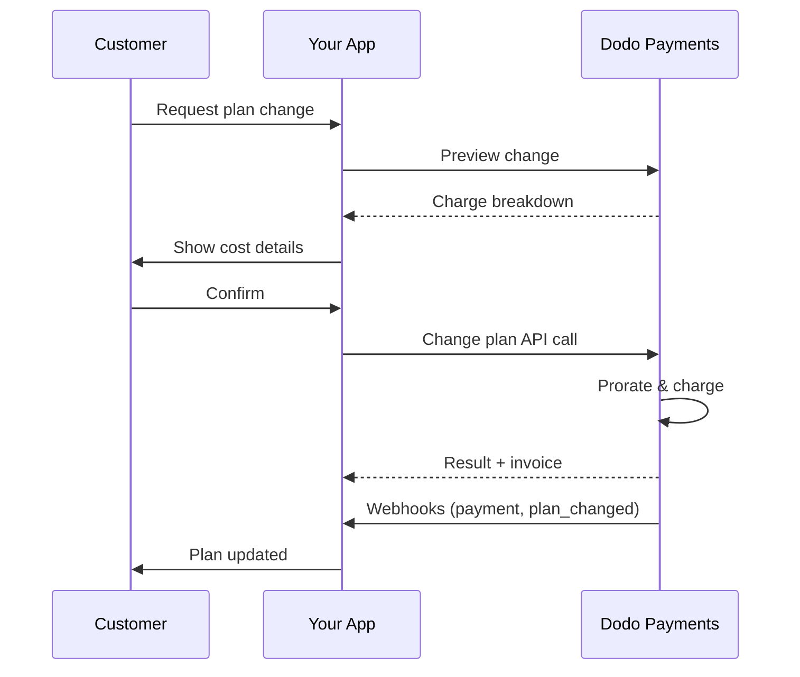
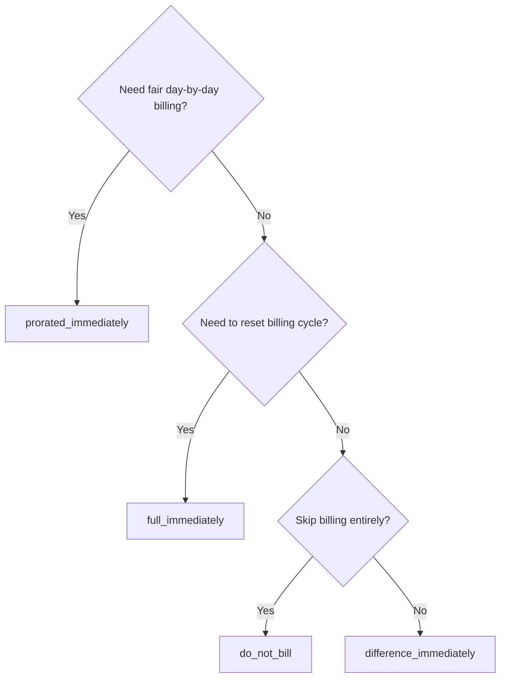
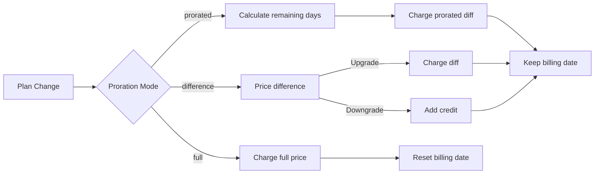

<CardGroup cols={3}>
<Card title="Change Plan API" icon="code" href="/api-reference/subscriptions/change-plan">
  Full API docs for updating subscriptions.
</Card>
<Card title="Plan Change Preview" icon="eye" href="/api-reference/subscriptions/preview-change-plan">
  See charge amounts before changing plans.
</Card>
<Card title="Integration Guide" icon="book" href="/developer-resources/subscription-integration-guide">
  Step-by-step subscription setup.
</Card>
</CardGroup>

## What is a subscription upgrade or downgrade?

Changing plans lets you move a customer between subscription tiers or quantities. Use it to:
- Align pricing with usage or features
- Move from monthly to annual (or vice versa)
- Adjust quantity for seat-based products

<Info>
Plan changes can trigger an immediate charge depending on the proration mode you choose.
</Info>

## When to use plan changes

- Upgrade when a customer needs more features, usage, or seats
- Downgrade when usage decreases
- Migrate users to a new product or price without cancelling their subscription

## Plan Change Flow



## Prerequisites

Before implementing subscription plan changes, ensure you have:

- A Dodo Payments merchant account with active subscription products
- API credentials (API key and webhook secret key) from the dashboard
- An existing active subscription to modify
- Webhook endpoint configured to handle subscription events

<Info>
For detailed setup instructions, see our [Integration Guide](/developer-resources/integration-guide#dashboard-setup).
</Info>

## Step-by-Step Implementation Guide

Follow this comprehensive guide to implement subscription plan changes in your application:

<Steps>
<Step title="Understand Plan Change Requirements">
Before implementing, determine:
- Which subscription products can be changed to which others
- What proration mode fits your business model
- How to handle failed plan changes gracefully
- Which webhook events to track for state management

<Tip>
Test plan changes thoroughly in test mode before implementing in production.
</Tip>
</Step>

<Step title="Choose Your Proration Strategy">
Select the billing approach that aligns with your business needs:

<Tabs>
<Tab title="prorated_immediately">
Best for: SaaS applications wanting to charge fairly for unused time
- Calculates exact prorated amount based on remaining cycle time
- Charges a prorated amount based on unused time remaining in the cycle
- Provides transparent billing to customers
</Tab>

<Tab title="difference_immediately">
Best for: Clear upgrade/downgrade scenarios
- Upgrade: Charge immediate difference (e.g., $30→$80 = charge $50)
- Downgrade: Credit remaining value for future renewals
- Simplifies billing logic and customer communication
</Tab>

<Tab title="full_immediately">
Best for: When you want to reset the billing cycle
- Charges full amount of new plan immediately
- Ignores remaining time from old plan
- Useful for annual to monthly transitions
</Tab>

<Tab title="do_not_bill">
Best for: Free migrations, courtesy switches, or absorbing cost differences
- No charges or credits calculated
- Customer moves to the new plan immediately without any billing adjustment
- Billing cycle remains unchanged
</Tab>
</Tabs>
</Step>

<Step title="Implement the Change Plan API">
Use the Change Plan API to modify subscription details:

<ParamField path="subscription_id" type="string" required>
The ID of the active subscription to modify.
</ParamField>

<ParamField path="product_id" type="string" required>
The new product ID to change the subscription to.
</ParamField>

<ParamField path="quantity" type="integer" default="1">
Number of units for the new plan (for seat-based products).
</ParamField>

<ParamField path="proration_billing_mode" type="string" required>
How to handle immediate billing: `prorated_immediately`, `full_immediately`, `difference_immediately`, or `do_not_bill`.
</ParamField>

<ParamField path="addons" type="array">
Optional addons for the new plan. Leaving this empty removes any existing addons.
</ParamField>

<ParamField path="on_payment_failure" type="string">
Controls behavior when the plan change payment fails:
- `prevent_change`: Keep subscription on current plan until payment succeeds
- `apply_change` (default): Apply plan change immediately regardless of payment outcome

If not specified, uses the business-level default setting.
</ParamField>

可选折扣码，可应用于新计划。如果提供，将验证并应用折扣到计划更改中。如果没有提供，而且订阅有现有的折扣且 `preserve_on_plan_change=true`，现有的折扣将被保留（如果适用于新的产品）。

何时应用计划更改：
- `immediately`（默认）：立即应用计划更改
- `next_billing_date`：安排在下一个账单日期更改。客户在账单周期结束前保留其现有计划。

在降级时使用 `next_billing_date`，以便客户在账单周期结束前保留他们的现有计划权益。

设置 webhook 处理以跟踪计划更改的结果：

- `subscription.active`：计划更改成功，订阅更新
- `subscription.plan_changed`：订阅计划更改（升级/降级/附加更新）
- `subscription.on_hold`：计划更改收费失败，订阅暂停
- `payment.succeeded`：计划更改立即收费成功
- `payment.failed`：立即收费失败

始终验证 webhook 签名，并实现幂等事件处理。

根据 webhook 事件更新您的应用程序：
- 根据新计划授予/撤销功能
- 更新客户仪表板以显示新计划详细信息
- 发送有关计划更改的确认邮件
- 为审核目的记录账单更改

彻底测试您的实现：
- 测试所有不同比例模式下的各种方案
- 验证 webhook 处理是否正常工作
- 监控计划更改成功率
- 设置计划更改失败的警报

您的订阅计划更改实现现在已准备好用于生产。

## 预览计划更改

在承诺计划更改之前，使用预览 API 呈现客户将被收取的确切金额：


```javascript
const preview = await client.subscriptions.previewChangePlan('sub_123', {
  product_id: 'prod_pro',
  quantity: 1,
  proration_billing_mode: 'prorated_immediately'
});

// Show customer the charge before confirming
console.log('Immediate charge:', preview.immediate_charge.summary);
console.log('New plan details:', preview.new_plan);
```


```python
preview = client.subscriptions.preview_change_plan(
    subscription_id="sub_123",
    product_id="prod_pro",
    quantity=1,
    proration_billing_mode="prorated_immediately"
)

# Show customer the charge before confirming
print("Immediate charge:", preview.immediate_charge.summary)
print("New plan details:", preview.new_plan)
```


使用预览 API 构建确认对话框，让客户在确认计划更改之前查看确切的收费金额。

## 更改计划 API

使用更改计划 API 修改活动订阅的产品、数量和比例行为。

### 快速启动示例


    ```javascript
    import DodoPayments from 'dodopayments';

    const client = new DodoPayments({
      bearerToken: process.env.DODO_PAYMENTS_API_KEY,
      environment: 'test_mode', // defaults to 'live_mode'
    });

    async function changePlan() {
      const result = await client.subscriptions.changePlan('sub_123', {
        product_id: 'prod_new',
        quantity: 3,
        proration_billing_mode: 'prorated_immediately',
        on_payment_failure: 'prevent_change', // Optional: control behavior on payment failure
      });
      console.log(result.status, result.invoice_id, result.payment_id);
    }

    changePlan();
    ```


    ```python
    import os
    from dodopayments import DodoPayments

    client = DodoPayments(
        bearer_token=os.environ.get("DODO_PAYMENTS_API_KEY"),
        environment="test_mode",  # defaults to "live_mode"
    )

    result = client.subscriptions.change_plan(
        subscription_id="sub_123",
        product_id="prod_new",
        quantity=3,
        proration_billing_mode="prorated_immediately",
        on_payment_failure="prevent_change",  # Optional: control behavior on payment failure
    )
    print(result.status, result.get("invoice_id"), result.get("payment_id"))
    ```


    ```go
    package main

    import (
      "context"
      "fmt"
      "github.com/dodopayments/dodopayments-go"
      "github.com/dodopayments/dodopayments-go/option"
    )

    func main() {
      client := dodopayments.NewClient(option.WithBearerToken("YOUR_TOKEN"))
      res, err := client.Subscriptions.ChangePlan(context.TODO(), dodopayments.SubscriptionChangePlanParams{
        SubscriptionID: dodopayments.F("sub_123"),
        ProductID:             dodopayments.F("prod_new"),
        Quantity:              dodopayments.F(int64(3)),
        ProrationBillingMode:  dodopayments.F(dodopayments.SubscriptionChangePlanParamsProrationBillingModeProratedImmediately),
        OnPaymentFailure:      dodopayments.F(dodopayments.OnPaymentFailurePreventChange), // Optional
      })
      if err != nil { panic(err) }
      fmt.Println(res.Status, res.InvoiceID, res.PaymentID)
    }
    ```


    ```bash
    curl -X POST "$DODO_API_BASE/subscriptions/sub_123/change-plan" \
      -H "Authorization: Bearer $DODO_PAYMENTS_API_KEY" \
      -H "Content-Type: application/json" \
      -d '{
        "product_id": "prod_new",
        "quantity": 3,
        "proration_billing_mode": "prorated_immediately",
        "on_payment_failure": "prevent_change"
      }'
    ```


```json Success
{
  "status": "processing",
  "subscription_id": "sub_123",
  "invoice_id": "inv_789",
  "payment_id": "pay_456",
  "proration_billing_mode": "prorated_immediately"
}
```

字段如 <code>invoice_id</code> 和 <code>payment_id</code> 仅在计划更改期间创建即时报价和/或发票时返回。始终依赖于 webhook 事件（例如 <code>payment.succeeded</code>、<code>subscription.plan_changed</code>），以确认结果。

如果即时收费失败，订阅可能会移动到 `subscription.on_hold`，直到付款成功。

## 管理附加组件

更改订阅计划时，还可以修改附加组件：

```javascript
// Add addons to the new plan
await client.subscriptions.changePlan('sub_123', {
  product_id: 'prod_new',
  quantity: 1,
  proration_billing_mode: 'difference_immediately',
  addons: [
    { addon_id: 'addon_123', quantity: 2 }
  ]
});

// Remove all existing addons
await client.subscriptions.changePlan('sub_123', {
  product_id: 'prod_new',
  quantity: 1,
  proration_billing_mode: 'difference_immediately',
  addons: [] // Empty array removes all existing addons
});
```

附加组件包含在比例计算中，并将根据所选比例模式进行扣费。

## 应用折扣码

在更改订阅计划时，您可以应用折扣码。这对升级或迁移提供促销定价非常有用。


```javascript
// Apply a discount code during plan change
await client.subscriptions.changePlan('sub_123', {
  product_id: 'prod_pro',
  quantity: 1,
  proration_billing_mode: 'prorated_immediately',
  discount_code: 'UPGRADE20'
});
```


```python
# Apply a discount code during plan change
client.subscriptions.change_plan(
    subscription_id="sub_123",
    product_id="prod_pro",
    quantity=1,
    proration_billing_mode="prorated_immediately",
    discount_code="UPGRADE20"
)
```


```bash
curl -X POST "$DODO_API_BASE/subscriptions/sub_123/change-plan" \
  -H "Authorization: Bearer $DODO_PAYMENTS_API_KEY" \
  -H "Content-Type: application/json" \
  -d '{
    "product_id": "prod_pro",
    "quantity": 1,
    "proration_billing_mode": "prorated_immediately",
    "discount_code": "UPGRADE20"
  }'
```


### 计划更改时的折扣行为

| 情景 | 行为 |
|----------|----------|
| `discount_code` 提供 | 验证并将折扣应用于新计划。 |
| 未提供代码，现有折扣与 `preserve_on_plan_change=true` | 如果适用于新产品，则现有折扣自动保留。 |
| 未提供代码，没有可保留的折扣 | 新计划不适用折扣。 |

使用 [预览计划更改 API](/api-reference/subscriptions/preview-change-plan) 与 `discount_code` 显示客户在确认计划更改之前能准确节省多少费用。

## 比例模式

选择在更改计划时如何向客户收费：

#### `prorated_immediately`
- 在当前周期内对部分差额收费
- 如果处于试用中，立即收费并切换到新计划
- 降级：可能生成基于比例的抵扣，将应用于未来续订

#### `full_immediately`
- 立即对新计划的全额收费
- 忽略旧计划的剩余时间

使用 <code>difference_immediately</code> 进行降级所产生的信用额度是订阅范围的，与 <a href="/features/credit-based-billing">基于信用的账单</a>权利是不同的。它们将在同一订阅的未来续订中自动应用，不可在订阅之间转移。

#### `difference_immediately`
- 升级：立即收取新旧计划之间的价格差
- 降级：将余额作为内部信用额度加入订阅，并在续订时自动应用

#### `do_not_bill`
- 不计算费用或信用
- 客户立即切换到新计划，无需进行任何账单调整
- 账单周期保持不变
- 最适用于礼貌迁移、免费计划切换或吸收成本差异

| 功能 | `prorated_immediately` | `difference_immediately` | `full_immediately` | `do_not_bill` |
|---------|----------------------|------------------------|-------------------|--------------|
| **升级收费** | 剩余天数的比例差额 | 计划之间的全额差额 | 新计划的全额价格 | 无费用 |
| **降级信用** | 剩余天数的比例信用 | 全额差额作为信用 | 无信用 | 无信用 |
| **账单周期** | 不变 | 不变 | 重置为今天 | 不变 |
| **试用行为** | 结束试用，立即收费 | 结束试用，立即收费 | 结束试用，收取全额费用 | 结束试用，无收费 |
| **最佳适用** | 公平的基于时间的计费 | 简单的升级/降级数学 | 重置账单周期 | 免费迁移或礼貌切换 |
| **复杂度** | 中等（天数计算） | 低（简单减法） | 低（全额收费） | 无 |




### 示例场景

一致性使用这些规范数字：
- 当前计划：**基础版**，**$30/月**
- 升级目标：**专业版**，**$80/月**
- 降级目标（从专业版）：**入门版**，**$20/月**
- 账单周期：**30天**，开始于**1月1日**
- 计划变更发生在**1月16日**（剩余15天，已使用15天）


    ```
    Step 1: Calculate unused credit from current plan
      Unused days = 15 out of 30 days
      Credit = $30 × (15/30) = $15.00

    Step 2: Calculate prorated cost of new plan
      Remaining days = 15 out of 30 days
      New plan cost = $80 × (15/30) = $40.00

    Step 3: Calculate immediate charge
      Charge = New plan cost − Credit
      Charge = $40.00 − $15.00 = $25.00

    → Customer pays $25.00 now
    → Next renewal (Feb 1): $80.00/month
    ```

    ```javascript
    await client.subscriptions.changePlan('sub_123', {
      product_id: 'prod_pro',
      quantity: 1,
      proration_billing_mode: 'prorated_immediately'
    })
    ```


    ```
    Step 1: Calculate unused credit from current plan
      Unused days = 15 out of 30 days
      Credit = $80 × (15/30) = $40.00

    Step 2: Calculate prorated cost of new plan
      Remaining days = 15 out of 30 days
      New plan cost = $20 × (15/30) = $10.00

    Step 3: Calculate credit balance
      Credit = $40.00 − $10.00 = $30.00

    → No charge — $30.00 credit added to subscription
    → Credit auto-applies to future renewals
    → Next renewal (Feb 1): $20.00 − $30.00 credit = $0.00
    → Following renewal (Mar 1): $20.00 − $10.00 remaining credit = $10.00
    ```

    ```javascript
    await client.subscriptions.changePlan('sub_123', {
      product_id: 'prod_starter',
      quantity: 1,
      proration_billing_mode: 'prorated_immediately'
    })
    ```


    ```
    Immediate charge = New plan price − Old plan price
                     = $80 − $30
                     = $50.00

    → Customer pays $50.00 now (regardless of cycle position)
    → Next renewal (Feb 1): $80.00/month
    ```

    ```javascript
    await client.subscriptions.changePlan('sub_123', {
      product_id: 'prod_pro',
      quantity: 1,
      proration_billing_mode: 'difference_immediately'
    })
    ```


    ```
    Credit = Old plan price − New plan price
           = $80 − $20
           = $60.00

    → No charge — $60.00 credit added to subscription
    → Credit auto-applies to future renewals
    → Next renewal: $20.00 − $20.00 (from credit) = $0.00
    → Following renewal: $20.00 − $20.00 (from credit) = $0.00
    → Third renewal: $20.00 − $20.00 (from remaining credit) = $0.00
    ```

    ```javascript
    await client.subscriptions.changePlan('sub_123', {
      product_id: 'prod_starter',
      quantity: 1,
      proration_billing_mode: 'difference_immediately'
    })
    ```


    ```
    Immediate charge = Full new plan price = $80.00

    → Customer pays $80.00 now
    → No credit for unused time on old plan
    → Billing cycle resets to today (January 16)
    → Next renewal: February 16 at $80.00/month
    ```

    ```javascript
    await client.subscriptions.changePlan('sub_123', {
      product_id: 'prod_pro',
      quantity: 1,
      proration_billing_mode: 'full_immediately'
    })
    ```


    ```
    Current: Basic plan ($30/month), no add-ons
    New: Pro plan ($80/month) + Extra Seats add-on ($10/seat × 3 seats = $30/month)
    Change on day 16 of 30 (15 days remaining)

    Step 1: Credit from current plan
      Credit = $30 × (15/30) = $15.00

    Step 2: Prorated cost of new plan + add-ons
      New plan = $80 × (15/30) = $40.00
      Add-ons = $30 × (15/30) = $15.00
      Total new = $55.00

    Step 3: Immediate charge
      Charge = $55.00 − $15.00 = $40.00

    → Customer pays $40.00 now
    → Next renewal: $80.00 + $30.00 = $110.00/month
    ```

    ```javascript
    await client.subscriptions.changePlan('sub_123', {
      product_id: 'prod_pro',
      quantity: 1,
      proration_billing_mode: 'prorated_immediately',
      addons: [
        { addon_id: 'addon_seats', quantity: 3 }
      ]
    })
    ```


### 每种模式如何处理账单



选择 `prorated_immediately` 进行公平时间记账；选择 `full_immediately` 以重启账单；使用 `difference_immediately` 进行简单升级并在降级时自动抵扣信用；或使用 `do_not_bill` 切换计划，无需任何账单调整。

## 处理付款失败

使用 `on_payment_failure` 参数控制计划更改付款失败时的处理方式。

### 付款失败模式

行为：在付款成功前，让订阅保持在当前计划。

- 计划更改标记为“待定”
- 客户保留其当前计划的访问权限
- 仅在付款成功后，订阅才会移动到 `active` 状态
- 当您希望在提供升级功能前确保付款时很有用

```javascript
await client.subscriptions.changePlan('sub_123', {
  product_id: 'prod_pro',
  quantity: 1,
  proration_billing_mode: 'prorated_immediately',
  on_payment_failure: 'prevent_change'
});
```


行为：无论付款结果如何，立即应用计划更改。

- 即使付款失败，也会应用计划更改
- 客户立即获得新计划的访问权限
- 如果付款失败，订阅可能移动到 `on_hold`
- 适用于非关键升级或信任客户的情况下

```javascript
await client.subscriptions.changePlan('sub_123', {
  product_id: 'prod_pro',
  quantity: 1,
  proration_billing_mode: 'prorated_immediately',
  on_payment_failure: 'apply_change' // This is the default
});
```


如果未指定，`on_payment_failure` 参数将使用您在仪表板上配置的业务级别默认设置。

### 何时使用每种模式

| 情景 | 推荐模式 | 原因 |
|----------|------------------|--------|
| 升级至高级功能 | `prevent_change` | 确保付款后提供访问权限 |
| 数量增加（增加席位数） | `prevent_change` | 防止在未付款的情况下使用 |
| 降级计划 | `apply_change` | 客户正在减少开支 |
| 受信任的企业客户 | `apply_change` | 低风险不付款 |
| 试用到付费转换 | `prevent_change` | 关键付款时刻 |

## 处理 webhooks

通过 webhooks 跟踪订阅状态，以确认计划更改和付款。

### 要处理的事件类型
- `subscription.active`：订阅激活
- `subscription.plan_changed`：订阅计划更改（升级/降级/附加更改）
- `subscription.on_hold`：扣费失败，订阅暂停
- `subscription.renewed`：续订成功
- `payment.succeeded`：计划更改或续订付款成功
- `payment.failed`：付款失败

我们建议通过订阅事件驱动业务逻辑，并使用付款事件进行确认和对账。

### 验证签名和处理意图


    ```javascript
    import { NextRequest, NextResponse } from 'next/server';
    
    export async function POST(req) {
      const webhookId = req.headers.get('webhook-id');
      const webhookSignature = req.headers.get('webhook-signature');
      const webhookTimestamp = req.headers.get('webhook-timestamp');
      const secret = process.env.DODO_WEBHOOK_SECRET;
    
      const payload = await req.text();
      // verifySignature is a placeholder – in production, use a Standard Webhooks library
      const { valid, event } = await verifySignature(
        payload,
        { id: webhookId, signature: webhookSignature, timestamp: webhookTimestamp },
        secret
      );
      if (!valid) return NextResponse.json({ error: 'Invalid signature' }, { status: 400 });
    
      switch (event.type) {
        case 'subscription.active':
          // mark subscription active in your DB
          break;
        case 'subscription.plan_changed':
          // refresh entitlements and reflect the new plan in your UI
          break;
        case 'subscription.on_hold':
          // notify user to update payment method
          break;
        case 'subscription.renewed':
          // extend access window
          break;
        case 'payment.succeeded':
          // reconcile payment for plan change
          break;
        case 'payment.failed':
          // log and alert
          break;
        default:
          // ignore unknown events
          break;
      }
    
      return NextResponse.json({ received: true });
    }
    ```


    ```javascript
    import express from 'express';
    
    const app = express();
    app.post('/webhooks/dodo', express.raw({ type: 'application/json' }), async (req, res) => {
      const webhookId = req.header('webhook-id');
      const webhookSignature = req.header('webhook-signature');
      const webhookTimestamp = req.header('webhook-timestamp');
      const secret = process.env.DODO_WEBHOOK_SECRET;
      const payload = req.body.toString('utf8');
    
      const { valid, event } = await verifySignature(
        payload,
        { id: webhookId, signature: webhookSignature, timestamp: webhookTimestamp },
        secret
      );
      if (!valid) return res.status(400).send('Invalid signature');
    
      // handle events like above
      res.json({ received: true });
    });
    
    app.listen(3000);
    ```


有关详细的负载架构，请参阅 <a href="/developer-resources/webhooks/intents/subscription">订阅 webhook 负载</a> 和 <a href="/developer-resources/webhooks/intents/payment">付款 webhook 负载</a>。

## 最佳实践

遵循这些建议以实现可靠的订阅计划更改：

### 计划更改策略
- **彻底测试**：始终在测试模式下测试计划更改，然后再投入生产
- **小心选择比例**：选择与您的商业模式一致的比例模式
- **优雅地处理失败**：实施正确的错误处理和重试逻辑
- **监控成功率**：跟踪计划更改成功/失败率并调查问题

### Webhook 实现
- **验证签名**：始终验证 webhook 签名以确保真实性
- **实现幂等性**：优雅地处理重复的 webhook 事件
- **异步处理**：不要用重型操作阻塞 webhook 响应
- **记录一切**：维护详细的日志用于调试和审核目的

### 用户体验
- **清晰沟通**：通知客户有关账单更改和时间
- **提供确认**：为成功的计划更改发送电子邮件确认
- **处理边界案例**：考虑试用期、比例和付款失败
- **立即更新 UI**：在您的应用程序界面中反映计划更改

## 常见问题及解决方案

解决订阅计划更改中遇到的常见问题：


**常见原因**：
- Webhook 处理失败或延迟
- 收到 webhook 后应用程序状态未更新
- 状态更新期间的数据库事务问题

**解决方案**：
- 实施稳健的 webhook 处理与重试逻辑
- 对状态更新使用幂等操作
- 添加监控以检测和提醒遗漏的 webhook 事件
- 验证 webhook 终端是否可访问并正确响应


**常见原因**：
- 比例模式期望：降级使用 `difference_immediately` 的完整计划价格差异抵免，而 `prorated_immediately` 创建基于周期内剩余时间的比例抵免
- 信用额度是特定于订阅的，不可在订阅之间转移
- 客户仪表板中不可见的信用余额

**解决方案**：
- 在降级时使用 `difference_immediately` 以获得自动抵免
- 向客户解释抵免适用于同一订阅的未来续订
- 实施客户门户以显示信用余额
- 检查下一个发票预览以查看已应用的抵免


**常见原因**：
- 错误的 webhook 密钥
- 在签名验证前修改了原始请求体
- 错误的签名验证算法

**解决方案**：
- 验证您使用的 `DODO_WEBHOOK_SECRET` 来自仪表板
- 在任何 JSON 解析中间件之前读取原始请求体
- 使用贵平台的标准 webhook 验证库
- 在开发环境中测试 webhook 签名验证


**常见原因**：
- 无效的订阅 ID 或产品 ID
- 订阅不在活动状态
- 缺少必需参数
- 产品不可用于计划更改

**解决方案**：
- 验证订阅是否存在且处于活动状态
- 检查产品 ID 是否有效且可用
- 确保提供所有必需参数
- 查看 API 文档中的参数要求


**常见原因**：
- 客户支付方式资金不足
- 支付方式过期或无效
- 银行拒绝交易
- 欺诈检测阻止收费

**解决方案**：
- 以适当方式处理 `payment.failed` webhook 事件
- 通知客户更新支付方式
- 为临时故障实施重试逻辑
- 考虑允许计划更改及失败的即刻收费


**发生了什么**：
当计划更改收费失败时，订阅将自动处于 `on_hold` 状态。订阅不会自动续订，直到支付方式更新。

**解决方案**：更新支付方式以重新激活订阅

要从失败计划更改后的 `on_hold` 状态重新激活订阅：

1. 使用更新支付方式 API **更新支付方式**
2. **自动收费创建**：API 自动创建未付款项的收费
3. **发票生成**：为费用生成发票
4. **付款处理**：使用新支付方式处理付款
5. **重新激活**：付款成功后，订阅重新激活至 `active` 状态


```javascript Node.js
// Reactivate subscription from on_hold after failed plan change
async function reactivateAfterFailedPlanChange(subscriptionId) {
  // Update payment method - automatically creates charge for remaining dues
  const response = await client.subscriptions.updatePaymentMethod(subscriptionId, {
    type: 'new',
    return_url: 'https://example.com/return'
  });
  
  if (response.payment_id) {
    console.log('Charge created for remaining dues:', response.payment_id);
    console.log('Payment link:', response.payment_link);
    
    // Redirect customer to payment_link to complete payment
    // Monitor webhooks for:
    // 1. payment.succeeded - charge succeeded
    // 2. subscription.active - subscription reactivated
  }
  
  return response;
}

// Or use existing payment method if available
async function reactivateWithExistingPaymentMethod(subscriptionId, paymentMethodId) {
  const response = await client.subscriptions.updatePaymentMethod(subscriptionId, {
    type: 'existing',
    payment_method_id: paymentMethodId
  });
  
  // Monitor webhooks for payment.succeeded and subscription.active
  return response;
}
```

```python Python
# Reactivate subscription from on_hold after failed plan change
def reactivate_after_failed_plan_change(subscription_id):
    # Update payment method - automatically creates charge for remaining dues
    response = client.subscriptions.update_payment_method(
        subscription_id=subscription_id,
        type="new",
        return_url="https://example.com/return"
    )
    
    if response.payment_id:
        print("Charge created for remaining dues:", response.payment_id)
        print("Payment link:", response.payment_link)
        
        # Redirect customer to payment_link to complete payment
        # Monitor webhooks for:
        # 1. payment.succeeded - charge succeeded
        # 2. subscription.active - subscription reactivated
    
    return response

# Or use existing payment method if available
def reactivate_with_existing_payment_method(subscription_id, payment_method_id):
    response = client.subscriptions.update_payment_method(
        subscription_id=subscription_id,
        type="existing",
        payment_method_id=payment_method_id
    )
    
    # Monitor webhooks for payment.succeeded and subscription.active
    return response
```


**需监控的 webhook 事件**：
- `subscription.on_hold`： 订阅搁置（计划变更收费失败时收到）
- `payment.succeeded`：更新支付方式后未付款项支付成功
- `subscription.active`：付款成功后订阅重新激活

**最佳实践**：
- 计划更改收费失败时立即通知客户
- 提供清晰的更新支付方式说明
- 监控 webhook 事件以跟踪重新激活状态
- 考虑为临时付款失败实施自动重试逻辑

查看完整的 API 文档以获取更新支付方法和重新激活订阅的信息。

## 测试您的实现

按照以下步骤进行全面测试您的订阅计划更改实现：

- 使用测试 API 密钥和测试产品
- 创建不同计划类型的测试订阅
- 配置测试 webhook 终端
- 设置监控和日志记录

- 测试 `prorated_immediately` 与不同账单周期位置
- 测试 `difference_immediately` 用于升级和降级
- 测试 `full_immediately` 以重置账单周期
- 测试 `do_not_bill` 用于无需收费/信用的计划切换
- 验证信用计算是否正确

- 验证接收到所有相关的 webhook 事件
- 测试 webhook 签名验证
- 优雅地处理重复的 webhook 事件
- 测试 webhook 处理失败场景

- 测试无效的订阅 ID
- 测试过期的支付方式
- 测试网络故障和超时
- 测试资金不足

- 为失败的计划更改设置警报
- 监控 webhook 处理时间
- 跟踪计划更改成功率
- 查看计划更改问题的客户支持票

## 错误处理

在您的实现中优雅地处理常见 API 错误：

### HTTP 状态代码

计划更改请求已成功处理。订阅正在更新并开始付款处理。

请求参数无效。检查是否提供了所有必填字段并格式正确。

API 密钥无效或缺失。验证您的 `DODO_PAYMENTS_API_KEY` 是否正确且具有适当权限。

未找到订阅 ID 或不属于您的帐户。

无法更改订阅（例如，已取消，产品不可用等）。

发生服务器错误。稍作延迟后重试请求。

### 错误响应格式

```json
{
  "error": {
    "code": "subscription_not_found",
    "message": "The subscription with ID 'sub_123' was not found",
    "details": {
      "subscription_id": "sub_123"
    }
  }
}
```

## 下一步

- 查看 <a href="/api-reference/subscriptions/change-plan">更改计划 API</a>
- 探索 <a href="/features/credit-based-billing">基于信用的账单</a>
- 对 `subscription.on_hold` 实施警报
- 查看我们的 <a href="/developer-resources/webhooks">Webhook 集成指南</a>
