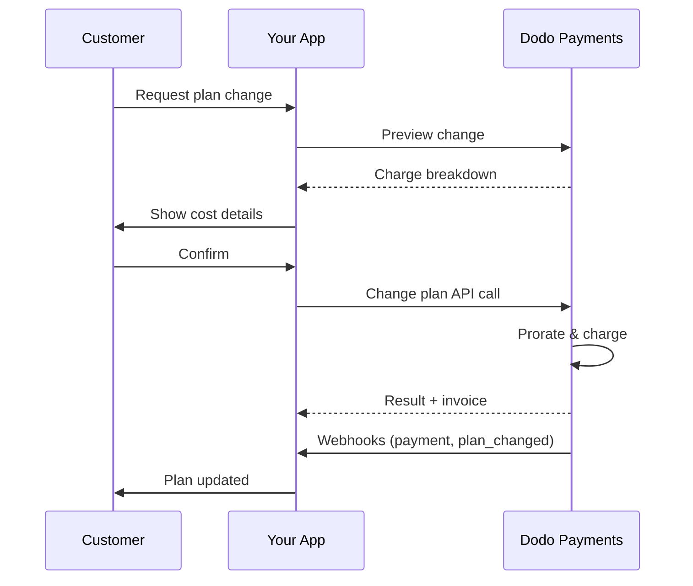
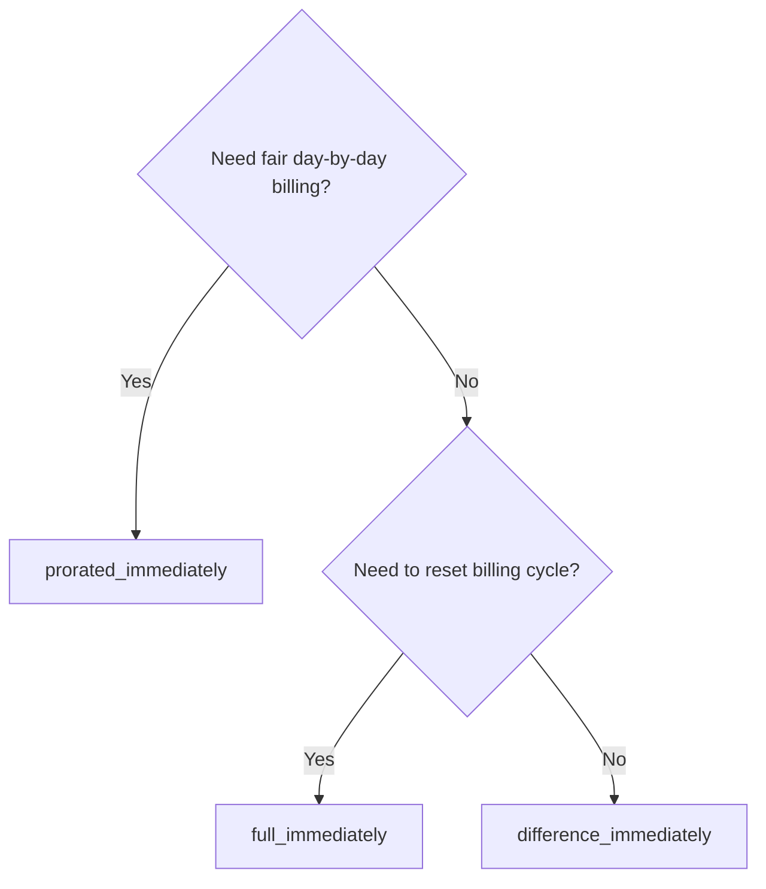
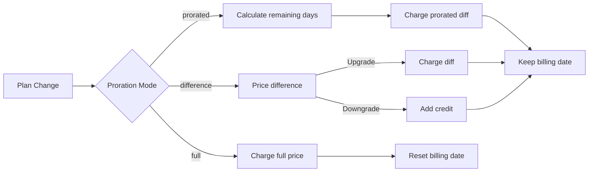

<CardGroup cols={3}>
<Card title="Change Plan API" icon="code" href="/api-reference/subscriptions/change-plan">
  Full API docs for updating subscriptions.
</Card>
<Card title="Plan Change Preview" icon="eye" href="/api-reference/subscriptions/preview-change-plan">
  See charge amounts before changing plans.
</Card>
<Card title="Integration Guide" icon="book" href="/developer-resources/subscription-integration-guide">
  Step-by-step subscription setup.
</Card>
</CardGroup>

## What is a subscription upgrade or downgrade?

Changing plans lets you move a customer between subscription tiers or quantities. Use it to:
- Align pricing with usage or features
- Move from monthly to annual (or vice versa)
- Adjust quantity for seat-based products

<Info>
Plan changes can trigger an immediate charge depending on the proration mode you choose.
</Info>

## When to use plan changes

- Upgrade when a customer needs more features, usage, or seats
- Downgrade when usage decreases
- Migrate users to a new product or price without cancelling their subscription

## Plan Change Flow



## Prerequisites

Before implementing subscription plan changes, ensure you have:

- A Dodo Payments merchant account with active subscription products
- API credentials (API key and webhook secret key) from the dashboard
- An existing active subscription to modify
- Webhook endpoint configured to handle subscription events

<Info>
For detailed setup instructions, see our [Integration Guide](/developer-resources/integration-guide#dashboard-setup).
</Info>

## Step-by-Step Implementation Guide

Follow this comprehensive guide to implement subscription plan changes in your application:

<Steps>
<Step title="Understand Plan Change Requirements">
Before implementing, determine:
- Which subscription products can be changed to which others
- What proration mode fits your business model
- How to handle failed plan changes gracefully
- Which webhook events to track for state management

<Tip>
Test plan changes thoroughly in test mode before implementing in production.
</Tip>
</Step>

<Step title="Choose Your Proration Strategy">
Select the billing approach that aligns with your business needs:

<Tabs>
<Tab title="prorated_immediately">
Best for: SaaS applications wanting to charge fairly for unused time
- Calculates exact prorated amount based on remaining cycle time
- Charges a prorated amount based on unused time remaining in the cycle
- Provides transparent billing to customers
</Tab>

<Tab title="difference_immediately">
Best for: Clear upgrade/downgrade scenarios
- Upgrade: Charge immediate difference (e.g., $30→$80 = charge $50)
- Downgrade: Credit remaining value for future renewals
- Simplifies billing logic and customer communication
</Tab>

<Tab title="full_immediately">
Best for: When you want to reset the billing cycle
- Charges full amount of new plan immediately
- Ignores remaining time from old plan
- Useful for annual to monthly transitions
</Tab>
</Tabs>
</Step>

<Step title="Implement the Change Plan API">
Use the Change Plan API to modify subscription details:

<ParamField path="subscription_id" type="string" required>
The ID of the active subscription to modify.
</ParamField>

<ParamField path="product_id" type="string" required>
The new product ID to change the subscription to.
</ParamField>

<ParamField path="quantity" type="integer" default="1">
Number of units for the new plan (for seat-based products).
</ParamField>

<ParamField path="proration_billing_mode" type="string" required>
How to handle immediate billing: `prorated_immediately`, `full_immediately`, or `difference_immediately`.
</ParamField>

<ParamField path="addons" type="array">
Optional addons for the new plan. Leaving this empty removes any existing addons.
</ParamField>

<ParamField path="on_payment_failure" type="string">
Controls behavior when the plan change payment fails:
- `prevent_change`: Keep subscription on current plan until payment succeeds
- `apply_change` (default): Apply plan change immediately regardless of payment outcome

如果未指定，使用业务级默认设置。
</ParamField>

{/* LOCKED_PATTERN_654ba106ce306d93c6eba72bfc37d363 */}
可选折扣代码用于应用于新计划更改。如果提供，将验证并应用折扣到计划更改。如果未提供且订阅已有的折扣与`preserve_on_plan_change=true`，则保留现有折扣（如果适用于新产品）。
</ParamField>
</Step>

<Step title="Handle Webhook Events">
设置 webhook 处理以跟踪计划变更结果：

- `subscription.active`：计划变更成功，订阅已更新
- `subscription.plan_changed`：订阅计划已更改（升级/降级/附加更新）
- `subscription.on_hold`：计划变更收费失败，订阅暂停
- `payment.succeeded`：计划变更的即时收费成功
- `payment.failed`：即时收费失败

<Warning>
始终验证 webhook 签名并实施幂等事件处理。
</Warning>
</Step>

<Step title="Update Your Application State">
根据 webhook 事件更新您的应用程序：
- 根据新计划授予/撤销功能
- 使用新计划详细信息更新客户仪表盘
- 发送有关计划变更的确认邮件
- 记录计费变更以供审计
</Step>

<Step title="Test and Monitor">
彻底测试您的实现：
- 使用不同场景测试所有比例模式
- 验证 webhook 处理是否正常
- 监控计划变更成功率
- 为计划变更失败设置警报

<Check>
您的订阅计划变更实现现在已准备好用于生产使用。
</Check>
</Step>
</Steps>

## 预览计划变更

在计划更改之前，使用预览 API 向客户展示他们将被收取的确切费用：

<Tabs>
<Tab title="Node.js SDK">

```javascript
const preview = await client.subscriptions.previewChangePlan('sub_123', {
  product_id: 'prod_pro',
  quantity: 1,
  proration_billing_mode: 'prorated_immediately'
});

// Show customer the charge before confirming
console.log('Immediate charge:', preview.immediate_charge.summary);
console.log('New plan details:', preview.new_plan);
```

</Tab>

<Tab title="Python SDK">

```python
preview = client.subscriptions.preview_change_plan(
    subscription_id="sub_123",
    product_id="prod_pro",
    quantity=1,
    proration_billing_mode="prorated_immediately"
)

# Show customer the charge before confirming
print("Immediate charge:", preview.immediate_charge.summary)
print("New plan details:", preview.new_plan)
```

</Tab>
</Tabs>

<Tip>
使用预览 API 构建确认对话框，在客户确认计划更改之前显示他们将被收取的确切金额。
</Tip>

## 更改计划 API

使用更改计划 API 修改活动订阅的产品、数量和比例行为。

### 快速入门示例

<Tabs>
  <Tab title="Node.js SDK">

    ```javascript
    import DodoPayments from 'dodopayments';

    const client = new DodoPayments({
      bearerToken: process.env.DODO_PAYMENTS_API_KEY,
      environment: 'test_mode', // defaults to 'live_mode'
    });

    async function changePlan() {
      const result = await client.subscriptions.changePlan('sub_123', {
        product_id: 'prod_new',
        quantity: 3,
        proration_billing_mode: 'prorated_immediately',
        on_payment_failure: 'prevent_change', // Optional: control behavior on payment failure
      });
      console.log(result.status, result.invoice_id, result.payment_id);
    }

    changePlan();
    ```

  </Tab>
  <Tab title="Python SDK">

    ```python
    import os
    from dodopayments import DodoPayments

    client = DodoPayments(
        bearer_token=os.environ.get("DODO_PAYMENTS_API_KEY"),
        environment="test_mode",  # defaults to "live_mode"
    )

    result = client.subscriptions.change_plan(
        subscription_id="sub_123",
        product_id="prod_new",
        quantity=3,
        proration_billing_mode="prorated_immediately",
        on_payment_failure="prevent_change",  # Optional: control behavior on payment failure
    )
    print(result.status, result.get("invoice_id"), result.get("payment_id"))
    ```

  </Tab>
  <Tab title="Go SDK">

    ```go
    package main

    import (
      "context"
      "fmt"
      "github.com/dodopayments/dodopayments-go"
      "github.com/dodopayments/dodopayments-go/option"
    )

    func main() {
      client := dodopayments.NewClient(option.WithBearerToken("YOUR_TOKEN"))
      res, err := client.Subscriptions.ChangePlan(context.TODO(), dodopayments.SubscriptionChangePlanParams{
        SubscriptionID: dodopayments.F("sub_123"),
        ProductID:             dodopayments.F("prod_new"),
        Quantity:              dodopayments.F(int64(3)),
        ProrationBillingMode:  dodopayments.F(dodopayments.SubscriptionChangePlanParamsProrationBillingModeProratedImmediately),
        OnPaymentFailure:      dodopayments.F(dodopayments.OnPaymentFailurePreventChange), // Optional
      })
      if err != nil { panic(err) }
      fmt.Println(res.Status, res.InvoiceID, res.PaymentID)
    }
    ```

  </Tab>
  <Tab title="HTTP">

    ```bash
    curl -X POST "$DODO_API_BASE/subscriptions/sub_123/change-plan" \
      -H "Authorization: Bearer $DODO_PAYMENTS_API_KEY" \
      -H "Content-Type: application/json" \
      -d '{
        "product_id": "prod_new",
        "quantity": 3,
        "proration_billing_mode": "prorated_immediately",
        "on_payment_failure": "prevent_change"
      }'
    ```

  </Tab>
</Tabs>

```json Success
{
  "status": "processing",
  "subscription_id": "sub_123",
  "invoice_id": "inv_789",
  "payment_id": "pay_456",
  "proration_billing_mode": "prorated_immediately"
}
```

<Note>
诸如 <code>invoice_id</code> 和 <code>payment_id</code> 之类的字段仅在计划更改期间创建即时费用和/或发票时返回。始终依靠 webhook 事件（例如，<code>payment.succeeded</code>, <code>subscription.plan_changed</code>）确认结果。
</Note>

<Warning>
如果即时收费失败，订阅可能会转为`subscription.on_hold`状态，直到付款成功。
</Warning>

## 管理附加项

更改订阅计划时，您还可以修改附加项：

```javascript
// Add addons to the new plan
await client.subscriptions.changePlan('sub_123', {
  product_id: 'prod_new',
  quantity: 1,
  proration_billing_mode: 'difference_immediately',
  addons: [
    { addon_id: 'addon_123', quantity: 2 }
  ]
});

// Remove all existing addons
await client.subscriptions.changePlan('sub_123', {
  product_id: 'prod_new',
  quantity: 1,
  proration_billing_mode: 'difference_immediately',
  addons: [] // Empty array removes all existing addons
});
```

<Info>
附加项包含在比例计算中，将根据选择的比例模式收费。
</Info>

## 应用折扣代码

您可以在更改订阅计划时应用折扣代码。这对于升级或迁移提供促销定价非常有用。

<Tabs>
<Tab title="Node.js SDK">

```javascript
// Apply a discount code during plan change
await client.subscriptions.changePlan('sub_123', {
  product_id: 'prod_pro',
  quantity: 1,
  proration_billing_mode: 'prorated_immediately',
  discount_code: 'UPGRADE20'
});
```

</Tab>
<Tab title="Python SDK">

```python
# Apply a discount code during plan change
client.subscriptions.change_plan(
    subscription_id="sub_123",
    product_id="prod_pro",
    quantity=1,
    proration_billing_mode="prorated_immediately",
    discount_code="UPGRADE20"
)
```

</Tab>
<Tab title="HTTP">

```bash
curl -X POST "$DODO_API_BASE/subscriptions/sub_123/change-plan" \
  -H "Authorization: Bearer $DODO_PAYMENTS_API_KEY" \
  -H "Content-Type: application/json" \
  -d '{
    "product_id": "prod_pro",
    "quantity": 1,
    "proration_billing_mode": "prorated_immediately",
    "discount_code": "UPGRADE20"
  }'
```

</Tab>
</Tabs>

### 计划更改时的折扣行为

| 场景 | 行为 |
|----------|----------|
| 提供 `discount_code` | 验证并应用折扣到新计划。 |
| 未提供代码，已存在折扣与 `preserve_on_plan_change=true` | 如果适用于新产品，现有折扣将自动保留。 |
| 未提供代码，无法保留折扣 | 新计划未应用折扣。 |

<Tip>
使用 [预览计划变更 API](/api-reference/subscriptions/preview-change-plan) 和 `discount_code` 向客户显示在确认计划变更之前的确切节省金额。
</Tip>

## 比例模式

选择更改计划时如何向客户收费：

#### `prorated_immediately`
- 收取当前周期的部分差额
- 如果在试用中，立即收费并切换到新计划
- 降级：可能生成适用于未来续订的比例信用

#### `full_immediately`
- 立即收取新计划的全额费用
- 忽略旧计划的剩余时间

<Info>
使用 <code>difference_immediately</code> 降级所创建的信用仅限于订阅范围，与<a href="/features/credit-based-billing">基于信用的计费</a>权限不同。它们会自动应用于同一订阅的未来续订，不能在订阅之间转移。
</Info>

#### `difference_immediately`
- 升级：立即收取旧计划和新计划之间的价格差异
- 降级：将剩余价值作为内部信用添加到订阅并在续订时自动应用

| 功能 | `prorated_immediately` | `difference_immediately` | `full_immediately` |
|---------|----------------------|------------------------|-------------------|
| **升级费用** | 剩余天数的比例差额 | 计划之间的价格全额差 | 新计划的全额价格 |
| **降级信用** | 剩余天数的比例信用 | 全额价格差作为信用 | 无信用 |
| **计费周期** | 不变 | 不变 | 重置为今天 |
| **试用行为** | 结束试用，立即收费 | 结束试用，立即收费 | 结束试用，收取全额费用 |
| **最佳应用于** | 公平的基于时间的计费 | 简单的升级/降级计算 | 重置计费周期 |
| **复杂性** | 中等（天数计算） | 低（简单减法） | 低（全额收费） |



### 示例场景

始终如一地使用这些规范化数字：
- 当前计划: **基础** 每月 **$30**
- 升级目标: **专业** 每月 **$80**
- 降级目标（从专业降级）: **入门** 每月 **$20**
- 计费周期: **30天**，从 **1月1日** 开始
- 计划更改发生在 **1月16日**（还剩15天，已使用15天）

<AccordionGroup>
  <Accordion title="Upgrade: Basic ($30) → Pro ($80) with prorated_immediately">

    ```
    Step 1: Calculate unused credit from current plan
      Unused days = 15 out of 30 days
      Credit = $30 × (15/30) = $15.00

    Step 2: Calculate prorated cost of new plan
      Remaining days = 15 out of 30 days
      New plan cost = $80 × (15/30) = $40.00

    Step 3: Calculate immediate charge
      Charge = New plan cost − Credit
      Charge = $40.00 − $15.00 = $25.00

    → Customer pays $25.00 now
    → Next renewal (Feb 1): $80.00/month
    ```

    ```javascript
    await client.subscriptions.changePlan('sub_123', {
      product_id: 'prod_pro',
      quantity: 1,
      proration_billing_mode: 'prorated_immediately'
    })
    ```

  </Accordion>

  <Accordion title="Downgrade: Pro ($80) → Starter ($20) with prorated_immediately">

    ```
    Step 1: Calculate unused credit from current plan
      Unused days = 15 out of 30 days
      Credit = $80 × (15/30) = $40.00

    Step 2: Calculate prorated cost of new plan
      Remaining days = 15 out of 30 days
      New plan cost = $20 × (15/30) = $10.00

    Step 3: Calculate credit balance
      Credit = $40.00 − $10.00 = $30.00

    → No charge — $30.00 credit added to subscription
    → Credit auto-applies to future renewals
    → Next renewal (Feb 1): $20.00 − $30.00 credit = $0.00
    → Following renewal (Mar 1): $20.00 − $10.00 remaining credit = $10.00
    ```

    ```javascript
    await client.subscriptions.changePlan('sub_123', {
      product_id: 'prod_starter',
      quantity: 1,
      proration_billing_mode: 'prorated_immediately'
    })
    ```

  </Accordion>

  <Accordion title="Upgrade: Basic ($30) → Pro ($80) with difference_immediately">

    ```
    Immediate charge = New plan price − Old plan price
                     = $80 − $30
                     = $50.00

    → Customer pays $50.00 now (regardless of cycle position)
    → Next renewal (Feb 1): $80.00/month
    ```

    ```javascript
    await client.subscriptions.changePlan('sub_123', {
      product_id: 'prod_pro',
      quantity: 1,
      proration_billing_mode: 'difference_immediately'
    })
    ```

  </Accordion>

  <Accordion title="Downgrade: Pro ($80) → Starter ($20) with difference_immediately">

    ```
    Credit = Old plan price − New plan price
           = $80 − $20
           = $60.00

    → No charge — $60.00 credit added to subscription
    → Credit auto-applies to future renewals
    → Next renewal: $20.00 − $20.00 (from credit) = $0.00
    → Following renewal: $20.00 − $20.00 (from credit) = $0.00
    → Third renewal: $20.00 − $20.00 (from remaining credit) = $0.00
    ```

    ```javascript
    await client.subscriptions.changePlan('sub_123', {
      product_id: 'prod_starter',
      quantity: 1,
      proration_billing_mode: 'difference_immediately'
    })
    ```

  </Accordion>

  <Accordion title="Upgrade: Basic ($30) → Pro ($80) with full_immediately">

    ```
    Immediate charge = Full new plan price = $80.00

    → Customer pays $80.00 now
    → No credit for unused time on old plan
    → Billing cycle resets to today (January 16)
    → Next renewal: February 16 at $80.00/month
    ```

    ```javascript
    await client.subscriptions.changePlan('sub_123', {
      product_id: 'prod_pro',
      quantity: 1,
      proration_billing_mode: 'full_immediately'
    })
    ```

  </Accordion>

  <Accordion title="Mid-cycle upgrade with add-ons using prorated_immediately">

    ```
    Current: Basic plan ($30/month), no add-ons
    New: Pro plan ($80/month) + Extra Seats add-on ($10/seat × 3 seats = $30/month)
    Change on day 16 of 30 (15 days remaining)

    Step 1: Credit from current plan
      Credit = $30 × (15/30) = $15.00

    Step 2: Prorated cost of new plan + add-ons
      New plan = $80 × (15/30) = $40.00
      Add-ons = $30 × (15/30) = $15.00
      Total new = $55.00

    Step 3: Immediate charge
      Charge = $55.00 − $15.00 = $40.00

    → Customer pays $40.00 now
    → Next renewal: $80.00 + $30.00 = $110.00/month
    ```

    ```javascript
    await client.subscriptions.changePlan('sub_123', {
      product_id: 'prod_pro',
      quantity: 1,
      proration_billing_mode: 'prorated_immediately',
      addons: [
        { addon_id: 'addon_seats', quantity: 3 }
      ]
    })
    ```

  </Accordion>
</AccordionGroup>

### 每种模式如何处理计费



<Tip>
选择 `prorated_immediately` 进行公平的时间计算; 选择 `full_immediately` 重设计费; 使用 `difference_immediately` 简单升级和自动降级信用。
</Tip>

## 处理支付失败

使用 `on_payment_failure` 参数控制计划变更支付失败时的操作。

### 支付失败模式

<Tabs>
<Tab title="prevent_change (Recommended for critical upgrades)">
**行为**：保持订阅在当前计划，直到支付成功。

- 计划变更标记为“待处理”
- 客户保留其当前计划的访问权限
- 只有在付款成功后，订阅才会转为 `active` 状态
- 适用以确保在提供升级功能之前完成付款

```javascript
await client.subscriptions.changePlan('sub_123', {
  product_id: 'prod_pro',
  quantity: 1,
  proration_billing_mode: 'prorated_immediately',
  on_payment_failure: 'prevent_change'
});
```

</Tab>

<Tab title="apply_change (Default)">
**行为**：无论付款结果如何，立即应用计划变更。

- 即使支付失败，也会应用计划变更
- 客户立即获取新计划的访问权限
- 如果支付失败，订阅可能会转为 `on_hold`
- 适用于非关键性升级或对客户信任的情况

```javascript
await client.subscriptions.changePlan('sub_123', {
  product_id: 'prod_pro',
  quantity: 1,
  proration_billing_mode: 'prorated_immediately',
  on_payment_failure: 'apply_change' // This is the default
});
```

</Tab>
</Tabs>

<Info>
如果未指定，`on_payment_failure` 参数使用您在仪表盘中配置的业务级默认设置。
</Info>

### 何时使用每种模式

| 场景 | 推荐模式 | 原因 |
|----------|------------------|--------|
| 升级到高级功能 | `prevent_change` | 确保在授予访问权限之前支付 |
| 增加数量（更多席位） | `prevent_change` | 防止在支付前使用 |
| 降级计划 | `apply_change` | 客户在减少支出 |
| 可信企业客户 | `apply_change` | 非支付风险较低 |
| 从试用到付费转换 | `prevent_change` | 关键付款时刻 |

## 处理 webhooks

通过 webhooks 跟踪订阅状态以确认计划变更和付款。

### 处理的事件类型
- `subscription.active`：订阅已激活
- `subscription.plan_changed`：订阅计划已更改（升级/降级/附加更改）
- `subscription.on_hold`：收费失败，订阅暂停
- `subscription.renewed`：续订成功
- `payment.succeeded`：计划更改或续订的付款成功
- `payment.failed`：付款失败

<Info>
我们建议从订阅事件驱动业务逻辑，并使用付款事件进行确认和对账。
</Info>

### 验证签名和处理意图

<Tabs>
  <Tab title="Next.js Route Handler">

    ```javascript
    import { NextRequest, NextResponse } from 'next/server';
    
    export async function POST(req) {
      const webhookId = req.headers.get('webhook-id');
      const webhookSignature = req.headers.get('webhook-signature');
      const webhookTimestamp = req.headers.get('webhook-timestamp');
      const secret = process.env.DODO_WEBHOOK_SECRET;
    
      const payload = await req.text();
      // verifySignature is a placeholder – in production, use a Standard Webhooks library
      const { valid, event } = await verifySignature(
        payload,
        { id: webhookId, signature: webhookSignature, timestamp: webhookTimestamp },
        secret
      );
      if (!valid) return NextResponse.json({ error: 'Invalid signature' }, { status: 400 });
    
      switch (event.type) {
        case 'subscription.active':
          // mark subscription active in your DB
          break;
        case 'subscription.plan_changed':
          // refresh entitlements and reflect the new plan in your UI
          break;
        case 'subscription.on_hold':
          // notify user to update payment method
          break;
        case 'subscription.renewed':
          // extend access window
          break;
        case 'payment.succeeded':
          // reconcile payment for plan change
          break;
        case 'payment.failed':
          // log and alert
          break;
        default:
          // ignore unknown events
          break;
      }
    
      return NextResponse.json({ received: true });
    }
    ```

  </Tab>
  <Tab title="Express.js">

    ```javascript
    import express from 'express';
    
    const app = express();
    app.post('/webhooks/dodo', express.raw({ type: 'application/json' }), async (req, res) => {
      const webhookId = req.header('webhook-id');
      const webhookSignature = req.header('webhook-signature');
      const webhookTimestamp = req.header('webhook-timestamp');
      const secret = process.env.DODO_WEBHOOK_SECRET;
      const payload = req.body.toString('utf8');
    
      const { valid, event } = await verifySignature(
        payload,
        { id: webhookId, signature: webhookSignature, timestamp: webhookTimestamp },
        secret
      );
      if (!valid) return res.status(400).send('Invalid signature');
    
      // handle events like above
      res.json({ received: true });
    });
    
    app.listen(3000);
    ```

  </Tab>
</Tabs>

<Note>
有关详细的有效负载格式，请参阅<a href="/developer-resources/webhooks/intents/subscription">订阅 webhook 有效负载</a>和<a href="/developer-resources/webhooks/intents/payment">付款 webhook 有效负载</a>。
</Note>

## 最佳实践

遵循这些建议以实现可靠的订阅计划更改：

### 计划变更策略
- **彻底测试**：始终在 production 前测试 plan 更改
- **谨慎选择比例**：选择与您的业务模式相符的比例模式
- **处理失败**：实施适当的错误处理和重试逻辑
- **监控成功率**：追踪计划变更的成功/失败率，调查问题

### Webhook 实现
- **验证签名**：始终验证 webhook 签名以确保真实性
- **实施幂等性**：顺利处理重复的 webhook 事件
- **异步处理**：不要用繁重操作阻塞 webhook 响应
- **记录所有内容**：维护详细日志以便于调试和审计

### 用户体验
- **清晰沟通**：告知客户计费变化和时间
- **提供确认**：发送计划变更成功的电子邮件确认
- **处理边缘案例**：考虑试用期、比例和付款失败
- **立即更新 UI**：在应用程序界面中反映计划变更

## 常见问题和解决方案

解决订阅计划更改中常遇到的典型问题：

<AccordionGroup>
<Accordion title="Charge created but subscription not updated">
**症状**：API 调用成功但订阅仍然在旧计划

**常见原因**：
- Webhook 处理失败或延迟
- 收到 webhook 后未更新应用程序状态
- 更新状态时数据库事务问题

**解决方案**：
- 实施强大的 webhook 处理和重试逻辑
- 使用幂等操作更新状态
- 添加监控以检测未处理的 webhook 事件并发出警报
- 验证 webhook 端点是否可访问并正确响应
</Accordion>

<Accordion title="Credits not applied after downgrade">
**症状**：客户降级但没有看到信用余额

**常见原因**：
- 比例模式期望：降级用 `difference_immediately` 信用全额计划价格差异，而 `prorated_immediately` 创建一个基于剩余周期时间的比例信用
- 信用是订阅特定的，不能在订阅之间转移
- 客户仪表板中看不到信用余额

**解决方案**：
- 降级时使用 `difference_immediately` 以获得自动信用
- 向客户解释信用适用于同一订阅的未来续订
- 实现客户门户以显示信用余额
- 检查下一个发票预览以查看应用的信用
</Accordion>

<Accordion title="Webhook signature verification fails">
**症状**：Webhook 事件因签名无效而被拒绝

**常见原因**：
- 错误的 webhook 密钥
- 在签名验证之前修改了原始请求体
- 错误的签名验证算法

**解决方案**：
- 确保使用正确的 `DODO_WEBHOOK_SECRET` 案例并具有正确权限
- 在任何 JSON 解析中间件之前读取原始请求正文
- 使用标准的 webhook 验证库适用于您的平台
- 在开发环境中测试 webhook 签名验证
</Accordion>

<Accordion title="Plan change fails with 422 error">
**症状**：API 返回 422 无法处理的实体错误

**常见原因**：
- 无效的订阅 ID 或产品 ID
- 订阅未处于活动状态
- 缺少必填参数
- 产品不可用于计划更改

**解决方案**：
- 验证订阅是否存在并处于活动状态
- 检查产品 ID 是否有效且可用
- 确保提供所有必填参数
- 查看 API 文档了解参数要求
</Accordion>

<Accordion title="Immediate charge fails during plan change">
**症状**：计划变更启动但即时报价失败

**常见原因**：
- 客户的支付方式资金不足
- 支付方式已过期或无效
- 银行拒绝交易
- 欺诈检测阻止了收费

**解决方案**：
- 正确处理 `payment.failed` webhook 事件
- 通知客户更新支付方式
- 实施临时失败的重试逻辑
- 考虑允许计划变更即使故障时报价失败
</Accordion>

<Accordion title="Subscription on hold after plan change">
**症状**：计划变更费用失败，订阅转为 `on_hold` 状态

**发生了什么**：
当计划变更费用失败时，订阅会自动置于 `on_hold` 状态。在支付方式更新之前，订阅不会自动续约。

**解决方案**：更新支付方式以重新激活订阅

要从计划变更失败后恢复到 `on_hold` 状态的订阅：

1. **更新支付方式**使用更新支付方式 API
2. **自动费用创建**：API 自动为剩余费用创建收费
3. **发票生成**：为收费生成发票
4. **支付处理**：使用新支付方式处理支付
5. **重新激活**：支付成功后，订阅重新激活到 `active` 状态

<CodeGroup>

```javascript Node.js
// Reactivate subscription from on_hold after failed plan change
async function reactivateAfterFailedPlanChange(subscriptionId) {
  // Update payment method - automatically creates charge for remaining dues
  const response = await client.subscriptions.updatePaymentMethod(subscriptionId, {
    type: 'new',
    return_url: 'https://example.com/return'
  });
  
  if (response.payment_id) {
    console.log('Charge created for remaining dues:', response.payment_id);
    console.log('Payment link:', response.payment_link);
    
    // Redirect customer to payment_link to complete payment
    // Monitor webhooks for:
    // 1. payment.succeeded - charge succeeded
    // 2. subscription.active - subscription reactivated
  }
  
  return response;
}

// Or use existing payment method if available
async function reactivateWithExistingPaymentMethod(subscriptionId, paymentMethodId) {
  const response = await client.subscriptions.updatePaymentMethod(subscriptionId, {
    type: 'existing',
    payment_method_id: paymentMethodId
  });
  
  // Monitor webhooks for payment.succeeded and subscription.active
  return response;
}
```

```python Python
# Reactivate subscription from on_hold after failed plan change
def reactivate_after_failed_plan_change(subscription_id):
    # Update payment method - automatically creates charge for remaining dues
    response = client.subscriptions.update_payment_method(
        subscription_id=subscription_id,
        type="new",
        return_url="https://example.com/return"
    )
    
    if response.payment_id:
        print("Charge created for remaining dues:", response.payment_id)
        print("Payment link:", response.payment_link)
        
        # Redirect customer to payment_link to complete payment
        # Monitor webhooks for:
        # 1. payment.succeeded - charge succeeded
        # 2. subscription.active - subscription reactivated
    
    return response

# Or use existing payment method if available
def reactivate_with_existing_payment_method(subscription_id, payment_method_id):
    response = client.subscriptions.update_payment_method(
        subscription_id=subscription_id,
        type="existing",
        payment_method_id=payment_method_id
    )
    
    # Monitor webhooks for payment.succeeded and subscription.active
    return response
```

</CodeGroup>

**监控的 webhook 事件**：
- `subscription.on_hold`：订阅置于暂停状态（计划变更收费失败时收到）
- `payment.succeeded`：更新支付方式后的剩余费用付款成功
- `subscription.active`：成功付款后重新订阅

**最佳实践**：
- 当计划变更费用失败时立即通知客户
- 提供有关如何更新支付方式的明确说明
- 监控 webhook 事件以跟踪重新激活状态
- 考虑为临时付款失败实施自动重试逻辑

<Card title="Update Payment Method API Reference" icon="code" href="/api-reference/subscriptions/update-payment-method">
查看更新支付方式和重新激活订阅的完整 API 文档。
</Card>
</Accordion>
</AccordionGroup>

## 测试您的实现

按照这些步骤彻底测试您的订阅计划变更实施：

<Steps>
<Step title="Set up test environment">
- 使用测试 API 密钥和测试产品
- 创建不同计划类型的测试订阅
- 配置测试 webhook 端点
- 设置监控和日志记录
</Step>

<Step title="Test different proration modes">
- 在不同计费周期位置测试 `prorated_immediately`
- 测试 `difference_immediately` 的升级和降级
- 测试 `full_immediately` 重设计费周期
- 验证信用计算是否正确
</Step>

<Step title="Test webhook handling">
- 验证是否接收到所有相关的 webhook 事件
- 测试 webhook 签名验证
- 处理重复的 webhook 事件
- 测试 webhook 处理故障场景
</Step>

<Step title="Test error scenarios">
- 测试无效的订阅 ID
- 测试过期的支付方式
- 测试网络故障和超时
- 测试资金不足
</Step>

<Step title="Monitor in production">
- 为计划变更失败设置警报
- 监控 webhook 处理时间
- 追踪计划变更成功率
- 查看有关计划变更问题的客户支持票
</Step>
</Steps>

## 错误处理

在您的实现中优雅地处理常见 API 错误：

### HTTP 状态代码

<AccordionGroup>
<Accordion title="200 OK">
计划更改请求处理成功。订阅正在更新并开始支付处理。
</Accordion>

<Accordion title="400 Bad Request">
无效的请求参数。检查所有必填字段是否提供并格式正确。
</Accordion>

<Accordion title="401 Unauthorized">
无效或缺失的 API 密钥。验证您的 `DODO_PAYMENTS_API_KEY` 是正确的且具有适当的权限。
</Accordion>

<Accordion title="404 Not Found">
订阅 ID 未找到或不属于您的账户。
</Accordion>

<Accordion title="422 Unprocessable Entity">
订阅无法更改（例如，已取消，产品不可用等）。
</Accordion>

<Accordion title="500 Internal Server Error">
出现服务器错误。稍作延迟后重试请求。
</Accordion>
</AccordionGroup>

### 错误响应格式

```json
{
  "error": {
    "code": "subscription_not_found",
    "message": "The subscription with ID 'sub_123' was not found",
    "details": {
      "subscription_id": "sub_123"
    }
  }
}
```

## 下一步

- 查看 <a href="/api-reference/subscriptions/change-plan">更改计划 API</a>
- 探索<a href="/features/credit-based-billing">基于信用的计费</a>
- 为 `subscription.on_hold` 实施警报
- 查看我们的<a href="/developer-resources/webhooks">Webhook 集成指南</a>
