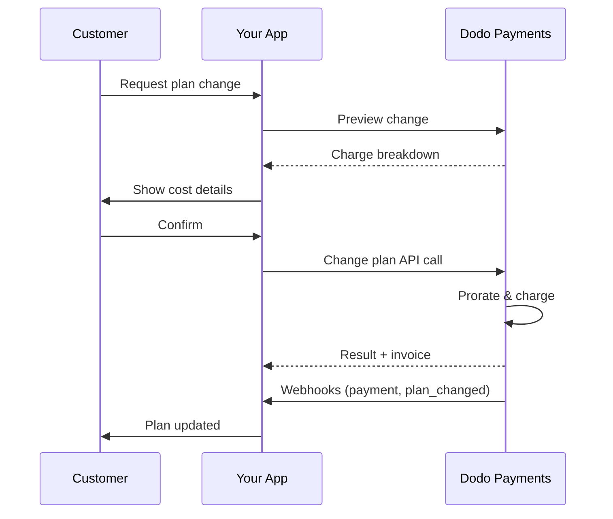
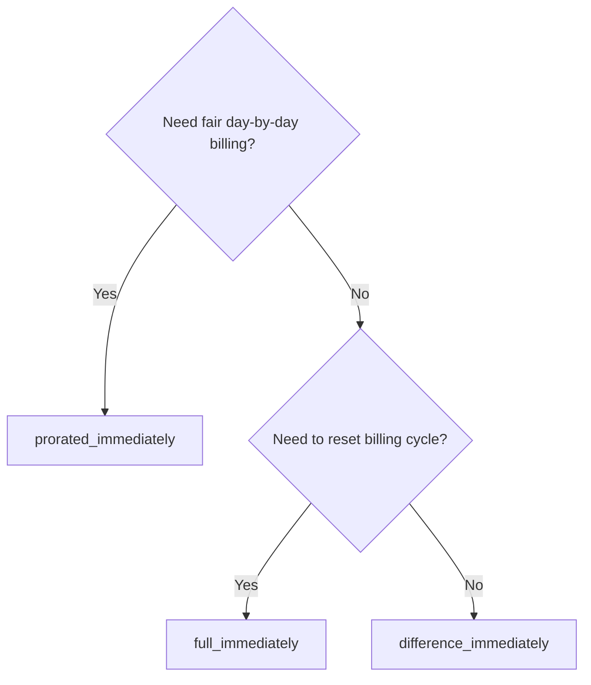
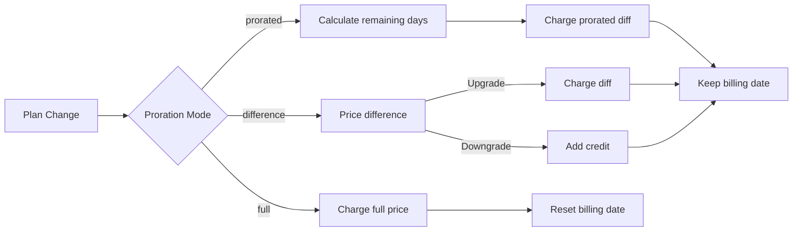

<CardGroup cols={3}>
<Card title="更改计划 API" icon="code" href="/api-reference/subscriptions/change-plan">
  更新订阅的完整 API 文档。
</Card>
<Card title="计划变更预览" icon="eye" href="/api-reference/subscriptions/preview-change-plan">
  查看变更计划前的收费金额。
</Card>
<Card title="集成指南" icon="book" href="/developer-resources/subscription-integration-guide">
  步骤式订阅设置。
</Card>
</CardGroup>

## 什么是订阅升级或降级？

更改计划可以让您在订阅层级或数量之间移动客户。使用它来：
- 根据使用情况或功能对齐定价
- 从按月转为按年（或反之）
- 调整基于席位的产品数量

<Info>
计划变更可能会根据您选择的按比例计费模式触发即时收费。
</Info>

## 何时使用计划变更

- 当客户需要更多功能、使用或席位时升级
- 当使用量减少时降级
- 将用户迁移到新的产品或价格，而不取消他们的订阅

## 计划变更流程



## 前提条件

在实施订阅计划变更之前，请确保您拥有：

- 一个具有活跃订阅产品的 Dodo Payments 商户账户
- 从仪表板获取的 API 凭证（API 密钥和 Webhook 密钥）
- 一个现有的活跃订阅以进行修改
- 配置好的 Webhook 端点以处理订阅事件

<Info>
有关详细的设置说明，请参见我们的 [集成指南](/developer-resources/integration-guide#dashboard-setup)。
</Info>

## 分步实施指南

按照此综合指南在您的应用程序中实施订阅计划变更：

<Steps>
<Step title="了解计划变更要求">
在实施之前，确定：
- 哪些订阅产品可以更改为其他产品
- 哪种按比例计费模式适合您的商业模式
- 如何优雅地处理失败的计划变更
- 需要跟踪哪些 Webhook 事件以进行状态管理

<Tip>
在生产环境中实施之前，请在测试模式下彻底测试计划变更。
</Tip>
</Step>

<Step title="选择您的按比例计费策略">
选择与您的业务需求相符的计费方法：

<Tabs>
<Tab title="prorated_immediately">
最佳适用：希望公平收费未使用时间的 SaaS 应用程序
- 根据剩余周期时间计算确切的按比例金额
- 根据周期中剩余的未使用时间收取按比例金额
- 为客户提供透明的计费
</Tab>

<Tab title="difference_immediately">
最佳适用：明确的升级/降级场景
- 升级：立即收取差额（例如，$30→$80 = 收取 $50）
- 降级：为未来续订提供剩余价值的信用
- 简化计费逻辑和客户沟通
</Tab>

<Tab title="full_immediately">
最佳适用：当您想重置计费周期时
- 立即收取新计划的全额
- 忽略旧计划的剩余时间
- 适用于年度到月度的过渡
</Tab>
</Tabs>
</Step>

<Step title="实施更改计划 API">
使用更改计划 API 修改订阅详细信息：

<ParamField path="subscription_id" type="string" required>
要修改的活跃订阅的 ID。
</ParamField>

<ParamField path="product_id" type="string" required>
要更改订阅的新产品 ID。
</ParamField>

<ParamField path="quantity" type="integer" default="1">
新计划的单位数量（适用于基于座位的产品）。
</ParamField>

<ParamField path="proration_billing_mode" type="string" required>
如何处理即时计费：`prorated_immediately`, `full_immediately`, 或 `difference_immediately`。
</ParamField>

<ParamField path="addons" type="array">
新计划的可选附加组件。将此留空将移除任何现有的附加组件。
</ParamField>

<ParamField path="on_payment_failure" type="string">
控制计划变更付款失败时的行为：
- `prevent_change`：在付款成功之前将订阅保持在当前计划
- `apply_change`（默认）：无论付款结果如何，立即应用计划变更。
</ParamField>

如果未指定，则使用业务级默认设置。
</ParamField>
</Step>

<Step title="处理 Webhook 事件">
设置 Webhook 处理以跟踪计划变更结果：

- `subscription.active`：计划变更成功，订阅已更新
- `subscription.plan_changed`：订阅计划已更改（升级/降级/附加组件更新）
- `subscription.on_hold`：计划变更收费失败，订阅已暂停
- `payment.succeeded`：计划变更的即时收费成功
- `payment.failed`：即时收费失败

<Warning>
请始终验证 Webhook 签名并实现幂等事件处理。
</Warning>
</Step>

<Step title="更新您的应用状态">
根据 Webhook 事件更新您的应用：
- 根据新计划授予/撤销功能
- 更新客户仪表板以显示新计划详情
- 发送关于计划变更的确认电子邮件
- 记录计费变更以供审计
</Step>

<Step title="测试和监控">
彻底测试您的实施：
- 用不同的场景测试所有按比例计费模式
- 验证 Webhook 处理是否正常工作
- 监控计划变更成功率
- 设置失败的计划变更警报
</Step>

<Check>
您的订阅计划变更实施现在已准备好生产使用。
</Check>
</Step>
</Steps>

## 预览计划变更

在承诺进行计划变更之前，使用预览 API 精确向客户展示将收取的费用：

<Tabs>
<Tab title="Node.js SDK">

```javascript
const preview = await client.subscriptions.previewChangePlan('sub_123', {
  product_id: 'prod_pro',
  quantity: 1,
  proration_billing_mode: 'prorated_immediately'
});

// Show customer the charge before confirming
console.log('Immediate charge:', preview.immediate_charge.summary);
console.log('New plan details:', preview.new_plan);
```

</Tab>

<Tab title="Python SDK">

```python
preview = client.subscriptions.preview_change_plan(
    subscription_id="sub_123",
    product_id="prod_pro",
    quantity=1,
    proration_billing_mode="prorated_immediately"
)

# Show customer the charge before confirming
print("Immediate charge:", preview.immediate_charge.summary)
print("New plan details:", preview.new_plan)
```

</Tab>
</Tabs>

<Tip>
使用预览 API 创建确认对话框，以显示客户在确认计划变更之前将收取的确切费用。
</Tip>

## 更改计划 API

使用更改计划 API 修改活动订阅的产品、数量和按比例计费行为。

### 快速入门示例

<Tabs>
  <Tab title="Node.js SDK">

    ```javascript
    import DodoPayments from 'dodopayments';

    const client = new DodoPayments({
      bearerToken: process.env.DODO_PAYMENTS_API_KEY,
      environment: 'test_mode', // defaults to 'live_mode'
    });

    async function changePlan() {
      const result = await client.subscriptions.changePlan('sub_123', {
        product_id: 'prod_new',
        quantity: 3,
        proration_billing_mode: 'prorated_immediately',
        on_payment_failure: 'prevent_change', // Optional: control behavior on payment failure
      });
      console.log(result.status, result.invoice_id, result.payment_id);
    }

    changePlan();
    ```

  </Tab>
  <Tab title="Python SDK">

    ```python
    import os
    from dodopayments import DodoPayments

    client = DodoPayments(
        bearer_token=os.environ.get("DODO_PAYMENTS_API_KEY"),
        environment="test_mode",  # defaults to "live_mode"
    )

    result = client.subscriptions.change_plan(
        subscription_id="sub_123",
        product_id="prod_new",
        quantity=3,
        proration_billing_mode="prorated_immediately",
        on_payment_failure="prevent_change",  # Optional: control behavior on payment failure
    )
    print(result.status, result.get("invoice_id"), result.get("payment_id"))
    ```

  </Tab>
  <Tab title="Go SDK">

    ```go
    package main

    import (
      "context"
      "fmt"
      "github.com/dodopayments/dodopayments-go"
      "github.com/dodopayments/dodopayments-go/option"
    )

    func main() {
      client := dodopayments.NewClient(option.WithBearerToken("YOUR_TOKEN"))
      res, err := client.Subscriptions.ChangePlan(context.TODO(), dodopayments.SubscriptionChangePlanParams{
        SubscriptionID: dodopayments.F("sub_123"),
        ProductID:             dodopayments.F("prod_new"),
        Quantity:              dodopayments.F(int64(3)),
        ProrationBillingMode:  dodopayments.F(dodopayments.SubscriptionChangePlanParamsProrationBillingModeProratedImmediately),
        OnPaymentFailure:      dodopayments.F(dodopayments.OnPaymentFailurePreventChange), // Optional
      })
      if err != nil { panic(err) }
      fmt.Println(res.Status, res.InvoiceID, res.PaymentID)
    }
    ```

  </Tab>
  <Tab title="HTTP">

    ```bash
    curl -X POST "$DODO_API_BASE/subscriptions/sub_123/change-plan" \
      -H "Authorization: Bearer $DODO_PAYMENTS_API_KEY" \
      -H "Content-Type: application/json" \
      -d '{
        "product_id": "prod_new",
        "quantity": 3,
        "proration_billing_mode": "prorated_immediately",
        "on_payment_failure": "prevent_change"
      }'
    ```

  </Tab>
</Tabs>

```json Success
{
  "status": "processing",
  "subscription_id": "sub_123",
  "invoice_id": "inv_789",
  "payment_id": "pay_456",
  "proration_billing_mode": "prorated_immediately"
}
```

<Note>
像 <code>invoice_id</code> 和 <code>payment_id</code> 这样的字段仅在计划变更期间创建即时收费和/或发票时返回。始终依赖 Webhook 事件（例如，<code>payment.succeeded</code>, <code>subscription.plan_changed</code>）来确认结果。
</Note>

<Warning>
如果即时收费失败，订阅可能会转移到 `subscription.on_hold` 状态，直到付款成功。
</Warning>

## 管理附加组件

更改订阅计划时，您还可以修改附加组件：

```javascript
// Add addons to the new plan
await client.subscriptions.changePlan('sub_123', {
  product_id: 'prod_new',
  quantity: 1,
  proration_billing_mode: 'difference_immediately',
  addons: [
    { addon_id: 'addon_123', quantity: 2 }
  ]
});

// Remove all existing addons
await client.subscriptions.changePlan('sub_123', {
  product_id: 'prod_new',
  quantity: 1,
  proration_billing_mode: 'difference_immediately',
  addons: [] // Empty array removes all existing addons
});
```

<Info>
附加组件包含在按比例计费计算中，并将根据所选的按比例计费模式收费。
</Info>

## 按比例计费模式

选择在更改计划时如何对客户收费：

#### `prorated_immediately`
- 针对当前周期的部分差异收费
- 如果在试用期内，立即收费并立即切换到新计划
- 降级：可能会生成按比例的信用，在未来续订时应用

#### `full_immediately`
- 立即对新计划的全额收取
- 忽略旧计划的剩余时间

<Info>
使用 <code>difference_immediately</code> 进行降级所产生的信用是订阅范围的，并且与 <a href="/features/customer-credit">客户信用</a> 不同。它们会自动应用于同一订阅的未来续订，并且不可转让。
</Info>

#### `difference_immediately`
- 升级：立即收费旧计划与新计划之间的价差
- 降级：将剩余价值作为内部信用添加到订阅中，并在续订时自动应用

 | 特性 | `prorated_immediately` | `difference_immediately` | `full_immediately` |
|---------|----------------------|------------------------|-------------------|
| **升级收费** | 剩余天数的按比例差异 | 计划之间的全额价格差异 | 新计划的全额价格 |
| **降级信用** | 剩余天数的按比例信用 | 全额价格差异作为信用 | 没有信用 |
| **计费周期** | 不变 | 不变 | 重置为今天 |
| **试用行为** | 结束试用，立即收费 | 结束试用，立即收费 | 结束试用，收费全额 |
| **最佳选择** | 公平的基于时间的计费 | 简单的升级/降级数学 | 重置计费周期 |
| **复杂性** | 中等（天数计算） | 低（简单减法） | 低（全额收费） |



### 示例场景

使用这些规范数字：
- 当前计划：**基础**，**$30/月**
- 升级目标：**专业**，**$80/月**
- 降级目标（从专业）：**入门**，**$20/月**
- 计费周期：**30天**，于**1月1日**开始
- 计划变更发生在**1月16日**（剩余15天，已使用15天）

<AccordionGroup>
  <Accordion title="升级：基础（$30）→专业（$80），按比例立即">

    ```
    Step 1: Calculate unused credit from current plan
      Unused days = 15 out of 30 days
      Credit = $30 × (15/30) = $15.00

    Step 2: Calculate prorated cost of new plan
      Remaining days = 15 out of 30 days
      New plan cost = $80 × (15/30) = $40.00

    Step 3: Calculate immediate charge
      Charge = New plan cost − Credit
      Charge = $40.00 − $15.00 = $25.00

    → Customer pays $25.00 now
    → Next renewal (Feb 1): $80.00/month
    ```

    ```javascript
    await client.subscriptions.changePlan('sub_123', {
      product_id: 'prod_pro',
      quantity: 1,
      proration_billing_mode: 'prorated_immediately'
    })
    ```

  </Accordion>

  <Accordion title="降级：专业（$80）→入门（$20），按比例立即">

    ```
    Step 1: Calculate unused credit from current plan
      Unused days = 15 out of 30 days
      Credit = $80 × (15/30) = $40.00

    Step 2: Calculate prorated cost of new plan
      Remaining days = 15 out of 30 days
      New plan cost = $20 × (15/30) = $10.00

    Step 3: Calculate credit balance
      Credit = $40.00 − $10.00 = $30.00

    → No charge — $30.00 credit added to subscription
    → Credit auto-applies to future renewals
    → Next renewal (Feb 1): $20.00 − $30.00 credit = $0.00
    → Following renewal (Mar 1): $20.00 − $10.00 remaining credit = $10.00
    ```

    ```javascript
    await client.subscriptions.changePlan('sub_123', {
      product_id: 'prod_starter',
      quantity: 1,
      proration_billing_mode: 'prorated_immediately'
    })
    ```

  </Accordion>

  <Accordion title="升级：基础（$30）→专业（$80），全额立即">

    ```
    Immediate charge = New plan price − Old plan price
                     = $80 − $30
                     = $50.00

    → Customer pays $50.00 now (regardless of cycle position)
    → Next renewal (Feb 1): $80.00/month
    ```

    ```javascript
    await client.subscriptions.changePlan('sub_123', {
      product_id: 'prod_pro',
      quantity: 1,
      proration_billing_mode: 'difference_immediately'
    })
    ```

  </Accordion>

  <Accordion title="降级：专业（$80）→入门（$20），全额立即">

    ```
    Credit = Old plan price − New plan price
           = $80 − $20
           = $60.00

    → No charge — $60.00 credit added to subscription
    → Credit auto-applies to future renewals
    → Next renewal: $20.00 − $20.00 (from credit) = $0.00
    → Following renewal: $20.00 − $20.00 (from credit) = $0.00
    → Third renewal: $20.00 − $20.00 (from remaining credit) = $0.00
    ```

    ```javascript
    await client.subscriptions.changePlan('sub_123', {
      product_id: 'prod_starter',
      quantity: 1,
      proration_billing_mode: 'difference_immediately'
    })
    ```

  </Accordion>

  <Accordion title="升级：基础（$30）→专业（$80），全额立即">

    ```
    Immediate charge = Full new plan price = $80.00

    → Customer pays $80.00 now
    → No credit for unused time on old plan
    → Billing cycle resets to today (January 16)
    → Next renewal: February 16 at $80.00/month
    ```

    ```javascript
    await client.subscriptions.changePlan('sub_123', {
      product_id: 'prod_pro',
      quantity: 1,
      proration_billing_mode: 'full_immediately'
    })
    ```

  </Accordion>

  <Accordion title="中途升级附加组件，按比例立即">

    ```
    Current: Basic plan ($30/month), no add-ons
    New: Pro plan ($80/month) + Extra Seats add-on ($10/seat × 3 seats = $30/month)
    Change on day 16 of 30 (15 days remaining)

    Step 1: Credit from current plan
      Credit = $30 × (15/30) = $15.00

    Step 2: Prorated cost of new plan + add-ons
      New plan = $80 × (15/30) = $40.00
      Add-ons = $30 × (15/30) = $15.00
      Total new = $55.00

    Step 3: Immediate charge
      Charge = $55.00 − $15.00 = $40.00

    → Customer pays $40.00 now
    → Next renewal: $80.00 + $30.00 = $110.00/month
    ```

    ```javascript
    await client.subscriptions.changePlan('sub_123', {
      product_id: 'prod_pro',
      quantity: 1,
      proration_billing_mode: 'prorated_immediately',
      addons: [
        { addon_id: 'addon_seats', quantity: 3 }
      ]
    })
    ```

  </Accordion>
</AccordionGroup>

### 每种模式如何处理计费



<Tip>
选择 `prorated_immediately` 以实现公平的时间记账；选择 `full_immediately` 以重启计费；使用 `difference_immediately` 进行简单的升级和自动降级信用。
</Tip>

## 处理付款失败

使用 `on_payment_failure` 参数控制计划变更付款失败时发生的情况。

### 付款失败模式

<Tabs>
<Tab title="prevent_change（推荐用于关键升级）">
**行为**：在付款成功之前将订阅保持在其当前计划上。

- 计划变更被标记为“待处理”
- 客户保留对当前计划的访问权
- 订阅仅在付款成功后才转移到 `active` 状态
- 有效当您希望在授予升级功能之前确保付款


```javascript
await client.subscriptions.changePlan('sub_123', {
  product_id: 'prod_pro',
  quantity: 1,
  proration_billing_mode: 'prorated_immediately',
  on_payment_failure: 'prevent_change'
});
```

</Tab>

<Tab title="apply_change（默认）">
**行为**：无论付款结果如何，立即应用计划变更。

- 即使付款失败，也会应用计划变更
- 客户立即获得对新计划的访问权
- 如果付款失败，订阅可能会转移到 `on_hold`
- 适用于非关键性升级或当您信任客户时


```javascript
await client.subscriptions.changePlan('sub_123', {
  product_id: 'prod_pro',
  quantity: 1,
  proration_billing_mode: 'prorated_immediately',
  on_payment_failure: 'apply_change' // This is the default
});
```

</Tab>
</Tabs>

<Info>
如果未指定，`on_payment_failure` 参数使用您在仪表板中配置的业务级默认设置。
</Info>

### 何时使用每种模式

| 场景 | 推荐模式 | 理由 |
|----------|------------------|--------|
| 升级到高级功能 | `prevent_change` | 确保付款后再授予访问权 |
| 数量增加（更多席位） | `prevent_change` | 防止未付款而使用 |
| 降级计划 | `apply_change` | 客户正在减少支出 |
| 受信任的企业客户 | `apply_change` | 降低未付款风险 |
| 从试用转为付费 | `prevent_change` | 关键付款时刻 |

## 处理 Webhook

通过 Webhook 跟踪订阅状态，以确认计划变更和付款。

### 需要处理的事件类型
- `subscription.active`：订阅已激活
- `subscription.plan_changed`：订阅计划已更改（升级/降级/附加组件变更）
- `subscription.on_hold`：收费失败，订阅暂停
- `subscription.renewed`：续订成功
- `payment.succeeded`：计划变更或续订的付款成功
- `payment.failed`：付款失败

<Info>
我们推荐根据订阅事件驱动业务逻辑，并使用付款事件进行确认和调解。
</Info>

### 验证签名并处理意图

<Tabs>
  <Tab title="Next.js 路由处理程序">

    ```javascript
    import { NextRequest, NextResponse } from 'next/server';
    
    export async function POST(req) {
      const webhookId = req.headers.get('webhook-id');
      const webhookSignature = req.headers.get('webhook-signature');
      const webhookTimestamp = req.headers.get('webhook-timestamp');
      const secret = process.env.DODO_WEBHOOK_SECRET;
    
      const payload = await req.text();
      // verifySignature is a placeholder – in production, use a Standard Webhooks library
      const { valid, event } = await verifySignature(
        payload,
        { id: webhookId, signature: webhookSignature, timestamp: webhookTimestamp },
        secret
      );
      if (!valid) return NextResponse.json({ error: 'Invalid signature' }, { status: 400 });
    
      switch (event.type) {
        case 'subscription.active':
          // mark subscription active in your DB
          break;
        case 'subscription.plan_changed':
          // refresh entitlements and reflect the new plan in your UI
          break;
        case 'subscription.on_hold':
          // notify user to update payment method
          break;
        case 'subscription.renewed':
          // extend access window
          break;
        case 'payment.succeeded':
          // reconcile payment for plan change
          break;
        case 'payment.failed':
          // log and alert
          break;
        default:
          // ignore unknown events
          break;
      }
    
      return NextResponse.json({ received: true });
    }
    ```

  </Tab>
  <Tab title="Express.js">

    ```javascript
    import express from 'express';
    
    const app = express();
    app.post('/webhooks/dodo', express.raw({ type: 'application/json' }), async (req, res) => {
      const webhookId = req.header('webhook-id');
      const webhookSignature = req.header('webhook-signature');
      const webhookTimestamp = req.header('webhook-timestamp');
      const secret = process.env.DODO_WEBHOOK_SECRET;
      const payload = req.body.toString('utf8');
    
      const { valid, event } = await verifySignature(
        payload,
        { id: webhookId, signature: webhookSignature, timestamp: webhookTimestamp },
        secret
      );
      if (!valid) return res.status(400).send('Invalid signature');
    
      // handle events like above
      res.json({ received: true });
    });
    
    app.listen(3000);
    ```

  </Tab>
</Tabs>

<Note>
有关详细有效载荷架构，请参阅 <a href="/developer-resources/webhooks/intents/subscription">订阅 Webhook 有效载荷</a> 和 <a href="/developer-resources/webhooks/intents/payment">付款 Webhook 有效载荷</a>。
</Note>

## 最佳实践

遵循以下建议，以确保订阅计划变更的可靠性：

### 计划变更策略
- **彻底测试**：始终在测试模式下测试计划变更，然后再投入生产
- **仔细选择按比例计费模式**：选择与您的业务模型一致的按比例计费模式
- **优雅地处理失败**：实现适当的错误处理和重试逻辑
- **监控成功率**：跟踪计划变更的成功/失败率并调查问题

### Webhook 实施
- **验证签名**：始终验证 Webhook 签名以确保真实性
- **实现幂等性**：优雅地处理重复的 Webhook 事件
- **异步处理**：不要用繁重的操作阻塞 Webhook 响应
- **记录全部**：保持详细记录以备调试和审计

### 用户体验
- **清晰沟通**：告知客户有关计费变更和时间的信息
- **提供确认**：发送关于成功计划变更的确认电子邮件
- **处理边缘情况**：考虑试用期、按比例计费和付款失败
- **立即更新 UI**：在您的应用界面中反映计划变更

## 常见问题及解决方案

解决在订阅计划变更过程中遇到的典型问题：

<AccordionGroup>
<Accordion title="创建了收费但订阅未更新">
**症状**：API 调用成功但订阅保持在旧计划


**常见原因**：
- Webhook 处理失败或有所延迟
- 在接收 Webhook 后应用状态未更新
- 状态更新期间数据库事务问题


**解决方案**：
- 实现强大的 Webhook 处理与重试逻辑
- 对状态更新使用幂等操作
- 添加监控以检测和提醒遗漏的 Webhook 事件
- 验证 Webhook 端点可访问并正确响应
</Accordion>

<Accordion title="降级后未应用信用">
**症状**：客户降级但未看到信用余额


**常见原因**：
- 按比例计费模式期望：使用 `difference_immediately` 降级时，信用全额为计划价格差异，而 `prorated_immediately` 则根据周期中剩余时间创建按比例信用
- 信用是特定于订阅的，不可在不同订阅之间转移
- 客户仪表板未显示信用余额


**解决方案**：
- 在降级时使用 `difference_immediately`，您希望自动创建信用
- 向客户解释信用适用于同一订阅的未来续订
- 实现客户门户以显示信用余额
- 检查下一个发票预览以查看应用的信用
</Accordion>

<Accordion title="Webhook 签名验证失败">
**症状**：由于签名无效，Webhook 事件被拒绝


**常见原因**：
- Webhook 密钥错误
- 在验证签名之前修改了原始请求体
- 错误的签名验证算法


**解决方案**：
- 验证您是否使用了仪表板中正确的 `DODO_WEBHOOK_SECRET`
- 在任何 JSON 解析中间件之前读取原始请求体
- 使用您平台的标准 Webhook 验证库
- 在开发环境中测试 Webhook 签名验证
</Accordion>

<Accordion title="计划变更失败，返回 422 错误">
**症状**：API 返回 422 Unprocessable Entity 错误


**常见原因**：
- 无效的订阅 ID 或产品 ID
- 订阅不处于活动状态
- 缺少必需参数
- 产品不支持计划变更


**解决方案**：
- 验证订阅是否存在且处于活动状态
- 检查产品 ID 是否有效且可用
- 确保提供了所有必需参数
- 审核 API 文档以确认参数要求
</Accordion>

<Accordion title="计划变更发起但即时收费失败">
**症状**：计划变更已发起但即时收费失败


**常见原因**：
- 客户的付款方式资金不足
- 付款方式过期或无效
- 银行拒绝交易
- 欺诈检测阻止了收费


**解决方案**：
- 适当地处理 `payment.failed` Webhook 事件
- 通知客户更新付款方式
- 对临时故障实施重试逻辑
- 考虑允许未成功即时收费的计划变更
</Accordion>

<Accordion title="计划变更后订阅被暂停">
**症状**：计划变更收费失败，订阅转移到 `on_hold` 状态


**发生了什么**：
当计划变更收费失败时，订阅会自动放置在 `on_hold` 状态。订阅不会自动续订，直到更新付款方式。


**解决方案**：更新付款方式以重新激活订阅


要从计划变更失败后的 `on_hold` 状态重新激活订阅：


1. **更新付款方式**，使用更新付款方式 API
2. **自动收费创建**：API 会自动创建剩余到期款项的收费
3. **发票生成**：为收费生成发票
4. **付款处理**：使用新的付款方式处理付款
5. **重新激活**：在成功付款后，订阅被重新激活到 `active` 状态


<CodeGroup>

```javascript Node.js
// Reactivate subscription from on_hold after failed plan change
async function reactivateAfterFailedPlanChange(subscriptionId) {
  // Update payment method - automatically creates charge for remaining dues
  const response = await client.subscriptions.updatePaymentMethod(subscriptionId, {
    type: 'new',
    return_url: 'https://example.com/return'
  });
  
  if (response.payment_id) {
    console.log('Charge created for remaining dues:', response.payment_id);
    console.log('Payment link:', response.payment_link);
    
    // Redirect customer to payment_link to complete payment
    // Monitor webhooks for:
    // 1. payment.succeeded - charge succeeded
    // 2. subscription.active - subscription reactivated
  }
  
  return response;
}

// Or use existing payment method if available
async function reactivateWithExistingPaymentMethod(subscriptionId, paymentMethodId) {
  const response = await client.subscriptions.updatePaymentMethod(subscriptionId, {
    type: 'existing',
    payment_method_id: paymentMethodId
  });
  
  // Monitor webhooks for payment.succeeded and subscription.active
  return response;
}
```

```python Python
# Reactivate subscription from on_hold after failed plan change
def reactivate_after_failed_plan_change(subscription_id):
    # Update payment method - automatically creates charge for remaining dues
    response = client.subscriptions.update_payment_method(
        subscription_id=subscription_id,
        type="new",
        return_url="https://example.com/return"
    )
    
    if response.payment_id:
        print("Charge created for remaining dues:", response.payment_id)
        print("Payment link:", response.payment_link)
        
        # Redirect customer to payment_link to complete payment
        # Monitor webhooks for:
        # 1. payment.succeeded - charge succeeded
        # 2. subscription.active - subscription reactivated
    
    return response

# Or use existing payment method if available
def reactivate_with_existing_payment_method(subscription_id, payment_method_id):
    response = client.subscriptions.update_payment_method(
        subscription_id=subscription_id,
        type="existing",
        payment_method_id=payment_method_id
    )
    
    # Monitor webhooks for payment.succeeded and subscription.active
    return response
```

</CodeGroup>

**需监控的 Webhook 事件**：
- `subscription.on_hold`：订阅被暂停（当计划变更收费失败时接收）
- `payment.succeeded`：剩余到期付款成功（在更新付款方式后）
- `subscription.active`：成功付款后重新激活订阅


**最佳实践**：
- 当计划变更收费失败时立即通知客户
- 提供明确的更新付款方式的说明
- 监控 Webhook 事件以跟踪重新激活状态
- 考虑对临时付款失败实施自动重试逻辑


<Card title="更新付款方式 API 参考" icon="code" href="/api-reference/subscriptions/update-payment-method">
查看完整的更新付款方式和重新激活订阅的 API 文档。
</Card>
</Accordion>
</AccordionGroup>

## 测试您的实施

按照以下步骤彻底测试您的订阅计划变更实施：

<Steps>
<Step title="设置测试环境">
- 使用测试 API 密钥和测试产品
- 创建不同计划类型的测试订阅
- 配置测试 Webhook 端点
- 设置监控和日志记录
</Step>

<Step title="测试不同的按比例计费模式">
- 测试 `prorated_immediately` 在不同计费周期位置的行为
- 测试 `difference_immediately` 的升级和降级
- 测试 `full_immediately` 以重置计费周期
- 验证信用计算是否正确
</Step>

<Step title="测试 Webhook 处理">
- 验证是否收到所有相关的 Webhook 事件
- 测试 Webhook 签名验证
- 优雅地处理重复的 Webhook 事件
- 测试 Webhook 处理失败场景
</Step>

<Step title="测试错误场景">
- 使用无效的订阅 ID 进行测试
- 使用过期的付款方式进行测试
- 测试网络故障和超时
- 测试资金不足
</Step>

<Step title="在生产中监控">
- 设置失败计划变更的警报
- 监控 Webhook 处理时间
- 跟踪计划变更成功率
- 审核客户支持工单，以解决计划变更问题
</Step>
</Steps>

## 错误处理

优雅地处理实施中的常见 API 错误：

### HTTP 状态代码

<AccordionGroup>
<Accordion title="200 OK">
计划变更请求处理成功。正在更新订阅并开始付款处理。
</Accordion>

<Accordion title="400 Bad Request">
请求参数无效。请检查所有必填字段是否提供并正确格式化。
</Accordion>

<Accordion title="401 Unauthorized">
API 密钥无效或缺失。请验证您的 `DODO_PAYMENTS_API_KEY` 是正确且具备适当权限。
</Accordion>

<Accordion title="404 Not Found">
未找到订阅 ID，或者该订阅不属于您的帐户。
</Accordion>

<Accordion title="422 Unprocessable Entity">
无法更改订阅（例如，已经取消、产品不可用等）。
</Accordion>

<Accordion title="500 Internal Server Error">
发生服务器错误。稍后重试请求。
</Accordion>
</AccordionGroup>

### 错误响应格式

```json
{
  "error": {
    "code": "subscription_not_found",
    "message": "The subscription with ID 'sub_123' was not found",
    "details": {
      "subscription_id": "sub_123"
    }
  }
}
```

## 下一步

- 审阅 <a href="/api-reference/subscriptions/change-plan">更改计划 API</a>
- 探索 <a href="/features/customer-credit">客户信用</a>
- 实施针对 `subscription.on_hold` 的警报
- 查看我们的 <a href="/developer-resources/webhooks">Webhook 集成指南</a>
