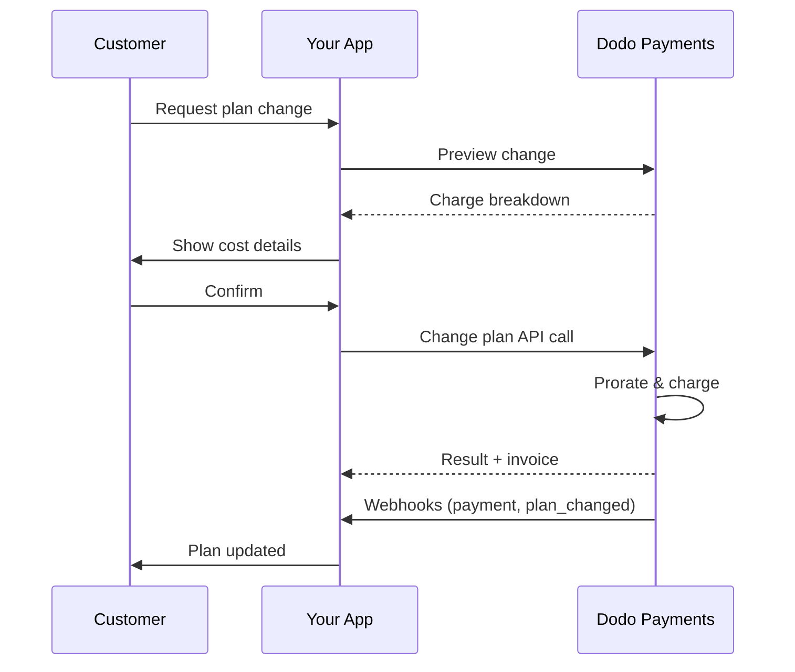
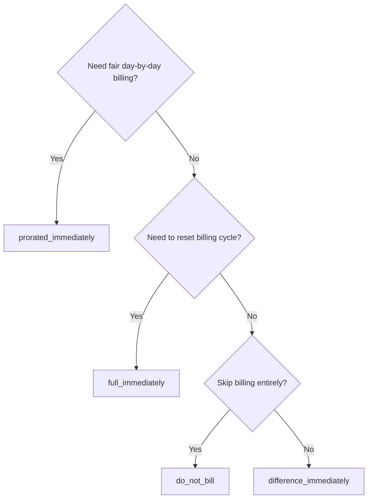
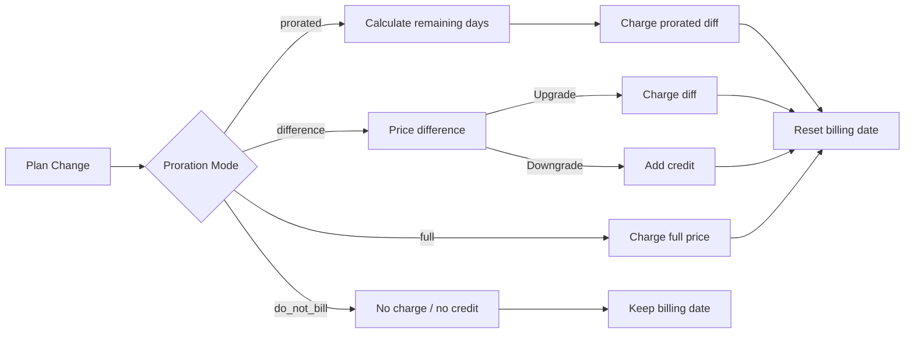

<CardGroup cols={3}>
<Card title="Change Plan API" icon="code" href="/api-reference/subscriptions/change-plan">
  Full API docs for updating subscriptions.
</Card>
<Card title="Plan Change Preview" icon="eye" href="/api-reference/subscriptions/preview-change-plan">
  See charge amounts before changing plans.
</Card>
<Card title="Integration Guide" icon="book" href="/developer-resources/subscription-integration-guide">
  Step-by-step subscription setup.
</Card>
</CardGroup>

## What is a subscription upgrade or downgrade?

Changing plans lets you move a customer between subscription tiers or quantities. Use it to:
- Align pricing with usage or features
- Move from monthly to annual (or vice versa)
- Adjust quantity for seat-based products

<Info>
Plan changes can trigger an immediate charge depending on the proration mode you choose.
</Info>

## When to use plan changes

- Upgrade when a customer needs more features, usage, or seats
- Downgrade when usage decreases
- Migrate users to a new product or price without cancelling their subscription

## Plan Change Flow



## Prerequisites

Before implementing subscription plan changes, ensure you have:

- A Dodo Payments merchant account with active subscription products
- API credentials (API key and webhook secret key) from the dashboard
- An existing active subscription to modify
- Webhook endpoint configured to handle subscription events

<Info>
For detailed setup instructions, see our [Integration Guide](/developer-resources/integration-guide#dashboard-setup).
</Info>

## Step-by-Step Implementation Guide

Follow this comprehensive guide to implement subscription plan changes in your application:

<Steps>
<Step title="Understand Plan Change Requirements">
Before implementing, determine:
- Which subscription products can be changed to which others
- What proration mode fits your business model
- How to handle failed plan changes gracefully
- Which webhook events to track for state management

<Tip>
Test plan changes thoroughly in test mode before implementing in production.
</Tip>
</Step>

<Step title="Choose Your Proration Strategy">
Select the billing approach that aligns with your business needs:

<Tabs>
<Tab title="prorated_immediately">
Best for: SaaS applications wanting to charge fairly for unused time
- Calculates exact prorated amount based on remaining cycle time
- Charges a prorated amount based on unused time remaining in the cycle
- Provides transparent billing to customers
</Tab>

<Tab title="difference_immediately">
Best for: Clear upgrade/downgrade scenarios
- Upgrade: Charge immediate difference (e.g., $30→$80 = charge $50)
- Downgrade: Credit remaining value for future renewals
- Simplifies billing logic and customer communication
</Tab>

<Tab title="full_immediately">
Best for: When you want to reset the billing cycle
- Charges full amount of new plan immediately
- Ignores remaining time from old plan
- Useful for annual to monthly transitions
</Tab>

<Tab title="do_not_bill">
Best for: Free migrations, courtesy switches, or absorbing cost differences
- No charges or credits calculated
- Customer moves to the new plan immediately without any billing adjustment
- Billing cycle remains unchanged
</Tab>
</Tabs>
</Step>

<Step title="Implement the Change Plan API">
Use the Change Plan API to modify subscription details:

<ParamField path="subscription_id" type="string" required>
The ID of the active subscription to modify.
</ParamField>

<ParamField path="product_id" type="string" required>
The new product ID to change the subscription to.
</ParamField>

<ParamField path="quantity" type="integer" required>
Number of units for the new plan (for seat-based products).
</ParamField>

<ParamField path="proration_billing_mode" type="string" required>
How to handle immediate billing: `prorated_immediately`, `full_immediately`, `difference_immediately`, or `do_not_bill`.
</ParamField>

<ParamField path="addons" type="array">
Optional addons for the new plan. Leaving this empty removes any existing addons.
</ParamField>

<ParamField path="on_payment_failure" type="string">
Controls behavior when the plan change payment fails:
- `prevent_change`: Keep subscription on current plan until payment succeeds
- `apply_change` (default): Apply plan change immediately regardless of payment outcome

If not specified, uses the business-level default setting.
</ParamField>

<ParamField path="collect_via_payment_link" type="boolean">
使用支付链接收取套餐变更金额，而不是从订阅已保存的支付方式中扣款。客户会在托管结账页面完成支付。

需要企业启用 `allow_plan_change_via_payment_link` 能力（**Settings → Subscriptions → Collect Plan Change Payments by Payment Link**）、`effective_at: immediately` 和 `on_payment_failure: prevent_change`。请参阅[通过结账链接收款](#collecting-payment-via-a-checkout-link)。

预览路由会忽略此参数。
</ParamField>

<ParamField path="discount_codes" type="array">
可选的要应用于新套餐的**堆叠**折扣码（最多 20 个，按数组顺序应用）。具体行为取决于传入的内容：

- **未提供 / `null`** — 如果现有折扣适用于新产品，则会保留带有 `preserve_on_plan_change=true` 的现有折扣。
- **`[]`（空数组）** — 移除订阅中的所有现有折扣。
- **`["CODE_A", "CODE_B", ...]`** — 使用此堆叠折扣集替换所有现有折扣。
</ParamField>

<ParamField path="discount_code" type="string" deprecated>
**已弃用** — 新集成请优先使用 `discount_codes`。为保持向后兼容，此字段仍然有效，但不能在同一个请求中与 `discount_codes` 组合使用。
</ParamField>

<ParamField path="effective_at" type="string" default="immediately">
应用套餐变更的时间：
- `immediately`（默认）：立即应用套餐变更
- `next_billing_date`：将变更安排在下一账单日期。客户在计费周期结束前仍保留当前套餐。

对于降级，请使用 `next_billing_date`，以便客户在计费周期结束前继续享有当前套餐的权益。
</ParamField>
</Step>

<Step title="Handle Webhook Events">
设置 webhook 处理逻辑，以跟踪套餐变更结果：

- `subscription.active`：套餐变更成功，订阅已更新
- `subscription.plan_changed`：订阅套餐已变更（升级/降级/附加项更新）
- `subscription.on_hold`：套餐变更扣款失败，续订已停止
- `payment.succeeded`：套餐变更的即时扣款成功
- `payment.failed`：即时扣款失败

<Warning>
始终验证 webhook 签名，并实现幂等的事件处理。
</Warning>
</Step>

<Step title="Update Your Application State">
根据 webhook 事件更新应用：
- 根据新套餐授予或撤销功能
- 使用新套餐详情更新客户控制面板
- 发送有关套餐变更的确认邮件
- 记录账单变更以供审计
</Step>

<Step title="Test and Monitor">
全面测试你的实现：
- 使用不同场景测试所有按比例计费模式
- 验证 webhook 处理是否正常工作
- 监控套餐变更成功率
- 为失败的套餐变更设置提醒

<Check>
你的订阅套餐变更实现现已准备好投入生产环境。
</Check>
</Step>
</Steps>

## 预览套餐变更

在提交套餐变更之前，使用 Preview API 向客户准确展示他们将被收取的金额：

<Tabs>
<Tab title="Node.js SDK">

```javascript
const preview = await client.subscriptions.previewChangePlan('sub_123', {
  product_id: 'pdt_pro',
  quantity: 1,
  proration_billing_mode: 'prorated_immediately'
});

// Show customer the charge before confirming
console.log('Immediate charge:', preview.immediate_charge.summary);
console.log('New plan details:', preview.new_plan);
```

</Tab>

<Tab title="Python SDK">

```python
preview = client.subscriptions.preview_change_plan(
    subscription_id="sub_123",
    product_id="pdt_pro",
    quantity=1,
    proration_billing_mode="prorated_immediately"
)

# Show customer the charge before confirming
print("Immediate charge:", preview.immediate_charge.summary)
print("New plan details:", preview.new_plan)
```

</Tab>
</Tabs>

<Tip>
使用预览 API 构建确认对话框，在客户确认套餐变更之前，向其展示准确的扣款金额。
</Tip>

## Change Plan API

使用 Change Plan API 修改有效订阅的产品、数量和按比例计费行为。

### 快速入门示例

<Tabs>
  <Tab title="Node.js SDK">

    ```javascript
    import DodoPayments from 'dodopayments';

    const client = new DodoPayments({
      bearerToken: process.env.DODO_PAYMENTS_API_KEY,
      environment: 'test_mode', // defaults to 'live_mode'
    });

    async function changePlan() {
      // change-plan returns 200 with an empty body.
      await client.subscriptions.changePlan('sub_123', {
        product_id: 'pdt_new',
        quantity: 3,
        proration_billing_mode: 'prorated_immediately',
        on_payment_failure: 'prevent_change', // Optional: control behavior on payment failure
      });
      console.log('Plan change accepted; awaiting webhooks');
    }

    changePlan();
    ```

  </Tab>
  <Tab title="Python SDK">

    ```python
    import os
    from dodopayments import DodoPayments

    client = DodoPayments(
        bearer_token=os.environ.get("DODO_PAYMENTS_API_KEY"),
        environment="test_mode",  # defaults to "live_mode"
    )

    # change_plan returns 200 with an empty body.
    client.subscriptions.change_plan(
        subscription_id="sub_123",
        product_id="pdt_new",
        quantity=3,
        proration_billing_mode="prorated_immediately",
        on_payment_failure="prevent_change",  # Optional: control behavior on payment failure
    )
    print("Plan change accepted; awaiting webhooks")
    ```

  </Tab>
  <Tab title="Go SDK">

    ```go
    package main

    import (
      "context"
      "fmt"
      "github.com/dodopayments/dodopayments-go"
      "github.com/dodopayments/dodopayments-go/option"
    )

    func main() {
      client := dodopayments.NewClient(option.WithBearerToken("YOUR_TOKEN"))
      // ChangePlan returns no response body; a nil error means the change succeeded.
      err := client.Subscriptions.ChangePlan(context.TODO(), "sub_123", dodopayments.SubscriptionChangePlanParams{
        UpdateSubscriptionPlanReq: dodopayments.UpdateSubscriptionPlanReqParam{
          ProductID:            dodopayments.F("pdt_new"),
          Quantity:             dodopayments.F(int64(3)),
          ProrationBillingMode: dodopayments.F(dodopayments.UpdateSubscriptionPlanReqProrationBillingModeProratedImmediately),
          OnPaymentFailure:     dodopayments.F(dodopayments.UpdateSubscriptionPlanReqOnPaymentFailurePreventChange), // Optional
        },
      })
      if err != nil { panic(err) }
      fmt.Println("Plan change applied")
    }
    ```

  </Tab>
  <Tab title="HTTP">

    ```bash
    curl -X POST "$DODO_API_BASE/subscriptions/sub_123/change-plan" \
      -H "Authorization: Bearer $DODO_PAYMENTS_API_KEY" \
      -H "Content-Type: application/json" \
      -d '{
        "product_id": "pdt_new",
        "quantity": 3,
        "proration_billing_mode": "prorated_immediately",
        "on_payment_failure": "prevent_change"
      }'
    ```

  </Tab>
  </Tabs>

成功的套餐变更会立即返回 `200 OK` — 此时任何扣款尚未实际结算。响应正文（`ChangePlanResponse`）的内容取决于变更的收款方式：

| 情况 | `payment_id` / `payment_link` / `client_secret` / `expires_on` |
|------|------------------------------------------------------------|
| 已安排的变更（`effective_at: next_billing_date`） | 所有 `null` — 尚未收取任何费用 |
| `proration_billing_mode: do_not_bill` | 所有 `null` — 无需收款 |
| 普通即时扣款（已保存的支付方式） | 所有 `null` |
| `collect_via_payment_link: true`（已签发链接） | 所有值均已**填充** — 为客户提供结账句柄 |

<Note>
在所有情况下，此响应都不是支付结果 — 它仅表示请求本身已被接受。它不代表即时扣款是否实际成功。

对于**普通即时扣款**，结果会在调用后立即以 off-session 方式异步确定。

对于 **`collect_via_payment_link` 请求**，结果会在之后异步确定 — 响应只会向你提供一个结账链接，订阅保持当前套餐不变，并且在客户通过该链接完成支付之前，无法得知结果。

无论哪种情况，都不要根据此响应推断结果。请通过 webhook（<code>payment.succeeded</code>、<code>payment.failed</code>、<code>subscription.plan_changed</code>）确认，或使用 <code>GET /subscriptions/&#123;subscription_id&#125;</code> 重新读取订阅 — 有关支付链接的具体说明，请参阅[链接未支付时会发生什么](#what-happens-while-the-link-is-unpaid)。
</Note>

<Warning>
如果即时扣款失败，订阅可能会转为 `subscription.on_hold`，直到支付成功。
</Warning>

## 通过结账链接收款

默认情况下，即时套餐变更会直接从订阅已保存的支付方式中扣款。将 `collect_via_payment_link: true` 设置为将客户发送到托管结账页面 — 当没有允许进行 off-session 扣款的已保存支付方式，或你希望客户主动确认新价格时，这会很有用。

<Info>
这也是 **Settings → Subscriptions** 中 **Collect Plan Change Payments by Payment Link** 开关的实现方式：它会让内置 [Customer Portal](/features/customer-portal#collecting-plan-change-payments-by-payment-link) 的套餐变更流程通过结账页面完成，而不是使用已保存的卡。
</Info>

### 要求

只有在以下**所有**条件均满足时，`collect_via_payment_link: true` 才会成功 — 否则请求会失败并返回 `422`：

- 企业已启用 `allow_plan_change_via_payment_link` 能力（**Settings → Subscriptions → Collect Plan Change Payments by Payment Link**）。
- `effective_at` 为 `immediately`（默认值）。已安排的变更（`next_billing_date`）不需要结账页面，因为在变更生效前不会收取任何费用。
- **有效的** `on_payment_failure` 解析为 `prevent_change`。你不必显式传入该参数 — 如果企业级默认值（请参阅下方的 **Business & Collection Defaults**）已经是 `prevent_change`，省略此字段也满足要求。显式设置为 `apply_change`，或解析后的默认值为 `apply_change` 时，请求会失败并返回 `422`。

<Info>
`collect_via_payment_link` 不仅适用于升级 — 只要满足上述要求，它适用于任何会产生扣款的即时变更，包括降级。
</Info>

如果变更金额为**零或产生抵扣** — `proration_billing_mode: do_not_bill`，或其他在本周期内净额为零的模式 — 就没有需要放到结账页面上的金额。不会签发支付链接，`payment_link` 及相关字段会返回 `null`，并且变更会立即生效，与不使用 `collect_via_payment_link` 时相同。这不是 `422`；该标志仅在存在需要收取的正金额时生效。如果你对一般套餐变更而非明确的升级统一设置 `collect_via_payment_link`，请先调用[预览套餐变更](/api-reference/subscriptions/preview-change-plan)，仅在预览金额值得收取时请求链接。

<Tabs>
<Tab title="Node.js SDK">

```javascript
const response = await client.subscriptions.changePlan('sub_123', {
  product_id: 'pdt_pro',
  quantity: 1,
  proration_billing_mode: 'prorated_immediately',
  effective_at: 'immediately',
  on_payment_failure: 'prevent_change',
  collect_via_payment_link: true,
});

// Hand response.payment_link to your frontend and send the customer there
console.log(response.payment_link);
```

</Tab>
<Tab title="Python SDK">

```python
response = client.subscriptions.change_plan(
    subscription_id="sub_123",
    product_id="pdt_pro",
    quantity=1,
    proration_billing_mode="prorated_immediately",
    effective_at="immediately",
    on_payment_failure="prevent_change",
    collect_via_payment_link=True,
)

# Hand response.payment_link to your frontend and send the customer there
print(response.payment_link)
```

</Tab>
<Tab title="HTTP">

```bash
curl -X POST "$DODO_API_BASE/subscriptions/sub_123/change-plan" \
  -H "Authorization: Bearer $DODO_PAYMENTS_API_KEY" \
  -H "Content-Type: application/json" \
  -d '{
    "product_id": "pdt_pro",
    "quantity": 1,
    "proration_billing_mode": "prorated_immediately",
    "effective_at": "immediately",
    "on_payment_failure": "prevent_change",
    "collect_via_payment_link": true
  }'
```

</Tab>
</Tabs>

成功的请求会返回结账句柄：

```json
{
  "payment_id": "<payment_id>",
  "payment_link": "https://checkout.dodopayments.com/...",
  "client_secret": "<client_secret>",
  "expires_on": "<expires_on>"
}
```

### 链接未支付时会发生什么

- 订阅保持在其**当前**套餐 — `product_id`、`recurring_pre_tax_amount` 和 `next_billing_date` 在链接支付前都不会改变。
- 当链接处于待处理状态时，对同一订阅发起进一步的 `change-plan` 请求会被 `409 PendingPlanChangeExists` 拒绝。如有需要，可使用 `DELETE /subscriptions/{subscription_id}/change-plan/scheduled` 取消*已安排的*变更，但该端点无法取消待支付链接变更 — 只有支付成功或链接过期才能取消它。
- 如果银行卡被拒付，客户可以在**同一个**结账会话中重试；新的 `change-plan` 调用不是重试方式。
- 如果链接始终未支付，则会在 `expires_on` 后停止工作 — 稍后订阅会自动允许接收新的套餐变更请求。
- 如果之前已有一个*已安排的*变更（`next_billing_date`），并且你使用 `cancel_scheduled_change_plan: true` 替换它，则在链接未支付期间，原计划仍会保留；只有链接支付后，原计划才会在应用新套餐的同一事务中被取消。

<Warning>
一旦签发即时支付链接变更，该订阅的所有后续套餐变更请求（包括无副作用的预览）都会被阻止，直到链接处理完成。不要签发你不打算让客户立即支付的链接。
</Warning>

## 管理附加项

变更订阅套餐时，你还可以修改附加项：

```javascript
// Add addons to the new plan
await client.subscriptions.changePlan('sub_123', {
  product_id: 'pdt_new',
  quantity: 1,
  proration_billing_mode: 'difference_immediately',
  addons: [
    { addon_id: 'addon_123', quantity: 2 }
  ]
});

// Remove all existing addons
await client.subscriptions.changePlan('sub_123', {
  product_id: 'pdt_new',
  quantity: 1,
  proration_billing_mode: 'difference_immediately',
  addons: [] // Empty array removes all existing addons
});
```

<Info>
附加项会计入按比例计费计算，并根据选定的按比例计费模式收取费用。
</Info>

## 应用折扣码

变更订阅套餐时，你可以应用一个或多个**堆叠折扣码**（最多 20 个，按数组顺序应用）。这适用于在升级或迁移时提供促销价格。

<Tabs>
<Tab title="Node.js SDK">

```javascript
// Apply stacked discount codes during plan change
await client.subscriptions.changePlan('sub_123', {
  product_id: 'pdt_pro',
  quantity: 1,
  proration_billing_mode: 'prorated_immediately',
  discount_codes: ['UPGRADE20']
});
```

</Tab>
<Tab title="Python SDK">

```python
# Apply stacked discount codes during plan change
client.subscriptions.change_plan(
    subscription_id="sub_123",
    product_id="pdt_pro",
    quantity=1,
    proration_billing_mode="prorated_immediately",
    discount_codes=["UPGRADE20"]
)
```

</Tab>
<Tab title="HTTP">

```bash
curl -X POST "$DODO_API_BASE/subscriptions/sub_123/change-plan" \
  -H "Authorization: Bearer $DODO_PAYMENTS_API_KEY" \
  -H "Content-Type: application/json" \
  -d '{
    "product_id": "pdt_pro",
    "quantity": 1,
    "proration_billing_mode": "prorated_immediately",
    "discount_codes": ["UPGRADE20"]
  }'
```

</Tab>
</Tabs>

### 套餐变更时的折扣行为

| `discount_codes` 值 | 行为 |
|------------------------|----------|
| 未提供 / `null` | 如果现有折扣适用于新产品，则会自动保留带有 `preserve_on_plan_change=true` 的现有折扣。 |
| `[]`（空数组） | 移除订阅中的**所有**现有折扣。 |
| `["CODE_A", "CODE_B", ...]` | 使用此堆叠折扣集替换所有现有折扣，并按数组顺序进行验证和应用。 |

<Info>
此端点上的单数 `discount_code` 字段已**弃用**，但为保持向后兼容仍然有效 — 现有集成不必立即更改。它不能在同一个请求中与 `discount_codes` 组合使用。请在方便时迁移到数组形式。
</Info>

<Tip>
使用带有 `discount_codes` 的[Preview Plan Change API](/api-reference/subscriptions/preview-change-plan)，在客户确认套餐变更之前，准确展示他们可以节省的金额。
</Tip>

## 按比例计费模式

选择变更套餐时向客户收取费用的方式：

#### `prorated_immediately`
- 收取当前周期内差额的按比例金额
- 如果处于试用期，则立即收费并立即切换到新套餐
- 降级：可能产生按比例计算的抵扣，并应用于未来续订

#### `full_immediately`
- 立即收取新套餐的全额
- 忽略旧套餐的剩余时间

<Info>
使用 <code>difference_immediately</code> 降级所创建的抵扣与<a href="/features/credit-based-billing">基于额度的计费</a>权益不同，且作用域限定在订阅内。它们会自动应用于同一订阅的未来续订，不能在订阅之间转移。
</Info>

#### `difference_immediately`
- 升级：立即收取新旧套餐之间的价格差额
- 降级：将剩余价值添加为订阅内部额度，并在续订时自动应用

#### `do_not_bill`
- 不计算任何费用或抵扣
- 客户立即切换到新套餐，不进行任何账单调整
- 计费周期保持不变
- 适用于礼遇迁移、切换到免费套餐或吸收价格差异

| 功能 | `prorated_immediately` | `difference_immediately` | `full_immediately` | `do_not_bill` |
|---------|----------------------|------------------------|-------------------|--------------|
| **升级费用** | 按剩余天数计算的按比例差额 | 套餐之间的全额价格差额 | 新套餐全价 | 不收费 |
| **降级抵扣** | 按剩余天数计算的按比例抵扣 | 将全额价格差额作为抵扣 | 无抵扣 | 无抵扣 |
| **计费周期** | 重置为今天 | 重置为今天 | 重置为今天 | 不变 |
| **试用行为** | 结束试用并立即收费 | 结束试用并立即收费 | 结束试用并收取全额 | 结束试用但不收费 |
| **适用场景** | 公平的按时间计费 | 简单的升级/降级计算 | 重置计费周期 | 免费迁移或礼遇切换 |
| **复杂度** | 中等（需要计算天数） | 低（简单减法） | 低（全额收费） | 无 |



### 示例场景

请始终使用以下标准数字：
- 当前套餐：**Basic**，**$30/月**
- 升级目标：**Pro**，**$80/月**
- 降级目标（从 Pro）：**Starter**，**$20/月**
- 计费周期：**30 天**，从 **January 1** 开始
- 套餐变更发生在 **January 16**（剩余 15 天，已使用 15 天）

<AccordionGroup>
  <Accordion title="Upgrade: Basic ($30) → Pro ($80) with prorated_immediately">

    ```
    Step 1: Calculate unused credit from current plan
      Unused days = 15 out of 30 days
      Credit = $30 × (15/30) = $15.00

    Step 2: Calculate prorated cost of new plan
      Remaining days = 15 out of 30 days
      New plan cost = $80 × (15/30) = $40.00

    Step 3: Calculate immediate charge
      Charge = New plan cost − Credit
      Charge = $40.00 − $15.00 = $25.00

    → Customer pays $25.00 now
    → Billing cycle resets to today (January 16)
    → Next renewal (Feb 15): $80.00/month
    ```

    ```javascript
    await client.subscriptions.changePlan('sub_123', {
      product_id: 'pdt_pro',
      quantity: 1,
      proration_billing_mode: 'prorated_immediately'
    })
    ```

  </Accordion>

  <Accordion title="Downgrade: Pro ($80) → Starter ($20) with prorated_immediately">

    ```
    Step 1: Calculate unused credit from current plan
      Unused days = 15 out of 30 days
      Credit = $80 × (15/30) = $40.00

    Step 2: Calculate prorated cost of new plan
      Remaining days = 15 out of 30 days
      New plan cost = $20 × (15/30) = $10.00

    Step 3: Calculate credit balance
      Credit = $40.00 − $10.00 = $30.00

    → No charge — $30.00 credit added to subscription
    → Billing cycle resets to today (January 16)
    → Credit auto-applies to future renewals
    → Next renewal (Feb 15): $20.00 − $20.00 (from credit) = $0.00 ($10.00 credit remaining)
    → Following renewal (Mar 15): $20.00 − $10.00 remaining credit = $10.00
    ```

    ```javascript
    await client.subscriptions.changePlan('sub_123', {
      product_id: 'pdt_starter',
      quantity: 1,
      proration_billing_mode: 'prorated_immediately'
    })
    ```

  </Accordion>

  <Accordion title="Upgrade: Basic ($30) → Pro ($80) with difference_immediately">

    ```
    Immediate charge = New plan price − Old plan price
                     = $80 − $30
                     = $50.00

    → Customer pays $50.00 now (regardless of cycle position)
    → Billing cycle resets to today (January 16)
    → Next renewal (Feb 15): $80.00/month
    ```

    ```javascript
    await client.subscriptions.changePlan('sub_123', {
      product_id: 'pdt_pro',
      quantity: 1,
      proration_billing_mode: 'difference_immediately'
    })
    ```

  </Accordion>

  <Accordion title="Downgrade: Pro ($80) → Starter ($20) with difference_immediately">

    ```
    Credit = Old plan price − New plan price
           = $80 − $20
           = $60.00

    → No charge — $60.00 credit added to subscription
    → Credit auto-applies to future renewals
    → Next renewal: $20.00 − $20.00 (from credit) = $0.00
    → Following renewal: $20.00 − $20.00 (from credit) = $0.00
    → Third renewal: $20.00 − $20.00 (from remaining credit) = $0.00
    ```

    ```javascript
    await client.subscriptions.changePlan('sub_123', {
      product_id: 'pdt_starter',
      quantity: 1,
      proration_billing_mode: 'difference_immediately'
    })
    ```

  </Accordion>

  <Accordion title="Upgrade: Basic ($30) → Pro ($80) with full_immediately">

    ```
    Immediate charge = Full new plan price = $80.00

    → Customer pays $80.00 now
    → No credit for unused time on old plan
    → Billing cycle resets to today (January 16)
    → Next renewal: February 16 at $80.00/month
    ```

    ```javascript
    await client.subscriptions.changePlan('sub_123', {
      product_id: 'pdt_pro',
      quantity: 1,
      proration_billing_mode: 'full_immediately'
    })
    ```

  </Accordion>

  <Accordion title="Mid-cycle upgrade with add-ons using prorated_immediately">

    ```
    Current: Basic plan ($30/month), no add-ons
    New: Pro plan ($80/month) + Extra Seats add-on ($10/seat × 3 seats = $30/month)
    Change on day 16 of 30 (15 days remaining)

    Step 1: Credit from current plan
      Credit = $30 × (15/30) = $15.00

    Step 2: Prorated cost of new plan + add-ons
      New plan = $80 × (15/30) = $40.00
      Add-ons = $30 × (15/30) = $15.00
      Total new = $55.00

    Step 3: Immediate charge
      Charge = $55.00 − $15.00 = $40.00

    → Customer pays $40.00 now
    → Next renewal: $80.00 + $30.00 = $110.00/month
    ```

    ```javascript
    await client.subscriptions.changePlan('sub_123', {
      product_id: 'pdt_pro',
      quantity: 1,
      proration_billing_mode: 'prorated_immediately',
      addons: [
        { addon_id: 'addon_seats', quantity: 3 }
      ]
    })
    ```

  </Accordion>
</AccordionGroup>

### 各模式如何处理账单



<Tip>
选择 `prorated_immediately` 以实现公平的按时间计费；选择 `full_immediately` 以重启计费；使用 `difference_immediately` 进行简单升级并在降级时自动生成抵扣；或者使用 `do_not_bill`，在不进行任何账单调整的情况下切换套餐。
</Tip>

## 处理支付失败

使用 `on_payment_failure` 参数控制套餐变更支付失败时的处理方式。

### 支付失败模式

<Tabs>
<Tab title="prevent_change (Recommended for critical upgrades)">
**行为**：在支付成功前，让订阅保持当前套餐。

- 套餐变更标记为“pending”
- 客户继续使用当前套餐
- 只有支付成功后，订阅才会转为 `active` 状态
- 适用于希望在授予升级功能前确保已完成支付的场景

```javascript
await client.subscriptions.changePlan('sub_123', {
  product_id: 'pdt_pro',
  quantity: 1,
  proration_billing_mode: 'prorated_immediately',
  on_payment_failure: 'prevent_change'
});
```

</Tab>

<Tab title="apply_change (Default)">
**行为**：无论支付结果如何，都立即应用套餐变更。

- 即使支付失败，也会应用套餐变更
- 客户立即获得新套餐的使用权限
- 如果支付失败，订阅可能会转为 `on_hold`
- 适用于非关键升级或你信任客户的场景

```javascript
await client.subscriptions.changePlan('sub_123', {
  product_id: 'pdt_pro',
  quantity: 1,
  proration_billing_mode: 'prorated_immediately',
  on_payment_failure: 'apply_change' // This is the default
});
```

</Tab>
</Tabs>

<Info>
如果未指定，`on_payment_failure` 参数会使用你在控制面板中配置的企业级默认设置。
</Info>

### 何时使用各模式

| 场景 | 推荐模式 | 原因 |
|----------|------------------|--------|
| 升级到高级功能 | `prevent_change` | 在授予访问权限前确保已完成支付 |
| 增加数量（更多席位） | `prevent_change` | 防止未付款使用 |
| 降级套餐 | `apply_change` | 客户正在减少支出 |
| 受信任的企业客户 | `apply_change` | 未付款风险较低 |
| 从试用转为付费 | `prevent_change` | 这是关键的支付时刻 |

## 企业与收款默认设置

你可以在企业级别一次性设置**默认的升级和降级行为**，而不是在每次套餐变更时传入按比例计费参数。这些默认设置适用于所有 Customer Portal 套餐变更，并且可以按**产品集合覆盖**。

升级和降级分别拥有独立的默认设置：

| 设置 | 字段（升级 / 降级） | 默认值（升级） | 默认值（降级） |
|---------|-----------------------------|-------------------|---------------------|
| 新套餐何时开始 | `effective_at_on_upgrade` / `effective_at_on_downgrade` | `immediately` | `next_billing_date` |
| 如何向客户收费 | `proration_billing_mode_on_upgrade` / `proration_billing_mode_on_downgrade` | `difference_immediately` | `difference_immediately` |
| 如果客户支付失败 | `on_payment_failure` | `apply_change` | `apply_change` |

在 **Settings → Subscriptions** 下配置企业默认设置，并在每个产品集合中配置集合覆盖设置。每个集合字段彼此独立 — 留空则**继承企业默认设置**，设置值则仅覆盖该集合的设置。

### 解析顺序

对于任何套餐变更，各设置均按以下顺序解析：

```
per-request value (Change Plan API) → collection field (if set) → business field → system default
```

<Info>
显式传入 [Change Plan API](/api-reference/subscriptions/change-plan) 的值始终优先。只有未提供显式值时，才会使用企业和集合默认设置 — 所有从 Customer Portal 发起的套餐变更均属于这种情况。
</Info>

<Tip>
一种常见配置是：将升级设置为 `immediately` + `difference_immediately`，让客户支付差额并立即获得访问权限；将降级设置为 `next_billing_date`，让客户在计费周期结束前继续使用当前套餐。
</Tip>

## 处理 webhooks

通过 webhooks 跟踪订阅状态，以确认套餐变更和支付。

### 需要处理的事件类型
- `subscription.active`：订阅已激活
- `subscription.plan_changed`：订阅套餐已变更（升级/降级/附加项变更）
- `subscription.on_hold`：扣款失败，续订已停止
- `subscription.renewed`：续订成功
- `payment.succeeded`：套餐变更或续订的支付成功
- `payment.failed`：支付失败

<Info>
我们建议根据订阅事件驱动业务逻辑，并使用支付事件进行确认和对账。
</Info>

### 验证签名并处理意图

<Tabs>
  <Tab title="Next.js Route Handler">

    ```javascript
    import { NextRequest, NextResponse } from 'next/server';
    
    export async function POST(req) {
      const webhookId = req.headers.get('webhook-id');
      const webhookSignature = req.headers.get('webhook-signature');
      const webhookTimestamp = req.headers.get('webhook-timestamp');
      const secret = process.env.DODO_WEBHOOK_SECRET;
    
      const payload = await req.text();
      // verifySignature is a placeholder – in production, use a Standard Webhooks library
      const { valid, event } = await verifySignature(
        payload,
        { id: webhookId, signature: webhookSignature, timestamp: webhookTimestamp },
        secret
      );
      if (!valid) return NextResponse.json({ error: 'Invalid signature' }, { status: 400 });
    
      switch (event.type) {
        case 'subscription.active':
          // mark subscription active in your DB
          break;
        case 'subscription.plan_changed':
          // refresh entitlements and reflect the new plan in your UI
          break;
        case 'subscription.on_hold':
          // notify user to update payment method
          break;
        case 'subscription.renewed':
          // extend access window
          break;
        case 'payment.succeeded':
          // reconcile payment for plan change
          break;
        case 'payment.failed':
          // log and alert
          break;
        default:
          // ignore unknown events
          break;
      }
    
      return NextResponse.json({ received: true });
    }
    ```

  </Tab>
  <Tab title="Express.js">

    ```javascript
    import express from 'express';
    
    const app = express();
    app.post('/webhooks/dodo', express.raw({ type: 'application/json' }), async (req, res) => {
      const webhookId = req.header('webhook-id');
      const webhookSignature = req.header('webhook-signature');
      const webhookTimestamp = req.header('webhook-timestamp');
      const secret = process.env.DODO_WEBHOOK_SECRET;
      const payload = req.body.toString('utf8');
    
      const { valid, event } = await verifySignature(
        payload,
        { id: webhookId, signature: webhookSignature, timestamp: webhookTimestamp },
        secret
      );
      if (!valid) return res.status(400).send('Invalid signature');
    
      // handle events like above
      res.json({ received: true });
    });
    
    app.listen(3000);
    ```

  </Tab>
</Tabs>

<Note>
有关详细的 payload schema，请参阅 <a href="/developer-resources/webhooks/intents/subscription">Subscription webhook payloads</a> 和 <a href="/developer-resources/webhooks/intents/payment">Payment webhook payloads</a>。
</Note>

## 最佳实践

遵循以下建议，以确保订阅套餐变更可靠：

### 套餐变更策略
- **充分测试**：上线前始终在测试模式下测试套餐变更
- **谨慎选择按比例计费方式**：选择符合业务模式的按比例计费模式
- **妥善处理失败**：实现适当的错误处理和重试逻辑
- **监控成功率**：跟踪套餐变更成功/失败率并调查问题

### Webhook 实现
- **验证签名**：始终验证 webhook 签名以确保真实性
- **实现幂等性**：妥善处理重复的 webhook 事件
- **异步处理**：不要让繁重操作阻塞 webhook 响应
- **记录所有内容**：维护详细日志以便调试和审计

### 用户体验
- **清晰沟通**：告知客户账单变更及其时间
- **提供确认信息**：为成功的套餐变更发送确认邮件
- **处理边界情况**：考虑试用期、按比例计费和支付失败
- **立即更新 UI**：在应用界面中反映套餐变更

## 常见问题与解决方案

解决订阅套餐变更期间常见的问题：

<AccordionGroup>
<Accordion title="Charge created but subscription not updated">
**症状**：API 调用成功，但订阅仍保持旧套餐

**常见原因**：
- Webhook 处理失败或延迟
- 收到 webhook 后应用状态未更新
- 更新状态时出现数据库事务问题

**解决方案**：
- 实现带有重试逻辑的健壮 webhook 处理
- 对状态更新使用幂等操作
- 添加监控，以检测并提醒遗漏的 webhook 事件
- 验证 webhook 端点可访问且响应正常
</Accordion>

<Accordion title="Credits not applied after downgrade">
**症状**：客户降级后看不到额度余额

**常见原因**：
- 对按比例计费模式的预期不同：使用 `difference_immediately` 降级时，抵扣为完整套餐价格差额；而 `prorated_immediately` 会根据周期剩余时间创建按比例计算的抵扣
- 抵扣仅限于特定订阅，不能在订阅之间转移
- 客户控制面板中未显示额度余额

**解决方案**：
- 如果希望自动生成抵扣，请在降级时使用 `difference_immediately`
- 向客户说明抵扣会应用于同一订阅的未来续订
- 实现 Customer Portal 以显示额度余额
- 查看下一张发票预览，确认已应用的抵扣
</Accordion>

<Accordion title="Webhook signature verification fails">
**症状**：由于签名无效，webhook 事件被拒绝

**常见原因**：
- Webhook secret key 不正确
- 在验证签名之前修改了原始请求正文
- 使用了错误的签名验证算法

**解决方案**：
- 确认使用的是控制面板中的正确 `DODO_WEBHOOK_SECRET`
- 在任何 JSON 解析中间件运行前读取原始请求正文
- 使用适用于你平台的标准 webhook 验证库
- 在开发环境中测试 webhook 签名验证
</Accordion>

<Accordion title="Plan change fails with 422 error">
**症状**：API 返回 422 Unprocessable Entity 错误

**常见原因**：
- 订阅 ID 或产品 ID 无效
- 订阅不处于 active 状态
- 缺少必需参数
- 产品不支持套餐变更

**解决方案**：
- 验证订阅存在且处于 active 状态
- 检查产品 ID 是否有效且可用
- 确保提供所有必需参数
- 查阅 API 文档了解参数要求
</Accordion>

<Accordion title="Immediate charge fails during plan change">
**症状**：已发起套餐变更，但即时扣款失败

**常见原因**：
- 客户支付方式中的资金不足
- 支付方式已过期或无效
- 银行拒绝交易
- 欺诈检测阻止了扣款

**解决方案**：
- 适当处理 `payment.failed` webhook 事件
- 通知客户更新支付方式
- 为临时性失败实现重试逻辑
- 考虑允许即时扣款失败时仍变更套餐
</Accordion>

<Accordion title="Subscription on hold after plan change">
**症状**：套餐变更扣款失败，订阅转为 `on_hold` 状态

**发生的情况**：
套餐变更扣款失败时，订阅会自动进入 `on_hold` 状态。在更新支付方式之前，订阅不会自动续订。

**解决方案**：更新支付方式以重新激活订阅

套餐变更失败后，要从 `on_hold` 状态重新激活订阅：

1. **更新支付方式**：使用 Update Payment Method API
2. **自动创建扣款**：API 会自动为剩余应付款创建扣款
3. **生成发票**：为该扣款生成发票
4. **处理支付**：使用新的支付方式处理支付
5. **重新激活**：支付成功后，订阅会重新激活并进入 `active` 状态

<CodeGroup>

```javascript Node.js
// Reactivate subscription from on_hold after failed plan change
async function reactivateAfterFailedPlanChange(subscriptionId) {
  // Update payment method - automatically creates charge for remaining dues
  const response = await client.subscriptions.updatePaymentMethod(subscriptionId, {
    payment_method: { type: 'new', return_url: 'https://example.com/return' }
  });
  
  if (response.payment_id) {
    console.log('Charge created for remaining dues:', response.payment_id);
    console.log('Payment link:', response.payment_link);
    
    // Redirect customer to payment_link to complete payment
    // Monitor webhooks for:
    // 1. payment.succeeded - charge succeeded
    // 2. subscription.active - subscription reactivated
  }
  
  return response;
}

// Or use existing payment method if available
async function reactivateWithExistingPaymentMethod(subscriptionId, paymentMethodId) {
  const response = await client.subscriptions.updatePaymentMethod(subscriptionId, {
    payment_method: { type: 'existing', payment_method_id: paymentMethodId }
  });
  
  // Monitor webhooks for payment.succeeded and subscription.active
  return response;
}
```

```python Python
# Reactivate subscription from on_hold after failed plan change
def reactivate_after_failed_plan_change(subscription_id):
    # Update payment method - automatically creates charge for remaining dues
    response = client.subscriptions.update_payment_method(
        subscription_id=subscription_id,
        payment_method={"type": "new", "return_url": "https://example.com/return"},
    )
    
    if response.payment_id:
        print("Charge created for remaining dues:", response.payment_id)
        print("Payment link:", response.payment_link)
        
        # Redirect customer to payment_link to complete payment
        # Monitor webhooks for:
        # 1. payment.succeeded - charge succeeded
        # 2. subscription.active - subscription reactivated
    
    return response

# Or use existing payment method if available
def reactivate_with_existing_payment_method(subscription_id, payment_method_id):
    response = client.subscriptions.update_payment_method(
        subscription_id=subscription_id,
        payment_method={"type": "existing", "payment_method_id": payment_method_id},
    )
    
    # Monitor webhooks for payment.succeeded and subscription.active
    return response
```

</CodeGroup>

**需要监控的 Webhook 事件**：
- `subscription.on_hold`：订阅进入暂停状态（套餐变更扣款失败时收到）
- `payment.succeeded`：剩余应付款支付成功（更新支付方式后）
- `subscription.active`：支付成功后订阅重新激活

**最佳实践**：
- 套餐变更扣款失败时立即通知客户
- 清晰说明如何更新支付方式
- 监控 webhook 事件以跟踪重新激活状态
- 考虑为临时性支付失败实现自动重试逻辑

<Card title="Update Payment Method API Reference" icon="code" href="/api-reference/subscriptions/update-payment-method">
查看有关更新支付方式和重新激活订阅的完整 API 文档。
</Card>
</Accordion>
</AccordionGroup>

## 测试你的实现

按照以下步骤全面测试订阅套餐变更实现：

<Steps>
<Step title="Set up test environment">
- 使用测试 API keys 和测试产品
- 创建不同套餐类型的测试订阅
- 配置测试 webhook 端点
- 设置监控和日志
</Step>

<Step title="Test different proration modes">
- 在计费周期的不同位置测试 `prorated_immediately`
- 测试 `difference_immediately` 的升级和降级
- 测试 `full_immediately` 以重置计费周期
- 测试 `do_not_bill` 的无收费/无抵扣套餐切换
- 验证额度计算是否正确
</Step>

<Step title="Test webhook handling">
- 验证是否收到所有相关 webhook 事件
- 测试 webhook 签名验证
- 妥善处理重复的 webhook 事件
- 测试 webhook 处理失败场景
</Step>

<Step title="Test error scenarios">
- 使用无效订阅 ID 进行测试
- 使用已过期的支付方式进行测试
- 测试网络故障和超时
- 使用资金不足的支付方式进行测试
</Step>

<Step title="Monitor in production">
- 为失败的套餐变更设置提醒
- 监控 webhook 处理时间
- 跟踪套餐变更成功率
- 查看客户支持工单中的套餐变更问题
</Step>
</Steps>

## 错误处理

在实现中妥善处理常见 API 错误：

### HTTP 状态码

<AccordionGroup>
<Accordion title="200 OK">
套餐变更请求处理成功。除成功的 `collect_via_payment_link` 请求会返回结账句柄外，响应正文为空 — 请参阅[通过结账链接收款](#collecting-payment-via-a-checkout-link)。如果 `on_payment_failure=prevent_change`，套餐变更会保持待处理，直到支付成功。
</Accordion>

<Accordion title="400 Bad Request">
请求参数无效。请检查所有必需字段是否已提供且格式正确。
</Accordion>

<Accordion title="401 Unauthorized">
API key 无效或缺失。请验证 `DODO_PAYMENTS_API_KEY` 是否正确且具有适当权限。
</Accordion>

<Accordion title="404 Not Found">
找不到订阅 ID，或该订阅不属于你的账户。
</Accordion>

<Accordion title="409 Conflict">
此订阅已有待处理的套餐变更（`PendingPlanChangeExists`）。对于*已安排的*变更，请先使用 `DELETE /subscriptions/{subscription_id}/change-plan/scheduled` 取消，再提交新的变更。对于待处理的*支付链接*变更，没有可用的取消端点 — 客户支付或链接过期后，订阅才会接受新的套餐变更请求。
</Accordion>

<Accordion title="422 Unprocessable Entity">
订阅处于非 active 或 on-demand 状态，或者该请求不符合 `collect_via_payment_link` 的条件 — 企业未启用相应能力、`effective_at` 不是 `immediately`，或 `on_payment_failure` 不是 `prevent_change`。请参阅[要求](#requirements)。
</Accordion>

<Accordion title="500 Internal Server Error">
发生服务器错误。请稍等片刻后重试请求。
</Accordion>
</AccordionGroup>

### 错误响应格式

```json
{
  "error": {
    "code": "subscription_not_found",
    "message": "The subscription with ID 'sub_123' was not found",
    "details": {
      "subscription_id": "sub_123"
    }
  }
}
```

## 后续步骤

- 查看 <a href="/api-reference/subscriptions/change-plan">Change Plan API</a>
- 探索 <a href="/features/credit-based-billing">基于额度的计费</a>
- 为 `subscription.on_hold` 实现提醒
- 查看我们的 <a href="/developer-resources/webhooks">Webhook Integration Guide</a>
