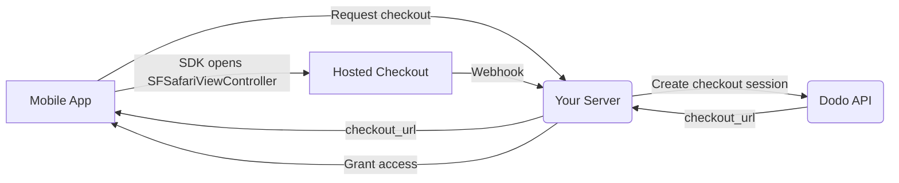

## 介绍

Dodo Payments 使开发者能够在 iOS 应用中销售数字商品和服务，处理复杂的方面，如税务合规、货币转换和支付。此综合指南详细说明了如何将 Dodo Payments 集成到您的 iOS 应用中，特别是针对 SaaS 工具、内容订阅和数字实用程序。

## 概述

Dodo Payments 作为您的 **Merchant of Record (MoR)**，管理您数字业务的关键方面：

<Tabs>
<Tab title="What We Handle">
- 税收征收与缴纳（增值税、商品及服务税及其他地区税）
- 根据政策和本地支付方式进行全球支付
- 货币兑换与外汇
- 拒付与防欺诈
- 最终客户开票与收据
- 遵守地区法规
</Tab>

<Tab title="What You Get">
- 提供统一的 Web 与移动平台 API
- 支持应用内结账（UPI、卡片、钱包、先买后付）
- 支持全球支付（Payoneer、Wise、本地银行转账）
- 分析与报告仪表盘
- 安全的支付处理
</Tab>
</Tabs>

## 使用案例

<CardGroup cols={2}>
<Card title="Subscriptions" icon="repeat">
- 高级内容或功能访问
- 提供灵活选项的周期性计费、免费试用、按比例计费、升级或降级
</Card>

<Card title="Courses and Learning" icon="graduation-cap">
- 按课程付费访问
- 捆绑内容包
- 终身或可续订许可
- 进度跟踪集成
</Card>

<Card title="Digital Downloads" icon="download">
- 一次性购买（PDF、音乐、工具）
- 数字资产交付
- 许可证密钥管理
</Card>

<Card title="SaaS Tools" icon="screwdriver-wrench">
- 软件即服务订阅
- 基于使用量计费
- 团队与企业计划
</Card>
</CardGroup>

## 集成流程

您的应用通过
[iOS checkout SDK](/developer-resources/sdks/ios)打开 Dodo 托管的结账页面，该页面会在
`SFSafariViewController`中呈现，并返回类型化结果。

<Warning>
请使用 SDK，而不要将结账页面嵌入到 `WebView` 中。Apple Pay 仅
在真实的浏览器界面中可用，因此 `WebView` 会悄然导致钱包
转化率下降，而在 `WebView` 中进行支付流程也是导致 App
Store 审核被拒的常见原因。
</Warning>

### 集成步骤

<Steps>
<Step title="Mobile App to Your Server">
您的应用会向您自己的后端请求结账 URL，并使用
已登录用户的会话令牌进行身份验证。
</Step>

<Step title="Your Server to Dodo API">
您的后端使用 API key 创建一个[结账会话](/developer-resources/checkout-session)，
并将 `checkout_url` 返回给应用。

<Warning>
请在您的服务器上创建结账会话，切勿在应用中创建。嵌入应用二进制文件中的 API key
可能会从应用包中被提取出来。
</Warning>
</Step>

<Step title="Mobile App Opens Checkout">
将 `checkout_url` 传递给 `DodoCheckout.start(...)`。SDK 会在
`SFSafariViewController` 中呈现该页面，并在客户完成或关闭结账流程后
返回类型化结果。
</Step>

<Step title="Dodo Payments to Your Server">
付款成功或订阅激活后，Dodo Payments 会调用您的 webhook 端点。
</Step>

<Step title="Your Server Grants Access">
请根据该 webhook 解锁已购买的内容，而不要根据应用收到的结果进行解锁。SDK 结果是
UI 提示，而不是付款凭证。
</Step>
</Steps>

<CardGroup cols={2}>
<Card title="iOS Checkout SDK" icon="apple" href="/developer-resources/sdks/ios">
  Swift 的安装步骤和完整的 `start(...)` 契约。
</Card>
<Card title="Mobile Integration Guide" icon="mobile" href="/developer-resources/mobile-integration">
  端到端流程，以及适用于 Android、React Native 和 Flutter 的相同契约。
</Card>
</CardGroup>

## 区域可用性

Dodo Payments 仅在 Apple 明确允许外部付款，或监管机构或法院命令要求提供外部付款的 App Store 区域启用替代应用内购买流程。

### 支持的区域

<AccordionGroup>
<Accordion title="United States">
在当前法院命令及 Apple 更新后的指南允许的范围内提供支持。

- 根据特定的法院强制规定提供
- 取决于 Apple 是否遵守法律要求
- 必须遵循 Apple 的实施指南
</Accordion>

<Accordion title="European Union (EU) App Store">
通过 Apple 的 EU Alternative Terms 和 External Purchase Entitlement 提供支持。

- 通过 Apple 的 EU Alternative Terms 启用
- 需要获得 External Purchase Entitlement 批准
- 必须遵守欧盟《数字市场法》要求
</Accordion>

<Accordion title="South Korea">
通过适用于仅面向韩国的二进制文件的 StoreKit External Purchase Entitlement 提供支持。

- 可通过 StoreKit External Purchase Entitlement 使用
- 需要特定于韩国的应用二进制文件
- 必须遵守韩国电信法
</Accordion>
</AccordionGroup>

<Warning>
在为任何店面启用 Dodo Payments 之前，请务必查看并遵守 Apple 针对各区域的 entitlement 和 App Store Connect 要求。在不受支持的区域使用替代支付流程，可能导致应用被拒或下架。
</Warning>

<Note>
对于某些商业模式（例如服务或特定类别的内容），Apple 可能根本不要求使用应用内购买（IAP）。Dodo Payments 同样支持这些模式。请务必核实您的应用分类和 Apple 的最新指南，以确定 IAP 是否是您使用场景的强制要求。
</Note>

### 了解更多

如需详细了解全球政策、法律先例以及规避 App Store 费用的策略，请参阅我们的综合指南：

<Card title="Bypassing App Store & Play Store Fees: A Strategic and Legal Playbook" icon="shield-check" href="/features/bypassing-app-store-fees">
了解您可以在哪里以及如何合法实施替代支付流程，并获取最新的区域指南和合规建议。
</Card>