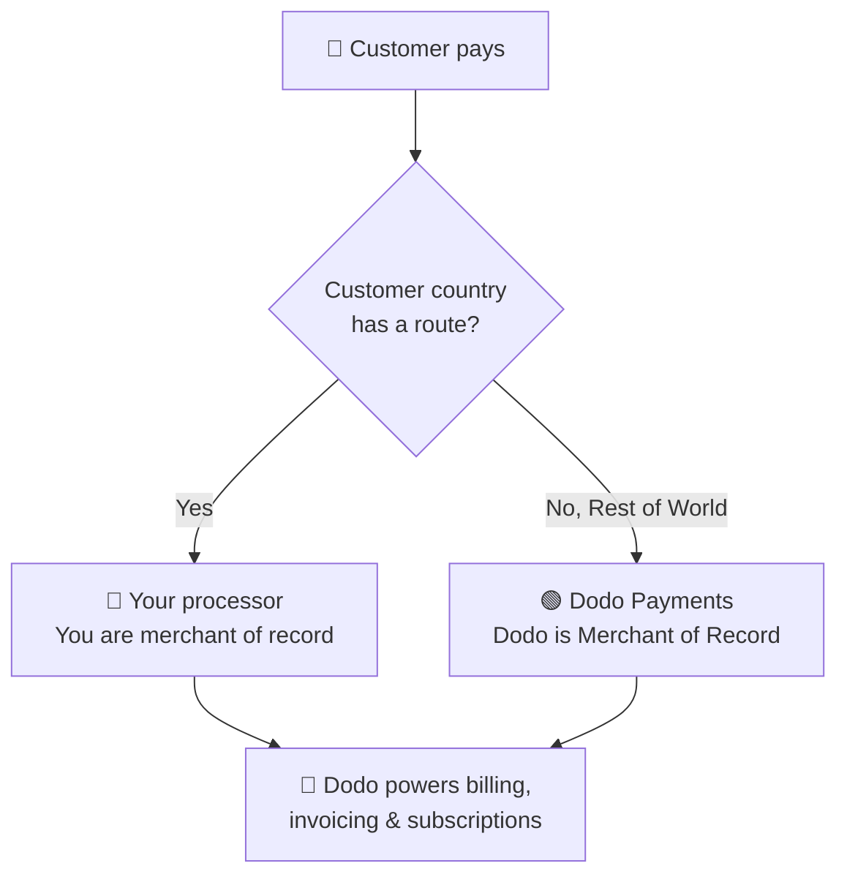

**自带支付处理器 (BYOP)** 允许您连接自己的支付处理器 —— 目前支持 **Stripe** 或 **Adyen**，未来将支持更多处理器 —— 并继续使用 Dodo Payments 处理交易时的所有事务：产品、订阅、许可证密钥和权限引擎、开票、客户门户和分析。

您可以根据每个客户所在的国家决定支付由 **您的处理器**（您保持该路线的商家记录身份）还是 **Dodo Payments** 作为全方位服务的商家记录处理。对于未明确路由的国家，默认使用 Dodo。

<CardGroup cols={2}>
<Card title="Route by geography" icon="globe">
将特定国家的支付发送到您自己的处理器，其他则由 Dodo 处理。
</Card>

<Card title="Keep your processor accounts" icon="plug">
继续使用您现有的 Stripe 或 Adyen 帐户和关系。
</Card>

<Card title="Stay the merchant of record" icon="building">
在您自己的路线上，您仍然是法律销售商，并控制税务、争议和付款。
</Card>

<Card title="One billing layer" icon="layer-group">
Dodo 为跨两种路线的产品、订阅、发票和分析提供支持。
</Card>
</CardGroup>

## BYOP 与 Dodo 作为商家记录

当您启用 BYOP 时，您可以选择如何处理每笔支付。这两种模式可以并行运行，根据客户国家进行路由。

| 功能 | Dodo 作为商家记录 | 自带支付处理器 |
|---------|----------------------------|--------------------------|
| 法律销售商 | Dodo Payments | 您的公司 |
| 税务（增值税、商品及服务税和销售税） | 计算、收集并为您提交 | 您注册、收集并提交 |
| 退款和欺诈 | 由 Dodo 处理责任和保护 | 您使用您的处理器工具自行管理 |
| PCI 合规 | 由 Dodo 处理 | 您管理 |
| 支付方式 | 30 多种全球及本地，多币种 | 仅限卡（信用/借记） |
| 支出 | 汇总的全球支付 | 直接从您的处理器支付 |
| 设置 | 简单，即刻上线 | 适中，添加密钥和路由 |
| 最适合 | 全球销售，轻松合规 | 现有处理器和区域控制 |

<Tip>
常见的设置是**混合**：将您已注册实体和处理器的国家（例如，您的本地市场）路由到您自己的处理器，其他地区由 Dodo 处理为商家记录。
</Tip>

## 支持的处理器

今天您可以连接 **Stripe** 或 **Adyen**。更多处理器支持即将到来。

<CardGroup cols={2}>
<Card title="Stripe" icon="stripe" />
<Card title="Adyen" icon="/images/logos/adyen.svg" />
</CardGroup>

<Note>
通过您自己的处理器路由的支付目前仅支持**信用卡和借记卡**。我们很快会增加更多支付方式。
</Note>

<Warning>
**Stripe** 和 **Adyen** 均要求在您的帐户上启用**原始卡 API 访问**，以使 Dodo 可以在您的处理器上启动账单。每个处理器根据请求授予此权限 —— 在连接前通过联系处理器支持安排此事。详见 [Stripe](/features/byop/stripe) 和 [Adyen](/features/byop/adyen) 指南。
</Warning>

<Info>
连接是在**每个环境**中配置的。您在 **测试模式**（沙盒）中连接的处理器与 **实时模式**（生产）中连接的是分开的；如果您想在上线前进行测试，请设置二者。设置向导遵循您的仪表板的全局测试/实时切换。
</Info>

## 设置 BYOP

在仪表板中打开 **设置 → BYOP**，然后在 *自带支付处理器* 卡上选择 **配置** 以启动设置向导。

<Frame>

</Frame>

<Steps>
<Step title="Choose a payment processor">
选择要连接的处理器，**Stripe** 或 **Adyen**，然后继续。

<Frame>

</Frame>
</Step>

<Step title="Connect your account">
给连接命名**提供商名称**（当您有来自同一处理器的多个帐户时很有用，例如 *Stripe US* 和 *Stripe UK*），然后输入您的处理器的 **Secret Key**（对于 Stripe，您的 `sk_...` key）。

对于 **Adyen**，还需输入您的 **Merchant Account** 标识符。

<Frame>

</Frame>

保存将创建连接并生成唯一的 **Webhook Endpoint**。将该 URL 添加为处理器仪表板中的 Webhook 目的地，然后将 **Webhook 签名秘密** 粘贴回 Dodo 完成：

- **Stripe**: 粘贴您添加的 Webhook 端点的签名秘密。
- **Adyen**: 从 *Customer Area → Webhooks* 粘贴 **HMAC 密钥**。

<Note>
您的秘密密钥会被安全存储，保存后无法查看或更改。您只需在处理器中配置 Dodo 生成的 Webhook URL；您不会直接与基础设施进行交互。
</Note>

<Tip>
保存后使用 **Verify connection** 来对您的处理器进行测试调用，并确认密钥和 Webhook secret 在上线前有效。
</Tip>
</Step>

<Step title="Configure payment routing">
添加 **路由规则**，将客户国家映射到处理器。每个国家可路由到一个处理器。

- **您的处理器**处理您分配给它的国家的支付。
- **Dodo Payments** 处理**世界其他地区**（您未明确路由的每个国家）的支付，作为商家记录。

<Frame>

</Frame>

使用 **Add Route** 将一个或多个国家分配给处理器。

<Frame>

</Frame>

<Info>
**路由指南**
- “世界其他地区”涵盖了上述未列出的所有国家。
- Dodo Payments MoR 路线自动处理合规和税务。
- 您自己的处理器路线需要单独配置税务（如有需要）。
</Info>
</Step>

<Step title="Configure invoice information">
对于通过您自己的处理器进行路由的支付，**您** 是发票上的卖家。输入应出现在那些发票上的商业信息：

- **注册公司名称**（必填）
- **税务 ID**（EIN, SSN 等；可选，并可对美国 EINS 进行格式验证）
- **帐单描述**（必填）：客户在银行对账单上看到的信息（5 到 22 个字符）
- **注册地址**（必填）：开始键入以搜索并自动填充您的地址
- **隐私政策**和 **服务条款** 链接（必填）

实时 **发票标题预览** 显示详细信息的呈现方式。这些详细信息**仅适用于**通过您自己的处理器处理的发票；Dodo 路由的支付继续使用 Dodo 的商家记录详细信息。

<Frame>

</Frame>
</Step>

<Step title="Review and finish">
查看您的处理器连接、路由规则和发票详细信息。确认路由和账单详细信息正确无误，然后选择 **完成设置**。

<Frame>

</Frame>
</Step>
</Steps>

配置完成后，BYOP 卡显示 **编辑配置**，您可以随时返回到仅 MoR 模式，并使用 **编辑路由规则**。

<Frame>

</Frame>

## 路由工作原理

路由由支付时的**客户国家**决定。该逻辑适用于单次支付、结账会话和订阅注册。续订时会重用创建订阅时使用的处理器（参见[订阅](#subscriptions)）。

在由 **您的处理器** 处理的路由上：

- 支付由**您的**处理器帐户在结算货币中处理。
- Dodo 不计算或收取**任何税款**；您需负责该路线上税收事宜。
- 发票使用您配置的**商业详细信息和帐单描述**，无商家记录引用。
- 支出**直接支付给您**，由您的处理器结算；Dodo 的钱包不涉及资金流动。

在由 **Dodo** 处理的路由上（世界其他地区），Dodo 完全作为您的商家记录，处理税务、合规、争议、欺诈和汇总支付。

## 订阅

订阅停留在创建时使用的处理器上。续订时，Dodo 使用购买订阅时使用的相同支付处理器进行扣费，重用与其关联的支付授权。路由规则不会在每次续订时重新评估。

## 查看哪个处理器处理了支付

BYOP 配置完成后，**支付**和**争议**表格会在每行旁显示处理器图标（Stripe、Adyen 或 Dodo），支付和争议详细页面会包含 **支付处理器** 字段，以便您始终可以知道哪条路线处理了某笔交易。

## 退款、争议和支付

<Tabs>
<Tab title="Refunds">
您可以照常从 Dodo 仪表板发起退款。对于通过您自己的处理器进行路由的支付，退款在该处理器上执行；对于 Dodo 路由的支付，Dodo 处理退款。
</Tab>

<Tab title="Disputes">
Dodo 仪表板仅显示 **Dodo 处理的**支付争议。

> 此处仅显示 Dodo 处理的争议。在您自己的处理器（例如 Stripe）上的争议在该处理器的仪表板上进行管理。

仅针对 Dodo 处理的争议可用证据上传、接受和挑战操作。您处理器上的争议使用各自的工具进行管理。
</Tab>

<Tab title="Payouts">
对于您自己的处理器路由，处理器直接支付给您；这些支付不会出现在 Dodo 中。

> 这里只显示 Dodo 支出。您自己处理器上的支付在该处理器中进行。

Dodo 支出（对于世界其他地区 MoR 规模）遵循标准的 [支付结构](/features/payouts/payout-structure)。
</Tab>
</Tabs>

## 分析

收入、税务和订阅分析包含**两种**路由，使您能够看到完整的账单。争议和支出小部件仅显示 **Dodo 处理的** 活动，并带有指示那些活动在您自己的处理器仪表板中的横幅。

## 账单费用

Dodo 对通过您自己的处理器路由的支付收取少量 **BYOP 账单费用**，因为 Dodo 仍为这些交易提供产品、订阅、开票和分析。它显示为 `byop_fee` 行在您的余额账本中。默认费率为 **0.5%**；启用 BYOP 的确切费率作为您帐户的一部分确认。有关详细信息，请 [联系我们](mailto:founders@dodopayments.com)。

## 常见问题

<AccordionGroup>
<Accordion title="Which processors can I connect?">
目前支持 Stripe 和 Adyen，很快会支持更多处理器。两者都需要在您的帐户上启用**原始卡 API 访问**，具体细节可通过联系处理器支持安排。详见 [Stripe](/features/byop/stripe) 和 [Adyen](/features/byop/adyen) 指南。
</Accordion>

<Accordion title="Can I route only some countries to my processor?">
是的。将特定国家分配到您的处理器，其他地区作为 **世界其他地区**，由 Dodo 处理为商家记录。每个国家仅路由到一个处理器。
</Accordion>

<Accordion title="Who is the merchant of record on BYOP routes?">
是您。在由自带处理器处理的线路上，您仍然是法律销售商，并负责处理这些交易的税务、退款、PCI 合规和支付。
</Accordion>

<Accordion title="Does Dodo calculate tax on my processor's routes?">
不。在通过您自己的处理器处理的线路上没有计算或收取税款；您管理这些交易的税务。Dodo 继续处理 Dodo 路由（MoR）支付的税务。
</Accordion>

<Accordion title="What happens to active subscriptions if I disable a processor?">
在该处理器上的续订将失败，并在仪表板中显示为失败的支付。重新启用处理器以恢复续订。
</Accordion>
</AccordionGroup>

## 开始使用

<Card title="What is Merchant of Record?" icon="building-columns" href="/features/mor-introduction">
了解 Dodo 的全方位商家记录模型的工作原理。
</Card>
