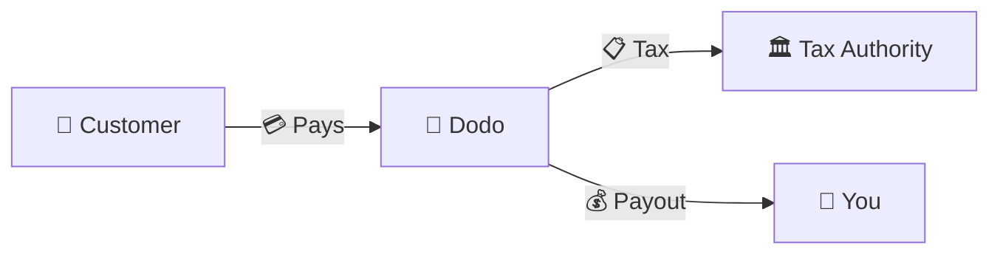
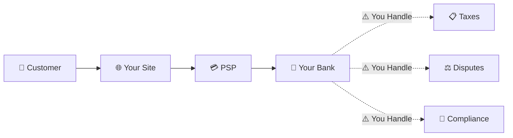
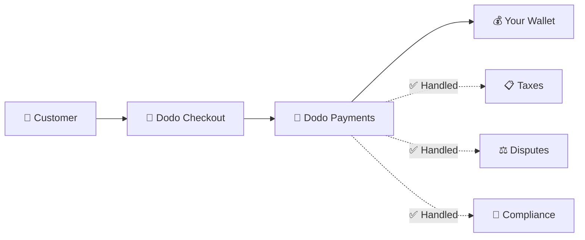
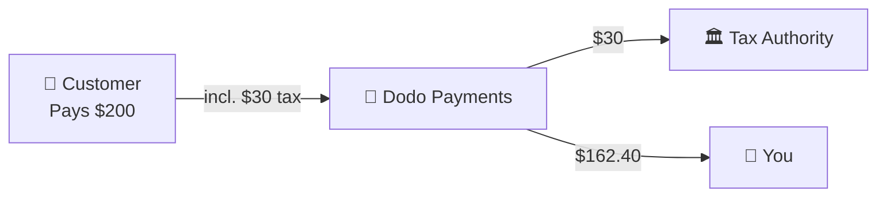

Dodo Payments 作为 **记录商户 (MoR)** — 我们成为您的数字产品的合法销售方，负责支付、税务、欺诈和合规事务，让您可以专注于开发产品。

<CardGroup cols={3}>
<Card title="220+ Regions" icon="globe">
税务合规自动处理
</Card>

<Card title="30+ Payment Methods" icon="credit-card">
卡片、钱包和本地支付方式
</Card>

<Card title="Zero Tax Filing" icon="file-invoice">
我们处理所有汇款
</Card>
</CardGroup>

## 什么是记录商户?

**记录商户** 是出现在客户信用卡账单上的法人机构，负责交易。当您使用 Dodo Payments 作为您的 MoR 时：

- **我们是合法销售方** — Dodo 出现在银行对账单和收据上
- **您是产品创造者** — 您开发、定价并交付产品
- **我们处理后台事务** — 税务、争议、合规和计费支持
- **您收到净收入** — 收入直接存入您的账户

<Note>
将记录商户视作聘请了一个全球财务团队，处理每个国家的发票、税务和账单 — 只需专注你的产品即可。
</Note>

## 为什么要使用记录商户?

全球销售数字产品意味着需要应对欧洲的增值税，澳大利亚的商品及服务税，美国的销售税及无数其他要求。每个司法管辖区都有不同的规则、税率、门槛和申报截止日期。

| 您的责任 | 没有 MoR | 使用 Dodo 作为 MoR |
|---------------------|:-----------:|:----------------:|
| 增值税/GST 注册 | ❌ 您 | ✅ Dodo |
| 税款计算 | ❌ 您 | ✅ Dodo |
| 税务申报和汇款 | ❌ 您 | ✅ Dodo |
| 退款责任 | ❌ 您 | ✅ Dodo |
| PCI 合规 | ❌ 您 | ✅ Dodo |
| 多币种支持 | ❌ 复杂 | ✅ 内置 |
| 本地支付方式 | ❌ 集成每个 | ✅ 包含 30+ 种 |

<Tip>
**示例**：向法国客户销售 €50/月的订阅？

**没有 MoR**：注册法国增值税，收取 €60（20% 增值税），每季度提交法国税务申报，处理审计—用法语。

**使用 Dodo**：我们收取 €60，将 €10 增值税汇给法国，并向您支付 €50 减去费用。您只需编写代码。
</Tip>

## PSP 与 MoR 的关键区别

理解 **支付服务提供商**（例如 Stripe）和 **记录商户** 之间的区别至关重要。

### 支付服务提供商 (PSP)

PSP 处理交易，但您仍是合法销售方：

<Warning>
使用 PSP，**您** 负责税务注册、收集、申报和汇款，在每个有客户的司法管辖区。
</Warning>

### 记录商户 (Dodo)

MoR 作为合法销售方，全面处理合规问题：

<Check>
使用 Dodo 作为 MoR，我们处理税务、争议和合规问题。您收到净支付，无需任何文书工作。
</Check>

### 逐项比较

| 方面 | PSP (Stripe 等) | MoR (Dodo) |
|--------|:------------------:|:----------:|
| 法定销售方 | 您的公司 | Dodo |
| 客户账单上 | 您的名字 | Dodo |
| 税务注册 | ❌ 您 | ✅ Dodo |
| 税款计算 | ❌ 您 | ✅ Dodo |
| 税务汇款 | ❌ 您 | ✅ Dodo |
| 退款风险 | ❌ 您 | ✅ Dodo |
| PCI 合规 | ❌ 您 | ✅ Dodo |
| 全球设置 | 复杂 | 简单 |

<Info>
**重要**：PSPs 和 MoRs 都处理支付流程。关键区别在于 **谁对税务合规和交易责任承担法律责任**。
</Info>

## 税务合规如何运作

Dodo 全面自动处理整个税务生命周期：

<Steps>
<Step title="Customer Location">
我们检测客户的国家并确定适用的税务规则——增值税、GST、销售税或其他本地要求。
</Step>

<Step title="Rate Calculation">
根据产品类型、客户位置和 B2B/B2C 身份计算正确的税率。拥有有效增值税号的欧盟企业客户适用反向收费。
</Step>

<Step title="Collection at Checkout">
税款在结账时清晰展示和收集。客户可以准确看到他们支付的内容。
</Step>

<Step title="Filing & Remittance">
我们按时向相关当局提交申报并支付已收税款。您无需查看任何税务表单。
</Step>
</Steps>

## 收入流

以下是从客户到您的账户资金流动的方式：

### 示例支付拆分

| 项目 | 金额 |
|-----------|-------:|
| 客户支付 | $200.00 |
| 销售税 (15% 增值税) | −$30.00 |
| Dodo 平台费 (4%) | −$8.00 |
| 支付处理 | −$0.60 |
| **您的收入** | **$162.40** |

## 何时选择 MoR vs. PSP

<Tabs>
<Tab title="Choose Dodo (MoR)">
**Dodo Payments 是理想选择如果您：**

- 销售数字产品、SaaS 或订阅
- 拥有跨多个国家的客户
- 想避免税务注册的麻烦
- 更喜欢可预测的外包合规
- 重视市场速度而非最大控制
- 不想处理争议和欺诈
</Tab>

<Tab title="Consider a PSP">
**PSP 可能适合您如果您：**

- 主要在一个国家运营
- 拥有内部财务和合规团队
- 需要对结账 UX 绝对控制
- 在非常薄的利润下运作
- 销售实体商品 (MoR 聚焦于数字)
</Tab>
</Tabs>

<Note>
许多企业从 PSP 开始，随着国际扩张转向 MoR。Dodo 提供迁移支持，使这一过渡顺利进行。
</Note>

## 常见问题解答

<AccordionGroup>
<Accordion title="What appears on my customer's credit card statement?">
Dodo Payments 作为商户。我们在字符限制允许的情况下添加您的产品/品牌信息，客户收到的详细收据显示您的产品信息。
</Accordion>

<Accordion title="Do I still own the customer relationship?">
是的。您可以控制定价、品牌、产品交付和直接沟通。Dodo 处理计费机制，但客户知道他们是向您购买。您的品牌在结账、电子邮件和发票中显著出现。
</Accordion>

<Accordion title="How does B2B VAT reverse charge work?">
对于欧盟的 B2B 销售，客户可以在结账时输入他们的增值税号。我们验证并自动应用反向收费——税收转移到买方的增值税申报中，而不是被收取。
</Accordion>

<Accordion title="Can I use my own payment processor?">
是的。借助 [Bring Your Own Processor (BYOP)](/features/byop)，您可以连接自己的 Stripe 或 Adyen 账户，并通过该账户路由来自所选国家/地区的支付，同时由 Dodo Payments 继续为产品、订阅、开票和分析提供支持。对于您未明确设置路由的国家/地区，支付会继续通过 Dodo Payments 处理，由我们作为完整服务的 Merchant of Record，因此我们可以承担这些路由上的税务和欺诈责任。
</Accordion>

<Accordion title="How do refunds work?">
从您的控制面板启动退款。我们通过客户的原支付方式和货币处理退款。税额会自动调整和核对。
</Accordion>

<Accordion title="What about my income tax?">
Dodo 处理客户交易的 **销售税**（增值税、GST、销售税）。您仍负责您业务的所得税、企业税和您收到的付款的税务责任。
</Accordion>

<Accordion title="Which countries can I sell to?">
我们接受来自 220 多个国家和地区的支付，并持续扩展。查看完整列表：

<Card title="Supported Regions" icon="globe" href="/miscellaneous/list-of-countries-we-accept-payments-from">
查看我们接受支付的所有 220 个国家和地区。
</Card>
</Accordion>
</AccordionGroup>

## 开始

<CardGroup cols={2}>
<Card title="Create Account" icon="rocket" href="https://app.dodopayments.com/signup">
免费注册，几分钟内接受全球支付。
</Card>

<Card title="MoR vs PG Deep Dive" icon="scale-balanced" href="/features/mor-vs-pg">
详细比较包含示例和用例。
</Card>

<Card title="Acceptance Policy" icon="building-shield" href="/miscellaneous/merchant-acceptance">
了解我们支持哪些企业。
</Card>

<Card title="Talk to Us" icon="envelope" href="mailto:founders@dodopayments.com">
从我们的团队获得个性化指导。
</Card>
</CardGroup>
