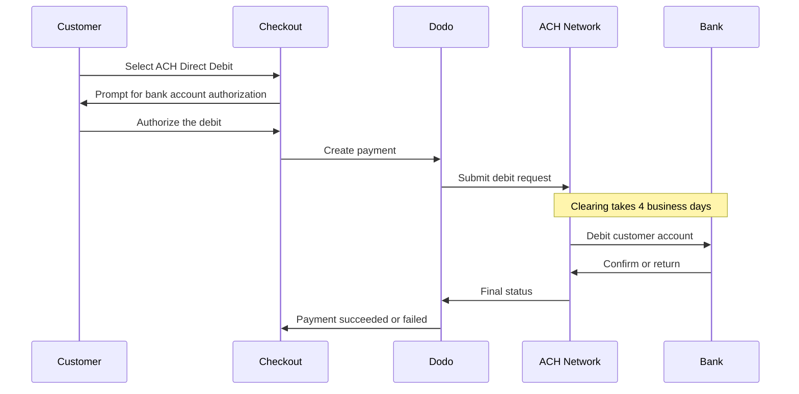

ACH Direct Debit 允许美国客户直接从其银行账户付款，而无需使用卡。它通过 Automated Clearing House 网络处理，并在 USD 结账中提供用于一次性付款。

## 为什么提供 ACH Direct Debit？

<CardGroup cols={3}>
<Card title="Lower Processing Cost" icon="piggy-bank">
银行扣款的处理成本通常低于卡支付，尤其适用于高价值订单。
</Card>

<Card title="No Card Required" icon="building-columns">
触达偏好从银行账户付款，或不想在大额购买中使用卡的美国客户。
</Card>

<Card title="Higher Value Orders" icon="chart-line">
与卡支付相比，ACH 的成本优势会随着订单金额增加而扩大，因此非常适合大额一次性购买。
</Card>
</CardGroup>

## 概览

| 详情 | 值 |
| :----- | :---- |
| **结算货币** | USD |
| **支持的国家/地区** | 美国 |
| **订阅** | 否 |
| **最低金额** | $0.50 |
| **结算** | 4 个工作日 |

<Warning>
ACH Direct Debit 不是即时付款。付款需要 **4 个工作日**才能确认，因此不要将授权视为结算完成——只有当付款达到 succeeded 状态后才能履约。
</Warning>

## 工作原理



## 客户体验

1. 客户在结账时选择 ACH Direct Debit
2. 客户授权从其美国银行账户扣款
3. 付款提交至 ACH 网络并进入 processing 状态
4. 清算在接下来的几个工作日内完成
5. 付款进入 succeeded 状态；如果银行退回付款，则进入失败状态

<Info>
由于清算是异步的，请依靠 [webhooks](/developer-resources/webhooks) 了解最终结果，而不要依赖结账重定向。重定向成功仅表示客户已授权扣款。

付款提交扣款后会发出 `payment.processing`，清算完成后则会发出 `payment.succeeded` 或 `payment.failed`。只有 `payment.succeeded` 状态下才可以安全履约。
</Info>

## 可用性

满足以下所有条件时，ACH Direct Debit 会在结账时显示：

- **结算货币**为 `USD`
- **结算国家/地区**为 `US`
- 交易为**一次性付款**

<Note>
ACH Direct Debit 不支持订阅。其多日清算窗口不适合周期性计费。对于周期性付款，请使用卡或其他支持订阅的方式——请参阅 [支付方式概览](/features/payment-methods)。
</Note>

## 配置

```javascript
const session = await client.checkoutSessions.create({
  product_cart: [{ product_id: 'pdt_123', quantity: 1 }],
  allowed_payment_method_types: ['ach', 'credit', 'debit'],
  billing_currency: 'USD',
  billing_address: {
    country: 'US',
    zipcode: '94102'
  },
  return_url: 'https://example.com/success'
});
```

<Note>
ACH Direct Debit 要求**结算货币**为 **USD**，且**结算地址**位于美国。如果您使用其他货币标价，请启用 [Adaptive Currency](/features/adaptive-currency)，这样美国客户将以 USD 结算，并可使用 ACH。
</Note>

## API 方法类型

| 类型 | 方法 | 国家/地区 |
| :--- | :----- | :------ |
| `ach` | ACH Direct Debit | 美国 |

## 退款和争议

ACH 付款的退款和争议使用与其他所有支付方式相同的 API 和 dashboard 流程——无需实现 ACH 专属处理逻辑。

<Warning>
由于 ACH 付款在看似完成后仍可能被客户的银行退回，因此在原始付款达到 succeeded 状态之前，请避免发起退款。
</Warning>

## 测试

<Steps>
<Step title="Enable test mode">
使用您的 Dodo Payments 测试 API 密钥。
</Step>

<Step title="Set currency and billing address">
将结算货币设置为 `USD`，并将结算地址所在国家/地区设置为 `US`。
</Step>

<Step title="Include `ach` in allowed methods">
在 `allowed_payment_method_types` 中传入 `ach`，或完全省略该字段以显示所有符合条件的方式。
</Step>

<Step title="Enter the test bank details">
输入下方的一组测试路由号码和账户号码，然后确认您的 webhook handler 收到了最终付款状态。
</Step>
</Steps>

### 测试银行账户

客户会直接在结账时输入其账户号码和路由号码。在测试模式下，使用路由号码 `110000000` 和下方任一账户号码，以触发特定结果。

| 账户号码 | 路由号码 | 行为 |
| :------------- | :------------- | :------- |
| `000123456789` | `110000000` | 付款成功。 |
| `000222222227` | `110000000` | 由于资金不足，付款失败。 |
| `000111111113` | `110000000` | 由于账户已关闭，付款失败。 |
| `000111111116` | `110000000` | 由于找不到账户，付款失败。 |
| `000333333335` | `110000000` | 由于账户未授权扣款，付款失败。 |
| `000444444440` | `110000000` | 由于货币无效，付款失败。 |
| `000555555559` | `110000000` | 付款成功，随后触发争议。 |
| `000000000009` | `110000000` | 付款会无限期保持 processing 状态，适合用于测试待处理状态 UI。 |

<Note>
大多数测试付款会比实际清算窗口快得多地达到最终状态，因此无需等待数天即可验证集成。例外是 `000000000009`，它被设计为保持 processing 状态。
</Note>

## 最佳实践

<AccordionGroup>
<Accordion title="Don't fulfill on authorization">
ACH 授权不等于付款。请等待付款达到 succeeded 状态后再授予访问权限或发货——客户的银行仍可能退回扣款。
</Accordion>

<Accordion title="Set customer expectations at checkout">
告知客户银行付款不会立即完成清算。这样可以减少客户因订单仍处于待处理状态而提交的支持请求。
</Accordion>

<Accordion title="Provide card fallbacks">
始终将 `credit` 和 `debit` 与 `ach` 一起提供，以便需要即时访问产品的客户选择更快速的方式。
</Accordion>

<Accordion title="Use ACH for high-value one-time purchases">
ACH 的成本优势会随着订单金额增加而扩大，因此它最适合大额一次性购买，而不是小额购买。
</Accordion>
</AccordionGroup>

## 故障排除

<AccordionGroup>
<Accordion title="ACH not appearing at checkout">
**检查：**
1. 结算货币是否设置为 `USD`？
2. 客户的结算国家/地区是否为 `US`？
3. `ach` 是否包含在 `allowed_payment_method_types` 中？
4. 这是一次性付款吗？ACH 不适用于订阅。

**解决方案：** 暂时移除 `allowed_payment_method_types` 以查看所有符合条件的方式，然后在 API 请求中验证结算货币和地址所在国家/地区。
</Accordion>

<Accordion title="ACH not appearing on a subscription checkout">
**原因：** ACH Direct Debit 仅适用于一次性付款。

**解决方案：** 对于周期性计费，请使用卡或其他支持订阅的方式。
</Accordion>

<Accordion title="Payment stuck in processing">
**原因：** 这是预期行为。ACH 付款会在整个清算窗口内保持 processing 状态，时间远长于卡支付。

**解决方案：** 等待最终 webhook。不要重试付款——重试可能导致客户被扣款两次。
</Accordion>

<Accordion title="Payment failed after initially succeeding at checkout">
**原因：** 客户的银行退回了扣款——最常见的原因是资金不足或账户已关闭。

**解决方案：** 将付款视为失败，并要求客户使用其他支付方式重试。始终以 succeeded 状态作为履约条件，以避免此问题。
</Accordion>
</AccordionGroup>

## 相关页面

<CardGroup cols={2}>
<Card title="Payment Methods Overview" icon="credit-card" href="/features/payment-methods">
查看所有支持的支付方式。
</Card>

<Card title="Adaptive Currency" icon="globe" href="/features/adaptive-currency">
货币支持和自动转换。
</Card>

<Card title="Checkout Guide" icon="book" href="/developer-resources/checkout-session">
完整的结账实现指南。
</Card>

<Card title="Webhooks" icon="webhook" href="/developer-resources/webhooks">
异步处理延迟的付款确认。
</Card>
</CardGroup>
