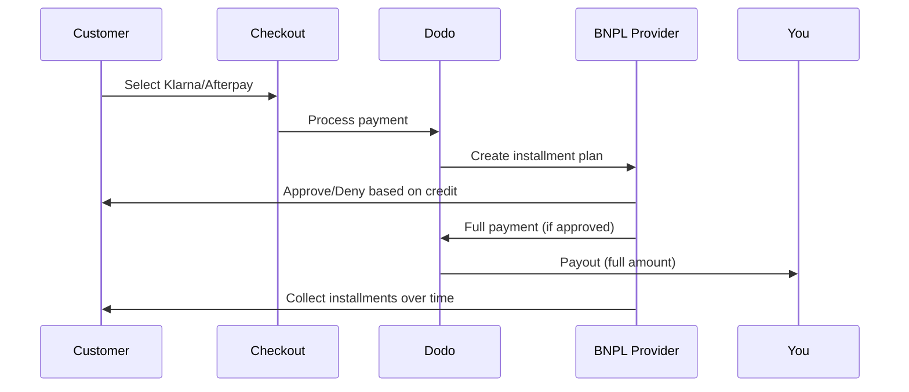

先买后付（BNPL）使客户能够将购买分成无利息的分期付款，这样可以将平均订单价值提高20-50%，并使合格交易的转化率提高10-30%。

## 为什么要提供BNPL？

<CardGroup cols={3}>
<Card title="Higher AOV" icon="chart-line">
当顾客可以分期付款时，他们会花更多钱。平均订单价值增加20-50%。
</Card>

<Card title="Better Conversion" icon="percent">
在结账时移除支付障碍。高价商品的转化率提高10-30%。
</Card>

<Card title="Zero Risk" icon="shield-check">
BNPL提供商负责信用风险与催收。您可以提前收到全额付款。
</Card>
</CardGroup>

## 支持的提供商

### Klarna

| 功能 | 详情 |
| :------ | :------ |
| **可用性** | 美国 + 19 个欧洲国家 |
| **货币** | USD, EUR, GBP, DKK, NOK, SEK, CZK, RON, PLN, CHF |
| **最低限额** | $50.01（或等值货币）|
| **订阅** | 是 |

**支持的国家：** 奥地利、比利时、捷克共和国、丹麦、芬兰、法国、德国、希腊、爱尔兰、意大利、荷兰、挪威、波兰、葡萄牙、罗马尼亚、西班牙、瑞典、瑞士、英国、美国

**支付选项：**
- **分4期付款** — 分为4个无息付款
- **30天内付款** — 30天内全额付款到期
- **融资** — 更长期的分期付款计划

### Afterpay (Clearpay)

| 特性 | 详情 |
| :------ | :------ |
| **可用性** | 美国、英国 |
| **货币** | 美元（USD）、英镑（GBP） |
| **最低金额** | $50.01（或等值） |
| **订阅** | 否 |

**支付选项：**
- **分4期付款** — 每两周分4个无息付款

<Note>
在英国，Afterpay以“Clearpay”运营，但使用相同的API类型 (`afterpay_clearpay`)。
</Note>

### Billie

| 特性 | 详情 |
| :------ | :------ |
| **可用性** | 全球 |
| **货币** | 英镑（GBP） |
| **最低金额** | 无 |
| **订阅** | 否 |

**关于Billie：**
Billie是一个B2B的先买后付解决方案，使企业能够为客户提供灵活的付款条款。它旨在用于买家需要基于发票的付款选项的商业交易。

**支付选项：**
- **发票付款** — 在约定的付款条款内付款
- **灵活条款** — 对企业友好的付款计划

## 配置

### API 方法类型

| 类型 | Provider |
| :--- | :------- |
| `klarna` | Klarna |
| `afterpay_clearpay` | Afterpay / Clearpay |
| `billie` | Billie (B2B) |

### 示例

```javascript
const session = await client.checkoutSessions.create({
  product_cart: [{ product_id: 'pdt_123', quantity: 1 }],
  allowed_payment_method_types: [
    'klarna',
    'afterpay_clearpay',
    'credit',
    'debit'
  ],
  customer: {
    email: 'customer@example.com',
    name: 'Jane Smith'
  },
  billing_address: {
    country: 'US',
    zipcode: '10001'
  },
  return_url: 'https://example.com/success'
});
```

<Warning>
始终将 `credit` 和 `debit` 作为备用方式。并非所有客户都符合 BNPL 资格，低于 Provider 最低金额的交易也不符合条件。
</Warning>

## 交易金额限制

每个 BNPL Provider 都有自己的最低交易金额（有时也有最高交易金额）：

| Provider | 最低金额 | 最高金额 |
| :------- | :------ | :------ |
| Klarna | $50.01 | — |
| Afterpay | $50.01 | — |

超出这些阈值的交易：
- 结账时不会显示 BNPL 选项
- 不会抛出错误 — 选项只是不显示
- 卡支付仍然可用

这是预期行为。如果你的产品价格不太可能落在某个 Provider 支持的范围内，请不要在 `allowed_payment_method_types` 中包含该 BNPL 方法。

## 分期付款的工作方式



**要点：**
- 你会从 BNPL Provider 处**预先收到全额付款**
- BNPL Provider 负责处理**信用风险和催收**
- 客户通常通过 **4 期分期**直接向 Provider 付款
- 分期付款失败不会产生**拒付** — 这是 Provider 承担的风险

## 测试

### Klarna 测试数据

在测试模式下使用以下信息：

| 字段 | 已批准 | 被拒绝 |
| :---- | :------- | :----- |
| **出生日期** | 07-10-1970 | 07-10-1970 |
| **名字** | Test | Test |
| **姓氏** | Person-us | Person-us |
| **Email** | customer@email.us | customer+denied@email.us |
| **街道** | Amsterdam Ave | Amsterdam Ave |
| **门牌号** | 509 | 509 |
| **城市** | New York | New York |
| **州** | New York | New York |
| **邮政编码** | 10024-3941 | 10024-3941 |
| **Phone** | +13106683312 | +13106354386 |

<Note>
交易金额必须至少为 $50，Klarna 才会显示为选项。
</Note>

### Afterpay 测试

<Steps>
<Step title="Select Afterpay">
在结账时选择 Afterpay，然后点击 Pay。
</Step>

<Step title="Successful payment">
使用任何有效的 Email 和送货地址。
</Step>

<Step title="Failed authentication">
要测试失败情况：在重定向页面上关闭 Afterpay 模态框。支付状态将转换为 `requires_payment_method`。
</Step>
</Steps>

## 最佳实践

<AccordionGroup>
<Accordion title="Target high-ticket items">
BNPL 最适合价格为 $100-$1000 的产品。在这个范围内，“分期付款”的价值主张最具吸引力。
</Accordion>

<Accordion title="Show installment amounts">
“分 4 期支付，每期 $25”比“使用 Klarna 支付 $100”更具吸引力。在可能的情况下，显示每期付款金额。
</Accordion>

<Accordion title="Don't force BNPL for low-value products">
低于 $50 时，BNPL 无论如何都不会显示。低于 $100 时，大多数客户更倾向于使用银行卡。应将 BNPL 推广重点放在价格较高的商品上。
</Accordion>

<Accordion title="Collect billing address">
BNPL Provider 需要账单信息来进行信用检查。请确保你的结账流程收集完整的地址信息。
</Accordion>

<Accordion title="Set clear expectations">
客户应了解，他们是在与 Klarna/Afterpay 签订信贷协议，而不是与你签订协议。
</Accordion>
</AccordionGroup>

## 限制

### 不支持订阅
BNPL 支付方式**不支持 recurring payments**。对于订阅产品，请使用银行卡或其他兼容 recurring payments 的方式。

### 基于信用的审批
BNPL Provider 会即时进行信用检查。并非所有客户都会获批。审批率因以下因素而异：
- 客户在 Provider 处的信用记录
- 交易金额
- 客户所在地

### 货币与国家映射

每种货币都限制在其对应的区域内：

| 货币 | 支持的国家 |
| :------- | :------------------ |
| **USD** | 仅限美国 |
| **EUR** | 所有受支持的欧洲国家（奥地利、比利时、捷克共和国、丹麦、芬兰、法国、德国、希腊、爱尔兰、意大利、荷兰、挪威、波兰、葡萄牙、罗马尼亚、西班牙、瑞典、瑞士） |
| **GBP** | 英国和所有受支持的欧洲国家 |

Klarna 支持的其他货币（DKK、NOK、SEK、CZK、RON、PLN、CHF）可在各自对应的国家/地区使用。

<Info>
例如，USD 交易只会向美国客户显示 BNPL 选项。EUR 交易会向所有受支持的欧洲国家/地区的客户显示 BNPL 选项。GBP 交易会向英国和所有受支持的欧洲国家/地区的客户显示 BNPL 选项。
</Info>

| Provider | 支持的货币 |
| :------- | :------------------- |
| Klarna | USD, EUR, GBP, DKK, NOK, SEK, CZK, RON, PLN, CHF |
| Afterpay | USD (US), GBP (UK) |

## 故障排除

<AccordionGroup>
<Accordion title="BNPL not appearing at checkout">
**检查：**
1. 交易金额是否在 Provider 支持的范围内？（Klarna/Afterpay：最低 $50.01）
2. 客户所在地是否在受支持的国家/地区？
3. 货币是否受 BNPL Provider 支持？
4. BNPL 方法是否包含在 `allowed_payment_method_types` 中？

**解决方案：**最常见的情况是交易金额低于最低金额或高于最高金额。请确认金额在 Provider 支持的范围内。
</Accordion>

<Accordion title="Customer denied by BNPL provider">
**原因：**
- 在 Provider 处的信用记录不足
- 现有分期计划过多
- 身份验证失败

**解决方案：**部分客户出现这种情况属于预期行为。请确保提供银行卡备用方式。不要公开具体的拒绝原因。
</Accordion>

<Accordion title="Payment stuck in pending">
**原因：**客户未完成与 BNPL Provider 的身份验证流程。

**解决方案：**支付将超时并失败。客户可以重试或使用其他方式。
</Accordion>
</AccordionGroup>

## 相关页面

<CardGroup cols={2}>
<Card title="Payment Methods Overview" icon="credit-card" href="/features/payment-methods">
查看所有受支持的支付方式。
</Card>

<Card title="Checkout Guide" icon="book" href="/developer-resources/checkout-session">
查看完整的结账实施指南。
</Card>

<Card title="Testing Process" icon="flask" href="/miscellaneous/testing-process">
查看支付方式的所有测试数据。
</Card>

<Card title="Adaptive Currency" icon="globe" href="/features/adaptive-currency">
查看货币支持和转换。
</Card>
</CardGroup>